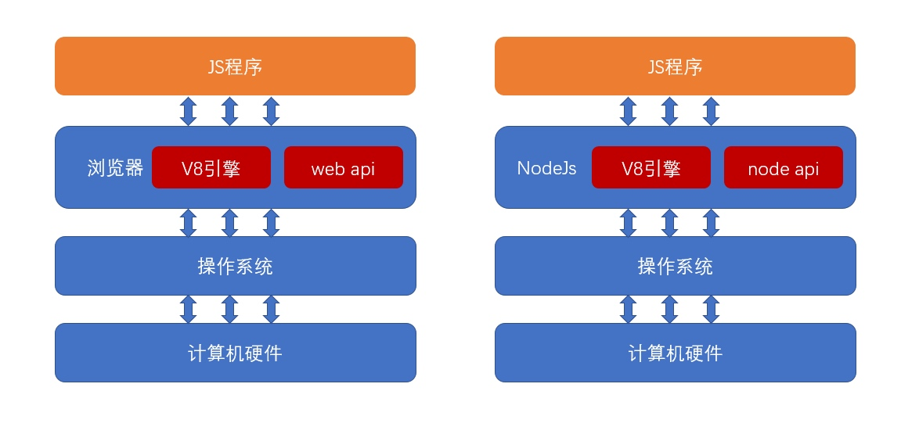
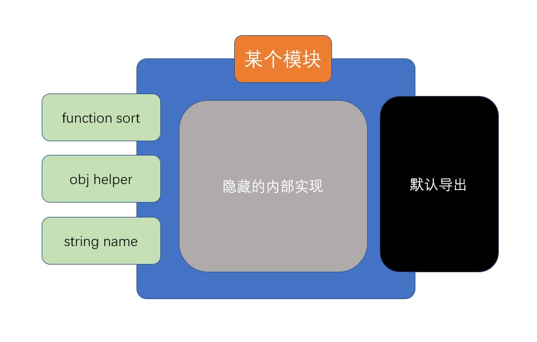

## 一、模块化发展史

### 1. 第一阶段

在 JavaScript 语言刚刚诞生的时候，它仅仅用于实现页面中的一些小效果。那个时候，一个页面所用到的 JS 可能只有区区几百行的代码。

在这种情况下，语言本身所存在的一些缺陷往往被大家有意的忽略，因为程序的规模实在太小，只要开发人员小心谨慎，往往不会造成什么问题。

在这个阶段，也不存在专业的前端工程师，由于前端要做的事情实在太少，因此这一部分工作往往由后端工程师顺带完成

第一阶段发生的大事件：

- 1996 年，NetScape 将 JavaScript 语言提交给欧洲的一个标准制定阻止 ECMA（欧洲计算机制造商协会）
- 1998 年，NetScape 在与微软浏览器 IE 的竞争中失利，宣布破产

### 2. 第二阶段

ajax 的出现，逐渐改变了 JavaScript 在浏览器中扮演的角色。现在，它不仅可以实现小的效果，还可以和服务器之间进行交互，以更好的体验来改变数据。JS 代码的数量开始逐渐增长，从最初的几百行，到后来的几万行，前端程序逐渐变得复杂。后端开发者压力逐渐增加，致使一些公司开始招募专业的前端开发者。

但此时，前端开发者的待遇远不及后端开发者，因为前端开发者承担的开发任务相对于后端开发来说，还是比较简单的，通过短短一个月的时间集训，就可以成为满足前端开发的需要。

究其根本原因，是因为前端开发还有几个大的问题没有解决，这些问题都严重的制约了前端程序的规模进一步扩大：

1. **浏览器解释执行 JS 的速度太慢**
2. **用户端的电脑配置不足**
3. **更多的代码带来了全局变量污染、依赖关系混乱等问题**

上面三个问题，就像是阿喀琉斯之踵，成为前端开发挥之不去的阴影和原罪。在这个阶段，前端开发处在一个非常尴尬的境地，它在传统的开发模式和前后端分离之间无助的徘徊。

第二阶段的大事件：

1. IE 浏览器制霸市场后，几乎不再更新
2. ES4.0 流产，导致 JS 语言 10 年间几乎毫无变化
3. 2008 年 ES5 发布，仅解决了一些 JS API 不足的糟糕局面

### 3. 第三阶段

时间继续向前推移，到了 2008 年，谷歌的 V8 引擎发布，将 JS 的执行速度推上了一个新的台阶，甚至可以和后端语言媲美。摩尔定律持续发酵，个人电脑的配置开始飞跃，突然间，制约前端发展的两大问题得以解决，此时，只剩下最后一个问题还在负隅顽抗，即 ==全局变量污染和依赖混乱== 的问题，解决了它，前端便可以突破一切障碍，未来无可限量。

于是，全世界的前端开发者在社区中激烈的讨论，想要为这个问题寻求解决之道......

2008 年，有一个名叫 Ryan Dahl 小伙子正在为一件事焦头烂额，它需要在服务器端手写一个高性能的 web 服务，该服务对于性能要求之高，以至于目前市面上已有的 web 服务产品都满足不了需求。

经过分析，它确定，如果要实现高性能，那么必须要尽可能的减少线程，而要减少线程，避免不了要实用异步的处理方案。一开始，他打算自己实用 C/C++语言来编写，可是这一过程实在太痛苦。

就在他一筹莫展的时候，谷歌 V8 引擎的发布引起了他的注意，他突然发现，JS 不就是最好的实现 web 服务的语言吗？它天生就是单线程，并且是基于异步的！有了 V8 引擎的支撑，它的执行速度完全可以撑起一个服务器。而且 V8 是鼎鼎大名的谷歌公司发布的，谷歌一定会不断的优化 V8，有这种又省钱又省力的好事，我干嘛还要自己去写呢？

于是，它基于开源的 V8 引擎，对源代码作了一些修改，便快速的完成了该项目。2009 年，Ryan 推出了该 web 服务项目，命名为 nodejs。

从此，JS 第一次堂堂正正的入主后端，不再是必须附属于浏览器的“玩具”语言了。也是从此刻开始，人们认识到，JS（ES）是一门真正的语言，它依附于运行环境（运行时）（宿主程序）而执行。



nodejs 的诞生，便把 JS 中的最后一个问题放到了台前，即 ==全局变量污染和依赖混乱== 问题。要知道，nodejs 是服务器端，如果不解决这个问题，分模块开发就无从实现，而模块化开发是所有后端程序必不可少的内容。

经过社区的激烈讨论，最终，形成了一个模块化方案，即鼎鼎大名的 ==CommonJS== ，该方案，彻底解决了全局变量污染和依赖混乱的问题。该方案一出，立即被 nodejs 支持，于是，nodejs 成为了第一个为 JS 语言实现模块化的平台，为前端接下来的迅猛发展奠定了实践基础。

该阶段发生的大事件：

- 2008 年，V8 发布
- IE 的市场逐步被 firefox 和 chrome 蚕食，现已无力回天
- 2009 年，nodejs 发布，并附带 commonjs 模块化标准

### 4. 第四阶段

CommonJS 的出现打开了前端开发者的思路，既然后端可以使用模块化的 JS，作为 JS 语言的老东家浏览器为什么不行呢？于是，开始有人想办法把 CommonJS 运用到浏览器中，可是这里面存在诸多的困难。办法总比困难多，有些开发者就想，既然 CommonJS 运用到浏览器困难，我们干嘛不自己重新定一个模块化的标准出来，难道就一定要用 CommonJS 标准吗？

于是很快，AMD 规范出炉，它解决的问题和 CommonJS 一样，但是可以更好的适应浏览器环境；相继的，CMD 规范出炉，它对 AMD 规范进行了改进，这些行为，都受到了 ECMA 官方的密切关注......，2015 年，ES6 发布，它提出了官方的模块化解决方案 —— ==ES6 模块化==

从此以后，模块化成为了 JS 本身特有的性质，这门语言终于有了和其他语言较量的资本，成为了可以编写大型应用的正式语言。于此同时，很多开发者、技术厂商早已预见到 JS 的无穷潜力，于是有了下面的故事

- 既然 JS 也能编写大型应用，那么自然也需要像其他语言那样有解决复杂问题的开发框架
  - Angular、React、Vue 等前端开发框架出现
  - Express、Koa 等后端开发框架出现
  - 各种后端数据库驱动出现
- 要开发大型应用，自然少不了各种实用的第三方库的支持
  - npm 包管理器出现，实用第三方库变得极其方便
  - webpack 等构建工具出现，专门用于打包和部署
- 既然 JS 可以放到服务器环境，为什么不能放到其他终端环境呢？
  - Electron 发布，可以使用 JS 语言开发桌面应用程序
  - RN 和 Vuex 等技术发布，可以使用 JS 语言编写移动端应用程序
  - 各种小程序出现，可以使用 JS 编写依附于其他应用的小程序
  - 目前还有很多厂商致力于将 JS 应用到各种其他的终端设备，最终形成大前端生态

> 可以看到，模块化的出现，是 JS 通向大型应用的基石，学习好模块化，变具备了编写大型应用的基本功。

## 二、之前的解决方案

### 1. 全局 function 模式

module1.js

```js
//数据
let data = 'atguigu.com';

//操作数据的函数
function foo() {
  console.log(`foo() ${data}`);
}
function bar() {
  console.log(`bar() ${data}`);
}
```

module2.js

```js
let data2 = 'other data';

function foo() {
  //与另一个模块中的函数冲突了
  console.log(`foo() ${data2}`);
}
```

test1.html

```html
<script type="text/javascript" src="module1.js"></script>
<script type="text/javascript" src="module2.js"></script>
<script type="text/javascript">
  let data = '修改后的数据';
  foo();
  bar();
</script>
```

> 全局函数模式: 将不同的功能封装成不同的全局函数
>
> 问题: Global 被污染了, 很容易引起命名冲突

### 2. namespace 模式

module1.js

```js
let myModule = {
  data: 'atguigu.com',
  foo() {
    console.log(`foo() ${this.data}`);
  },
  bar() {
    console.log(`bar() ${this.data}`);
  },
};
```

module2.js

```js
let myModule2 = {
  data: 'atguigu.com2222',
  foo() {
    console.log(`foo() ${this.data}`);
  },
  bar() {
    console.log(`bar() ${this.data}`);
  },
};
```

test2.html

```html
<script type="text/javascript" src="module1.js"></script>
<script type="text/javascript" src="module2.js"></script>
<script type="text/javascript">
  myModule.foo();
  myModule.bar();

  myModule2.foo();
  myModule2.bar();

  myModule.data = 'other data'; //能直接修改模块内部的数据
  myModule.foo();
</script>
```

> namespace 模式: 简单对象封装
>
> 作用: 减少了全局变量
>
> 问题: 不安全

### 3. IIFE 模式

module3.js

```js
(function (window) {
  //数据
  let data = 'atguigu.com';

  //操作数据的函数
  function foo() {
    //用于暴露有函数
    console.log(`foo() ${data}`);
  }

  function bar() {
    //用于暴露有函数
    console.log(`bar() ${data}`);
    otherFun(); //内部调用
  }

  function otherFun() {
    //内部私有的函数
    console.log('otherFun()');
  }

  //暴露行为
  window.myModule = { foo, bar };
})(window);
```

test3.html

```html
<script type="text/javascript" src="module3.js"></script>
<script type="text/javascript">
  myModule.foo();
  myModule.bar();
  //myModule.otherFun()  //myModule.otherFun is not a function
  console.log(myModule.data); //undefined 不能访问模块内部数据
  myModule.data = 'xxxx'; //不是修改的模块内部的data
  myModule.foo(); //没有改变
</script>
```

> IIFE 模式: 匿名函数自调用(闭包)
>
> IIFE : immediately-invoked function expression(立即调用函数表达式)
>
> 作用: 数据是私有的, 外部只能通过暴露的方法操作
>
> 问题: 如果当前这个模块依赖另一个模块怎么办?

### 4. IIFE 模式增强

引入 jquery 到项目中

- module4.js

  ```js
  (function (window, $) {
    //数据
    let data = 'atguigu.com';

    //操作数据的函数
    function foo() {
      //用于暴露有函数
      console.log(`foo() ${data}`);
      $('body').css('background', 'red');
    }

    function bar() {
      //用于暴露有函数
      console.log(`bar() ${data}`);
      otherFun(); //内部调用
    }

    function otherFun() {
      //内部私有的函数
      console.log('otherFun()');
    }

    //暴露行为
    window.myModule = { foo, bar };
  })(window, jQuery);
  ```

- test4.html

  ```html
  <script type="text/javascript" src="jquery-1.10.1.js"></script>
  <script type="text/javascript" src="module4.js"></script>
  <script type="text/javascript">
    myModule.foo();
  </script>
  ```

  > IIFE 模式增强 : 引入依赖
  >
  > **这就是现代模块实现的基石**

### 5. 页面加载多个 js 的问题

页面:

```html
<script type="text/javascript" src="module1.js"></script>
<script type="text/javascript" src="module2.js"></script>
<script type="text/javascript" src="module3.js"></script>
<script type="text/javascript" src="module4.js"></script>
```

- 一个页面需要引入多个 js 文件
- 问题:
  - 请求过多
  - 依赖模糊
  - 难以维护
- 这些问题可以通过现代模块化编码和项目构建来解决

## 三、CommonJS

### 1. 下载安装 node.js

### 2. 创建项目结构

```
|-modules
   |-module1.js
   |-module2.js
   |-module3.js
|-app.js
|-package.json
   {
   	"name": "commonJS-node",
   	"version": "1.0.0"
   }
```

### 3. 模块化编码

module1.js

```js
module.exports = {
  foo() {
    console.log('moudle1 foo()');
  },
};
```

module2.js

```js
module.exports = function () {
  console.log('module2()');
};
```

module3.js

```js
exports.foo = function () {
  console.log('module3 foo()');
};

exports.bar = function () {
  console.log('module3 bar()');
};
```

app.js

```js
/**
  1. 定义暴露模块:
    module.exports = value;
    exports.xxx = value;
  2. 引入模块:
    var module = require(模块名或模块路径);
 */
'use strict';
//引用模块
let module1 = require('./modules/module1');
let module2 = require('./modules/module2');
let module3 = require('./modules/module3');

let fs = require('fs');

//使用模块
module1.foo();
module2();
module3.foo();
module3.bar();

fs.readFile('app.js', function (error, data) {
  console.log(data.toString());
});
```

### 4. 通过 node 运行 app.js

```shell
node app.js
```

### 5. CommonJS 的 工作原理

**伪代码**

```js {10}
function require(modulePath) {
  //1,根据传递的模块路径，得到模块完整的绝对路径
  var moduleId = getModuleId(modulePath);
  //2.判断缓存
  if (cache[moduleId]) {
    return cache[moduleId];
  }
  //3.真正运行模块代码的辅助函数
  function __require(exports, require, module, __filename, __dirname) {
    //目标模块的代码在这里
  }
  //4.准备并运行铺助函数
  var module = {
    exports: {},
  };
  var exports = module.exports;
  //得到模块文件的绝对路径
  var __filename = moduleId;
  //得到模块所在目录的绝对路径
  var __dirname = getDirname(__filename);
  __require.call(exports, exports, require, module, __filename, __dirname);
  //5.缓存module.exports
  cache[moduleId] = module.exports;
  //6.返回module.exports
  return module.exports;
}
```

- 模块文件中的`this`指向`exports`，`exports`是`module.exports`的引用
- 最后返回的是`module.exports`

当使用`require(模块路径)`导入一个模块时，node 会做以下两件事情（不考虑模块缓存）：

1. 通过模块路径找到本机文件，并读取文件内容
2. 将文件中的代码放入到一个函数环境中执行，并将执行后`module.exports`的值作为`require`函数的返回结果

正是这两个步骤，使得 CommonJS 在 node 端可以良好的被支持。可以认为，==CommonJS 是同步的== ，必须要等到加载完文件并执行完代码后才能继续向后执行。

> 当浏览器遇到`CommonJS`

当想要把`CommonJS`放到浏览器端时，就遇到了一些挑战

浏览器要加载 JS 文件，需要远程从服务器读取，而网络传输的效率远远低于 node 环境中读取本地文件的效率。由于`CommonJS`是同步的，这会极大的降低运行性能。

如果需要读取 JS 文件内容并把它放入到一个环境中执行，需要浏览器厂商的支持，可是浏览器厂商不愿意提供支持，最大的原因是`CommonJS`属于社区标准，并非官方标准。

> 新的规范

基于以上两点原因，浏览器无法支持模块化。可这并不代表模块化不能在浏览器中实现，要在浏览器中实现模块化，只要能解决上面的两个问题就行了。

解决办法其实很简单：

1. 远程加载 JS 浪费了时间？做成 ==异步== 即可，加载完成后调用一个回调就行了
2. 模块中的代码需要放置到函数中执行？编写模块时，直接放函数中就行了

基于这种简单有效的思路，出现了 AMD 和 CMD 规范，有效的解决了浏览器模块化的问题。

## 四、AMD

### 1. 下载 require.js

- 官网: [http://www.requirejs.cn/](http://www.requirejs.cn/)
- github : [https://github.com/requirejs/requirejs](https://github.com/requirejs/requirejs)
- 将 require.js 导入项目: `js/libs/require.js `

### 2. 创建项目结构

```
|-js
|-libs
  |-require.js
|-modules
  |-alerter.js
  |-dataService.js
|-main.js
|-index.html
```

### 3. 定义模块代码

dataService.js

```js
//没有依赖
define(function () {
  let msg = 'hello world';

  function getMsg() {
    return msg.toUpperCase();
  }

  return { getMsg };
});
```

alerter.js

```js
//有依赖模块
define(['dataService', 'jquery'], function (dataService, $) {
  let name = 'Tom2';

  function showMsg() {
    $('body').css('background', 'gray');
    alert(dataService.getMsg() + ', ' + name);
  }

  return { showMsg };
});
```

### 4. 应用主入口-main.js

```js
(function () {
  //配置
  require.config({
    //基本路径
    baseUrl: 'js/',
    //模块标识名与模块路径映射
    paths: {
      alerter: 'modules/alerter',
      dataService: 'modules/dataService',
    },
  });
  //引入使用模块
  require(['alerter'], function (alerter) {
    alerter.showMsg();
  });
})();
```

### 5. 页面使用模块

```html
<script data-main="js/main" src="js/libs/require.js"></script>
```

### 6. 使用第三方基于 require.js 的框架(jquery)

- 将 jquery 的库文件导入到项目:

  - `js/libs/jquery-1.10.1.js`

- 在 main.js 中配置 jquery 路径

  ```js
  paths: {
      'jquery': 'libs/jquery-1.10.1'
  }
  ```

- 在 alerter.js 中使用 jquery

  ```js
  define(['dataService', 'jquery'], function (dataService, $) {
    var name = 'jack';
    function showMsg() {
      $('body').css({ background: 'red' });
      alert(name + ' ' + dataService.getMsg());
    }
    return { showMsg };
  });
  ```

---

### 7. 使用第三方不基于 require.js 的框架(angular/angular-messages)

- 将 angular.js 和 angular-messages.js 导入项目

  - `js/libs/angular.js`
  - `js/libs/angular-messages.js`

- 在 main.js 中配置

  ```js
  (function () {
    require.config({
      //基本路径
      baseUrl: 'js/',
      //模块标识名与模块路径映射
      paths: {
        //第三方库
        jquery: 'libs/jquery-1.10.1',
        angular: 'libs/angular',
        'angular-messages': 'libs/angular-messages',
        //自定义模块
        alerter: 'modules/alerter',
        dataService: 'modules/dataService',
      },
      /*
       配置不兼容AMD的模块
       exports : 指定导出的模块名
       deps  : 指定所有依赖的模块的数组
       */
      shim: {
        angular: {
          exports: 'angular',
        },
        'angular-messages': {
          exports: 'angular-messages',
          deps: ['angular'],
        },
      },
    });
    //引入使用模块
    require(['alerter', 'angular', 'angular-messages'], function (alerter, angular) {
      alerter.showMsg();
      angular.module('myApp', ['ngMessages']);
      angular.bootstrap(document, ['myApp']);
    });
  })();
  ```

- 页面:

  ```html
  <form name="myForm">
    用户名:
    <input type="text" name="username" ng-model="username" ng-required="true" />
    <div style="color: red;" ng-show="myForm.username.$dirty&&myForm.username.$invalid">
      用户名是必须的
    </div>
  </form>
  ```

## 五、ES6

ECMA 组织参考了众多社区模块化标准，终于在 2015 年，随着 ES6 发布了官方的模块化标准，后成为 ES6 模块化

ES6 模块化具有以下的特点

1. 使用依赖 ==预声明== 的方式导入模块
   1. 依赖延迟声明
      - 优点：某些时候可以提高效率
      - 缺点：无法在一开始确定模块依赖关系（比较模糊）
   2. 依赖预声明
      - 优点：在一开始可以确定模块依赖关系
      - 缺点：某些时候效率较低
2. 灵活的多种导入导出方式
3. 规范的路径表示法：所有路径必须以./或../开头

### 1. 模块的引入

**注意：这一部分非模块化标准**

目前，浏览器使用以下方式引入一个 ES6 模块文件

```html
<script src="入口文件" type="module">
```

浏览器对于带有`type="module"`的`<script>`，都是异步加载，不会造成堵塞浏览器，即等到整个页面渲染完，再执行模块脚本，等同于打开了`<script>`标签的 defer 属性。

### 2. 模块的基本导出和导入

ES6 中的模块导入导出分为两种：

1. 基本导入导出
2. 默认导入导出



#### 基本导出

类似于 `exports.xxx = xxxx`，基本导出可以有多个，每个必须有名称，基本导出的语法如下：

```js
export 声明表达式
```

如：

```js
export var a = 1;
export function test(){}
export class Person(){}

//注意必须是一个声明表达式，下面的做法是错误的
//var b = 1;
//export b;  //由于不是声明表达式，直接导出b会错误
//export 3
```

或

```js
export { 具名符号 };
```

```js
var username = 'abc';
var age = 18;
export { username, age }; //注意这里的 {} 并不是指对象，而是具名导出的特殊语法

// 其实具名导出，就相当于
//export var username = "abc";
//export var age = 18;
```

由于基本导出必须具有名称，所以要求导出内容必须跟上 ==声明表达式== 或 ==具名符号==

#### 基本导入

由于使用的是 ==依赖预加载== ，简单来说浏览器 如果发现代码中有 `import`语句，会提前加载。因此，导入任何其他模块，导入代码必须放置到所有代码之前，对于基本导出，如果要进行导入，使用下面的代码

```js
import { 导入的符号列表 } from '模块路径';
```

注意以下细节：

- 导入时，可以通过关键字`as`对导入的符号进行重命名
  - 比如 `import {name as username,age as age1} from '模块路径'`
- 导入时使用的符号是常量，不可修改
  - 比如 `import {age} from "模块路径"` 然后再修改 age 的值的话，会报错，不允许修改模块中变量的值
- 可以使用\*号导入所有的基本导出，形成一个对象
  - 比如 `import * as a from "模块路径"`

### 3. 默认导出

每个模块，除了允许有多个基本导出之外，还允许有一个默认导出，默认导出类似于 CommonJS 中的`module.exports`，由于只有一个，因此无需具名，具体的语法是

```js
export default 默认导出的数据;
```

或

```js
export { 默认导出的数据 as default };
```

由于每个模块仅允许有一个默认导出，因此，每个模块不能出现多个默认导出语句。

### 4. 默认导入

需要想要导入一个模块的默认导出，需要使用下面的语法

```js
import 接收变量名 from '模块路径';
```

类似于 CommonJS 中的

```js
var 接收变量名 = require('模块路径');
```

由于默认导入时变量名是自行定义的，因此没有别名一说，如果希望同时导入某个模块的默认导出和基本导出，可以使用下面的语法

```js
import 接收默认导出的变量, { 接收基本导出的变量 } from '模块路径';
```

注：如果使用\*号，会将所有基本导出和默认导出聚合到一个对象中，默认导出会作为属性 default 存在
