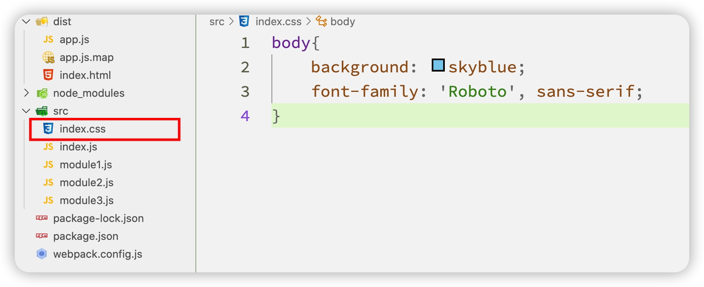

## loader

_loader_ 让 _webpack_ 能够去处理那些非 _JavaScript_ 文件（_webpack_ 自身只理解 _JavaScript_）。_loader_ 可以将所有类型的文件转换为 _webpack_ 能够处理的有效模块，然后你就可以利用 _webpack_ 的打包能力，对它们进行处理。

本质上，_webpack loader_ 将所有类型的文件，转换为应用程序的依赖图可以直接引用的模块。

在更高层面，在 _webpack_ 的配置中 _loader_ 有两个目标。

- **识别**出应该被对应的 _loader_ 进行转换的那些文件。(使用 _test_ 属性)
- **转换**这些文件，从而使其能够被添加到依赖图中（并且最终添加到 _bundle_ 中）（_use_ 属性）

> 有了 _loader_，_webpack_ 就会把非 _js_ 文件也看成是模块，并且可以引用它

来看一个具体的示例，在 _src_ 下面创建 _index.css_



代码如下：

```css
body {
  background: skyblue;
  font-family: 'Roboto', sans-serif;
}
```

接下来在 _index.js_ 中来引入该 _css_ 文件，如下：

_index.js_

```js
import module_1 from './module1';
import module_2 from './module2';
import module_3 from './module3';

//引入css模块
import './index.css';
```

然后输入`npm run dev`进行打包操作，会发现出现打包失败，在错误提示中提醒我们需要相应的 _loader_。


回到项目根目录，安装 _css-loader_ 和 _style-loader_。其中 _css-loader_ 负责把 _css_ 文件打包到 _js_ 中，_style-loader_ 让 _style_ 样式加入到 _index.html_ 结构中。如下：

```sh
npm i -D css-loader style-loader
```

接下来在 `webpack.config.js`中添加相应的配置信息，如下：

```js
module: {
  rules: [
    {
      test: /\.css$/,
      use: ['style-loader', 'css-loader'],
    },
  ];
}
```

> webpack 的 loader 执行顺序自后往前

其中 _test_ 属性对应的是一个正则表达式，代表要处理的文件类型，后面的 _use_ 属性代表所要使用的 _loader_ 文件。

执行命令`npm run dev` 或者 `npm start`，可以看到样式打包成功。
