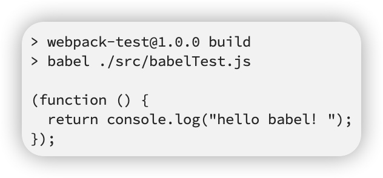

babel一词来自于希伯来语，直译为巴别塔


巴别塔象征的统一的国度、统一的语言

而今天的JS世界缺少一座巴别塔，不同版本的浏览器能识别的ES标准并不相同，就导致了开发者面对不同版本的浏览器要使用不同的语言，和古巴比伦一样，前端开发也面临着这样的困境。

babel的出现，就是用于解决这样的问题，它是一个编译器，可以把不同标准书写的语言，编译为统一的、能被各种浏览器识别的语言


由于语言的转换工作灵活多样，babel的做法和postcss、webpack差不多，它本身仅提供一些分析功能，真正的转换需要依托于插件完成


**babel** 官网地址：https://www.babeljs.cn/


## 一、babel的安装

babel可以和构建工具联合使用，也可以独立使用

如果要独立的使用babel，需要安装下面两个库：

- @babel/core：babel核心库，提供了编译所需的所有api
- @babel/cli：提供一个命令行工具，调用核心库的api完成编译

```js
npm i -D @babel/core @babel/cli
```

## 二、使用

在项目的src目录中创建`babelTest.js`文件，输入如下简单代码：
```js
() => console.log("hello babel！");
```

在命令行的运行babel命令，将上面js代码中的ES6的语法转换为ES5的语法
```sh
./node_modules/.bin/babel ./src/babelTest.js
```

要`node_modules`去找`babel`命令实在太麻烦，我们可以直接使用npm脚本简化：
```js
"scripts": {
    "build": "babel ./src/babelTest.js"
},
```

后面我们直接运行 `npm run build` 就直接编译了`babelTest.js`文件

可以看到此时并没有将我们的 *ES 6* 语法编译成 *ES 5* 语法。原因很简单，*babel* 是基于插件的，做不同的事情需要不同的插件，这样才能让 *babel* 非常灵活并且强大。

所以接下来我们安装相应的编译箭头函数的插件，如下：
```sh
npm i babel-plugin-transform-es2015-arrow-functions
```
除了安装插件以外，还需要在项目根目录下面创建 `babel`的配置文件，如下：


文件里面书写如下的配置信息：

```js
{
    "plugins": [
      "transform-es2015-arrow-functions"
    ]
}
```
执行`npm run build`，可以看到我们的 *ES 6* 代码已经成功被编译为了 *ES 5* 的代码：




接下来，我们去修改 *babelTest.js* 文件，增加其他的 *ES 6* 语法，如下：

```js
() => console.log("hello babel！");
class demo{}
```
接下来执行`npm run build`

但是*class* 并没有被编译。这个原因和前面我们遇到的一样，它需要安装另一个插件才能让 *babel* 工作起来，要不然就什么都不做。所以我们安装相应的插件：

```sh
npm install --save-dev babel-plugin-transform-es2015-classes
```

然后 *.babelrc* 配置文件也要进行相应的配置，如下：

```js
{
    "plugins": [
      "transform-es2015-arrow-functions",
      "transform-es2015-classes"
    ]
}
```

执行`npm run build`，结果如下：images


通过插件的学习，我们知道了 *babel* 要去解析转换 *ES 6* 语法，需要安装对应的插件，我们只是使用到了两个 *ES 6* 的语法就装了两个插件，当我们需要使用很多 *ES 6* 语法的时候，那就需要装非常多的插件，这样显得非常麻烦，那么有没有简便点的方法呢？

*babel* 通过 *preset* 来解决我们上面提出的问题，*preset* 叫做预设，意思就是说预先设置一些常用的语法配置，把一批常用的相关的插件打包来满足我们的开发。

**安装预设：**
```sh
npm i @babel/preset-env
```

babel有多种预设，最常见的预设是`@babel/preset-env`

`@babel/preset-env`可以让你使用最新的JS语法，而无需针对每种语法转换设置具体的插件

**配置**
```js
{
    "presets": [
        "@babel/preset-env"
    ]
}
```

## 三、*webpack* 中使用 *babel*

回到 *webpack-demo* 目录，修改 *webpack-demo* 下的 *index.js*，加入下面一段 *ES 6* 代码：

```js
// 测试 ES 6 是否被编译成 ES 5
()=>console.log("hello babel!!!")
```

然后运行命令查看结果：

```sh
npm run dev
```

在打包出来的 *app.js* 文件中进行查看，可以看到我们所写的 *ES 6* 代码原样输出，*webpack* 并没有把 *ES 6* 代码编译成 *ES 5*。

要让 *ES 6* 代码被编译，我们需要借助 *babel* 的力量，这里我们需要安装 *babel-loader* 和 *babel-core* 以及处理 *ES 6* 语法的预设，*babel-loader* 的作用就是将 *ES 6* 代码送给 *babel-core* 处理，*babel-core* 就是 *babel* 工作的核心 *api*。

安装 *babel-core* 和 *babel-loader* 以及处理 *ES 6* 的预设：

```sh
npm install babel-loader @babel/core @babel/preset-env
```
在 *webpack-demo* 目录中新建 *.babelrc* 文件，增加 *babel* 配置：
```js
{
    "presets": [
        "@babel/preset-env"
    ]
}
```

接下来需要在 *webpack.config.js* 文件中增加配置项，在 *rules* 规则数字中增加下面代码：

```js
{
    test: /\.js$/,
    use:['babel-loader']
}
```

运行`npm run dev`命令打包

在打包好的js代码中我们查看到，原来的 *ES 6* 代码已经成功转换成 *ES 5* 代码了：
```js
// 测试 ES 6 是否被编译成 ES 5
(function () {
  return console.log("hello babel!!!");
});
```

## 四、优化 babel-loader
当我们写这个正则表达式`/.js$/`的时候，表示所有 *js* 文件都会被送 *babel-loader* 加载，然后由 *babel-core* 处理一边，这里包括我们安装的很多第三方包，你会发现 *node_modules* 文件夹下会有很多的 *js* 文件，但是这些 *js* 文件已经由开发者打包好了我们可以直接使用的，并不需要我们再去处理一遍。因此，如果 *babel-loader* 再去处理的话，会浪费太多的时间，导致 *webpack* 打包编译很慢，我们现在需要优化它。

具体的做法是排除不需要再次编译的，让 *babel-loader* 只处理我们开发的源文件，因此，我们需要修改 *webpack.config.js* 中的配置：

```js
{
    test: /\.js$/,
    use:['babel-loader'],
    exclude: path.resolve(__dirname, 'node_modules')
},
```
其中，`exclude: path.resolve(__dirname, 'node_modules')`这条语句表示排除 *node_modules* 这个文件夹，因为这个文件夹下放的都是第三方包，并不需要我们再次用 *babel* 去编译了。

再次运行`npm run dev`去打包的时候会发现已经快很多了。