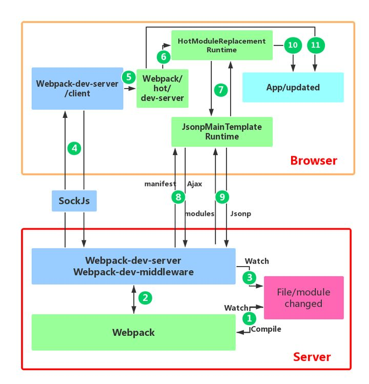

[原链接 | 掘金](https://juejin.cn/post/6844904038543130637#heading-21)

## webpack 构建流程

Webpack 的运行流程是一个串行的过程,从启动到结束会依次执行以下流程 :

1. 初始化参数：从配置文件和 Shell 语句中读取与合并参数,得出最终的参数。
2. 开始编译：用上一步得到的参数初始化 `Compiler` 对象，加载所有配置的插件，执行对象的 `run` 方法开始执行编译。
3. 确定入口：根据配置中的 `entry` 找出所有的入口文件。
4. 编译模块：从入口文件出发,调用所有配置的 `Loader` 对模块进行翻译,再找出该模块依赖的模块,再递归本步骤直到所有入口依赖的文件都经过了本步骤的处理。
5. 完成模块编译：在经过第 4 步使用 `Loader` 翻译完所有模块后,得到了每个模块被翻译后的最终内容以及它们之间的依赖关系。
6. 输出资源：根据入口和模块之间的依赖关系,组装成一个个包含多个模块的 `Chunk`,再把每个 `Chunk` 转换成一个单独的文件加入到输出列表,这步是可以修改输出内容的最后机会。
7. 输出完成：在确定好输出内容后,根据配置确定输出的路径和文件名,把文件内容写入到文件系统。

在以上过程中,`Webpack` 会在特定的时间点广播出特定的事件,插件在监听到感兴趣的事件后会执行特定的逻辑,并且插件可以调用 `Webpack` 提供的 API 改变 `Webpack` 的运行结果。

## 简易复现

> `compiler.js`
>
> **模块数组 modules**
>
> ```js
> [
>     {
>         filename, // 文件路径,可以作为每个模块的唯一标识符
>         dependecies, // 依赖对象,保存着依赖模块路径
>         code, // 文件内容
>     },
>     {
>         filename, // 文件路径,可以作为每个模块的唯一标识符
>         dependecies, // 依赖对象,保存着依赖模块路径
>         code, // 文件内容
>     },
>     ......
> ]
> ```
>
> **依赖关系图示例**
>
> ```js
> {
>        './src/index.js': {
>          dependecies: { './hello.js': './src/hello.js' },
>          code: '"use strict";\n\nvar _hello = require("./hello.js");\n\ndocument.write((0, _hello.say)("webpack"));'
>        },
>        './src/hello.js': {
>          dependecies: {},
>          code:
>            '"use strict";\n\nObject.defineProperty(exports, "__esModule", {\n  value: true\n});\nexports.say = say;\n\nfunction say(name) {\n  return "hello ".concat(name);\n}'
>        }
> }
> ```
>
> 根据生成的关系依赖图输出`bundle.js`文件

```js
const fs = require('fs');
const path = require('path');
const Parser = require('./Parser');
class Compiler {
  // options: webpack的配置对象
  constructor(options) {
    const { entry, output } = options;
    this.entry = entry; // 入口
    this.output = output; // 出口
    this.modules = []; // 模块
  }
  // 构建启动
  run() {
    const info = this.build(this.entry);
    this.modules.push(info);
    this.modules.forEach(({ dependecies }) => {
      // 判断有依赖对象,递归解析所有依赖项
      if (dependecies) {
        for (const dependency in dependecies) {
          this.modules.push(this.build(dependecies[dependency]));
        }
      }
    });
    // 生成依赖关系图
    const dependencyGraph = this.modules.reduce(
      (graph, item) => ({
        ...graph,
        // 使用文件路径作为每个模块的唯一标识符,保存对应模块的依赖对象和文件内容
        [item.filename]: {
          dependecies: item.dependecies,
          code: item.code,
        },
      }),
      {}
    );
    this.generate(dependencyGraph);
  }
  build(filename) {
    const { getAst, getDependecies, getCode } = Parser;
    const ast = getAst(filename);
    const dependecies = getDependecies(ast, filename);
    const code = getCode(ast);
    return {
      filename, // 文件路径,可以作为每个模块的唯一标识符
      dependecies, // 依赖对象,保存着依赖模块路径
      code, // 文件内容
    };
  }
  // 重写 require函数,输出bundle
  generate(code) {
    // 输出文件路径
    const filePath = path.join(this.output.path, this.output.filename);
    const bundle = `(function(graph){
      function require(moduleId){ 
        function localRequire(relativePath){
          return require(graph[moduleId].dependecies[relativePath])
        }
        var exports = {};
        (function(require,exports,code){
          eval(code)
        })(localRequire,exports,graph[moduleId].code);
        return exports;
      }
      require('${this.entry}')
    })(${JSON.stringify(code)})`;
    // 把文件内容写入到文件系统
    fs.writeFileSync(filePath, bundle, 'utf-8');
  }
}

module.exports = Compiler;
```

- 前提：已经准备好生成的 ==依赖关系图==
- 目标：生成一个 IIFE (匿名闭包)，可以执行所有书写的 js 脚本
- 困难：代码中含有`require`，`export`，浏览器无法识别
- 做法：自定义 require 和 export 传递给代码执行器（作为参数）

> `Parser.js`
>
> - AST 树（用于解析依赖）
> - 依赖模块（包含依赖的路径）
> - 转换过的代码

```js
const fs = require('fs');
const path = require('path');
const parser = require('@babel/parser');
const traverse = require('@babel/traverse').default;
const { transformFromAst } = require('@babel/core');
const Parser = {
  //解析入口文件,获取 AST
  getAst: (path) => {
    // 读取入口文件
    const content = fs.readFileSync(path, 'utf-8');
    // 将文件内容转为AST抽象语法树
    return parser.parse(content, {
      sourceType: 'module',
    });
  },
  //找出所有依赖模块
  getDependecies: (ast, filename) => {
    const dependecies = {};
    // 遍历所有的 import 模块,存入dependecies
    traverse(ast, {
      // 类型为 ImportDeclaration 的 AST 节点 (即为import 语句)
      // node.source.value 当前导入声明的来源
      ImportDeclaration({ node }) {
        const dirname = path.dirname(filename);
        // 保存依赖模块路径,之后生成依赖关系图需要用到
        const filepath = './' + path.join(dirname, node.source.value);
        dependecies[node.source.value] = filepath;
      },
    });
    return dependecies;
  },
  //将 AST 语法树转换为浏览器可执行代码
  getCode: (ast) => {
    const { code } = transformFromAst(ast, null, {
      presets: ['@babel/preset-env'],
    });
    return code;
  },
};

module.exports = Parser;
```

## Loader 和 Plugin 的区别

`Loader` 本质就是一个函数，在该函数中对接收到的内容进行转换，返回转换后的结果。 因为 Webpack 只认识 JavaScript，所以 Loader 就成了翻译官，对其他类型的资源进行转译的预处理工作。

==src/raw-loader.js==

```js
module.exports = function (source) {
  const json = JSON.stringify(source)
    .replace(/\u2028/g, '\\u2028') // 为了安全起见, ES6模板字符串的问题
    .replace(/\u2029/g, '\\u2029');
  return `export default ${json}`;
};
```

`Plugin` 就是插件，基于事件流框架 `Tapable`，插件可以扩展 Webpack 的功能，在 Webpack 运行的生命周期中会广播出许多事件，Plugin 可以监听这些事件，在合适的时机通过 Webpack 提供的 API 改变输出结果。

```js
/*
    必须是一个类
    必须要有一个 apply 函数
    要调用 complier API 来影响打包结果
*/

class LicenseWebpackPlugin {
  constructor(parmas) {
    console.log(parmas);
  }
  apply(complier) {
    complier.hooks.emit.tapAsync('LicenseWebpackPlugin', (compliation, cb) => {
      console.log(compliation.assets);
      compliation.assets['LICENSE'] = {
        source: function () {
          return `
The MIT License (MIT)

Copyright (c) 2013-present, Yuxi (Evan) You

Permission is hereby granted, free of charge, to any person obtaining a copy
of this software and associated documentation files (the "Software"), to deal
in the Software without restriction, including without limitation the rights
to use, copy, modify, merge, publish, distribute, sublicense, and/or sell
copies of the Software, and to permit persons to whom the Software is
furnished to do so, subject to the following conditions:

The above copyright notice and this permission notice shall be included in
all copies or substantial portions of the Software.

THE SOFTWARE IS PROVIDED "AS IS", WITHOUT WARRANTY OF ANY KIND, EXPRESS OR
IMPLIED, INCLUDING BUT NOT LIMITED TO THE WARRANTIES OF MERCHANTABILITY,
FITNESS FOR A PARTICULAR PURPOSE AND NONINFRINGEMENT. IN NO EVENT SHALL THE
AUTHORS OR COPYRIGHT HOLDERS BE LIABLE FOR ANY CLAIM, DAMAGES OR OTHER
LIABILITY, WHETHER IN AN ACTION OF CONTRACT, TORT OR OTHERWISE, ARISING FROM,
OUT OF OR IN CONNECTION WITH THE SOFTWARE OR THE USE OR OTHER DEALINGS IN
THE SOFTWARE.
`;
        },
      };
      cb();
    });
  }
}

module.exports = LicenseWebpackPlugin;
```

`Loader` 在 module.rules 中配置，作为模块的解析规则，类型为数组。每一项都是一个 `Object`，内部包含了 `test`(类型文件)、`loader`、`options` (参数)等属性。

`Plugin` 在 plugins 中单独配置，类型为数组，每一项是一个 Plugin 的 ==实例== ，参数都通过构造函数传入。

## 文件监听原理

原理：轮询判断文件的最后编辑时间是否变化，变化后根据配置的时间执行重新打包

Webpack 开启监听模式，有两种方式：

- 启动 webpack 命令时，带上 `--watch` 参数
- 在配置 webpack.config.js 中设置 `watch:true`

## Webpack 的热更新原理

HMR 的核心就是客户端从服务端拉取更新后的文件，准确的说是 `chunk diff` (chunk 需要更新的部分)，实际上 WDS 与浏览器之间维护了一个 `Websocket`（下图 4），当本地资源发生变化时，WDS 会向浏览器推送更新，并带上重新构建后的 hash。然后客户端会向 WDS 发起 Ajax 请求来获取更改内容(文件列表、hash)，这样客户端就可以再借助这些信息继续向 WDS 发起 jsonp 请求获取该 chunk 的增量更新。



- `watch①`：在 webpack 的 watch 模式下，文件系统中某一个文件发生修改，webpack 监听到文件变化，根据配置文件对模块 ==重新编译打包== ，并将打包后的代码通过简单的 JavaScript 对象保存在内存中。
- `watch③`：webpack-dev-server 对文件变化的一个监控，变化后会通知浏览器端对应用进行 ==刷新== 。

- `socket④`：WDS 与浏览器之间维护了一个 `Websocket`，将 webpack 编译打包的各个阶段的状态信息告知浏览器端，最主要信息还是新模块的 hash 值。
  - webpack-dev-server 修改了 webpack 配置中的 entry 属性，在里面添加了 webpack-dev-client 的代码，这样在最后的 bundle.js 文件中就会有接收 websocket 消息的代码了。


## 文件指纹是什么

文件指纹是打包后输出的文件名的后缀。

- `Hash`：和整个项目的构建相关，只要项目文件有修改，整个项目构建的 hash 值就会更改
- `Chunkhash`：和 Webpack 打包的 chunk 有关，不同的 entry 会生出不同的 chunkhash
- `Contenthash`：根据文件内容来定义 hash，文件内容不变，则 contenthash 不变

设置指纹

- js：output 中 filename 直接设置
- css：借助插件 MiniCssExtractPlugin 设置 filename。
- 图片：file-loader 的 name
