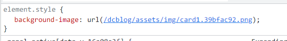

## 一、VUE中动态添加背景图

### 1. 动态添加类

- 数组的方式动态绑定类名

  ```vue
  <div class="container">
      <div 
           class="panel" 
           v-for="(pic, index) in picObj" :key="index" 
           v-bind:class="pic['class']"
           @click="changeState(index)"
           :class="{active: isActive === index}"
           >
          <h3>{{pic.title}}</h3>
      </div>
  </div>
  ```

- 定义类名映射数组

  ```js
  data() {
      return {
          picObj:[
              {title:'Explore The World',class:'bg-img0'},
              {title:'Wild Forest',class:'bg-img1'},
              {title:'Sunny Beach',class:'bg-img2'},
              {title:'City on Winter',class:'bg-img3'},
              {title:'Mountains - Clouds',class:'bg-img4'},
          ],
          isActive:0,
      };
  },
  ```

- 在style中设置背景图

  ```css
  .bg-img0 {
    background: url(../assets/images/card0.png) center no-repeat;
  }
  .bg-img1 {
    background: url(../assets/images/card1.png) center no-repeat;
  }
  .bg-img2 {
    background: url(../assets/images/card2.png) center no-repeat;
  }
  .bg-img3 {
    background: url(../assets/images/card3.png) center no-repeat;
  }
  .bg-img4 {
    background: url(../assets/images/card4.png) center no-repeat;
  }
  
  ```

### 2. style设置属性值

- 创建背景图模板

  ```vue
  <div class="container">
      <div 
           class="panel" 
           v-for="(pic, index) in picObj" :key="index" 
           :style="`background-image: url(${pic.url})`"
           @click="changeState(index)"
           :class="{active: isActive === index}"
           >
          <h3>{{pic.title}}</h3>
      </div>
  </div>
  ```

- 定义每幅图片的标题和路径

  ```js
  data() {
      return {
          picObj:[
              {title:'Explore The World',url:require('../assets/img/card1.png')},
              {title:'Wild Forest',url:require('../assets/img/card2.png')},
              {title:'Sunny Beach',url:require('../assets/img/card3.png')},
              {title:'City on Winter',url:require('../assets/img/card4.png')},
              {title:'Mountains - Clouds',url:require('../assets/img/card5.png')},
          ],
          // 用index来表明此时active的索引
          isActive: 0
      }
  },
  ```

  > 此处必须以`require`的方式引入，否则项目编译完渲染的时候路径有问题。
  >
  > 

::: vue-demo 轮播图

```vue
<template>
  <div class="container">
    <div 
         class="panel" 
         v-for="(pic, index) in picObj" :key="index" 
         @click="changeState(index)"
         v-bind:class="pic['class']"
         :class="{active: isActive === index}"
         >
        <h3>{{pic.title}}</h3>
    </div>
  </div>
</template>

<script>
  export default {
    name: 'Expanding-Cards',
    data() {
      return {
        picObj:[
          {title:'Explore The World',class:'bg-img0'},
          {title:'Wild Forest',class:'bg-img1'},
          {title:'Sunny Beach',class:'bg-img2'},
          {title:'City on Winter',class:'bg-img3'},
          {title:'Mountains - Clouds',class:'bg-img4'},
        ],
        isActive:0,
      };
    },
    methods: {
      changeState(index){
        this.isActive = index
      }
    },
  }
</script>
<style scoped>
  * {
    box-sizing: border-box;
  }

  .container {
    display: flex;
    width: 100%;
    justify-content: center;
    align-items:center;
  }

  .panel {
    /* 比例不变，铺满 */
    background-size: cover;
    /* 位置居中 */
    background-position: center;
    /* 不重复 */
    background-repeat: no-repeat;
    height: 300px;
    /* 圆角 */
    border-radius: 50px;
    /* 字体颜色 */
    color: #fff;
    /* 设置光标悬浮此元素时的类型（显示小手） */
    cursor: pointer;
    /* 等同于放大系数0.5，收缩系数1，基础宽度为0 */
    flex: 0.5;
    margin: 10px;
    position: relative;
    /* 为所有属性添加过渡效果 */
    transition: all 500ms ease-in;
  }

  .panel h3 {
    font-size: 24px;
    position: absolute;
    bottom: 20px;
    left: 20px;
    margin: 0;
    opacity: 0;
  }

  .panel.active {
    flex: 5;
  }

  .panel.active h3 {
    opacity: 1;
    transition: opacity 0.3s ease-in 0.4s;
  }

  @media (max-width: 480px) {
    .container {
      width: 100%;
    }

    .panel:nth-of-type(4),
    .panel:nth-of-type(5) {
      display: none;
    }
 }
    .bg-img0 {
        background: url('/dcBlog/assets/images/card1.png') center no-repeat;
    }
    .bg-img1 {
        background: url('/dcBlog/assets/images/card2.png') center no-repeat;
    }
    .bg-img2 {
        background: url('/dcBlog/assets/images/card3.png') center no-repeat;
    }
    .bg-img3 {
        background: url('/dcBlog/assets/images/card4.png') center no-repeat;
    }
    .bg-img4 {
        background: url('/dcBlog/assets/images/card5.png') center no-repeat;
    }
</style>
```

:::

## 二、jquery版

```js
$('.panel').click(function() {
    $('.panel').removeClass('active');
    $(this).addClass('active');
});
```

