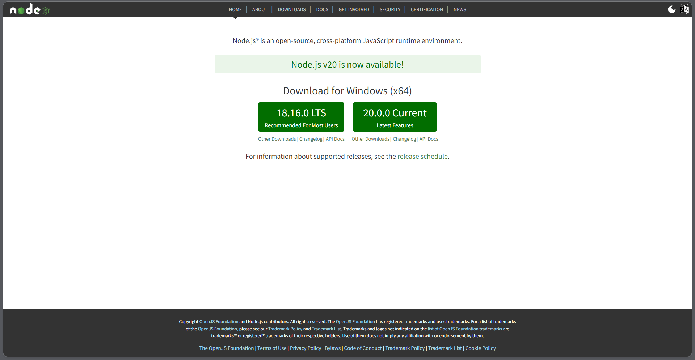
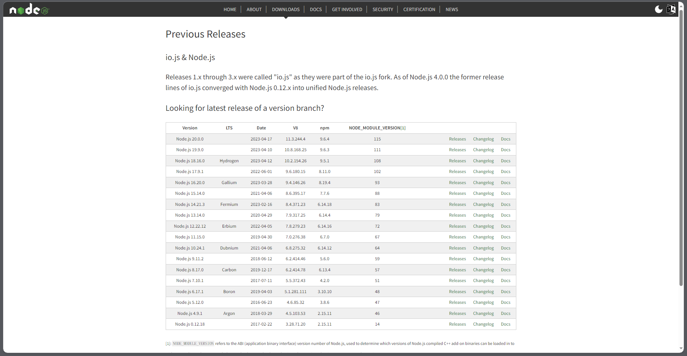

# nodeJS安装

## 一、安装包安装

到 Node.js 的[官网](https://nodejs.org/en/)下载安装包：



也可以在[https://nodejs.org/en/download/releases/](https://nodejs.org/en/download/releases/) 里下载历史版本。



后续如果需要安装其他版本，直接下载最新的安装包，覆盖安装即可。

## 二、NVM安装

**[NVM](https://github.com/nvm-sh/nvm)**：node.js version manager，用来管理 node 的版本。

**我们可以先安装 NVM，然后通过 NVM 安装 Node.js**。Windows 安装的 Node.js 的教程参考[nvm for windows 下载、安装及使用](https://juejin.cn/post/7074108351524634655)。

下载之后可以在文件目录下的`settings.txt`文件中，添加如下两行，修改镜像源。

```
node_mirror: https://npmmirror.com/mirrors/node/
npm_mirror: https://npmmirror.com/mirrors/npm/
```

### 1. NVM的常用命令

```sh
# 查看当前使用的nvm版本
nvm --version

# 查看本地安装的所有的 Node.js 版本：
nvm list

# 安装指定版本的 Node.js：
nvm install 版本号

# 卸载指定版本 Node.js：
nvm uninstall 版本号

# 切换使用指定版本的 node：
nvm use 版本号

# 可下载的所有 Node 版本：
nvm list available
```

