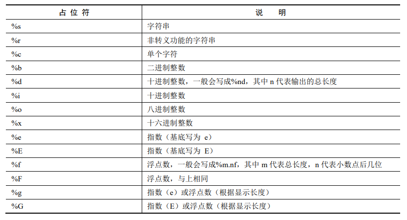

## 一、语言基础

### 1. 文件结构

Python 的文件结构可以分为 ==代码、模块、包==

- 包：放置模块的文件夹
- 模块：支持导入功能的，以`.py` 结尾的代码文件  
- 代码

> 在每个包文件夹里都必须包含一个`__init__.py` 文件。该文件的作用是，告诉 Python 环境该文件夹是一个包。`__init__.py` 可以是一个空文件。

### 2. 模块

Python 中的模块可以分为内置模块、自定义模块和第三方模块三类。 

- 内置模块：Python 中本来就有的模块；
- 自定义模块：自己开发的模块；
- 第三方模块：需要单独下载、安装并导入的模块。（pip、conda等包管理工具下载的包）

模块除了被引用以外，还会有自己的属性可供调用者查看。

```python
import time #引入 time 模块
print(time.__name__) #模块名字。输出：time
print(time.__doc__) #详细说明。输出：This module provides various……
print(time.__package__) #包名。因为是内置模块，包名为空，所以输出为空
print(time.__loader__) #加载的类名。输出：<class '_frozen_importlib.BuiltinImporter'>
print(time.__spec__) #简介。输出：ModuleSpec(name='time', ……
```

在 Python 中，模块的名字属性会根据不同的使用场景发生变化。当模块被导入到其他模块 时，`__name__`的值为模块本身的名字；而当该模块自己独立运行时，`__name__`的值会变为 `__main__`，借由这一点，我们常用此来执行一些单元测试代码：

```python
if __name__ == '__main__':
 	执行单元测试代码
```

这样只有直接运行此文件时才会执行单元测试代码。

### 3. 模块导入方式

```python
import 模块名 as 别名  
from 模块名 import（函数、变量）  
from 模块名 import *
```

- 使用 `from import *`方式导入模块时，如果当前模块里已经包含其中某个函数，就会发生名字冲突

- 当发生名字冲突时，系统会找离该函数最近的代码定义来执行（就近）

当模块的文件名属于以下两种情况时，上面的导入方式不奏效，需要使用`__import__`函数

- 模块的文件名中带 ==空格==
- 模块的文件名以 ==数字开头==

```python
yuyinutils = __import__("9-24 yuyinutils")
days = __import__("9days")
```

在模块与当前代码不在同一路径的情况下，导入模块

- 下一级目录：`import 包名.模块名   `
- 上一级目录：`import ..模块名`

```python
import model3.getenv as getenv 
import ..train
```

### 4. 模块的搜索路径

当导入名为 `train` 的模块时，解释器会先尝试从内置模块匹配；如果没找到，则将在 `sys.path` 记录的所有目录中搜索 `train.py` 文件。变量 `sys.path` 是一个字符串列表，它为解释器指定了模块的搜索路径。`sys.path` 包括： 

- 当前程序所在目录；
- 标准库的安装目录（例如：`pythom35\\lib\\site-packages`）；
- 操作系统环境变量 `PythonPATH` 所包含的目录

在编写代码时，也可以通过列表操作来对 sys.path 进行读写，例如： 

```python
import sys # 引入 sys 库 
print(sys.path) #将 sys.path 打印出来 
sys.path.append('d:// lib//Python') #在 sys.path 里添加一条路径 
```

对 `sys.path` 的修改，只在本次程序内有效，系统并不会将 `sys.path` 永久保存。如想永久生效， 还需在环境变量里进行配置。

## 二、变量

在python中声明变量时不需要任何关键字，但是定义与赋值必须同步进行，Python内部会根据所赋变量的类型来创建该变量。

一些常用的帮助函数：

```python
help(int) # 用来查询类或者类型具体的说明文档
dir(list) # 用来查询类或者类型的所有属性
id(a) # 查看a变量的标识（可以理解为该对象的内存地址）
type(a) # 查看该变量的数据类型
```

## 三、数据类型

Python 中有六个标准的数据类型：

- Number（数字）
- String（字符串）
- List（列表）
- Tuple（元组）
- Set（集合）
- Dictionary（字典）

Python3 的六个标准数据类型中：

- 不可变数据（3 个）：Number（数字）、String（字符串）、Tuple（元组）；
- 可变数据（3 个）：List（列表）、Dictionary（字典）、Set（集合）

> 可变数据和不可变数据的“变”是相对于 ==引用地址== 来说的，不是不能改变其数据，而是改变数据的时候会不会改变变量的引用地址。

### 1. Number

Python 中的 number 类型是一个数值类型的合集，具体又可以细分为 int（整型）、float（浮点型）、bool（布尔型）、complex（复数）等类型。

```python
a, b, c, d = 32.6, 58, True,8+7j ##定义四个变量 a、b、c、d，为它们赋予不同类型的值
print(type(a), type(b), type(c), type(d)) #将这四个变量的类型打印出来

// <class 'float'> <class 'int'> <class 'bool'> <class 'complex'> 
```

在 Python 中，等号赋值是指直接将对象的内存指针赋值：

```python
x=23
y=45
print("x,y:",id(x),id(y),x,y) // x,y: 1725105328 1725106032 23 45
x=y
print("x,y:",id(x),id(y),x,y) // x,y: 1725106032 1725106032 45 45
```

x 与 y 在赋值之前各自有自己的指针，而当赋值之后，x 与 y 不仅有相同的值， 而且还有相同的指针；而之前x=23所指向的内存地址依然存在，当系统判断没有变量引用该内存地址时，系统会使用内存回收机制，按设定好的规则回收该部分内存地址。

缓存重用机制：按照某种规则将一些对象存在缓存中，调用时直接访问缓存。

### 2. String

字符串大体可以分为两类： 

- 单行字符串：使用单引号（`‘’`）、双引号（`""`）来表示。 

  ```python
  a='line1line2' # a 为单行字符串，内容必须在同一行
  
  # a 为单行字符串的另一种写法。如果隔行了，需要用\来连接下一行
  a='line1\ 
  line2'
  ```

- 多行字符块：也叫多行字符串，用三个（双或单）引号来表示。如：`"""xxx"""`。

  ```python
  #b 为多行字符串
  b='''line1 
  line2
  line3'''
  ```

  - 每行之间可以直接用回车符分开

#### 转义符

| 转义字符      | 描述                                        |
| ------------- | ------------------------------------------- |
| `\`(在行尾时) | 续行符                                      |
| `\\`          | 反斜杠符号                                  |
| `\'`          | 单引号                                      |
| `\"`          | 双引号                                      |
| \a            | 响铃                                        |
| \b            | 退格（Backspace）                           |
| \e            | 转义                                        |
| \000          | 空                                          |
| \n            | 换行                                        |
| \v            | 纵向制表符                                  |
| \t            | 横向制表符                                  |
| \r            | 回车                                        |
| \f            | 换页                                        |
| \oyy          | 八进制数 yy 代表的字符。例如：\o12 代表换行 |
| \xyy          | 十进制数 yy 代表的字符。例如：\x0a 代表换行 |
| \other        | 其他的字符以普通格式输出                    |

字符串的转义是默认发生的，有时我们不想进行转义，而是获得原字符串，这时就需要进行反转义：

- 要在字符串前面加一个“r”或者“R”

    ```python
    aa= 'line\tline' #aa 里面含有转义字符\t，在第二个 line 之前
    print(aa) #将 aa 输出：lineline（为横向制表符，由 Tab 键输出）

    bb= R'line\tline' #bb 里面含有转义字符\t，同时前面加一个 R，关闭转义功能
    print(bb) #将 bb 输出：line\tline
    ```

- 使用函数 `repr(str)`将字符串 aa（含有转义字符的字符串）转换成原字符串（`raw string`）

  ```python
  aa= 'line\tline'   # aa 里面含有转义字符\t 
  print(repr(aa))    # 使用repr 函数将 aa 的原始字符串输出：
  line\tline
  ```
  

上述两种方式的原理都是相同的，都是在字符串 str 中查找反斜杠 “\”字符。如果能找到，就在该字符前面再加一个反斜杠“\”，组成两个反斜杠字符“`\\`”，这样两个个反斜杠字符“`\\`”生成的字符串会转义成一个反斜杠字符“\\”，这 样就会把原来 str 中那个不需要转义的反斜杠“\”输出来了。

> ==知识拓展==
>
> 在字符串前面加上“b”，将字符串转成二进制字符串。
>
>  在字符串前面加上“u”，将字符串转成 Unicode 编码的字符串。

#### 屏幕 I/O 及格式化

字符串格式化（输出）： ==加号、占位符==



`%m.nf` 这种形式的占位符，m 代表设定的总位数，n 代表设定的小数点后的位数

```
总长为 8，小数点后为 2，实际长度不足，需要前补空格
输出：□□□23.45
总长为 8，小数点后为 4，小数点后位数不足，会在小数点后面补 0 
输出：□23.4500
总长为 2，小数点后为 0，总长度比实际整数长度还小，总长度失效
输出：223
总长为 6，小数点后为 4，总长度 6 小于实际长度 7，总长度失效
输出：23.4500
```

##### 手动拼接格式化

`str.ljust(n)、str.rjust(n)、str.center(n)`

`str.rjust(n)`的作用是将字符串靠右对齐，其中的参数 n 代表输出的长度。

- 如果字符串不足这个长度，则默认在左边填充空格。
- 如果字符串的长度大于 n，则令 n 失效，并不会截断字符串，而是把字符串全部显示

```python
x=5 #定义个整型数 5 
print(“:”,str(x).rjust(2), str(x*x).rjust(3), end=', ') 
#占两位，以右对齐的方式输出 x 本身；占 3 位，以右对齐的方式输出 x*x；结尾用逗号 
print(str(x*x*x*10).rjust(4)) 
#占 4 位，以右对齐的方式输出 x*x*x，结尾用默认的回车

# result: : □5 □25, □125 
```

##### 占位符格式化

=='占位符'  %（要替换占位符的内容）==

```python
x=5 #定义一个整型数 5 
print(":",'%2d %3d,%4d'%(x, x*x, x*x*x)) #在模板中放置 3 个占位符，并指定输出长度
: □5 □25, □125 
```

- 占位符出场的先后顺序必须与后面的具体内容相匹配

##### Str.format格式化

=='{0：2d}'.format(内容)==

```python
x=5  #定义一个整型数 5
print(":",'{0:2d} {1:3d}, {2:4d} {0:4d}'.format(x, x*x, x*x*x)) 
#将 x、 x*x、 x*x*x三个数值按照字符串模板的格式输出

# : □5 □25, □125 □□□5
```

- 每个大括号里的第一项用于维护与后面具体内容的对应关系，其数值与 format 函数中元素的索引相对应

在字符串模板中，冒号后面的格式为：\[补齐字符]\[对齐方式][宽度]

```python
print('{0:=>10d}'.format(5)) #右对齐，输出长度为 10 的整数，用=填充：=========5
print('{0:&<10.3f}'.format(0.5)) #左对齐，输出长度为 10 的浮点数，用&填充：0.500&&&&&
print('{0:-^10}'.format("hello")) #居中对齐，输出长度为10 值的字符串，用-填充：--hello---
```

- 对齐方式：’<’、’>’、’^’左右中

- 简洁写法：省略格式要求，`{}`里只标明索引

结合`list`或`tuple`：`.format(*list or *tuple)`，其中`*`的意思是解包参数列表，即将 `tuple` 或 `list` 中的内容解包出来，作为参数传入到函数 format 中

```python
mylist = [5,25,125] #定义一个列表变量
print(":",'{0} {1}, {2} {0}'.format(*mylist)) #模板中直接指定后面列表变量里具体元素的顺序即可
```

结合字典：数字索引替代为字典具体标号索引（**dict）

```python
d = {'x':5, 'xx':25, 'xxx':125} #定义一个字典
print('x is {x}, xx is {xx}, xxx is {xxx}.'.format(**d)) #在模板中，只需填入字典里对应的名称即可
```
##### f-string

f-string 是 python3.6 之后版本添加的，称之为字面量格式化字符串，是新的格式化字符串的语法。

**f-string** 格式化字符串以 **f** 开头，后面跟着字符串，字符串中的表达式用大括号 {} 包起来，它会将变量或表达式计算后的值替换进去。

```py
name = 'Runoob'
print(f'Hello {name}')  # 替换变量
# 'Hello Runoob'
print(f'{1+2}')         # 使用表达式
# '3'

w = {'name': 'Runoob', 'url': 'www.runoob.com'}
print(f'{w["name"]}: {w["url"]}')
# 'Runoob: www.runoob.com'
```

> 序列类型包括 ==字符串、列表、元组、集合和字典== ，但集合和字典不支持如下操作。
>
> 序列的基本操作：连接（+）、重复（*）、检索（s[i]）、反检索(index函数)、切片（[起始：结束：步长]）
>
>  字符串不能被改变。

### 3. list

列表是最常用的 Python 数据类型，它可以作为一个方括号内的逗号分隔值出现。列表的数据项不需要具有相同的类型。创建一个列表，只要把逗号分隔的不同的数据项使用方括号括起来即可。

```python
li = [1,tt,3.4,"yes",[1,2]]  

# 实现空列表
li=[] 
```

extend将列表中的每个元素加入到a后面，且没有返回值。

append将列表作为一个整体对象加入到a后面。

+号连接和extend效果相同，效率较低，会重新生成列表。

gc.collect()  #回收内存地址

实现队列：insert（0，x）+pop

实现栈：append+pop


### 4. tuple

List的只读版，元组内部元素不能修改。

描述：小括号括起来  ----（16，20）

tuple 的元素不可改变，但它可以包含可变的对象，比如 list 列表，并且  可变对象内部的 内容也是可以修改的。

在定义包含 1 个元素的 tuple 时，需要在元素后面加一个逗号tup =(20,)

### 5. set

无序、不重复，作用于数据清洗

描述：用大括号括起来 ---`{‘hello’，‘python’}`

要想定义一个空的 set 变量，就必须要使用 set 函数。

运算：差、并、交、in

Frozenset：不可变集合  ---元组对于列表

### 6. dictionary

无序集合，键值对形式出现

关键字不可变且唯一（同一字典）

描述：大括号括起来，里面是键值对形式 --`{‘hello’：1，‘good’：2}`

dictionary[关键字]=值 ---在键值对中，值的类型是可以被任意修改的

list2 = sorted(d2.keys()) --sorted 函数将字典中的 key 转成 list。

  --d2.values

## 四、 运算符

### 1. 算数运算符

| 运算符         | 描述                                                         |
| -------------- | ------------------------------------------------------------ |
| +              | 加                                                           |
| -              | 减                                                           |
| *              | 乘                                                           |
| /              | 除，会生成浮点数结果                                         |
| %              | 取模（余数）                                                 |
| **或pow(x,y)   | 幂。例如：3**4 等价与 pow(3,4)，即 3 的 4 次方               |
| //             | 取整除                                                       |
| abs(x)         | 取绝对值                                                     |
| int(x,[base])  | 将 x 转换为整型。 x 可以是字符串或其他数字；base 是可选参数，默认为 10，表示将字符串 x 以 10 进制转化为整数。 当 base 被赋值时，x 必须是字符串；当 x 为浮点数时，转成的整数会将小数点后面全部舍掉。 如果想要更精确的转化，推荐用 math 库里面的 floor 和 ceil 函数来明确转换方式 |
| float(x)       | 将 x 转换为浮点型                                            |
| complex(re,im) | 生成复数。re 为实数部分，im 为虚数部分。 例如：complex(8,7)，则生成一个复数 8+7j |
| c.conjugate()  | 取 c 的共轭复数，假如 c=8+7j，则 c.conjugate() = 8-7j        |
| divmod(x, y)   | 返回商和余数。例如：divmod(13, 4) = (3, 1)                   |

```python
a=20
b=-3 
print(a+b) #加号运算，输出：17
print(a-b) #减号运算，输出：23
print(a*b) #乘号运算，输出：-60
print(a/b) #除号运算，输出：-6.666666666666667
print(a%b) #取余运算，输出：-1 
print(a**b) #幂运算，输出：0.000125
print(a//b) #整除运算，输出：-7 
print(abs(b)) #绝对值运算，输出：3 
print(int("1010",2)) #将字符串以二进制转换成整数，输出：10
print(float("3.14")) #将字符串换成浮点数，输出：3.14
c =complex(a,b) #生成复数，输出：(20-3j)
print(c)
print(c.conjugate()) #计算共轭复数，输出：(20+3j)
print(divmod(a, b)) #计算除数与余数，输出：(-7, -1)
```

### 2. 赋值运算符

| 运算符 | 描述                              |
| ------ | --------------------------------- |
| +=     | 加。例如：a+=b 等价于 a=a+b       |
| -=     | 减。例如：a-=b 等价于 a=a-b       |
| *=     | 乘。例如：a*=b 等价于 a=a*b       |
| /=     | 除。例如：a/=b 等价于 a=a/b       |
| %=     | 取模。例如：a%=b 等价于 a=a%b     |
| **=    | 幂。例如：a\**=b 等价于 a=a**b    |
| //=    | 取整除。例如：a//=b 等价于 a=a//b |

```python
a=9;b=3
a+=b #加。等价于 a=a+b
print(a) #输出：12
a=9;b=3
a-=b #加。等价于 a=a-b 
print(a) #输出：6 
a=9;b=3
a*=b #加。等价于 a=a*b 
print(a) #输出：27
a=9;b=3
a/=b #加。等价于 a=a/b
print(a) #输出：3.0
a=9;b=3
a%=b #加。等价于 a=a%b
print(a) #输出：0 
a=9;b=3 
a**=b #加。等价于 a=a**b 
print(a) #输出：729
a=9;b=3
a//=b #加。等价于 a=a//b
print(a) #输出：3 
```

### 3. 逻辑运算符

| 运算符    | 描述                                     |
| --------- | ---------------------------------------- |
| and       | 取“与”。左右都为 True，结果才为 True     |
| Or        | 取“或”。左右有一个为 True，结果就为 True |
| not 或 ！ | 取“反”。如果是 True 结果就为 False       |

- and 是一个短路运算符。它只有在第一个运算数为 True 时，才会计算第二个运算数的值。

- or 是一个短路运算符。它只有在第一个运算数为 False 时，才会计算第二个运算数的值。
- not 的优先级比其他类型的运算符现低。not a == b 相当于 not (a == b)；而 a == not b 是错误的。

### 4. 比较运算符

| 运算符     | 描述       |
| ---------- | ---------- |
| ==         | 等于       |
| != 或者 <> | 不等于     |
| >          | 大于       |
| <          | 小于       |
| >=         | 大于等于   |
| <=         | 小于等于   |
| is         | 指针等于   |
| is not     | 指针不等于 |

```python
a=3
b=5
c=None

print(a==b) #等于比较，输出：False
print(a!=b) #不等于比较，输出：True
print(a>b) #大于比较，输出：False
print(a<b) #小于比较，输出：True
print(a>=b) #大于等于比较，输出：False
print(a<=b) #小于等于比较，输出：True
print(a is b) #指针等于比较，输出：False
print(a is not b) #指针不等于比较，输出：True
print(c is None) #None 值等于比较，输出：True
```

- “==”只是判断两个对象的内容是否相等，而 is 函数不仅比较内容是否相等，还比较指针是否相等。

### 5. 位运算符

| 运算符 | 描述           |
| ------ | -------------- |
| &      | 按位与         |
| \|     | 按位或         |
| ~      | 按位非（取反） |
| ^      | 按位异或       |
| <<     | 按位左移       |
| >>     | 按位右移       |

- 左移n位可以近似看为：a*2的n次方
- 右移n位可以近似看为：a/2的n次方

### 6. 三目运算符

条件表达式?语句1:语句2;

- 条件运算符在执行时，首先对条件表达式进行求值，如果该值为true，则执行语句1，并返回执行结果；如果该值为false，则执行语句2，并返回执行结果。
- 如果条件的表达式的求值结果是一个非布尔值，会将其转换为布尔值然后再运算。

## 五、流程控制

流程控制：if、while、for循环

If else 简洁写法：c = [a,b][a<b] --后假，赋值a；后真，赋值b

for循环：执行语句对 for 后面的序列数据进行了修改时，使用切片的方 法为该序列数据做一个副本。 --for item in words[:]:

range 中的参数默认是从 0 开始，要头不要尾--range（起始，结束，步长）

内置函数zip：--传入zip的参数采取相应位置一一对应的方式组合成元组，          所以长度多出来的部分舍弃。Zip后类型位zip类型

--当 zip 对象被转化为元组或列表后，就会自动销毁。

--在zip对象前加*完成unzip，即将zip生成的数据返回

--for 循环中，直接可以从 zip 对象取出每个迭代的元素

内置函数 enumerate：将序列类型的数据生成带序号的新序列数据（0开始）

--生成新序列的每个元素都是一个元组

--enumerate的第一个返回值在循环里同时也起到计数的作   用，可以直接当作循环的次数来使用。

break、continue、pass ：break停止；continue跳过进入下一次循环。

列表推导式：colors = ['r' if item == 0 else 'b' for item in Y[:]]

 t = [ tuple(r) for r in m ]

## 六、函数

函数本质上是对象，使用callable函数查看函数是否可以被调用

6.1函数定义

def 函数名(参数 1, 参数 2, ……, 参数 N):

6.2文档字符串

开始位置字符串，用来说明函数的功能及调用方法

6.3函数参数的定义方式和调用方式

\1.  列表方式：按照形参顺序；传入指定形参

\2.  星号方式：在星号的后面的参数都必须要指定参数名称

\3.  带默认实参方式：有默认值的形参必须放在没有默认值的形参后面

\4.  通过元组或列表的解包参数的方式：只有一个被定义为元组的形参

def recoder (*person):

函数调用--任意多实参：传入顺序与内部顺序一一对应，且无法修             改

--传入列表或元组：在列表或元组前加一个*

\5.  通过字典的解包参数方式：def recoder (**person):

函数调用--传入指定形参：必须为形参指定名称

​    --传入字典：在字典变量前加**

4、5总结：

使用解包参数的函数，不能对参数修改；而使用列表传值的函数，是可 以对参数进行修改的。

\6.  混合使用：

--字典和元组的解包参数，同时作为形参来接收实参：根据实参是  否指定形参来决定由哪个来接收。同时传入时，不指定形参的实  参在前，指定形参的实参在后。

--元组和单个参数混合时，为单个参数指定形参。

--元组、单个形参和字典混合时，将字典放在最后。

\7.  检查参数：if not isinstance(age, (int, str)):

  isinstance 函数的作用是检查变量的类型

6.4 函数分类

6.4.1匿名函数

Lambda 参数 1，参数 2…:表达式 -- r=lambda x,y:x*y

表达式的内容只能是一句话的函数，且不能存在 return 关键字

（1）匿名函数与reduce函数组合

reduce(function, sequence, [initial])

--每次调用传入两个参数：sequence序列的当前元素，上一元   素为回调函数中的返回值。

print(reduce (lambda x,y:x + y,range(1,101) ) )

适用于归并性任务（序列数据的归并处理）

（2）匿名函数与 map 函数的组合

map(function, sequence[, sequence, ……])

--函数返回值为一个 map 对象。在使用时，得用 list 或 tuple   等函数进行转化。

使用 map 函数处理一个序列数据：

--t = map(lambda x: x ** 2,[1, 2, 3, 4, 5] )

使用 map 函数处理多个序列数据：

--t = map(lambda x,y: x+y,[1, 2, 3, 4, 5],[1, 2, 4, 5] )

适用于映射性任务

（3）匿名函数与 filter 函数的组合

filter(function or None, sequence)

--filter 函数会把序列对象中的元素依次放到 filter 的处理  函数中。如果返回 True，就留下，反之就舍去

--filter 函数的返回值是一个 filter 类型，需要将其转成列  表或元组等序列才可以使用。

t=filter(lambda x:x%2==0, [1, 2, 3, 4, 5, 6, 7, 8, 9, 10])

适用于过滤性任务

6.4.2 偏函数

对原函数的二次封装，类似于面向对象中的父类与子类的关系。

from functools import partial

partial(func, *args, **keywords)

偏函数的作用：为其原函数指定一些默认的参数，转化为另一个  带有剩余参数的函数对象，从而实现了截取函数功能（偏向）效果。

6.4.3 递归函数

6.4.4 eval 与 exec 函数

用来执行一个字符串形式的 Python 代码（代码以字符串的形式提 供），相当于一个 Python 的解释器。

区别：eval 执行完要返回结果，而 exec 执行完不返回结果

定义：eval、exec（expression, globals=None, locals=None）

--globals和locals是执行语句的作用域，两参数不存在时   默认全局，都存在时locals优先级较高。

--系统会将当前环境中的__builtins__复制到自己提供的   globals 中。

--执行语句需要是字符串格式，repr（s）、‘s ’转字符   串均可，但是str（s）不行。(s为字符串变量)

6.4.5 生成器函数

生成器函数返回本次计算结果，用完立即销毁，节约内存。

生成器函数使用yield语句返回。

生成器表达式：“for 循环列表推导式”外层是方括号，而生成器 表达式外层是圆括号。  --myGen = ( x*x for x in range(3) )

生成器 myGen 的值在打印输出之后就不在了

6.4.6工厂函数（面向对象）

普通：对原始函数进行封装，固化部分参数。

----：偏函数利用关键词调用partial（参数=‘’）

工厂函数则另外构建函数在函数体内指定参数。

闭合函数：由自由变量与嵌套函数组成，将固化参数作为自由变量，       原始函数作为嵌套函数。


---fun.__closure__  记录自由变量的参数对象地址。

---解决封装函数过多的问题（普通的工厂函数）。

装饰器：在原有的函数外面再包装一层函数，使新函数在返回原有      函数之前实现一些其他的功能。


---装饰器本质是一个闭合函数，该闭合函数的自由变量是   一个函数。大大加强代码的重用性与扩展性。

---在不改变原有代码实现的基础上，添加新的实现功能

高级修饰器：1.使用字典和元组的解包参数来作为形参。这样得到        的装饰器便可以适用于各种不同参数的函数。

2.在原有的通用参数装饰器外面再封装一层函数接受     外部变量。

@修饰符：在定义原函数时就可以为其指定修饰器函数

普通装饰器：


可接收参数的装饰器的定义：

@ isadmin (userid='user')

装饰器在装饰函数时，改变了函数本身的名称，解决方案：

\1.  wrapper.__name__ = fn.__name__

\2.  

 

 

 

 

 

 

 

组合装饰：多个装饰器并用，将不同的装饰器使用@符号一行一行的      堆叠起来。

多装饰器的载入顺序是从下往上的。在调用时，执行的 函数顺序是从上往下的。

同作用域下默认参数被覆盖问题：

使用循环生成多个工厂函数时的问题


6.5 变量的作用域

由高到低排列，依次为 L→E→G→B，俗称 LEGB 原则

global 语句：在本地作用域L或嵌套作用域E下对全局变量进行操作。

Global a   #获取全局变量a

nonlocal 语句：使用 nonlocal 语句，会在本地作用域以外按照优先级          的顺序逐级去寻找声明的变量，并引用该变量

## 七、错误与异常

错误：语法错误与运行时错误（异常-exception）

异常处理：为了避免程序退出，使用捕获异常的方式获取这个异常的名        称，再通过其他的逻辑代码让程序继续运行。

 

 

异常定义：  

--else语句必须放在所有的except语句后面

--如果 except 后面没有跟异常名，则必须放在所有捕获异常的语句之后

--except Exception as e: print(e) 输出未知异常

--输出异常的详细信息：print(sys.exc_info())（元组类型）错误信息

 traceback.print_tb(sys.exc_info()[2])追踪错                              误行

 traceback.print_exc()上述两个都有

 上述均需提前引入相信模块

创建异常：即抛出异常  --raise 异常类型 字符串（抛出异常）

 --通过 except 关键字来捕获该异常（输出异常）

异常的处理（清理）：finally不管异常发生与否都会执行

判定条件的正确性（断言）：检验自己的判断是对还是错

 --assert 1!=1 表达式为假时报异常

 --assert 1!=1,("1 不等于 1，报错")

--上述表达式为错误信息

## 八、文件操作

基本操作：系统级操作（删除、修改权限）   应用级操作（写入、读取）

删除文件：os.remove('a.txt')

读写文件：1.打开文件：open（文件名，mode）


把文件对象当作迭代器来读取:for line in f: print(line)

2.具体读写：f.read() f.write()

--文件对象的 write 方法只是把当前的内容缓存到了内存  里，并没有真正写入到文件.在调用 close 时，系统自动  将缓存里的内容写进了文件。

3.关闭文件：f.close()

4.流程简化：with语句：适用于类似文件操作的这种（具有事       先、事中、事后三个明显阶段）任务。

 with open('a.txt','wb+') as f:

 支持 with 语法的对象必须有一个__enter__方法  和一个__exit__方法

字符串与二进制的相互转化：


序列化：pickle函数：dumps 与 loads，实现基于内存的 Python 对象与二      进制互转； dump 与 load，实现基于文件的 Python 对象与二进制     互转。

基于内存：


基于文件：

dump(obj, file）--文件必须有 write 方法，并且支持写入二进制 数据。

load(file）   --对象必须有两个方法——read()和 readline。

## 九、类

9.1基本术语

类（class）：具有相同属性和方法对象的集合。

类变量：公用变量。一般不作为实例变量使用。

实例变量：作用于当前实例，定义在方法中。


·定义类方法需要有默认形参self，调用时则不需要传入。

·类使用时先实例化对象，然后调用对象方法实现具体功能。

 

·类的两个内置属性：__doc__：类的文档字符串

__dict__：该类的所有属性


·添加动态属性（实例变量）

·删除动态属性：del Anna.name

·限制合法的可添加动态属性：__slots__ = ('name', 'age')

9.2类的实例化

  

·类带有初始值的实例化，函数功能为为成员变量赋值，没有输出。

·实例化类时，即使没有初始值也会调用__init__函数

·__init__函数，若有除 self 以外的参数，则实例化该类时就必须输  入与__init__函数 对应的参数，否则就会报错。

9.3成员函数分类和调用

默认的成员方法：面向类的实例化对象


·先实例化对象，然后：实例化对象.方法（）

·向类的函数中传入对象


·将成员函数定义在类外，在类中对其进行指定，调用同上。


·类内的成员互访：需要在方法前加上self.  

 

类方法：面向当前类，使用在实例化前与类进行交互，但不和其实例进行交      互的函数方法上。


 

·类方法的第一个参数必须是 cls（用来指代该类）

·调用类方法时，需要使用“类名.类方法名”的方式，区别于默认成员   方法“实例化对象.类方法名”方式。

·@classmethod 装饰的方法不能使用实例属性，只能是类属性。

 

静态方法：等同于普通函数，只是被封装在类中，独立于整个类。


·第一个参数没有任何要求，调用方式两种皆可。

·运行不会影响类的属性。

9.4数据成员的分类和区别

类变量属于静态数据，而实例变量属于动态数据。

删除实例化对象：del 实例化对象

常见错误：类和类的实例都可以访问类变量，但只有类可以修改类变量；      如果使用类的实例来修改类变量，那么python会自动给生成      一个与类变量同名的实例变量，而当实例变量与类变量同名，      系统会以实例变量优先。

为了解决上述错误，引入类变量的私有化，通过将类变量隐藏起来，避 免上述错误中自动生成同名的实例变量，从而避免覆盖掉类变量。

9.5类变量的私有化类属性

原理：将私有化变量改名（__MyClass__Occupation）

实现：1.__Occupation = "scientist"（在变量名前加两下划线）

  2.使用装饰器技术（@property）

 

调用时直接对myc.Occupation进行操作即可。

通过使用“装饰器+私有变量”的方式，既避免了上述错误，同时使得类  的实例可以真正地自由修改类变量。

 

 

9.6实现子类

对于全部都遵守的共性，用父类来描述；对于满足部分共性的对象，用 多个子类来描述。

继承的实现：

·单、多继承(访问派生类属性时的搜索规则采用基类顺序深度优先)

class DerivedClassName(FatherClassName，[FatherClassName2]):

·继承其他模块的基类

class DerivedClassName(module.FatherClassName):

子类方法的覆写：子类方法与父类方法重名时，父类方法失效。

·常见方式：在子类中，执行自己的覆写方法的同时，也要调用一下父  类的被覆写的方法。

super函数：通过 super 函数来保证父类的方法只被执行一次。

·子类方法中调用了父类方法时，若继承关系比较复杂，有可能父类函  数被自动执行多次。  


·使用 super 函数时，对父类的方法调用会自动传入 self。无需再传  入 self，否则会报错。

9.7常用的内置函数

判断实例（isinstance）：isinstance(object, class_name)

判断对象是否是类的实例

判断子类（issubclass）：issubclass(class1, class2)

判断类1是否是类2的子类

判断类实例中是否含有某个属性：hasattr(obj, attribute，/)

获得类实例中的某个属性：getattr(obj, attribute[, default])

设置类实例中的某个属性值：setattr(obj, attribute, value, /)

9.8重载运算符（在运算操作的基础上添加其他功能）

在类中定义并实现一个与运算符对应的处理方法。在两个对象进行运算   符操作时，系统就会调用类中的具体方法来处理。

只有重载时运算符操作才会运行。

9.9包装与代理

包装：包装类包含被包装类的实例(类似于函数的装饰类，不改变原始类， 应对新的需求对功能进行拓展)


代理：将包装类变成一个属性的“代理”。 这使得访问包装类的属性等  同于访问被包装类的属性。


__getattr__：在属性存在时返回属性的值，属性不存在时调用此函数。

9.10自定义异常类

class MyEpt(Exception):类名为异常类型，继承exception类，作为自  定义异常的基类。

class MyEptInput(MyEpt):作为自定义基类的派生类


·自定义基类需要放在所有派生类后面。

9.11支持 with 语法的自定义类

要想实现这个功能，需重载两个方法：__enter__方法、__exit__方法


## 十、系统调度

### 1. 进程与线程

进程，是应用程序的执行实例（比如 Windows 下某个运行起来的 exe 软件）；线程是进程中的执行单元，是进程的一部分。

线程主抓中央处理器执行代码的过程，其余的资源的保护和管理由进程去完成。 一个进程可以由一个或一个以上的线程组成。 线程与进程，又可以理解为对 CPU 时间段的描述：线程是 CPU 调度的最小单位，进程是 CPU 资源分配的最小单位。

### 2. 线程

Python 中有关线程开发的部分，被单独封装到一个模块中：`threading` 模块。

class threading.Thread(group=None, target=None,  name=None,args=(), kwargs={}, *, daemon=None)

方法：run，start，join，isAlive，getName，setName

常用函数：threading.current_thread()：查看当前进程

threading.enumerate：返回一个正运行线程的 list

threading.activeCount：返回正在运行的线程数量

创建子线程：1.实例化原始类，target传参绑定处理函数，调用start方法。

t = threading.Thread(target=handle, args=(i,))

 2.派生新子类，重载run方法，实例化新类，调用start   方法。

解决数据不同步问题：1.互斥锁：将某段代码保护起来，只允许一次由            一个线程执行。

lock = threading.RLock() 锁的实例化

lock.acquire()      加锁

lock.release()      解锁

2.信号量：带计数的线程同步机制

semaphore = threading.Semaphore(0)实例化

semaphore.acquire()    计数器-1

semaphore.release()    计数器+1

3.边界信号量：信号量基础上添加了计数器的上  限校验。

semaphore = threading. BoundedSemaphore (1)

4.事件机制：threading 模块中的 Event 类

Self.re.set()       通知读事件

Self.we.wait()      等待写事件

self.we.clear()      清除写事件

5.条件锁：threading 模块中的 Condition 类

互斥锁的基础上加入wait、notify、notifyAll

6.定时器：threading 模块下的 Timer 类

class threading.Timer(interval, function,   args=[], kwargs={})

interval：触发定时器的时间。  

function：定时器到时间后的处理函数。

在定时器的触发函数里，再创建一个定时器，即  可实现定时器的循环触发。

 

 

 

 

 

timer2.cancel() 结束定时器

7.线程池：使用 concurrent.futures 模块下的   ThreadPoolExecutor 类

抢占式更灵活，允许池中线程的处理函数不一 样，submit方法


非抢占式更严格，要求线程池中的线程必须执行  同样的处理函数，map方法


10.2进程

某一个程序启动时，就会默认启动一个进程，将该程序装载到内存。同时在该进程中还会默认启动一个线程，来执行本进程中的内容。

所用模块：multiprocessing模块

创建方式基本与线程相同。

10.3多进程与多线程的区别

多进程与多线程运行时所占的内存分布不同，常用多进程来实现守护服务  器的功能。而多线程更适用与批处理任务等功能。

10.4协程（在同时开启的多个任务中，一次只执行一个）

实现协程的基本流程：（使用asyncio模块）

1.定义协程处理函数；async def do_some_work(x):

2.定义回调函数：def callback(future):

3.生成协程对象；coroutine = do_some_work('爬取股票')

4.获得事件循环对象：loop = asyncio.get_event_loop()

5.对协程封装：task = asyncio.ensure_future(coroutine)

6.绑定回调函数：task.add_done_callback(callback)

7.执行协程任务：loop.run_until_complete(coroutine)

先有进程，然后进程可以创建线程，线程是依附在进程里面的，线程里面  可以包含多个协程。

多线程开发线程之间执行是无序的，协程之间执行按照一定顺序交替执行。


  