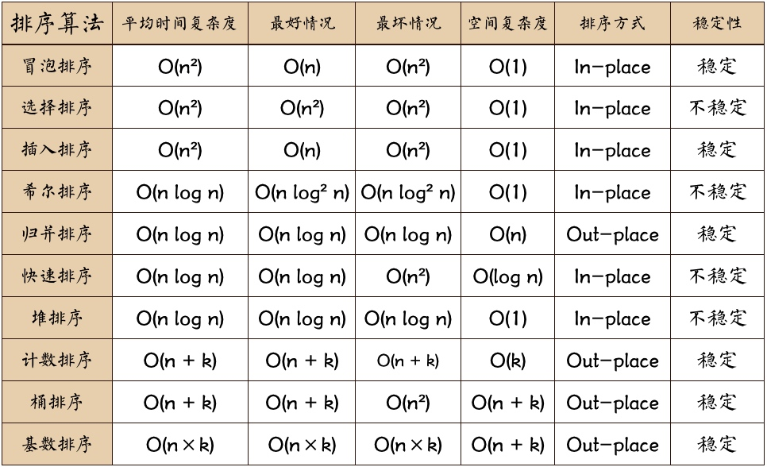
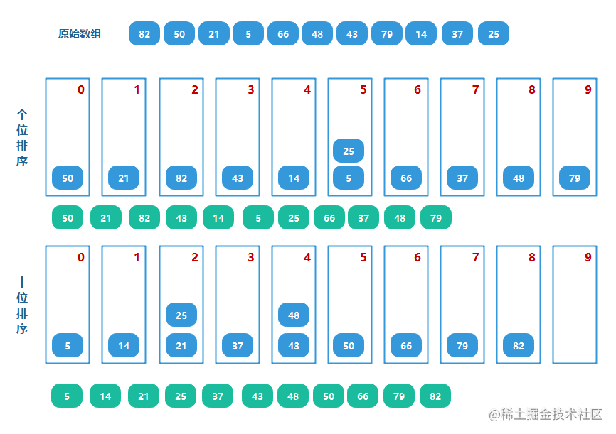

## 冒泡排序

比较相邻的元素。如果第一个比第二个大，就将他们交换，然后接着向后比较，这样一趟循环可以将最大的元素移动到最右端。(==①②比较，②③比较，......==)

```js
function bubbleSort(array) {
  if (array.length < 2) return array;
  for (let i = 0; i < array.length - 1; i++) {
    for (let j = 0; j < array.length - 1 - i; j++) {
      if (array[j] > array[j + 1]) {
        [array[j], array[j + 1]] = [array[j + 1], array[j]];
      }
    }
  }
  return array;
}
```

## 选择排序

在未排序序列中找到最小（大）元素，存放到排序序列的起始位置，然后，再从剩余未排序元素中继续寻找最小（大）元素，然后放到已排序序列的末尾。以此类推，直到所有元素均排序完毕。

```js
function selectSort(array) {
  if (array.length < 2) return array;
  for (let i = 0; i < array.length - 1; i++) {
    let minIndex = i;
    for (let j = i; j < array.length; j++) {
      if (array[j] < array[minIndex]) {
        minIndex = j;
      }
    }
    [array[i], array[minIndex]] = [array[minIndex], array[i]];
  }
  return array;
```

## 插入排序

对于未排序的数据，在已排序序列中从后向前扫描，找到相应位置并插入。（需要反复把已排序元素逐步向后挪位，为最新元素提供插入空间）

```js
function insertSort(array) {
  if (array.length < 2) return array;
  for (let i = 1; i < array.length; i++) {
    let current = array[i];
    let preIndex = i - 1;
    while (preIndex >= 0 && current < array[preIndex]) {
      array[preIndex + 1] = array[preIndex];
      preIndex--;
    }
    array[preIndex + 1] = current;
  }
  return array;
}
```

## 希尔排序

==插入排序的优化（分治）==

将原始数据按照增量间隔分组，对每组使用直接插入排序算法进行处理。逐渐缩小增量，再次执行插入排序操作直至增量减至1.


```js
function shellSort(array) {
  if (array.length < 2) return array;
  let gap = Math.floor(array.length / 2);
  while (gap > 0) {
    for (let i = gap; i < array.length; i++) {
      let current = array[i];
      let preIndex = i - gap;
      while (preIndex >= 0 && current < array[preIndex]) {
        array[preIndex + 1] = array[preIndex];
        preIndex -= gap;
      }
      array[preIndex + 1] = current;
    }
    gap = Math.floor(gap / 2);
  }
  return array;
}
```

## 归并排序

==选择排序的优化（分治）==

把长度为n的输入序列分成两个长度为n/2的子序列；对这两个子序列分别采用归并排序（递归调用）；将两个排序好的子序列合并成一个最终的排序序列。

```js
function mergeSort(array) {
  const len = array.length;
  if (len < 2) return array; //递归出口
  let mid = Math.floor(len / 2);
  let left = array.slice(0, mid);
  let right = array.slice(mid);
  return merge(mergeSort(left), mergeSort(right)); // 递归调用
}
function merge(left, right) {
  let result = [];
  const len = left.length + right.length;
  for (let index = 0, i = 0, j = 0; index < len; index++) {
    if (i >= left.length) {
      result[index] = right[j++];
    } else if (j >= right.length) {
      result[index] = left[i++];
    } else if (left[i] < right[j]) {
      result[index] = left[i++];
    } else {
      result[index] = right[j++];
    }
  }
  return result;
}
```

## 快速排序

==分治==

- 从数列中挑出一个元素，称为 “基准”（pivot）；
- 重新排序数列，所有元素比基准值小的摆放在基准前面，所有元素比基准值大的摆在基准的后面（相同的数可以到任一边）。在这个分区退出之后，该基准就处于数列的中间位置。这个称为分区（partition）操作；
- 递归地（recursive）把小于基准值元素的子数列和大于基准值元素的子数列排序。

```js
function quickSort(array, start, end) {
  if (array.length < 2) return array;
  if (start < end) {
    let i = start,
      j = end,
      pivot = array[start];
    while (i < j) {
      // 从右向左找第一个小于基准的数
      while (i < j && array[j] >= pivot) {
        j--;
      }
      if (i < j) {
        array[i++] = array[j];
      }
      // 从左向右找第一个大于等于基准的数
      while (i < j && array[i] < pivot) {
        i++;
      }
      if (i < j) {
        array[j--] = array[i];
      }
    }
    array[i] = pivot;
    quickSort(array, start, i - 1);
    quickSort(array, i + 1, end);
  }
  return array;
}
```

## 堆排序

堆排序是指利用堆这种数据结构所设计的一种排序算法。堆积是一个近似完全二叉树的结构，并同时满足堆积的性质：即子结点的键值或索引总是小于（或者大于）它的父节点。

- 构建初始最大堆
- 循环将堆首位（最大值）与末位交换，固定这个最大值，然后再重新调整最大堆

```js
function heapSort(array) {
  const len = array.length;
  let j = len - 1;
  if (len < 2) return array;
  // 构建初始最大堆
  for (let i = Math.floor(len / 2) - 1; i >= 0; i--) {
    buildHeap(array, i, len);
  }
  // 循环将堆首位（最大值）与末位交换，然后在重新调整最大堆
  while (j > 0) {
    [array[0], array[j]] = [array[j], array[0]];
    buildHeap(array, 0, j);
    j--;
  }
  return array;
}
function buildHeap(arr, i, len) {
  let current = arr[i];
  let k = 2 * i + 1; //非叶子节点i的左叶子节点
  while (k < len) {
    // 选出左右节点中较大值的索引
    if (k + 1 < len && arr[k + 1] > arr[k]) {
      k++;
    }
    if (arr[k] > current) {
      arr[i] = arr[k];
      i = k; // 用来存储最大值的索引
    } else {
      break;
    }
    k = 2 * k + 1;
  }
  arr[i] = current;
}
```

## 计数排序

- 找出待排序的数组中最大和最小的元素，从而确定统计次数数组的大小：`max - min + 1`
- 统计数组中每个值为`i`的元素出现的次数，存入数组C的第`i-min`项；
- 按照顺序和次数取出数组的数据放入结果数组中

```js
function countSort(array) {
  if (array.length < 2) return array;
  const result = [];
  let [bias, max, min] = [0, array[0], array[0]];
  // 确定最大最小值
  array.forEach((item) => {
    if (item > max) max = item;
    if (item < min) min = item;
  });
  bias = -min;
  let bucket = new Array(max - min + 1).fill(0);
  // 统计元素出现的次数并存入对应的位置
  array.forEach((item) => {
    bucket[item + bias]++;
  });
  bucket.forEach((item, index) => {
    while (item > 0) {
      result.push(index - bias);
      item--;
    }
  });
  return result;
}
```

## 桶排序

==计数排序的升级版（分治法+空间换时间）==

将数组进行分组，减少排序的数量，再对子数组进行排序，最后合并即可得到结果。


```js
function bucketSort(arr, bucketSize = 3) {
  if (arr.lenght < 2) return arr;
  let maxValue = arr[0];
  let minValue = arr[0];
  let result = [];

  // 取出数组的最大值, 最小值
  arr.forEach((num) => {
    maxValue = num > maxValue ? num : maxValue;
    minValue = num > minValue ? minValue : num;
  });

  // 初始化桶的数量
  const bucketCount = Math.floor((maxValue - minValue) / bucketSize) + 1; // 桶的数量
  // 初始化桶的容器
  // 注意这里的js语法，不能直接fill([])，因为生成的二维下标数组，是同一个地址
  const buckets = new Array(bucketCount).fill(0).map(() => []);

  // 将数字按照映射的规则，放入桶中
  arr.forEach((num) => {
    const bucketIndex = Math.floor((num - minValue) / bucketSize);
    buckets[bucketIndex].push(num);
  });

  // 遍历每个桶内存储的数字
  buckets.forEach((store) => {
    // 桶内只有1个数字或者空桶，或者都是重复数字，则直接合并到结果中
    if (store.length <= 1 || bucketSize == 1) {
      result = result.concat(store);
      return;
    }

    // 递归，将桶内的数字，再进行一次划分到不同的桶中
    const subSize = Math.floor(bucketSize / 2); // 减少桶内的数字区间，但必须是最少为1
    const tmp = bucketSort(store, subSize <= 1 ? 1 : subSize);
    result = result.concat(tmp);
  });

  return result;
}
```

## 基数排序

基数排序，一般是从右到左，对进制位上的数字进行比较，存入[0, 9]的10个桶中，进行排序。

- 取得数组中的最大数，并取得位数
- arr为原始数组，从最低位开始取每个位组成radix数组
- 对radix进行计数排序（利用计数排序适用于小范围数的特点）



```js
function radixSort(arr) {
  let maxNum = arr[0];
  // 求出最大的数字，用于确定最大进制位
  arr.forEach((num) => {
    if (num > maxNum) {
      maxNum = num;
    }
  });
  // 获取最大数字有几位
  let maxDigitNum = 0;
  while (maxNum > 0) {
    maxNum = Math.floor(maxNum / 10);
    maxDigitNum++;
  }
  // 对每个进制位上的数进行排序
  for (let i = 0; i < maxDigitNum; i++) {
    let buckets = new Array(10).fill(0).map(() => []); // 初始化10个桶
    for (let k = 0; k < arr.length; k++) {
      const bucketIndex = getDigitNum(arr[k], i); // 获取当前进制位上的数字
      buckets[bucketIndex].push(arr[k]); // 排序的数字放入对应桶中
    }
    // 所有数字放入桶中后，现从0-9的顺序将桶中的数字取出
    const res = [];
    buckets.forEach((store) => {
      store.forEach((num) => {
        res.push(num); // 注意这里，先存入桶中的数字，先取出，这样才能保持局部有序
      });
    });
    arr = res;
  }
  return arr;
  function getDigitNum(num, digit) {
    return Math.floor((num / Math.pow(10, digit)) % 10);
  }
}
```

