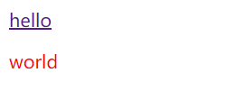

::: tip 提示
实践中优先外部样式表、平时练习可以使用内部样式表`<style></style>` 
:::

## 一、 分类

css的基本语法分为两部分： ==选择器== 和 ==声明块== 。

- **选择器**：通过选择器可以选中页面中的指定元素，比如 p 的作用就是选中页面中所有的p元素
- **声明块**：通过声明块来指定要为元素设置的样式
  - 声明块由一个一个的声明组成
  - 声明是一个名值对结构，一个样式名对应一个样式值，名和值之间以`:`连接，以`;`结尾  

---

## 二、 选择器

CSS 选择器是 CSS 规则的第一部分。它是元素和其他部分组合起来告诉浏览器哪个 HTML 元素应当是被选为应用规则中 CSS 属性值的方式。（ ==给“谁”上样式== ）

### 1. 常用选择器

**元素（标签）选择器**

- 作用：根据标签名来选中指定的元素
- 语法：标签名{}
- 例子：`p{}、h1{}、div{}`

**id选择器**

- 作用：根据元素的id属性值选中一个元素
- 语法：#id属性值{}
- 例子：`#box{}   #red{}  `

**类选择器**

- 作用：根据元素的class属性值选中一组元素
- 语法：.class属性值
- 例子：`.abc{}  .circle{}`

**通配选择器**

- 作用：选中页面中的所有元素
- 语法: `*`

###  2. 复合选择器

**交集选择器**

- 作用：选中同时符合多个条件的元素
- 语法：选择器1选择器2选择器3选择器n{}    
- 例子：`div#red{}`
   - 交集选择器中如果有元素选择器，必须使用元素选择器开头
   - 各选择器之间没有空格

**选择器分组（并集选择器）**

- 作用：同时选择多个选择器对应的元素
- 语法：选择器1,选择器2,选择器3,选择器n{}
- 例子：`#b1,.p1,h1,span,div.red{}`

### 3. 关系选择器

**子元素选择器**

- 作用：选中指定父元素的指定子元素
- 语法：父元素 > 子元素
- 例子：`div.box > span`

**后代元素选择器**

- 作用：选中指定元素内的指定后代元素
- 语法：祖先  后代
- 例子：`div span`
  - 父子元素之前存在空格

**兄弟元素选择器**

- 选择后一个兄弟元素：前一个 + 下一个

  `p + span`

- 选择后边所有的兄弟元素：兄 ~ 弟

  `p ~ span`

### 4. 属性选择器

语法：[属性名] 选择含有指定属性的元素

- `[属性名=属性值]`   选择含有指定属性和属性值的元素
- `[属性名^=属性值]` 选择属性值以指定值开头的元素
- `[属性名$=属性值]` 选择属性值以指定值结尾的元素
- `[属性名*=属性值]` 选择属性值中含有某值的元素的元素
- `[属性名~=属性值]` 选择属性值中含有某值的元素
  - 用来选中多个类属性中含有某个类属性的标签

对应示例：  
- `p[title]` 选中所有包含title属性的p标签
- `p[title=abc]` 选中title属性为abc的p标签
- `p[title^=abc] ` 选中title属性值以abc开头的p标签（`<p title="abcd"></p>`）
- `p[title$=abc]` 选中title属性值以abc结尾的p标签（`<p title="dabc"></p>`）
- `p[title*=abc]` 选中title属性值包含abc的p标签（`<p title="1abc1"></p>`）
- `p[title~=abc]` 选中title属性值中以空格为间隔的值的标签 （`<p title="abc 123"></p>`）

### 5. 伪类

伪类用来描述一个元素的 ==特殊状态== ，比如：第一个子元素、被点击的元素、鼠标移入的元素等。附上了伪类的元素被定义为*锚元素*。

一般情况伪类下都是使用 `:` 开头

- `:root` 表示文档的根元素。在 HTML 中这通常是 `<html>` 元素

- `:first-child`	一组兄弟元素中的第一个元素
- `:last-child`     一组兄弟元素中的最后一个元素
- `:nth-child(n)`   一组兄弟元素中的第n个元素

  - 参数为2n或者even时表示选中偶数位的元素
  - 参数为2n+1或者odd时表示选中奇数位的元素

  - 此顺序表示所有的兄弟元素第n个

- `:first-of-type、:last-of-type、:nth-of-type()`

```html
<div class="container">
    <p>p标签：1231231231</p>
    <div>div标签：123123</div>
    <p>p标签：1231231231</p>
    <p>p标签：1231231231</p>
    <p>p标签：1231231231</p>
    <p>p标签：1231231231</p>
</div>
```

```html
<style>
    .container p:nth-child(3) {
        background-color: pink;
    }
</style>
```


- 此时如果n为2，则不会有任何样式生效。

```html
<style>
      .container p:nth-of-type(3) {
        background-color: pink;
      }
</style>
```


- `:is()` 匹配与提供的列表中的任何选择器匹配的任何元素

- `:not()`  否定伪类，将符合条件的元素从选择器中去除
- `:has()` 该关系伪类表示与任何一个与锚定的元素的相对选择器相匹配（如果有的话）的元素。

- **a元素的伪类**
  - `:link` 用来表示没访问过的链接（正常的链接）
  - `:visited` 用来表示访问过的链接
  - `:hover` 用来表示鼠标移入的状态
  - `:active` 用来表示鼠标点击的状态

###  6. 伪元素选择器

伪元素是一个附加至选择器末的关键词，允许你对 ==被选择元素的特定部分== 修改样式。

- 伪元素一般使用 `::` 开头

  - `::first-letter` 表示第一个字母
  - `::first-line` 表示第一行
  - `::selection` 表示选中的内容
  - `::before` 元素的开始
  - `::after` 元素的最后

  ::: tip 提示

  before 和 after 必须结合content属性来使用

  :::


更多伪类/元素的用法请参考([CSS 伪类](https://developer.mozilla.org/zh-CN/docs/Web/CSS/Pseudo-classes))

###  7. 层叠规则（选择器优先级）

当我们通过不同的选择器，选中相同的元素，并且为相同的样式设置不同的值时，此时就发生了**样式冲突**。

**层叠**：解决声名冲突的过程，浏览器自动处理 （权重计算）。

#### (1). 比较重要性

作者样式表中的`!important`样式 > 作者样式表中样式 > 浏览器默认样式

#### (2). 比较特殊性

**选择器的权重**

| 选择器                              | 优先级     |
| :---------------------------------- | ---------- |
| 内联样式（直接将css代码放在标签内） | 1,0,0,0    |
| id选择器                            | 0,1,0,0    |
| 类和伪类、属性选择器                | 0,0,1,0    |
| 元素、伪元素选择器                  | 0,0,0,1    |
| 通配选择器                          | 0,0,0,0    |
| 继承的样式                          | 没有优先级 |

- 比较优先级时，需要将所有选择器的优先级进行相加计算，最后优先级越高，则越优先显示（分组选择器是单独计算的），选择器的累加不会超过其最大的数量级，类选择器再高也不会超过id选择器，如果优先级计算后相同，此时则优先使用靠下的样式。
- 可以在某一个样式的后边添加 `!important` ，则此时该样式会获取到最高的优先级，甚至超过内联样式，但是实际开发中不建议使用。

#### (3). 比较源次序

代码书写靠后的胜出

---

## 三、 声明块

###  1. 样式的继承

​	我们在为一个元素设置样式时同时也会应用到它的后代元素上。

- 继承是发生在祖先和后代之间的
- 继承的设计是为了方便我们的开发，利用继承我们可以将 ==一些通用的样式统一设置到共同的祖先元素上== ，这样只需设置一次即可让所有的元素都具有该样式。
- 通常和文字内容相关的属性都能被继承。

::: warning 注意

并不是所有的样式都会被继承，比如背景相关的，布局相关等的这些样式都不会被继承。具体哪些样式会被继承请查阅css手册内容

:::

### 2. 属性值的计算过程

界面中一个元素一个元素依次渲染，顺序按照页面文档的树形目录结构进行。

>  渲染每个元素的前提条件:  ==该元素的所有CSS属性必须有值==

一个元素，从所有属性都没有值，到所有属性都有值，这个计算过程，叫做 ==属性值计算过程== 。

#### (1). 确定声名值

参考样式表中没有冲突的声名，作为CSS属性的值（作者样式表和默认样式表）

#### (2). 层叠冲突

对样式表有冲突的声名使用层叠规则，确定CSS的属性值

#### (3). 使用继承

对仍然没有值的属性，若可以继承，则继承父元素的值。

#### (4). 使用默认值

对仍然没有值的属性，使用默认值。

> 特殊的两个CSS取值：
>
> - `inherit`：手动（强制）继承，将父元素的值取出应用到该元素
> - `initial`：初始值，将该属性设置为默认值

#### (5). a元素为什么不继承父元素的颜色

```html
<div class="container">
    <a href="">hello</a>
    <p>world</p>
</div>
```

```css
.container{
    color: red;
}
```



> 在浏览器的默认样式表中对a的color属性进行了设置，所以在第一步时就直接确定了值，不会等到继承

### 3. 长度单位

>  绝对长度单位

- **像素**：屏幕（显示器）实际上是由一个一个的小方块构成的，不同屏幕的像素大小不同，像素块越小的屏幕显示的效果越清晰。 所以同样的`200px`在不同的设备下显示效果并不相同。

> 相对长度单位

- **百分比**：可以将属性值设置为相对于其父元素属性的百分比，这样可以使子元素跟随父元素的改变而改变。
- **em**：`em`是相对于元素的字体大小（==父元素==）来计算的，`1em = 1font-size（默认为16）`；`em`会根据字体大小的改变而改变
- **rem**：`rem`是相对于**根元素**(==html==)的字体大小来计算。（在进行手机端开发时常用）
- **vw**：视口宽度的 1%
- **vh**：视口高度的 1%

### 4. 颜色单位

- **颜色名**：在CSS中可以直接使用颜色名来设置各种颜色，比如：`red、orange、yellow、blue、green ... ...`，但是这种方式不太方便，也不太灵活。
- **RGB值**：RGB通过三种颜色的不同浓度来调配出不同的颜色，每一种颜色的范围在 `0 - 255 (0% - 100%)` 之间；语法：`RGB(红色,绿色,蓝色)`
- **RGBA**：在rgb的基础上增加了一个a表示不透明度，1表示完全不透明  0表示完全透明  .5半透明。
- **十六进制的RGB值**：颜色浓度通过 00-ff表示，语法：`#红色绿色蓝色`
- 如果颜色两位两位重复可以进行简写，eg：`#aabbcc --> #abc`
- **HSL值 HSLA值**（不常用）
  - H 色相(0 - 360)（圆环)
  - S 饱和度，颜色的浓度 0% - 100%
  - L 亮度，颜色的亮度 0% - 100%


