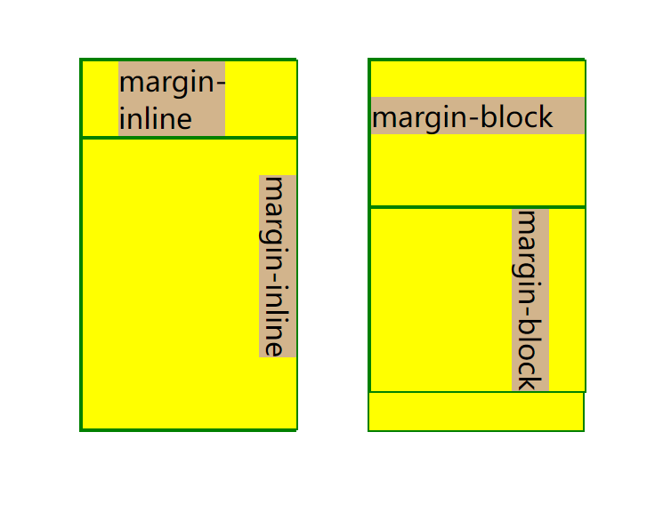

---

## 一、 标准流（normal flow）

在 CSS 中，"normal flow"（标准流）是指元素在文档中按照其出现的顺序自然排列的布局方式。它是 CSS 布局模型中的一种默认布局方式，也是大多数元素的默认行为。

在正常流布局中，元素按照其在 HTML 文档中的出现顺序从上到下排列，每个元素占据一定的空间。元素的位置由其前面的元素决定，可以通过调整元素的外边距、内边距、宽度、高度等属性来影响其布局位置。

> **包含块**的概念
>
> - 每个盒子都有它的包含块，包含块决定了盒子的排列区域
> - 绝大部分情况下：盒子的包含块，为其 ==父元素的内容盒==
> - 当盒子开启 ==绝对定位== 以后，它的包含块变为距它 ==最近的开启了定位的父元素==
> - 当盒子开启 ==固定定位== 时，它的包含块为 ==视口==

### 1. 元素在标准流中的特点

**块盒**（block）

- 块盒会在页面中 ==独占一行== (自上向下垂直排列)
- 默认总宽度为 ==包含块的宽度== （`width:auto`）
-  默认高度是被内容撑开（子元素）
-  内边距（padding）, 外边距（margin）和 边框（border）会将其他元素从当前盒子周围“推开”

**行盒**（inline）

- 行盒 ==不会独占页面的一行== ，只占自身的大小
- 行内元素在页面中自左向右水平排列，如果一行中不能容纳下所有的行内元素，则元素会换到第二行继续自左向右排列（与书写习惯一致）
- 行内元素的  ==默认宽度和高度都是被内容撑开， 宽高设置不生效==
- 垂直方向的内边距、外边距以及边框会被应用但是 ==不会== 把其他处于 `inline` 状态的盒子推开。
- 水平方向的内边距、外边距以及边框会被应用且 ==会== 把其他处于 `inline` 状态的盒子推开。

**行块盒**（inline-block）

- 行盒特点
  - 行块盒 不会独占页面的一行
  - 行块盒的默认宽度和高度都是**被内容撑开**

- 块盒特点
  - 可以设置宽高
  - 内边距（padding）, 外边距（margin）和 边框（border）会将其他元素从当前盒子周围“推开”


### 2. 元素脱离标准流的特点

块盒：

- 块盒不再独占页面的一行

- 脱离文档流以后，块盒的宽度和高度默认都被内容撑开

行盒：

- 行盒脱离文档流以后会变成块盒，特点和块盒一样

脱离文档流以后，不需要再区分块和行内了，即两者皆具有如下特点：

- 可以随意设置宽高，宽高默认由内容决定
- 大部分元素在脱标后都会转换成`block`类型，但元素脱离标准流之后不受其约束，不再给父元素汇报宽高数据，也就是不能将父元素撑开。

---

## 二、 盒模型（box model）

完整的 CSS 盒模型应用于块盒，行盒只使用盒模型中定义的部分内容。CSS将页面中的所有元素都设置为了一个矩形的盒子，将元素设置为矩形的盒子后，对页面的布局就变成将不同的盒子摆放到不同的位置，每一个盒子都由以下几个部分组成：

内容区（content）、内边距（padding）、边框（border）、外边距（margin）。


### 1. 内容区（content）

- 元素中所有的子元素和文本内容都在内容区中排列 
- 内容区的大小由`width` 和 `height`两个属性来设置
- `width` 设置内容区的宽度，`height` 设置内容区的高度 

> `width`、包括下面的`padding`和`margin`的属性值可以设置为百分比形式
>
> - 以上所有的百分比都是相对于 ==包含块的宽度== 进行设置的 (包括设置`padding-top`和`margin-top`)
>
> `height`的百分比设置
>
> - 当包含块的高度设置为auto，即它的高度取决于子元素的高度，这时高度的百分比设置无效
> - 当包含块的高度不依赖子元素的高度，则百分比设置相对于包含块的高度进行设置

### 2. 边框（border）

边框属于盒子边缘，边框里边属于盒子内部，出了边框则属于盒子的外部

- ==边框的大小会影响到整个盒子的大小==


要设置边框，需要至少设置三个样式：边框的宽度（border-width）、边框的颜色（border-color）、边框的样式 （border-style）。这三种样式都可以用来指定四个方向的边框：

- 四个值：上 右 下 左(顺时针)
- 三个值：上 左右 下
- 两个值：上下 左右
- 一个值：上下左右

当然一般我们也不会这么蛋疼，都是四个方向统一设置，故可以通过简写属性同时设置边框的所有相关样式，且没有顺序要求。

- eg：`border: 10px red solid;`

### 3. 内边距（padding）

内容区和边框之间的距离是内边距（不能为负），通常用于将内容推离边框

- 一共有四个方向的内边距：`padding-top、padding-right、padding-bottom、padding-left`
- `padding` 内边距的简写属性，可以同时指定四个方向的内边距，规则和`border-width` 一样
- ==内边距的设置会影响到盒子的大小==
- ==内容区的背景颜色会延伸到内边距上==

::: tip 提示

一个盒子可见框的大小，由**内容区**、**内边距**和**边框**共同决定，所以在计算盒子大小时，需要将这三个区域加到一起计算。

:::

### 4. 外边距（margin）

==外边距不会影响盒子可见框的大小==，但是会影响盒子的位置（把其他元素从盒子旁边推开）

- 一共有四个方向的外边距：`margin-top、margin-right、margin-bottom、margin-left`
- `margin`的简写属性， 可以同时设置四个方向的外边距 ，用法和`padding`一样

元素在页面中是按照自左向右的顺序排列的，所以默认情况下如果我们设置的 ==左和上外边距则会移动元素自身，而设置下和右外边距会移动其他元素== 。

除此之外margin还有两个简写属性`margin-block`和`margin-inline`

- `margin-block` 定义了元素的逻辑块首和块末外边距
- `margin-inline` 定义了元素的逻辑行首和行末外边距

```css
.inline p {
    margin: 0;
    margin-inline: 20px 40px;
    background-color: tan;
}

.block p {
    margin: 0;
    margin-block: 20px 40px;
    background-color: tan;
}

.verticalExample {
    writing-mode: vertical-rl;
}
```



::: tip 提示

默认情况下设置`margin-right`不会产生任何效果( ==默认情况它总是被浏览器所修改的值== )

:::

### 5. 盒子尺寸

默认情况下，盒子可见框的大小由 ==内容区、内边距和边框== 共同决定，我们可以使用`box-sizing` 来设置盒子尺寸的计算方式（设置width和height的作用）

- `content-box` 默认值，宽度和高度用来设置 ==内容区== 的大小
- `border-box` 宽度和高度用来设置 ==整个盒子可见框== 的大小
  - 此时`width`和 `height`指的是内容区、内边距和边框的总大小

### 6. 盒模型的显示

==display属性== 用于设置元素显示的类型（`display: block;`），可以分为外部表现和内部表现，外部类型设置元素如何参与标准流布局；内部类型设置子元素的布局。

外部表现：

- `inline` 将元素设置为行盒
- `block` 将元素设置为块盒

> 浏览器支持双值语法(css3)，当仅发现外部值时，例如当指定 `display: block` 或 `display: inline`，其将内部值设置为 `flow`。这种行为符合预期；例如，当指定一个元素是块盒后，一般来说我们期望该元素的内部元素参与正常的流布局。

内部表现：

- `flow` 该元素使用流式布局（块和内联布局）来排布它的内容
- `flow-root` 该元素生成一个块级元素盒，其会建立一个新的BFC，定义格式化上下文的根元素。

- `inline-block` 将元素设置为行内块元素 （既可以设置宽度和高度又不会独占一行）
- `table` 该元素的行为类似于 HTML 中的`<table>`元素。它定义了一个块级别的盒子
- `flex` 该元素的行为类似块级元素并且根据[弹性盒模型](https://developer.mozilla.org/zh-CN/docs/Web/CSS/CSS_flexible_box_layout)布局它的内容。
- `grid` 该元素的行为类似块级元素并且根据[网格模型](https://developer.mozilla.org/zh-CN/docs/Web/CSS/CSS_grid_layout/Basic_concepts_of_grid_layout)布局它的内容

> 当仅发现内部值时，例如当指定 `display: flex` 或 `display: grid`，其将外部值设置为 `block`。这种行为符合预期；例如，当指定一个元素是 `display: grid`，一般来说我们希望整个元素在标准流中表现为一个块盒

基于css3的双值语法兼容性还存在问题，所以一般情况下我们使用css2中单关键字的预组合的语法：

- `inline-block` 等同于 `inline flow-root` （所以这种方式可以为元素开启一个新的BFC）
- `inline-table` 等同于 `inline table`
- `inline-flex` 等同于 `inline flex`
- `inline-grid` 等同于 `inline grid`

`none` 元素不在页面中显示， ==不占据页面位置==

==visibility== ：显示或隐藏元素而不更改文档的布局（`visibility: hidden;`）

- `visible` 默认值，元素在页面中正常显示
- `hidden` 元素在页面中隐藏不显示，但是 ==依然占据页面的位置==
- `collapse` 对于`<table>` 行、列、列组和行组，与 `display: none` 用于表格的行/列上的效果相当；对于其他元素，`collapse` 被视为与 `hidden` 相同


