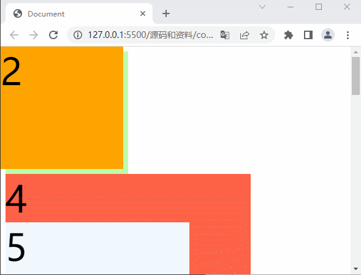
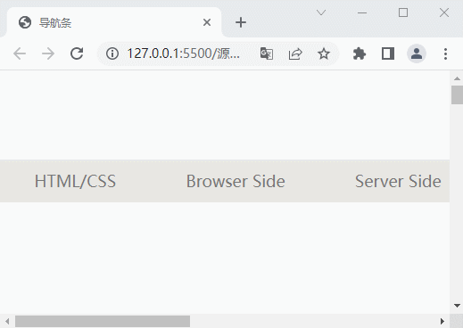
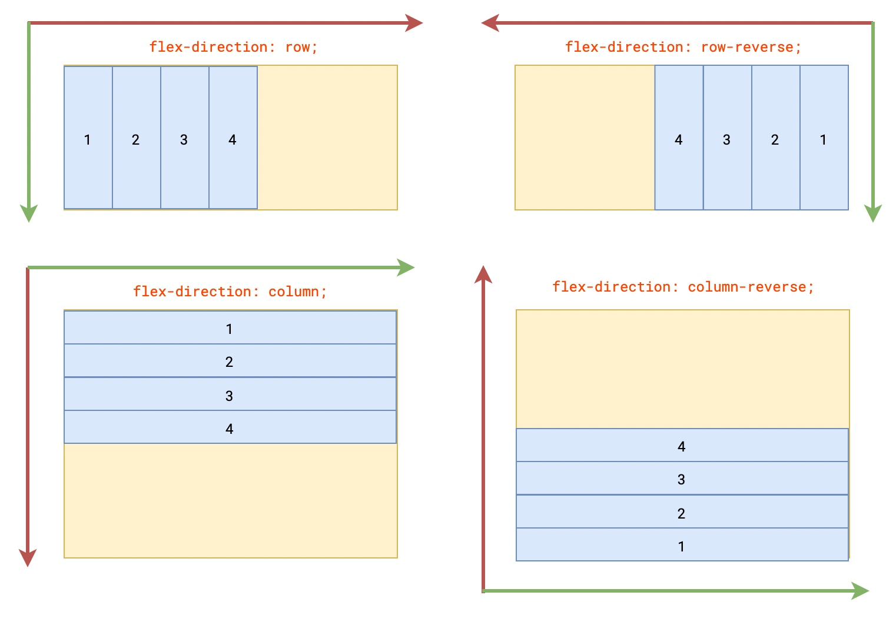
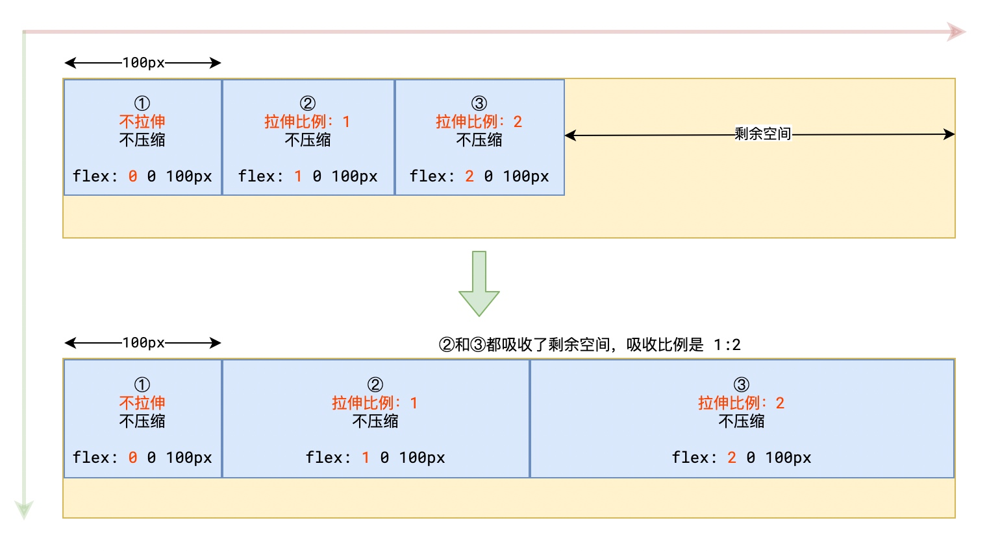

## 一、常规流布局

常规流布局（在布局介绍里提到过）是一套用于在浏览器视口内组织元素如何放置的系统。默认地，块级元素按照基于其父元素的[书写模式](https://developer.mozilla.org/zh-CN/docs/Web/CSS/writing-mode)（_默认值_：horizontal-tb）的块流动方向（block flow direction）放置。每个块级元素会在上一个元素下面另起一行，它们会以指定的外边距分隔。以英语为例（或者其他水平书写、自上而下的书写模式中），块级元素是垂直组织的。

行级（inline）元素的表现有所不同。它们不会另起一行；只要在其父级块级元素的宽度内有足够的空间，它们与其他内联元素、相邻（或换行）的文本内容被安排在同一行。如果空间不够，溢出的内容将下移到新的一行。

如果两个垂直相邻的元素都设置了外边距并且两个外边距相接触，那么更大的外边距会被保留，小的则会消失——这被称为[**外边距折叠**](https://developer.mozilla.org/zh-CN/docs/Web/CSS/CSS_box_model/Mastering_margin_collapsing)。外边距折叠仅与 ==垂直方向== 有关。

### 1. 盒子的水平布局

**元素在其父元素中水平方向的位置由以下几个属性共同决定（自左向右）：**

`margin-left、border-left、padding-left、width、padding-right、border-right、margin-right`

**一个元素在其父元素中，水平布局必须要满足以下的等式：**

`margin-left + border-left + padding-left + width + padding-right + border-right + margin-right = 其父元素内容区的宽度`

以上等式必须满足，如果相加结果使等式不成立，则称为**过度约束**，**等式会自动调整**

#### 调整的情况

- 如果这七个值中没有为 `auto` 的情况，则浏览器会自动调整`margin-right`值以使等式满足。
- 这七个值中有三个值可以设置为 auto：`width、margin-left、margin-right`，若其中某个值为 auto，则等式会调整其值来使等式成立。
- 当`margin`和`width`都设置为 auto 时，因为`width`的吸收能力强，他会吸收剩余的空间，会优先进行调整

#### 举例说明

设置 width 为 200px，父元素 width 为 800px:

- `0 + 0 + 0 + 200 + 0 + 0 + 0 = 800`
- 则会自动调整 ==margin-right== ：`0 + 0 + 0 + 200 + 0 + 0 + 600 = 800`

初始设置：`100 + 0 + 0 + 200 + 0 + 0 + 400 = 800`

- 则会自动调整 ==margin-right== ：`100 + 0 + 0 + 200 + 0 + 0 + 500 = 800`

初始设置：`0 + 0 + 0 + auto + 0 + 0 + 0 = 800` ；

- 则自动调整`auto = 800（width）`

初始设置：`auto + 0 + 0 + 200 + 0 + 0 + auto = 800 ；`

- 则自动调整`auto = 300（margin-left、margin-right）`

#### 多个 auto 自动调整说明

- 如果宽度和其他属性设置为 auto，则自动调整宽度，其他属性置为 0。
- 如果将两个外边距设置为 auto，宽度固定值，则会将两外边距设置为相同值。

::: tip 提示

我们经常利用这个特点来使一个元素在其父元素中水平居中：

```css
width: xxxpx;
margin: 0 auto;
```

:::

### 2. 垂直方向的布局

默认情况下父元素的高度被内容撑开，子元素是在父元素的内容区中排列的，如果子元素的大小超过了父元素，则子元素会从父元素中溢出（即当元素的内容太大而无法适应它的[区块格式化上下文](https://developer.mozilla.org/zh-CN/docs/Web/CSS/CSS_display/Block_formatting_context)时），我们使用 `overflow` 属性来设置父元素如何处理溢出的子元素。

`overflow:auto`

- `visible` (默认值 )子元素会从父元素中溢出，在父元素外部的位置显示
- `hidden` 溢出内容将会被裁剪不会显示
- `clip` 与 hidden 效果相同，两者之间的区别是`clip` 关键字禁止所有滚动，包括以编程方式的滚动。该盒子不是一个滚动的容器，并且不会启动新的格式化上下文。
- `scroll` 总是生成两个滚动条，通过滚动条来查看完整的内容
- `auto` 根据需要生成滚动条

> 指定 `visible`（默认）或 `clip` 以外的值，会创建一个新的区块格式化上下文。

### 3. 外边距重叠

相邻的垂直方向外边距会发生 ==重叠现象==

兄弟元素

- 兄弟元素间的相邻垂直外边距会取两者之间的 ==较大值== （两者都是正值）

- 特殊情况：

  - 如果相邻的外边距一正一负，则取两者的和；

  - 如果相邻的外边距都是负值，则取两者中绝对值较大的。

- 兄弟元素之间的外边距的重叠，对于开发是有利的，所以我们不需要进行处理。

父子元素

- 父子元素间相邻外边距，子元素的会传递给父元素（上外边距），连带着父元素一起移动。
- 父子外边距的折叠会影响到页面的布局，必须要进行处理
- 解决方式： ==要么不用外边距，要么不相邻==

## 二、浮动（float）

通过浮动可以使一个元素向其父元素的左侧或右侧移动

### 1. 设置元素的浮动

我们使用`float`属性来设置元素的浮动

​ **可选值**：

- `none` 默认值 ，元素不浮动
- `left` 元素向左浮动
- `right` 元素向右浮动

由于 `float` 意味着使用块布局，它在某些情况下会修改 [`display`](https://developer.mozilla.org/zh-CN/docs/Web/CSS/display) 值的计算值。

### 2. 浮动的特点

当一个元素浮动之后，它会被移出正常的文档流，然后向左或者向右平移，一直平移直到碰到了所处的容器的边框，或者碰到**另外一个浮动的元素**

- 浮动元素会完全 ==脱离文档流== ，不再占据文档流中的位置

- 元素下边的还在文档流中的元素会自动向上移动

- 设置浮动以后元素会向父元素的左侧或右侧移动

- 浮动元素向左或向右移动时，**不会从父元素中移出**，也不会超过它前边的其他浮动元素

- 如果浮动元素的上边是一个没有浮动的块元素，则浮动元素无法上移

- 浮动元素不会超过它上边的浮动的兄弟元素，最多最多就是和它一样高

- 元素设置浮动以后，**水平布局的等式便不需要强制成立**

- **浮动元素不会盖住文字**，文字会自动环绕在浮动元素的周围，所以我们可以利用浮动来设置文字环绕图片的效果

::: tip 总结

浮动目前来讲它的主要作用就是让页面中的元素可以水平排列，通过浮动可以制作一些 ==水平方向的布局==

:::

### 3. 浮动带来的问题

在浮动布局中，父元素的高度默认是被子元素撑开的，当子元素浮动后会完全脱离文档流，其将会无法撑起父元素的高度，导致父元素的高度丢失，然后其下的元素会自动上移，导致页面的布局混乱。这个问题我们称之为 ==高度塌陷== 。高度塌陷是浮动布局中比较常见的一个问题，这个问题我们必须要进行处理！

### 4. 解决方案

#### (1). BFC(Block Formatting Context) 块级格式化上下文

BFC 是 CSS 中的一个隐含的属性，我们可以为一个元素开启 BFC，开启 BFC 该元素会变成一个 ==独立== 的渲染区域，它规定了在该区域中，常规流块盒的布局。


> 不同的 BFC 区域，他们进行渲染时互不干扰
>
> 创建 BFC 的元素，隔绝了它内部和外部的联系，内部的渲染不会影响到外部

元素开启 BFC 后的特点：

- 开启 BFC 的元素不会被浮动元素所覆盖，会调整自身`width`和`margin`来避开浮动元素

  > 所以当想设置此元素的边距时，要设置浮动元素的`margin`

- 开启 BFC 的元素子元素和父元素外边距不会重叠（解决外边距重叠问题 ）

- 开启 BFC 的元素可以包含浮动的子元素，即自动高度需要计算浮动元素（主要解决高度塌陷问题）

可以通过一些特殊方式来开启元素的 BFC：

- 设置元素的 ==浮动或者绝对定位== （不推荐）
  - 解决高度塌陷问题，但是其会脱离文档流，丢失元素宽度（脱离文档流后默认由内容撑开宽度），布局下面的元素会上移。
- 将元素设置为 ==行内块元素== （不推荐）
  - 行内块不适合作为外部的容器，且其元素宽度也会丢失
- 将元素的`overflow`设置为一个非`visible`的值（常用）
  - 常用的方式：为父元素设置 ==overflow:hidden== 开启其 BFC 以使其可以包含浮动元素
- 在父元素中设置`display`值为 `flow-root`
  - 偏现代的解决方案，存在一定的兼容性问题。

> 完整的 _BFC_ 触发方式可以参阅：[区块格式化上下文](https://developer.mozilla.org/zh-CN/docs/Web/Guide/CSS/Block_formatting_context)

#### (2). clear

存在两个块级元素 box1、box2，当设置了 box1 的浮动，导致 box2 位置上移时，我们认为是 box2 受到了 box1 浮动的影响，位置发生了改变。

如果我们不希望某个元素因为其他元素浮动的影响而改变其位置，可以通过`clear`属性来清除浮动元素对当前元素所产生的影响。

**clear**

- 作用：清除浮动元素对当前元素所产生的影响
- 可选值：

  - `left` 清除左侧浮动元素对当前元素的影响
  - `right` 清除右侧浮动元素对当前元素的影响
  - `both` 清除两侧中最大影响的那侧

- 原理：设置清除浮动以后，浏览器会自动为元素添加一个上外边距， 以使其位置不受其他元素的影响

#### (3). 最终解决方案

我们在父元素中新建一个块元素，并利用`clear`属性使其免受另一子元素的浮动影响，则新建块元素会存在于其下面（本身并未浮动），所以父元素会将其包裹，这样高度就不会塌陷。

```css
.box1::after {
  content: '';
  display: block; /*默认创建的伪元素为行内元素*/
  clear: both;
}
```

之前我们说到解决外边距重叠时，要么不用外边距，要么不相邻；同样可以使用这种方式解决、

```css
/* 
clearfix 这个样式可以同时解决高度塌陷和外边距重叠的问题，
当你在遇到这些问题时，直接使用clearfix这个类即可 
*/
.clearfix::before,
.clearfix::after {
  content: '';
  display: table;
  clear: both;
}
```

---

## 三、定位（position）

通过定位我们可以将元素摆放到页面的任意位置

### 1. 属性

**使用 position 属性来设置定位**

- 可选值
  - `static` 默认值，元素是静止的没有开启定位
  - `relative` 开启元素的相对定位
  - `absolute` 开启元素的绝对定位
  - `fixed` 开启元素的固定定位
  - `sticky` 开启元素的粘滞定位

### 2. 相对定位

当元素的`position`属性值设置为`relative`时则开启了元素的相对定位

- 偏移量（offset）

  - 当元素开启了定位以后，可以通过 ==偏移量== 来设置元素的位置

  - `top`：定位元素和定位位置上边的距离

  - `bottom`：定位元素和定位位置下边的距离

    ::: tip 提示

    定位元素垂直方向的位置由`top`和`bottom`两个属性控制；通常情况下只会使用其中一个

    top 值越大，定位元素越向下移动；`bottom`值越大，定位元素越向上移动

    :::

  - `left`：定位元素和定位位置的左侧距离

  - `right`：定位元素和定位位置的右侧距离

    ::: tip 提示

    定位元素水平方向的位置由`left`和`right`两个属性控制，通常情况下只会使用其中一个

    `left`越大元素越靠右；`right`越大元素越靠左

    :::

相对定位的特点

- 元素开启相对定位以后，如果不设置偏移量元素不会发生任何的变化
- 相对定位是参照于元素在文档流中的位置进行定位的(box 左上， ==距离原始位置的变动== )
- 相对定位会提升元素的层级
- ==相对定位不会使元素脱离文档流==
- 相对定位不会改变元素的性质，块还是块，行内还是行内

### 3. 绝对定位

当元素的`position`属性值设置为`absolute`时，则开启了元素的绝对定位

- 包含块( containing block )

  - 正常情况下：包含块就是离当前元素最近的祖先块元素
  - 绝对定位的包含块：包含块就是离它 ==最近的开启了定位的祖先元素== ， 如果所有的祖先元素都没有开启定位，则根元素（html）就是它的包含块

- 绝对定位的特点：

  - 开启绝对定位后，如果不设置偏移量元素的位置不会发生变化
  - ==开启绝对定位后，元素会从文档流中脱离==
  - 绝对定位会改变元素的性质，行内变成块，块的宽高被内容撑开
  - 绝对定位会使元素提升一个层级
  - 绝对定位元素是相对于 ==其包含块== 进行定位的

  > 此时样式属性的百分比值也是相对包含块进行设置的

### 4. 固定定位

将元素的`position`属性设置为`fixed`则开启了元素的固定定位；固定定位也是一种绝对定位，所以固定定位的大部分特点都和绝对定位一样

- 唯一不同的是固定定位永远参照于浏览器的视口（浏览器的可视窗口）进行定位，固定定位的元素不会随网页的滚动条滚动



### 5. 粘滞定位

当元素的`position`属性设置为`sticky`时则开启了元素的粘滞定位；粘滞定位和相对定位的特点基本一致，不同的是粘滞定位可以在元素到达某个位置时（与父元素的相对位置）将其固定。

- 类似于相对定位`relative`和固定定位`fixed`的结合；它主要用在对`scroll`事件的监听上；简单来说，在滑动过程中，某个元素距离其父元素的距离达到`sticky`粘性定位的要求时(比如 top：100px)；`position:sticky`这时的效果相当于 fixed 定位，固定到适当位置。



## 四、绝对定位元素的布局

当我们开启了绝对定位后， 水平方向的布局等式就需要添加`left` 和 `right` 两个值，此时规则和之前一样只是多添加了两个值

::: tip 提示

left + margin-left + border-left + padding-left + width + padding-right + border-right + margin-right + right = 包含块的内容区的宽度

:::

### 1. 当发生过度约束

- 如果 9 个值中没有 auto 则自动调整`right`值以使等式满足（之前是`margin-right`）

- 如果有 auto，则自动调整 auto 的值以使等式满足
- 可设置 auto 的值:`margin width left right`
- 因为 left 和 right 的值默认是 auto，所以如果不指定 left 和 right。则等式不满足时，会自动调整这两个值，元素会按照正常流的布局方式进行定位，左边界和右边界会自动计算以适应可用空间。

==垂直方向布局的等式的也必须要满足== （与之前盒模型不同）

::: tip 提示

top + margin-top/bottom + padding-top/bottom + border-top/bottom + height = 包含块的高度

:::

### 2. 元素的层级

对于开启了定位的元素，可以通过`z-index`属性来指定元素的层级，`z-index`需要一个整数作为参数，值越大元素的层级越高，元素越优先显示。

如果元素的层级一样，则优先显示靠下的元素；祖先的元素的层级再高也不会盖住后代元素。（具体规则参考下列堆叠上下文）

---

## 五、堆叠上下文（stack context）

堆叠上下文(stack context)，它是一块区域，这块区域由某个元素创建，它规定了该区域内的内容在 Z 轴上排列的先后顺序。（即当元素开始重叠，哪些元素应该出现在其他元素顶部）

### 1. 创建堆叠上下文的元素

- htm1 元素（根元素）
- 设置了`z-index`(非 auto)数值的定位元素

### 2. 同一个堆叠上下文中元素在 Z 轴上的排列

从后到前的排列顺序：

1. 创建堆叠上下文的元素的背景和边框（祖先在后）
2. 堆叠级别(z-index,stack 1evel)为负值的堆叠上下文( ==整体== )
3. 常规流非定位的块盒 （block）
4. 非定位的浮动盒子 （float）
5. 常规流非定位行盒 （inline）
6. 任何 z-index 是 auto 的定位子元素，以及 z-index 是 0 的堆叠上下文 （position）

7. 堆叠级别为正值的堆叠上下文

> 每个堆叠上下文，独立于其他堆叠上下文，它们之间不能相互穿插。

## 六、常见的整体布局

### 1. 两栏或者三栏布局

一般情况下侧边栏会定宽，此时我们为侧边栏开启 ==浮动== ，而主内容区分为两种情况：

- 主内容区同样 ==定宽== ，则将主内容区也开启浮动并设置宽度。
- 主内容区需要 ==自适应宽度== ，则在主内容区中设置`overflow:hidden;`来开启 BFC，从而避免被浮动元素所覆盖。（当然也可以使用`padding`为侧边栏留出空白空间）

浮动布局

```html
<!DOCTYPE html>
<html lang="en">
  <head>
    <meta charset="UTF-8" />
    <meta name="viewport" content="width=device-width, initial-scale=1.0" />
    <title>Document</title>
    <style>
      div {
        border: 1px solid black;
      }
      .container {
        width: 100%;
      }
      .slider-left,
      .slider-right {
        width: 200px;
        float: left;
      }
      .slider-right {
        float: right;
      }
      .main-content {
        overflow: hidden;
        /* padding: 0 200px; */
        /* margin: 0 200px; */
      }
    </style>
  </head>
  <body>
    <div class="container">
      <div class="slider-left">zuo</div>
      <div class="slider-right">you</div>
      <div class="main-content">content</div>
    </div>
  </body>
</html>
```

绝对定位布局

```html
<html>
  <head>
    <style type="text/css">
      .container {
        position: relative;
      }

      .left,
      .right {
        width: 200px;
        position: absolute;
        top: 0;
      }

      .left {
        left: 0;
      }

      .right {
        right: 0;
      }

      .main {
        margin: 0 200px; /* 宽度等于左右侧栏宽度 */
      }
    </style>
  </head>
  <body>
    <div class="container">
      <div class="left" style="border: 1px solid black;">Left Sidebar</div>
      <div class="main" style="border: 1px solid black;">Main Content</div>
      <div class="right" style="border: 1px solid black;">Right Sidebar</div>
    </div>
  </body>
</html>
```

Flex 布局

```html
<html>
  <head>
    <style type="text/css">
      .container {
        display: flex;
      }

      .left,
      .right {
        width: 200px;
      }

      .main {
        flex: 1; /* 自动扩展填充剩余空间 */
      }
    </style>
  </head>
  <body>
    <div class="container">
      <div class="left" style="border: 1px solid black;">Left Sidebar</div>
      <div class="main" style="border: 1px solid black;">Main Content</div>
      <div class="right" style="border: 1px solid black;">Right Sidebar</div>
    </div>
  </body>
</html>
```

Grid 布局

```html
<html>
  <head>
    <style type="text/css">
      .container {
        display: grid;
        grid-template-columns: 200px 1fr 200px; /* 列的宽度 */
      }
    </style>
  </head>
  <body>
    <div class="container">
      <div class="left" style="border: 1px solid black;">Left Sidebar</div>
      <div class="main" style="border: 1px solid black;">Main Content</div>
      <div class="right" style="border: 1px solid black;">Right Sidebar</div>
    </div>
  </body>
</html>
```

> - 当对盒子设置浮动时，要注意 ==高度塌陷== 问题。
> - 有时为了方便搜索引擎的检索，我们需要将主区域的代码靠前书写，此时就不能再使用浮动了，可以先在主区域中使用 margin 或者 padding 将侧边栏的位置空出来，然后将侧边栏定位到指定位置上去。

### 2. 等高布局

#### 伪等高

- **边框模拟**：因为主内容区边框和其高度始终相同，用元素的边框颜色来伪装左右两边侧边栏的背景色。然后将左右两个透明背景的侧边栏使用`absolute`覆盖在主内容区的的左右边框上，实现视觉上的等高效果。

  ```css
  <style>
  body,p{margin: 0;}
  .parent{
      position: relative;
  }
  .center{
      box-sizing:border-box;
      padding: 0 20px;
      background-clip: content-box;
      border-left: 210px solid lightblue;
      border-right: 310px solid lightgreen;
  }
  .left{
      position: absolute;
      top: 0;
      left: 0;
      width: 200px;
  }
  .right{
      position: absolute;
      top: 0;
      right: 0;
      width: 300px;
  }
  </style>
  ```

  ```html
  <div class="parent" style="background-color: lightgrey;">
    <div class="left">
      <p>left</p>
    </div>
    <div class="center" style="background-color: pink;">
      <p>center</p>
      <p>center</p>
    </div>
    <div class="right">
      <p>right</p>
    </div>
  </div>
  ```

  > 左右两侧元素的内容高度不能大于中间元素内容高度，否则无法撑开容器高度

- **负 margin**：将侧边栏高度设置为一个很大的值，再设置稍小数值的负的`margin-bottom`，这时实际盒子的高度很小，但内容区均能显示出来，在其父元素中设置`overflow:hidden`将超出部分隐藏，实现视觉上的等高效果。

  ```css
  <style>
  body,p{margin: 0;}
  .parent{
      overflow: hidden;
  }
  .left,.centerWrap,.right{
      float: left;
      width: 50%;
  }
  .center{
      margin: 0 20px;
  }
  .left,.right{
      width: 25%;
      height: 10000px;
      margin-bottom: -9990px;
  }
  </style>
  ```

  ```html
  <div class="parent" style="background-color: lightgrey;">
    <div class="left" style="background-color: lightblue;">
      <p>left</p>
    </div>
    <div class="centerWrap">
      <div class="center" style="background-color: pink;">
        <p>center</p>
        <p>center</p>
      </div>
    </div>

    <div class="right" style="background-color: lightgreen;">
      <p>right</p>
    </div>
  </div>
  ```

#### 真等高

flex（设置相同伸缩系数）、absolute（父元素必须设置高度）、js

## 七、弹性盒（flex）

flex 是 CSS 中的又一种布局手段，它主要用来代替浮动来完成页面的布局。flex 可以使元素具有弹性，让元素可以跟随页面大小的改变而改变。

### 1. 弹性容器

要使用弹性盒，必须先将一个元素设置为弹性容器。

`display: flex;`

- `display:flex` 设置为块级弹性容器
- `display:inline-flex` 设置为行内的弹性容器

### 2. 更改主轴方向

`flex-direction: row;`

- row 默认值，弹性元素在容器中水平排列（左向右）\- 主轴 自左向右
- row-reverse 弹性元素在容器中反向水平排列（右向左）\- 主轴 自右向左
- column 弹性元素纵向排列（自上向下）
- column-reverse 弹性元素方向纵向排列（自下向上）
- 我们将弹性元素的排列方向称为 ==主轴== ；与主轴垂直的方向称为 ==侧轴==



### 3. 主轴换行

`flex-wrap: wrap-reverse` 设置弹性元素是否在弹性容器中自动换行

- nowrap 默认值，元素不会自动换行，在超出容器可容纳空间时会自动收缩子元素
- wrap 元素沿着辅轴方向自动换行
- wrap-reverse 元素沿着辅轴反方向换行

::: tip 提示

`flex-flow: row wrap; `（wrap 和 direction 的简写属性）

:::

### 4. 主轴排列

`justify-content: center` 主轴上的元素如何排列

- flex-start 元素沿着主轴起边排列

- flex-end 元素沿着主轴终边排列

- center 元素居中排列

- space-around 空白分布到元素两侧

  - 相邻元素间距离相同。每行第一个元素到行首的距离和每行最后一个元素到行尾的距离将会是相邻元素之间距离的一半。

- space-between 空白均匀分布到元素间

  - 相邻元素间距离相同。每行第一个元素与行首对齐，每行最后一个元素与行尾对齐。

- space-evenly 空白分布到元素的单侧

  - 相邻 flex 项之间的间距，主轴起始位置到第一个 flex 项的间距，主轴结束位置到最后一个 flex 项的间距，都完全一样。


### 5. 辅轴排列

`align-items: flex-start` 元素在辅轴上如何排列(元素间的关系)

- stretch 默认值，如果项目没设置 height 或设为 auto 将占满整个容器的高度
- flex-start 交叉轴的起点对齐
- flex-end 交叉轴的终点对齐
- center 交叉轴的中点对齐
- baseline 项目的第一行文字的基线对齐

当存在多轴线即存在多行项目时，将多行项目视为一个整体，默认`align-content`为 stretch。

<iframe id="iframe" width="500" height="300" src="/demo/alignitems.html">
</iframe>


### 6. 辅轴多轴线排列

`align-content: space-between;` align-content 定义了多根轴线的对齐方式。如果项目只有一根轴线该属性不起作用；同样当项目由多条轴线时，此属性会覆盖`align-items`的设置


> 以上均为 ==容器属性== ，而下面的属性属于 ==项目属性==

### 7. 弹性元素伸缩

弹性容器的子元素就是弹性元素（弹性项），弹性元素可以同时是弹性容器。

所谓伸缩，是指在**主轴方向**上，当**弹性容器**有**额外空间**时，是否需要拉伸，当**空间不足**时，是否需要**压缩**

`flex-grow: 2;`

- flex-grow 指定弹性元素的伸展的系数，默认为 0
- 当父元素有多余的空间时，子元素如何伸展，父元素的剩余空间，会按照比例进行分配
- 如果所有项目的 flex-grow 属性值都为 1，则会等分剩余空间

`flex-shrink`

- 指定弹性元素的收缩系数，默认为 1
- 当父元素中的空间不足以容纳所有的子元素时，如何对子元素进行收缩

`flex-basis: auto;` flex-basis 指定的是元素在主轴上的基础长度，如果主轴是横向的则该值指定的就是元素的宽度； 如果主轴是纵向的则该值指定的是就是元素的高度。

- 默认值是 auto，表示参考元素自身的高度或宽度，如果传递了一个具体的数值，则以该值为准

### 8. 简写属性

**flex** 是**flex-grow、flex-shrink、flex-basis**的简写，默认值为**0 1 auto**。后两个属性可选

`flex: 0 1 auto`

- flex 可以设置弹性元素所有的三个样式(拉伸比例 压缩比例 初始尺寸)
- 系统预设了三种情况，可以直接使用 ` flex: initial;`
  - `initial "flex: 0 1 auto"`
  - `auto "flex: 1 1 auto"`
  - `none "flex: 0 0 auto"` 弹性元素没有弹性



### 9.order

order 定义项目排列顺序，数值越小越靠前，允许为负 

## 八、元素居中总结

此处的居中指的是盒子在其包含块中居中

### 1. 水平居中

#### 行盒（行块盒）水平居中

直接设置行盒（行块盒）父元素 `text-align:center`

#### 常规块盒水平居中

定宽，设置左右`margin`为 auto

```css
width: xxx;
margin: 0 auto;
```

#### 绝对定位元素的水平居中

定宽，设置左右坐标为 0（`left:0,right:0`），将左右 margin 设置为 auto

```css
position: absolute;
left: 0;
right: 0;
margin: 0 auto;
```

#### 弹性元素的水平居中

设置弹性容器：

```css
display: flex;
justify-content: center;
```

---

### 2. 垂直居中

#### 单行文本的垂直居中

设置文本所在元素的行高为整个区域的高度

```css
height: 20px;
line-height: 20px;
```

#### 行块盒或块盒内多行文本的垂直居中

设置盒子上下内边距相同，达到类似的效果

```css
padding: xxxpx 0;
```

在文本外套上标签，利用绝对定位

```css
position: absolute;
top: 50%;
left: 50%;
transform: translate(-50%, -50%);
```

#### 绝对定位的垂直居中

定宽，设置上下的坐标为 0（`top:0,bottom:0`）,将上下 margin 设置为 auto

```css
position: absolute;
top: 0;
bottom: 0;
margin: auto 0;
```

#### 弹性元素的垂直居中

设置弹性容器：

```css
display: flex;
align-items: center;
```

## 九、网格（Grid）

网格是一组相交的水平线和垂直线，它定义了网格的列和行。我们可以将网格元素放置在与这些行和列相关的位置上。


具体内容参考[CSS 网格布局 | 阮一峰](http://ruanyifeng.com/blog/2019/03/grid-layout-tutorial.html)
