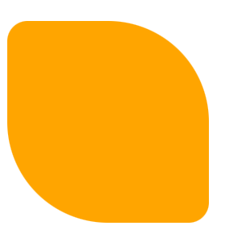
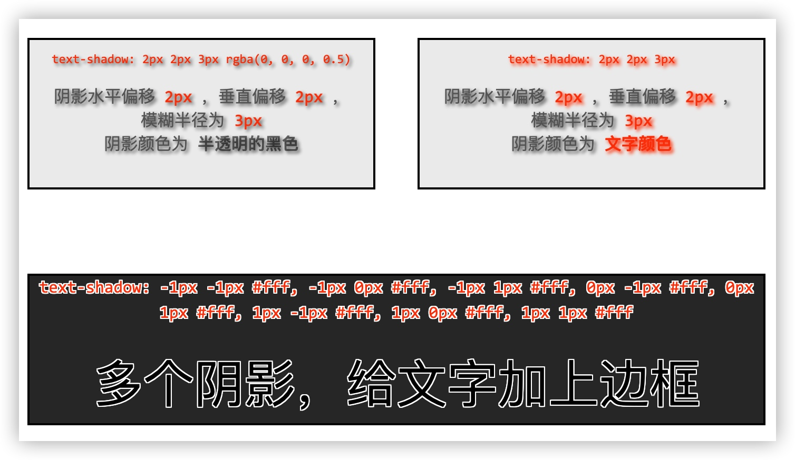

---

## 一、视觉类样式

> 所谓视觉类样式，是指不影响 ==盒子位置、尺寸== 的样式，例如文字颜色、背景颜色、背景图片等

### 1. 默认样式

通常情况，浏览器都会为元素设置一些默认样式，这些样式的存在会影响到页面的布局，一般我们编写网页时必须要去除浏览器的默认样式（PC端的页面）

重置样式表：专门用来对浏览器的样式进行重置的

- `reset.css` 直接去除了浏览器的默认样式
- `normalize.css` 对默认样式进行了统一

### 2. 轮廓

`outline` 用来设置元素的轮廓线，用法和border一模一样

- 轮廓和边框不同的点，就是轮廓不会影响到可见框的大小 

### 3. 圆角

`border-radius`: 用来设置圆角 （圆角设置的圆的半径大小）

- `border-radius` 可以分别指定四个角的圆角
  - 四个值： 左上 右上 右下 左下
  - 三个值： 左上 右上/左下 右下 
  - 两个值： 左上/右下 右上/左下

- `border-radius: 20px 50%;`



- 将元素设置为一个圆形：`border-radius: 50%;`

### 4. 盒子阴影

`box-shadow` 用来设置元素的阴影效果，阴影不会影响页面布局

- 第一个值 水平偏移量 设置阴影的水平位置 正值向右移动 负值向左移动
- 第二个值 垂直偏移量 设置阴影的水平位置 正值向下移动 负值向上移动
- 第三个值 阴影的模糊半径
- 第四个值 阴影的扩散半径
- 可选值：`inset、<color>`

- `box-shadow: 0px 0px 50px rgba(0, 0, 0, .3) ;` 


### 5. 文字阴影

> [MDN详细文档](https://developer.mozilla.org/zh-CN/docs/Web/CSS/text-shadow)

通过`text-shadow`可以设置文字阴影

下面是一些示例



## 二、 变形（transform）

 变形就是指通过CSS来改变元素的形状或位置，它不会影响到页面的布局。

### 1. translate 平移

 transform 用来设置元素的变形效果 ` transform: translateX(100%);` 

- `translateX()` 沿着x轴方向平移
- `translateY()` 沿着y轴方向平移
- `translateZ()` 沿着z轴方向平移
- 当平移单位为百分比时，其百分比相对于自身进行计算


其中z轴平移比较特殊，正常情况下z轴平移指的是调整元素在z轴的位置，即调整元素和人眼之间的距离，距离越大，元素离人越近。但因为z轴平移属于立体效果（近大远小），而默认情况下网页不支持透视，如果想要看见效果，则必须要设置网页的视距。

```css
body{
      /* 设置当前网页的视距为800px，人眼距离网页的距离 */
     perspective: 800px;
    }
```

::: warning 警告

原版视频中是在html标签上添加的perspective，经验证现已失效，设置给body则显示正常。
查阅文档之后，文档中给出了另一种设置方式：`transform: perspective(500px) translateZ(200px);`

:::

### 2. rotate 旋转

通过旋转可以使元素沿着x y 或 z旋转指定的角度 ` transform: rotateY(180deg);`

-  `rotateX()、rotateY()、rotateZ()`
-  `backface-visibility: hidden`;(是否显示元素的背面)
-  与上同理，在进行x、y轴的旋转时，为了显示出3d的效果，需要设置`perspective`

### 3. scale 缩放

 对元素进行缩放的函数 `transform:scale(2)`

-  scaleX() 水平方向缩放、scaleY() 垂直方向缩放、 scale() 双方向的缩放


### 4. 改变变形原点

> [MDN详细文档](https://developer.mozilla.org/zh-CN/docs/Web/CSS/transform-origin)

变形原点的位置，会影响到具体的变形行为

默认情况下， ==变形的原点在盒子中心==，你可以通过`transform-origin`来改变它

```css
transform-origin: center; /* 设置原点在盒子中心 */
transform-origin: left top; /* 设置原点在盒子左上角 */
transform-origin: right bottom; /* 设置原点在盒子右下角 */
transform-origin: 30px 60px; /* 设置原点在盒子坐标 (30, 60) 位置 */
```

::: tip 提示

为了使变形的效果更加平滑，一般情况下我们会为进行变形的元素添加`transition`（过渡）效果

:::

## 三、字体

### 1. 字体相关的样式

- `color` 用来设置字体的颜色
- `font-size` 字体的大小
  - 单位：px、em（相当于当前元素的一个font-size）、rem （相对于根元素的一个font-size）
- `font-weight` 字重 字体的加粗 
  - normal （默认值 不加粗） 、bold （加粗）、100-900 九个级别（没什么用）
- `font-style` 字体的风格
  - normal 正常的、italic 斜体

- `font-family` 字体族（字体的格式）

    - 可选值：serif（衬线字体）、sans-serif（ 非衬线字体）、 monospace（等宽字体）

    - 指定字体的类别，浏览器会自动使用该类别下的字体，一般情况下上述字体作为字体族最后一个作为兜底。

    - font-family 可以同时指定多个字体，多个字体间使用`,`隔开，字体生效时优先使用第一个，第一个无法使用则使用第二个，以此类推。

    - 当指定用户电脑上并未安装的字体时，其不会生效，通过下述属性使用户可以直接使用服务器中的字体。

    - 用户电脑会先将服务器中指定的字体下载，存在一定的网络问题，若网速比较慢，则网页的字体一开始不会正确显示。

   - `font-face`指定的字体提供给用户使用，要注意受到了授权。

  ```css
  @font-face {
  	/* 指定字体的名字 */
  	font-family:'myfont' ;
  	/* 服务器中字体的路径 */
  	src: url('./font/ZCOOLKuaiLe-Regular.ttf') format("truetype");
  	/* format("truetype") 保险措施，一般情况下系统可以自动识别 */
  }
  p{
      font-family: myfont
  }
  ```

::: warning 注意
要注意所使用字体的版权问题！
:::

- 行高（line height），行高指的是文字占有的实际高度，可以通过`line-height`来设置行高。 

  - 行高可以直接指定一个大小（px、em），也可以直接为行高设置一个整数，如果是一个整数的话，行高将会是字体大小的指定倍数。

  - 行高经常还用来设置文字的行间距：`行间距 = 行高 - 字体大小`

  - 我们可以**将行高设置为和高度一样的值**，使单行文字在一个元素中垂直居中

- 字体框

  - 字体框就是字体存在的格子，设置`font-size`实际上就是在设置字体框的高度

  - 行高会在字体框的上下平均分配

- **字体的简写属性**，font 可以设置字体相关的所有属性

  - font: 字体大小/行高 字体族（行高可以省略不写，如果不写使用默认值）

  - 示例：`font: bold italic 50px/2  微软雅黑, 'Times New Roman', Times, serif;`

### 2. 图标字体（iconfont）

在网页中经常需要使用一些图标，可以通过图片来引入图标，但是图片大小本身比较大，并且非常的不灵活（颜色、大小）。所以在使用图标时，我们还可以将图标直接设置为字体， 然后通过`font-face`的形式来对字体进行引入，这样我们就可以通过使用字体的形式来使用图标。

#### fontawesome

fontawesome是一个公共的图标字体库，我们要想使用它，首先要在[官网](https://fontawesome.com/)（英文官网，中文官网版本比较旧）下载字体库，解压到本地之后，文档中存在很多文件，我们只需要将`css`和`webfonts`移动到项目中的同一目录下。然后将`all.css`或者`all.min.css`引入到网页中`<link rel="stylesheet" href="./fa/css/all.css">`，之后直接使用图标字体即可。

**使用方式：**

- 直接通过类名使用图标字体

  ```html
  <i class="fas fa-bell-slash"></i>
  <i class="fab fa-accessible-icon"></i>
  ```

  `fa-bell-slash`属于图标字体名（同上面font-face定义内容），前面是`fas`或者`fab`（同上面p定义内容，将图标字体指定为字体族，只有这两种免费使用），将如果其中一种不生效记得换另一种试试。

- 通过实体来使用图标字体 

  `<span class="fas">&#xf0f3;</span>` 其中f0f3为字体的编码。

- 通过伪元素来设置图标字体

  1. 找到要设置图标的元素通过before或after选中

  2. 在content中设置字体的编码（通过文档查看）

  3. 设置字体的样式

     - fab：font-family: 'Font Awesome 5 Brands';

     - fas： font-family: 'Font Awesome 5 Free';

       ​          font-weight: 900; 

  ```css
  li::before{
        content: '\f1b0';
        /* font-family: 'Font Awesome 5 Brands'; */
        font-family: 'Font Awesome 5 Free';
        font-weight: 900; 
        color: blue;
        margin-right: 10px;
  }
  ```

#### 阿里的字体库（iconfont）

::: tip 参考

查看字体库下载过程和使用方式: [https://zhuanlan.zhihu.com/p/438121005](https://zhuanlan.zhihu.com/p/438121005)

:::

### 3. 文本样式

- `text-align`

  文本的水平对齐，可选值：

  - `left` 左侧对齐

  - `right` 右对齐

  - `center` 居中对齐

  - `justify` 两端对齐

- `vertical-align`

  元素垂直对齐的方式。可选值：

  - `baseline` 默认值 基线对齐
  - `top` 顶部对齐
  - `bottom` 底部对齐
  - `middle` 居中对齐

- `text-decoration`

  设置文本修饰，可选值：

  - `none` 什么都没有
  - `underline` 下划线
  - `line-through` 删除线
  - `overline` 上划线

- `white-space`

  设置网页如何处理空白。可选值：

  - `normal` 正常（当文字超过父元素设置的宽度时，自动换行）
  - `nowrap` 不换行
  - `pre` 保留空白

---

## 四、背景

### 1. 背景颜色

`background-color: #bfa;`

- 背景颜色可以延伸至元素的内容和内边距盒子的下面

### 2. 背景图片

`background-image: url("./img/1.png");`

- 可以同时设置背景图片和背景颜色，这样背景颜色将会成为图片的 ==背景色==
- 如果背景的图片小于元素，则背景图片会自动在元素中 ==平铺== 将元素铺满
- 如果背景的图片大于元素，将会有部分背景无法完全显示（大图不会缩小以适应盒子）
- 如果背景图片和元素一样大，则会直接正常显示

### 3. 控制背景平铺行为

`background-repeat: no-repeat;`

- `repeat` 默认值 ， 背景会沿着x轴 y轴双方向重复平铺
- `repeat-x` 沿着x轴方向重复平铺
- `repeat-y` 沿着y轴方向重复平铺
- `no-repeat` 阻止背景重复平铺

### 4. 背景图片的位置

` background-position: -50px 300px;`

- 通过 `top left right bottom center` 几个表示方位的词来设置背景图片的位置
  - 使用方位词时必须要同时指定两个值，如果只写一个则第二个默认就是`center`
- 通过 ==偏移量== 来指定背景图片的位置
  - 水平方向的偏移量、垂直方向变量

###  5. 背景图片的偏移量计算的原点

`background-origin: border-box;`

- `padding-box` 默认值，`background-position`从内边距处开始计算
- `content-box` 背景图片的偏移量从 ==内容区== 处计算
- `border-box` 背景图片的偏移量从 ==边框== 处开始计算

### 6. 背景的范围

`background-clip: content-box;`

-  `border-box` 默认值，背景会出现在边框的下边
-  `padding-box` 背景不会出现在边框，只出现在内容区和内边距
-  `content-box` 背景只会出现在内容区

### 7. 背景图片的大小

`background-size: contain;`

- 可以设置 ==长度== 或 ==百分比值==

- 第一个值表示宽度 ,第二个值表示高度,如果只写一个，则第二个值默认是 auto
- `cover` 图片的比例不变，将元素铺满，在这种情况下，图像的部分区域可能会跳出盒子外。
- `contain` 图片比例不变，将图片在元素中完整显示，在这种情况下，如果图像的长宽比与盒子的长宽比不同，你可能会在图像的两边或顶部和底部出现空隙。

### 8. 背景图片是否跟随元素移动

`background-attachment: fixed;`

- `scroll` 默认值 背景图片会跟随元素移动
- `fixed` 背景会固定在页面中，不会随元素移动
- `local`：将背景固定在它所设置的元素上，所以当你滚动该元素时，背景也随之滚动。

[查看实际效果](https://mdn.github.io/learning-area/css/styling-boxes/backgrounds/background-attachment.html)

###  9. 背景相关的简写属性

- ` background: url('./img/2.jpg') #bfa  center center/contain border-box content-box no-repeat ;`
  - 所有背景相关的样式都可以通过该样式来设置 ,并且该样式没有顺序要求，也没有哪个属性是必须写的
  - `background-size`必须写在`background-position`的后边，并且使用`/`隔开
  - `background-origin background-clip` 两个样式 ，`orgin`要在`clip`的前边

### 10. 渐变

> [MDN详细文档](https://developer.mozilla.org/zh-CN/docs/Web/CSS/linear-gradient())

在设置 ==背景图片== 时，除了可以使用`url()`加载一张背景图，还可以使用`linear-gradient()`函数设置背景渐变

`linear-gradient()`用于创建一张渐变的图片，语法为：

```css
background-image: linear-gradient(to bottom, #e66465, #9198e5);
```


` background-image: repeating-linear-gradient(to right ,red, yellow 50px);`

-  通过渐变可以设置一些复杂的背景颜色，可以实现从一个颜色向其他颜色过渡的效果
-  渐变是图片，需要通过`background-image`来设置
-  `linear-gradient()` --线性渐变，颜色沿着一条直线发生变化
-  `repeating-linear-gradient()-`-可以平铺的线性渐变
-  渐变可以同时指定多个颜色，多个颜色默认情况下平均分布，也可以手动指定渐变的分布情况，指定颜色分布的起始位置
-  线性渐变的开头，我们可以指定一个渐变的方向(to left、to right等)


- ` background-image: radial-gradient(farthest-corner at 100px 100px, red , #bfa)` 

  - 径向渐变(放射性的效果)， 默认情况下径向渐变的形状根据元素的形状来计算的，正方形 --> 圆形，长方形 --> 椭圆形
  - 我们也可以自己指定渐变的位置。radial-gradient(大小 at 位置, 颜色 位置 ,颜色 位置 ,颜色 位置)
    -  大小： circle 圆形、 ellipse 椭圆、closest-side 近边 、 closest-corner 近角、farthest-side 远边、farthest-corner 远角
    -  位置： top right left center bottom

  