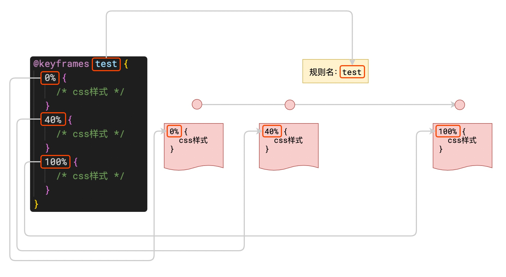
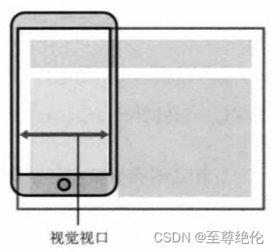

## 一、Animation

> **过渡和动画无法对所有的CSS属性产生影响，能够产生影响的只有数值类属性**，例如：颜色、宽高、字体大小等等

### 1. 过渡（transition）

通过过渡可以指定一个属性发生变化时的切换方式，创建一些非常好的效果，提升用户的体验。

- `transition-property: height , width;`
  - 指定要执行过渡的**属性**，多个属性间使用,隔开，如果所有属性都需要过渡，则使用all关键字
  -  大部分属性都支持过渡效果，注意过渡时必须是从一个有效数值向另外一个有效数值进行过渡
- `transition-duration: 100ms, 2s;`
  - 指定过渡效果的**持续时间**, 时间单位：s 和 ms
- `transition-timing-function: steps(2, start);`
  - 过渡的时序函数,指定**过渡执行的方式**
  -  可选值：
    -  `ease` 默认值，慢速开始，先加速，再减速
    -  `linear` 匀速运动
    - `ease-in` 加速运动
    - `ease-out` 减速运动
    - `ease-in-out` 先加速 后减速
    - `cubic-bezier()` 来指定时序函数（[时序函数编辑]( https://cubic-bezier.com)）
    -  `steps()` 分步执行过渡效果,可以设置第二个值来表明在时间开始还是结束来执行过渡
- `transition-delay: 2s;`
  - 过渡效果的**延迟**，等待一段时间后在执行过渡
- `transition:2s margin-left 1s cubic-bezier(.24,.95,.82,-0.88);` <strong style="color:red">简写属性</strong>
  - 可以同时设置过渡相关的所有属性，只有一个要求，如果要写延迟，则两个时间中第一个是持续时间，第二个是延迟。

> 在JS中，可以监听元素的`transitionstart`和`transitionend`事件，从而在过渡开始和过渡结束时做一些别的事情

### 2. 动画

动画和过渡类似，都可以实现一些动态的效果，不同的是过渡需要在某个属性发生变化时才会触发，而动画可以自动触发动态效果。要想设置动画效果，必须先要设置一个关键帧，关键帧设置了动画执行的每一个步骤。



#### 关键帧的设置

```css
@keyframes test {
      /* from表示动画的开始位置 也可以使用 0% */
      from{
        margin-left: 0;
        background-color: orange;
      } 
      /* to动画的结束位置 也可以使用100%*/
      to{
        background-color: red;
        margin-left: 700px;
      }
    }
```

#### 动画的设置

-  `animation-name: test;`  要对当前元素生效的关键帧的**名字**
- `animation-duration: 4s;`  动画的**执行时间**
- ` animation-delay: 2s;` 动画的**延时**
- `animation-iteration-count: 1;` 动画执行的**次数** ( infinite 无限执行)
- ` animation-direction: alternate-reverse;`  指定动画运行的**方向**
  - normal 默认值  从 from 向 to运行 每次都是这样 
  - reverse 从 to 向 from 运行 每次都是这样 
  - alternate 从 from 向 to运行 重复执行动画时反向执行
  - alternate-reverse 从 to 向 from运行 重复执行动画时反向执行
- `animation-play-state: paused;` 设置动画的**执行状态**
- `animation-fill-mode: both;` 动画的**填充模式**
  - none 默认值 动画执行完毕元素回到原来位置
  - forwards 动画执行完毕元素会停止在动画结束的位置
  - backwards 动画延时等待时，元素就会处于开始位置
  - both 结合了forwards 和 backwards
- `animation: ball .5s forwards linear infinite alternate;` 

> 在JS中，可以监听元素的`animationstart`和`animationnend`事件，从而在过渡开始和过渡结束时做一些别的事情

---

## 二、移动端开发

### 1. 像素

屏幕是由一个个发光的小点构成，这一个个的小点就是像素。我们常说的分辨率：1920 x 1080 说的就是屏幕中小点的数量。在前端开发中像素要分成两种情况讨论：**CSS像素** 和 **物理像素**，上述所说的小点就属于物理像素，而css像素指的是编写网页时我们所用的像素。浏览器在显示网页时，需要将CSS像素转换为物理像素然后再进行呈现，一个css像素最终由几个物理像素显示由浏览器决定：默认情况下在pc端，一个css像素 = 一个物理像素。

### 2. 视口（viewport）

#### 视口分类

> 视口就是屏幕中用来显示网页的区域，在移动端，我们将视口分成三种情况：
>
> - 布局视口（layout viewport）
>   - 作为开发人员，当我们在pc端进行布局时会相对于默认的980px（实际上不同的浏览器默认值可能不同）进行布局，这个默认980px的视口称之为布局视口
>   - 
> - 视觉视口（visual layout）
>   - 如果默认情况下，我们按照980px显示内容，那么右侧有一部分区域 就会无法显示，所以手机端浏览器会默认对页面进行**缩放**以显示到用 户的可见区域中
>   - 那么显示在**可见区域**的这个视口，就是**视觉视口**（visual viewport）
>   - 
> - 理想视口（ideal layout）
>   - 我们通过对layout viewport进行宽度和缩放的设置，以满足正常在一个移动端窗口的布局；**就是布局视口和视觉视口的大小相同**
> - [点击原博客地址查看全文](https://blog.csdn.net/m0_51636525/article/details/124468206)

### 3. 像素比

我们可以通过查看视口的大小，来观察CSS像素和物理像素的比值。

- 默认情况下： 视口宽度1920px（CSS像素）、1920px（物理像素）， 此时，css像素和物理像素的比是 1:1
- 放大两倍的情况：视口宽度960px（CSS像素）、1920px（物理像素）， 此时，css像素和物理像素的比是1:2
- 我们可以通过改变视口的大小，来改变CSS像素和物理像素的比值

在不同的屏幕，单位像素的大小是不同的，像素越小屏幕会越清晰。智能手机的像素点远远小于计算机的像素点， 默认情况下，移动端的网页都会将视口设置为980像素（**css像素** ），以确保pc端网页可以在移动端正常访问，但是如果网页的宽度超过了980，移动端的浏览器会自动对网页缩放以完整显示网页，所以基本大部分的pc端网站都可以在移动端中正常浏览，但是往往都不会有一个好的体验，为了解决这个问题，大部分网站都会专门为移动端设计网页。

 每一款移动设备设计时，都会有一个最佳的像素比， 一般我们只需要将像素比设置为该值即可得到一个最佳效果，将像素比设置为最佳像素比的视口大小我们称其为完美视口（即上面所说的理想视口）。

<strong style="color:red"> 将网页的视口设置为完美视口</strong>

`<meta name="viewport" content="width=device-width, initial-scale=1.0">`

- 结论：以后再写移动端的页面，就把上边这个玩意先写上
- 当然一般情况下我们使用IDE自动生成的代码中会自动包含此部分
- 这行代码起到了两个作用，直接作用是使得布局视口和视觉视口的大小相同；间接作用是使得网页达到最佳的显示效果

::: tip 提示

实际上我们不用关心设备的物理像素为多少，当我们获取device-width时，获取的是css像素表示的设备宽度，而不是真实的物理像素，这个像素值就是根据最佳像素比进行设置的。

:::

### 4. 移动端单位

由于不同设备视口和像素比不同，所以同样的375个像素在不同的设备下意义是不一样的，比如在iphone6中 375就是全屏，而到了plus中375就会缺一块，所以在移动端开发时，就不能再使用px来进行布局了。

<strong style="color:green">vw表示的是视口的宽度</strong>

- 100vw = 一个视口的宽度
- 1vw = 1%视口宽度
-  vw这个单位永远相当于视口宽度进行计算
- 创建一个 48px x 35px 大小的元素（ ==显示页面与设计图的一个对应关系== ）
  -  100vw = 750px(设计图的像素) 0.1333333333333333vw = 1px
  -  6.4vw = 48px(设计图像素)
  -  4.667vw = 35px

<strong style="color:green">rem表示的单个字体的大小</strong>

- 1 rem = 1 html的字体大小

- 在html标签中设置字体大小`font-size: 5.3333vw;`（40px）
- 其他属性设置时则参照字体大小进行设置：像素值/40 rem

## 三、响应式布局

网页可以根据不通的设备或窗口大小呈现出不同的效果，使用响应式布局，可以使一个网页适用于所有设备。 响应布局的关键就是**媒体查询**，通过媒体查询，可以为不同的设备，或设备不同的状态来分别设置样式。

语法： `@media 查询规则{}`

- 媒体类型

  -  all 所有设备
  - print 打印设备
  - screen 带屏幕的设备
  - speech 屏幕阅读器
  - 可以使用,连接多个媒体类型，这样它们之间就是一个或的关系

- 媒体特性

  - width 视口的宽度、 height 视口的高度

  - min-width 视口的最小宽度（视口大于指定宽度时生效）

  - max-width 视口的最大宽度（视口小于指定宽度时生效）

  - 样式切换的分界点，我们称其为断点，也就是网页的样式会在这个点时发生变化

    一般比较常用的断点

    - 小于768 超小屏幕 max-width=768px
    - 大于768 小屏幕  min-width=768px
    - 大于992 中型屏幕 min-width=992px
    - 大于1200 大屏幕  min-width=1200px

```css
@media only screen and (min-width: 500px) and (max-width:700px){
     body{
       background-color: #bfa;
     }
}
```

​      

