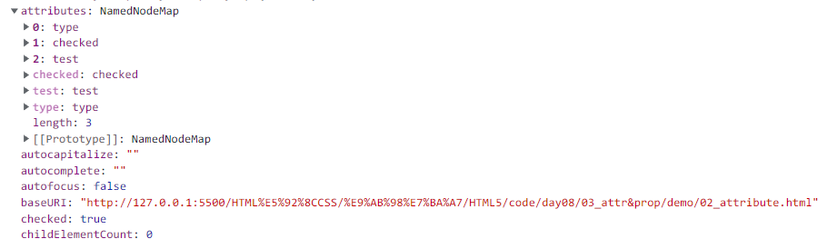

## 一、定义

html标签的**预定义**和**自定义属性**我们统称为attribute（html概念）

> 只要是DOM标签中出现的属性（html代码），都是**Attribute**



> 有些常用特性（id、class、title等预定义属性），会被转化为**Property**，而自定义的属性不会


- class特性在变成属性时，名字会变成“className”

- 它的值只能够是**字符串**

---

js原生对象的直接属性，我们统称为**property**（js概念）

- js中property泛指对象的属性

- attributes是属于property的一个子集

## 二、布尔值属性与非布尔值属性

​	property的属性值为布尔类型的  我们统称为布尔值属性
​	property的属性值为非布尔类型的  我们统称为非布尔值属性

## 三、attribute和property的同步关系（预定义属性）

1. 非布尔值属性：实时同步 

2. 布尔值属性（true/false）

   - property永远都不会同步给attribute

   - 在没有动过property的情况下（保持默认状态），attribute会同步给property（只有初始时同步一次）
   - 在动过property的情况下，attribute不会同步给property（此时浏览器页面不会同步对attribute的修改）

## 四、操作对象

用户操作的是property（界面的交互）； 浏览器认的也是property（只认）

## 五、attribute的一些方法

1. 操作类名的添加、删除与切换

```js
var testNode = document.querySelector("#test");
//classList属于property
testNode.classList.add("class4");
testNode.classList.remove("class1");
testNode.classList.toggle("class2");
console.log(testNode.classList);
```

2. 获取并修改自定义属性的值

```html
<!-- 在自定义属性的名字前加data-  -->
<div id="test" data-atguigu-qhf="qhf"></div>
```

```js
var testNode = document.querySelector("#test");
console.log(testNode.dataset.atguiguQhf);//驼峰命名
testNode.dataset.atguiguQhf="111";
```

3. 使标签中的文本可编辑

```html
<div id="test" contenteditable="true">
	djhaldhaskj
</div>
```

## 六、总结

布尔值属性最好使用prop方法
非布尔值属性则使用attr方法