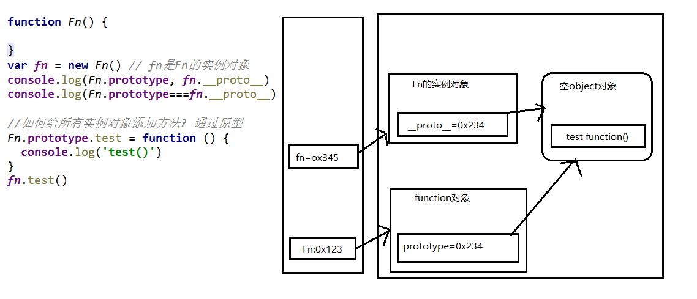
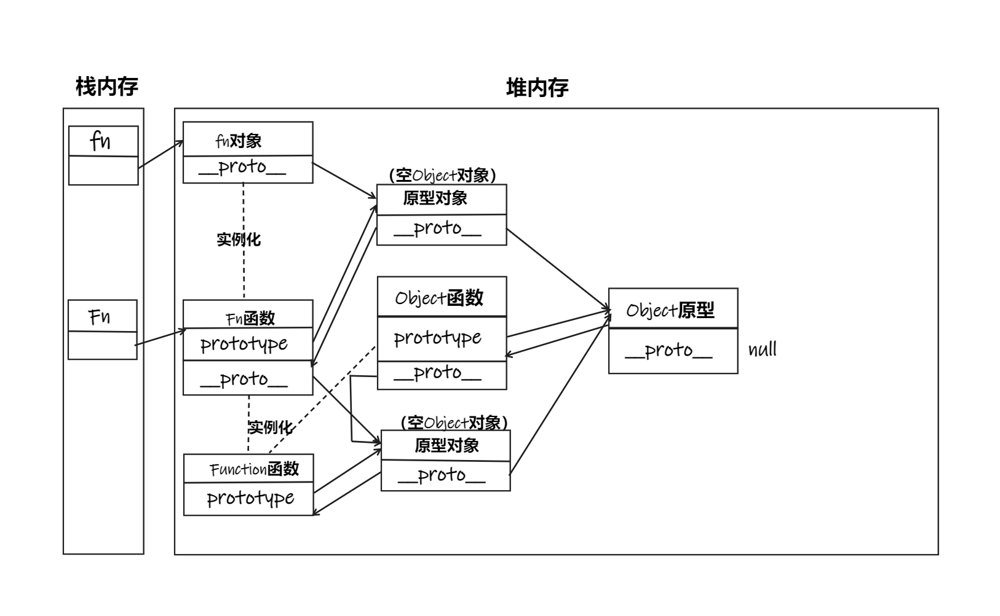
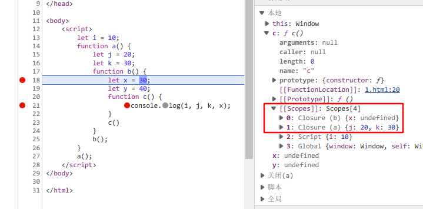
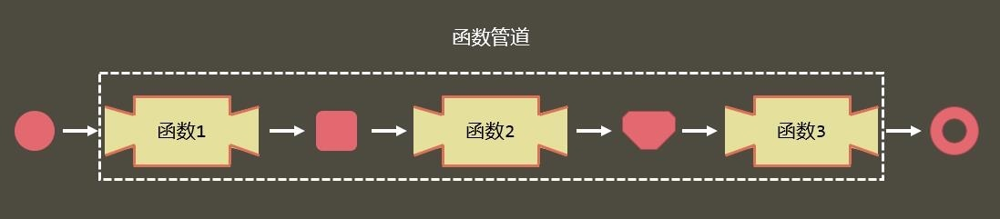

## 一、原型与原型链

### 1. 成分组成

- **构造函数**：所有函数都有一个特别的属性, 它默认指向一个Object空对象(即称为: 原型对象)(Object不满足)
  - `prototype` : 显式原型属性
- **实例对象**：所有实例对象都有一个特别的属性:
  - `__proto__` : 隐式原型属性
- **原型对象**：原型对象中有一个属性constructor, 它指向函数对象，同时其作为Object的实例对象，也有一个\__proto__属性指向它的原型对象
  - constructor：指向构造函数本身
  



### 2. 显式原型与隐式原型的关系

- 函数的prototype: 定义函数时被自动赋值, 值默认为{}(空对象), 即为原型对象
  
  `this.prototype = {}`
  
- 实例对象的\__proto__: 在创建实例对象时被自动添加, 并赋值为构造函数的prototype值(两变量指向同一原型对象)
  
  `this.__proto__ = Fn.prototype`
  
- 对象的隐式原型的值为其对应构造函数的显式原型的值
  
### 3. 原型链

- 访问一个对象的属性时，会先在自身属性中查找，找到返回；如果没有, 再沿着\__proto__这条链向上查找, 找到返回;如果最终没找到, 返回**undefined**
- 别名:隐式原型链
- 作用: 查找对象的属性(方法)
- 当给对象属性赋值时不会使用原型链, 而只是在当前对象中进行操作
  



> - Object原型的隐式原型为null
> - Function的隐式原型(图中未画)指向自己的原型

- 所有函数都是Function的实例(包含Function)，所以函数对象也有\__proto__属性 
- Object的原型对象是原型链尽头
- 方法一般定义在原型中, 属性一般通过构造函数定义在对象本身上（继承）
- Object函数的显式原型和隐式原型指向的对象不同

### 4. 出现原因

隐式原型和原型出现的根本原因在于JS没有记录类型的元数据，因此，JS只能通过对象的隐式原型找到创建它的函数的原型，从而确定其类型。

## 二、执行上下文与执行上下文栈

### 1.  声明提前现象

- 变量提升: 在变量定义语句之前, 就可以访问到这个变量(未赋值：`undefined`)

- 函数提升: 在函数定义语句之前, 就可以访问并执行该函数

  - 变量和函数分别成为window全局执行上下文的属性和方法
  - 本质上还是先声明，再执行代码

- 函数提升比变量提升的优先级高

  ```js
   function a() {}
   var a
   console.log(typeof a) // 'function'
  ```

  ```js
   var c = 1	//var c
   function c(c) {
    console.log(c)
    var c = 3
   }
  // c=1
   c(2) // 报错
  ```

> 声明提前的出现就是下面提到的执行上下文引起的。

### 2.  执行上下文的理解

代码（全局代码、函数代码） ==执行前进行的准备工作==

==执行上下文== ：当代码执行进入一个环境时，就会为该环境创建一个执行上下文，它会在你运行代码前做一些准备工作，如确定作用域，创建局部变量对象等。

- JavaScript 中执行环境
  - 全局环境
  - 函数环境
  - eval 函数环境 （已不推荐使用）

==执行上下文栈== （函数调用栈Call Stack）: 用来管理产生的多个执行上下文（n+1）

- 由js引擎在代码执行前就创建
- 用来确定函数嵌套时代码的执行顺序

### 3.  生命周期

- 创建阶段（**进入**执行上下文）：函数被调用时，进入函数环境，为其创建一个执行上下文，此时进入创建阶段。
- 执行阶段（代码**执行**）：执行函数中代码时，此时执行上下文进入执行阶段。

### 4.  执行上下文创建和执行的过程

==创建阶段== 要做的事情主要如下：

1. 创建**变量对象**（*VO：variable object*）

   - 确定函数的形参（**并赋值**）
   - 函数环境会初始化创建 `Arguments`对象（**并赋值**）
   - 确定普通字面量形式的函数声明（**并赋值**）
   - 变量声明，函数表达式声明（**未赋值**）

> 我们可以将整个上下文环境看作是一个对象。该对象拥有 *3* 个属性，如下：
>
> ```javascript
> executionContextObj = {
>      variableObject : {}, // 变量对象，里面包含 Arguments 对象，形式参数，函数和局部变量
>      scopeChain : {},// 作用域链，包含内部上下文所有变量对象的列表
>      this : {}// 上下文中 this 的指向对象
> }
> ```
> 在函数的建立阶段，首先会建立 `Arguments` 对象。然后确定形式参数，检查当前上下文中的函数声明，每找到一个函数声明，就在 `variableObject` 下面用函数名建立一个属性，属性值就指向该函数在内存中的地址的一个引用。
>
> 如果上述函数名已经存在于 `variableObject`（简称 *VO*） 下面，那么对应的属性值会被新的引用给覆盖。最后，是确定当前上下文中的局部变量，如果遇到和函数名同名的变量，则会忽略该变量。

2. 确定 *this* 指向（***this* 由调用者确定**）

3. 确定作用域（**词法环境决定，哪里声明定义，就在哪里确定**）

==执行阶段== 要做的事情主要如下（不分顺序，按代码执行顺序走）：

1. 变量对象赋值
   - 变量赋值
   - 函数表达式赋值
2. 调用内部函数
3. 顺序执行其它代码

> 在`es6`中引入了块作用域的概念，通过 **let** 声明的变量 ，在编译阶段会存放到  ==词法环境==  中。
>
> 具体内容参考[浏览器原理系列-JS执行上下文详解 - 掘金 (juejin.cn)](https://juejin.cn/post/6908314735708635150#heading-3)

---

**实例1：**

> 原代码

```js
const foo = function(i){
    var a = "Hello";
    var b = function privateB(){};
    function c(){}
}
foo(10);
```

> 建立阶段的变量对象

```js
fooExecutionContext = {
    variavleObject : {
        arguments : {0 : 10,length : 1}, // 确定 Arguments 对象
        i : 10, // 确定形式参数
        c : pointer to function c(), // 确定函数引用
        a : undefined, // 局部变量 初始值为 undefined
        b : undefined  // 局部变量 初始值为 undefined
    },
    scopeChain : {},
    this : {}
}
```

> 执行阶段

```js
fooExecutionContext = {
    variavleObject : {
        arguments : {0 : 10,length : 1},
        i : 10,
        c : pointer to function c(),
        a : "Hello",// a 变量被赋值为 Hello
        b : pointer to function privateB() // b 变量被赋值为 privateB() 函数
    },
    scopeChain : {},
    this : {}
}
```

---

**实例2：**

> 原代码

```js
(function () {
    console.log(typeof foo);
    console.log(typeof bar);
    var foo = "Hello";
    var bar = function () {
        return "World";
    }
    function foo() {
        return "good";
    }
    console.log(foo, typeof foo);
})()
```

> 建立阶段的变量对象

```js
fooExecutionContext = {
    variavleObject : {
        arguments : {length : 0},
        foo : pointer to function foo(),
        bar : undefined
    },
    scopeChain : {},
    this : {}
}
```

> 执行阶段

```js
(function () {
    console.log(typeof foo); // function
    console.log(typeof bar); // undefined
    var foo = "Hello"; // foo 被重新赋值 变成了一个字符串
    var bar = function () {
        return "World";
    }
    function foo() {
        return "good";
    }
    console.log(foo, typeof foo); //Hello string
})()
```

## 三、作用域与作用域链

**作用域就是一个独立的地盘，让变量不会外泄、暴露出去**。也就是说作用域最大的用处就是隔离变量，不同作用域下同名变量不会有冲突。

### 1. 概念理解

- 作用域: 一块代码区域, 在编码时就确定了, 不会再变化
- 作用域链: 多个嵌套的作用域形成的由内向外的结构, 用于查找变量

### 2. 分类

- 全局作用域
  - 最外层函数和在最外层函数外面定义的变量拥有全局作用域
  - 所有未定义直接赋值的变量自动声明为拥有全局作用域(包括内部函数中的变量)
  - 所有 *window* 对象的属性拥有全局作用域

- 函数作用域
- 在ES6之前，js没有块作用域，es6之后一对大括号可以形成一个块作用域

> **作用域是分层的，内层作用域可以访问外层作用域的变量，反之则不行**。


### 3. 作用

- 作用域: 隔离变量, 不同作用域定义同名的变量不会发生冲突
- 作用域链: 自由变量（当前作用域未定义）的值需要一层一层向上寻找，直到找到全局作用域还是没找到，就宣布放弃。这种一层一层的关系，就是作用域链 。

### 4. 区别作用域与执行上下文

*JavaScript* 属于解释型语言，*JavaScript* 的执行分为：解释和执行两个阶段，这两个阶段所做的事并不一样。

**解释阶段**

- 词法分析
- 语法分析
- 作用域规则确定

**执行阶段**

- 创建执行上下文
- 执行函数代码
- 垃圾回收

**区别**

- 作用域:  ==静态的, 编码时就确定了== (不是在运行时), 一旦确定就不会变化了
- 执行上下文: 动态的, 执行代码时动态创建, 当执行结束消失
- 联系: 执行上下文环境从属于所在的作用域（先有作用域）

### 5. 面试题

- ```js
   var x = 10;
   function fn() {
    console.log(x);
   }
    
   function show(f) {
    var x = 20;
    f();
   }
    
   show(fn); //10
  ```

- ```js
  var fn = function () {
    console.log(fn)
   }
   fn()  //fn的函数定义
  
   var obj = {
    fn2: function () {
     console.log(fn2)
     //console.log(this.fn2)
    }
   }
   obj.fn2() //报错
  ```

- 原型链实现对象继承；作用域描述代码的作用范围，作用域链实现变量的查找顺序；执行上下文对象保存运行环境的信息（预处理：声名提前问题）。

## 四、闭包

### 1. 概念理解

> 闭包不是一种具体的技术，而是一种现象，是指在定义函数时，周围环境中的信息可以在函数中使用。换句话说，执行函数时，只要在函数中使用了外部的数据，就创建了闭包。
>
> 而作用域链，正是实现闭包的手段。（所以闭包在创建代码时就产生了）



函数 *b* 中的 *y* 变量并没有被放在闭包中，**所以要不要放入闭包取决于该变量有没有被引用**，当然，此时的你可能会有这样的一个新问题，那么多闭包，那岂不是占用内存空间么？

其实，如果是像这样自动形成的闭包，是会被销毁掉的，当我们执行完引用变量的函数c，此时闭包就自动销毁，垃圾回收器会自动回收没有引用的变量，不会有任何内存占用的情况。


通过chrome工具得知: 闭包本质是内部函数中的一个对象, 这个对象中包含引用的变量属性，所以当函数对象成为垃圾对象时，其包含的变量也会一并释放。

当然这些都是自动产生闭包的情况，有时我们会根据需求手动的来制造一个闭包。

```js
function eat(){
    var food = '鸡翅';
    return function(){
        console.log(food);
    }
}
var look = eat();
look(); // 鸡翅
look(); // 鸡翅
```

在这个例子中，`eat` 函数返回一个函数，并在这个内部函数中访问 `food` 这个局部变量。按理说当 `eat` 调用完毕 `food` 就应该被销毁掉，但是我们向外部返回了 `eat` 内部的匿名函数，而这个匿名函数又引用了 `food`，所以闭包依然存在，垃圾回收器也不会对其进行回收，这也是为什么在外面调用这个匿名函数时，仍然能够打印出 `food` 变量的值。

### 2. 作用

- **通过闭包可以让外部环境访问到函数内部的局部变量。**
- **通过闭包可以让局部变量持续保存下来，不随着它的上下文环境一起销毁。**

### 3. 一个简单的闭包程序

```js
// 1. 将函数作为另一个函数的返回值
function fn1() {
  var a = 2;
  function fn2() {
    a++;
    console.log(a);
  }
  return fn2;
}
var f = fn1();
f();//3
f();//4
//闭包死亡(包含闭包的函数对象成为垃圾对象)
//f = null 

// 2. 将函数作为实参传递给另一个函数调用
function showDelay(msg, time) {
    setTimeout(function () {
        alert(msg)
    }, time)
}
showDelay('atguigu', 2000)
```

- 闭包应用:

  - 模块化: 封装一些数据以及操作数据的函数, 只向外暴露一个包含n个方法的对象或函数(类)
    - `return {}`
    - `window.module={}` //匿名函数自定义
  - 循环遍历加监听
  - JS框架(jQuery)大量使用了闭包

- 缺点:
  - 函数执行完后, 函数内的局部变量没有释放,占用内存的时间可能会过长
  - 可能导致内存泄露
  - 解决:
    - 及时释放 : f = null; //让内部函数对象成为垃圾对象
    

- 面试题

  ```js
   //代码片段一
   var name = "The Window";
   var object = {
    name : "My Object",
    getNameFunc : function(){
     return function(){
       return this.name;
     };
    }
   };
   alert(object.getNameFunc()());  //?  the window
  
   //代码片段二
   var name2 = "The Window";
   var object2 = {
    name2 : "My Object",
    getNameFunc : function(){
     var that = this;
     return function(){
       return that.name2;
     };
    }
   };
   alert(object2.getNameFunc()()); //?  my object
  ```


## 五、内存溢出与内存泄露

### 1. 什么是内存泄露

程序的运行需要内存。只要程序提出要求，操作系统或者运行时（*runtime*）就必须供给内存。

对于持续运行的服务进程（*daemon*），必须及时释放不再用到的内存。否则，内存占用越来越高，轻则影响系统性能，重则导致进程崩溃。

也就是说，不再用到的内存，如果没有及时释放，就叫做内存泄漏（*memory leak*）。

### 2. JavaScript 中的垃圾回收

浏览器的 *Javascript* 具有自动垃圾回收机制（*GC*：*Garbage Collecation*），也就是说，执行环境会负责管理代码执行过程中使用的内存。其原理是：**垃圾收集器会定期（周期性）找出那些不在继续使用的变量，然后释放其内存**。

但是这个过程不是实时的，因为其开销比较大并且 *GC* 时停止响应其他操作，所以垃圾回收器会按照固定的时间间隔周期性的执行。

不再使用的变量也就是生命周期结束的变量，当然只可能是局部变量，全局变量的生命周期直至浏览器卸载页面才会结束。局部变量只在函数的执行过程中存在，而在这个过程中会为局部变量在栈或堆上分配相应的空间，以存储它们的值，然后在函数中使用这些变量，直至函数结束，而闭包中由于内部函数的原因，外部函数并不能算是结束。

下面是一段示例代码：

```js
function fn1() {
    var obj = {name: 'zhangsan', age: 10};
}
function fn2() {
    var obj = {name:'zhangsan', age: 10};
    return obj;
}

var a = fn1();
var b = fn2();
```

在上面的代码中，我们首先声明了两个函数，分别叫做 *fn1* 和 *fn2*。

当 *fn1* 被调用时，进入 *fn1* 的环境，会开辟一块内存存放对象 *{name: 'zhangsan', age: 10}*。而当调用结束后，出了 *fn1* 的环境，那么该块内存会被  *JavaScript* 引擎中的垃圾回收器自动释放；

在 *fn2* 被调用的过程中，返回的对象被全局变量 *b* 所指向，所以该块内存并不会被释放。

这里问题就出现了：到底哪个变量是没有用的？

所以垃圾收集器必须跟踪到底哪个变量没用，对于不再有用的变量打上标记，以备将来收回其内存。

用于标记的无用变量的策略可能因实现而有所区别，通常情况下有两种实现方式：**标记清除**和**引用计数**。

引用计数不太常用，标记清除较为常用。

### 3. 标记清除

*JavaScript* 中最常用的垃圾回收方式就是标记清除。

当变量进入环境时，例如，在函数中声明一个变量，就将这个变量标记为“进入环境”。

从逻辑上讲，永远不能释放进入环境的变量所占用的内存，因为只要执行流进入相应的环境，就可能会用到它们。

而当变量离开环境时，则将其标记为“离开环境”。

```js
function test(){
  var a = 10 ; // 被标记 ，进入环境 
  var b = 20 ; // 被标记 ，进入环境
}
test(); // 执行完毕 之后 a、b 又被标离开环境，被回收。
```

垃圾回收器在运行的时候会给存储在内存中的所有变量都加上标记（当然，可以使用任何标记方式）。

然后，它会去掉环境中的变量以及被环境中的变量引用的变量的标记（闭包）。而在此之后再被加上标记的变量将被视为准备删除的变量，原因是环境中的变量已经无法访问到这些变量了。

最后，垃圾回收器完成内存清除工作，销毁那些带标记的值并回收它们所占用的内存空间。

到目前为止，*IE9+、Firefox、Opera、Chrome、Safari* 的 *JS* 实现使用的都是标记清除的垃圾回收策略或类似的策略，只不过垃圾收集的时间间隔互不相同。

### 4. 引用计数

引用计数的含义是跟踪记录每个值被引用的次数。

当声明了一个变量并将一个引用类型值赋给该变量时，则这个值的引用次数就是 *1*。如果同一个值又被赋给另一个变量，则该值的引用次数加 *1*。

相反，如果包含对这个值引用的变量又取得了另外一个值，则这个值的引用次数减 *1*。当这个值的引用次数变成 *0* 时，则说明没有办法再访问这个值了，因而就可以将其占用的内存空间回收回来。

这样，当垃圾回收器下次再运行时，它就会释放那些引用次数为 *0* 的值所占用的内存。

```js
function test() {
    var a = {};	// a 指向对象的引用次数为 1
    var b = a;	// a 指向对象的引用次数加 1，为 2
    var c = a;	// a 指向对象的引用次数再加 1，为 3
    var b = {};	// a 指向对象的引用次数减 1，为 2
}
```

*Netscape Navigator3* 是最早使用引用计数策略的浏览器，但很快它就遇到一个严重的问题：**循环引用**。

循环引用指的是对象 *A* 中包含一个指向对象B的指针，而对象 *B* 中也包含一个指向对象 *A* 的引用。

```js
function fn() {
    var a = {};
    var b = {};
    a.pro = b;
    b.pro = a;
}
fn();
```

以上代码 *a* 和 *b* 的引用次数都是 *2*，*fn* 执行完毕后，两个对象都已经离开环境，在标记清除方式下是没有问题的，但是在引用计数策略下，因为 *a* 和 *b* 的引用次数不为 *0*，所以不会被垃圾回收器回收内存，如果 *fn* 函数被大量调用，就会造成内存泄露。在 *IE7* 与 *IE8* 上，内存直线上升。

### 5. 真题解答

- 请介绍一下 *JavaScript* 中的垃圾回收站机制

> 参考答案：
>
> *JavaScript* 具有自动垃圾回收机制。垃圾收集器会按照固定的时间间隔周期性的执行。
>
> *JavaScript* 常见的垃圾回收方式：**标记清除**、**引用计数**方式。
>
> 1、标记清除方式：
>
> - 工作原理：当变量进入环境时，将这个变量标记为“进入环境”。当变量离开环境时，则将其标记为“离开环境”。标记“离开环境”的就回收内存。
>
> - 工作流程：
>
>  - 垃圾回收器，在运行的时候会给存储在内存中的所有变量都加上标记；
>
>  - 去掉环境中的变量以及被环境中的变量引用的变量的标记；
>
>  - 被加上标记的会被视为准备删除的变量；
>
>  - 垃圾回收器完成内存清理工作，销毁那些带标记的值并回收他们所占用的内存空间。
>
> 2、引用计数方式：
>
> - 工作原理：跟踪记录每个值被引用的次数。
>
> - 工作流程：
>
>  - 声明了一个变量并将一个引用类型的值赋值给这个变量，这个引用类型值的引用次数就是 *1*；
>
>  - 同一个值又被赋值给另一个变量，这个引用类型值的引用次数加 *1*；
>
>  - 当包含这个引用类型值的变量又被赋值成另一个值了，那么这个引用类型值的引用次数减 *1*；
>
>  - 当引用次数变成 *0* 时，说明没办法访问这个值了；
>
>  - 当垃圾收集器下一次运行时，它就会释放引用次数是 *0* 的值所占的内存。

## 六、高阶函数

### 1.  概念

高阶函数（higher-order-function）并不是 JavaScript 语言所特有的东西，它适用于整个计算机领域，甚至数学领域。

它的定义非常简单。

根据维基百科的定义，无论是在数学领域，还是在计算机领域，凡是**满足以下任一条件的函数**，均是高阶函数：

- 接受一个或多个函数作为输入
- 输出一个函数

在大部分计算机语言中，一个函数的输入往往被看作是函数的参数，而一个函数的输出，往往被看作是函数的返回值，因此，上面作为高阶函数条件的两个点，放到计算机领域，可以说成是：

（1）接受一个或多个函数作为参数

（2）返回一个函数

所以我们之前一直使用的数组中的很多方法，其实都是高阶函数，比如`forEach,filter，map`等等。

### 2. 函数防抖与函数节流

JavaScript 中的函数大多数情况下都是由用户主动调用触发的，除非是函数本身的实现不合理，否则一般不会遇到跟性能相关的问题。

但是在一些少数情况下，函数的触发不是由用户直接控制的。在这些场景下，函数有可能被非常频繁地调用，而造成大的性能问题。解决性能问题的处理办法就有**函数防抖**和**函数节流**，其核心就是限制某一个方法的频繁触发。

下面是函数被频繁调用的常见的几个场景：

- mousemove 事件。如果要实现一个拖拽功能，需要一路监听 mousemove 事件，在回调中获取元素当前位置，然后重置 DOM 的位置来进行样式改变。如果不加以控制，每移动一定像素而触发的回调数量非常惊人，回调中又伴随着 DOM 操作，继而引发浏览器的重排与重绘，性能差的浏览器可能就会直接假死。
- window.onresize 事件。为 window 对象绑定了 resize 事件，当浏览器窗口大小被拖动而改变的时候，这个事件触发的频率非常之高。如果在 window.onresize 事件函数里有一些跟 DOM 节点相关的操作，而跟 DOM 节点相关的操作往往是非常消耗性能的，这时候浏览器可能就会吃不消而造成卡顿现象。
- 射击游戏的 mousedown/keydown 事件（单位时间只能发射一颗子弹）
- 搜索联想（keyup,keydown,input事件）
- 监听滚动事件判断是否到页面底部自动加载更多（scroll事件）

#### 函数防抖（debounce）

> 函数防抖，就是指触发事件后在规定时间内函数只能执行一次，如果在规定时间内又触发了事件，则会 ==重新计算函数执行时间==。

简单的说，**当一个动作连续触发，则只执行最后一次**。 如：坐公交，司机需要等最后一个人进入才能关门。每次进入一个人，司机就会多等待几秒再关门。

**应用场景**

- 搜索框搜索输入。只需用户最后一次输入完，再发送请求
- 手机号、邮箱验证输入检测
- 窗口大小Resize。只需窗口调整完成后，计算窗口大小。防止重复渲染。

```js
const debounce = (fn, time) => {
  let timeout = null;
  return function() {
    clearTimeout(timeout)
    timeout = setTimeout(() => {
      fn.apply(this, arguments);
    }, time);
  }
};
```

#### 函数节流（throttle）

> 限制一个函数在规定时间内只能执行一次。 如，乘坐地铁，过闸机时，每个人进入后3秒后门关闭，等待下一个人进入。

简单的说，**当一个动作连续触发，间隔一段时间执行一次**。

**应用场景**

- 滚动加载，加载更多或滚到底部监听
- 谷歌搜索框，搜索联想功能
- 高频点击提交，表单重复提交

```js
const throttle = (fn, time) => {
  let flag = true;
  return function() {
    if (!flag) return;
    flag = false;
    setTimeout(() => {
      fn.apply(this, arguments);
      flag = true;
    }, time);
  }
}
```

#### 区别

防抖：连续触发事件回调都会重新开始计算delay

节流：触发事件回调后开始delay然后开始下一次触发调用


### 3.分时函数

某些函数是用户主动调用，但因为一些客观的原因，这些函数会严重地影响页面性能。这个这个问题的解决方案之一就是使用数组分块技术（又被称之为分时函数），数组分块是一种使用定时器分割循环的技术，为要处理的项目创建一个队列，然后使用定时器取出下一个要处理的项目进行处理，接着再设置另一个定时器。

即将一个大任务分成若干个小任务，然后按照一定的时间间隔依次执行每个小任务，而不是一次性全部执行。分时函数常常在处理非常大的数据集合（比如渲染海量节点）时非常有用，可以提高浏览器的响应速度，并防止出现卡顿、崩溃等问题。

```js
function timeChunk(arr, fn, count, interval) {
// 该分时函数接收 4 个参数：数据、创建节点逻辑的函数、每一批创建的节点数量、每个执行任务之间的时间间隔
// 该分时函数将返回一个计时函数，根据数据是否已经创建完节点来决定是否停止
  let obj, t;
  let len = arr.length;
  const start = function() {
    // 创建规定数量的节点
    for (let i = 0; i < Math.min(count || 1, arr.length); i++) {
      let obj = arr.shift();
      fn(obj);
    }
  };
  return function() {
    t = setInterval(function() {
      if (arr.length === 0) {
        return clearInterval(t);
      }
      start();
    }, interval || 200);
  };
}
```

### 4. 柯里化

柯里化（currying）又称部分求值。一个柯里化的函数首先会接受一些参数，接受了这些参数之后，该函数并不会立即求值，而是继续返回另外一个函数，刚才传入的参数在函数形成的闭包中被保存起来。待到函数被真正需要求值的时候，之前传入的所有参数都会被一次性用于求值。

比如，有一个函数`f(x, y, z) = (x + y) * z`，若固定了 x = 2，你将通过柯里化函数得到一个新的函数，这个新的函数是`g(y, z) = (2 + y) * z`

```js
/**
 * 柯里化函数
 * @param {function} func 最终要执行的函数
 * @param {*} args 要固定的参数
 */
function curry(func, ...args) {
    // 返回一个接收剩余参数的函数
    return function (...inArgs) {
        // 将固定的参数和剩余参数拼接
        const allArgs = args.concat(inArgs);
        if (allArgs.length >= func.length) {
            // 若拼接后的参数集 大于等于 原本函数的参数数量，则执行原本的函数
            return func(...allArgs);
        }
        else{
            // 否则，继续柯里化，固定目前的参数
            return curry(func, ...allArgs);
        }
    }
}
```

柯里化函数的使用：

```js
function f(x, y, z) {
    return (x + y) * z;
}
// 通过柯里化函数，固定函数 f 的第一个参数 x=2，得到一个新函数 g(y, z)
const g = curry(f, 2);
console.log(g(3, 5)); // (2+3)*5 输出：25
console.log(g(6, 4)); // (2+6)*4 输出：32
// 通过柯里化函数，固定函数f的前两个参数 x=2 y=3，得到一个新函数 k(z)
const k = curry(f, 2, 3);
console.log(k(5)); // (2+3)*5 输出：25
console.log(k(4)); // (2+3)*4 输出：20
```

### 5. 函数管道

有的时候，我们可以面临这样一种场景：

1. 需要连续调用多个函数才能得到结果
2. 前一个函数的返回结果，将作为参数传递给下一个函数

遇到这种情况，我们就可以使用**函数管道，将要依次调用的函数组装起来**，形成一个完整的调用通道。



```js
/**
 * 函数管道
 * @param {Array} functions 要连接的函数数组
 */
function pipe(...functions){
    return function(data){
        let midData = data; //midData用于保存每次调用的结果
        for(const func of functions){
            midData = func(midData);
        }
        return midData;
    }
}
```

reduce方法实现的版本

```js
/**
 * 函数管道
 * @param {Array} functions 要连接的函数数组
 */
function pipe(...functions){
    return function(data){
        return functions.reduce((result, func)=>{
            return func(result);
        }, data);
    }
}
```

由于函数管道强烈依赖一个前提条件，即管道中的函数必须只能有一个参数，因此，如果遇到了管道中需要用到多参函数的场景，我们可以利用上一节讲解的柯里化来固定已知参数。

```js
//连接函数管道
const camel = pipe(firstUpper, otherLower, removeEmpty, curry(cutString, 15));
console.log(camel(" my firST nAme "));//输出：myFirstName
console.log(camel(" user nick name "));//输出：userNickName
```


