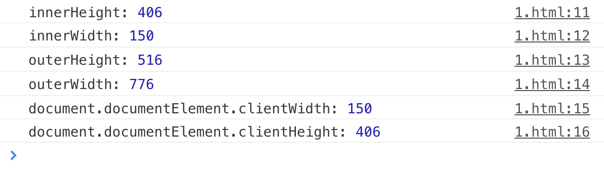
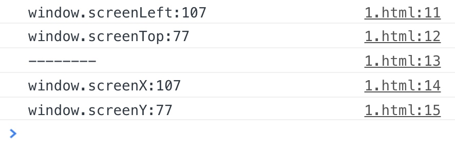
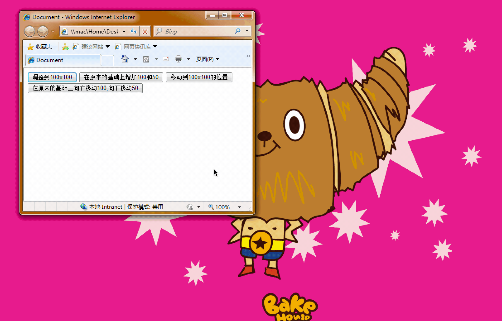
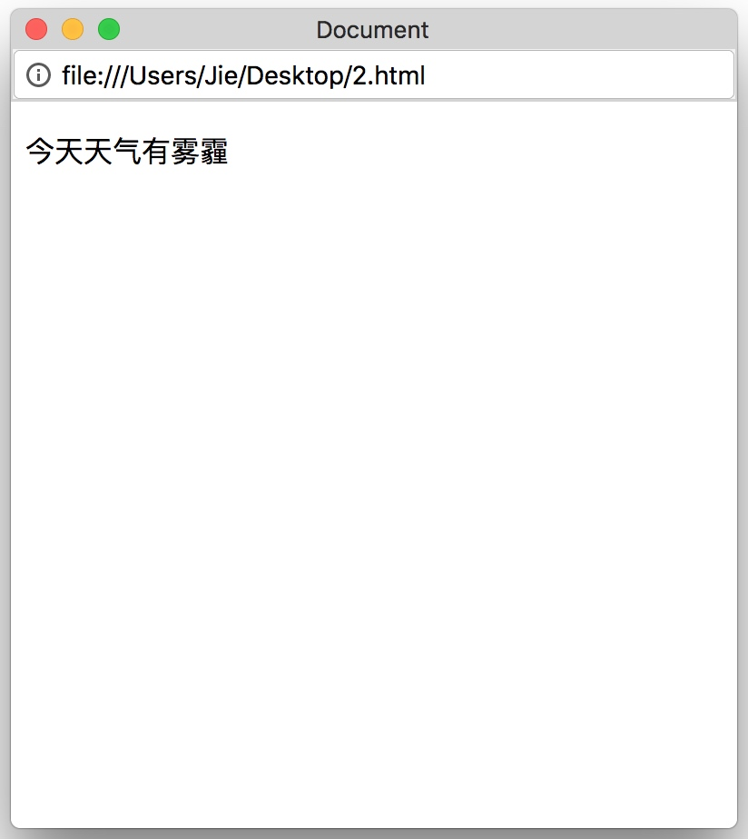
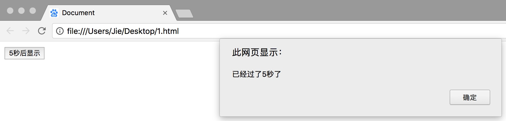
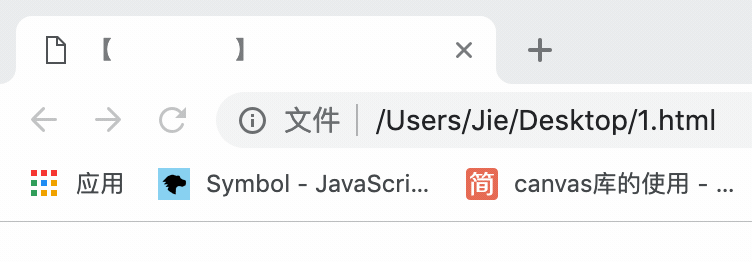
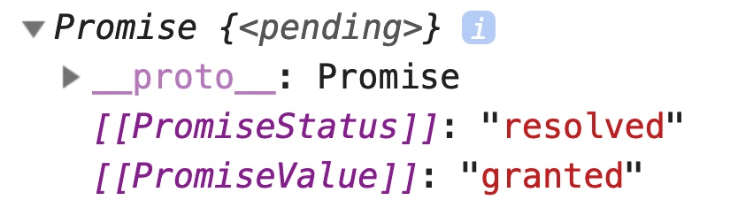
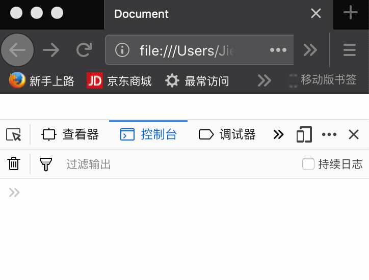

## 一、浏览器引入 JavaScript

要想利用 JavaScript 和网页实现互动，那么首先第一步就是应该了解如何向网页中引入 JavaScript 代码。实际上，向网页引入 JavaScript 代码的方式也是多种多样，下面我们一起来看一下。

### 1. 直接在 HTML 文件中引入

首先第 1 种方式就是直接在 HTML 文档里面引入 JavaScript 代码。在维护一些老项目的时候，经常可以看到 JavaScript 代码是写在`<title>`标签下面的，并且通过一对`<script>`标签来引入代码。示例如下：

```html
<head>
    <meta charset="UTF-8">
    <title>Document</title>
    <script>
        // JavaScript 代码
    </script>
</head>
```

但是，如果是直接在 HTML 文件中引入 JavaScript 代码，我们一般不写在`<title>`标签下面，更加优化的一种方式是将`<script>`标签写在`<body>`标签的最下面，这样可以更快的加载出页面效果。如下：

```html
<body>
    <!-- HTML代码 -->
    <script>
        // JavaScript 代码
    </script>
</body>
```

### 2. 调用外部 JavaScript 文件

第 2 种方式是使用外部链接的方式来调用外部的 JavaScript 文件。这种方式适用于当我们的 JavaScript 代码是单独的一个 js 文件时，就可以采用这种方式来引入 JavaScript 代码。示例如下：

```html
<body>
    <!-- HTML代码 -->
    <script src="外部 JavaScript 文件"></script>
</body>
```

### 3. 使用 a 标记的 href 属性

我们还可以在`<a>`标签的`href`属性里面书写 JavaScript 代码，这样会改变`<a>`标签默认的超链接特性，而变为**执行这段 JavaScript 代码**，示例如下：

```html
<body>
    <!-- HTML代码 -->
    <a href="javascript:alert('Hello World')">点击</a>
</body>
```

### 4. 事件里面直接书写 JavaScript 代码

在后面学习的事件中，我们也可以直接将 JavaScript 代码写在事件里面，例如我们书写一个点击事件，当点击 button 按钮时，会执行相应的 JavaScript 代码，示例如下：

```html
<body>
    <!-- HTML代码 -->
    <button onclick="javascript:alert('Hello World!')">点击</button>
</body>
```

## 二、BOM 基本介绍

### 1. 什么是 BOM

所谓 BOM，英语全称为 Browser Object Model，翻译成中文为浏览器对象模型。我们的浏览器，可以被看做是由各种各样的对象所组成的，就像我们这个可爱的世界一样。

一般来讲，在 BOM 中大致存在如下几个对象：

```js
window：表示窗口对象
navigator：包含浏览器相关信息
location：包含当前页面的位置信息
history：包含用户访问页面的历史信息
screen：包含客户端显示能力信息
document：表示整个页面
```

整个 BOM 的核心对象就是是 window 对象，它代表的是浏览器的一个实例。window 对象同时也是最顶层的对象。

### 2. BOM 与 DOM 的关系	

在下一章，我们还会介绍一个东西，被称之为 DOM。

很多初学者刚开始都搞不清楚 BOM 和 DOM 之间的关系。事实上很简单，DOM 可以算是 BOM 的一个分支。因为 BOM 里面存在一个叫做 Document 的对象，但是这个对象的属性和方法太多了，所以 W3C 将其单独取了出来，做成了一套规范，这个就是 DOM，英语全称 document object model，翻译成中文就是文档对象模型。

>W3C：万维网联盟。创建于 1994 年，是 Web 技术领域最具权威和影响力的国际中立性技术标准机构。到目前为止，W3C 已发布了 200 多项影响深远的 Web 技术标准及实施指南。

接下来，我们可以用一张层级关系图来表示 BOM 和 DOM 之间的关系，如下：


需要说明一下的是 BOM 目前还没有相应的规范。浏览器提供商会按照各自的想法去随意扩展它，于是浏览器之间共有的对象就成了事实上的标准。这些对象在浏览器中得以存在，很大程度上是由于它们提供了与浏览器的互操作性。目前，W3C 已经将 BOM 的主要方面纳入了 HTML5 的规范中。

## 三、window 对象

### 1. window 对象基本介绍

我们先来看一下 window 对象。浏览器每打开一个窗口，就包含了一个 window 对象。window 对象是整个 BOM 的核心对象，它代表着一个浏览器窗口的实例。

window 对象扮演着在 ECMAScript 中的 global 对象的角色，因此所有在全局作用域中声明的变量以及函数都会成为该对象的属性和方法。也就是说全局变量是 window 对象的属性，全局函数是 window 对象的方法。我们来看下面的示例：

```html
<body>
    <script>
        var a = 1;
        function test(){
            alert("this is a test");
        }
        alert(a); // 1
        alert(window.a); // 1
        test(); // this is a test
        window.test(); // this is a test
    </script>
</body>
```

可以看到，这里我们通过访问`window.a`和`window.test()`也可以打印出a变量的值和调用`test()`函数。

**1. 全局属性和 window 属性的区别**

var 和 window 对象的属性真的就是一模一样么？

其实两者之间还是有一些略微不同的地方。例如不能使用`delete`操作符来删除 var 声明的变量，但是如果是 window 的属性则可以使用`delete`操作符来进行删除。

```html
<body>
    <script>
        var i = 10;
        window.j = 20;
        console.log(window.i);//10
        console.log(window.j);//20
        delete window.i;//并没有被删除掉
        delete window.j;//已经被删除掉了
        console.log(window.i);//可以打印出来
        console.log(window.j);//被删除了,所以是undefined
    </script>
</body>
```

**2. let 以及 const 所声明的变量**

还需要注意的是，使用 ECMAScript 6 新提供的 let 和 const 所声明的变量不会成为 window 对象的属性，证明如下：

```html
<body>
    <script>
        var i = 10;
        let j = 20;
        const k = 30;
        alert(window.i);//10
        alert(window.j);//undefined
        alert(window.k);//undefined
    </script>
</body>
```

### 2. 常见属性

既然是对象，那么肯定就有相应的属性和方法。这一小节，我们先来看一下 window 对象中常见的属性有哪些。

**1. 窗口大小**

关于窗口大小的属性有两组，`innerWidth`，`innerHeight`以及`outerWidth`，`outerHeight`
区别在于：inner 那一组表示的是页面视图区的大小，而 outer 那一组表示的是浏览器窗口本身的尺寸。

```html
<body>
    <script>
        console.log(`innerHeight:${innerHeight}`);
        console.log(`innerWidth:${innerWidth}`);
        console.log(`outerHeight:${outerHeight}`);
        console.log(`outerWidth:${outerWidth}`);
    </script>
</body>
```

效果：


>注：不同的浏览器，所表示的值略微有差异。

除了`innerWidth`和`innerHeight`以外，使用`document.documentElement.clientWidth`以及`document.documentElement.clientHeight`也可以获取到页面视图区的大小。

具体示例如下：

```html
<body>
    <script>
        console.log('innerHeight:',innerHeight);
        console.log('innerWidth:',innerWidth);
        console.log('outerHeight:',outerHeight);
        console.log('outerWidth:',outerWidth);
        console.log('document.documentElement.clientWidth:',document.documentElement.clientWidth);
        console.log('document.documentElement.clientHeight:',document.documentElement.clientHeight);
    </script>
</body>
```

效果：



那这两个属性有什么区别呢？具体如下表：

| 属性                                  | 描述                                 |
| ------------------------------------- | ------------------------------------ |
| innerWidth                            | 返回窗口的文档显示区的宽度(IE不支持) |
| innerHeight                           | 返回窗口的文档显示区的高度(IE不支持) |
| document.documentElement.clientWidth  | 返回窗口的文档显示区的宽度(通用方法) |
| document.documentElement.clientHeight | 返回窗口的文档显示区的宽度(通用方法) |

**2. 窗口位置**

窗口位置的属性也是有两组，分别是`screenLeft`和`screenTop`，还有`screenX`和`screenY`
这两组属性都是表示窗口相对于屏幕左边和上边的位置，如下：

```html
<body>
    <script>
        console.log(`window.screenLeft:${window.screenLeft}`);
        console.log(`window.screenTop:${window.screenTop}`);
        console.log("--------");
        console.log(`window.screenX:${window.screenX}`);
        console.log(`window.screenY:${window.screenY}`);
    </script>
</body>
```

效果：



区别在于 screenX 和 screenY 属性最早是火狐浏览器里面特有的属性。但是上面的代码是在谷歌浏览器里面运行的，可以看到，现在这两组属性在很多浏览器里面都是通用的了。接下来我将上面两组属性的区别总结成下面的表格，如下：

| 属性       | 描述                                                         |
| ---------- | ------------------------------------------------------------ |
| screenX    | 返回浏览器相对于屏幕窗口的x坐标(IE不支持)                    |
| screenY    | 返回浏览器相对于屏幕窗口的y坐标，即距离浏览器最顶端(IE不支持) |
| screenLeft | 返回浏览器相对于屏幕窗口的x坐标                              |
| screenTop  | 返回浏览器相对于屏幕窗口的y坐标(在IE中这个坐标包括了工具栏+菜单栏+地址栏的高度) |

**3. 元素位置**

我们可以通过`offsetLeft`以及`offsetTop`来得到一个元素**相对于父级定位元素**的位置，位置的信息是不带单位的。

具体示例如下：

```html
<head>
    <meta charset="UTF-8">
    <title>Document</title>
    <style>
        #one{
            width: 200px;
            height: 200px;
            background-color: pink;
            position: absolute;
            left: 100px;
            top: 100px;
        }
        #two{
            width: 50px;
            height: 50px;
            background-color: skyblue;
            position: absolute;
            left: 50px;
            top: 60px;
        }
    </style>
</head>
<body>
    <div id="one">
        <div id="two"></div>
    </div>
    <script>
        console.log(two.offsetLeft); // 50
        console.log(two.offsetTop); // 60
    </script>
</body>
```

需要注意，`offsetTop`以及`offsetLeft`这两个属性获取的一定是**离该元素最近的定了位的元素**的距离，示例如下：

```html
<head>
    <meta charset="UTF-8">
    <title>Document</title>
    <style>
        #one {
            width: 200px;
            height: 200px;
            background-color: pink;
            position: absolute;
            left: 100px;
            top: 80px;
            padding: 50px;
        }

        #two {
            width: 150px;
            height: 150px;
            border: 1px solid;
        }

        #three {
            width: 50px;
            height: 50px;
            position: absolute;
            left: 70px;
            top: 70px;
            background-color: skyblue;
        }
    </style>
</head>

<body>
    <div id="one">
        <div id="two">
            <div id="three"></div>
        </div>
    </div>
    <script>
        console.log(`offsetTop:${three.offsetTop}`); // offsetTop:70
        console.log(`offsetLeft:${three.offsetLeft}`); // offsetLeft:70
    </script>
</body>
```

在本例中，虽然 two 是 three 元素的父级元素，但是由于 two 没有定位，所以打印出来的是 three 距离 one 元素的 top 以及 left 值。

**4. 元素大小**

除了获取到一个元素在页面中的位置，我们还可以通过`offsetWidth`和`offsetHeight`来得到一个元素的宽高，示例如下：

```html
<head>
    <meta charset="UTF-8">
    <title>Document</title>
    <style>
        div{
            width: 100px;
            height: 150px;
            background-color: pink;
            position: absolute;
            top: 300px;
            left: 200px;
        }
    </style>
</head>
<body>
    <div id="div"></div>
    <script>
        console.log(div.offsetWidth); // 100
        console.log(div.offsetHeight); // 150
    </script>
</body>
```

**5. 滚动位置**

通过`pageXOffset`和`pageYOffset`属性我们可以获取文档在窗口左上角水平和垂直方向滚动的像素。

```html
<head>
    <meta charset="UTF-8">
    <title>Document</title>
    <style>
        body {
            height: 5000px;
        }
    </style>
</head>
<body>
    <script>
        window.onscroll = function () {
            console.log(window.pageYOffset);
        }
    </script>
</body>
```

需要注意的是，`pageXOffset`和`pageYOffset`属性相等于`scrollX`和`scrollY`属性。**这些属性都是只读属性**。

>注：`document.body.onscroll`，`window.onscroll`，`document.documentElement.onscroll`这几个属性在各浏览器中的兼容性问题，可以参见这篇文档。https://blog.csdn.net/qq_26445509/article/details/51153153

### 3. 常用方法

接下来我们来一起看一下 window 对象中常见的方法有哪些。

**1. 系统提示框**

`alert()`：用于显示带有一条指定消息和一个确定按钮的警告框。

>注意：`alert()`方法会终止 JavaScript 代码的执行。

示例如下：

```html
<body>
    <script>
        window.alert("Hello");
    </script>
</body>
```

运行结果：


`confirm()`：用于显示一个带有指定消息和 OK 及取消按钮的对话框。

示例如下：

```html
<body>
    <script>
        let i = window.confirm("Are you sure?");
        console.log(i,typeof i); // true "boolean"
    </script>
</body>
```

注意返回的是一个布尔值，true 或者 false

`prompt()`：该对话框用于提示用户输入某些信息，得到的是一个字符串

示例如下：

```html
<body>
    <script>
        let i = window.prompt("Please input something");
        console.log(i,typeof i); // 用户输入内容  string
    </script>
</body>
```

**2. 窗口大小调整**

关于窗口大小，也有一组方法，`resizeTo()`和`resizeBy()`。`resizeTo()`方法用于将浏览器窗口调整到指定的值，`resizeBy()`方法则是相对于原来的浏览器窗口来进行调节。

```html
<body>
    <script>
        window.resizeTo(100,100); // 调整到 100 x 100
        window.resizeBy(100,50); // 在原来的基础上增加 100 和 50 变为 200 x 150
    </script>
</body>
```

**3. 窗口位置移动**

关于窗口位置，我们如何来移动呢，在 window 对象里面提供了`moveTo()`和`moveBy()`。`moveTo()`方法是指定移动到哪个位置。`moveBy()`方法是在原来的位置上进行相对的偏移。

```html
<body>
    <script>
        window.moveTo(100,100); // 移动到100x100的位置
        window.moveBy(100,50); // 在原来的基础上向右移动100,向下移动50
    </script>
</body>
```

但是这两组方法在现代浏览器里面基本上都是被禁用的，所以基本效果出不来。

```html
<body>
    <button id='btn1'>调整到100x100</button>
    <button id='btn2'>在原来的基础上增加100和50</button>
    <button id='btn3'>移动到100x100的位置</button>
    <button id='btn4'>在原来的基础上向右移动100,向下移动50</button>
    <script>
        btn1.onclick = function () {
            window.resizeTo(100,100); // 调整到 100x100
        }
        btn2.onclick = function () {
            window.resizeBy(100,50); // 在原来的基础上增加 100 和 50 变为 200x150
        }
        btn3.onclick = function () {
            window.moveTo(100,100); // 移动到 100x100 的位置
        }
        btn4.onclick = function () {
            window.moveBy(100,50); // 在原来的基础上向右移动 100,向下移动 50
        }
    </script>
</body>
```

上面的代码在 Google 浏览器无法看到效果，可以使用 Windows 7 操作系统自带的 Internet Explorer 8 来查看效果。如下：



**4. 打开和关闭窗口**

`open()`方法：使用`window.open()`方法，该方法有 4 个参数，如下：

```html
<body>
    <script>
        // 参数 1 : 要加载的 URL
        // 参数 2 : 指定 target 属性或窗口的名称
        // 参数 3 : 一个特性字符串,新窗口的大小
        // 参数 4 : 新窗口是否取代历史记录中的当前页面     
        window.open("2.html","123","height=400,width=400,top=10,resizable=yes");
    </script>
</body>
```

效果：重新加载页面以后弹出新的窗口（2.html文件是提前准备好了的）



需要注意现在的浏览器一般都是会阻止弹窗的。一般需要我们点击允许弹出后，才弹出 2.html 页面

在调用了 window 对象的`open()`方法以后，他会返回一个对象，可以调用这个对象的`close()`方法来关闭打开的页面，示例如下：

```html
<body>
    <button onclick="test()">关闭新窗口</button>
    <script>
        // 参数 1 : 要加载的 URL
        // 参数 2 : 指定 target 属性或窗口的名称
        // 参数 3 : 一个特性字符串,新窗口的大小
        // 参数 4 : 新窗口是否取代历史记录中的当前页面     
        let i = window.open("2.html","123","height=400,width=400,resizable=yes");
        let test = function(){
            i.close();
        }
    </script>
</body>
```

还有一个`opener`属性，保存着打开它的原始窗口对象。

```html
<body>
    <script>
        // 参数 1 : 要加载的 URL
        // 参数 2 : 指定 target 属性或窗口的名称
        // 参数 3 : 一个特性字符串,新窗口的大小
        // 参数 4 : 新窗口是否取代历史记录中的当前页面     
        let i = window.open("2.html","123","height=400,width=400,resizable=yes");
        console.log(i.opener === window);//true
    </script>
</body>
```

**5. 定时函数**

**间歇调用**：涉及`setInterval()`与`clearInterval()`这两个方法，可以说这是一组方法，前面是设定指定的时间周期调用某个函数，而后面的方法则是清除前面的设定。

`setInterval()`语法如下：

```
setInterval(函数名，间隔时间)
```

间隔时间以毫秒来计算，1000 毫秒为 1 秒。该方法会返回一个 id 值，该值可以用于停止重复调用。

`clearInterval()`语法如下：

```
clearInterval(id)
```

作用是清除设置的间歇调用。

示例：

```html
<body>
    <script>
        let i = 1;
        let test = function(){
            console.log(i);
            if(i === 10){
                clearInterval(id);
            }
            i++;
        }
        let id = setInterval("test()",1000);
    </script>
</body>
```

运行结果：依次打印出 1 - 10

课堂练习：制作一个时钟

```html
<body>
    <span id="time"></span>
    <script>
        setInterval(function(){
            time.innerHTML = new Date().toLocaleString();
        },1000);
    </script>
</body>
```

运行结果：


**超时调用**：涉及到的`setTimeout()`和`clearTimeout()`这两个方法也可以算是一组方法，前面是设定指定的时间周期后调用某个函数，而后面的方法是清除前面的设定。

`setTimeout()`语法如下：

```
setInterval(函数名，间隔时间)
```

其中间隔时间也是指代的毫秒数，但是这个毫秒数的含义是执行代码前需要等待的毫秒数。该方法也会返回一个 id，可用于`clearTimeout()`方法。

`clearTimeout()`方法的语法如下：

```
clearInterval(id)
```

作用是清除设置的超时调用。

示例：

```html
<body>
    <button id="btn">5秒后显示</button>
    <script>
        let btn = document.getElementById("btn");
        btn.onclick = function(){
            setTimeout("alert('已经过了5秒了')",5000);
        }
    </script>
</body>
```

效果：点击按钮后过 5 秒钟弹出提示框



下面的例子显示了`clearTimeout()`的用法，其实就是清除前面的设定。

```html
<body>
    <button id="btn">5秒后显示</button>
    <script>
        let btn = document.getElementById("btn");
        btn.onclick = function(){
            setTimeout("alert('已经过了 5 秒了')",5000);
            clearTimeout(i);
        }
    </script>
</body>
```

## 四、navigator 对象

### 1. navigator 对象介绍

navigator 对象包含浏览器和运行浏览器的操作系统的大量信息。例如操作系统版本、浏览器类型和版本等信息。很多时候我们需要在**判断网页所处的浏览器和平台**，navigator 对象为我们提供了便利。

### 2. navigator 对象属性

navigator 对象所包含的属性大致如下表：

| 属性            | 描述                                         |
| --------------- | -------------------------------------------- |
| appCodeName     | 返回浏览器的代码名                           |
| appMinorVersion | 返回浏览器的次级版本                         |
| appName         | 返回浏览器名称                               |
| appVersion      | 返回浏览器的平台和版本信息                   |
| browserLanguage | 返回当前浏览器的语言                         |
| cookieEnabled   | 返回指明浏览器中是否启动 cookie 的布尔值     |
| cpuClass        | 返回浏览器系统的 CPU 等级                    |
| onLine          | 返回指明系统是否处于脱机模式的布尔值         |
| platform        | 返回运行浏览器的操作系统平台                 |
| systemLanguage  | 返回 OS 使用的默认的语言                     |
| userAgent       | 返回由客户机发送服务器的 user-agent 头部的值 |
| userLanguage    | 返回 OS 的自然语言设置                       |

示例：

```html
<body>
    <script>
        console.log("浏览器名称:",navigator.appName);
        console.log("浏览器版本:",navigator.appVersion);
        console.log("浏览器主语言:",navigator.language);
        console.log("产品名称:",navigator.product);
    </script>
</body>
```

效果：


使用 navigator 来进行浏览器的检测。

```html
<body>
    <script>
        let str = navigator.userAgent.toLowerCase();
        console.log(str);
        if (str.search("firefox") >= 0) {
            alert("当前浏览器是火狐。")
        } else if (str.search("trident") >= 0) {
            alert("当前浏览器是IE。")
        } else if (str.search("safari") >= 0) {
            if (str.search("chrome") >= 0) {
                alert("当前浏览器是谷歌。")
            } else if (str.search("opr") >= 0) {
                alert("当前浏览器是欧朋。")
            } else {
                alert("当前浏览器是苹果。")
            }
        } else {
            alert("其他浏览器。")
        }
    </script>
</body>
```

当我打开浏览器运行此文件时，会弹出当前所使用的浏览器。

## 五、location 对象

location 对象提供了当前窗口中加载的文档的有关信息。这个对象有点特别，它既是 window 对象的属性，也是 document 对象的属性，也就是说`window.location`和`document.location`调用的是同一个对象，我们也可以通过下面的方式来进行证明，如下：

```html
<body>
    <script>
        console.log(window.location === document.location); // true
    </script>
</body>
```

### 1. 常见属性

常见的 location 对象的属性如下表：

| 属性     | 描述                            |
| -------- | ------------------------------- |
| hash     | 返回一个 URL 的锚部分           |
| host     | 返回一个 URL 的主机名和端口     |
| hostname | 返回 URL 的主机名               |
| href     | 返回完整的 URL                  |
| pathname | 返回的 URL 路径名               |
| port     | 返回一个 URL 服务器使用的端口号 |
| protocol | 返回一个 URL 协议               |
| search   | 返回一个 URL 的查询部分         |

这里主要介绍一下`href`属性，可以查看或者设置 location 的`href`属性，如下：

```html
<body>
    <script>
        // 查看当前页面的 URL
        console.log(location.href);
        // file:///Users/Jie/Desktop/1.html
    </script>
</body>
```

设置当前页面的 URL：

```html
<body>
    <button onclick="test()">点击我们跳转</button>
    <script>
        let test = function(){
            // 设置当前页面的 URL
            location.href = "http://www.baidu.com";
        }
    </script>
</body>
```

效果：点击按钮后跳转到百度

接下来我们来看一下其他的属性：

- hash：如果URL中包含有'#'，该方法将返回该符号之后的内容。例如：'http://www.sunchis.com/index.html#welcome'的 hash 是'#welcome'。

- host：服务器的名字，例如'www.sunchis.com'。

- hostname：通常等于'host'，有时会省略前面的'www'。

- href：当前页面载入的完整 URL。

- pathname：URL 中主机名之后的部分。
  例如：'http://www.sunchis.com/html/js/jsbasic/2010/0319/88.html'的 pathname 是'/html/js/jsbasic/2010/0319/88.html'。

- port：URL 中声明的请求端口。默认情况下，大多数 URL 没有端口信息（默认为80端口），所以该属性通常是空白的。例如'http://www.sunchis.com:8080/index.html'这样的 URL 的 port 属性为'8080'。

- protocol：URL 中使用的协议，即双斜杠'//'之前的部分。例如'http://www.sunchis.com'中的 protocol 属性等于'http:'，'ftp://www.sunchis.com'的 protocol 属性等于'ftp:'。

- search：执行 GET 请求的 URL 中的问号'?'后的部分，又称查询字符串。例如'http://www.sunchis.com/search.html?tern=sunchis'中 search 属性为'?term=sunchis'。

### 2. 常见方法

location 对象中常见的方法如下表：

| 方法        | 说明                   |
| ----------- | ---------------------- |
| `assign()`  | 载入一个新的文档       |
| `reload()`  | 重新载入当前文档       |
| `replace()` | 用新的文档替换当前文档 |

`reload()`方法用于重新加载当前文档。示例如下：

```html
<body>
    <button onclick="test()">刷下</button>
    <script>
        let test = function(){
            location.reload();
        }
    </script>
</body>
```

效果：点击按钮后会刷新一下页面

接下来的`assign()`和`replace()`这两个方法效果看上去是差不多的。

`assign()`方法可以加载新的文档。示例如下：

```html
<body>
    <button onclick="test()">加载</button>
    <script>
        let test = function(){
            location.assign("http://www.baidu.com");
        }
    </script>
</body>
```

`replace()`方法可用一个新文档取代当前文档。示例如下：

```html
<body>
    <button onclick="test()">替换</button>
    <script>
        let test = function(){
            location.replace("http://www.baidu.com");
        }
    </script>
</body>
```

那么这两个方法的区别是什么呢？

`assign()`方法加载 URL 指定的新的 HTML 文档。就相当于一个链接，跳转到指定的 URL，当前页面会转为新页面内容，可以点击后退返回上一个页面。

`replace()`方法通过加载 URL 指定的文档来替换当前文档，这个方法是替换当前窗口页面，前后两个页面共用一个窗口，所以是没有后退返回上一页的。

**跳转的方式**

最后我们来总结一下页面跳转的方式，抛开`<a>`标签，通过 JavaScript 代码来实现页面的跳转大致有下面几种方式:

```js
location.href
window.location
location
location.assign()
location.replace()
```

## 六、history 对象

history 对象用来管理当前窗口最近访问过的 URL 记录，这些 URL 记录被保存在 history 列表中， history 对象使得脚本程序可以模拟浏览器工具栏的前进和后退按钮。

### 1. 常见属性

history 对象常见属性如下表：

| 属性   | 描述                            |
| ------ | ------------------------------- |
| length | 返回浏览器历史列表中 URL 的数量 |

示例：

```html
<body>
    <button onclick="test()">查看历史列表数量</button>
    <script>
        let test = function(){
            console.log("历史列表数:",history.length);
        }
    </script>
</body>
```

### 2. 常见方法

history 对象常见的方法如下表：

| 方法        | 描述                              |
| ----------- | --------------------------------- |
| `back()`    | 加载 history 列表中的前一个 URL   |
| `forward()` | 加载 history 列表中的下一个 URL   |
| `go()`      | 加载 history 列表中的某个具体页面 |

`window.history.go()`方法可以用来导航到指定的页面，0 代表是当前页面。

```html
<script>
    window.history.go(1); // 向前一个页面
    window.history.go(0); // 重新加载当前页面
    window.history.go(-1); // 回退一个页面
</script>
```

还有`window.history.forward()`和`window.history.back()`方法可以分别用来向前或者回退一个页面，就像浏览器的前进和后退按钮一样。

## 七、screen 对象

有时脚本需要获取浏览器或者显示器的一些信息，例如分辨率，有效分辨率，DPI 等。这个时候我们就可以使用 screen 对象。该对象提供了一组属性，供我们来获取到这些有用的信息。

>注意：目前没有应用于 screen 对象的公开标准，不过所有浏览器都支持该对象。

screen 对象属性如下表：

| 属性                 | 说明                                                         |
| -------------------- | ------------------------------------------------------------ |
| height               | 屏幕的像素高度                                               |
| width                | 屏幕的像素宽度                                               |
| availHeight          | 屏幕的像素高度减去系统部件高度之后的值(只读)                 |
| availWidth           | 屏幕的像素宽度减去系统部件宽度之后的值(只读)                 |
| left                 | 当前屏幕距左边的像素距离[firefox返回0，chrome和IE不支持]     |
| top                  | 当前屏幕距上方的像素距离[firefox返回0，chrome和IE不支持]     |
| availLeft            | 未被系统部件占用的最左侧的像素值(只读)[chrome和firefox返回0，IE不支持] |
| availTop             | 未被系统部件占用的最上方的像素值(只读)[chrome和firefox返回0，IE不支持] |
| bufferDepth          | 读、写用于呈现屏外位图的位数[IE返回0，chrome和firefox不支持] |
| colorDepth           | 用于表现颜色的位数(只读)[IE8-返回32，其他浏览器返回24]       |
| pixelDepth           | 屏幕的位深(只读)[IE8-不支持，其他浏览器返回24]               |
| deviceXDPI           | 屏幕实际的水平DPI(只读)[IE返回96，chrome和firefox不支持]     |
| deviceYDPI           | 屏幕实际的垂直DPI(只读)[IE返回96，chrome和firefox不支持]     |
| logicalXDPI          | 屏幕逻辑的水平DPI(只读)[IE返回96，chrome和firefox不支持]     |
| logicalYDPI          | 屏幕逻辑的垂直DPI(只读)[IE返回96，chrome和firefox不支持]     |
| updateInterval       | 读、写以毫秒表示的屏幕刷新时间间隔[IE返回0，chrome和firefox不支持] |
| fontSmoothingEnabled | 是否启用了字体平滑(只读)[IE返回true，chrome和firefox不支持]  |


个别属性示例：

```html
<body>
    <script>
        console.log("屏幕高度:",screen.height);
        console.log("屏幕宽度:",screen.width);
        console.log("调色板比特深度:",screen.colorDepth);
    </script>
</body>
```

效果：


## 八、Geolocation

HTML 5 Geolocation API 是 HTML 5 新增的地理位置应用程序接口，它提供了一个可以准确感知浏览器用户当前位置的方法。如果浏览器支持，且设备具有定位功能，就能够使用这组 API 来获取当前位置的信息。

Geolocation API 可以应用于移动设备中的地理定位。允许用户在 Web 应用程序中共享位置信息，使其能够享受位置感知的服务。

Geolocation API 的使用方法也非常简单。请求一个位置信息，如果用户同意，浏览器就会返回相应的位置信息，该位置信息是通过支持 HTML 5 地理定位功能的底层设备来提供的，例如笔记本电脑或者手机。位置信息由纬度，经度坐标和一些其他元数据组成。有了这些位置信息我们就可以构建位置感知类的应用程序。

### 1. Geolocation 的应用场景

设想这样一个场景：有一个 Web 应用程序，它可以向用户提供附近不远处某商店运动鞋的打折优惠信息。使用 HTML 5 Geolocation API，就可以请求其他用户共享他们的位置，如果他们同意，应用程序就可以提供相关信息，告诉用户去附近哪家商店可以挑选到打折的鞋子。

HTML 5 Geolocation 技术另一个应用场景就是构建计算行走（跑步）路程的应用程序。我们可以在开始跑步时通过手机浏览器启动应用程序的记录功能。在用户移动过程中，应用程序会记录已跑过的距离，还可以把跑步过程对应的坐标显示在地图上，甚至可以显示出海拔信息。如果用户正在和其他选手一起参加跑步比赛，那么应用程序还可以显示其对手的位置。

诸如此类的应用，现在已经很多很多了。

### 2. 位置信息的表示方式

位置信息主要由一对纬度和经度坐标组成，例如：

```js
Latitude:39.17222,Longitude:-120.13778
```

在这里，纬度（距离赤道以北或以南的数值表示）是39.17222，经度（距离英国格林威治以东或以西的数值表示）是120.13778，经纬度坐标的表示可以使用以下两种方式：

```js
十进制格式：如 120.13778
DMS 角度格式：如 39 度 20 分
```

HTML 5 Geolocation API 返回坐标的格式为十进制格式。

除了经纬度的坐标，HTML 5 Geolocation 还提供位置坐标的准确度，并提供其他一些元数据，具体情况取决于浏览器所在的硬件设备。这些元数据包括海拔，海拔准确度，行驶方向和速度等。如果这些元数据不存在则返回 null。

### 3. 使用 Geolocation API

geolocation 是 navigator 对象的一个属性。这个属性有一个方法`getCurrentPosition()`，该方法会返回一个 position 对象给指定的回调函数。

传给`youAreHere()`函数的 position 对象有一个 coords 属性，该属性又有 latitude 和 longitude 属性，二者一起给出了设备的坐标。这些坐标随后可以与其他应用程序或者 Web 服务（比如地图服务）结合使用，以获取用户的准确位置。示例如下：

```html
<body>
    <script>
        let youAreHere = function(position){
            console.log(`纬度为：${position.coords.latitude}`);
            console.log(`经度为：${position.coords.longitude}`);
        }
        navigator.geolocation.getCurrentPosition(youAreHere);
    </script>
</body>
```

position 对象还有几个其他的属性，可以用来查找设备的位置和移动信息：

```js
position.speed：返回设备的地面速度（米/秒）。
position.altitude：返回设备的海拔估算值。
position.heading：返回设备正在移动的方向。
position.timestamp：返回位置信息被记录的时间。
```

position 对象还有计算测量精度的属性。例如 position.accuracy 属性以米为单位返回经度和纬度的精确度。返回值越低，测量结果的精确度就越高，position.altitudeAccuracy 属性就是这种情况，将返回以米为单位的海拔属性的精度。

此外，geolocation 对象还有一个`watchPosition()`方法，该方法在每次设备的位置更新时，会调用一个回调函数。这个方法返回一个 ID，这个 ID 可以用于引用被观察的位置：

```js
let id = navigator.geolocation.watchPosition(youAreHere);
```

`clearWatch()`方法可以用于阻止调用回调，使用作为观察用的 id 来作为参数。

```js
navigator.geolocation.clearWatch(id);
```

HTML 5 Geolocation API 为网站或者应用程序添加基于位置的信息提供了有用的接口，但是大部分接口都需要谷歌地图来提供服务支持。由于国内特殊的环境，所以更多时候是利用百度地图提供的 API 来获取位置信息。所以 Geolocation 作为一个了解即可。

## 九、Notification

### 1. 为什么需要 Notification

传统的桌面通知可以通过创建一个 div 放到页面右下角自动弹出来，并通过轮询等其他方式去获取消息并推送给用户。

但是这种方式有个弊端：那就是当我在使用京东进行购物的时候，我是不知道人人网有消息推送过来给我的，而必须要等我把当前页面切回到人人网才会知道有消息推送过来了。这种方式的消息推送是基于页面存活的。

所以我们需要这么一种策略：无论用户当前在看哪一个页面，只要有消息，都应该能推送给用户让他知道有新的消息来了。这就是 Notification 要解决的问题。

在以前，我们的通知实现主要是通过闪烁页面的标题内容来实现，实现原理其实很简单，就是定时器不断修改 document.title 的值。具体示例如下：

```html
<body>
    <script>
        let titleInit = document.title,
            isShine = true;
        // 定时器不断修改 document.title 的值
        setInterval(function () {
            let title = document.title;
            if (isShine == true) {
                if (/新/.test(title) === false) {
                    document.title = '【你有新消息】';
                } else {
                    document.title = '【　　　　　】';
                }
            } else {
                document.title = titleInit;
            }
        }, 100);
        // 判断当前窗口是否处于焦点来决定还是否要闪烁
        window.onfocus = function () {
            isShine = false;
        };
        window.onblur = function () {
            isShine = true;
        };
    </script>
</body>
```

效果：



但是上面也有讲过，这种方式实现的通知非常依赖当前页面的张开。如果将浏览器最小化然后干其他的工作的话，就不会看到来自于浏览器的通知。

### 2. 使用 Notification 来实现用户通知

**1. 创建 Notification**

Notification API 可以让我们使用系统通知来显示消息。这通常是屏幕角落的一个弹出消息，不过根据操作系统的不同而有所不同。使用系统通知的一个好处在于，即使调用它们的网页不是当前的标签页，消息通知依然能够显示。

在发送通知之前，我们需要得到用户的授权。通过 Notification 对象的`requestPermission()`方法来实现获取用户的授权。示例如下：

```html
<body>
    <script>
        if (window.Notification) {
            Notification.requestPermission();
        }
    </script>
</body>
```

这段代码会请求权限，询问用户是否允许显示通知，如下图：


这个方法会返回一个 Promise，如下：



如果用户点击的是允许，那么该 Promise 的值为 granted。如果用户点击的是禁止，那么该 Promise 的值为 denied。这 2 个值可以在后面用于根据用户的选择来判断是否要显示桌面通知。

如果用户选择的是允许，那么我们就可以创建一个新的通知，如下面代码所示：

```html
<body>
    <script>
        if (window.Notification) {
            Notification.requestPermission()
                .then((permission) => {
                    // 如果用户选择的是允许
                    if (Notification.permission === 'granted') {
                        // 通过 new Notification 来创建新的通知
                        new Notification("sir, you got a message", {
                            icon: './1.jpg',
                            body: 'you will have a meeting 5 minutes later.',
                        });
                    }
                });
        }
    </script>
</body>
```

效果：当我们刷新页面之后，就会弹出相应的桌面通知


这里，构造函数的第 1 个参数是"sir, you got a message"是该通知的标题，第 2 个参数是一个 JSON 对象。在上面的例子中"you will have a meeting 5 minutes later."是该通知的主体内容，而 icon 是显示一个图标。

当然，除了这些属性以外，该 JSON 对象还有很多其他的属性可选，具体可以参考：[https://developer.mozilla.org/zh-CN/docs/Web/API/notification](https://developer.mozilla.org/zh-CN/docs/Web/API/notification)

**2. 延时的系统通知**

前面介绍 Notification 的时候有介绍过，使用 Notification 最大的好处在于通知是系统级别的。所以即使调用它们的网页不是当前的标签页，消息通知依然能够显示。

上面的例子里面，我们一刷新页面就会弹出所创建的通知，无法看出 Notification 的优点。这一次我们来给系统通知一个延迟，然后将浏览器最小化之后，查看这个通知是否能够弹出来。示例代码如下：

```html
<body>
    <script>
        window.setTimeout(function () {
            Notification.requestPermission()
                .then((permission) => {
                    if (Notification.permission === 'granted') {
                        let notification = new Notification("sir, you got a message", {
                            icon: './1.jpg',
                            body: 'you will have a meeting 5 minutes later.',
                        });
                    }
                });
        }, 5000);
    </script>
</body>
```

在这个例子中，我们设置了`setTimeout()`函数来延迟系统通知出现，让系统通知 5 秒以后再显示出来。然后我们将浏览器最小化后，系统通知依然可以在 5 秒钟后显示出来。

**3. 事件处理**

在 Notification 中可以使用如下的事件：

```js
Notification.onclick：处理 click 事件的处理。每当用户点击通知时被触发。
Notification.onshow：处理 show 事件的处理。当通知显示的时候被触发。
Notification.onerror：处理 error 事件的处理。每当通知遇到错误时被触发。
Notification.onclose：处理 close 事件的处理。当用户关闭通知时被触发。
```

这里我们就演示一个点击事件的效果，示例代码如下：

```html
<body>
    <script>
        // 判断浏览器是否支持 Notification
        if (window.Notification) {
            // 调用 Notification 的 requestPermission 方法来询问用户是否允许通知、返回一个 promise
            Notification.requestPermission()
                .then(() => {
                    // 当用户选择允许通知时，Notification.permission 的值为 granted
                    if (Notification.permission === 'granted') {
                        // 将新建的通知存储在 notification 变量里面
                        // 新建的通知包括标题、icon图标以及内容
                        let notification = new Notification("sir, you got a message", {
                            icon: './1.jpg',
                            body: 'you will have a meeting 5 minutes later.',
                        });
                        // 为 notification 添加点击事件
                        notification.addEventListener('click', function () {
                            console.log('6666');
                        })
                    }
                });
        }
    </script>
</body>
```

效果：点击通知以后会触发事件




