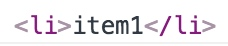
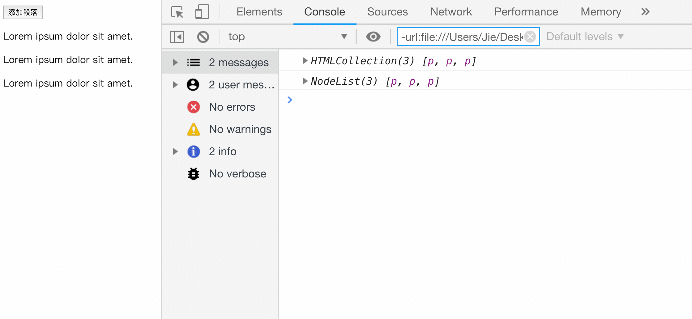
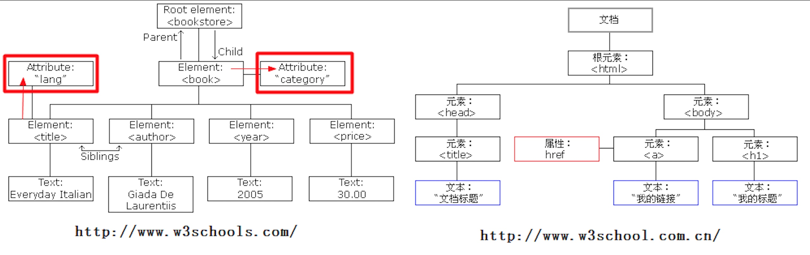
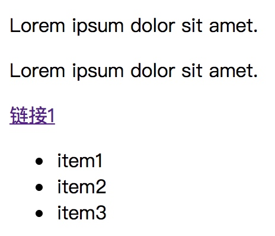

## 一、Document Object Model文档对象模型。

- 文档：文档表示的就是整个的HTML网页文档
- 对象：对象表示将网页中的每一个部分都转换为了一个对象。
  - DOM 里面的对象属于宿主对象，需要浏览器来作为宿主。一旦离开了浏览器这个环境，那么该对象将不复存在。

- 模型：使用模型来表示对象之间的关系，这样方便我们获取对象

DOM 的作用如下：

- 浏览器提供的操纵 HTML 文档内容的应用程序接口
- 用于对文档进行动态操作，如增加文档内容，删除文档内容，修改文档内容等等

## 二、 节点

### 1. 文档节点（document）

表示整个文档。`document`对象作为window对象的属性存在的，我们不用获取可以直接使用。

```js
var body = document.body;//获取body标签
var body = document.getElementsByTagName("body")[0];
var html = document.documentElement;//保存着html根标签
var all = document.all;//代表页面中的所有元素
var all = document.getElementsByTagName(" ");
```

### 2. 元素节点（element）

浏览器会将页面中所有的标签都转换为一个元素节点，我们可以通过document的方法来获取元素节点。

**获取元素节点的方法**

- `document.getElementsByClassName()`
  - 返回文档中所有指定类名的元素集合，作为NodeList对象。
- `document.getElementById()`
  - 返回对拥有指定 id 的第一个对象的引用。
- `document.getElementsByName()`
  - 返回带有指定名称的对象集合。
- `document.getElementsByTagName()`
  - 返回带有指定标签名的对象集合（类数组对象）。
- `document.querySelector()`
  - 需要一个选择器的字符串作为参数，可以根据一个CSS选择器来查询元素节点对象
  - 使用该方法总会返回唯一的一个元素，如果满足条件的元素有多个，那么它只会返回第一个
- `document.querySelectorAll()`
  - 该方法和querySelector()用法类似，不同的是它会将符合条件的元素封装到一个数组中返回
  - 即使符合条件的元素只有一个，它也会返回数组

> - 在所有的得到类数组的方法中，除了`querySelectorAll`，其他的方法都是实时更新的。
> - 书写了id的元素，会自动成为window对象的属性。它是一个实时的单对象。事实上的标准。不推荐使用。
> - `getElementsByTagName`、`getElementsByClassName`、`querySelector`、`querySelectorAll`，可以作为其他元素节点对象的方法使用

**获取元素节点的子节点**

- `element.childNodes`	返回元素的一个子节点的数组

  - childNodes属性会获取包括文本节点，空白节点在内的所有节点。

- `element.children`	返回元素的子元素的集合

  - children属性只返回一个节点下面的所有子元素节点，所以会忽略所有的文本节点和空白节点。

- `element.firstChild`	返回元素的第一个子节点（包括空白文本节点）

- `element.lastChild`	返回元素的最后一个子节点（包括空白文本节点）

  - ```html
    <body>
        <p id="test1" class="abc">Lorem ipsum dolor sit amet.</p>
        <p id="test2">Lorem ipsum dolor sit amet.</p>
        <a href="" class="abc">链接1</a>
        <ul id="test3">
            <li>item1</li>
            <li>item2</li>
            <li>item3</li>
        </ul>
        <script>
            let i = document.getElementById("test3");
            console.log(i.firstChild);
        </script>
    </body>
    ```

    效果：

    

    可以看到这里就访问到了 ul 下面的第一个子节点，但是这个节点是一个空白节点。什么意思呢？

    就是说在 DOM 里面会将空格和换行也视为是一个节点。这样的节点叫做空白节点。如果我现在将 ul 元素和 li 元素之间的空白给删除掉，那么第一个子元素就应该为 ul 下面的第一个 li。

    具体示例如下：

    ```html
    <body>
        <p id="test1" class="abc">Lorem ipsum dolor sit amet.</p>
        <p id="test2">Lorem ipsum dolor sit amet.</p>
        <a href="" class="abc">链接1</a>
        <ul id="test3"><li>item1</li>
            <li>item2</li>
            <li>item3</li>
        </ul>
        <script>
            let i = document.getElementById("test3");
            console.log(i.firstChild);
        </script>
    </body>
    ```

    效果：这时`<ul>`下面的第一个子元素就变为了第一个`<li>`元素。

    

    如果想要在保持之前的 HTML 结构的基础上获取第一个`<li>`元素的内容的话，就只有层层往下找。

    具体示例如下：

    ```html
    <body>
        <p id="test1" class="abc">Lorem ipsum dolor sit amet.</p>
        <p id="test2">Lorem ipsum dolor sit amet.</p>
        <a href="" class="abc">链接1</a>
        <ul id="test3">
            <li>item1</li>
            <li>item2</li>
            <li>item3</li>
        </ul>
        <script>
            let i = document.getElementById("test3");
            console.log(i.firstChild.nextSibling.firstChild);
        </script>
    </body>
    ```

    效果：

    

- `element.getElementsByTagName()`	返回指定标签名的所有子元素集合。

- `element.getElementsByClassName()`	返回文档中所有指定类名的元素集合，作为 NodeList 对象。

**获取元素节点的父节点和兄弟节点**

- `element.parentNode`  返回当前节点的父节点
- `element.previousSibling`  返回当前节点的前一个兄弟节点（包括空白文本节点）
- `element.nextSibling`  返回当前节点的后一个兄弟节点（包括空白文本节点）
- `element.previousElementSibling`
- `element.nextElementSibling`
  - 把前后的换行也算作是一个空白节点，这样的处理确实也有太麻烦了。所以，现在添加上了previousElementSibling和nextElementSibling这两个属性，直接用于查询某一个节点的上一个或者下一个元素节点。


>  💡 **HTMLCollection 与 NodeList**

当我们使用上述方法获取节点时，有的返回的是 HTMLCollection，而有的返回的是 NodeList。那么这两者之间有什么区别呢？

其最大的区别就在于，如果使用的是以前的 DOM 方法，例如`document.getElementsByTagName()`来获取到的节点集合，返回的为 HTMLCollection ，**这是一个实时集合**。

而使用新的`querySelectorAll()`方法获取到的节点集合，返回的为 NodeList ，**这不是一个实时集合**。

具体的示例如下：

```html
<body>
    <button id="btn">添加段落</button>
    <p>Lorem ipsum dolor sit amet.</p>
    <p>Lorem ipsum dolor sit amet.</p>
    <p>Lorem ipsum dolor sit amet.</p>
    <script>
        let HTMLCollection = document.getElementsByTagName('p');
        let NodeList = document.querySelectorAll('p');
        console.log(HTMLCollection);
        console.log(NodeList);
        // 向文档新添加一个段落
        btn.onclick = function () {
            // 创建一个新的 p 元素
            let newP = document.createElement("p");
            //创建一个文本节点
            let newContent = document.createTextNode("这是一个测试");
            //将文本节点添加给 p 元素节点作为子节点
            newP.appendChild(newContent);
            //获取 body 节点
            let doc = document.body;
            //为 body 节点添加子节点
            doc.appendChild(newP);
            console.log(HTMLCollection);
            console.log(NodeList);
        }
    </script>
</body>
```




### 3. 属性节点（attribute）

- 属性节点并非是元素节点的子节点，只能算作是元素节点的一个附属节点，如下图：可以通过元素节点来获取指定的属性节点。

  

- `element.getAttributeNode()`	返回指定属性节点

- 我们一般不使用属性节点

### 4. 文本节点（text）

获取文本节点时，一般先要获取元素节点。在通过元素节点获取文本节点。

- `text.nodeValue`
- `element.textContent`	设置或返回一个节点和它的文本内容

## 三、 dom对html的增删改

操作节点其实就有点像操作数据库数据一样，无非就是对节点进行增删改查，当然查就是前面我们所讲的查找节点，接下来我们来看一下对节点的增删改的操作。

---

#### 创建元素节点对象

- `document.createElement()`
  - 它需要一个标签名作为参数，将会根据该标签名创建元素节点对象，并将创建好的对象作为返回值返回


#### 创建文本节点对象

- `document.createTextNode()`
  - 需要一个文本内容作为参数，将会根据该内容创建文本节点，并将新的节点返回


#### 将某节点设置为另一节点的子节点

- `element.appendChild()`
  - 用法：父节点.appendChild(子节点);


#### 在指定的子节点前插入新的子节点

- `insertBefore()`
  - 用法：父节点.insertBefore(新节点,旧节点);


#### 文档碎片

在前面，我们已经学会了向文档里面添加节点，但是存在一个问题，那就是如果要添加大量节点的话，这种逐个添加的方法会显得效率很低，因为添加一个节点就会刷新一次页面。

这个时候，我们就可以使用 DOM 里面提供的`createElementFragment()`方法，将节点先添加在一个文档碎片里面，然后最后再一次性添加到文档里面。

具体的示例如下：

```html
<body>
    <p id="test1" class="abc">Lorem ipsum dolor sit amet.</p>
    <p id="test2" name="qwe">Lorem ipsum dolor sit amet.</p>
    <a href="" class="abc">链接1</a>
    <ul id="test3">
        <li>item1</li>
        <li name="qwe">item2</li>
        <li>item3</li>
    </ul>
    <script>
        let  arrText = ["first","second","third"];
        let oF = document.createDocumentFragment();
        for(let i=0;i<arrText.length;i++){
            // 创建元素节点 p
            let oP = document.createElement("p");
            // 给元素节点添加文本内容
            oP.innerText = arrText[i];
            // 将元素节点添加到文档碎片里面
            oF.appendChild(oP);
        }
        // 将 oF 里面所有的节点一次性添加到文档上面
        document.body.appendChild(oF);
    </script>
</body>
```

效果：


---

#### 可以删除一个子节点

- `removeChild()`
  - 语法：父节点.removeChild(子节点);
  - 常用：bj.parentNode.removeChild(bj);

  - 删除最后一个会报错，添加return false；点击超链接以后，超链接会跳转页面，这个是超链接的默认行为，但是此时我们不希望出现默认行为，可以通过在响应函数的最后return false来取消默认行为。

- `元素对象.remove()`
  - 除了使用父元素节点删除子节点的方式之外，我们元素对象本身其实就有一个remove方法,可以把自己直接删除


---

#### 使用指定的子节点替换已有的子节点

- `replaceChild()`
- 语法：父节点.replaceChild(新节点,旧节点);

#### 克隆节点

有些时候，我们不想创建和插入一个完全新的元素，而是想复制某个节点，这时就轮到克隆节点登场了。

克隆节点分为**浅克隆**和**深克隆**，只需要向`cloneNode()`方法传入一个布尔值即可实现浅克隆和深克隆。克隆节点的语法如下：

```
节点.cloneNode(布尔值)
```

**浅克隆：**所谓浅克隆，就是指指克隆某一个节点，仅仅是克隆该节点而已，方法参数传入 false。

具体的示例如下：

```html
<body>
    <p id="test1" class="abc">Lorem ipsum dolor sit amet.</p>
    <p id="test2">Lorem ipsum dolor sit amet.</p>
    <a href="" class="abc">链接1</a>
    <ul id="test3">
        <li>item1</li>
        <li>item2</li>
        <li>item3</li>
    </ul>
    <script>
        // 获取 ul 元素节点
        let ul = document.getElementById("test3");
        // 进行浅克隆
        let newUl = ul.cloneNode(false);
        // 添加到文档上面
        document.body.appendChild(newUl);
    </script>
</body>
```

效果：



光看上面的效果，我们感觉好像没有克隆成功，但实际上是克隆成功了的，我们打开开发者工具进行查看


可以看到，打开开发者工具以后我们看到确实对 ul 进行了克隆。

**深克隆：**所谓深克隆，就是指复制某个节点和其子节点，需要传入的布尔值为 true。

具体的示例如下：

```html
<body>
    <p id="test1" class="abc">Lorem ipsum dolor sit amet.</p>
    <p id="test2">Lorem ipsum dolor sit amet.</p>
    <a href="" class="abc">链接1</a>
    <ul id="test3">
        <li>item1</li>
        <li>item2</li>
        <li>item3</li>
    </ul>
    <script>
        // 获取 ul 元素节点
        let ul = document.getElementById("test3");
        // 进行深克隆,只需要将 false 改为 true
        let newUl = ul.cloneNode(true);
        // 添加到文档上面
        document.body.appendChild(newUl);
    </script>
</body>
```

效果：


可以看到，我们不用打开开发者工具，直接从页面上就能直观的感受到区别，这里已经将 ul 以及下面的子元素进行了完完整整的复制。

---

#### 使用innerHTML完成DOM的增删改的相关操作

通过前面的学习，现在我们已经能够对文档中的节点进行基本的增删改操作了。但是前面所介绍的方式，我不得不承认实在是相当的繁琐。我明明只是想新增一个节点，却需要好几个步骤才能实现。

那么，有没有一种方式可以让我们更加快捷简便的操作节点呢？答案是有的，就是通过直接修改节点内部信息来简化节点的操作步骤。在 DOM 中，我们可以通过`innerHTML`和`innerText`来获取到节点内部的信息。

- `innerText`用于获取元素节点的文本值
- `innerHTML`则用于用户元素节点下面的所有东西，包括 HTML 标签。
- `textContent`属性。可以直接获取到一个元素节点的文本内容。

`innerText`和`textContent`方法的区别

```
textContent：会获取'style= "display:none"'中的文本，而 innerText 不会。
textContent：会获取 style 标签里面的文本，而 innerText 不会。
innerText：对 Internet Explorer 的兼容性较好。 
textContent：虽然作为标准方法，但是只支持 Internet Explorer 8+ 以上的浏览器。
```

这里我们来看一个具体的例子，示例如下：

```html
<body>
    <!-- 此代码只是作为测试，无任何实际含义 -->
    <div class="test" id="test">
        <p>Hello</p> 
        <style>*{margin: 0px;padding: 0px;}</style>  
        <div style="display:none">
            <p>World</p>
        </div>
        <ul>
            <li>item1</li>
            <li>item2</li>
            <li>item3</li>
        </ul>
    </div>
    <script>
        let testDiv = document.getElementById('test');
        console.log("我是textContent输出的" + testDiv.textContent);
        console.log("我是innerText输出的" + testDiv.innerText);
    </script>
</body>
```

效果：


---

- `city.innerHTML += "<li>广州</li>"`;//会将整个innerHTML重新设置（之前的删掉）
- 采取一种折中的方式：

```js
var li = document.createElement("li");//创建属性节点
li.innerHTML = "广州";//向li中设置文本
city.appendChild(li);//将li添加到city中
```

## 四、 dom操作属性和类

- `getAttribute()`
  - element.getAttribute()，获取元素节点的属性值
- `setAttribute()`
  - element.setAttribute()，设置元素节点的属性
- `removeAttribute()`
  - element.setAttribute()，删除元素节点的属性

---

- `element.class`、`element.classList`（类数组）、`element.className`（字符串）
- `element.classList.add() `给一个元素节点添加类
- `element.classList.remove()`移除一个元素节点的类
- `element.classList.contains()`检测一个元素节点是否含有指定的某一个类。
- `element.classList.toggle()`
  - 用来对类进行切换。如果元素节点没有给出的类，就添加该类，如果有该类，就删除该类。

---

对于一些自定义属性，按照 HTML 5 的规范应该尽量使用`data-`作为前缀，比如给 p 元素添加一个自定义属性 power，应该设置为`data-power`。

这样设置之后，有一种新的方式可以访问这个属性，即使用标签中的`dataset`属性

```js
test1.dataset.power = 'high speed';
```

这个 dataset 是每个元素节点都有的属性，它指向所有以`data-`开头的属性集合。

## 五、 dom修改元素的样式

#### 方式一：元素.style.样式名 = 新的样式值；

- 如果CSS的样式名中含有`-`，这种名称在JS中是不合法的比如`background-color`，需要将这种样式名修改为驼峰命名法，去掉`-`，然后将`-`后的字母大写，或者直接使用中括号来表示css属性。

 ```js
box1.style.backgroundColor = "yellow";
box1.style['background-color'] = "yellow";
 ```

- 通过`style`属性设置和读取的都是内联样式，无法读取样式表中的样式。也就是说，如果我们使用`style`来获取元素节点的属性的时候，它排除了最常用的来自于外部样式表的样式，**不仅外部样式表的样式获取不到，连内嵌的样式也同样无法获取**。

#### 方式二：元素.currentStyle.样式名

- 用来读取当前元素正在显示的样式，如果当前元素没有设置该样式，则获取它的默认值
- **currentStyle只有IE浏览器支持**，其他的浏览器都不支持

#### 方式三：getComputedStyle()    使用这个方法来获取元素当前的样式

- 这个方法是window的方法(<strong style="color:red">只读</strong>)，可以直接使用
- 需要两个参数，第一个为要获取样式的元素；第二个可以传递一个伪元素，一般都传null
- 返回一个对象，对象中封装了当前元素对应的样式，可以通过对象.样式名来读取样式，若获取的样式没有设置，则会获取到真实的值，而不是默认值。
- `getComputedStyle(box1,null).backgroundColor`

#### 方式四：document.styleSheets 来获取到一个网页中所有样式表的引用。

> 虽然我们可以通过 DOM 提供的接口轻松的改变元素节点的样式，但是，**动态的改变元素的类，并且将每个类的相关样式保存在单独的样式表里面才是更好的做法**。

## 六、一些API的记录

> [事件参考 | MDN ](https://developer.mozilla.org/zh-CN/docs/Web/Events)

### 1. page visible api

- `Document.hidden`（只读属性）
  - 返回布尔值，表示页面是（true）否（false）隐藏。
- `visibilitychange`（事件）
  - 当其选项卡的内容变得可见或被隐藏时，会在文档上触发 `visibilitychange` (能见度更改) 事件。

```js
// 在文档可见时开始播放音乐曲目，在文档不再可见时暂停音乐。
document.addEventListener("visibilitychange", function() {
    if (document.hidden) {
        backgroundMusic.pause();
    } else {
        backgroundMusic.play();
    }
});
```

