事件最早是在 Internet Explorer 3 和 Netscape Navigator 2 中出现的，当时是作为分担服务器运算负担的一种手段。要实现和网页的互动，就需要通过 JavaScript 里面的事件来实现。

每次用户与一个网页进行交互，例如点击链接，按下一个按键或者移动鼠标时，就会触发一个事件。我们的程序可以检测这些事件，然后对此作出响应。从而形成一种交互。

这样可以使我们的页面变得更加的有意思，而不仅仅像以前一样只能进行浏览。

## 一、事件与事件流

### 1. 事件介绍

JavaScript 和 HTML 之间的交互是通过当用户或者浏览器操作网页时发生的事件来处理的。页面装载时，是一个事件，用户点击页面上的某个按钮时，也是一个事件。

在早期拨号上网的年代，如果所有的功能都放在服务器端进行处理的话，效率是非常低的。所以 JavaScript 最初被设计出来就是用来解决这些问题的。通过允许一些功能在客户端处理，以节省到服务器的往返时间。

JavaScript 中采用一个叫做事件监听器的东西来监听事件是否发生。这个事件监听器类似于一个通知，当事件发生时，事件监听器会让我们知道，然后程序就可以做出相应的响应。

通过这种方式，就可以避免让程序不断地去检查事件是否发生，让程序在等待事件发生的同时，可以继续做其他的任务。

> 这其实就是后面我们会介绍到的异步，后面的章节会具体的介绍异步相关的知识。

接下来我们来看一个事件的快速入门案例，如下：

```html
<body>
  <button onclick="test()">点击我</button>
  <script>
    let test = function () {
      alert('我知道你已经点击了');
    };
  </script>
</body>
```

效果：点击按钮以后弹出一个对话框 

这里我们就给 button 元素节点绑定了一个点击事件，当用户点击该按钮时，会执行`test()`函数。

### 2. 事件流介绍

当浏览器发展到第 4 代时（Internet Explorer 4 及 Netscape 4），浏览器开发团队遇到了一个很有意思的问题：页面的哪一部分会拥有某个特定的事件？

想象在一张纸上的一组同心圆。如果把手指放在圆心上，那么手指指向的不是一个圆，而是纸上的所有圆。

好在两家公司的浏览器开发团队在看待浏览器事件方面还是一致的。如果单击了某个按钮，他们都认为单击事件不仅仅发生在按钮上，甚至也单击了整个页面。

但有意思的是，Internet Explorer 和 Netscape 开发团队居然提出了差不多是完全相反的事件流的概念。Internet Explorer 的事件流是事件冒泡流，而 Netscape 的事件流是事件捕获流。

### 3. 事件冒泡

Internet Explorer 的事件流叫做事件冒泡（event bubbling），即事件开始时由最具体的元素（文档中嵌套层次最深的那个节点）接收，然后逐级向上传播到较为不具体的节点（文档）。

以下列 HTML 结构为例，来说明事件冒泡。如下：

```html
<!DOCTYPE html>
<html lang="en">
  <head>
    <meta charset="UTF-8" />
    <title>Document</title>
  </head>
  <body>
    <div></div>
  </body>
</html>
```

如果单击了页面中的 div 元素，那么这个 click 事件沿 DOM 树向上传播，在每一级节点上都会发生，按照如下顺序进行传播：

```
1.<div>
2.<body>
3.<html>
4.document
```

所有现代浏览器都支持事件冒泡，但在具体实现在还是有一些差别。Internet Explorer 9、Firefox、Chrome、Safari 将事件一直冒泡到 window 对象。

```
1.<div>
2.<body>
3.<html>
4.document
5.window
```

我们可以通过下面的代码，来查看文档具体的冒泡顺序，示例如下：

```html
<body>
  <div id="box" style="height:100px;width:300px;background-color:pink;"></div>
  <button id="reset">还原</button>
  <script>
    // IE 8 以下浏览器返回 div body html document
    // 其他浏览器返回 div body html document window
    reset.onclick = function () {
      history.go();
    };
    box.onclick = function () {
      box.innerHTML += 'div\n';
    };
    document.body.onclick = function () {
      box.innerHTML += 'body\n';
    };
    document.documentElement.onclick = function () {
      box.innerHTML += 'html\n';
    };
    document.onclick = function () {
      box.innerHTML += 'document\n';
    };
    window.onclick = function () {
      box.innerHTML += 'window\n';
    };
  </script>
</body>
```

效果：当我们点击了页面上的 div 元素以后，出现的文字顺序如下。


### 4. 事件捕获

Netscape Communicator 团队提出的另一种事件流叫做事件捕获（event captruing）。事件捕获的思想是不太具体的节点应该更早接收到事件，而最具体的节点应该最后接收到事件。

事件捕获的思想是在事件到达预定目标之前就捕获它。以同样的 HTML 结构为例来说明事件捕获，如下：

```html
<!DOCTYPE html>
<html lang="en">
  <head>
    <meta charset="UTF-8" />
    <title>Document</title>
  </head>
  <body>
    <div></div>
  </body>
</html>
```

在事件捕获过程中，document 对象首先接收到 click 事件，然后事件沿 DOM 树依次向下，一直传播到事件的实际目标，即 div 元素：

```
1.document
2.<html>
3.<body>
4.<div>
```

Internet Explorer 9、Firefox、Chrome、Safari 等现代浏览器都支持事件捕获，但是也是从 window 对象开始捕获。

```
1.window
2.document
3.<html>
4.<body>
5.<div>
```

后面我们会学习`addEventListener()`这个方法。在这个方法中当第三个参数设置为 true 时，即为事件捕获。我们由此可以来观察一下事件捕获的一个顺序，如下：

```html
<body>
  <div id="box" style="height:100px;width:300px;background-color:pink;"></div>
  <button id="reset">还原</button>
  <script>
    // IE 8 以下浏览器不支持
    // 其他浏览器返回 window document html body div
    reset.onclick = function () {
      history.go();
    };
    box.addEventListener(
      'click',
      function () {
        box.innerHTML += 'div\n';
      },
      true
    );
    document.body.addEventListener(
      'click',
      function () {
        box.innerHTML += 'body\n';
      },
      true
    );
    document.documentElement.addEventListener(
      'click',
      function () {
        box.innerHTML += 'html\n';
      },
      true
    );
    document.addEventListener(
      'click',
      function () {
        box.innerHTML += 'document\n';
      },
      true
    );
    window.addEventListener(
      'click',
      function () {
        box.innerHTML += 'window\n';
      },
      true
    );
  </script>
</body>
```

效果：当我们点击了页面的 div 元素以后，出现的文字顺序如下：


### 5. DOM 事件流

DOM 标准采用**捕获 + 冒泡**。

两种事件流都会触发 DOM 的所有对象，从 document 对象开始，也在 document 对象结束。换句话说，起点和终点都是 document 对象（很多浏览器可以一直捕获 + 冒泡到 window 对象）

DOM 事件流示意图：

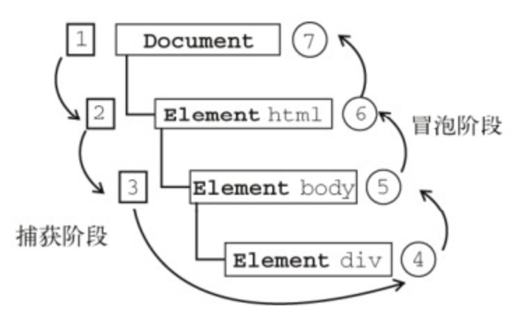

DOM 标准规定事件流包括三个阶段：**事件捕获阶段**、**处于目标阶段**和**事件冒泡阶段**。

**事件捕获阶段**：实际目标 div 在捕获阶段不会接收事件。也就是说在捕获阶段，事件从 document 到 html 再到 body 就停止了。上图中为 1 - 3。

**处于目标阶段**：事件在 div 上发生并处理。但是事件处理会被看成是冒泡阶段的一部分。

**冒泡阶段**：事件又传播回文档。

## 二、事件监听器

事件监听器，又被称之为事件处理程序。简单来说，就是和事件绑定在一起的函数。

当事件发生时就会执行函数中相应的代码。事件监听器根据 DOM 级别的不同写法上也是有所区别的，不仅写法有区别，功能上也是逐渐的在完善。

### 1. HTML 事件监听器

HTML 事件监听器，又被称之为行内事件监听器。这是在浏览器中处理事件最原始的方法。我们在最开始的时候写的事件快速入门案例就是一个 HTML 事件处理程序。

具体的示例如下：

```html
<body>
  <button onclick="test()">点击我</button>
  <script>
    let test = function () {
      alert('我知道你已经点击了');
    };
  </script>
</body>
```

但是有一点需要注意，就是这种方法已经过时了，原因如下：

- JavaScript 代码与 HTML 标记混杂在一起，破坏了结构和行为分离的理念。
- 每个元素只能为每种事件类型绑定一个事件处理器。
- 事件处理器的代码隐藏于标记中，很难找到事件是在哪里声明的。

但是如果是做简单的事件测试，那么这种写法还是非常方便快捷的。

### 2. DOM 0 级事件监听器

这种方式是首先取到要为其绑定事件的元素节点对象，然后给这些节点对象的事件处理属性赋值一个函数。这样就可以达到 JavaScript 代码和 HTML 代码相分离的目的。

具体的示例如下：

```html
<body>
  <button id="test">点击我</button>
  <script>
    let test = document.getElementById('test');
    test.onclick = function () {
      console.log('this is a test');
    };
  </script>
</body>
```

这种方式虽然相比 HTML 事件监听器有所改进，但是它也有一个缺点，那就是它依然存在每个元素只能绑定一个函数的局限性。

下面我们尝试使用这种方式为同一个元素节点绑定 2 个事件，如下：

```html
<body>
  <button id="test">点击我</button>
  <script>
    let test = document.getElementById('test');
    test.onclick = function () {
      console.log('this is a test');
    };
    test.onclick = function () {
      console.log('this is a test,too');
    };
  </script>
</body>
```

效果：点击按钮会只会弹出后面的"this is a test,too"，因为后面的事件处理程序把前面的事件处理程序给覆盖掉了。

### 3. DOM 2 级事件监听器

DOM 2 级事件处理程序通过`addEventListener()`可以为一个元素添加多个事件处理程序。

这个方法接收 3 个参数：**事件名**，**事件处理函数**，**布尔值**。如果这个布尔值为 true，则在捕获阶段处理事件，如果为 false，则在冒泡阶段处理事件。若最后的布尔值不填写，则和 false 效果一样，也就是说默认为 false，在冒泡阶段进行事件的处理。

接下来我们来看下面的示例：这里我们为 button 元素绑定了 2 个事件处理程序，并且 2 个事件处理程序都是通过点击来触发。

```html
<body>
  <button id="test">点击我</button>
  <script>
    let test = document.getElementById('test');
    test.addEventListener(
      'click',
      function () {
        console.log('this is a test');
      },
      false
    );
    test.addEventListener(
      'click',
      function () {
        console.log('this is a test,too');
      },
      false
    );
  </script>
</body>
```

效果：可以看到绑定在上面的 2 个事件处理程序都工作正常。

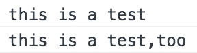

> 注：在 Internet Explorer 浏览器中使用的方法为`attachEvent()`。

### 4. 删除事件监听器

通过 DOM 0 级来添加的事件，删除的方法很简单，只需要将节点对象的事件处理属性赋值为 null 即可。

具体的示例如下：

```html
<body>
  <button id="test">点击我</button>
  <script>
    let test = document.getElementById('test');
    test.onclick = function () {
      console.log('this is a test');
    };
    test.onclick = null; // 删除事件绑定
  </script>
</body>
```

通过 DOM 2 级来添加的事件，我们可以使用`removeEventLister()`来进行事件的删除。

需要注意的是，如果要通过该方法移除**某一类事件类型的一个事件**的话，在通过`addEventListener()`来绑定事件时的写法就要稍作改变。

先单独将绑定函数写好，然后`addEventListener()`进行绑定时第 2 个参数传入要绑定的函数名即可。

具体的示例如下：

```html
<body>
  <button id="test">点击我</button>
  <script>
    let test = document.getElementById('test');
    //DOM 2级添加事件
    let fn1 = function () {
      console.log('this is a test');
    };
    let fn2 = function () {
      console.log('this is a test,too');
    };
    test.addEventListener('click', fn1, false);
    test.addEventListener('click', fn2, false);
    test.removeEventListener('click', fn1); // 只删除第一个点击事件
  </script>
</body>
```

效果：第一个点击事件已经被移除掉了

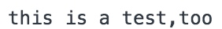

> 注：在 Internet Explorer 浏览器中使用的方法为`detachEvent()`。

## 三、事件类型

在上一小节中，我们介绍了在 JavaScript 中绑定事件的几种形式，但是演示的全部都是点击事件。触发事件就只能够通过点击鼠标来触发么？

显然不是。实际上，在 JavaScript 中事件的类型是有多种的，我们可以通过很多不同的方式来触发事件。下面我们将重点介绍鼠标，键盘以及页面上所常见的事件类型。

### 1. 鼠标事件

鼠标事件是 Web 开发中最常见的一类事件。DOM 3 级标准中定义了 9 个鼠标事件。

```
click：用户单机主鼠标按钮（一般是左键）或者按下回车键时触发。
dblclick：用户双击鼠标按钮时触发。
mousedown：用户按下了任意鼠标按钮时触发。
mouseenter：进入元素时触发，但是再进入到子元素时不会再触发。
mouseleave：从某个元素出来时触发，但不包括子元素。
mousemove：当鼠标在元素范围内移动内，就会不停的重复地触发。
mouseout：从当前元素出来时触发，进出子元素也会触发。（因为进出子元素可以看作是从当前元素出来了）
mouseover：进入元素时触发，进出子元素时也会触发。（因为进出子元素可以看作是进入了新的元素）
mouseup：在用户释放鼠标按钮时触发。
```

上面是对这 9 个鼠标事件的一个简单介绍，下面将针对这 9 种鼠标事件做具体的演示：

```html
<head>
  <meta charset="UTF-8" />
  <title>Document</title>
  <style>
    div {
      width: 100px;
      height: 100px;
      border: 1px solid;
      float: left;
      text-align: center;
    }
    .son {
      width: 30px;
      height: 30px;
      border: 1px solid red;
    }
  </style>
</head>
<body>
  <!-- 设置 9 个div，其中 4,5,7,8 需要设置子元素 -->
  <div id="one">1.click</div>
  <div id="two">2.dblclick</div>
  <div id="three">3.mousedown</div>
  <div id="four">
    4.mouseenter
    <div class="son"></div>
  </div>
  <div id="five">
    5.mouseleave
    <div class="son"></div>
  </div>
  <div id="six">6.mousemove</div>
  <div id="seven">
    7.mouseout
    <div class="son"></div>
  </div>
  <div id="eight">
    8.mouseover
    <div class="son"></div>
  </div>
  <div id="nine">9.mouseup</div>
  <script>
    // 事件处理程序
    let test = function () {
      console.log('你已经触发了事件');
    };
    // 9 种不同的事件
    one.addEventListener('click', test);
    two.addEventListener('dblclick', test);
    three.addEventListener('mousedown', test);
    four.addEventListener('mouseenter', test);
    five.addEventListener('mouseleave', test);
    six.addEventListener('mousemove', test);
    seven.addEventListener('mouseout', test);
    eight.addEventListener('mouseover', test);
    nine.addEventListener('mouseup', test);
  </script>
</body>
```

效果： 

主要需要注意的就是 mouseleave 与 mouseout，还有就是 mouseenter 和 mouseover 的区别。

### 2. 键盘事件

常见的键盘事件有 3 个，分别为`keydown`，`keypress`和`keyup`，介绍如下：

```
keydown：按下键盘上任意键时触发，而且如果按住不放的话，会重复触发此事件。
keypress：按下键盘上一个字符键（不包括 shift 和 alt 键）时触发。如果按住不放，也是会重复触发。
keyup：当用户释放键盘上的键时触发。
```

> 注：所谓字符键，是指按下后会产生一个字符值的按键，例如 A、B、C...等。而 shift 或者 alt 等功能按键则不是字符键。

这里我们演示一个 keydown 事件，如下：

```html
<body>
  <script>
    document.onkeydown = function () {
      console.log('你按下了键盘上的某一个键');
    };
  </script>
</body>
```

效果：当我们随意按下键盘上的任意按键时，会触发所绑定的事件。

有的同学可能会问，那我怎么知道用户按下了哪一个键呢？

实际上，配合着事件对象里面的属性，我们就可以很轻松的获取到用户具体按下的是哪一个键，从而可以根据用户的按键触发不同的行为。

> 注：我们会在下一小节中介绍事件对象。

### 3. 页面事件

页面事件主要是指当我们对整个 HTML 页面做相应的操作时会触发的事件。常见的有页面加载，页面卸载以及页面滚动等。

**1. 页面加载**

页面事件中最常用的一个事件就是`load`事件。这个事件一般绑定在 window 对象上面。页面完全加载后（包括所有图像，JavaScript 文件，CSS 外部资源），就会触发 window 上面的`load`事件。

最常见的写法如下：

```html
<body>
  <p>在看到我之前，应该有一个弹出框</p>
  <script>
    window.onload = function () {
      alert('你正在加载一个页面！');
    };
  </script>
</body>
```

效果：首先页面完全加载后，触发`load`事件，出现弹出框。然后页面才被加载出来。

当然该事件也可以用于某个单独的元素上面，示例如下：

```html
<body>
  <p>在看到我之前，应该有一个弹出框</p>
  
</body>
```

效果：上面的代码表示，当图像加载完毕以后就会显示一个警告框。

**2. 页面卸载**

与`load`事件对应的是`unload`事件，这个事件是在文档完全被卸载后触发。只要用户从一个页面切换到另一个页面，或者关闭浏览器，就会触发这个事件。示例如下：

> 注：现代浏览器规定当页面被卸载时，`alert()`，`confim()`，`prompt()`等模态对话框不再允许弹出，所以这里无法显示出其效果。

```html
<body>
  <p>Lorem ipsum dolor sit amet.</p>
  <script>
    window.onunload = function () {
      console.log('页面已经卸载');
    };
  </script>
</body>
```

效果：由于刷新也算是一种页面卸载，所以不停的刷新页面可以勉强在控制台中看到打印的语句。

**3. 页面滚动**

滚动页面时，对应的`scroll`滚动事件就会被触发。通过 body 元素的`scrollLeft`和`scrollTop`可以监控到这一变化。scrollLeft 会监控横向滚动条的变化，scrollTop 会监控垂直方向的滚动条变化。

具体的示例如下：

```html
<body style="height:5000px;" id="body">
  <p>Lorem ipsum dolor sit amet.</p>
  <script>
    document.body.onscroll = function () {
      console.log(document.documentElement.scrollTop);
    };
  </script>
</body>
```

效果：滚动页面时在控制台会打印出当前滚动了的高度。


**4. 窗口设置大小**

当浏览器窗口被调整到一个新的高度或者宽度时，就会触发`resize`事件。

具体的示例如下：

```html
<body>
  <p>Lorem ipsum dolor sit amet.</p>
  <script>
    window.onresize = function () {
      console.log('窗口大小被重置了');
    };
  </script>
</body>
```

效果：


我们可以通过`document.body.clientHeight`以及`document.body.clientWidth`来获取 body 元素的宽高，配合`resize`事件，可以看到这两个属性实时变化的一个效果。

```html
<body>
  <p>Lorem ipsum dolor sit amet.</p>
  <script>
    window.onresize = function () {
      console.clear(); // 清空控制台信息
      console.log(document.body.clientHeight); // 高度会根据当前的页面高度而固定
      console.log(document.body.clientWidth);
    };
  </script>
</body>
```

效果：


## 四、事件对象

在上一小节中我们已经介绍了一些常见的事件类型。每当这些事件被触发时，事件监听器就会执行相应的代码。

与此同时，监听器上所绑定的回调函数里面还会自动传入一个叫做 event 的事件对象。该对象包含了许多和当前所触发的事件相关的信息。例如绑定事件的 DOM 元素是什么，所触发的事件类型是什么等。

这一小节我们就一起来看一下有关事件对象的相关知识。

首先，事件对象是以事件处理函数中的参数形式出现的，**该对象并不需要我们自己创建，直接使用即可**。

语法结构如下：

```js
事件源.addEventListener(
  eventName,
  function (event) {
    // event 就是事件对象
  },
  boolean
);
```

事件对象说明：

- 当事件发生时，只能在事件函数内部访问的对象
- 处理函数结束后会自动销毁

**兼容的事件对象**

这里有必要说一下获取事件对象的方式。上面有提到，事件对象是以事件处理函数中的参数形式出现的。在 DOM 标准以及 Internet Explorer 9 及之后版本的浏览器中，确实是这样的。

具体的示例如下：

```js
btn.onclick = function (event) {
  console.log(event);
};
```

而在 Internet Explorer 8 及之前的版本浏览器中，event 事件对象是作为 window 对象的一个属性。

具体的示例如下：

```js
btn.onclick = function (event) {
  console.log(window.event);
};
```

想要实现 event 事件对象的兼容，我们可以在事件的处理函数中添加以下代码：

```js
btn.onclick = function (event) {
  event = event || window.event;
};
```

### 1. 通用的事件对象属性

所谓通用的事件对象属性，就是指无论你触发的是什么事件，事件对象中都会拥有的属性。最常见的两个属性就是**事件类型**以及**事件目标**。

**1. 事件类型**

事件对象的`type`属性会返回当前所触发的事件类型是什么。

具体的示例如下：

```html
<body>
  <button id="test">点击我</button>
  <script>
    let test = document.getElementById('test');
    test.addEventListener(
      'click',
      function (event) {
        console.log(event.type); // click
      },
      false
    );
  </script>
</body>
```

> 注：event 对象会自动被传入到所绑定的回调函数里面，所以即便回调函数中没有书写以 event 作为的形参，函数内部依然可以正常使用。但是我们建议一般还是写上比较好。

**2. 事件目标**

`target`属性返回对触发事件的元素节点对象的一个引用。

具体的示例如下：

```html
<body>
  <button id="test">点击我</button>
  <script>
    let test = document.getElementById('test');
    test.addEventListener(
      'click',
      function () {
        console.log(event.target); //<button id="test">点击我</button>
      },
      false
    );
  </script>
</body>
```

**3. this 值**

这里要重点提一下事件处理函数里面的`this`值。

当我们触发一个事件的时候，事件处理程序里面的 this 指代的是**绑定事件的元素**，而事件对象的`target`属性指代的是**触发事件的元素**。

> 注：`target`和`srcElememnt`是等价的。

我们来看下面的例子：

```html
<body>
  <ul id="color-list">
    <li>red</li>
    <li>yellow</li>
    <li>blue</li>
    <li>green</li>
    <li>black</li>
    <li>white</li>
  </ul>
  <script>
    // this 是绑定事件的元素
    // target 是触发事件的元素，和 srcElememnt 等价
    let colorList = document.getElementById('color-list');
    colorList.addEventListener('click', function (event) {
      console.log('this:', this);
      console.log('target:', event.target);
      console.log('srcElement:', event.srcElement);
    });
  </script>
</body>
```

效果：当我点击 ul 的地方时，由于绑定事件的元素和触发事件的元素相同，所以都显示出 ul。红色画圈部分是我点击的位置，如下：


当我点击 li 的时候，区别就出来了，红色画圈部分是我点击的位置，如下：

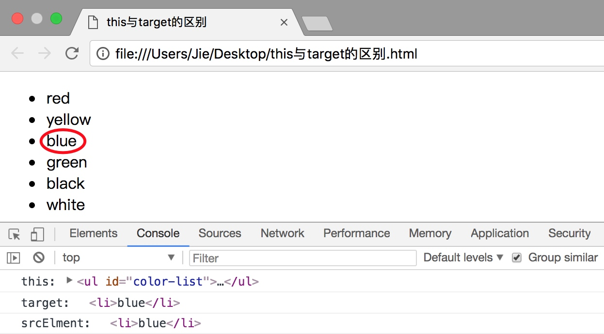

### 2. 鼠标事件的事件对象

当我们触发鼠标事件时，会有一些与鼠标事件相关的属性被填入到 event 对象里面。

**1. button 属性**

当我们按下鼠标时，会有一个`button`属性被填入到 event 对象里面。

button 属性有 3 个值：0 表示按下的是鼠标左键，1 表示按下的是鼠标中键，2 表示按下的是鼠标右键。

具体的示例如下：

```html
<body>
  <p id="test">Lorem ipsum dolor sit amet.</p>
  <script>
    test.onmousedown = function (event) {
      console.log(event.button);
    };
  </script>
</body>
```

效果：按下鼠标不同的键位显示出不同的数字


**2. 事件坐标**

除了获取用户按下的是哪一个鼠标键以外，我们还能够精准的获取到用户按下鼠标时所处的位置。这里获取的坐标值有好几组，大致如下：

相对于浏览器器位置:

```
event.clientX：返回当事件被触发时鼠标指针相对于浏览器页面(或客户区)的水平坐标。(只包含文档的可见部分，不包含窗口本身的控件以及滚动条)
event.clientY：返回当事件被触发时⿏标指针相对于浏览器页面(客户区)的垂直坐标。(只包含文档的可见部分，不包含窗口本身的控件以及滚动条)
event.pageX：可以获取事件发生时光标相对于当前窗口的水平坐标信息(包含窗口自身的控件和滚动条)
event.pageY：可以获取事件发生时光标相对于当前窗口的垂直坐标信息(包含窗口自身的控件和滚动条)
```

相对于屏幕位置:

```
event.screenX：返回事件发生时鼠标指针相对于电脑屏幕左上角的水平坐标。
event.screenY：返回事件发生时鼠标指针相对于电脑屏幕左上角的垂直坐标。
```

相对于事件源位置:

```
event.offsetX：返回事件发生时鼠标指针相对于事件源的水平坐标
event.offsetY：返回事件发生时鼠标指针相对于事件源的垂直坐标
event.layerX：返回事件发生时鼠标指针相对于事件源的水平坐标(Firefox)
event.layerY：返回事件发生时鼠标指针相对于事件源的垂直坐标(Firefox)
```

这几个事件属性看似类似，但是有一些细微的不同。它们有助于查明点击的位置，或者鼠标光标的位置。

具体的示例如下：

```html
<head>
  <meta charset="UTF-8" />
  <title>Document</title>
  <style>
    body {
      height: 5000px;
    }
    div {
      position: fixed;
      top: 50px;
      left: 100px;
      width: 100px;
      height: 100px;
      border: 1px solid;
    }
  </style>
</head>

<body>
  <div id="box"></div>
  <script>
    box.addEventListener(
      'click',
      function () {
        console.log('screen:', event.screenX, event.screenY);
        console.log('page:', event.pageX, event.pageY);
        console.log('client:', event.clientX, event.clientY);
        console.log('offset:', event.offsetX, event.offsetY);
      },
      false
    );
  </script>
</body>
```

效果：将窗口向下滚动一段距离后，点击鼠标，出现了以下数值。

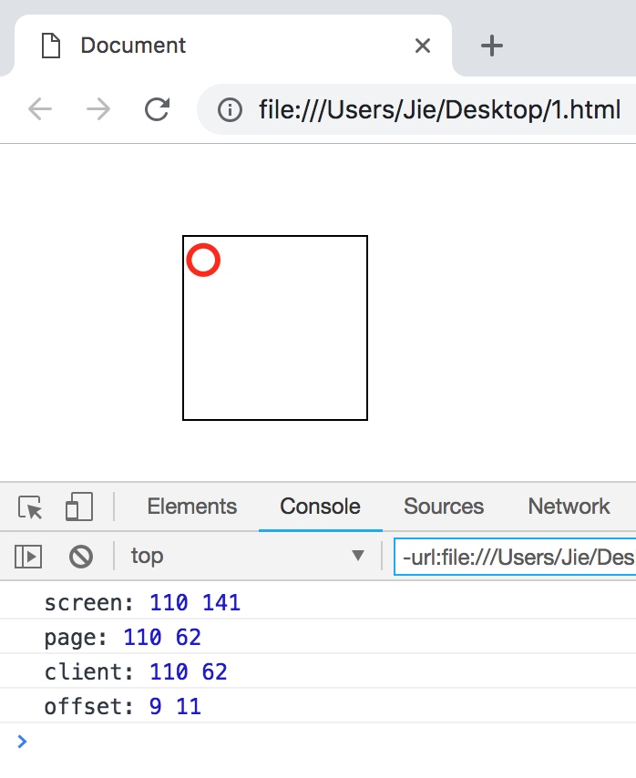

这里分别做一些解释，如下：

```
screen：参考点为电脑屏幕左上角。
page：参考点为文档左上角，这里由于我滚动了页面，所以滚动的部分也会被记入其中。(clientY+滚动)
client：参照点始终为当前视口的左上角，无论是否滚动了页面。
offset：当前事件源的左上角作为参考点。
```

**3. 滚动事件**

- `onmousewheel`鼠标滚轮滚动的事件，会在滚轮滚动时触发，但是火狐不支持该属性
  - 在火狐中需要使用 `DOMMouseScroll` 来绑定滚动事件，注意该事件需要通 addEventListener()函数来绑定
- `event.wheelDelta` 可以获取鼠标滚轮滚动的方向
  - wheelDelta 这个属性火狐中不支持，在火狐中使用 event.detail 来获取滚动的方向
  - `if(event.wheelDelta > 0 || event.detail < 0){}`

> 这两种事件接口皆非标准，如今的 scroll 事件对上述内容的行为响应做了统一。
>
> - `scroll`事件在元素内部内容区发生滚动时触发
> - `wheel`是标准的滚轮事件，当鼠标滚轮滑动时触发，具体的默认行为取决于浏览器实现，所以不一定会触发 scroll 事件
> - 此时若想获取滚动的方向，有两种方式：
>   - [`WheelEvent.deltaY`](https://developer.mozilla.org/zh-CN/docs/Web/API/WheelEvent/deltaY)，但是标准未定义滚轮事件具体会引发什么样的行为，引发的行为实际上是各浏览器自行定义的，所以通过该滚轮事件获知文档内容滚动方向的方法并不可靠。而且当拖动滚动条滚动时也不会触发此事件。
>   - 在文档内容滚动事件（[`scroll`](https://developer.mozilla.org/zh-CN/docs/Web/API/Document/scroll_event)）中监视[`scrollLeft`](https://developer.mozilla.org/zh-CN/docs/Web/API/Element/scrollLeft)和[`scrollTop`](https://developer.mozilla.org/zh-CN/docs/Web/API/Element/scrollTop)二值变化情况
>
> 对于滚动事件的优化处理还将涉及到`节流`的概念

### 3. 键盘事件的事件对象

同样的，键盘事件也会有相关的属性被传入 event 对象，常见的属性有`keyCode`和`key`属性。

keyCode 属性会发生在`keydown`和`keyup`事件被触发时，每一个 keyCode 的值与键盘上一个特定的键对应。该属性的值与 ASCII 码中对应的编码相同。

```html
<body>
  <input type="text" id="test" />
  <script>
    let test = document.getElementById('test');
    test.addEventListener(
      'keypress',
      function () {
        console.log('你已经触发了事件');
        console.log(event.keyCode);
      },
      false
    );
  </script>
</body>
```

效果：按下一个键，就会有对应的 keyCode 被打印到控制台

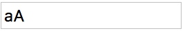

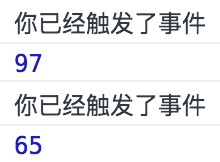

而我们在做游戏时，常用的 4 个方向按键，左上右下（顺时针）的键码分别是 37、38、39、40。

`key`属性是为了取代 keyCode 而新增的，它的值是一个字符串。在按下某个字符键时，key 的值就是相应的文本字符。在按下非字符键时，key 的值是相应键的名，默认为空字符串。

> 注：Internet Explorer 8 以下的浏览器不支持，safari 浏览器不支持`keypress`事件中的 key 属性。

```html
<body>
  <input type="text" id="test" />
  <script>
    let test = document.getElementById('test');
    test.addEventListener(
      'keydown',
      function () {
        console.log('你已经触发了事件');
        console.log(event.key);
      },
      false
    );
  </script>
</body>
```

效果：会打印出用户按下的哪一个键

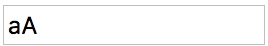

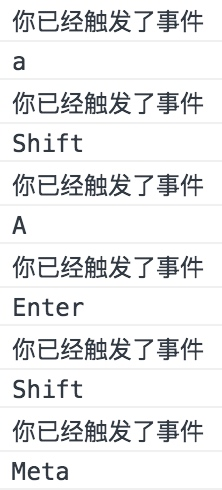

**辅助按键（扩展）**

按下键盘上的`shift`，`Ctrl`，`Alt`和`Meta`（Mac 上的`command`）等辅助按键的时候，会触发`keydown`和`keyup`事件，但是不会触发`keypress`事件，因为它们不会在屏幕上产生任何字符。

这里大家可以通过下面两段代码自行进行对比，如下：

```html
<body>
  <script>
    window.onkeyup = function () {
      console.log('OK');
    };
  </script>
</body>
```

效果：此时按下`shift`，`Ctrl`，`Alt`和`Meta`（Mac 上的`command`）等辅助按键时将会触发事件。

```html
<body>
  <script>
    window.onkeypress = function () {
      console.log('OK');
    };
  </script>
</body>
```

效果：此时按下`shift`，`Ctrl`，`Alt`和`Meta`（Mac 上的`command`）等辅助按键时不会触发事件。

事件对象还有`shiftKey`，`ctrlKey`，`altKey`和`metaKey`属性，可以返回在键盘事件发生时，是否按下了对应的辅助按键。如果这几个属性返回 true ，就表示对应的键被按下了。

例如：如下的代码会检测在用户按下`c`键的同时，是否按下了`Ctrl`键。

```html
<body>
  <script>
    window.onkeydown = function () {
      if (event.key === 'c' && event.ctrlKey) {
        console.log('Yes,you pressed ctrl and c');
      }
    };
  </script>
</body>
```

使用下面的代码可以检测在鼠标单击时，是否按下了`Shift`键，如下：

```html
<body>
  <script>
    window.onclick = function () {
      if (event.shiftKey) {
        console.log('Yes,you hold shiftKey and click the mouse');
      }
    };
  </script>
</body>
```

### 4. 阻止冒泡

既然介绍到了事件对象，那么有必要说一说被用的很多的`stopPropagation()`方法。

首先，该方法是事件对象上面的一个方法。其次，该方法的主要作用就是用来阻止冒泡的。那什么又是阻止冒泡？为什么要阻止冒泡？下面我们来对此进行一个具体的介绍。

在前面介绍事件流的时候，我们有介绍过事件冒泡。但是事件冒泡带给我们很不方便的一点在于，如果父级元素和后代元素都绑定了相同的事件，那么后代元素触发事件时，父级元素的事件也会被触发。

这里我们来看一个示例如下：

```html
<head>
  <meta charset="UTF-8" />
  <title>Document</title>
  <style>
    .father {
      width: 200px;
      height: 200px;
      background-color: pink;
    }
    .son {
      width: 100px;
      height: 100px;
      background-color: skyblue;
      position: absolute;
      left: 500px;
    }
  </style>
</head>
<body>
  <div class="father" onclick="test()">
    <div class="son" onclick="test2()"></div>
  </div>
  <script>
    let test = function () {
      console.log('你点击了父元素');
    };
    let test2 = function () {
      console.log('你点击了子元素');
    };
  </script>
</body>
```

效果：当我们点击了子元素之后，父元素上面绑定的事件也同时被触发


通常情况下我们都是一步到位，明确自己的事件触发源，并不希望浏览器自作聪明、漫无目的地去帮我们找合适的事件处理程序，所以这种情况下我们不需要事件冒泡。

另外，通过对事件冒泡的理解，我们知道事件冒泡会让程序将做很多额外的事情，这必然增大程序开销。事件冒泡处理可能会激活我们本来不想激活的事件，导致程序错乱，甚至无从下手调试，这常成为对事件冒泡不熟悉程序员的棘手问题。

所以必要时，我们要**阻止事件冒泡**。

我们可以使用事件对象的`stopPropagation()`方法来阻止冒泡。下面的例子演示了在现代浏览器中通过`stopPropagation()`来阻止冒泡的方式。

```html
<head>
  <meta charset="UTF-8" />
  <title>Document</title>
  <style>
    .father {
      width: 200px;
      height: 200px;
      background-color: pink;
    }
    .son {
      width: 100px;
      height: 100px;
      background-color: skyblue;
      position: absolute;
      left: 500px;
    }
  </style>
</head>
<body>
  <div class="father" onclick="test()">
    <div class="son" onclick="test2()"></div>
  </div>
  <script>
    let test = function () {
      console.log('你点击了父元素');
    };
    let test2 = function (event) {
      console.log('你点击了子元素');
      event.stopPropagation(); // 阻止事件向上冒泡
    };
  </script>
</body>
```

效果：当我们再次点击子元素来触发事件时，不会再同时触发绑定在父元素上面的事件。


### 5. 阻止默认行为

除了上面所介绍的阻止冒泡，我们还可以阻止一些浏览器的默认行为。常见的默认行为有点击链接后，浏览器跳转到指定页面，或者按一下空格键，页面向下滚动一段距离等。

举个例子：点击下面的超链接时，浏览器默认行为会跳转到百度。

```html
<a href="http://www.baidu.com">百度</a>
```

但是有些时候，我们希望阻止这一默认行为。

关于取消默认行为的方式有`cancelable`、`defaultPrevented`、`preventDefault()`和`returnValue`。不同的 DOM 级别，取消默认行为的方式稍微差异。

在 DOM 0 级事件处理程序中，使用`returnValue`、`preventDefault()`和`return false`都有效。

在 DOM 2 级事件处理程序中，使用`return false`无效。

在 Internet Explorer 事件处理程序中，使用`preventDefault()`无效。

**1. cancelable**

`cancelable`属性返回一个布尔值，表示事件是否可以取消。该属性为只读属性。返回 true 时，表示可以取消。否则，表示不可取消。

> 注：Internet Explorer 8 及以下浏览器不支持。

```html
<body>
  <a id="test" href="http://www.baidu.com">百度</a>
  <script>
    let test = document.getElementById('test');
    test.onclick = function (event) {
      test.innerHTML = event.cancelable; // true
    };
  </script>
</body>
```

效果：首先 a 标签的文本内容会变为 true，然后跳转到百度页面。表示该跳转的默认行为是能够取消的。

**2. `preventDefault()` 方法**

`preventDefault()`方法是 DOM 中最标准的取消浏览器默认行为的方式，无返回值。

> 注：Internet Explorer 8 及以下浏览器不支持。

```html
<body>
  <a id="test" href="http://www.baidu.com">百度</a>
  <script>
    let test = document.getElementById('test');
    test.onclick = function (event) {
      event.preventDefault();
    };
  </script>
</body>
```

**3. returnValue 属性**

该属性可读写，默认值是 true，将其设置为 false 就可以取消事件的默认行为，与`preventDefault()`方法的作用相同。

最早在 Internet Explorer 的事件对象中实现了这种取消默认行为的方式，但是现在大多数浏览器都实现了该方式。

> 注：firefox 和 Internet Explorer 9 以上浏览器不支持。

```html
<body>
  <a id="test" href="http://www.baidu.com">百度</a>
  <script>
    let test = document.getElementById('test');
    test.onclick = function (event) {
      event.returnValue = false;
    };
  </script>
</body>
```

**4. return false**

除了以上方法外，取消默认事件还可以使用`return false`

```html
<body>
  <a id="test" href="http://www.baidu.com">百度</a>
  <script>
    let test = document.getElementById('test');
    test.onclick = function () {
      return false;
    };
  </script>
</body>
```

**5. `defaultPrevented()` 方法（扩展）**

`defaultPrevented`属性表示默认行为是否被阻止，返回 true 时表示被阻止，返回 false 时，表示未被阻止。

> 注：Internet Explorer 8 及以下浏览器不支持。

```html
<body>
  <a id="test" href="http://www.baidu.com">百度</a>
  <script>
    let test = document.getElementById('test');
    test.onclick = function (event) {
      // 采用两种不同的方式来阻止浏览器默认行为，这是为了照顾其兼容性
      if (event.preventDefault) {
        event.preventDefault();
      } else {
        event.returnValue = false;
      }
      // 将是否阻止默认行为的结果赋值给 <a> 标签的文本内容
      test.innerHTML = event.defaultPrevented;
    };
  </script>
</body>
```

效果：点击`<a>`标签之后里面的文本内容会变为`true`，因为默认行为已经被阻止。

### 6. 事件流（扩展）

事件对象的`eventPhase`属性可以返回一个整数值，表示事件目前所处的事件流阶段。0 表示事件没有发生，1 表示当前事件流处于捕获阶段，2 表示处于目标阶段，3 表示冒泡阶段。

> 注：Internet Explorer 8 及以下浏览器不支持。

```html
<body>
  <button id="test">点击我</button>
  <script>
    test.onclick = function () {
      test.innerText = event.eventPhase; // 2
    };
  </script>
</body>
```

效果：点击按钮后里面的文本变为 2，说明处于目标阶段。

```html
<body>
  <button id="test">点击我</button>
  <script>
    document.addEventListener(
      'click',
      function () {
        test.innerText = event.eventPhase; // 1
      },
      true
    ); // 最后的布尔参数值为 true，说明在捕获阶段处理事件
  </script>
</body>
```

效果：点击按钮后里面的文本变为 1，说明处于捕获阶段。

```html
<body>
  <button id="test">点击我</button>
  <script>
    document.addEventListener(
      'click',
      function () {
        test.innerText = event.eventPhase; // 3
      },
      false
    ); // 最后的布尔参数值为 false，说明在冒泡阶段处理事件
  </script>
</body>
```

效果：点击按钮后里面的文本变为 3，说明处于冒泡阶段。

## 五、事件委托

前面在介绍事件冒泡的时候，讲过了事件冒泡的缺点，所以必要的时候，我们需要阻止事件冒泡。但是事件冒泡并不是说只有缺点没有优点，事件冒泡一个最大的好处就是可以实现事件委托。

事件委托，又被称之为事件代理。在 JavaScript 中，添加到页面上的事件处理程序数量将直接关系到页面整体的运行性能。导致这一问题的原因是多方面的。

首先，每个函数都是对象，都会占用内存。内存中的对象越多，性能就越差。其次，必须事先指定所有事件处理程序而导致的 DOM 访问次数，会延迟整个页面的交互就绪时间。

对事件处理程序过多问题的解决方案就是事件委托。

事件委托利用了事件冒泡，只指定一个事件处理程序，就可以管理某一类型的所有事件。例如，click 事件会一直冒泡到 document 层次。也就是说，我们可以为整个页面指定一个 onclick 事件处理程序，而不必给每个可单击的元素分别添加事件处理程序。

举一个具体的例子：例如现在我的列表项有如下内容

```html
<body>
  <ul id="color-list">
    <li>red</li>
    <li>yellow</li>
    <li>blue</li>
    <li>green</li>
    <li>black</li>
    <li>white</li>
  </ul>
</body>
```

如果我们想把事件监听器绑定到所有的 li 元素上面，这样它们被单击的时候就弹出一些文字，为此我们需要给每一个元素来绑定一个事件监听器。

虽然上面的例子中好像问题也不大，但是想象一下如果这个列表有 100 个元素，那我们就需要添加 100 个事件监听器，这个工作量还是很恐怖的。

这个时候我们就可以利用事件代理来帮助我们解决这个问题。将事件监听器绑定到父元素 ul 上，这样即可对所有的 li 元素添加事件，如下：

```html
<body>
  <ul id="color-list">
    <li>red</li>
    <li>yellow</li>
    <li>blue</li>
    <li>green</li>
    <li>black</li>
    <li>white</li>
  </ul>
  <script>
    let colorList = document.getElementById('color-list');
    colorList.addEventListener('click', function () {
      alert('Hello');
    });
  </script>
</body>
```

现在我们单击列表中的任何一个 li 都会弹出东西，就好像这些 li 元素就是 click 事件的目标一样。并且如果我们之后再为这个 ul 添加新的 li 元素的话，新的 li 元素也会自动添加上相同的事件。

但是，这个时候也存在一个问题，虽然我们使用事件代理避免了为每一个 li 元素添加相同的事件，但是如果用户没有点击 li，而是点击的 ul，同样也会触发事件。这也很正常，因为我们事件就是绑定在 ul 上面的。

此时我们可以对点击的节点进行一个小小的判断，从而保证用户只在点击 li 的时候才触发事件，如下：

```html
<body>
  <ul id="color-list">
    <li>red</li>
    <li>yellow</li>
    <li>blue</li>
    <li>green</li>
    <li>black</li>
    <li>white</li>
  </ul>
  <script>
    let colorList = document.getElementById('color-list');
    colorList.addEventListener('click', function (event) {
      if (event.target.nodeName === 'LI') {
        alert('点击 li');
      }
    });
  </script>
</body>
```

## 六、剪贴板事件

### 1. 剪贴板事件基本介绍

剪贴板操作看起来不起眼，但却十分有用，可以增强用户体验，方便用户操作。剪贴板操作包括剪切、复制和粘贴这 3 个操作，快捷键分别对应的是`ctrl+x`、`ctrl+c`、`ctrl+v`。当然也可以使用鼠标右键菜单进行操作。

关于这 3 个操作对应下列剪贴板事件：

```
cut：在发生剪切操作时触发。
copy：在发生复制操作时触发。
paste：在发生粘贴操作时触发。
```

> 注：Internet Explorer 浏览器只有在文本中选定字符时，copy 和 cut 事件才会发生。且在非文本框中（如 div 元素）只能发生 copy 事件，firfox 浏览器只有焦点在文本框中才会发生 paste 事件。

下面是一个剪贴板事件的基本操作示例，如下：

```html
<body>
  <input value="text" id="test" />
  <script>
    test.onpaste =
      test.oncopy =
      test.oncut =
        function (e) {
          e = e || event;
          test.value = e.type;
          return false;
        };
  </script>
</body>
```

效果：当对文本框里的内容做剪切、复制或粘贴时，文本框里的内容会产生变化，显示用户所做的操作。


除了上面所介绍的那 3 个事件以外，和剪贴板相关的还有如下 3 个事件：

```
beforecopy：在发生复制操作前触发。
beforecut：在发生剪切操作前触发。
beforepaste：在发生粘贴操作前触发。
```

示例代码如下：

```html
<body>
  <input value="text" id="test" />
  <script>
    test.onbeforepaste =
      test.onbeforecopy =
      test.onbeforecut =
        function (e) {
          e = e || event;
          test.value = e.type;
          return false;
        };
  </script>
</body>
```

### 2. 对象方法

剪贴板中的数据存储在`clipboardData`对象中。

对于 Internet Explorer 浏览器来说，这个对象是 window 对象的属性。对于其他浏览器来说，这个对象是事件对象的属性。可以向下面这样书写，来兼容两种不同的浏览器：

```js
e = e || event;
let clipboardData = e.clipboardData || window.clipboardData;
```

这个对象有 3 个方法：`getData()`、`setData()`和`clearData()`。下面依次对这 3 个方法进行介绍。

**`getData()` 方法**

`getData()`方法用于从剪贴板中取得数据，它接受一个参数，即要取得的数据的格式。

在 Internet Explorer 中，有 2 种数据格式：text 和 URL。在其他浏览器中，这个参数是一种 MIME 类型；不过，可以用 text 代表。

> 注：在 Internet Explorer 浏览器中，`cut`和`copy`事件中的`getData()`方法始终返回 null，而其他浏览器始终返回空字符串''。但如果和`setDada()`方法配合，就可以正常使用。

示例如下：

```html
<body>
  <input id="test" value="123" />
  <script>
    test.onpaste = function (e) {
      e = e || event;
      let clipboardData = e.clipboardData || window.clipboardData;
      test.value = '测试' + clipboardData.getData('text');
      return false;
    };
  </script>
</body>
```

效果：复制文本框中的内容，然后粘贴。粘贴时前面会添加"测试"的字符串。


**`setData()` 方法**

`setData()`方法的第 1 个参数也是数据类型，第 2 个参数是要放在剪贴板中的文本。对于第 1 个参数的规则与`getData()`相同。

> 注：在 Internet Explorer 浏览器中，该方法在成功将文本放到剪贴板中后，返回 true，否则返回 false。而其他浏览器中，该方法无返回值。在 paste 事件中，只有 Internet Explorer 浏览器可以正常使用`setData()`方法，chrome 浏览器会失败，而 firefox 浏览器会报错。

示例如下：

```html
<body>
  <input id="test" value="123" />
  <script>
    test.oncopy = function (e) {
      e = e || event;
      var clipboardData = e.clipboardData || window.clipboardData;
      clipboardData.setData('text', '测试');
      test.value = clipboardData.getData('text');
      return false;
    };
  </script>
</body>
```

效果：对文本框中的内容进行复制时，文本框中的内容会变为"测试"。

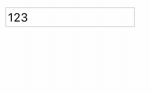

**`clearData()` 方法**

`clearData()`方法用于从剪贴板中删除数据，它接受一个参数，即要取得的数据的格式。

在 Internet Explorer 中，有两种数据格式：text 和 URL。在其他浏览器中，这个参数是 1 种 MIME 类型。不过，可以用 text 表示。

> 注：在 Internet Explorer 浏览器中，该方法在成功将文本放到剪贴板中后，返回 true，否则返回 false。而其他浏览器该方法的返回值为 undefined。在 paste 事件中，chrome 浏览器和 Internet Explorer 浏览器可以正常使用`setData()`方法，而 firefox 浏览器会报错。

示例如下：

```html
<body>
  <input id="test" value="123" />
  <script>
    test.oncopy = function (e) {
      e = e || event;
      var clipboardData = e.clipboardData || window.clipboardData;
      test.value = clipboardData.clearData('text');
      return false;
    };
  </script>
</body>
```

效果：对文本框中的内容进行复制时，文本框中的内容会变为 undefined


### 3. 实际应用

**1. 屏蔽剪贴板**

通过阻止默认行为来屏蔽剪贴板。对于一些受保护的文档来说是一种选择，示例代码如下：

```html
<body>
  <input value="text" />
  <button id="test">屏蔽剪贴板</button>
  <script>
    test.onclick = function () {
      document.oncopy =
        document.oncut =
        document.onpaste =
          function (e) {
            e = e || event;
            alert('该文档不允许复制剪贴操作，谢谢配合');
            return false;
          };
    };
  </script>
</body>
```

效果如下：


**2. 过滤字符**

如果确保粘贴到文本框中的文本中包含某些字符，或者符合某种形式时，可以使用剪贴板事件。比如只允许粘贴数字。

```html
<body>
  <p>123hello</p>
  <p>45678</p>
  <input id="test" />
  <script>
    test.onpaste = function (e) {
      e = e || event;
      var clipboardData = e.clipboardData || window.clipboardData;
      if (!/^\d+$/.test(clipboardData.getData('text'))) {
        return false;
      }
    };
  </script>
</body>
```

效果：只允许粘贴数字。

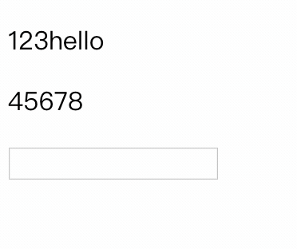

## 七、一些 event 的记录

- `contextmenu `
  - contextmenu 事件会在用户尝试打开上下文菜单时被触发。该事件通常在鼠标点击右键或者按下键盘上的菜单键时被触发，如果使用菜单键，该上下文菜单会被展示 到所聚焦元素的左下角，但是如果该元素是一棵 DOM 树的话，上下文菜单便会展示在当前这一行的左下角.
  - 通过取消默认行为可以自定义右键操作
