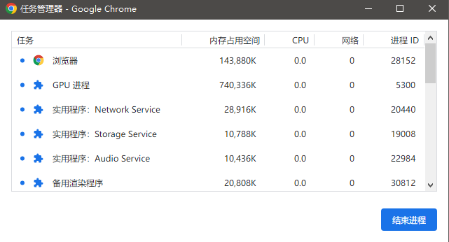

## 一、线程与进程

### 1. 进程

- 程序的一次执行, 它占有一片独有的内存空间

- 可以通过windows任务管理器查看进程

- 浏览器是多进程运行的

  
  
  - 其中最主要的进程有：
    - 浏览器进程----主要负责界面显示、**用户交互**、子进程管理等，浏览器进程内部会启动多个线程处理不同的任务
    - 网络进程----负责加载网络资源，网络进程内部会启动多个线程来处理不同的网络任务
    - 渲染进程----渲染进程启动后，会开启一个**渲染主线程**，主线程负责执行HTML、CSS、JS代码。默认情况下，浏览器会为每个标签页开启一个新的渲染进程，以保证不同的标签页之间不互相影响。

### 2. 线程:

- 是进程内的一个独立执行单元
- 是程序执行的一个完整流程
- 是CPU的最小的调度单元

### 3. 关系

- 一个进程至少有一个线程(主)
- 程序是在某个进程中的某个线程执行的

## 二、浏览器内核模块组成

### 1. 主线程（渲染）

- js引擎模块 : 负责js程序的编译与运行
- html,css文档解析模块 : 负责页面文本的解析（读取划分页面文本）
- DOM/CSS模块 : 负责dom/css在内存中的相关处理 （将划分好的创建对象）
- 布局和渲染模块 : 负责页面的布局和效果的绘制(内存中的对象)

::: tip 

因为要处理的问题很多，所以主线程必须要根据某种方法进行任务调度

:::

### 2. 分线程（浏览器执行，不一定在同一进程中）

- 定时器模块 : 负责定时器的管理
- DOM事件模块 : 负责事件的管理
- 网络请求模块 : 负责Ajax请求

## 三、js线程
- js是单线程执行的(回调函数也是在主线程)
- H5提出了实现多线程的方案: Web Workers
- 只能在主线程更新界面

## 四、定时器问题
- 定时器并不能真正完全定时执行(回调代码要在所有初始化代码执行完之后才会执行)
- 如果在主线程执行了一个长时间的操作, 可能导致延时才处理
  
## 五、事件处理机制

### 1. 代码分类

- 初始化执行代码: 包含绑定dom事件监听, 设置定时器, 发送ajax请求的代码
- 回调执行代码: 处理回调逻辑

### 2. js引擎执行代码基本流程

- 初始化代码===>回调代码(异步执行)

### 3. 模型的2个重要组成部分

- 事件管理模块
- 消息队列

### 4. 模型的运转流程

- 执行初始化代码, 将某些任务由管理模块交给对应的线程执行，主线程自身立即结束任务的执行，转而执行后续代码。
- 当其他线程完成时, 管理模块会将先前传递的回调函数及其数据包装成任务，加入到消息队列的末尾排队，等待主线程的调度执行。

::: tip 

上述内容为JS的异步模式

:::


- 在最开始的时候，渲染主线程会进入一个无限循环
- 每次循环会检查消息队列中是否有任务存在，如果有，就取出第一个任务执行，执行完后进入下一次循环；如果没有，则进入休眠状态。
- 其他所有线程（包括其他进程的线程）可以随时向消息队列添加任务。新任务会加到消息队列的末尾。在添加新任务时，如果主线程是休眠状态，则会将其唤醒以继续循环拿取任务。

::: tip 

上述内容为事件循环的处理机制

:::

### 5. 任务存在优先级么？

任务本身没有优先级，在消息队列先进先出，但是**消息队列是有优先级**的

> 随着浏览器的复杂度急剧提升,W3C不再使用宏队列的说法

如今认为:

- 每个任务都有一个任务类型,同一个类型的任务必须在同一队列,不同类型的任务可以分属不同的队列.在一次事件循环中,浏览器可以根据实际情况从不同的队列中取出执行任务.
- 浏览器必须准备好一个微队列,微队列的任务优先所有其他任务执行。

在目前chrome的实现中,主要的**队列优先级由高到低**:

- 微队列(vip最高优先级)---交互队列(高优先级)----(网络队列、延时队列)(中优先级)

- 网络队列与延时队列的执行顺序上，chrome测试为：第一次的网络请求优先执行,然后按顺序执行所有的延时队列,接着再执行剩余的网络任务。

  

测试代码：
```js
//死循环2s
function delay(duration) {
    const start = Date.now();
    while(Date.now() - start < duration){}
}

//添加延时队列任务
function addDelay(id) {
    console.log('添加延时队列'+id);
    setTimeout(() => {
        console.log('延时队列执行'+id);
    }, 100);
    delay(2000);
}

//添加网络队列任务
function addNetWork(id) {
    console.log('添加网络队列'+id);
    fetch('https://jsonplaceholder.typicode.com/todos/1',{method: 'get'}).then(()=>{
        console.log('网络队列执行'+id);
    });
    delay(2000);
}

//添加交互队列任务
function addInteraction() {
    console.log('添加交互队列1');
    const interaction = document.getElementById('interaction');
    interaction.onclick = ()=>{
        console.log('交互队列执行1');
    };
    delay(2000);
}
function addInteraction2() {
    console.log('添加交互队列2');
    const interaction2 = document.getElementById('interaction2');
    interaction2.onclick = ()=>{
        console.log('交互队列执行2');
    };
    delay(2000);
}
function addInteraction3() {
    console.log('添加交互队列3');
    const interaction2 = document.getElementById('interaction3');
    interaction3.onclick = ()=>{
        console.log('交互队列执行3');
    };
    delay(2000);
}

const begin = document.getElementById('begin');
begin.onclick = ()=>{
    addDelay(1);
    addDelay(2);
    addDelay(3);
    addDelay(4);
    addDelay(5);
    addNetWork(1);
    addNetWork(2);
    addNetWork(3);
    addNetWork(4);
    addNetWork(5);
    // addInteraction();
    // addInteraction2();
    // addInteraction3();
    console.log('===========');
}
```

## 六、H5 Web Workers

- 可以让一个js模块在分线程执行

  

- Worker（主线程）
  ```js
  var worker = new Worker('worker.js');
  //用来监听另一个线程发送过来的数据
  worker.onMessage = function(event){event.data} 
  //向另一个线程发送数据
  worker.postMessage(data1) 
  ```
  
- js模块（分线程）
  
  ```js
  //自定义函数
  function fibonacci(n) {
      return n<=2 ? 1 : fibonacci(n-1) + fibonacci(n-2)  //递归调用
  }
  
  console.log(this)//全局对象不再是window
  
  this.onmessage = function (event) {
      var number = event.data
      console.log('分线程接收到主线程发送的数据: '+number)
      //计算
      var result = fibonacci(number)
      postMessage(result)
      console.log('分线程向主线程返回数据: '+result)
      // alert(result)  alert是window的方法, 在分线程不能调用
  }
  ```
  
  - 分线程中的全局对象不再是window, 所以在分线程中不可能更新界面
  
- 问题:
  
  - worker内代码不能操作DOM更新UI
  - 不是每个浏览器都支持这个新特性
- 不能跨域加载JS
  
- svn版本控制

- svn server