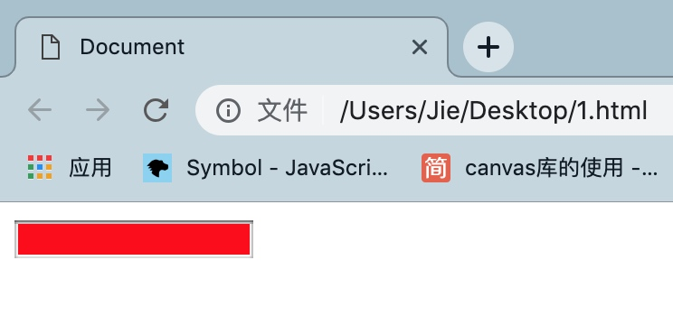
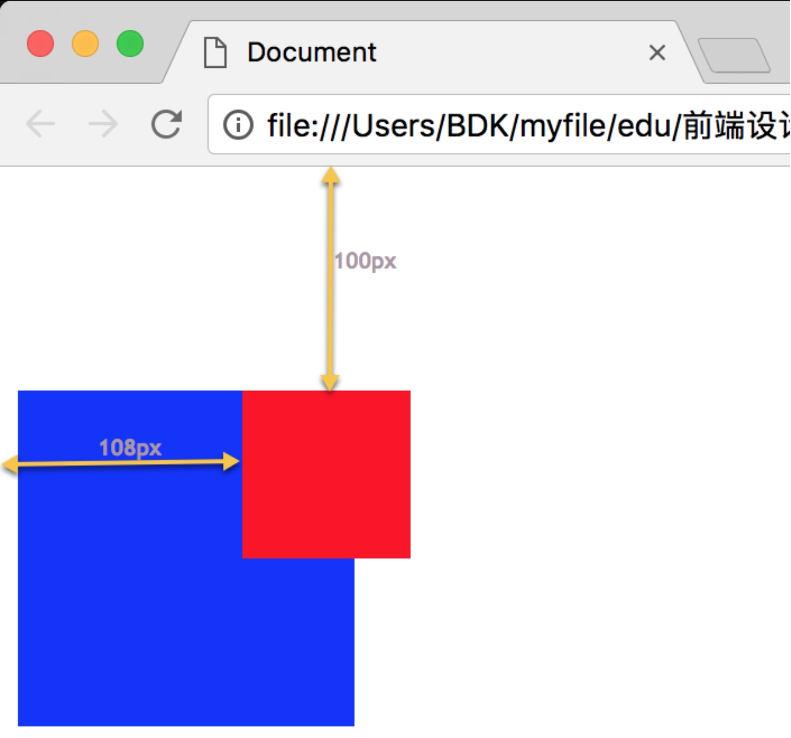
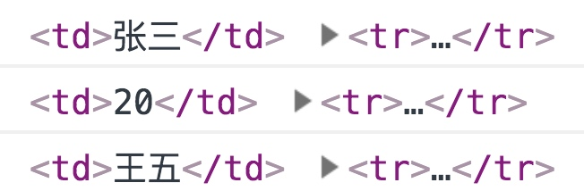
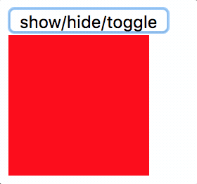
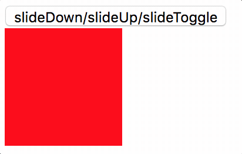
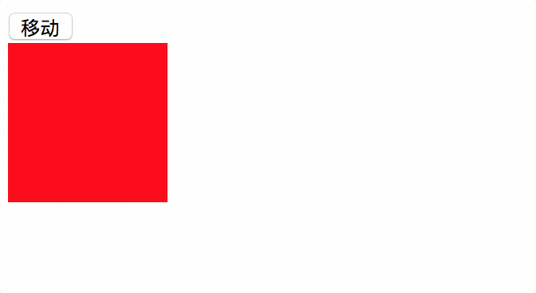
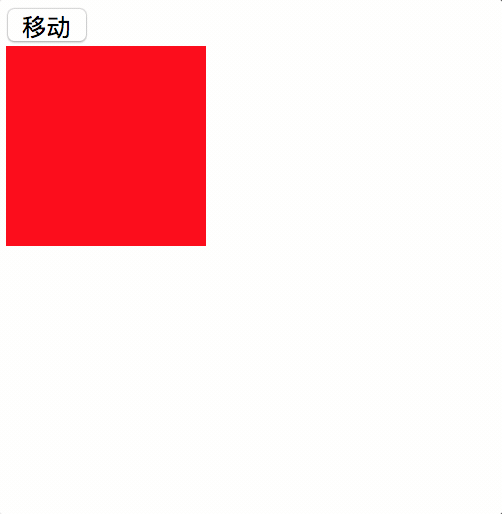
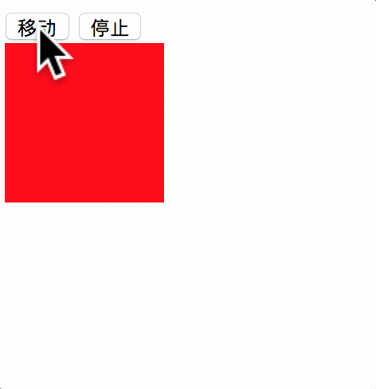
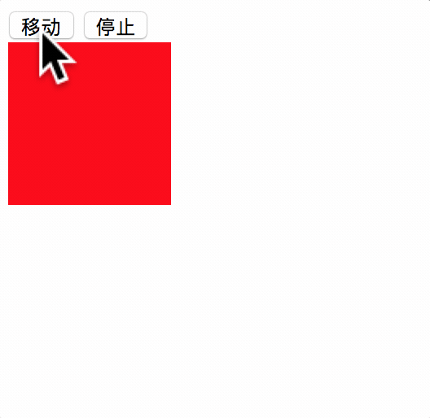
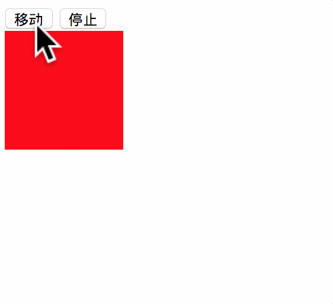

## 一、jQuery 简介

这章我们将来学习什么是 jQuery 以及它的用法。这部分内容涉及到大量 API 的使用。所以，只要掌握了如何查阅和调用这些方法，就基本掌握了这个库的使用。接下来将从以下几个方面来学习它们：

- jQuery 的核心方法
- jQuery 选择器
- jQuery 的筛选方法
- jQuery 中操作属性的方法
- jQuery 中操作CSS的方法
- jQuery 的文档处理方法
- jQuery 的事件处理
- jQuery 动画
- jQuery 的链式操作
- jQuery 性能优化
- jQuery 的 Ajax 方法

### 1. 什么是 jQuery

jQuery 不是用来替代原生 JS 的，它只是在原生 JS 的基础上进行了一层封装。目的是简化 JS 的开发，提高开发效率。

从它的 API 文档可以看到，它提供了大量的 API 方法供我们使用：选择器、属性操作、CSS、文档处理、时间、动画、Ajax 等等。这些方法实际上都是为了简化原生 JS 的代码而出现的。

比如，我想通过 JS 把一个列表中所有文本的字体颜色都设置为红色，原生 JS 的代码应该这样写：

```html
<ul>
    <li>选择器</li>
    <li>筛选</li>
    <li>属性</li>
    <li>CSS</li>
</ul>
<script>
    let lis = document.getElementsByTagName("li");
    for(let i = 0;i < lis.length;i++){
        lis[i].style.color = "red";
    }
</script>
```

如果是 jQuery 呢：

```html
<script>
    $("li").css("color","red");
</script>
```

是不是很简单！对，这就是 jQuery，简化一切。

### 2. jQuery 的特点

刚才我们了解了什么是 jQuery，也看到一个简单的 jQuery 的应用，下面我们来看看 jQuery 有什么特点。

- 轻量
- 强大的选择器
- 出色的 DOM 操作的封装
- 可靠的事件处理机制
- 完善的 Ajax
- 解决绝大部分兼容性问题
- 链式操作
- 丰富的插件
- 完善的文档
- 开源

这些都是 jQuery 库的优点。不过总结下来就 2 个重要的特点：

- 轻量，开发起来更为简洁方便，提高编码效率。
- 兼容性，能够解决绝大部分浏览器的兼容性问题。

### 3. jQuery 的版本

目前最新版本为 3.X。不过 1.X 版本的仍然还有在使用。这是因为 1.X 版本仍然还能兼容 IE 8 及以下的浏览器。从 2.X 版本后，IE 8 及以下的浏览器就不再受到支持。如果还要考虑老的浏览器，可以使用 1.X 版本的，它目前已经停止更新，最后一个版本是 1.12.4。后续的课程中主要使用的还是 1.X 版本的，他们的核心库及常用的方法没有什么太大的区别。

## 二、jQuery 核心方法

关于 jQuery 的核心方法可以参看 API 文档。这里主要讲讲其中比较关键的一些方法。

### 1. jQuery 方法

首先我们来看看 jQuery 的最核心方法：`jQuery()`

这个方法能够构建一个 jQuery 对象。你记住，要想调用 jQuery 的各种方法，首先需要得到一个 jQuery 对象。它还有个别名：`$()`

二者是等价的，一般情况下，我们都会使用更加简便的符号，只有当被其他库占用时，才会使用它的全名`jQuery()`。

这个核心方法的参数有很多：

```js
// 通过选择器获取
$("#id")
// 标签对象转换为 jQuery 对象
$(document.body)
// 将数组对象转换为 jQuery 对象
$([1,2,3])
// 将html标签转换为 jQuery 对象
$("<p></p>")
// $(document).ready()的缩写形式，表示当 DOM 文档加载完毕时执行回调
$(function(){})
```

由此可见，构建 jQuery 对象方式多种多样。那么之前我们用到的 JS 原生对象都能转换为 jQuery 对象，从而使用它的各种方法来实现效果。

既然原生对象能够转换为 jQuery 对象，那么一个 jQuery 对象又能否转换为 JS 对象呢？比如下面这个例子：

```js
$("#root").html("<h1>根元素</h1>");
```

这是通过 id 选择器获取的 jQuery 对象，然后利用 html 方法将一个 h1 标签增加到 id 为 root 的标签中。那如果我不想用 jQuery 的 html 方法，而是想用原生 DOM 的 innerHTML 来实现呢？

```js
$("#root).get(0).innerHTML = "<h1>根元素</h1>";
```

这个 get 方法就是将 jQuery 对象转换为原生对象，其中的 0 表示下标。因为通过选择器可能获取多个元素。

还有种更简便的方法转换：

```js
$("#root)[0].innerHTML = "<h1>根元素</h1>";
```

### 2. each 方法

这是循环 jQuery 对象的方法。

```js
$("#root > p").each(function(i){
    console.log($(this),i);
});
```

each 和循环数组的 forEach 类似，其中的 this 表示每次遍历出来的对象。注意，该对象是原生对象而不是 jQuery 对象。如果想调用 jQuery 的方法，需要在它外面包裹一个`$()`。
回调函数中还有个参数，它是下标值。

这个 each 方法不能循环 JS 中的数组，如果想要循环数组需要先将它转换为 jQuery 对象，比如：

```js
let ary = [1,2,3];
$(ary).each(function(){
    console.log(this);
});
```

### 3. document.ready 方法

在 jQuery 里面，我们可以看到两种写法：

```js
$(document).ready(function(){})
```

以及

```js
$(function(){})
```

这两个方法的效果都是一样的，后面的写法是前面写法的一种简写。它们都是在 DOM 文档树加载完之后执行一个函数

>注：这里面的文档树加载完不代表全部文件加载完。

在我们原生的 JavaScript 中，会经常使用 `window.onload` 方法。该方法是在 DOM 文档树加载完和**所有文件（例如图片文件加载）**加载完之后执行一个函数。

所以说，`$(document).ready`要比 `window.onload` 方法先执行。举个例子：如果一个页面中含有大量的图片，那么 `window.onload` 方法会等待所有图片加载完成以后才执行，而`$(document).ready`则是在图片节点创建好之后就会执行。

### 4. extend 方法

关于 extend 方法大致有 3 种用法，总结如下：

（ 1 ）`$.extend({})`，用于为 jQuery 类添加方法，可以理解为扩展静态方法。示例如下：

```js
$.extend({
    max : function(a,b){
        return a > b ? a : b;
    },
    min : function(a,b){
        return a < b ? a : b;
    }
});
console.log($.max(3,5)); // 5
console.log($.min(3,5)); // 3
```

（ 2 ）`$.fn.extend({})`插件，对 jQuery.prototype 进行扩展，提到插件那么就得说一下另一种方法`$.fn.method = function(){}`。示例如下：

- `$.fn.method = function(){}`用于给 jQuery 对象扩展一个方法。

```html
<body>
    <input type="text">
    <script src="./jquery-1.12.4.min.js"></script>
    <script>
        // 扩展一个方法
        $.fn.toColor = function (color) {
            $(this).css('background', color);
        }
        // 在 jQuery 实例对象上面使用
        $('input').toColor('red');
    </script>
</body>
```

效果：



- `$.fn.extend({})`用于为 jQuery 对象扩展多个方法。

```html
<body>
    <input type="text">
    <script src="./jquery-1.12.4.min.js"></script>
    <script>
        // 扩展多个方法
        $.fn.extend({
            toColor: function (color) {
                $(this).css('background', color);
            },
            toWidth: function (width) {
                $(this).css('width', width);
            }
        });
        // 在 jQuery 实例对象上面使用
        $('input').toColor('red');
        $('input').toWidth('200px');
    </script>
</body>
```

效果：


>注：`jQuery.fn.extend` 等价于 `jQuery.prototype.extend`

（ 3 ）继承。进行浅拷贝与深拷贝。

- 浅拷贝。`$.extend(a,b)`表示 a 使用 b 的属性。 

```js
let a = {};
let b = {
    name : 'xiejie',
    age : 18,
    wife : {
        name : 'yajing',
        age : 20
    }
};
$.extend(a,b); // 进行浅拷贝
console.log(a.name); // xiejie
console.log(a.age); // 18
console.log(a.wife.name); // yajing
a.wife.name = 'song ya jing'; // 因为是浅拷贝，所以 b 对象的值也会被改变
console.log(b.wife.name); // song ya jing
```

- 深拷贝。`$.extend(true,a,b)`，在最前面传入参数 true 即可。

```js
let a = {};
let b = {
    name : 'xiejie',
    age : 18,
    wife : {
        name : 'yajing',
        age : 20
    }
};
$.extend(true,a,b); // 进行深拷贝
console.log(a.name); // xiejie
console.log(a.age); // 18
console.log(a.wife.name); // yajing
a.wife.name = 'song ya jing'; // 因为是深拷贝，所以 b 对象的值不会被改变
console.log(b.wife.name); // yajing
```

值得一提的是，在使用`$.extend()`方法进行对象拷贝时，无论后面有多少个对象，都将成为第一个对象的属性。示例如下：

```js
let a = {};
let b = { name : 'xiejie' };
let c = { age : 18 };
$.extend(a,b,c); 
console.log(a.name); // xiejie
console.log(a.age); // 18
```

### 5. 其他常用属性和方法

- `length` - 获取 jQuery 对象的长度。
- `size()` - 获取 jQuery 对象的长度。
- `index()` - 搜索指定元素在 jQuery 对象中的下标值。

更多的方法请参看 API 文档。

## 三、jQuery 选择器

关于 jQuery 中可用的选择器可以参看 API 文档。这里主要讲讲其中比较常用的一些方法。

从文档中可以看出，绝大部分的选择器和 CSS 的选择器是相同的。因此只要你有 CSS 的基础，jQuery 的选择器学起来应该说非常容易。

下面列举一些 jQuery 特有的选择器：

- `:first`
- `:last`
- `:even`
- `:odd`
- `:eq`
- `:gt`
- `:lt`
- `:header`
- `:animated`
- `:contains(text)`
- `:has(selector)`
- `:parent`
- `:hidden`
- `:visible`
- `:input`
- `:text`
- `:password`
- `:radio`
- `:checkbox`
- `:submit`
- `:image`
- `:reset`
- `:button`
- `:file`
- `:hidden`
- `:selected`

大家可以通过查阅 API 文档来了解这些选择器的用法。

## 四、jQuery 的筛选方法

在前面一节中我们学习了如何通过选择器来创建或获取 jQuery 对象。但是，假如现在我已经有一个 jQuery 对象了，然后需要获取它的子节点怎么办呢？筛选方法为我们提供了解决方案。

下面我们来看看比较常用的筛选方法：

- `eq()`
- `first()`
- `last()`
- `hasClass()`
- `filter()`
- `is()`
- `map()`
- `has()`
- `not()`
- `slice()`
- `children()`
- `find()`
- `next()`
- `nextAll()`
- `nextUntil()`
- `parent()`
- `parents()`
- `parentsUntil()`
- `prev()`
- `prevAll()`
- `prevUntil()`
- `siblings()`
- `contents()`
- `end()`

下面看个例子：

```js
let elements = $("p");
console.log(elements.eq(0));
```

其中 elements 是通过元素选择器获取的 jQuery 对象，其中可能包含多个 p 元素节点。接下来我用 eq 方法可以获取其中的某一个节点对象，eq 方法中的数字代表着下标值，就像访问数组一样。

这个还要注意一点，eq 方法和 get 方法的区别：

```js
console.log(elements.eq(0));
console.log(elements.get(0));
```

==二者的不同就是 eq 得到的是 jQuery 对象，而 get 得到的是 JS 对象。==

这些筛选方法基本都是这样使用，而且通过筛选方法得到的都是 jQuery 对象。具体的用法大家可以参考 API 文档。

其中 end 方法涉及到链式操作的相关知识，关于这部分内容在后面的章节中会详解。

## 五、jQuery 中操作属性的方法

这节课咱们来看看 jQuery 中对属性的一些操作方法，下面是 jQuery 提供的属性方法：

- attr
- removeAttr
- prop
- removeProp
- addClass
- removeClass
- toggleClass
- html
- text
- val

这些方法都很常用。比如访问和设置属性的 attr，访问和设置特殊属性的 prop，增加 class 属性的 addClass，删除 class 属性的 removeClass，切换 class 属性的 toggleClass，获取和设置标签之间内容的 html，获取设置标签之间文本的 text，访问和设置 value 属性的 val。

我们先来看看 attr 的用法，如果是获取属性，可以用一个参数代表要获取的属性名：

```js
$("a").attr("href");
```

如果要设置属性，可以这样：

```js
$("a").attr("title","百度");
```

如果设置多个属性，可以用 JSON 对象：

```js
$("a").attr({href:"https://www.baidu.com",title:"百度"});
```


removeAttr 的参数只有 1 个，就是要删除的属性名：

```js
$("a").removeAttr("title");
```

attr 和 prop 的用法完全一样，它们的区别在于 attr 是针对普通属性。prop 是针对特殊属性。大多数属性都是普通属性，比如 id、name、title、alt 等等。而特殊属性的值只有 true 和 false，如果直接将它们写在标签上，只需要写一个属性名即可，比如：

```js
<input type="text" disabled >
<input type="checkbox" checked >
```


类似这样的特殊有：

- autofocus
- readonly
- disabled
- multiple
- checked
- selected

prop 就专为对这些属性进行访问和设置的，示例如下：

```js
$(":checkbox").prop("checked"); //获取复选框的选中状态
$("options:selected").prop("selected",false); //取消所有选中的option
```

html、text、val 是非常重用的 3 个方法，原生 JS 有 3 个和它们对应，分别是 innerHTML、innerText、value。

```js
let root = document.getElementById("root");
root.innerHTML = "<p></p>";
$("#root").html("<p></p>");

root.firstChild.innerText = "添加元素";
$("#root>p").text("添加元素");

let phone = document.getElementById("phone");
phone.value = "默认值";
$("#phone").val("默认值");
```

方法的更多具体细节请参看 API 文档。

## 六、jQuery 中操作 CSS 的方法

jQuery 提供了专门操作 CSS 的一些方法：

- css
- offset
- position
- scrollTop
- scrollLeft
- height
- width
- innerHeight
- innerWidth
- outerHeight
- outerWidth

其中最常用的是 css，它既可以获取呈现在页面上的最终样式。又可以设置内嵌样式，使用它就相当于设置样式时用了 `style` 属性，获取时用了`getComputedStyle`。

获取样式：

```js
$("#root").css("color");
```


设置单个样式：

```js
$("#root").css("color","red");
```

设置多个样式：

```js
$("#root").css({
    color: "red",
    fontSize: 20,
    width: 100,
    height: 100,
    border: "1px solid red"
});
```


多个样式可以使用 JSON 对象。注意，如果设置的属性有多个单词构成，需要使用驼峰命名法。

### offset 和 position

这 2 个方法都是获取节点的位置，返回的是一个 JSON 对象，包括 left 和 top 属性。其中 offset 表示获取指定节点相对于视口的位置。这个视口是指当前页面的可见区域。

```html
<body>
    <div style="width:150px;height:150px;background:blue;">
        <div id="sub" style="width:75px;height:75px;background:red;margin:100px"></div>
    </div>

    <script src="https://cdn.bootcss.com/jquery/3.3.1/jquery.min.js"></script>
    <script>
        console.log($("#sub").position());
    </script>
</body>
```

效果：



position 是获取相对于父元素的偏移位置。

```html
<body>
    <div style="width:150px;height:150px;background:blue;position:relative;left:100px;top:100px;">
        <div id="sub" style="width:75px;height:75px;background:red;position:relative;left:50px;top:50px;"></div>
    </div>

    <script src="https://cdn.bootcss.com/jquery/3.3.1/jquery.min.js"></script>
    <script>
        console.log($("#sub").position());
    </script>
</body>
```

效果：



不过要注意的是，子元素会去找离它最近的已经定位的父元素来计算偏移。如果没有设置父元素的定位属性，那么最终会找到根元素。因此，一般来说，通过它获取的偏移需要将父元素及子元素都设置定位属性。

方法的更多具体细节请参看 API 文档。

## 七、jQuery 的文档处理方法

在 DOM 规范中，节点的操作往往涉及到大量的方法。比如创建节点、增加节点、修改节点、删除节点等等。代码写起来比较繁琐，比如往一个 div 节点中添加 1 个 h1 和 p 元素，需要这样写：

```js
let root = document.getElementById("root");
// 添加标题元素
let h1 = document.createElement("h1");
let titleText = document.createTextNode("标题");
h1.appendChild(titleText);
root.appendChild(h1);

// 添加p元素
let p = document.createElement("p");
let pText = document.createTextNode("文本段落");
p.appendChild(pText);
root.appendChild(p);
```

有了 innerHTML，可以简化许多：

```js
let root = document.getElementById("root");
root.innerHTML = "<h1>标题</h1><p>文本段落</p>";
```

但是 innerHTML 与节点操作的方法本质上是不一样的。innerHTML 实质上是将指定的内容替换原来的内容，这个指定内容是用字符串构成。如果想要追加内容到原来的内容之后，可以用字符串拼接的方式。但是，如果想往原来内容的中间添加，这个操作也会比较麻烦，会涉及到复杂的字符串操作。

jQuery 中提供了大量的方法来简化节点的操作，比如刚才的代码可写成这样：

```js
$("#root").append("<h1>标题</h1><p>文本段落</p>");
```

感觉和 innerHTML 差不多，但是它并不是节点的替换，而是追加。

jQuery 提供了大量这种方法来实现文档操作：

- append
- appendTo
- prepend
- prependTo
- after
- before
- insertAfter
- insertBefore
- wrap
- unwrap
- wrapAll
- warpInner
- replaceWith
- replaceAll
- empty
- remove
- detach
- clone

这些方法大概可分为这几类：

### 1. 增加节点

方法有：

- append - 追加一个子节点到最后
- appendTo - 追加一个子节点到最后
- prepend - 追加一个子节点到最前
- prependTo - 追加一个子节点到最前
- after - 增加一个节点到指定节点之后
- before - 增加一个节点到指定节点之前
- insertAfter - 增加一个节点到指定节点之后
- insertBefore - 增加一个节点到指定节点之前

这里有 8 个方法，但是其中每种情况都有两个一样效果的方法。这是 jQuery 为两种不同编写风格提供的。比如 append 方法，它要求被添加的节点在前，添加的节点在后，比如：

```js
$("#root").append("<h1>标题</h1>");
```

其中 root 就是被添加的节点，也可理解成父节点。`<h1>标题</h1>`就是添加的节点。如果用 appendTo 呢？如：

```js
$("<h1>标题</h1>").appendTo("#root");
```

两种方法实现的效果一样，只是写法上有所不同，你可以根据自己的习惯进行选择。其余的方法大抵如此。

### 2. 替换节点

- replaceWith
- replaceAll

二者效果一样，replaceWith 表示被修改的节点在前，修改的节点在后。replaceAll 则相反。

```js
$("#root h1").replaceWith("<h3>标题</h3>");
$("<h3>标题</h3>").replaceAll("#root h1");
```

### 3. 删除节点

- empty
- remove
- detach

empty 表示清空指定节点中的所有内容，但指定的节点本身不会删除。

```js
$("#root").empty();
```

remove 表示包括节点本身也会被删除。remove 方法中可以选择器来指定删除某个元素。

```js
$("#root").remove();
$("#root").remove("p");
```

detach 和 remove 效果类似，但是 detach 实际上并没有把匹配的元素从 jQuery 对象中删除。其中所有的绑定事件、附加数据都会保留下来。

### 4. 包裹

- wrap
- wrapAll
- wrapInner
- unwrap

其中 wrap、wrapAll、wrapInner 都是在指定元素外部或内部包裹其他元素，unwrap 是取消包裹。这是 jQuery 特有的文档处理方法。

### 5. clone

克隆表示复制一个指定的元素。它有两个参数：

- 参数一：表示是否复制绑定在元素上的事件处理函数。true 为保留，false 为不保留。默认为 false。
- 参数二：指定深克隆或浅克隆。true 为深克隆，false 为浅克隆。默认为 false。

浅克隆表示只复制当前指定的元素，它内部的元素不会被复制。深克隆是指当前元素及内部的子元素都会复制。

方法的更多具体细节请参看 API 文档。

## 八、 jQuery 的事件处理

JS 中编写事件处理的方法有 3 种：

- 通过标签绑定
- DOM 0 级事件
- DOM 2 级事件

在标签上绑定事件的做法就不说了。DOM 0 级的事件处理方法最为常用，写起来也简单：

```js
let btn = document.getElementById("btn");
btn.onclick = function(){}
```

它的优点是新老版本的浏览器都支持。缺点是无法为同一个标签添加多个相同类型的事件处理方法。比如：

```js
btn.onclick = function(){
    console.log("event1");
}
btn.onclick = function(){
    console.log("event2");
}
```

当点击按钮后，只会执行最后一次绑定的事件处理方法。

DOM 2 级的事件能够解决这个问题：

```js
btn.addEventListener("click",function(){
    console.log("event1");
});
btn.addEventListener("click",function(){
    console.log("event12");
});
```

它的问题是兼容性。

jQuery 提供了大量处理事件的方法，这些方法既解决了兼容性问题，又能为一个标签添加多个同类型的事件处理方法。以下是较常用的方法：

- ready
- on
- off
- one
- delegate
- hover
- blur
- change
- click
- dblclick
- error
- focus
- focusin
- focusout
- keydown
- keyup
- mousedown
- mouseenter
- mouseleave
- mousemove
- mouseout
- mouseover
- mouseup
- resize
- scroll
- select
- submit
- unload

### 1. ready 方法

这个方法的作用是当 DOM 节点加载完成后执行，如：

```js
$(document).ready(function(){});
```

**ready 和 onload 的区别**

和 ready 类似的事件是 window.onload：

```js
window.onload = function(){}
```

二者的区别是 ready 只是在 DOM 加载完成（不包括图片、视频等媒体资源）后执行，onload 是指整个页面加载完成后执行。

### 2. on 和 off

on 方法集合了事件处理的所有功能，也就是说，用一个 on 就能完全应付任何事件处理的情况。off 是取消事件，但是要注意其中的回调函数必须和添加该事件时的回调函数相同（这里相同是指引用的同一个函数）。

```js
$("#btn").on("click",function(){});
let fn = function(){};
$(":text").on("focus",fn);
$(":text").off("focus",fn); // fn 引用的是同一个函数
```

on 也能做事件委托：

```html
<div id="list">
    <h1>title</h1>
    <p>first</p>
    <p>second</p>
    <p>third</p>
</div>
<script>
    $("#list").on("click","p",function(){
        console.log(this);
    });
</script>
```

将 p 元素上发生的点击事件都委托给它的父元素div来处理。

**on、one、bind、live、delegate 的区别**

这几个方法都可以实现事件处理。其中 on 集成了事件处理的所有功能，也是目前推荐使用的方法。

one 是指添加的是一次性事件，意味着只要触发一次该事件，相应的处理方法执行后就自动被删除。

bind 是较早版本的绑定事件的方法，现在已被 on 替代。

live 和 delegate 主要用来做事件委托。live 的版本较早，现在已被废弃。delegate 目前仍然可用，不过也可用 on 来替代它。

### 3. hover

它是将 mouseover 和 mouseout 集合到一起的方法：

```js
$("#root").hover(function(){},function(){});
```

其中有两个参数，都是回调函数。第一个回调等同于 mouseover，第二个回调等同于 mouseout。

### 4. 其他的事件处理方法

还有些诸如 mouseover、mouseout、click 等方法，实际上是事件处理的快捷方式：

```js
$("btn").click(function(){});
$(":text").focus(function(){});
```

但是这些方法并没有包含所有的类型，比如 input 事件就没有。

### 5. jQuery 中的 event 对象

jQuery 中的事件可以通过回调函数中的参数来获取。它的属性和方法大多数都和原生 JS 一样，当然也有不一样的。还有，用 jQuery 的 event 对象不需要考虑浏览器兼容性问题。下面列举一些较为常见的属性和方法：

- event.target - 最初触发实现的DOM元素
- event.currentTarget - 当前DOM元素
- event.pageX - 鼠标相对于文档的左边缘位置
- event.pageY - 鼠标相对于文档的上边缘位置
- event.type - 事件的类型
- event.which - 键盘按下的键值码
- event.preventDefault() - 阻止事件的默认行为
- event.stopPropagation() - 阻止事件冒泡

**target 和 currentTarget 的区别**

这两个属性在没有事件委托的情况下是没有区别的。如果是事件委托，则有所不同：

```html
<body>
    <table id="tb" border="1">
        <tr>
            <td>1</td>
            <td>张三</td>
            <td>20</td>
        </tr>
        <tr>
            <td>2</td>
            <td>王五</td>
            <td>21</td>
        </tr>
        <tr>
            <td>3</td>
            <td>李四</td>
            <td>22</td>
        </tr>
    </table>
    <script src="https://cdn.bootcss.com/jquery/3.3.1/jquery.min.js"></script>
    <script>
        $("#tb").on("click", "tr", function (e) {
            console.log(e.target, e.currentTarget);
        });
    </script>
</body>
```

结果：



从结果可以看出，target 获取的是我点击的当前标签。因为整个表格最底层的标签就是 td，所以我触发事件的标签就是 td 元素。而 currentTarget 获取的是冒泡阶段的当前元素。由于例子中我将 tr 作为冒泡元素，所以无论点击哪个 td 它最终都会冒泡到它的父元素 tr 上，而这个 tr 就是 currentTarget 指向的对象。

**event.which**

它会自动根据事件类型来获取键值码或字符码。
如果是 keydown 和 keyup 事件，它获取的是键值码。
如果是 keypress 事件，它获取的是字符码。

方法的更多具体细节请参看 API 文档。

## 九、实现动画的方法

jQuery 提供了很多实现动画效果的方法，比如：

- show
- hide
- toggle
- slideDown
- slideUp
- slideToggle
- fadeIn
- fadeOut
- fadeTo
- fadeToggle
- animate
- stop
- delay
- finish

### 1. show、hide、toggle

show 方法是将一个隐藏的元素，从小到大显示出来的效果。

hide 方法是将一个显示出来的元素，从大到小隐藏的效果。

toggle 方法是在显示和隐藏之间进行切换，效果就是从小到大或从大到小。

```js
$("#demo").show(500);
$("#demo").hide(500);
$("#demo").toggle(500);
```



第 1 个参数表示动画播放的事件。也可以用系统定义的三种值来表示："fast","normal","slow"。

第 2 个参数表示动画播放完成后执行的回调函数。

### 2. slideDown、slideUp、slideToggle

slideDown 方法是将一个隐藏的元素，从上到下显示出来的效果。

slideUp 方法是将一个显示出来的元素，从下到上隐藏的效果。

slideToggle 方法是在显示和隐藏之间进行切换，效果就是从上往下或从下往上。



参数和之前一样。

### 3. fadeIn、fadeOut、fadeTo、fadeToggle

fadeIn 方法是将一个隐藏的元素，淡入的效果。

fadeOut 方法是将一个显示出来的元素，淡出的效果。

fadeTo 方法是到达指定透明度的效果。

fadeToggle 方法是在显示和隐藏之间进行切换，效果淡入或淡出。


参数和之前一样。

### 4. animate

以上的方法实现了显示和隐藏的动画效果。不过，动画不仅限于显示或隐藏，比如节点的移动、放大缩小。这些动画效果可以用animate来实现。

animate 各种节点的动画效果，包括显示或隐藏，看看它的用法：

```js
$("#demo").animate({
    width:150,
    height:150,
    marginLeft:100
},500,function(){
    console.log("动画播放完毕");
});
```



animate有 3 个参数：

参数 1：指定动画完成后的最终值，可以同时有多个，它们的动画会同时进行。如果值的单位是 px，可以省略 px。

参数 2：动画持续的时长。

参数 3：动画完成后执行的回调。

>注意：参数 1 是一个 JSON 对象，其中的属性只能是以数字为值的样式，比如 width、height 等等。像 color、font-style 这类的样式是不能做动画的。

animate 本身是一个异步方法，也就是说，它不会阻塞后面代码的执行。但是，假如多个 animate 同时执行，会不会导致动画混乱呢？

关于这个问题，你不用担心。我们之前讲 JS 的异步操作时提到过，JS 的异步实际上是单线程非阻塞式的。也就是说，每个 animate 执行后，动画的执行都会放到队列中排队。当其他代码执行完后，才轮到队里中的动画执行，并且一次只会执行一个动画，其他动画都会排队等待。看这个例子：

```js
$("#demo").animate({
    width:150,
    height:150,
    marginLeft:100
},500);
$("#demo").animate({
    width:100,
    height:100,
    marginTop:100
},500);
```



例子中执行了两次 animate，并且作用在同一个标签上。从效果上可以看出，它们并没有同时执行，而是先执行了 div 放大到 150 像素，向右移动 100 像素的动画。然后再缩小到 100 像素，往下移动 100 像素。这就说明了多个动画会依次排队执行的情况。

### 5. 停止动画

jQuery 提供了 2 个方法实现停止动画：stop 和 finish。其中 stop 有 2 个参数，都是布尔值，又可以分 4 种情况。所以，停止动画实际上有 5 种情况：

**1.	finish**

停止动画，并清空队列，直接显示动画的最终状态。

效果：



**2.	stop(true,true)**

停止当前动画，清空队列，显示当前动画的最终状态。
注意它和 finish 的区别在于它只会来到当前动画的最终状态，finish 是来到所有动画的最终状态。

效果：


**3.	stop(true,false)**

停止当前动画，清空队列，不显示当前动画的最终状态。

效果：


**4.	stop(false,true)**

停止当前动画，不清空队列，显示当前动画的最终状态

效果：



**5.	stop(false,false)**

停止当前动画，不清空队列，不显示当前动画的最终状态

效果：



**delay**

用来在多个动画之间插入延迟时间：如

```js
$("#demo").animate({
    width:150,
    height:150,
    marginLeft:100
},1500,function(){
    console.log("动画播放完毕");
})
.delay(1000)
.animate({
    width:100,
    height:100,
    marginTop:100
},1500,function(){
    console.log("动画播放完毕");
});
```

>注意，该方法是将队列中的两次动画间加入延迟，可以用在 animate 以及前面介绍的那几个显示和隐藏的动画中。但它并不能完全代替 setTimeout。

方法的更多具体细节请参看 API 文档。

## 十、 jQuery 的 Ajax 方法

jQuery 提供很多 Ajax 的方法，方便我们使用 Ajax 请求服务器。比较常用的方法有：

- ajax
- load
- get
- post
- serialize
- serializeArray

### 1. ajax 方法

这是最常用的方法，所有的 ajax 请求都可以用它来实现。它的方法中有个参数，是一个 JSON 对象，用来对ajax的请求进行配置。

```js
$.ajax({
    url:"请求地址",
    type:"请求类型",
    async:布尔值|true:表示异步提交（默认）|false:表示同步提交,
    data:{传递给服务器的参数}|"键=值&键=值（这种形式封装）",
    success:function(data){
        // 服务器返回消息时调用，data是服务器返回的数据
    }
});
```

### 2. get 方法

只支持 get 请求的 ajax 方法，对上面方法的简化：

```js
$.get("url",{传递给服务器的参数},function(data){
    // 服务器返回的消息
}); 
```

### 3. post 方法

只支持 post 请求的 ajax 方法，对上面方法的简化：

```js
$.post("url",{传递给服务器的参数},function(data){
    // 服务器返回的消息
}); 
```

### 4. load 方法

这个方法的作用是向指定路径发送请求，并把返回的内容插入到指定的标签中：

```js
$("#root").load("url",{传递给服务器的参数},function(){
    // 插入完成后执行
});
```

这个方法可以用来加载其他子页面。

### 5. serialize 和 serializeArray 方法

它们可以将表单元素的值以键值对的形式组装起来，用来传递给服务器。

serialize 返回的是字符串形式的参数，serializeArray 返回的是 JSON 类型的对象，比如：

```html
<form id="fm" action="#">
    <label>手机号：</label><input type="text" name="phone">
    <label>密码：</label><input type="password" name="pwd">
    <label>邮箱：</label><input type="email" name="email">
    <input type="submit">
</form>
<script>
    $("#fm").on("submit",function(e){
        e.preventDefault();
        console.log($("#fm").serialize()); 
        console.log($("#fm").serializeArray());
    });
</script>
```

>注意：只有表单元素有 name 属性时，它的值才会被封装。

方法的更多具体细节请参看 API 文档。

## 十一、jQuery 的链式调用

首先我们来看看什么是链式操作。假如我要为一个标签添加 css 样式、设置属性、追加标签中的内容，之前我们可以这样做：

```js
// 添加样式
$("#root").css({
    width:100,
    height:100,
    background:"red"
});

// 添加属性
$("#root").attr("data-name","content");

// 追加内容
$("#root").html("<h1>标题</h1>");
```

这样的代码不够简洁，在 jQuery 中我们还可以这样写：

```js
.css({
    width: 100,
    height: 100,
    background: "red"
}).attr("data-name", "content")
.html("<h1>标题</h1>");
```

这是由于 jQuery 中的大多数方法都会返回当前操作的 jQuery 对象，因此我们可以不用每次都重新获取对象然后调用方法。这种写法就是链式操作，它的一大好处就是使代码更加简洁。同时也不用每次都获取 jQuery 对象，提高效率。

当然，这种做法在异步操作中也经常使用。比如 Promise 对象，你可以在每次 then 方法后继续调用 then 或者 catch，这样也能使得异步操作更为简洁，从而避免"回调地狱"的出现。

jQuery 筛选方法中有个叫做 end 的方法，从 API 中可以看到对它的描述：

**回到最近的一个"破坏性"操作之前。即，将匹配的元素列表变为前一次的状态。**

首先我们要搞清楚什么是"破坏性"操作。我们知道 jQuery 中很多方法都会返回当前 jQuery 对象，比如`css()`、`attr()`、`html()`等等。但是还有些方法并不会返回当前 jQuery 对象，而是获取筛选过后的 jQuery 对象，比如：

```js
$("#root").find("h1");
```

find 方法执行后返回的就不是 id 为 root 这个 jQuery 对象，而是它的子元素 h1。这就相当于破坏了之前的"链条"，而产生了一个新的"链条"。因此，这种方法就称为“破坏性”操作。这类拥有"破坏性"特性的方法有：

- add
- addSelf
- children
- filter
- find
- map
- next
- nextAll
- not
- parent
- parents
- prev
- prevAll
- siblings
- slice
- clone

end 方法可以回到最近一次性"破坏性"操作之前，比如：

```js
$("#root")
    .html("<h1>标题</h1>")
    .find("h1")
    .css("color", "red")
    .end()
    .append("<p>正文</p>");
```

当 find 调用后，操作的 jQuery 对象已经是 h1 了。但是在调用了 end 后，操作对象又回到了 root 元素。

因此，有了 end 后，链式操作可以更加灵活的使用。

## 十二、jQuery 性能优化

下面我们来看看有哪些方法可以提高 jQuery 代码的执行效率：

### 1. 总是从 ID 选择器开始继承

这就意味着通过选择器来获取节点时，尽量在前面加上 id 选择器。这是因为通过 id 选择器可以更快速的定位到目标，然后再从该目标往下找其他元素。比如：

```js
$("#root.title");
$("#root > p);
$("#root p")
```

### 2. 尽量在 class 前面加上元素名

这一条也是为了能够先缩小查询的范围，比如：

```js
$("h1.title");
$("p.list");
```

### 3. 尽量使用 id 选择器替代 class 选择器

由于相同 class 的标签会有多个，所以使用 class 选择器时会搜素整个文档，直到找到所有匹配的元素。但是 id 是唯一，当查到匹配的标签后就不会再继续搜寻。因此，如果要获取的标签在页面只有这一个，尽量选用 id 选择器来获取。

### 4. 在适当的时候选择链式操作

链式操作能够简化代码，而且也不会反复的获取相同的元素对象。如：

```js
 $("#root")
    .css("color", "red")
    .attr("data-name", "content")
    .html("<h1>标题</h1>");
```

适当的时候用是推荐的，但也不能盲目使用。

### 5. 将 jQuery 对象缓存起来使用，并在变量名前面加上$

这也是编码的一个技巧。因为每一次的 jQuery 方法调用，都会在页面上进行搜索，虽然时间很短，但性能上也会有所影响。如果在第一次获取时将它赋给一个变量缓存下来，后面再用它时就不会再次到页面上进行搜索。

```js
let $root = $("#root");
$root.css();
$root.html();
```

在变量前面加上`$`的原因是将缓存 jQuery 对象的变量和其他变量区分开来。

### 6. 限制直接操作 DOM 的次数

频繁的 DOM 操作对性能是极大的损耗，比如下面这段代码：

```js
let $root = $("#root");
for(let i = 1;i <= 50;i++){
    $root.append(`<p>第${i}项</p>`);
}
```

这段代码实现了将 50 个 p 元素加入到 id 为 root 的标签中。每次循环都用了 append 方法。这会导致 DOM 操作进行了 50 次，也就意味着页面会重新渲染 50 次。如果整个页面还有很多其他元素在，那么这个渲染过程是很耗时的。下面我换种做法：

```js
let $root = $("#root");
let str = "";
for(let i = 1;i <= 50;i++){
    str += `<p>第${i}项</p>`
}
$root.append(str);
```

这段代码在循环时并没有进行 DOM 操作，而是字符串进行累加。当循环结束后，再将该字符串通过 append 方法添加到页面上。效果和之前一样，但是这种做法只进行了一次 DOM 操作，性能提升是显而易见的。

因此，减少 DOM 操作的次数是编写 JS 代码应该尽可能考虑的。

### 7. JS 代码尽量推迟到 window.onload 事件中进行

首先，JS 代码应该尽可能的放在最后，因为不能让 JS 的运行阻塞了 DOM 的渲染。jQuery 中有个 ready 方法，它是当 DOM 渲染完成后执行，但此时页面可能并没有加载完成。为了保险起见，在 window.onload 中执行 JS，能保证页面的所有加载已经完成。这种做法还有一个好处是不会再出现全局命名空间被污染的情况。（意思是不会出现全局变量。）

### 8. 尽量使用事件委托机制

事件委托能够减少在子元素进行事件绑定，而是统一绑定在父元素身上。特别是像列表类的应用，而一个列表中包含的元素有很多的情况特别适用。因为你要求列表中所有元素都有相同的事件处理，但又不可能在所有子元素甚至孙元素上绑定事件，那么事件委托就是一个很好的解决方案。

### 9. 使用事件委托时用 delegate 或 on 来替代 live

live 方法是早前版本的事件委托方法，现在要尽可能用新版本的方法，减少 BUG 出现的几率。

### 10. 能使用子代选择器就不要使用后代选择器

严格意义上这不是 jQuery 的性能问题。子代选择器是">"，后代是" "。二者的区别是否只查找一级子元素。子代选择器只会查找一级，通俗点说就是只找“儿子”。后代选择器除了找“儿子”还要找“孙子”，甚至“重孙”等等。

其实也是尽量缩小查找的范围。当然，还是要根据具体业务具体分析。


