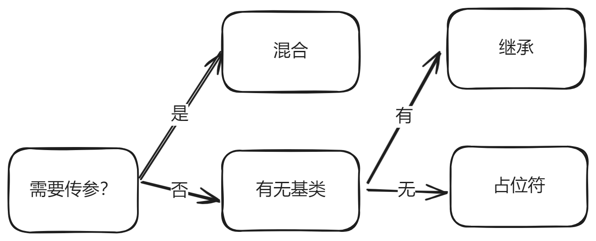

## 一、Sass 简介

Sass 又名 SCSS 是 CSS 预处理器之一，诞生于 2007 年,采用 Ruby 语言编写的一款 CSS 预处理语言。最初它是为了配合 HAML（一种缩进式 HTML 预编译器）而设计的，因此有着和 HTML 一样的缩进式风格。

Sass 和 SCSS 其实是同一种东西，我们平时都称之为 Sass，两者之间不同之处有以下两点：

1. 文件扩展名不同，Sass 是以“.sass”后缀为扩展名，而 SCSS 是以“.scss”后缀为扩展名
2. 语法书写方式不同，Sass 是以严格的 ==缩进式== 语法规则来书写，不带大括号 {} 和分号 ; ，而 SCSS 的语法书写和 CSS 语法书写方式类似。

---

## 二、Sass 与 CSS 写法的差异

由于 Sass 是基于 Ruby 写出来的所以沿用了 Ruby 的书写规范，不带有大括号 " {} "和分号" ; "

CSS 的写法：

```css
body {
  color: #fff;
  background: #f36;
}
```

Sass 的写法：

```sass
body
  color: #fff
  background: #f36
```

SCSS 的写法：

```scss
body {
  color: $white;
  background: $f36;
}
```

---

### 1. Sass 语法格式

这里说的 Sass 语法是 Sass 的最初语法格式，通过 tab 键控制缩进的一种语法规则，而且这种缩进要求非常严格。另外其不带有任何的分号和大括号。常常把这种格式称为 Sass 老版本，其文件名以“.sass”为扩展名。<br/> 假设我们有一段这样的 CSS 代码：

```css
body {
  font: 100% Helvetica, sans-serif;
  color: #333;
}
```

Sass 写法

```sass
$font-stack: Helvetica, sans-serif
$primary-color: #333
body
  font: 100% $font-stack
  color: $primary-color
```

==这种语法格式对于前端人员都不太容易接受，而且容易出错。==

### 2. SCSS 语法格式

SCSS 是 Sass 的新语法格式，从外形上来判断他和 CSS 长得几乎是一模一样，其文件名格式常常以“.scss”为扩展名。

上面那段代码用 SCSS 写法：

```scss
$font-stack: Helvetica, sans-serif;
$primary-color: #333;
body {
  font: 100% $font-stack;
  color: $primary-color;
}
```

使用 Sass 新的语法规则，而文件扩展名依旧使用的是“.sass”造成编译不出来。在此特别提醒： ==“.sass”的格式只能使用 Sass 老语法规则（缩进规则），“.scss”使用的是 Sass 的新语法规则，也就是 SCSS 语法规则（类似 CSS 语法格式）。==

---

## 三、前置知识

Sass 提供了一些调试语句，有：

- `@error`
- `@warn`
- `@debug`

### 1. `@error`

当编写带有参数的 mixin 或函数时，通常希望接收到正确的参数，如果调用时没有传递正确的参数，应该通知用户并且停止运行。

Sass 通过 `@error <expression>` 。它会在控制台输出表达式返回的值（通常是一个字符串），一旦打印出错误，Sass 就停止编译，并抛出错误信息。

```scss
@mixin text-align($align) {
  @if ($align != left or $align != center) {
    @error "调用 text-align 只能传递 left 或 center 值";
  }

  text-align: $align;
}

.div {
  // 传递一个不被允许的参数，会在控制台抛出错误信息
  @include text-align(right);
}
```

### 2. `@warn`

用法与 `@error` 相同，但与 `@error` 不同的是，它不会导致 Sass 停止编译，只是在控制台抛出警告信息。

### 3. `@debug`

通过 `@debug <expression>` 可以很方便地在控制台打印出表达式返回的值。

```scss
@debug '1 + 1 = #{1 + 1}'; // 1 + 1 = 2
```

### 4. 注释

sass 中的注释主要有以下两种：

1. `/**/`;
2. `//`

两者的区别在于`/**/`的写法会在编译出来的 CSS 中显示，而`//`则不会。

```scss
// 这个注释不会在css的编译结果中出现.

/* 这个注释会在除压缩模式外的css的编译结果中出现. */

/* 还可以包含一些插值:
 * 1 + 1 = #{1 + 1} */

/*! 这个注释任何情况下都会出现在css的编译结果中 */

p /* 多行注释可以写在任何允许
   * 空白输入的地方 */ .sans {
  font: Helvetica,
    // So can single-line commments.
    sans-serif;
}
```

### 5. 嵌套

#### 属性嵌套

```css
.box {
  border-top: 1px solid red;
  border-right: 2px solid yellow;
}
```

在 SASS 中的写法：

```scss
.box {
  border: {
    top: 1px solid red;
    right: 2px solid yellow;
  }
}
```

另外还有伪类嵌套和选择器嵌套，因容易出错，所以不做讲解。

## 四、变量

```scss
$变量名称: 变量值；;
```

### 1. 使用场合

变量的用于一般包括以下几种：

- 设置样式值

  ```scss
  $primary-color: #3498db;
  $font-size: 16px;

  body {
    color: $primary-color;
    font-size: $font-size;
  }
  ```

- 计算其他变量的值

  ```scss
  $base-spacing: 8px;
  $large-spacing: $base-spacing * 2;

  button {
    margin: $large-spacing;
  }
  ```

- 作为参数传递给函数和 mixins

  ```scss
  $base-padding: 10px;

  @mixin padding($direction) {
    padding-#{$direction}: $base-padding;
  }

  .container {
    @include padding(top);
  }
  ```

- 条件和循环语句中的使用

  ```scss
  $theme: light;

  @if $theme == light {
    $background-color: #fff;
  } @else {
    $background-color: #333;
  }

  body {
    background-color: $background-color;
  }
  ```

- 利用插值语法作为属性名或属性值的一部分

  ```scss
  $name: "btn";
  $top-or-bottom: top
  $left-or-right: left

  .icon-#{$name} {
      background-image: url("/icons/#{$name}.svg");
      position: absolute;
      #{$top-or-bottom}: 0;
      #{$left-or-right}: 0;
    }
  ```

> Sass 变量是命令式的，这意味着如果使用一个变量然后更改其值，之前的使用将保持不变。CSS 变量是声明式的，这意味着如果更改其值，它将影响之前的使用和之后的使用。

### 2. 默认变量

普通变量定义后可以在全局范围内使用:

```scss
$fontSize: 12px;
body {
  font-size: $fontSize;
}
```

默认变量仅需在值后面加上 !default:

```scss
$baseLineHeight: 1.5 !default;
body {
  line-height: $baseLineHeight;
}
```

sass 的默认变量一般是用来设置默认值，然后根据需求来覆盖的，覆盖的方式只需要在默认变量之前重新声明下变量即可。

```scss
// _library.scss
$black: #000 !default;
$border-radius: 0.25rem !default;
$box-shadow: 0 0.5rem 1rem rgba($black, 0.15) !default;

code {
  border-radius: $border-radius;
  box-shadow: $box-shadow;
}
```

```scss
// style.scss
@use 'library' with (
  $black: #222,
  $border-radius: 0.1rem
);
```

```css
code {
  border-radius: 0.1rem;
  box-shadow: 0 0.5rem 1rem rgba(34, 34, 34, 0.15);
}
```

### 3. 全局变量和局部变量

[变量的调用](http://www.imooc.com/code/6957)

```scss
$color: yellow !default; //定义全局变量
.div1 {
  color: $color; //调用全局变量
}
.div2 {
  $color: red; //定义局部变量
  p {
    color: $color; // //调用局部变量
  }
}
```

根据声明变量的位置，可以将变量分为全局变量和局部变量。如果需要在局部范围内（例如在 mixin 中）设置全局变量的值，则可以使用标志`!global`。标记为`!global`的变量声明将始终分配给全局范围。

```scss
$variable: first global value;

.content {
  $variable: second global value !global; // 此时设置的是全局变量的值
  value: $variable;
}

.sidebar {
  value: $variable;
}
```

编译结果

```css
.content {
  value: second global value;
}

.sidebar {
  value: second global value;
}
```

> 此`!global`标志只能用于设置已在文件顶层声明的变量。不能用于声明新变量。

**什么时候声明变量？**

建议创建变量只适用于感觉确有必要的情况下，不要为了某些骇客行为而声明新变量，基本上没有理由声明一个永远不需要更新或只在单一地方使用的变量。只有满足下述标准时方可创建新变量：

1. 该值至少重复出现了 2 次；
2. 该值至少可能被更新一次；
3. 该值所有的表现都与变量有关。

### 4. 插值

插值几乎可以在 Sass 样式表的任何地方使用，以将 SassScript 表达式的结果嵌入到 CSS 块中。只需`#{}`在以下任意位置包装表达式即可：

- 样式规则中的选择器
- 声明中的属性名称
- 自定义属性值
- CSS 规则
- @extends
- @import
- 带引号或不带引号的字符串
- 普通的 CSS 函数名称
- 注释`/* */`

```scss
@mixin corner-icon($name, $top-or-bottom, $left-or-right) {
  .icon-#{$name} {
    background-image: url('/icons/#{$name}.svg');
    position: absolute;
    #{$top-or-bottom}: 0;
    #{$left-or-right}: 0;
  }
}

@include corner-icon('mail', top, left);
```

编译结果

```css
.icon-mail {
  background-image: url('/icons/mail.svg');
  position: absolute;
  top: 0;
  left: 0;
}
```

插值返回不带引号的字符串

---

## 五、数据类型

Sass 支持多种值类型，其中大多数直接来自 CSS。每个表达式都会产生一个值，变量保存值。

### 1. [Number](https://sass.bootcss.com/documentation/values/numbers.html)

Sass 中的数字有两个组成部分：数字本身和它的单位。例如，在 `16px` 中，数字是 `16`，单位是 `px` 。数字可以没有单位，也可以有复杂的单位。如`12` 或`100px`。

```scss
$num1: 100; // 100
$num2: 0.8; // 0.8
$num3: 16px; // 16px
$num4: 5px * 2; // 10px
$num1: 5.2e3; // 5200
$num2: 6e-2; // 0.06
```

Sass 不区分整数和小数，所以例如 `5 / 2` 返回 `2.5` 而不是 `2` 。

### 2. [String](https://sass.bootcss.com/documentation/values/strings.html)

Sass 支持两种内部结构相同但呈现方式不同的字符串：带引号的字符串，如 `"Helvetica Neue"`，以及不带引号的字符串(也称为标识符)，如 `bold` 。

可以使用 `string.unquote()` 函数将带引号的字符串转换为不带引号的字符串，也可以使用 `string.quote()` 函数将不带引号的字符串转换为带引号的字符串。

```scss
@use 'sass:string';

@debug string.unquote('.widget:hover'); // .widget:hover
@debug string.quote(bold); // "bold"
```

不带引号的字符串就是写 CSS 标识符。它们可能包括任何地方的插值。

```scss
@debug bold; // bold
@debug -webkit-flex; // -webkit-flex
@debug --123; // --123

$prefix: ms;

@debug -#{$prefix}-flex; // -ms-flex
```

当然，并不是所有的标识符都被解析为不带引号的字符串:

- CSS 颜色名称被解析为 color 类型。
- `null` 被解析为 Sass 的 `null` 值。
- `true` 和 `false` 被解析为 boolean 类型。
- `not`, `and`, `or` 被解析为 boolean 操作符

正因为如此，除非您专门编写使用不带引号的字符串的 CSS 属性值，否则编写带引号的字符串通常是一个好主意。

Sass 有许多字符串函数，它们接受或返回数字作为索引，这些数字指的是字符串中的字符。

Sass 的字符串中第一个字符的索引为 `1`，不同于大多数语言索引从 `0` 开始。

`-1` 表示字符串中的最后一个字符，`-2` 表示倒数第二个字符，以此类推。

```scss
@use 'sass:string';

@debug string.index('Helvetica Neue', 'Helvetica'); // 1
@debug string.index('Helvetica Neue', 'Neue'); // 11
@debug string.slice('Roboto Mono', -4); // "Mono"
```

### 3. [Color](https://sass.bootcss.com/documentation/values/colors.html)

Sass 颜色可以写成：

- 十六进制代码， 比如 `#f2ece4`，或者包含透明值的 `#b37399aa`
- CSS 颜色名称， 比如 `midnightblue` , `transparent`
- 函数， 比如 `rgb()` 、 `rgba()` 、 `hsl()` 和 `hsla()` 。

```scss
@debug #f2ece4; // #f2ece4
@debug #b37399aa; // rgba(179, 115, 153, 67%)
@debug midnightblue; // #191970
@debug rgb(204, 102, 153); // #c69
@debug rgba(107, 113, 127, 0.8); // rgba(107, 113, 127, 0.8)
@debug hsl(228, 7%, 86%); // #dadbdf
@debug hsla(20, 20%, 85%, 0.7); // rgb(225, 215, 210, 0.7)
```

### 4. [List](https://sass.bootcss.com/documentation/values/lists.html)

列表包含其他值的序列。在 Sass 中，列表中的元素可以用逗号分隔，如 `Helvetica, Arial, sans-serif` ，或空格分隔，如 `10px 15px 0 0` ，但不能混合使用空格和逗号。

与大多数其他语言不同，Sass 中的列表不需要特殊的方括号，任何用空格或逗号分隔的表达式都可以算作一个列表。当然，也允许使用方括号来编写列表，如 `[a b]` 或 `[a, b]` 。这对使用 `grid-template-columns` 来说是非常有用的。

```scss
$border1: (1px solid #f00);
$border2: (1px, solid, #f00);
$border3: [1px solid #f00];
$border4: [1px, solid, #f00];

.div1 {
  border: $border1;
}

.div2 {
  border: $border2;
}

.div3 {
  border: $border3;
}

.div4 {
  border: $border4;
}
```

编译后的 css ：

```css
.div1 {
  border: 1px solid #f00;
}

.div2 {
  border: 1px, solid, #f00;
}

.div3 {
  border: [1px solid #f00];
}

.div4 {
  border: [1px, solid, #f00];
}
```

> List 的索引同样从 1 开始，-1 表示列表中的最后一个元素

#### 访问某个元素

使用 `list.nth($list, $index)` 函数获取一个列表中的值，第一个参数表示列表，第二个参数表示要获取元素的索引。

```scss
@use 'sass:list';

@debug list.nth(10px 12px 16px, 2); // 12px
@debug list.nth([line1, line2, line3], -1); // line3
```

#### 遍历列表

使用 `@each $ele in $list` 语句来遍历一个列表， `$ele` 表示当前循环的列表元素， `$list` 表示要遍历的列表。

```scss
$sizes: 40px, 50px, 80px;

@each $size in $sizes {
  .icon-#{$size} {
    font-size: $size;
    height: $size;
    width: $size;
  }
}
```

编译后的 css ：

```css
.icon-40px {
  font-size: 40px;
  height: 40px;
  width: 40px;
}

.icon-50px {
  font-size: 50px;
  height: 50px;
  width: 50px;
}

.icon-80px {
  font-size: 80px;
  height: 80px;
  width: 80px;
}
```

#### 追加元素

使用 `list.append($list， $val)` 函数，第一个参数为目标列表，第二个参数为要追加的元素，并返回一个在末尾追加了新元素的的新的列表。注意，因为 Sass 列表是不可变的，所以它不会修改原始列表。

```scss
@use 'sass:list';

@debug list.append(10px 12px 16px, 25px); // 10px 12px 16px 25px
@debug list.append([col1-line1], col1-line2); // [col1-line1, col1-line2]
```

#### 查找元素的索引

使用 `list.index($list, $value)` 函数，第一个参数为目标列表，第二个参数为目标元素，找到元素返回索引值，找不到返回 `null` 。

```scss
@use 'sass:list';

@debug list.index(1px solid red, 1px); // 1
@debug list.index(1px solid red, solid); // 2
@debug list.index(1px solid red, dashed); // null
```

#### 列表的不可变性

Sass 中的列表是不可变的，这意味着列表值的内容永远不会改变。Sass 的列表函数只能返回一个新的列表，而不是修改原始列表。

不可变性有助于在各个地方共用一个列表时，避免因为列表被更改而出现一些 Bug。

所以，如果一个变量表示的列表需要修改，应该将新的列表赋值给这个变量。

```scss
@use 'sass:list';

$list: (10px 12px 16px);

$list: list.append($list, 25px);

@debug $list; // 10px 12px 16px 25px
```

#### 参数列表

当你声明一个接收任意参数的 mixin 或 function 时，任意参数这个变量将会是一个特殊的列表，称为 ==参数列表== 。这个变量就像是一个列表，包含传递给 mixin 或 function 的所有参数，

如果用户传递的关键字参数，可以将参数列表传递给 `meta.keywords()` 函数，将返回一个 map 类型的值。

```scss
@use 'sass:meta';

@mixin syntax-colors($args...) {
  // map 类型的值 (string: #080, comment: #800, variable: #60b)
  @debug meta.keywords($args);

  @each $name, $color in meta.keywords($args) {
    pre span.stx-#{$name} {
      color: $color;
    }
  }
}

@include syntax-colors($string: #080, $comment: #800, $variable: #60b);
```

编译后的 css ：

```css
pre span.stx-string {
  color: #080;
}

pre span.stx-comment {
  color: #800;
}

pre span.stx-variable {
  color: #60b;
}
```

### 5. [Boolean](https://sass.bootcss.com/documentation/values/booleans.html)

布尔值是逻辑值 `true` 和 `false` 。除了它们的字面量形式，布尔值还可以由比较运算符和关系操作符以及许多内置函数（如 `math.comparable()` 和 `map. haskey()` ）返回。

```scss
@use 'sass:math';

@debug 1px == 2px; // false
@debug 1px == 1px; // true
@debug 10px < 3px; // false
@debug math.comparable(100px, 3in); // true
```

使用 boolean 操作符（与或非）

```scss
@debug true and true; // true
@debug true and false; // false
@debug true or false; // true
@debug false or false; // false
@debug not true; // false
@debug not false; // true
```

结合 `@if` 等操作，可以使用布尔值作出很多不同情况下的操作。

```scss
@mixin avatar($size, $circle: false) {
  width: $size;
  height: $size;

  @if $circle {
    border-radius: $size / 2;
  }
}

.square-av {
  @include avatar(100px, $circle: false);
}
.circle-av {
  @include avatar(100px, $circle: true);
}
```

或者使用 `@if()` 函数，类似于三元运算符：

```scss
@debug if(true, 10px, 30px); // 10px
@debug if(false, 10px, 30px); // 30px
```

### 6. [null](https://sass.bootcss.com/documentation/values/null.html)

`null` 值也是该类型的唯一值。它表示没有值，通常由函数返回，表示没有结果。

```scss
@use 'sass:map';
@use 'sass:string';

@debug string.index('Helvetica Neue', 'Roboto'); // null
@debug map.get(
  (
    'large': 20px,
  ),
  'small'
); // null
@debug &; // null
```

如果列表中包含一个空值，则生成的 CSS 中将省略这个空值。

```scss
$fonts: (
  'serif': 'Helvetica Neue',
  'monospace': 'Consolas',
);

h3 {
  font: 18px bold map.get($fonts, 'sans');
}
```

生成的 css ：

```css
h3 {
  font: 18px bold;
}
```

如果属性值为空，则完全省略该属性。

```scss
$fonts: (
  'serif': 'Helvetica Neue',
  'monospace': 'Consolas',
);

h3 {
  font: {
    size: 18px;
    weight: bold;
    family: map-get($fonts, 'sans');
  }
}
```

编译后的 css ：

```css
h3 {
  font-size: 18px;
  font-weight: bold;
}
```

### 7. [Map](https://sass.bootcss.com/documentation/values/maps.html)

`map` 用来表示键值对的映射，格式为 `(key1: value, key2: value)` ，其中 key 必须唯一。与列表不同， map 必须用圆括号 `()` 括起来。空的 map 写为 `()` 。

map 将值与键关联起来的，例如：`("background": red, "foreground": pink)`

事实上，所有 map 都算作 List！每个 map 都算作一个 List，其中包含每个键/值对的两元素列表。例如，`(1: 2, 3: 4)`算作 `(1 2, 3 4)`。

#### 访问 map 的值

通过 `map.get($map, $key)` 函数来访问值，第一个参数表示 map ，第二个参数表示对应的 key ，指定的 key 不存在时返回 `null` 。

```scss
@use 'sass:map';

$font-weights: (
  'regular': 400,
  'medium': 500,
  'bold': 700,
);

@debug map.get($font-weights, 'medium'); // 500
@debug map.get($font-weights, 'extra-bold'); // null
```

#### 遍历 map

通过 `@each` 语句对一个 map 进行遍历。

```scss
$colors: (
  'red': #f00,
  'green': #0f0,
  'blue': #00f,
);

@each $key, $value in $colors {
  .icon-#{$key} {
    color: $value;
  }
}
```

编译后的 css ：

```css
.icon-red {
  color: #f00;
}

.icon-green {
  color: #0f0;
}

.icon-blue {
  color: #00f;
}
```

#### 修改 map

向 map 添加新的键值对或修改已存在的键值对。使用 `map.set($map， $key， $value)` 函数， 它返回设置完成后的新的 map ，不会修改原 map 。

```scss
@use 'sass:map';

$colors: (
  'red': #f00,
  'green': #0f0,
  'blue': #00f,
);

@debug map.set($colors, 'red', #a11);
// ("red": #a11, "green": #0f0, "blue": #00f)

@debug map.set($colors, 'warning', #ff5);
// ("red": #f00, "green": #0f0, "blue": #00f, "warning": #ff5)
```

#### 合并 map

可以使用 `map.merge($map1, $map2)` 函数合并 map 并返回合并后的新 map 。

```scss
@use 'sass:map';

$colors: (
  'red': #f00,
  'green': #0f0,
  'blue': #00f,
);

$colors2: (
  'yellow': #ff0,
  'skyblue': #0ff,
);

@debug map.merge($colors, $colors2);
// ("red": #f00, "green": #0f0, "blue": #00f, "yellow": #ff0, "skyblue": #0ff)
```

#### 不可变性

和 list 一样，Sass 中的 map 被创建后是不可变的，所以所有的 map 方法都不是直接修改原 map ， 而是操作完成后返回一个新的 map 出来。

所以通常应该将新创建的 map 赋值给原变量进行覆盖。

### 8. [Function](https://sass.bootcss.com/documentation/values/functions.html)

Sass 本身已经有很多内置的函数可供使用，比如 `rgba()` , `nth()` , `if()` 等。

`@function` 的定义方式和 `@mixin` 非常类似，但是调用的时候不需要 `@include` 而是直接调用。

```scss
@function my-color() {
  @return #f00;
}

.div {
  background-color: my-color();
}
```

`@function` 与 `@mixin` 不同之处在于，函数返回的只能是一个值，而不是一段 css 样式代码，也就是说函数返回的结果只能作为变量值或属性值。

## 六、流程控制

在 Sass 中，用于控制流程的语句有：

- `@if`, `@else` 条件判断语句
- `@each` 遍历一个 list ， 或 一个 map 的键值对
- `@for` 循环一定的次数
- `@while` 循环直到遇到 `true` 值

### 1. `@if...@else`

和 js 中的`if...else`大差不差，但还是有些微小的差别，如下：

- if 紧跟的表达式不需要写括号
- js 中除了`false`和`null`之外，还有更多值为假。Sass 不是这些语言之一！空字符串、空列表和数字`0`在 Sass 中都是真值。

```scss
@use 'sass:math';

@mixin triangle($size, $color, $direction) {
  height: 0;
  width: 0;

  border-color: transparent;
  border-style: solid;
  border-width: math.div($size, 2);

  @if $direction == up {
    border-bottom-color: $color;
  } @else if $direction == right {
    border-left-color: $color;
  } @else if $direction == down {
    border-top-color: $color;
  } @else if $direction == left {
    border-right-color: $color;
  } @else {
    @error "Unknown direction #{$direction}.";
  }
}

.next {
  @include triangle(5px, black, right);
}
```

编译结果

```css
.next {
  height: 0;
  width: 0;
  border-color: transparent;
  border-style: solid;
  border-width: 2.5px;
  border-left-color: black;
}
```

### 2. `@for`

`@for` 循环语句，可以写成：

- `@for <variable> from start to end { ... }`
- `@for <variable> from start through end { ... }`

也就是有 `to` 和 `through` 的区别， `to` 表示不包含结束的数字， `through` 表示包含结束的数字。

```scss
@for $var from 1 to 5 {
  @debug $var;
}
// 1 2 3 4

@for $var from 1 through 5 {
  @debug $var;
}
// 1 2 3 4 5
```

### 3. `@while`

`@while` 语句，写为 `@while <expression>{ ... }` ， 如果它的表达式返回 `true`，则一直反复运行代码块。一直持续到表达式最终返回 `false` 为止。

```scss
$num: 5;

@while $num <= 10 {
  @debug $num;
  $num: $num + 1;
}

// 5 6 7 8 9 10
```

注意，如果能使用 `@for` 或 `@each` 语句实现的话，尽量不使用 `@while` 语句。它们对读者来说更清晰，并且通常编译速度也更快。

### 4. `@each`

遍历一个 list 或一个 map ，语法为 `@each $item in $list { ... }` 。

使用 `@each` 可以方便的生成大量重复却有一点小变化的样式。

#### 遍历 list

```scss
$sizes: 40px, 50px, 80px;

@each $size in $sizes {
  .icon-#{$size} {
    font-size: $size;
    height: $size;
    width: $size;
  }
}
```

编译后的 css ：

```css
.icon-40px {
  font-size: 40px;
  height: 40px;
  width: 40px;
}

.icon-50px {
  font-size: 50px;
  height: 50px;
  width: 50px;
}

.icon-80px {
  font-size: 80px;
  height: 80px;
  width: 80px;
}
```

#### 遍历 map

语法为 `@each $key, $value in $map { ... }` 。

```scss
$font-size: (
  'big': 20px,
  'middle': 16px,
  'small': 14px,
  'mini': 12px,
);

@each $key, $value in $font-size {
  .font-#{$key} {
    font-size: $value;
  }
}
```

编译后的 css ：

```css
.font-big {
  font-size: 20px;
}

.font-middle {
  font-size: 16px;
}

.font-small {
  font-size: 14px;
}

.font-mini {
  font-size: 12px;
}
```

#### 解构 list 中的 list

如果一个 list 中的元素也是 list，那么可以使用 `@each $a, $b, ..., $n in $list` 直接将内层 list 的值依次取出来。

```scss
$font: 'small' 14px 400 #f00, 'middle' 16px 500 #0f0, 'big' 18px 600 #00f;

@each $name, $size, $weight, $color in $font {
  .font-#{$name} {
    font-size: $size;
    font-weight: $weight;
    color: $color;
  }
}
```

编译后的 css ：

```css
.font-small {
  font-size: 14px;
  font-weight: 400;
  color: #f00;
}

.font-middle {
  font-size: 16px;
  font-weight: 500;
  color: #0f0;
}

.font-big {
  font-size: 18px;
  font-weight: 600;
  color: #00f;
}
```

注意，如果 `@each` 后的变量数量多于内层数组的元素数量，多出来的变量将会得到 `null` 值。

```scss
$font: 'small' 14px 400 #f00, 'middle' 16px 500 #0f0, 'big' 18px 600 #00f;

@each $name, $size, $weight, $color, $other in $font {
  @debug $name, $size, $weight, $color, $other;
}

// "small", 14px, 400, #f00, null
// "middle", 16px, 500, #0f0, null
// "big", 18px, 600, #00f, null
```

每个 map 其实都算是一个包含键值对的列表，如果将上例中的 list 改成 map 类型：

```scss
$font: (
  'small': 14px 400 #f00,
  'middle': 16px 500 #0f0,
  'big': 18px 600 #00f,
);

@each $name, $size, $weight, $color, $other in $font {
  @debug $name, $size, $weight, $color, $other;
}

// "small", 14px 400 #f00, null, null, null
// "middle", 16px 500 #0f0, null, null, null
// "big", 18px 600 #00f, null, null, null
```

可以看到，遍历 list 和 map 时，`@each` 后的变量数量表示的意义有一点区别：

- 遍历 list 时，`@each` 之后的每个变量依次表示内层 list 的元素
- 遍历 map 时，`@each` 之后只有两个变量可以拿到值，第一个变量表示 map 的 key，第二个变量表示 map 的 值，尽管这个值也是一个 list，之后的变量都是 `null` 值。

## 七、混合宏 mixin

在单独的属性需要统一处理时，变量是个不错的选择。但当你的样式变得越来越复杂，需要重复使用大段样式时混合宏就会变得很有意义。

### 1. 声明混合宏

不带参数的混合宏：

```scss
@mixin border-radius {
  border-radius: 50%;
}
@mixin 是用来声明混合宏的关键词，border-radius 是混合宏的名称，花括号里的是复用的样式代码。;
```

### 2. 调用混合宏

使用@mixin 声明了一个混合宏后，我们使用 @include 来调用声明好的混合宏：

```scss
@mixin border-radius {
  //声明混合宏
  border-radius: 50%;
}
button {
  @include border-radius; //调用混合宏
}
```

### 3. 混合宏的参数－传一个不带值的参数

```scss
@mixin border-radius($radius) {
  border-radius: $radius; //在混合宏"border-radius"中定义了一个不带任何数值的参数"$radius"
}
.box {
  @include border-radius(10px); //在调用时候给这个混合宏传一个参数值
}
```

### 4. 混合宏的参数－传一个带值的参数

```scss
@mixin border-radius($radius: 10px) {
  //给混合宏的参数传一个默认值；
  border-radius: $radius;
}
//在调用时只需要调用默认的混合宏"border-radius;"
button {
  @include border-radius;
}
//但有时某些元素的值又不一样，那么可以这样写：
button {
  @include border-radius(50px);
}
```

### 5. 混合宏的参数－传多个参数

```scss
@mixin center($width, $height) {
  width: $width;
  height: $height;
  position: absolute;
  top: 50%;
  left: 50%;
  margin-top: -($height)/2;
  margin-left: -($width)/2;
}
.centerBox {
  @include center(500px, 250px);
}
```

---

## 八、继承 extend

SASS 中，通过关键词"<mark>@extend</mark>"来继承已存在的类样式块。

```scss
.button {
  border: 1px solid #ccc;
  padding: 5px 10px;
  font-size: 20px;
}
.buttonPrimary {
  background: #f36;
  color: white;
  @extend .button;
}
.buttonSecond {
  background: #ddd;
  color: #000;
  @extend .button;
}
```

编译以后：

```scss
.button,
.buttonPrimary,
.buttonSecond {
  //在SASS中的继承可以继承类样式块中所有样式代码，并且编译出来会将选择器合并
  border: 1px solid #ccc;
  padding: 5px 10px;
  font-size: 20px;
}
.buttonPrimary {
  background: #f36;
  color: white;
}
.buttonSecond {
  background: #ddd;
  color: #000;
}
```

---

## 九、占位符

==%== placeholder 声明的代码如果不被@extend 调用的话，不会产生任何代码。取代从前 CSS 中的代码冗余的情形。

```scss
%marginTop5 {
  margin-top: 5px;
}
%paddingTop5 {
  padding-top: 5px;
}
```

这段代码没有被 @extend 调用，他并没有产生任何代码块，只是静静的躺在你的某个 SCSS 文件中。只有通过 @extend 调用才会产生代码：

```scss
%marginTop5 {
  margin-top: 5px;
}
%paddingTop5 {
  padding-top: 5px;
}
button {
  @extend %marginTop5;
  @extend %paddingTop5;
}
.content {
  @extend %marginTop5;
  span {
    @extend %paddingTop5;
  }
}
```

编译出来的 CSS：

```css
button,
.content {
  margin-top: 5px;
}
button,
.content span {
  padding-top: 5px;
}
```

由以上代码可以看出，通过@entend 调用的占位符编译出来的代码会将代码合并在一起，让代码变的更为干净易读。同时，也更突出了@extend 的强大。

---

## 十、使用分析

什么时候该用混合宏 @mixin、什么时候该用继承 @extend、什么时候该用占位符%呢？

==混合宏的使用== ：它 ==不会自动合并== 相同的样式代码，如果在样式文件中调用同一个混合宏，会产生多个对应的样式代码，造成代码的冗余。不过他并不是一无事处，他可以 ==传参数== 。如果你的代码块中涉及到变量，建议使用混合宏来创建相同的代码块。

==继承== ：使用继承后，编译出来的 CSS 会将使用继承的代码块 ==合并== 到一起，通过组合选择器的方式展现，这样编译出来的代码相对于混合宏来说要干净易读。但是它 ==不能传变量参数== 。如果你的代码块不需要传任何变量参数，而且有一个 ==基类已在文件中存在== ，那么建议使用继承。

==占位符== ：使用占位符编译出来的 CSS 代码和使用继承基本上是相同的，只是不会在代码中生成占位符 marginTop 的选择器。那么占位符和继承的主要区别的，“ ==占位符是独立定义，不调用的时候是不会在 CSS 中产生任何代码；继承是首先有一个基类存在，不管调用与不调用，基类的样式都将会出现在编译出来的 CSS 代码中。== ”

|  | 混合宏 | 继承 | 占位符 |
| --- | --- | --- | --- |
| 声明方式 | @mixin | .class | %placeholder |
| 调用方式 | @include | @extend | @extend |
| 使用环境 | 相同代码块需要在不同环境传递不同值时，可通过混合宏定义重复使用的代码块。不足之处在于编译出来的 CSS 代码文件臃肿、代码冗余。 | 相同代码块不需要传递不同的值，并且此代码块已在 Sass 文件中定义，可通过 Sass 的继承来调用已存在的基类，会将调用相同基类的代码合并在一起。不足之处在于如果基类并不存在于 HTML 结构时，不管调用与否，在编译出的 CSS 中都将产生基类对应的样式代码。 | 与继承基本类似。不同之处在于相同代码块并没有在基类中存在，而是额外声明。如果不调用已声明的占位符，将不会产生任何样式代码，如果在不同选择器调用占位符，那么编译出的 CSS 代码将会把相同的代码合并在一起。 |



## 十一、sass 的模块化

与模块化相关的@规则主要有以下三种：

- `@use` 从其他 sass 样式表中加载 mixins, functions, variables, 并将来自多个样式表的 CSS 组合在一起
- `@forward` 当本样式表被其他样式表使用 `@use` 加载之前，先加载一个 Sass 样式表，并且使其 mixins, functions, variables 可用
- `@import` 扩展自 css 的 `@import`，用来加载其他样式表的 styles, mixins, functions, variables

### 1. `@use`

由 `@use` 加载的样式表被称为模块（modules）。Sass 一些内置模块，其中有很多实用的函数。

> 通过 `@use` 加载的模块不管被引用了多少次，都只会在编译后输出一次到 css 中。但是使用 `@import` 多次引入同一模块，会反复输出到 css 中。

```scss
// module.scss
.module {
  color: #f00;
}

// a.scss
@use './module.scss' // b.scss
  @use './module.scss' // index.scss
  @use './a.scss';
@use './b.scss';
```

编译后的 css ：

```css
.module {
  color: #f00;
}
```

注意：`@use` 的前面只能出现 `@forward` 或 变量声明，其他的所有代码只能出现在 `@use` 之后。

#### 使用成员

`@use` 引入一个模块，默认会形成一个以模块文件名命名的命名空间，模块中的所有成员都通过这个命名空间来访问。

可以使用 `<namespace>.<variable>`, `<namespace>.<function>()`, `@include <namespace>.<mixin>()` 来加载模块中的成员。

用 `@use` 加载的模块成员只能在当前文件中访问。如果希望多文件共同访问，可以使用 `@forward` 规则通过一个共享文件转发所有成员。

因为 `@use` 将命名空间添加到成员名中，所以在编写样式表时选择非常简单的名称，如 `$radius` 或 `$width` 是安全的。这与旧的 `@import` 规则不同，旧的 `@import` 规则鼓励用户编写像 `$mat-corner-radius`这样的长名称，以避免与其他库发生冲突，`@use` 有助于保持样式表的清晰和可读性!

```scss
// a.scss
@mixin flex {
  display: flex;
}

// index.scss
@use './a.scss';
.flex {
  @include a.flex;
}
```

编译后的 css ：

```css
.flex {
  display: flex;
}
```

#### 自定义命名空间名称

使用 `@use ... as ...` 语法来自定义命名空间名称：

```scss
@use './a.scss' as moduleA;

.flex {
  @include moduleA.flex;
}
```

#### 去除命名空间

使用 `@use ... as *` 语法来去除命名空间：

```scss
@use './a.scss' as *;

.flex {
  @include flex;
}
```

但不建议去除命名空间，因为这样容易导致命名冲突。

#### 私有成员

如果不想将模块中的成员暴露给其他文件访问，将模块成员以 `-` 或 `_` 开头即可。

```scss
// a.scss

@mixin _flex {
  display: flex;
}
```

```scss
// index.scss

@use './a';
.flex {
  // Error: Private members can't be accessed from outside their modules.
  // 报错：模块的私有成员无法在模块外部使用
  @include a._flex;
}
```

#### 引入时的配置

如果模块中的变量使用了 `!default` 标志使用了默认值，那么在使用 `@use` 引入时，可以去配置自己的值来覆盖默认值（通过`with`）：

```scss
// a.scss

$red: #f00 !default;
$size: 16px !default;
$bg: #fff;

@mixin base {
  color: $red;
  font-size: $size;
  background: $bg;
}
```

```scss
// index.scss

@use './a.scss' with($red: #a55, $size: 14px);

.button {
  @include a.base;
}
```

编译后的 css ：

```css
.button {
  color: #a55;
  font-size: 14px;
  background: #fff;
}
```

#### 使用 mixin

用 `@use ... with ...` 配置模块非常方便，特别是在使用最初为使用 `@import` 规则而编写的库时。但是它不是特别灵活，而且我们不推荐它用于更高级的用例。

如果你发现自己想一次配置很多变量，传递一个 `map` 作为配置，或者在模块加载后更新配置，那么考虑写一个 mixin 来设置变量，再写另一个 mixin 来注入你的样式。

```scss
// _library.scss

$-black: #000;
$-border-radius: 0.25rem;
$-box-shadow: null;

@function -box-shadow() {
  @return $-box-shadow or (0 0.5rem 1rem rgba($-black, 0.15));
}

// 配置（根据参数确定变量值）
@mixin configure($black: null, $border-radius: null, $box-shadow: null) {
  @if $black {
    $-black: $black !global;
  }

  @if $border-radius {
    $-border-radius: $border-radius !global;
  }

  @if $box-shadow {
    $-box-shadow: $box-shadow !global;
  }
}

// 样式混合
@mixin styles {
  code {
    border-radius: $-border-radius;
    box-shadow: -box-shadow();
  }
}
```

```scss
// index.scss

@use 'library';

@include library.configure($black: #222, $border-radius: 0.1rem);
@include library.styles;
```

#### 查找模块

通过 `@use "module"` 使用模块时，不需要写扩展名，程序会自动查找：

- 1. 查找 `./module.scss`，没有则进行下一步
- 1. 查找 `./module.sass`，没有则进行下一步
- 1. 查找 `./module.css`，没有则进行下一步
- 1. 查找 `node_modules/module/sass/module.scss`

在所有系统上，路径分隔符统一使用 `/` 而不是反斜线 `\`。当前目录模块不需要写 `./` 。

如果 Sass 文件只打算作为模块加载，而不是自己编译，文件名以 `_` 开头即可，这些被称为部分（partials），它们告诉 Sass 工具不要尝试自己编译这些文件。但是在导入这些模块时可以不用书写 `_` 符号。

使用 `@use "directory"` 导入一个目录时，编译器会尝试自动查找 `_index.scss` 或 `_index.sass` 文件。

加载一个**纯 CSS 文件**作为模块时，不允许任何特殊的 Sass 特性（如 variables, functions, mixins），为了避免作者一不小心把 Sass 写进 CSS 中，所有 Sass 的特性如果不是合法的 CSS 代码将会报错。否则，CSS 将按原样呈现。它甚至可以被继承（extend）!

### 2. `@forward`

当使用 `@use` 加载一个文件时， 这个文件中可以使用 `@forward` 来使另一个文件中的 mixin、函数和变量可以暴露出去。通常用于跨多个文件组织 Sass 库。

`@forward` 和 `@use` 使用方式相同，但作用却完全不一样。

`@forward` 的作用是转发模块成员，而不是引入成员到当前文件使用，也就是说，通过 `@forward` 加载一个模块的成员，这些成员并不能在当前文件内访问，而仅仅是将这些成员当作自己的成员对外暴露出去。

举个例子，`a.scss` 中定义了一个变量 `$red`，在 `b.scss` 中使用 `@forward "a.scss"`，但是在 `b` 中无法访问 `a.$red`，但是在另一个文件 `c.scss` 中使用 `@use "b.scss"` 后，可以通过 `b.$red` 访问到 `a` 中定义的变量。

在上例中，如果想要在 `b.scss` 中使用变量，那么依然需要使用 `@use "a.scss"` 来引入变量，然后就可以访问 `a.$red` 了。

当需要在上例的 `b.scss` 文件中同时使用 `@forward` 和 `@use` 时，建议先写 `@forward` 再写 `@use` ，因为这样，在 `c.scss` 中使用 `@use ... with()` 配置的变量值会先生效，这样 `b.scss` 中引用的变量也是配置后的变量。

`@forward` 虽然对变量，mixin，函数等只能起转发作用，但对其他样式代码和 `@use` 一样，也会引入并编译，所以在使用了 `@forward "module"` 的文件中，就算没有使用 `@use` ，也可以去继承 `module.scss` 的样式。

```scss
// a.scss

$red: #f00 !default;

.a {
  color: $red;
  font-size: 16px;
}
```

```scss
// b.scss

@forward 'a.scss'; // 转发 a 中的变量，并引入普通样式代码

.b {
  // 虽然没有使用 @use 不能访问模块 a.scss 的变量，但可以继承它的样式
  @extend .a;
  // 如果写 color: a.$red 会报错，因为没有使用 @use "a.scss"
}
```

```scss
// index.scss

@use 'b.scss';

.index {
  @extend .a;

  background-color: b.$red;
}
```

编译后的 css ：

```css
.a,
.b,
.index {
  color: #f00;
  font-size: 16px;
}

.index {
  background-color: #f00;
}
```

#### 转发时添加前缀

如果一个文件转发多个文件中的成员，在使用时可能会存在多个文件中的成员同名，这样会导致编译出现错误，就算没有同名，也有可能在使用时不清楚到底是哪个模块的成员。

通过 `@forward "module" as xxx-*` 可以给同一个模块中的成员统一添加前缀。

假设有 `a.scss`， `b.scss`， `c.scss` 三个模块中都有一个名叫 `$red` 的变量：

```scss
// bus.scss

@forward 'a.scss' as a-*;
@forward 'b.scss' as b-*;
@forward 'c.scss' as c-*;
```

```scss
// index.scss
@use 'bus.scss';

.index {
  background-color: bus.$a-red;
  color: bus.$b-red;
  border: 1px solid bus.$c-red;
}
```

#### 控制成员可见性

默认情况下，`@forward` 会将一个模块中所有成员都转发，如果只想转发某些成员，或不想转发某些成员，可以这样书写：

- `@forward "module" hide $var, mixinName, fnName` 禁止转发某些成员
- `@forward "module" show $var, mixinName, fnName` 只转发某些成员

各个成员通过逗号 `,` 分隔开，如果成员是变量，不能省略 `$` 符号。

#### 转发时配置模块的成员

在转发其他模块的成员时，可以对成员进行配置，修改默认值，或者指定一个确定的值均可。

```scss
// a.scss

$red: #f00 !default;
$black: #000 !default;
$green: #0f0 !default;
```

```scss
// b.scss

// 转发成员时进行配置，修改默认值，或修改为固定的值
@forward 'a.scss' with (
  $red: #f55 !default,
  $black: #333
);
```

```scss
// index.scss

@use 'b.scss' with (
  $red: #f11
);

.div {
  color: b.$red;
  background-color: b.$black;
  border-color: b.$green;
}
```

编译后的 css ：

```css
.div {
  color: #f11;
  background-color: #333;
  border-color: #0f0;
}
```

### 3. `@import`

css 中本身就有 `@import`，sass 在其基础上进行扩展，可以用来导入模块中的变量，mixin，函数等，以及模块的样式。

和 css 中的 `@import` 不同之处在于，css 中的 `@import` 可以是一个线上 url 地址，浏览器会在运行时下载这个文件，而 sass 中的 `@import` 只能在编译打包阶段运行，所以在 sass 中只能导入一个本地存在的 sass/scss/css 文件。

```scss
@import 'a.scss', 'b.scss', 'c.scss';
```

`@import` 在 sass 中的用法和在 css 中一样，只不过在 sass 中允许写一个 `@import` 导入多个文件，文件以逗号 `,` 分隔开即可，css 中必须每个文件写一个 `@import` 。

Sass 团队不推荐继续使用 `@import`。Sass 将在未来几年内逐步淘汰它，并最终将其完全从语言中移除。建议使用 `@use` 来代替。

使用 `@import` 存在的问题：

- `@import` 使所有变量、 mixins 和函数都可以全局访问。导致很难判断是在哪里定义的。
- 因为所有东西都变成全局的，所以 sass 库必须在所有成员前加上前缀，以避免命名冲突。
- `@extend` 也是全局的，这使得很难预测哪些样式将被继承。
- 每个样式表都会被执行编译，每一个 `@import` 都会生成它的 CSS，这会增加编译时间并产生臃肿的代码输出。
- 没有办法定义不想暴露出去的私有成员和占位符选择器。

使用 `@use` 则不会有以上的问题。

当 `@import` 一个文件时，该文件的编译过程就像它的所有代码直接出现在 `@import` 的位置一样。导入的文件中的所有 mixin、函数和变量都是可用的，并且在写入 `@import` 的确切位置包含了导入的文件中的所有样式代码。并且，在 `@import` 之前定义的 mixin、函数或变量(包括来自其他 `@import` 的)甚至都可以在被导入的那个文件中去使用。

```scss
// a.scss

@import 'c';

$red: #f00;
```

```scss
// b.scss

@import 'c';

.b {
  color: $red;
  border-color: $black;
}
```

```scss
// c.scss

.c {
  font-size: 16px;
}
```

```scss
// index.scss

@import 'a';

$black: #000;

@import 'b'; // 问题：在 b.scss 中能够访问到 a.scss 的变量和之前声明的变量
```

编译后的 css ：

```css
.c {
  font-size: 16px;
}
/* stylelint-disable-next-line no-duplicate-selectors */
.c {
  font-size: 16px;
}

.b {
  color: #f00;
  border-color: #000;
}
```

上例编译结果可以看到，，同一文件多次被 `@import` 时，会重复编译多次。

#### 嵌套的 `@import`

`@import` 通常是写在样式表的顶层，但其实它们也可以嵌套在样式块中或纯 CSS at-rules 中。

导入的 CSS 代码块将嵌套在该上下文中，这使得嵌套的 `@import` 对于将 CSS 块定位到特定元素或媒体查询非常有用。

注意，在嵌套 `@import` 引入的文件中定义的顶级 mixins，函数，变量依然会被导入为全局的变量。

```scss
// a.scss

.a {
  color: $red;
}
```

```scss
// index.scss

$red: #a55;

.index {
  @import 'a';
}
```

编译后的 css ：

```css
.index .a {
  color: #a55;
}
```

嵌套 `@import` 对于确定第三方样式表的作用域非常有用，但是如果您是要导入自己写的样式表，那么最好在 `@mixin` 中编写您的样式，然后使用 `@include` 来将 `@mixin` 包含在嵌套的上下文中。`@mixin` 可以以更灵活的方式使用，当查看导入的样式表时，它的用途会更清晰。

#### 在 sass 中导入 css 并编译

在 sass 中导入 css 文件时，不要显示地写出扩展名 `.css` ，只写文件名即可。因为如果显示地写出扩展名 `.css` ，这用来表示是在导入纯 css 文件，编译器则不会去编译 `@import` 语句，而是原封不动地输出这条语句。

```css
/* a.css */

.a {
  color: #f00;
}
```

```scss
// index.scss

@import 'a';

.index {
  @extend .a;

  font-size: 16px;
}
```

编译后的 css ：

```css
.a,
.index {
  color: #f00;
}

.index {
  font-size: 16px;
}
```

如果将 `@import "a";` 改为 `@import "a.css";` ：

```scss
@import 'a.css';

.index {
  // 报错：The target selector was not found.
  // 目标选择器未找到
  @extend .a;

  font-size: 16px;
}
```

上面代码编译时会报错：目标选择器未找到，因为编译器遇到 `@import "a.css";` 语句，它就会认为这是一条导入纯 css 文件的语句，不需要在编译阶段处理它，而是用于运行时的导入。所以要去继承这个文件中的选择器是无法找到目标选择器的。

#### 纯 css 导入语句（不编译）

如果要让编译器原封不动地输出 `@import` 语句，而不是去编译后替换掉它，那么这里就有几种形式，满足其中任意一种即可。

在 `@import` 语句中：

- 以 `.css` 结尾
- 以 `http://` 或 `https://` 开头
- 路径包含在 `url()` 之中。
- 语句中有媒体查询

```scss
@import 'xxx.css';
@import 'http://xxx.css';
@import url(xxx);
@import 'landscape' screen and (orientation: landscape);
```

#### `@import` 中使用插值

sass 中的 `@import` 语句是不支持使用插值的，因为这可能会让人不知道变量，函数，mixin 是从哪里来的。

但是，对于纯 css `@import` 语句却是可以的，可以用来动态生成纯 css 的 `@import` 语句。

```scss
@mixin get-font($family) {
  @import url('http://xxx.com/#{$family}.css');
}

@include get-font('font-name');
```

编译后的 css ：

```css
@import url('http://xxx.com/font-name.css');
```

#### `@import` 与模块

假设在 `index.scss` 中 `@import "b.scss"` ，而 `b.scss` 中使用了 `@use "a.scss"`，在 `index.scss` 中可以访问 `b.scss` 中的所有成员（包括私有成员），但无法直接访问 `a.scss` 中的成员，除非 `b.scss` 中使用了 `@forward "a.scss"`。

```scss
// a.scss

$red: #f00;

.a {
  color: $red;
}
```

```scss
// b.scss

@use 'a.scss';

$black: #000;

.b {
  color: a.$red;
  background-color: $black;
}
```

```scss
@import 'b.scss';

.index {
  // color: $red; // 无法直接访问没有被转发的成员
  background-color: $black;
}
```

编译后的 css ：

```css
.a {
  color: #f00;
}

.b {
  color: #f00;
  background-color: #000;
}

.index {
  background-color: #000;
}
```

上面例子可以看到，虽然 `index.scss` 无法访问到 `a.scss` 中没有被转发的成员，但是 `a.scss` 中的所有样式代码依然会被全部导入。

#### 只供 `@import` 使用的文件（Import-Only Files）

一个模块暴露的成员有可能对 `@use` 方式的导入有效，但对 `@import` 方式的导入无效。

比如，使用 `@use` 默认会为所有成员生成一个以文件名命名的命名空间，但 `@import` 不会，而是直接暴露到全局，这就需要为模块成员取更长的名字以免命名冲突。

假设我们在维护一个 sass 库，如果我们改成新的模块系统（`@use`），我们会担心那些之前使用 `@import` 的用户会无法正常运行。

为了解决这个问题，sass 支持一种文件叫做 “`@import` 专用文件” ，也就是这个文件只能通过 `@import` 导入，而无法通过 `@use` 来导入。

给一个文件命名为 `<name>.import.scss` 即可，这样就能保持对 `@import` 的兼容，又能使用新的 `@use` 模块系统。

创建两个文件模块，`a.scss` 用于 `@use` 导入，`a.import.scss` 用于 `@import` 导入：

```scss
// a.scss

$red: #f00;

.a {
  font-size: 16px;
  color: $red;
}
```

```scss
// a.import.scss

@forward 'a' as a-*;
```

用户在使用这个模块时，如果写 `@use "a"` 则会加载 `a.scss` 文件，如果写 `@import "a"` 则会加载 `a.import.scss` 文件。

使用 `@use` 导入：

```scss
@use 'a';

.user {
  color: a.$red;
}
```

使用 `@import` 导入：

```scss
@import 'a';

.user {
  color: $a-red;
}
```

两种方式编译结果完全一样，编译后的 css ：

```css
.a {
  font-size: 16px;
  color: #f00;
}

.user {
  color: #f00;
}
```

#### 使用 `@import` 导入时配置模块成员

在模块被第一次 `@import` 的语句前面，定义一个全局变量即可配置变量值而不使用默认值。

```scss
// a.scss

$red: #f00 !default;

.a {
  color: $red;
}
```

```scss
// a.import.scss

@forward 'a' as a-*;
```

```scss
// a.scss

$a-red: #f55; // 在 @import 前定义全局变量，可配置模块成员

@import 'a';

.user {
  color: $a-red;
}
```

编译后的 css ：

```css
.a {
  color: #f55;
}

.user {
  color: #f55;
}
```

模块只会被加载一次，所以就算在第一次 `@import` 模块后更改了配置(即使是间接的)，再次 `@import` 模块也不会使用修改的配置。

如果通过 `@use` 或 `@forward` 去加载一个使用了 `@import` 的文件，将会加载到这个文件的所有公共成员及样式，以及它 `@import` 导入的所有成员和代码。相当于就是 `@import` 导入的文件的内容就像是直接写在 `@import` 语句的位置一样。
