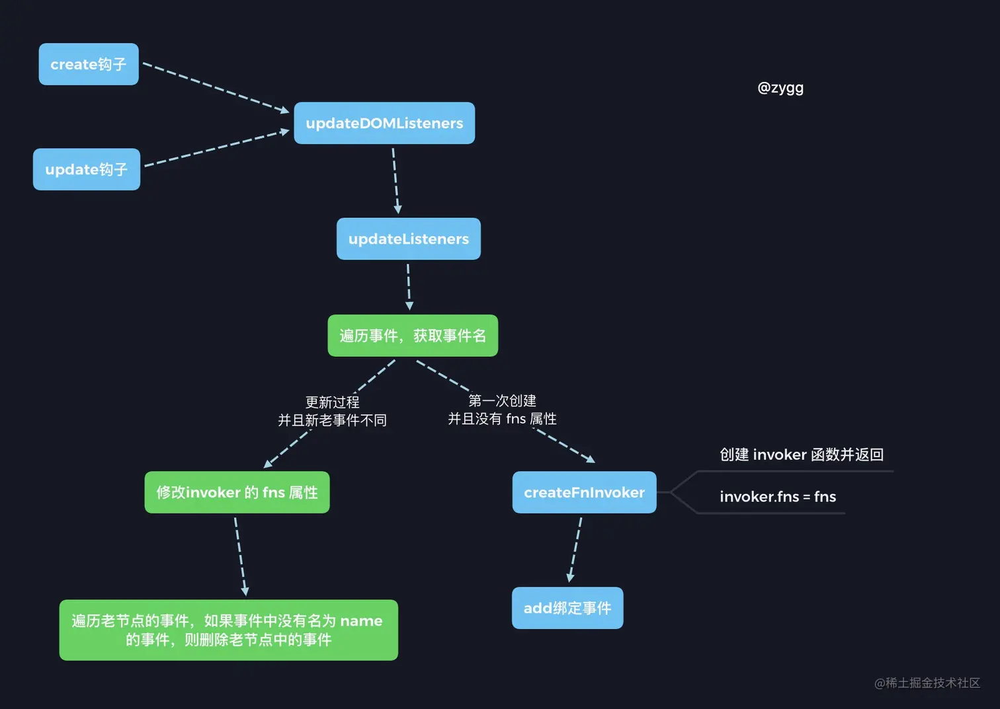
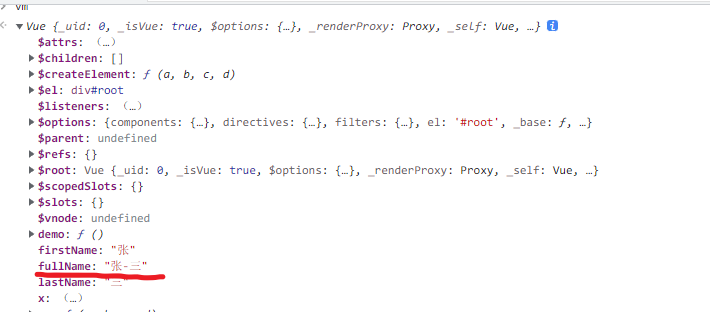
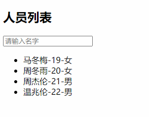
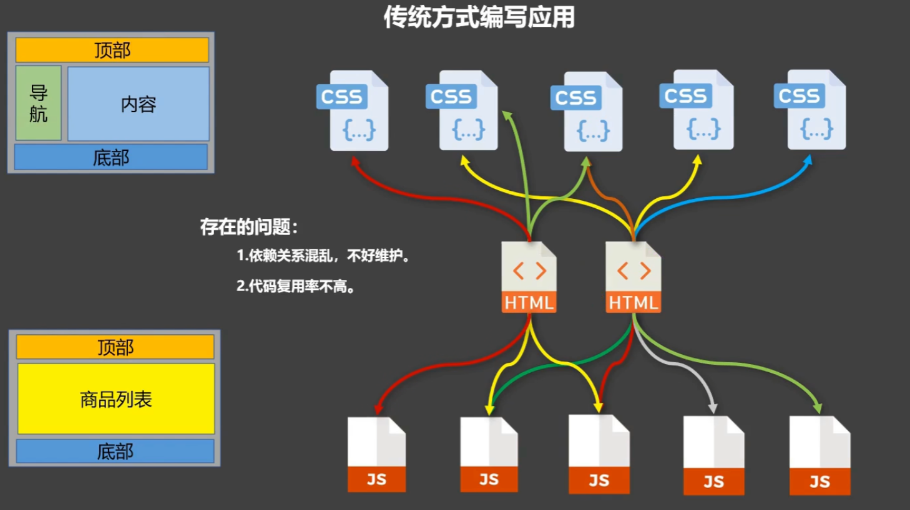
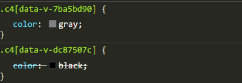
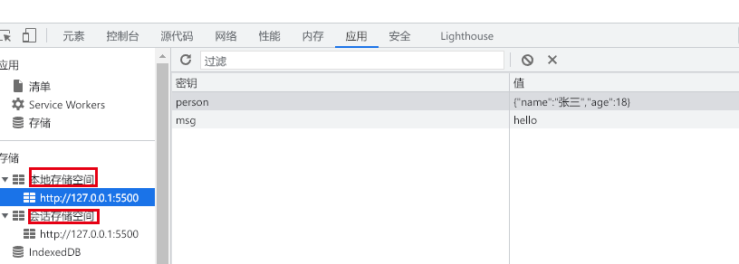
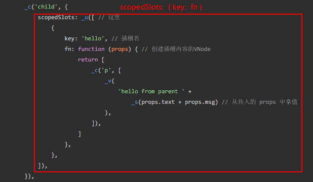

## 一、Vue 核心

### 1. MVVM 模型


#### (1). M：模型(Model)

对应于 ==data== 中的数据

#### (2). V：视图(View)

对应于 ==vue 模板==

```html
<div id="demo">
  <h1>Hello，{{name}}，{{address}}</h1>
</div>
```

#### (3). VM：视图模型(ViewModel)

对应于 ==Vue 实例对象==

```js
new Vue({
  el: '#demo', //el用于指定当前Vue实例为哪个容器服务，值通常为css选择器字符串。
  data: {
    //data中用于存储数据，数据供el所指定的容器去使用，值我们暂时先写成一个对象。
    name: 'atguigu',
    address: '北京',
  },
});
```

#### (4). 初识 Vue

- 想让 Vue 工作，就必须创建一个 ==Vue 实例== ，且要传入一个配置对象；

- root 容器里的代码依然符合 html 规范，只不过混入了一些特殊的 Vue 语法；

- root 容器里的代码被称为 ==Vue 模板== ；

- Vue 实例和容器是一一对应的；

- 真实开发中只有一个 Vue 实例，并且会配合着组件一起使用；

- `{ { xxx } }`中的 xxx 要写 js 表达式，且 xxx 可以自动读取到 data 中的所有属性；

- 一旦 data 中的数据发生改变，那么页面中用到该数据的地方也会自动更新；同时模板也会重新解析。

### 2. vue 模板写法

#### (1). 插值语法

用于解析标签体内容，`{ { xxx } }`，xxx 是 js 表达式，且可以直接读取到 data 中的所有属性。

---

> ==原理拓展==
>
> vue 编译时会根据正则分割出括号中的内容作为表达式
>
> ```js
> input:"我叫{{name}}，我今年{{age}}岁了"
> output:res = {
>  expression:"我叫"+_s(name)+"，我今年"+_s(age)+"岁了",
>  tokens:[
>      "我叫",
>      {'@binding': name },
>      "，我今年"
>      {'@binding': age },
>  	"岁了"
>  ]
> }
>
> // 以AST树的格式存在父节点的chilren数组中
> child = {
>  type: 2,
>  expression: res.expression,
>  tokens: res.tokens,
>  text,
> };
> ```
>
> - 其中`_s`指的是`toString`函数，用来获取表达式的值并转为字符串格式
> - 文本中的多个空格会被合并为一个单空格
>
> 在 ==生成代码== 阶段调用`genText`生成如下代码：
>
> ```js
> `_v(${
>   text.type === 2
>     ? text.expression // no need for () because already wrapped in _s()
>     : transformSpecialNewlines(JSON.stringify(text.text))
> })`;
> ```

---

#### (2). 指令语法

用于解析标签（包括：标签属性、标签体内容、绑定事件.....），举例：`v-bind:href="xxx"` 或简写为 `:href="xxx"`，xxx 同样要写 js 表达式，且可以直接读取到 data 中的所有属性。

Vue 中有很多的指令，且形式都是：`v-???`，包括后面提到的`v-model、v-on`，此处我们只是拿`v-bind`举例。

---

> ==原理拓展==<span id="attrs"></span>
>
> vue 编译时会根据正则从不同的捕获分组中获得 ==标签名== 、==属性信息== 、 ==开始结束索引==
>
> **模板**
>
> ```vue
> <div v-bind:class="{ active: isActive, error: isError }" @click="handleClick">Click me</div>
> ```
>
> **提取信息**
>
> 在解析 ==开始标签== 时，提取标签中的属性：
>
> ```js
> // match
> {
> tagName: 'div', // 标签名
> attrs: [
>  {
>    name: 'v-bind:class', // 属性名
>    value: "{'active': isActive, 'error': isError}", // 属性值
>    start: 5, // 属性在模板中的起始位置
>    end: 38, // 属性在模板中的结束位置
>    unary: false, // 是否是一元属性（没有值）
>    startTagEnd: 39 // 标签起始部分的结束位置
>  },
>  {
>    name: '@click', // 属性名
>    value: 'handleClick', // 属性值
>    start: 40, // 属性在模板中的起始位置
>    end: 57, // 属性在模板中的结束位置
>    unary: true, // 是一元属性（没有值）
>    startTagEnd: 58 // 标签起始部分的结束位置
>  }
> ],
> start: 0, // 标签在模板中的起始位置
> end: 61, // 标签在模板中的结束位置
> unarySlash: '' // 是否是自闭合标签的斜杠（在这个例子中，不是自闭合标签）
> }
> ```
>
> - vue 会根据上述信息调用`start`钩子函数生成对应的 ==AST 节点== （模板解析）
>   - 先使用`tagName、attrs`生成 AST 后再从`attrs`中解析信息
>
> 在解析 ==闭合标签或者自闭合标签== 时会调用`end`钩子函数处理 AST 节点，其中按照`prop`修饰符将`attrs`分为：`el.prop`和`el.attrs`，分别对应`$prop`和`$attrs` （模板解析）
>
> ```js
> if (
>   (modifiers && modifiers.prop) ||
>   (!el.component && platformMustUseProp(el.tag, el.attrsMap.type, name))
> ) {
>   addProp(el, name, value, list[i], isDynamic); // el.prop
> } else {
>   addAttr(el, name, value, list[i], isDynamic); //el.attrs
> }
> ```
>
> 当生成`render`函数时，根据上述信息生成代码：（代码生成）
>
> ```js
> // attributes
> if (el.attrs) {
>   // attrs:{name:value,...} 此时的value是一个具体的值或者表达式
>   data += `attrs:${genProps(el.attrs)},`;
> }
> // DOM props
> if (el.props) {
>   data += `domProps:${genProps(el.props)},`;
> }
> ```

### 3. 数据绑定

> ==原理拓展==
>
> 首先在组件实例化时将定义的 data 中的数据按照如下方式初始化：
>
> ```js
> let data = vm.$options.data;
> data = vm._data = typeof data === "function" ? getData(data, vm) : data || {};
> ......
> proxy(vm, `_data`, key);
> ```
>
> 这样我们就可以通过`vm.xxx`来访问我们定义的数据，而 vue 中将`template`编译为`render`函数并挂载到组件实例的`$options`中，其中`render`函数使用了如下方式进行包裹：
>
> ```js
> with(this){return ${code}}
> ```
>
> 此时的`this`为组件实例，所以在模板中使用的未知变量名会按照作用域访问到`this`( ==组件实例== )的属性和方法，即我们自定义的`data`。

#### (1).单向绑定(v-bind)

数据只能从`data`流向页面。

#### (2).双向绑定(v-model)

数据不仅能从 data 流向页面，还可以从页面流向 data。

- `v-model:value` 可以简写为 `v-model`，因为 v-model 默认收集的就是 value 值。

```html
<!-- 这里的name指的是变量而不是简单的字符串 -->
单向数据绑定：
<input type="text" :value="name" />
<br />
双向数据绑定：
<input type="text" v-model="name" />
<br />
```

```js
new Vue({
  el: '#root',
  data: {
    name: 'World',
  },
});
```

双向绑定一般都应用在 ==表单类== 元素上（如：`input、select`等）

`v-model`的三个修饰符：

- `lazy`：失去焦点再收集数据

  - 如果设置了`lazy`修饰符，会将`input`事件改成`change`事件。

- `number`：输入字符串转为有效的数字(默认收集的 value 值为字符串格式)
  - 配合`type="number"`进行使用
- `trim`：输入首尾空格过滤

#### (3).收集表单数据

1. 若：`<input type="text"/>`，则`v-model`收集的是 value 值，用户输入的就是 value 值。

2. 若：`<input type="radio"/>`，则`v-model`收集的是 value 值，且要给标签配置 value 值。

   ```html
   性别： 男
   <input type="radio" name="sex" v-model="userInfo.sex" value="male" />
   女
   <input type="radio" name="sex" v-model="userInfo.sex" value="female" />
   <br />
   <br />
   ```

3. 若：`<input type="checkbox"/>`
   - 没有配置`input`的 value 属性，那么收集的就是`checked`（勾选 or 未勾选，是布尔值）
   - 配置了`input`的 value 属性:
     - `v-model`的初始值是**非数组**，那么收集的就是`checked`（勾选 or 未勾选，是布尔值）
     - `v-model`的初始值是**数组**，那么收集的的就是 value 组成的数组

```html
爱好： 学习
<input type="checkbox" v-model="userInfo.hobby" value="study" />
打游戏
<input type="checkbox" v-model="userInfo.hobby" value="game" />
吃饭
<input type="checkbox" v-model="userInfo.hobby" value="eat" />
<br />
<br />
```

> ==原理拓展==
>
> vue 在解析普通标签上的`v-model`时，会按照普通的指令进行处理，生成如下`render`中的数据：
>
> ```js
> directives: [
>     { name: "model", rawName: "v-model", value: test, expression: "test" }
> ],
> ```
>
> 同时还会添加一个额外的事件（`input | change`）
>
> ```js
> const event = lazy ? 'change': type === 'range'? RANGE_TOKEN: 'input
> addHandler(el, event, code, null, true)
> ```
>
> 最后在`patch`阶段会调用`v-model`指令的`inserted`钩子函数，添加如下事件：
>
> ```js
> el.addEventListener('compositionstart', onCompositionStart);
> el.addEventListener('compositionend', onCompositionEnd);
> el.addEventListener('change', onCompositionEnd);
>
> function onCompositionStart(e) {
>   e.target.composing = true;
> }
> function onCompositionEnd(e) {
>   if (!e.target.composing) return;
>   e.target.composing = false;
>   trigger(e.target, 'input');
> }
> function trigger(el, type) {
>   const e = document.createEvent('HTMLEvents');
>   // 初始化，事件类型，是否冒泡，是否阻止浏览器的默认行为
>   e.initEvent(type, true, true);
>   el.dispatchEvent(e);
> }
> ```
>
> 当 el 对应 dom 元素的内容发生变化时，触发`input`事件，为绑定的变量赋予新的值。

#### (4). 父子间通信

`v-model`是 vue 中的一个语法糖，它负责监听用户的输入事件以更新数据。

`v-model` 在内部使用不同的属性为不同的输入元素抛出不同的事件：

- `text` 和 `textarea` 使用 `value` 属性和 `input` 事件；
- `checkbox` 和 `radio` 使用 `checked` 属性和 `change` 事件；
- `select` 字段将 `value` 作为 `prop` 并将 `change` 作为事件

基于上述原理我们可以使用如下方式实现父子间的通信：

1. 子组件设 `value` 为`props`属性，并且不主动改变 `value` 值
2. 子组件通过 `this.$emit('input', 'updateValue')` 将 `updateValue` 值传给父组件
3. 父组件通过 `v-model="localValue"` 绑定一个本地变量，即可实现子组件`value`值与父组件`updateValue` 值同步更新

实际上，这个过程首先是子组件通过 `$emit('input')` 更新父组件的本地变量，然后子组件中的 `value` 属性通过 `props` 得以更新。

```vue
<!-- 父组件 -->
<HelloWorld v-model="msg"></HelloWorld>
<!-- 子组件 -->
props: { value: String, },
<input type="text" :value="value" @input="$emit('input', $event.target.value)" />
```

> ==原理拓展==
>
> 组件上的`v-model`和表单上的完全不同，组件上没有添加`directives`数组，但是多了一个`model`属性
>
> ```js
> // genComponentModel
> el.model = {
>   value: `(${value})`,
>   expression: JSON.stringify(value),
>   callback: `function (${baseValueExpression}) {${assignment}}`,
> };
> ```
>
> 生成代码时生成如下的字符串：
>
> ```js
> // data
> data += `model:				  {value:${el.model.value},callback:${el.model.callback},expression:${el.model.expression}},`;
> ```
>
> 执行`render`函数时，会调用`createComponent`去创建组件 VNode，将其中的`v-model`指令转换为对应的 ==属性和事件绑定==
>
> ```js
> export function createComponent(
>   Ctor: Class<Component> | Function | Object | void,
>   data: ?VNodeData,
>   context: Component,
>   children: ?Array<VNode>,
>   tag?: string
> ): VNode | Array<VNode> | void {
>   // ...
>
>   if (isDef(data.model)) {
>     transformModel(Ctor.options, data);
>   }
>   // ...
>
>   const vnode = new VNode(
>     `vue-component-${Ctor.cid}${name ? `-${name}` : ''}`,
>     data,
>     undefined,
>     undefined,
>     undefined,
>     context,
>     { Ctor, propsData, listeners, tag, children },
>     asyncFactory
>   );
>   return vnode;
> }
>
> function transformModel(options, data: any) {
>   const prop = (options.model && options.model.prop) || 'value';
>   const event = (options.model && options.model.event) || 'input';
>   (data.attrs || (data.attrs = {}))[prop] = data.model.value; // 添加prop：value
>   const on = data.on || (data.on = {});
>   const existing = on[event];
>   const callback = data.model.callback;
>   if (isDef(existing)) {
>     if (Array.isArray(existing) ? existing.indexOf(callback) === -1 : existing !== callback) {
>       on[event] = [callback].concat(existing);
>     }
>   } else {
>     on[event] = callback; // 添加input：callback
>   }
> }
> ```
>
> `v-model`用于组件间通信时默认传递的事件为`input`、传递的属性为`value`

---

除了上面 `v-model` 的方法，其实还可以通过 `sync` 来实现。同样也是处理“监听”和“触发”就行

```vue
<!-- 父组件 -->
<HelloWorld :msg.sync="msg"></HelloWorld>
<!-- 子组件 -->
props: { msg: String, },
<input type="text" :value="msg" @input="$emit('update:msg', $event.target.value)" />
```

> ==原理拓展==
>
> vue 在解析到动态绑定后面的`.sync`修饰符时，会为当前节点添加自定义事件和回调
>
> ```js
> addHandler(
>   el,
>   `update:${camelize(name)}`, //事件名
>   syncGen, //事件值
>   null, //修饰符
>   false, //important
>   warn,
>   list[i]
> );
> ```
>
> 其中`syncGen`为事件回调，包含以下两种：
>
> ```js
> // :msg.sync="msg"
> msg = $event;
>
> //:name.sync="user.name"
> $set(user, name, $event);
> ```
>
> 默认的自定义事件名称为：`update:name(小驼峰形式)`

### 4. el 与 data 的两种写法

#### (1).el 的 2 种写法

- `new Vue`时候配置 el 属性。

- 先创建 Vue 实例，随后再通过`vm.$mount('#root')`指定 el 的值。

> 当在 options 中配置了 el，则会自动调用`$mount`
>
> ```js
> if (vm.$options.el) {
>   vm.$mount(vm.$options.el);
> }
> ```

#### (2).data 的 2 种写法

**对象式**

```js
data: {
  name: 'World';
}
```

**函数式**

```js
data(){
    console.log('@@@',this) //此处的this是Vue实例对象
    return{
        name:'World'
    }
}
```

如何选择：目前哪种写法都可以，以后学习到组件时，data 必须使用函数式，否则会报错。

> 函数式实例化时返回的是相同数据的不同对象，可以保证组件重复挂载时内部数据的独立

#### (3).重要原则

由 Vue 管理的函数，一定不要写箭头函数，一旦写了箭头函数，this 就不再是 Vue 实例了。

### 5. 数据代理

#### (1).Object.defineProperty 方法

`Object.defineProperty(obj,property,descriptor)`

```js
let number = 18;
let person = {
  name: '张三',
  sex: '男',
};
Object.defineProperty(person, 'age', {
  // value:18,
  // enumerable:true, //控制属性是否可以枚举，默认值是false
  // writable:true, //控制属性是否可以被修改，默认值是false
  // configurable:true //控制属性是否可以被删除，默认值是false

  //当有人读取person的age属性时，get函数(getter)就会被调用，且返回值就是age的值
  get() {
    console.log('有人读取age属性了');
    return number;
  },

  //当有人修改person的age属性时，set函数(setter)就会被调用，且会收到修改的具体值
  set(value) {
    console.log('有人修改了age属性，且值是', value);
    number = value;
  },
});
```

`getter`和`setter`用来拦截对应属性的存取行为

#### (2).数据代理

通过一个对象代理对另一个对象中属性的操作（读/写）

```js
let obj = { x: 100 };
let obj2 = { y: 200 };

Object.defineProperty(obj2, 'x', {
  get() {
    return obj.x;
  },
  set(value) {
    obj.x = value;
  },
});
```

#### (3).Vue 中的数据代理

通过 vm 对象来代理 data 对象中属性的操作（读/写），可以更加方便的操作 data 中的数据

- 通过`Object.defineProperty()`把 data 对象中所有属性添加到 vm 上。

- 为每一个添加到 vm 上的属性，都指定一个`getter/setter`，在`getter/setter`内部去操作（读/写）`_data`中对应的属性。
- 目的：为了编码的方便，不用重复的`_data.name`


上述指的是第二个白色箭头，至于黄色箭头所指的过程大致可分为两部分：

- 数据劫持，添加响应式

  ```js
  observe(data, true /* asRootData */);
  ```

- ```js
  vm._data = typeof data === 'function' ? getData(data, vm) : data || {};
  ```

### 6. 事件处理

#### (1).绑定事件

使用`v-on:xxx` 或 `@xxx` (常用)绑定事件，其中 xxx 是事件名；事件的回调需要配置在`methods`对象中，最终会出现在 vm 上。

> ==原理拓展==
>
> ==AST 节点上== - **模板解析阶段**
>
> 在闭合标签时会处理标签属性，按照`native`修饰符将`event`分为：`el.nativeEvents`和`el.events`，在其中挂载事件回调。
>
> ```js
> if (onRE.test(name)) {
>   name = name.replace(onRE, ''); //去掉v-on:
>   isDynamic = dynamicArgRE.test(name);
>   if (isDynamic) {
>     name = name.slice(1, -1); //去掉[]
>   }
>   addHandler(el, name, value, modifiers, false, warn, list[i], isDynamic); // 添加事件
> }
>
> // addHandler中
> const newHandler = rangeSetItem({ value: value.trim(), dynamic }, range); // {value,dynamic,start,end}
> events[name] = newHandler;
> ```
>
> **代码生成阶段**
>
> ```js
> if (el.events) {
>   data += `${genHandlers(el.events, false)},`;
> }
> if (el.nativeEvents) {
>   data += `${genHandlers(el.nativeEvents, true)},`;
> }
> ```
>
> `genHandlers`生成的代码如下：
>
> ```js
> const events = {
>      click: { // native
>           value: 'handleClick($event)',
>           modifiers: {},
>           dynamic: false
>      },
>      input: {
>           value: 'handleInput',
>           modifiers: {},
>           dynamic: true
>      }
> };
>
> // result
> "nativeOn:{`click:function($event){return handleClick($event)`},
> "on:_d({},[{`input,function($event){return handleInput($event)}}`}])
> ```
>
> **patch 阶段**
>
> 在 patch 过程中，会触发`create`和`update`钩子函数，执行`updateDOMListeners`函数
>
> 
>
> - `updateListeners(on,oldOn,add,remove,createOnceHandler,vm)`出现过两次，一次在这里，另外一次则出现在子组件初始化事件中，只不过传入的`add、remove`不同。
>
> **原生事件原理**
>
> 有两种原生事件，一种是普通标签上的事件、另一种是组件标签上有`.native`修饰符的原生事件，这两种的逻辑相同都是通过`addEventListener`绑定给真实元素的。
>
> **自定义事件原理**
>
> Vue 实例上有一个`_events`属性，当创建组件实例时，将自定义事件通过`$on`添加到`_events`属性中。当通过`$emit`触发事件时，从`_events`属性上查找事件名对应的回调。
>
> `$on`、`$emit` 是基于发布订阅模式的，维护一个事件中心，`$on`的时候将事件按名称存在事件中心（`vm._events`）里，称之为订阅者，然后`$emit`将对应的事件进行发布，去执行事件中心里的对应的回调

::: danger 注意 methods 中配置的函数，不要用箭头函数！否则 this 就不是 vm 了； :::

methods 中配置的函数，都是被 Vue 所管理的函数，this 的指向是 ==组件实例对象==

`@click="demo"` 和 `@click="demo($event)"` 效果一致，但后者可以传参；

```html
<button @click="showInfo2($event,66)">点我提示信息2（传参）</button>
```

绑定事件的时候：`@xxx="yyy"` yyy 可以写一些简单的语句

> ==原理拓展==
>
> 当事件值为方法路径或者函数表达式，直接返回对应的值；而当其为函数调用的形式时，则返回如下：
>
> ```js
> function($event){
>     return showInfo2($event,66)
> }
> ```

#### (2).事件修饰符

| 修饰符  | 作用                                             |
| ------- | ------------------------------------------------ |
| stop    | 阻止事件冒泡（常用）                             |
| prevent | 阻止默认事件（常用）                             |
| self    | 只有 event.target 是当前操作的元素时才触发事件   |
| once    | 事件只触发一次（常用）                           |
| capture | 使用事件的捕获模式                               |
| passive | 事件的默认行为立即执行，无需等待事件回调执行完毕 |

用法：

```html
<!-- 阻止默认事件（常用） -->
<a href="http://www.atguigu.com" @click.prevent="showInfo">点我提示信息</a>
```

- 阻止链接的默认跳转

```html
<!-- 阻止事件冒泡（常用） -->
<div class="demo1" @click="showInfo">
  <button @click.stop="showInfo">点我提示信息</button>
  <!-- <a href="http://www.atguigu.com" @click.prevent.stop="showInfo">点我提示信息</a> -->
</div>
```

- stop 修饰符加给内层事件
- 修饰符可以连续写（按照写的先后顺序依次触发事件）

```html
<!-- 事件只触发一次（常用） -->
<button @click.once="showInfo">点我提示信息</button>
```

#### (3).键盘事件

| 按键 | 别名                               |
| ---- | ---------------------------------- |
| 回车 | enter                              |
| 删除 | delete(捕获“删除”和“退格”键)       |
| 退出 | esc                                |
| 空格 | space                              |
| 换行 | tab(特殊，必须配合 keydown 去使用) |
| 上   | up                                 |
| 下   | down                               |
| 左   | left                               |
| 右   | right                              |

- Vue 未提供别名的按键，可以使用按键原始的 key 值(名字)去绑定，但注意要转为 kebab-case（短横线命名）

  eg：`caps-lock`

- 系统修饰键（**用法特殊**）：`ctrl、alt、shift、meta`
  - 配合`keyup`使用：按下修饰键的同时，再按下其他键，随后释放其他键，事件才被触发
  - 配合`keydown`使用：正常触发事件
- 也可以使用 keyCode 去指定具体的按键（**不推荐**）

- `Vue.config.keyCodes.自定义键名 = 键码`，可以去定制按键别名

> ==原理拓展==
>
> ```js {3,4}
> `function($event){${code}${handlerCode}}`;
>
> // code
> // 1. 条件处理: if()return null;
> if ('keyCode' in $event && $event.keyCode !== 17 && $event.keyCode !== 16) return null;
> // 2. 默认表达式
> $event.stopPropagation(); // stop
> $event.preventDefault(); // prevent
>
> // handlerCode
> const handlerCode = isMethodPath
>   ? `return ${handler.value}($event)`
>   : isFunctionExpression
>   ? `return (${handler.value})($event)`
>   : isFunctionInvocation
>   ? `return ${handler.value}`
>   : handler.value;
> ```

### 7. 计算属性

#### (1).定义

​ 要使用的属性不存在，要通过已有属性计算得来。

#### (2).原理

​ 底层借助了`Objcet.defineproperty`方法提供的`getter`和`setter`。

#### (3).优势

​ 与`methods`实现相比，内部有 ==缓存机制（复用）== ，效率更高，调试方便；

​ 与插值直接实现相比，更加直观，不用在模板中添加过多代码。

#### (4).计算属性中 get 函数什么时候执行？

- 初次读取时会执行一次，然后被缓存起来
- 当依赖的数据发生改变时会被再次调用

#### (5).使用

- 计算属性最终会出现在 vm 上，直接读取使用即可，在模板中使用时直接使用计算属性名，不可以加括号。



```js
//完整写法
computed:{
    fullName:{
        get(){
            // console.log(this) //此处的this是vm
            return this.firstName + '-' + this.lastName
        },
        set(value){
            const arr = value.split('-')
            this.firstName = arr[0]
            this.lastName = arr[1]
        }
    }
}
```

```js
//简写（一般写法）
computed:{
    fullName(){
        return this.firstName + '-' + this.lastName
    }
}
```

- 如果计算属性要被修改，那必须写`set`函数去响应修改，且`set`中要引起计算时依赖的数据发生改变。

- 如果计算属性不被修改，即只需要`get`函数时，可以使用上述 ==简写写法==

### 8. 侦听(监视)属性

当被监视的属性变化时, 回调函数自动调用, 进行相关操作；同时，==监视的属性必须存在，才能进行监视！！==

#### (1).侦听的不同配置项

```js
watch:{
    isHot:{
        immediate:true,
        deep:true,
        handler(newValue,oldValue){
            console.log('isHot被修改了',newValue,oldValue)
        }
    },
}
```

- `handler `：监听属性的回调函数
- `immediate`：初始化时让`handler`自调用一下
- `deep`：开启 ==深度监视==

#### (2).深度监视

- Vue 中的 watch 默认不监测对象内部值的改变（一层）。

- 配置`deep:true`可以监测对象内部值改变（多层）。

- data 配置项

  ```js
  data:{
      numbers:{
      	a:1,
  		b:1,
  		c:{
  			d:{
  				e:100
  			}
      	}
     }
  }
  ```

- 监听配置项

  ```js
  watch:{
      //监视多级结构中某个属性的变化
          'numbers.a':{
              handler(){
                  console.log('a被改变了')
              }
          }

      //监视多级结构中所有属性的变化
          numbers:{
              deep:true,
                  handler(){
                  console.log('numbers改变了')
              }
          }
  }
  ```

#### (3).两种不同写法与简写形式

- 第一种写法

  ```js
  //正常写法
  watch:{
  	isHot:{
          immediate:true,
          deep:true,
  		handler(newValue,oldValue){
  			console.log('isHot被修改了',newValue,oldValue)
  		}
  	}
  }
  ```

  - 当`watch`中不需要除了`handler`以外的配置项时，可以使用如下的简写形式

  ```js
  //简写
  watch:{
  	isHot(newValue,oldValue){
  		console.log('isHot被修改了',newValue,oldValue,this)
  	}
  }
  ```

- 第二种写法

  ```js
  //正常写法
  vm.$watch('isHot', {
    immediate: true,
    deep: true,
    handler(newValue, oldValue) {
      console.log('isHot被修改了', newValue, oldValue);
    },
  });
  ```

  - 可简写的情况同上，简写形式如下

  ```js
  //简写
  vm.$watch('isHot', (newValue, oldValue) => {
    console.log('isHot被修改了', newValue, oldValue, this);
  });
  ```

### 9. computed 和 watch 之间的区别

关于源码层面的区别参考[computed-和-watch-的区别](/notes/source_code/vue2/vuejs2_1.html#_3-computed-和-watch-的区别)

#### (1).区别

- `computed`能完成的功能，`watch`都可以完成，但是较为繁琐(因为需要对计算属性依赖的每个属性都进行监听和处理)，此时优先计算属性。
- `watch`能完成的功能，`computed`不一定能完成，例如：watch 可以进行异步操作

#### (2).两个重要的原则

**目的**：==不改变 this 的指向==

- 所被 Vue 管理的函数，最好写成普通函数，这样 this 的指向才是 vm 或 组件实例对象。

- 所有不被 Vue 所管理的函数（定时器的回调函数、ajax 的回调函数等、Promise 的回调函数），最好写成箭头函数，这样 this 的指向才是 vm 或组件实例对象。

### 10. 绑定样式

#### (1).class 样式

`:class="xxx"`，xxx 可以是 ==字符串、对象、数组== 。

字符串写法适用于：类名不确定，要动态获取。

```html
<div class="basic" :class="mood" @click="changeMood">{{name}}</div>
<br />
<br />
```

- 在 data 中动态配置`mood`的值

对象写法适用于：要绑定多个样式，个数不确定，名字也不确定。

```html
<div class="basic" :class="classObj">{{name}}</div>
```

data 配置

```js
classObj:{
    style1:false,
    style2:false,
}
```

- 只有对象属性的值为`true`时，才会加载此样式

数组写法适用于：要绑定多个样式，个数确定，名字也确定，但不确定用不用。

```html
<div class="basic" :class="classArr">{{name}}</div>
```

data 配置

```js
classArr:['sty1','sty2','sty3'],
```

#### (2).style 样式

`:style="{fontSize: xxx}"`，其中 xxx 是动态值。

`:style="[a,b]"`，其中 a、b 是样式对象。

### 11. 条件渲染

#### (1).v-if

- 写法：
  - `v-if="表达式"`
  - `v-else-if="表达式"`
  - `v-else="表达式"`
- 适用于：切换频率较低的场景。
- 特点：不展示的 DOM 元素直接被 ==移除== 。
- 注意：`v-if`可以和`v-else-if、v-else`一起使用，但要求结构不能被“打断”。

> ==原理拓展==
>
> vue 解析模板属性时会解析出`v-if`的值，在 AST 节点上添加如下属性（模板解析阶段）
>
> ```js
> el.if = exp
> el.ifConditions = [
>     {
>         exp: exp,
>         block: el,
>     },
>     ...
> ]
> el.else = true
> el.elseif = true
> ```
>
> 代码生成阶段
>
> ```js
> if (el.if && !el.ifProcessed) {
>   return genIf(el, state);
> }
> ```
>
> `genIf`生成的代码如下
>
> ```js
> conditions = [
>   {
>     exp: 'isShow',
>     block: {
>       tag: 'div',
>       attrs: {
>         class: 'show',
>       },
>     },
>   },
>   {
>     exp: '!isShow',
>     block: {
>       tag: 'div',
>       attrs: {
>         class: 'hide',
>       },
>     },
>   },
> ];
>
> // result
> ("(isShow)?_c('div',{staticClass:'show'}):((!isShow)?_c('div',{staticClass:'hide'}):_e())");
> ```

#### (2).v-show

- 写法：`v-show="表达式"`
- 适用于：切换频率较高的场景。
- 特点：不展示的 DOM 元素未被移除，仅仅是使用样式 ==隐藏== 掉

#### (3).注意

​ 使用`v-if`的时，元素可能无法获取到，而使用`v-show`一定可以获取到。

### 12. 列表渲染

#### (1).基本使用

`v-for`指令

- 用于展示列表数据

- 语法：`v-for="(item, index) in xxx" :key="yyy"`

- 可遍历(xxx 的类型)：数组、对象、字符串（用的很少）、指定次数（用的很少）

```html
<h2>人员列表</h2>
<ul>
  <li v-for="(p,index) of persons" :key="index">{{p.name}}-{{p.age}}</li>
</ul>
```

> ==原理拓展==
>
> vue 解析模板属性时会解析出`v-for`的值，在 AST 节点上添加如下属性（模板解析阶段）
>
> ```js
> // input
> input: '(item,index) in arr'
> // output
> output: {for: 'arr', alias: 'item', iterator1: 'index'}
> el.for = 'arr'
> el.alias = 'item'
> el.iterator1 = 'index'
> ```
>
> 代码生成阶段
>
> ```js
> if (el.for && !el.forProcessed) {
>   return genFor(el, state);
> }
> ```
>
> `genFor`生成的代码如下
>
> ```js
> // template
> <div v-for="item in items" :key="item.id">{{ item.name }}</div>
>
> // result
> `_l((items), function(item) {
>   return _c('div', { key: item.id }, [_v(_s(item.name))]);
> })`
> ```
>
> 其中`_l`表示`renderList`，返回一个 vnode 数组

#### (2).列表过滤

`Array.filter(function(element, index, array)`

- element 数组中当前正在处理的元素
- index 正在处理的元素在数组中的索引
- array 调用了`filter`的数组本身

```html
<div id="root">
  <h2>人员列表</h2>
  <input type="text" placeholder="请输入名字" v-model="keyWord" />
  <ul>
    <li v-for="(p,index) of filPerons" :key="index">{{p.name}}-{{p.age}}-{{p.sex}}</li>
  </ul>
</div>
```

```js
new Vue({
  el: '#root',
  data: {
    keyWord: '',
    persons: [
      { id: '001', name: '马冬梅', age: 19, sex: '女' },
      { id: '002', name: '周冬雨', age: 20, sex: '女' },
      { id: '003', name: '周杰伦', age: 21, sex: '男' },
      { id: '004', name: '温兆伦', age: 22, sex: '男' },
    ],
  },
  computed: {
    filPerons() {
      return this.persons.filter((p) => {
        return p.name.indexOf(this.keyWord) !== -1;
      });
    },
  },
});
```

效果演示



#### (3).key 的原理

1. 虚拟 DOM 中 key 的作用：

   - key 是虚拟 DOM 对象的标识，==当数据发生变化时== ，Vue 会根据 ==新数据== 生成 ==【新的虚拟 DOM】== , 随后 Vue 进行 ==【新虚拟 DOM】== 与 ==【旧虚拟 DOM】== 的差异 ==比较== ，比较规则如下：

2. 对比规则：

   - 旧虚拟 DOM 中找到了与新虚拟 DOM ==相同== 的 key：

     ①.若虚拟 DOM 中内容没变, 直接使用之前的真实 DOM( ==复用== )

     ②.若虚拟 DOM 中内容变了, 则生成 ==新的真实 DOM== ，随后替换掉页面中之前的真实 DOM。

   - 旧虚拟 DOM 中 ==未找到== 与新虚拟 DOM 相同的 key，则创建 ==新的真实 DOM== ，随后渲染到到页面。

3. 用`index`作为 key 可能会引发的问题：

   - 若对数据进行：逆序添加、逆序删除等破坏顺序操作：会产生没有必要的真实 DOM 更新 ==> 界面效果没问题, 但效率低。
   - 如果结构中还包含输入类的 DOM：会产生错误 DOM 更新 ==> 界面有问题。

4. 开发中如何选择 key:
   - 最好使用每条数据的唯一标识作为 key, 比如 id、手机号、身份证号、学号等唯一值。
   - 如果不存在对数据的逆序添加、逆序删除等破坏顺序操作，仅用于渲染列表用于展示，使用 index 作为 key 是没有问题的。

> ==原理拓展==
>
> 在新旧`vnode.children`之间的`patch`时，会按照如下的顺序进行 diff
>
> 
>
> diff 的第一步就是判断新旧节点是否相同，相同的话则进行两节点间的`patch`操作，而判断是否相同的第一步就是对比两者的`key`是否相同，如果不同则直接判定不同。
>
> ```js
> function sameVnode(a, b) {
>   return (
>     a.key === b.key &&
>     ((a.tag === b.tag &&
>       a.isComment === b.isComment &&
>       isDef(a.data) === isDef(b.data) &&
>       sameInputType(a, b)) ||
>       (isTrue(a.isAsyncPlaceholder) &&
>         a.asyncFactory === b.asyncFactory &&
>         isUndef(b.asyncFactory.error)))
>   );
> }
> ```

#### (4).列表排序

`arr.sort([compareFunction])` 用来指定按某种顺序进行排列的函数

```js
computed:{
    filPerons(){
        const arr = this.persons.filter((p)=>{
            return p.name.indexOf(this.keyWord) !== -1
        })
        //判断一下是否需要排序
        if(this.sortType){
            arr.sort((p1,p2)=>{
                return this.sortType === 1 ? p2.age-p1.age : p1.age-p2.age
            })
        }
        return arr
    }
}
```

#### (5).Vue 监视数据的原理

1. vue 会监视 data 中所有层次的数据。

2. 如何监测**对象**中的数据？

   通过`setter`实现监视，且要在`new Vue`时就传入要监测的数据。

   最简单的模拟实现<span id="process"></span>

```js
let data = {
  name: '尚硅谷',
  address: '北京',
};

//1. 加工data
function Observer(obj) {
  //汇总对象中所有的属性形成一个数组
  const keys = Object.keys(obj);
  keys.forEach((k) => {
    Object.defineProperty(this, k, {
      get() {
        return obj[k];
      },
      set(val) {
        console.log(`${k}被改了，我要去解析模板，生成虚拟DOM.....我要开始忙了`);
        obj[k] = val;
      },
    });
  });
}

//创建一个监视的实例对象，用于监视data中属性的变化
const obs = new Observer(data);

//准备一个vm实例对象
//2. 将data的值赋给_data
let vm = {};
vm._data = data = obs;
```

- 对象中后追加的属性，Vue 默认不做响应式处理

- 如需给后添加的属性做响应式，请使用如下 API：

  ```vue
  Vue.set(target，propertyName/index，value) //或 vm.$set(target，propertyName/index，value)
  ```

3. 如何监测**数组**中的数据？

   通过**包裹数组**更新元素的方法实现，本质就是做了两件事：

   - 调用原生对应的方法对数组进行更新。
   - 重新解析模板，进而更新页面。

4. 在 Vue 修改数组中的某个元素一定要用如下方法：

   - 使用这些 API:`push()、pop()、shift()、unshift()、splice()、sort()、reverse()`
   - `Vue.set()` 或 `vm.$set()`
   - 其他方法没有进行包裹实现，更改数据时不会重新解析模板

::: warning 注意特别注意：`Vue.set()` 和 `vm.$set()` 不能给 vm 或 vm 的根数据对象(vm.\_data) 添加属性！！！ :::

### 13. 过滤器

**定义**：对要显示的数据进行特定格式化后再显示（适用于一些简单逻辑的处理）。

**语法**：

1. 注册过滤器

   `Vue.filter(name,callback)` --全局过滤器(其他组件也可使用)

   ```js
   Vue.filter('mySlice', function (value) {
     return value.slice(0, 4);
   });
   ```

   `new Vue({filters:{}})` --局部过滤器

   ```js
   new Vue({
     el: '#root',
     data: {
       time: 1621561377603, //时间戳
     },
     filters: {
       timeFormater(value, str = 'YYYY年MM月DD日 HH:mm:ss') {
         return dayjs(value).format(str);
       },
     },
   });
   ```

2. 使用过滤器

   `{ { xxx | 过滤器名} }` 或 `v-bind:属性 = "xxx | 过滤器名"`

**备注**：

1. 过滤器也可以接收额外参数、多个过滤器也可以串联

2. 并没有改变原本的数据, 是产生新的对应的数据

3. 过滤器的功能本质上用`computed`或者`methods`都可以实现

> 过滤器的具体原理可以查看[过滤器解析器](/notes/source_code/vue2/vuejs2.html#filter)

### 14. 一些其他的内置指令

#### (1).v-text

- 作用：向其所在的节点中渲染**文本内容**。
- 与插值语法的区别：`v-text`会替换掉节点中的内容，`{ { xx } }`则不会。

#### (2).v-html

- 作用：向指定节点中渲染**包含 html 结构的内容**。
- 与插值语法的区别
  - `v-html`会替换掉节点中所有的内容，`{ { xx } }`则不会。
  - `v-html`可以识别 html 结构。

::: danger 危险

`v-html`存在安全性问题

- 在网站上动态渲染任意 HTML 是非常危险的，容易导致 XSS 攻击。
- 一定要在可信的内容上使用`v-html`，永不要用在用户提交的内容上！

:::

#### (3).v-cloak（没有值）

- 本质是一个特殊属性，Vue 实例创建完毕并接管容器后，会删掉`v-cloak`属性。

- 使用 css 配合 v-cloak 可以解决网速慢时页面展示出`{ { xxx } }`的问题。

  ```css
  [v-cloak] {
    display: none;
  }
  ```

  ```html
  <div id="root">
    <h2 v-cloak>{{name}}</h2>
  </div>
  ```

#### (4).v-once（没有值）

- `v-once`所在节点在初次动态渲染后，就视为静态内容了。
- 以后数据的改变不会引起`v-once`所在结构的更新，可以用于优化性能。
- 用于一些动态显示初始值的地方。

#### (5).v-pre（没有值）

- 跳过其所在节点的编译过程。
- 可利用它跳过：没有使用 ==指令语法== 、没有使用 ==插值语法== 的节点，会加快编译。

### 15. 现有指令总结

| 指令      |                       功能                        |
| --------- | :-----------------------------------------------: |
| v-bind    |         单向绑定解析表达式, 可简写为 :xxx         |
| v-model   |                   双向数据绑定                    |
| v-for     |               遍历数组/对象/字符串                |
| v-on      |              绑定事件监听, 可简写为@              |
| v-if      |         条件渲染（动态控制节点是否存在）          |
| v-else-if |         条件渲染（动态控制节点是否存在）          |
| v-else    |         条件渲染（动态控制节点是否存在）          |
| v-show    |          条件渲染 (动态控制节点是否展示)          |
| v-text    | 向其所在的节点中渲染仅文本内容 (不解析 html 结构) |
| v-html    |       向指定节点中渲染包含 html 结构的内容        |
| v-cloak   |      此指令保持在节点上直到关联实例结束编译       |
| v-once    |             仅动态渲染一次所在的节点              |
| v-pre     |            跳过其所在节点的编译过程。             |

### 16. 自定义指令

#### (1).定义语法

局部指令：

```js
//完整形式
new Vue({
    directives:{
        指令名:{
            bind(element,binding){},
            inserted(element,binding){},
            update(element,binding){}
        }
})

//或

//简写形式
new Vue({
    directives{
    	指令名(element,binding){}
    }
})
```

全局指令：

`Vue.directive(指令名,配置对象)` 或 `Vue.directive(指令名,回调函数)`

#### (2).配置对象中常用的 3 个回调

- `bind`：指令与元素成功 ==绑定== 时调用。
  - dom 元素已创建但是还未插入到父节点中，所以 ==此时可以获取到当前元素的子元素，但是获取不到父元素==
  - 例如：为元素添加属性、值或者绑定事件。
- `inserted`：指令所在元素被**插入页面**时调用(一些 dom 操作)。

  - 例如：获取元素焦点(`focus`)、获取元素的父元素(`parentNode`)

- `update`：指令所在模板结构被**重新解析**时调用。
  - 一般情况下与`bind`阶段相同
- 这三个函数中的`this`均指向`window`。

```js
directives:{
    //简写形式
    big(element,binding){
        console.log('big',this) //注意此处的this是window
        element.innerText = binding.value * 10
    },

    //完整形式
    fbind:{
        //指令与元素成功绑定时（一上来）
        bind(element,binding){
            element.value = binding.value
        },
        //指令所在元素被插入页面时
        inserted(element,binding){
            element.focus()
        },
        //指令所在的模板被重新解析时
        update(element,binding){
            element.value = binding.value
        }
   }
}
```

> ==原理拓展==
>
> 1. 将定义的指令挂载到`Vue.option['directives']`或`vm.$options['directives']`
>
> ```js
> Vue.options = Object.create(null);
> Vue.options['directives'] = Object.create(null);
>
> Vue.directive = function (id, definition) {
>   if (!definition) {
>     return this.options['directives'][id];
>   } else {
>     if (type === 'directive' && typeof definition === 'function') {
>       definition = { bind: definition, update: definition };
>     }
>     this.options['directives'][id] = definition;
>     return definition;
>   }
> };
> ```
>
> 2. vue 在编译模板时会解析标签属性中的指令，在 AST 节点上添加如下属性
>
>    ```js
>    addDirective(
>      el,
>      name, // 去掉v-和:value
>      rawName, // 全名
>      value,
>      arg, // value
>      isDynamic,
>      modifiers,
>      list[i]
>    );
>
>    // el.directives
>    directives: [
>      {
>        name: 'on',
>        rawName: 'v-on',
>        value: 'handleClick',
>        arg: 'click',
>        modifiers: { prevent: true },
>      },
>      {
>        name: 'bind',
>        rawName: 'v-bind',
>        value: 'message',
>        arg: 'text',
>        modifiers: { sync: true },
>      },
>    ];
>    ```
>
>    代码生成阶段
>
>    ```js
>    const dirs = genDirectives(el, state);
>    if (dirs) data += dirs + ',';
>    ```
>
>    `genDirectives`生成的代码如下：
>
>    ```js
>    "directives:[{name:"on",rawName:"v-on",value:(handleClick),expression:"handleClick",arg:"click",modifiers:{"prevent":true}},{name:"bind",rawName:"v-bind",arg:"text"}]"
>    ```
>
> 3. 执行时机
>
>    具体内容参考[指令篇 | 自定义指令](/notes/reference/Learn-Vue-Source-Code.html)，我们知道，在虚拟`DOM`渲染更新的`create`、`update`、`destory`阶段执行`updateDirectives`函数，其中会执行如下函数：
>
>    ```js
>    // 获取新旧指令集合
>    const oldDirs = normalizeDirectives(oldVnode.data.directives, oldVnode.context);
>    const newDirs = normalizeDirectives(vnode.data.directives, vnode.context);
>    ```
>
>    其中会将`vnode.context.$options['directives']`即第一步生成的内容添加到`vnode.data.directives[name].def`。这样就得到了一个指令需要的所有数据 。
>
>    然后只需要在合适的时间点 ==执行指令定义中的钩子函数== 即可。

#### (3).备注

- 指令定义时不加`v-`，但使用时要加`v-`。
- 简写形式实际上是默认将定义的回调函数在`bind`和`update`阶段执行

- 指令名如果是多个单词，要使用 kebab-case(-断词)命名方式，不要用 camelCase(驼峰)命名。

### 17. Vue 的生命周期


#### (1).常用的生命周期钩子：

- `mounted`: 发送 ajax 请求、启动定时器、绑定自定义事件、订阅消息等【初始化操作】。
- `beforeDestroy`: 清除定时器、解绑自定义事件、取消订阅消息等【收尾工作】。

#### (2).关于销毁 Vue 实例

- 销毁后借助 Vue 开发者工具看不到任何信息。
- 销毁后自定义事件会失效，但原生 DOM 事件依然有效( ==已经更新，现在所有的事件均会失效== )。
- 一般不会在`beforeDestroy`操作数据，因为即便操作数据，也不会再触发更新流程了。

> ==原理拓展==

vue 工作内容


## 二、 组件化编程

### 1. 为什么要使用组件化编程

**传统的编程方式:**



**组件化编程方式：**


**组件与 vm 实例的关系：**


### 2. 基本使用

#### (1).定义组件(创建组件)

使用`Vue.extend(options)`创建，其中`options`和`new Vue(options)`时传入的那个`options`几乎一样，但也有点区别。

```js
//创建school组件
const school = Vue.extend({
  template: `
        <div>
        <h2>学校名称：{{schoolName}}</h2>
        <h2>学校地址：{{address}}</h2>
        <button @click="showName">点我提示学校名</button>
        </div>
	`,
  data() {
    return {
      schoolName: '逸夫',
      address: '北京',
    };
  },
  methods: {
    showName() {
      alert(this.schoolName);
    },
  },
});
```

**区别如下**

- `el`不要写，为什么？ ——— 最终所有的组件都要经过一个 vm 的管理，由 vm 中的`el`决定服务哪个容器。

- `data`必须写成函数，为什么？ ———— 避免组件被复用时，数据存在引用关系。

- 备注：使用`template`可以配置组件结构。

#### (2).注册组件

- 局部注册：靠`new Vue`的时候传入`components`选项
- 全局注册：靠`Vue.component('组件名',组件)`

```js
//创建vm
new Vue({
  el: '#root',
  //注册组件（局部注册）
  components: {
    school,
    student,
  },
});

//全局注册
Vue.component('hello', hello);
```

#### (3).使用组件(写组件标签)

​ `<school></school>`

### 3. 几个注意点

#### (1).组件名

- 一个单词组成

  - 第一种写法(首字母小写)：`school`
  - 第二种写法(首字母大写)：`School`

- 多个单词组成
  - 第一种写法(kebab-case 命名)：`my-school`
  - 第二种写法(CamelCase 命名)：`MySchool` (需要 Vue 脚手架支持)
- 备注：
  - 组件名尽可能回避 HTML 中已有的元素名称，例如：h`2、H2`都不行。
  - 可以使用 name 配置项指定组件在开发者工具中呈现的名字。

#### (2).关于组件标签

- 第一种写法：`<school></school>`

- 第二种写法：`<school/>`

- 备注：不用使用脚手架时，`<school/>`会导致后续组件不能渲染。

#### (3).创建组件的简写方式

```js
const school = Vue.extend(options);
//可简写为
const school = options;
```

- 当没有使用`extend`定义时，系统会进行判断自动将其调用。

### 4. 组件的嵌套

​ 当各组件发生嵌套时，只需要在**父组件中注册子组件**，并在父组件的模板中使用组件标签。

```js
//定义hello组件
const hello = Vue.extend({
  template: `<h1>{{msg}}</h1>`,
  data() {
    return {
      msg: 'Hello World！',
    };
  },
});

//定义app组件
const app = Vue.extend({
  template: `
        <div>	
        <hello></hello>
        </div>
	`,
  components: {
    hello,
  },
});
```

### 5. 关于 VueComponent

组件本质是一个名为`VueComponent`的**构造函数**，且不是程序员定义的，是`Vue.extend`生成的。

```js
// 全局注册
// 当注册组件时的配置对象为原生对象，自动调用vue.extend()
if (type === 'component' && isPlainObject(definition)) {
  definition.name = definition.name || id;
  definition = this.options._base.extend(definition);
}

// 局部注册'
// _createElement
Ctor = resolveAsset(context.$options, 'components', tag);
// ...
// createComponent
if (isObject(Ctor)) {
  Ctor = baseCtor.extend(Ctor);
}
```

我们只需要写`<school/>`或`<school></school>`，Vue 解析时会帮我们创建 school 组件的 ==实例对象== ， 即 Vue 帮我们执行的：`new VueComponent(options)`。

> ==原理拓展==
>
> 在进行 patch 操作，使用`createElm`创建 dom 元素且当前 vnode 为组件占位 vnode 时，调用组件的 ==init 钩子函数== ，其中进行了如下操作：
>
> ```js
> const child = (vnode.componentInstance = new vnode.componentOptions.Ctor(options));
> child.$mount(hydrating ? vnode.elm : undefined, hydrating);
> ```

- 特别注意：每次调用`Vue.extend`，返回的都是一个**全新**的`VueComponent`！！（因为是一个新的子类）

关于 this 指向：

- 组件配置中：

  `data`函数、`methods`中的函数、`watch`中的函数、`computed`中的函数，它们的 this 均是 ==VueComponent 实例对象== 。

- new Vue(options)配置中：

  `data`函数、`methods`中的函数、`watch`中的函数、`computed`中的函数 它们的 this 均是 ==Vue 实例对象== 。

- `VueComponent`的实例对象，以后简称 vc(也可称之为:组件实例对象);Vue 的实例对象，以后简称 vm。

### 6. `VueComponent`和`Vue`的关系

它们之前存在一个重要的内置关系

```js
VueComponent.prototype.__proto__ === Vue.prototype;
```


以此来让组件实例对象可以访问到 Vue 原型上的属性、方法。

> ==原理拓展==
>
> ```js
> // Vue.extend
> const Super = this;
> const Sub = function VueComponent(options) {
>   this._init(options);
> };
> Sub.prototype = Object.create(Super.prototype); //子类的原型指向vue的原型对象
> Sub.prototype.constructor = Sub;
> ```

## 三、 Vue 脚手架

::: warning 注意

现在官方推荐使用 [create-vue](https://github.com/vuejs/create-vue) 来创建基于 [Vite](https://vitejs.dev/) 的新项目，这里的`Vue CLI`仅作为学习使用。另外请参考 [Vue 3 工具链指南](https://cn.vuejs.org/guide/scaling-up/tooling.html) 以了解最新的工具推荐。

:::

### 1. 安装

第一步（仅第一次执行）：全局安装@vue/cli。

```shell
npm install -g @vue/cli
```

切换到你要创建项目的目录，然后使用命令创建项目

```shell
vue create xxxx
```

启动项目

```shell
npm run serve
```

::: tip 提示

如出现下载缓慢请配置 npm 淘宝镜像：`npm config set registry https://registry.npm.taobao.org`

:::

### 2. 目录结构

```
.
├─ node_modules
|  |
├─ public
│  ├── favicon.ico: 页签图标
│  └── index.html: 主页面
|  |
├─ src
│  ├── assets: 存放静态资源
│  │ └── logo.png
|  |
│  │── component: 存放组件
│  │ └── HelloWorld.vue
|  |
│  │── App.vue: 汇总所有组件
│  │── main.js: 入口文件
|  |
├─ .gitignore: git 版本管制忽略的配置
|
├─ babel.config.js: babel 的配置文件
|
├─ jsconfig.json: js编译器的配置文件
|
├─ package.json: 应用包配置文件
|
├─ README.md: 应用描述文件
|
├─ package-lock.json：包版本控制文件
|
└─ vue.config.js: vue的全局配置文件
```

**main.js**

该文件是整个文件的**入口文件**

```js
//引入Vue
import Vue from 'vue';
//引入App组件，他是所有组件的父组件
import App from './App.vue';
//关闭vue的生产提示
Vue.config.productionTip = false;
//创建Vue实例对象---vm
new Vue({
  //将app组件放入容器中
  //h表示createElement函数
  render: (h) => h(App),
}).$mount('#app');
```

vue.js 与 vue.runtime.xxx.js 的区别：

- vue.js 是完整版的 Vue，包含：核心功能 + 模板解析器。
- vue.runtime.xxx.js 是运行版的 Vue，只包含核心功能；没有模板解析器，模板解析的功能有 vue-loader 完成

因为 vue.runtime.xxx.js 没有模板解析器，所以不能使用`template`配置项，需要使用 `render`函数接收到的`createElement`函数去指定具体内容。

### 3. ref 属性

`ref`被用来给元素或子组件注册引用信息（id 的替代者），当应用在 html 标签上获取的是真实 DOM 元素，应用在组件标签上是组件实例对象。

打标识：

```vue
<h1 ref="xxx">.....</h1>
或
<School ref="xxx"></School>
```

获取：

```vue
this.$refs.xxx
```

::: warning 注意

当子组件中有多个同名的`ref`，`this.$refs.xxx`只会指向最后一次声明的元素;

当对`v-for`的标签元素使用`ref`，`this.$refs.xxx`会得到一个数组。

:::

> ==原理拓展==
>
> 1. 在模板解析阶段首先会将`ref`作为普通的属性解析到匹配的[attrs](#attrs)中生成 ==AST 节点==
>
> 2. 在调用`end`函数处理 AST 节点时，解析其中 ref，如果 attrs 中包含 ref 属性，将其值添加到 AST 节点的同名属性上
>
>    ```js
>    const ref = getBindingAttr(el, 'ref');
>    if (ref) {
>      el.ref = ref;
>      el.refInFor = checkInFor(el);
>    }
>    ```
>
> 3. 生成`render`函数阶段，生成如下代码：
>
>    ```js
>    if (el.ref) {
>      data += `ref:${el.ref},`;
>    }
>    ```
>
> 4. ref 指令的定义如下：
>
>    ```js
>    {
>      create(_: any, vnode: VNodeWithData) {
>        registerRef(vnode);
>      },
>      update(oldVnode: VNodeWithData, vnode: VNodeWithData) {
>        if (oldVnode.data.ref !== vnode.data.ref) {
>          registerRef(oldVnode, true);
>          registerRef(vnode);
>        }
>      },
>      destroy(vnode: VNodeWithData) {
>        registerRef(vnode, true);
>      },
>    };
>    ```
>
>    其中`registerRef`用来登记 ref
>
>    ```js {6}
>    export function registerRef(vnode: VNodeWithData, isRemoval: ?boolean) {
>      const key = vnode.data.ref;
>      if (!isDef(key)) return;
>
>      const vm = vnode.context;
>      const ref = vnode.componentInstance || vnode.elm; // vnode对应的组件实例或dom元素
>      const refs = vm.$refs;
>      // 移除
>      if (isRemoval) {
>        if (Array.isArray(refs[key])) {
>          remove(refs[key], ref);
>        } else if (refs[key] === ref) {
>          refs[key] = undefined;
>        }
>      }
>      // 添加
>      else {
>        if (vnode.data.refInFor) {
>          if (!Array.isArray(refs[key])) {
>            refs[key] = [ref];
>          } else if (refs[key].indexOf(ref) < 0) {
>            // $flow-disable-line
>            refs[key].push(ref);
>          }
>        } else {
>          refs[key] = ref;
>        }
>      }
>    }
>    ```

### 4. props 配置项

1. 功能：让组件接收外部( ==组件标签使用时== )传过来的数据

2. 传递数据：`<Demo name="xxx"/>`

   - 因为传递数据时要使用组件标签，所以一般这种消息传递发生于 ==父子组件== 之中。
   - 使用`v-model`时要切记：`v-model`绑定的值不能是`props`传过来的值，因为 props 是不可以修改的！
   - `props`传过来的若是对象类型的值，修改对象中的属性时 Vue 不会报错，但不推荐这样做。

3. props 适用于：

   - ==父组件 --> 子组件== 通信
   - ==子组件 --> 父组件== 通信（要求父先给子一个函数,子通过传参来进行通信）

4. 接收数据：

   1. 第一种方式（只接收）：`props:['name'] `

   2. 第二种方式（限制类型）：`props:{name:String}`

   3. 第三种方式（限制类型、限制必要性、指定默认值）：

      ```js
      props:{
      	name:{
      	type:String, //类型
      	required:true, //必要性
      	default:'老王' //默认值
      	}
      }
      ```

::: warning 注意

`props`是只读的，Vue 底层会监测你对`props`的修改，如果进行了修改，就会发出警告，若业务需求确实需要修改，那么请复制`props`的内容到`data`中一份，然后去修改 data 中的数据。

:::

> #### 相关的 api
>
> `$props`
>
> 访问组件中接受的所有`props`
>
> ```js
> // 循环添加组件中中定义的每个prop
> defineReactive(vm._props, key, value);
>
> Object.defineProperty(Vue.prototype, '$props', {
>   get() {
>     return this._props;
>   },
> });
> ```
>
> `$attrs`
>
> ```js
> defineReactive(
>   vm,
>   '$attrs',
>   (parentData && parentData.attrs) || emptyObject, // vm.$vnode.data.attrs
>   () => {
>     // 设置时报错
>     !isUpdatingChildComponent && warn(`$attrs is readonly.`, vm);
>   },
>   true // 浅响应
> );
> ```

### 5. mixin 混入

1. 功能：可以把 ==多个组件共用的配置项== 提取成一个混入对象

2. 使用方式：

   第一步：定义混合

   ```js
   //mixin.js
   export const mixin = {
       data(){....},
       methods:{....}
       ....
   }
   ```

   第二步：使用混合

   - 全局混入

     ```js
     //main.js
     import { mixin } from './mixin.js';
     Vue.mixin(mixin);
     ```

   - 局部混入

     ```js
     //应用混合的组件内
     import { mixin } from '../mixin.js';
     mixins: [mixin];
     ```

> ==原理拓展==
>
> 全局混入使用全局 api：`Vue.mixin`
>
> ```js
> Vue.mixin = function (mixin: Object) {
>   this.options = mergeOptions(this.options, mixin);
>   return this;
> };
> ```
>
> 局部混入时在组件实例化时调用`vue.extend`，其中会使用同一个函数进行合并配置项
>
> ```js
> // 合并 options 配置
> Sub.options = mergeOptions(Super.options, extendOptions);
> Sub['super'] = Super;
> ```

### 6. plugins 插件

1. 功能：用于增强 Vue

2. 本质：包含`install`方法的一个对象，`install`的第一个参数是 Vue 的构造函数，第二个以后的参数是插件使用者传递的数据。

3. 定义插件：

   ```js
   对象.install = function (Vue, options) {
       // 1. 添加全局过滤器
       Vue.filter(....)

       // 2. 添加全局指令
       Vue.directive(....)

       // 3. 配置全局混入(合)
       Vue.mixin(....)

       // 4. 添加实例方法
       Vue.prototype.$myMethod = function () {...}
       Vue.prototype.$myProperty = xxxx
   }
   ```

4. 使用插件：`Vue.use()`

### 7. scoped 样式

作用：隔离样式，防止样式代码冲突。

写法：`<style scoped>`

- 一般我们在 App 组件中不使用 `scoped`，默认此样式全局生效，而在我们自定义的组件中一般要使用此关键字

> ==原理拓展==
>
> 当我们添加`scoped`时，`vue`会将 ==当前组件的每个标签== 和 ==子组件的根标签== 添加自定义属性标识 `data-v-xxx`，子组件的其他元素则没有此标识。
>
> - 单层 css：`.c1[data-v-xxx]`
> - 多层 css：`.c1 .c2 .c3[data-v-xxx]`
> - 包含子组件：`.c1 .c2 .c3 .c4 .c5[data-v-xxx]`
>
> 此时在父组件中设置 c5 的样式，会转为`.c5[data-v-xxx]`，但是因为 c5 类本身没有添加自定义属性标识 `data-v-xxx`，选择器失效，样式同样失效。
>
> 当父子组件都添加了`scoped`样式时，在子组件根标签上会出现两个自定义属性标识
>
> 
>
> 那么当父子组件为 c4 设置了不同的属性时，哪个样式会生效？
>
> 
>
> 如图可以看到父组件设置的样式最终显现出来，因为选择器的优先级相同，则哪个样式生效由 ==样式编码的顺序== 决定，而子组件的样式优先进行了加载，则靠后的是父组件的样式，对其进行了覆盖。
>
> 

**解决方案**

1. vue 提供的 api：`:deep(选择器)`
   - 当我们将选择器使用此函数进行包裹时，会告诉`vue`从此选择器开始为子组件的内容，自定义属性标识会添加在上一级选择器中。`.c1 .c2 .c3 .c4[data-v-xxx] .c5`
2. 为未添加自定义属性标识的样式新开一个`<style></style>`，不添加`scoped`

### 8. lang 属性

在创建`<style>`标签时可以通过`lang = "xxx"`来指定使用的语言，默认使用 css，当使用其他的语言时，需要安装对应的插件。

```shell
npm i less-loader
```

### 9. 组件化编码流程

1. 拆分静态组件：组件要按照功能点拆分，命名不要与 html 元素冲突。

2. 实现动态组件：考虑好数据的存放位置，数据是**一个组件**在用，还是**一些组件**在用：

   - 一个组件在用：放在组件自身即可。
   - 一些组件在用：放在他们共同的父组件上（ ==状态提升== ）。

3. 实现交互：从绑定事件开始。

### 10. webStorage

1. 存储内容大小一般支持 5MB 左右（不同浏览器可能还不一样）

2. 浏览器端通过 `Window.sessionStorage` 和 `Window.localStorage` 属性来实现本地存储机制。

3. 相关 API：

   - `xxxxxStorage.setItem('key', 'value');`  
     该方法接受一个键和值作为参数，会把键值对添加到存储中，如果键名存在，则更新其对应的值。

   - `xxxxxStorage.getItem('person');`

   ​ 该方法接受一个键名作为参数，返回键名对应的值。

   - `xxxxxStorage.removeItem('key');`

   ​ 该方法接受一个键名作为参数，并把该键名从存储中删除。

   - ` xxxxxStorage.clear()`

   ​ 该方法会清空存储中的所有数据。

4. 备注：

   - SessionStorage 存储的内容会随着浏览器窗口关闭而消失。

   - LocalStorage 存储的内容，需要手动清除才会消失。

   - `xxxxxStorage.getItem(xxx)`如果 xxx 对应的 value 获取不到，那么 getItem 的返回值是**null**。

   - `JSON.parse(null)`的结果依然是**null**。



### 11. 组件的自定义事件

1. 一种组件间通信的方式，适用于：==子组件 => 父组件==

2. 使用场景：A 是父组件，B 是子组件，B 想给 A 传数据，那么就要在 A 中给 B 绑定自定义事件（ ==事件的回调在 A 中== ）。

3. 绑定自定义事件：

   - 第一种方式，在父组件中：`<Demo @click="test"/>` 或 `<Demo v-on:click="test"/>`

   - 第二种方式，在父组件中：

   ```js
   <Demo ref="demo"/>
   ......
   mounted(){
      this.$refs.xxx.$on('click',this.test)
   }
   ```

   - 若想让自定义事件只能触发一次，可以使用`once`修饰符，或`$once`方法。

4. 触发自定义事件：`this.$emit('click',数据)`

5. 解绑自定义事件`this.$off('click')`

6. 组件上也可以绑定原生 DOM 事件，需要使用`.native`修饰符。

7. 注意：通过`this.$refs.xxx.$on('click',回调)`绑定自定义事件时，回调 ==要么配置在 methods 中，要么用箭头函数== ，否则 this 指向会出问题！

### 12. 全局事件总线（GlobalEventBus）

1. 一种组件间通信的方式，适用于 ==任意组件间通信== 。

2. 安装全局事件总线：

   ```js
   new Vue({
   	......
   	beforeCreate() {
   		Vue.prototype.$bus = this //安装全局事件总线，$bus就是当前应用的vm
   	},
       ......
   })
   ```

3. 使用事件总线：

   - 接收数据：A 组件想接收数据，则在 A 组件中给`$bus`绑定自定义事件，事件的 ==回调留在 A 组件自身。==

   ```js
   methods(){
     demo(data){......}
   }
   ......
   mounted() {
     this.$bus.$on('xxxx',this.demo)
   }
   ```

   - 提供数据：`this.$bus.$emit('xxxx',数据)`

4. 最好在`beforeDestroy`钩子中，用`$off`去解绑 ==当前组件所用到的== 事件。

### 13. 消息订阅与发布（pubsub）

1. 一种组件间通信的方式，适用于 ==任意组件间通信== 。

2. 使用步骤：

   1. 安装 pubsub：`npm i pubsub-js`

   2. 引入: `import pubsub from 'pubsub-js'`

   3. 接收数据：A 组件想接收数据，则在 A 组件中订阅消息，订阅的 ==回调留在 A 组件自身。==

      ```js
      methods(){
        demo(data){......}
      }
      ......
      mounted() {
        this.pid = pubsub.subscribe('xxx',this.demo) //订阅消息
      }
      ```

   4. 提供数据：`pubsub.publish('xxx',数据)`

   5. 最好在`beforeDestroy`钩子中，用`PubSub.unsubscribe(pid)`去 ==取消订阅。==

::: tip 提示

用这种方式实现组件间的通讯，具体的中间流程无法通过 Vue 的插件进行观察

:::

### 14.[Vue.$nextTick](/notes/source_code/vue2/vuejs2.html#_3-生命周期相关)

1. 语法：`this.$nextTick(回调函数)`
2. 作用：在下一次 DOM 更新结束后执行其指定的回调。
3. 什么时候用：当改变数据后，要基于更新后的新 DOM 进行某些操作时，要在`nextTick`所指定的回调函数中执行。

### 15. Vue 封装的过渡与动画

1. 作用：在插入、更新或移除 DOM 元素时，在合适的时候给元素添加样式类名。

2. 图示：

   

3. 写法：

   1. 准备好样式：

      - 元素进入的样式：
        1. `v-enter`：进入的起点
        2. `v-enter-active`：进入过程中
        3. `v-enter-to`：进入的终点
      - 元素离开的样式：
        1. `v-leave`：离开的起点
        2. `v-leave-active`：离开过程中
        3. `v-leave-to`：离开的终点

   - 封装动画的时候一般只需要使用`v-enter-active`和`v-leave-active`，而封装过渡的话一般需要用到所有 api。

4. 使用`<transition>`包裹要过渡的元素，并配置 name 属性：

   ```vue
   <transition name="hello">
   	<h1 v-show="isShow">你好啊！</h1>
   </transition>
   ```

5. 备注：若有多个元素需要过渡，则需要使用：`<transition-group>`，且每个元素都要指定`key`值。

6. 继承第三方动画(这里使用[Animate.css](https://animate.style/)作为演示)

   - 下载第三方库

     ```shell
     $ npm install animate.css --save
     ```

     - 导入 css 文件

       ```js
       import 'animate.css';
       ```

     - 使用具体的类名引入相关动画效果

       ```vue
       <transition-group
         appear
         name="animate__animated animate__bounce"
         enter-active-class="animate__swing"
         leave-active-class="animate__backInUp">
           <h1 v-show="isShow" key="1">你好啊</h1>
           <h1 v-show="isShow" key="2">哇哈哈</h1>
       </transition-group>
       ```

## 四、 Vue 中的 ajax

在[ajax 的基础](../ajax/ajax.html#四、跨域问题)中，总结了两种 ajax 跨域问题的解决方案，其中 CORS 算是解决跨域问题的真正解决方式，但是需要与后端提前协定好可以访问资源的客户端。其实，常见的还有第三种方式：**代理服务器**。

### 1. vue 脚手架配置代理

#### 方法一

在`vue.config.js`中添加如下配置：

```js
devServer: {
  proxy: 'http://localhost:5000';
}
```

说明：

1. 优点：配置简单，请求资源时直接发给前端（8080）即可。
2. 缺点：不能配置多个代理，不能灵活的控制请求是否走代理。
3. 工作方式：若按照上述配置代理，当请求了前端不存在的资源时，那么该请求会转发给服务器 （优先匹配前端资源）

#### 方法二

编写 vue.config.js 配置具体代理规则：

```js
module.exports = {
  devServer: {
    proxy: {
      '/api1': {
        // 匹配所有以 '/api1'开头的请求路径
        target: 'http://localhost:5000', // 代理目标的基础路径
        changeOrigin: true,
        pathRewrite: { '^/api1': '' },
      },
      '/api2': {
        // 匹配所有以 '/api2'开头的请求路径
        target: 'http://localhost:5001', // 代理目标的基础路径
        changeOrigin: true,
        pathRewrite: { '^/api2': '' },
      },
    },
  },
};
/*
   changeOrigin设置为true时，服务器收到的请求头中的host为：localhost:5000
   changeOrigin设置为false时，服务器收到的请求头中的host为：localhost:8080
   changeOrigin默认值为true
*/
```

```js
getStudents(){
    axios.get('http://localhost:8081/api/students1').then(
        response=>{
            console.log('请求成功了',response.data);
        },
        error=>{
            console.log('请求失败了',error.message);
        }
    )
}
```

说明：

1. 优点：可以配置多个代理，且可以灵活的控制请求是否走代理。
2. 缺点：配置略微繁琐，请求资源时必须加前缀。

::: tip 提醒

在 vue1.x 中还有一个插件库使用广泛，即：vue-resource，使用方式除了关键词由 axios 变为$http，其余均与 axios 相同，但如今 ==官方已经不再维护== 。

:::

### 2. slot 插槽

1. 作用：让父组件可以向子组件指定位置插入 ==html 结构== ，也是一种组件间通信的方式，适用于 ==父组件 => 子组件== 。
2. 分类：默认插槽、具名插槽、作用域插槽
3. 使用方式

- 默认插槽

```vue
<!-- 父组件中：-->
<Category>
	<div>html结构1</div>
</Category>

<!-- 子组件中：-->
<template>
  <div>
    <!-- 定义插槽 -->
    <slot>插槽默认内容...</slot>
  </div>
</template>
```

- 具名插槽

```vue
<!-- 父组件中：-->
<Category>
	<template slot="center">
		<div>html结构1</div>
	</template>

	<template v-slot:footer>
		<div>html结构2</div>
	</template>
</Category>

<!-- 子组件中：-->
<template>
  <div>
    <!-- 定义插槽 -->
    <slot name="center">插槽默认内容...</slot>
    <slot name="footer">插槽默认内容...</slot>
  </div>
</template>
```

- 作用域插槽

  - 理解：==数据在组件的自身，但根据数据生成的结构需要组件的使用者来决定。== （games 数据在 Category 组件中，但使用数据所遍历出来的结构由 App 组件决定）

  - 具体编码

```vue
<!-- 父组件中：-->
<Category>
    <template scope="scopeData">
		<!-- 生成的是ul列表 -->
		<ul>
    		<li v-for="g in scopeData.games" :key="g">{{g}}</li>
        </ul>
    </template>
</Category>

<Category>
    <template slot-scope="scopeData">
		<!-- 生成的是h4标题 -->
		<h4 v-for="g in scopeData.games" :key="g">{{g}}</h4>
    </template>
</Category>

<!-- 子组件中：-->
<template>
  <div>
    <slot :games="games"></slot>
  </div>
</template>

<script>
  export default {
    name: 'Category',
    props: ['title'],
    //数据在子组件自身
    data() {
      return {
        games: ['红色警戒', '穿越火线', '劲舞团', '超级玛丽'],
      };
    },
  };
</script>
```

在`vue2`中我们有以下两种 API 访问父组件传递的插槽。

- `vm.$slots`：用来访问父组件传递的 ==静态插槽== ，包含对应插槽名称的 vnode 节点数组


- `vm.$scopedSlots`：用来访问 ==作用域插槽== ，包含一个返回相应 VNode 的函数。


> `slots`是将父组件编译生成的插槽 VNode，在渲染子组件时，放置到对应子组件渲染 VNode 树中。
>
> ```js
> vm.$slots = {
>   header: [VNode],
>   footer: [VNode],
>   default: [VNode],
> };
> ```
>
> `scopedslots`是将父组件中插槽内容编译成一个 ==函数== ，在渲染子组件时，传入子组件 props（作为参数），生成对应的`VNode`。通过编译成函数，可以将父组件中定义的插槽内容作为动态的函数参数传递给子组件。子组件可以接收这个函数参数并在合适的时候执行它，生成相应的 VNode。
>
> **模板编译**时：
>
> 
>
> **组件实例化**时：
>
> ```js
> // initRender
> const { render, _parentVnode } = vm.$options;
> if (_parentVnode) {
>   vm.$scopedSlots = normalizeScopedSlots(
>     _parentVnode.data.scopedSlots, // 上述图片中的内容
>     vm.$slots,
>     vm.$scopedSlots
>   );
> }
> ```
>
> 最终`$scopedSlots`为如下形式：
>
> ```js
> {
>     hello:function () {
>         let res = arguments.length ? fn.apply(null, arguments) : fn({});
>         res =
>             res && typeof res === "object" && !Array.isArray(res)
>             ? [res] // single vnode
>         : normalizeChildren(res);
>         return res && res.length === 0 ? undefined : res;
>     };
>     ...
> }
> ```

自 2.6.0 后，所有的 `$slots` 都会作为函数暴露在 `$scopedSlots` 中，所以上图中也包含了静态插槽 pre；基于此，在 vue3 中将这两个 API 进行了统一，合并为：`$slots`。

## 五、 [Vuex](https://juejin.cn/post/6855474001838342151)

### 1. 概念

在 Vue 中实现集中式状态（**数据**）管理的一个 Vue 插件，对 vue 应用中多个组件的共享状态进行集中式的管理（读/写），也是一种组件间通信的方式，且适用于任意组件间通信。


### 2. 何时使用？

​ 多个组件需要共享数据(即对公共数据进行读/写)时。(包括一些共享的业务逻辑可以编写在`actions`中)

### 3. 搭建 vuex 环境

1. 创建文件：`src/store/index.js`

   ```js
   //引入Vue核心库
   import Vue from 'vue';
   //引入Vuex
   import Vuex from 'vuex';
   //应用Vuex插件
   Vue.use(Vuex);

   //准备actions对象——响应组件中用户的动作
   const actions = {};
   //准备mutations对象——修改state中的数据
   const mutations = {};
   //准备state对象——保存具体的数据
   const state = {};

   //创建并暴露store
   export default new Vuex.Store({
     actions,
     mutations,
     state,
   });
   ```

2. 在`main.js`中创建 vm 时传入`store`配置项

   ```js
   ......
   //引入store
   import store from './store'
   ......

   //创建vm
   new Vue({
   	el:'#app',
   	render: h => h(App),
       //对象的简写形式
   	store
   })
   ```

### 4. 基本使用

1. 基本配置项

   初始化数据`state`、配置`actions`、配置`mutations`，操作文件`store.js`

   ```js
   //引入Vue核心库
   import Vue from 'vue';
   //引入Vuex
   import Vuex from 'vuex';
   //引用Vuex
   Vue.use(Vuex);

   const actions = {
     //响应组件中加的动作
     jia(context, value) {
       // console.log('actions中的jia被调用了',miniStore,value)
       context.commit('JIA', value);
     },
   };

   const mutations = {
     //执行加
     JIA(state, value) {
       // console.log('mutations中的JIA被调用了',state,value)
       state.sum += value;
     },
   };

   //初始化数据
   const state = {
     sum: 0,
   };

   //创建并暴露store
   export default new Vuex.Store({
     actions,
     mutations,
     state,
   });
   ```

2. 组件中读取 vuex 中的数据：`$store.state.sum`

3. 组件中修改 vuex 中的数据：

   ```js
   $store.dispatch('action中的方法名', 数据);
   //或
   $store.commit('mutations中的方法名', 数据);
   ```

::: tip 提示

备注：若没有网络请求或其他业务逻辑，组件中也可以越过 actions，即不写`dispatch`，直接编写`commit`

:::

### 5. getters 的使用

1. 概念：当`state`中的数据需要经过加工后再使用时，可以使用`getters`加工。

   - 当加工逻辑比较复杂且其他组件需要进行复用时

2. 在`store.js`中追加`getters`配置

   ```js
   ......

   const getters = {
   	bigSum(state){
   		return state.sum * 10
   	}
   }

   //创建并暴露store
   export default new Vuex.Store({
   	......
   	getters
   })
   ```

3. 组件中读取数据：`$store.getters.bigSum`

### 6. 四个 map 方法的使用

1. <strong>mapState 方法：</strong>用于帮助我们映射`state`中的数据为计算属性(`computed`)

   ```js
   computed: {
       //借助mapState生成计算属性：sum、school、subject（对象写法）
        ...mapState({sum:'sum',school:'school',subject:'subject'}),

       //借助mapState生成计算属性：sum、school、subject（数组写法）
       ...mapState(['sum','school','subject']),
   },
   ```

2. <strong>mapGetters 方法：</strong>用于帮助我们映射`getters`中的数据为计算属性(`computed`)

   ```js
   computed: {
       //借助mapGetters生成计算属性：bigSum（对象写法）
       ...mapGetters({bigSum:'bigSum'}),

       //借助mapGetters生成计算属性：bigSum（数组写法）
       ...mapGetters(['bigSum'])
   },
   ```

- 原始方法

  ```js
  computed:{
      sum(){
          return this.$store.state.sum
      }
  }
  ```

:::tip 提示

使用这两种映射简化上述定义计算属性的操作，从而令我们使用这些数据时不需要重复的`this.$store.state.xxx`，直接使用`xxx`

:::

3. <strong>mapActions 方法：</strong>用于帮助我们生成与`actions`对话的方法(`methods`)

   即：包含`$store.dispatch(xxx)`的函数

```js
methods:{
    //靠mapActions生成：incrementOdd、incrementWait（对象形式）
    ...mapActions({incrementOdd:'jiaOdd',incrementWait:'jiaWait'})

    //靠mapActions生成：incrementOdd、incrementWait（数组形式）
    ...mapActions(['jiaOdd','jiaWait'])
}
```

4. <strong>mapMutations 方法：</strong>用于帮助我们生成与`mutations`对话的方法(`methods`)

   即：包含`$store.commit(xxx)`的函数

```js
methods:{
    //靠mapActions生成：increment、decrement（对象形式）
    ...mapMutations({increment:'JIA',decrement:'JIAN'}),

    //靠mapMutations生成：JIA、JIAN（对象形式）
    ...mapMutations(['JIA','JIAN']),
}
```

- 原始方法

  ```js
  methods:{
      jia(){
          this.$store.dispatch('jia',this.n)
      }
  }
  ```

::: warning 注意

mapActions 与 mapMutations 使用时，若需要传递参数需要：在**模板中绑定事件**时传递好参数，否则参数是事件对象。

:::

### 7. 模块化+命名空间

1. 目的：让代码更好维护，让多种数据分类更加明确。

2. 修改`store.js`

   ```javascript
   const countAbout = {
     namespaced:true,//开启命名空间
     state:{x:1},
     mutations: { ... },
     actions: { ... },
     getters: {
       bigSum(state){
          return state.sum * 10
       }
     }
   }

   const personAbout = {
     namespaced:true,//开启命名空间
     state:{ ... },
     mutations: { ... },
     actions: { ... }
   }

   const store = new Vuex.Store({
     modules: {
       countAbout,
       personAbout
     }
   })
   ```

   - 可将两种不同的数据拆分为两个 js 文件再将其引入`index.js`中，这样可以使结构更加清晰明了。

3. 开启命名空间后，组件中读取`state`数据：

   ```js
   //方式一：自己直接读取
   this.$store.state.personAbout.list
   //方式二：借助mapState读取：
   ...mapState('countAbout',['sum','school','subject']),
   ```

4. 开启命名空间后，组件中读取`getters`数据：

   ```js
   //方式一：自己直接读取
   this.$store.getters['personAbout/firstPersonName']
   //方式二：借助mapGetters读取：
   ...mapGetters('countAbout',['bigSum'])
   ```

5. 开启命名空间后，组件中调用`dispatch`

   ```js
   //方式一：自己直接dispatch
   this.$store.dispatch('personAbout/addPersonWang',person)
   //方式二：借助mapActions：
   ...mapActions('countAbout',{incrementOdd:'jiaOdd',incrementWait:'jiaWait'})
   ```

6. 开启命名空间后，组件中调用`commit`

   ```js
   //方式一：自己直接commit
   this.$store.commit('personAbout/ADD_PERSON',person)
   //方式二：借助mapMutations：
   ...mapMutations('countAbout',{increment:'JIA',decrement:'JIAN'}),
   ```

## 六、 [路由](https://juejin.cn/post/6854573222231605256?searchId=2023090116031012D543BF6078C4C28341)

- 理解： 一个路由（`route`）就是一组 ==映射关系（key - value）== ，多个路由需要路由器（`router`）进行管理。

- 前端路由：key 是路径，value 是组件。
- 后端路由：key 是路径，value 是对应的响应函数。

### 1. 基本使用

1. 安装`vue-router`，命令：

   ```shell
   npm i vue-router
   ```

2. 应用插件：`Vue.use(VueRouter)`

3. 编写 router 配置项:

   ```js
   //引入VueRouter
   import VueRouter from 'vue-router';
   //引入Luyou 组件
   import About from '../components/About';
   import Home from '../components/Home';

   //创建router实例对象，去管理一组一组的路由规则
   const router = new VueRouter({
     routes: [
       {
         path: '/about',
         component: About,
       },
       {
         path: '/home',
         component: Home,
       },
     ],
   });

   //暴露router
   export default router;
   ```

4. 借助`<router-link>`标签实现路由切换（`active-class`可配置高亮样式）

   ```vue
   <router-link active-class="active" to="/about">About</router-link>
   ```

   - to 指定要跳转的路由

5. 指定组件的呈现位置

   ```vue
   <router-view></router-view>
   ```

### 2. 几个注意点

1. 路由组件通常存放在`pages`文件夹，一般组件通常存放在`components`文件夹。
2. 通过切换，“隐藏”了的路由组件，默认是被销毁掉的，需要的时候再去挂载。
3. 每个组件都有自己的`$route`属性，里面存储着自己的路由信息。
4. 整个应用只有一个 router，可以通过组件的`$router`属性获取到。

### 3. 嵌套路由（多级路由）

1. 配置路由规则，使用`children`配置项：

   ```js
   routes: [
     {
       path: '/about',
       component: About,
     },
     {
       path: '/home',
       component: Home,
       children: [
         //通过children配置子级路由
         {
           path: 'news', //此处一定不要写：/news
           component: News,
         },
         {
           path: 'message', //此处一定不要写：/message
           component: Message,
         },
       ],
     },
   ];
   ```

2. 跳转（要写完整路径）：

   ```vue
   <router-link to="/home/news">News</router-link>
   ```

### 4. 路由的 query 参数

1. 传递参数

   ```vue
   <!-- 跳转并携带query参数，to的字符串写法 -->
   <router-link
     :to="`/home/message/detail?id=${message.id}&title=${message.title}`">跳转</router-link>

   <!-- 跳转并携带query参数，to的对象写法 -->
   <router-link
     :to="{
       path: '/home/message/detail',
       query: {
         id: message.id,
         title: message.title,
       },
     }">
       跳转
   </router-link>
   ```

2. 接收参数：

   ```js
   $route.query.id;
   $route.query.title;
   ```

### 5. 命名路由

1. 作用：可以简化路由的跳转(**当路径较长时**)。

2. 如何使用

   - 给路由命名：

   ```js
   {
   	path:'/demo',
   	component:Demo,
   	children:[
   		{
   			path:'test',
   			component:Test,
   			children:[
   				{
                       name:'hello' //给路由命名
   					path:'welcome',
   					component:Hello,
   				}
   			]
   		}
   	]
   }
   ```

   - 简化跳转：

   ```vue
   <!--简化前，需要写完整的路径 -->
   <router-link to="/demo/test/welcome">跳转</router-link>

   <!--简化后，直接通过名字跳转 -->
   <router-link :to="{ name: 'hello' }">跳转</router-link>

   <!--简化写法配合传递参数 -->
   <router-link
     :to="{
       name: 'hello',
       query: {
         id: 666,
         title: '你好',
       },
     }">跳转</router-link>
   ```

### 6. 路由的 params 参数

1. 配置路由，声明接收`params`参数

   ```js
   {
   	path:'/home',
   	component:Home,
   	children:[
   		{
   			path:'news',
   			component:News
   		},
   		{
   			component:Message,
   			children:[
   				{
   					name:'xiangqing',
   					path:'detail/:id/:title', //使用占位符声明接收params参数
   					component:Detail
   				}
   			]
   		}
   	]
   }
   ```

2. 传递参数

   ```vue
   <!-- 跳转并携带params参数，to的字符串写法 -->
   <router-link :to="/home/message/detail/666/你好">跳转</router-link>

   <!-- 跳转并携带params参数，to的对象写法 -->
   <router-link
     :to="{
       name: 'xiangqing',
       params: {
         id: 666,
         title: '你好',
       },
     }">跳转</router-link>
   ```

::: danger 警告

路由携带`params`参数时，若使用 to 的对象写法，则不能使用`path`配置项，必须使用`name`配置！

:::

3. 接收参数：

   ```js
   $route.params.id;
   $route.params.title;
   ```

### 7. 路由的 props 配置

作用：让路由组件更方便的收到参数

```js
{
	name:'xiangqing',
	path:'detail/:id',
	component:Detail,

	//第一种写法：props值为对象，该对象中所有的key-value的组合最终都会通过props传给Detail组件
	// props:{a:900}

	//第二种写法：props值为布尔值，布尔值为true，则把路由收到的所有params参数通过props传给Detail组件（不适用于query参数）
	// props:true

	//第三种写法：props值为函数，该函数返回的对象中每一组key-value都会通过props传给Detail组件
	props(route){
		return {
			id:route.query.id,
			title:route.query.title
		}
	}
}
```

- 接收参数

```js
//模板中使用
{{id}}

//组件配置
export default {
    ...
    props:['id','title'],
	...
}
```

### 8. `<router-link>`的 replace 属性

1. 作用：控制路由跳转时**操作浏览器历史记录**的模式
2. 浏览器的历史记录有两种写入方式：分别为`push`和`replace`，`push`是追加历史记录，`replace`是替换当前记录。路由跳转时候默认为`push`
3. 如何开启`replace`模式：`<router-link replace .......>News</router-link>`

### 9. 编程式路由导航

1. 作用：不借助`<router-link> `实现路由跳转，让路由跳转更加灵活

2. 具体编码：

   ```js
   //$router的两个API
   this.$router.push({
     name: 'xiangqing',
     params: {
       id: xxx,
       title: xxx,
     },
   });

   this.$router.replace({
     name: 'xiangqing',
     params: {
       id: xxx,
       title: xxx,
     },
   });

   //操作浏览器的前进与后退
   this.$router.forward(); //前进
   this.$router.back(); //后退
   this.$router.go(); //可前进也可后退
   ```

### 10. 缓存路由组件

1. 作用：让不展示的路由组件保持挂载，不被销毁。

2. 具体编码：

   ```vue
   <!-- 缓存单个路由组件 -->
   <keep-alive include="News"> 
       <router-view></router-view>
   </keep-alive>

   <!-- 缓存多个路由组件 -->
   <keep-alive :include="['News', 'Message']"> 
       <router-view></router-view>
   </keep-alive>
   ```

   - `include`属性中包含的是组件的名字

### 11. 两个新的生命周期钩子

1. 作用：路由组件所独有的两个钩子，用于**捕获路由组件的激活状态**。
2. 具体名字：
   1. `activated`路由组件被激活时触发。
   2. `deactivated`路由组件失活时触发。

### 12. 路由守卫

1. 作用：**对路由进行权限控制**

2. 分类：全局守卫、独享守卫、组件内守卫

3. 全局守卫(分为前置和后置守卫)

   ```js
   //全局前置守卫：初始化时执行、每次路由切换前执行
   router.beforeEach((to, from, next) => {
     console.log('beforeEach', to, from);
     if (to.meta.isAuth) {
       //判断当前路由是否需要进行权限控制
       if (localStorage.getItem('school') === 'atguigu') {
         //权限控制的具体规则
         next(); //放行
       } else {
         alert('暂无权限查看');
         // next({name:'guanyu'})
       }
     } else {
       next(); //放行
     }
   });

   //全局后置守卫：初始化时执行、每次路由切换后执行
   router.afterEach((to, from) => {
     console.log('afterEach', to, from);
     if (to.meta.title) {
       document.title = to.meta.title; //修改网页的title
     } else {
       document.title = 'vue_test';
     }
   });
   ```

4. 独享守卫:

   ```js
   beforeEnter(to,from,next){
   	console.log('beforeEnter',to,from)
   	if(to.meta.isAuth){ //判断当前路由是否需要进行权限控制
   		if(localStorage.getItem('school') === 'atguigu'){
   			next()
   		}else{
   			alert('暂无权限查看')
   			// next({name:'guanyu'})
   		}
   	}else{
   		next()
   	}
   }
   ```

   - 没有后置守卫，可以与全局后置守卫组合使用
   - 写在具体的**路由配置项**里

5. 组件内守卫：

   ```js
   //进入守卫：通过路由规则，进入该组件时被调用
   beforeRouteEnter (to, from, next) {
   },
   //离开守卫：通过路由规则，离开该组件时被调用
   beforeRouteLeave (to, from, next) {
   }
   ```

   - 写在具体的**组件内部**

### 13. 路由器的两种工作模式

1. 对于一个 url 来说，什么是 hash 值？—— #及其后面的内容就是 hash 值。

2. hash 值不会包含在 HTTP 请求中，即：hash 值不会带给服务器。

3. hash 模式（默认为 hash 模式）：

   1. 地址中永远带着#号，不美观 。
   2. 若以后将地址通过第三方手机 app 分享，若 app 校验严格，则地址会被标记为不合法。
   3. 兼容性较好。

4. history 模式：

   `mode:'history'`(创建路由器的时候)

   1. 地址干净，美观 。

   2. 兼容性和 hash 模式相比略差。

   3. 应用部署上线时需要后端人员支持，解决刷新页面服务端 404 的问题。

      ::: tip 提示

      推荐包：[connect-history-api-fallback](https://www.npmjs.com/package/connect-history-api-fallback)，专门用来解决 history 模式的问题

      :::

## 七、Vue UI 组件库

### 1. 移动端常用 UI 组件库

- [Vant](https://vant-ui.github.io/vant/#/zh-CN)
- [Cube UI](https://didi.github.io/cube-ui)
- [Mint UI](http://mint-ui.github.io)

### 2. PC 端常用 UI 组件库

- [Element UI](https://element.eleme.cn)
- [IView UI ](https://www.iviewui.co)
