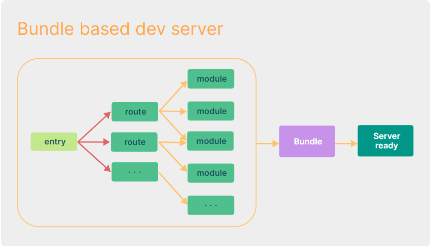
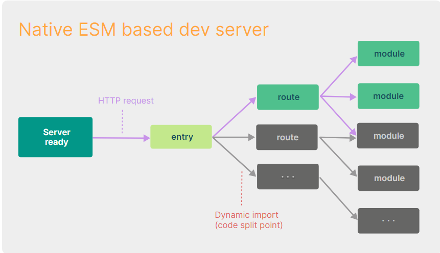
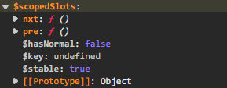

<p></p>

## Vue3简介

- 2020年9月18日，Vue.js发布3.0版本，代号：One Piece（海贼王）
- 耗时2年多、[2600+次提交](https://github.com/vuejs/vue-next/graphs/commit-activity)、[30+个RFC](https://github.com/vuejs/rfcs/tree/master/active-rfcs)、[600+次PR](https://github.com/vuejs/vue-next/pulls?q=is%3Apr+is%3Amerged+-author%3Aapp%2Fdependabot-preview+)、[99位贡献者](https://github.com/vuejs/vue-next/graphs/contributors) 
- github上的tags地址：[https://github.com/vuejs/vue-next/releases/tag/v3.0.0](https://github.com/vuejs/vue-next/releases/tag/v3.0.0)

## Vue3带来了什么

### 1.性能的提升

- 打包大小减少41%

- 初次渲染快55%, 更新渲染快133%

- 内存减少54%

  ......

### 2.源码的升级

- 使用Proxy代替defineProperty实现响应式

- 重写虚拟DOM的实现和Tree-Shaking

  ......

### 3.拥抱TypeScript

- Vue3可以更好的支持TypeScript

### 4.新的特性

1. Composition API（组合API）

   - setup配置
   - ref与reactive
   - watch与watchEffect
   - provide与inject
   - ......
2. 新的内置组件
   - Fragment 
   - Teleport
   - Suspense
3. 其他改变

   - 新的生命周期钩子
   - data 选项应始终被声明为一个函数
   - 移除keyCode支持作为 v-on 的修饰符
   - ......

## 一、创建Vue3.0工程

### 1.使用 vue-cli 创建

官方文档：[https://cli.vuejs.org/zh/guide/creating-a-project.html#vue-create](https://cli.vuejs.org/zh/guide/creating-a-project.html#vue-create)

```bash
## 查看@vue/cli版本，确保@vue/cli版本在4.5.0以上
vue --version
## 安装或者升级你的@vue/cli
npm i -g @vue/cli
## 创建
vue create vue_test
## 启动
cd vue_test
npm run serve
```

### 2.使用 vite 创建

官方文档：[https://v3.cn.vuejs.org/guide/installation.html#vite](https://v3.cn.vuejs.org/guide/installation.html#vite)

vite官网：[https://vitejs.cn](https://vitejs.cn)

- 什么是vite？—— 新一代前端构建工具。
- 优势如下：
  - 开发环境中，无需打包操作，可快速的冷启动。
  - 轻量快速的热重载（HMR）。
  - 真正的按需编译，不再等待整个应用编译完成。
- 传统构建 与 vite构建对比图





```bash
## 创建工程
npm create vite@latest
## 进入工程目录
cd <project-name>
## 安装依赖
npm i
## 运行
npm run dev
```

### 3. vue3的main.js

```js
//引入的不再是Vue构造函数了，引入的是一个名为createApp的工厂函数
//且现在的语法与vue2不兼容，直接使用import vue from 'vue'，vue为undefined
import { createApp } from 'vue'
import App from './App.vue'

//创建应用实例对象——app(类似于之前Vue2中的vm，但app比vm更“轻”)
const app = createApp(App)

//挂载
app.mount('#app')

//createApp(App).mount('#app')
```

## 二、常用 Composition API

官方文档: [https://v3.cn.vuejs.org/guide/composition-api-introduction.html](https://v3.cn.vuejs.org/guide/composition-api-introduction.html)

**VUE3**和**VUE2**的不同点较多，相较于其他的一些小的改动，Vue3采用的**组合式API(Composition API)** 与Vue2采用的 **选项式API(Options API)** 应该是我们自己在编程的时候，体感变动最大的部分，也是需要我们主要适应的部分。

两种 API 风格都能够覆盖大部分的应用场景。它们只是同一个底层系统所提供的两套不同的接口。实际上，**选项式 API** 是在**组合式 API** 的基础上实现的！关于 Vue 的基础概念和知识在它们之间都是通用的。

**选项式 API 以“  ==组件实例== ”的概念为中心** ，对于有面向对象语言背景的用户来说，这通常与基于类的心智模型更为一致。同时，它将响应性相关的细节抽象出来，并强制按照选项来组织代码，从而对**初学者而言更为友好**。

**组合式 API 的核心思想**是直接在函数作用域内定义响应式状态变量，并将从多个函数中得到的状态组合起来处理复杂问题。这种形式更加自由，也需要你对 Vue 的响应式系统有更深的理解才能高效使用。相应的，它的灵活性也使得组织和重用逻辑的模式变得更加强大。

简单一句话总结：旧的选项型API在代码里分割了不同的属性: data,computed属性,methods等等。新的合成型API能让我们用方法（function）来分割，相比于旧的API使用属性来分组，这样代码会更加简便和整洁。组合式API目的是为了解决 Vue2 中“**数据和业务逻辑不分离**”的问题

### 1.拉开序幕的setup

1. 理解：Vue3.0中一个新的配置项，值为一个函数。

2. setup是所有<strong style="color:#DD5145">Composition API（组合API）</strong><i style="color:gray;font-weight:bold">“ 表演的舞台 ”</i>。

3. 组件中所用到的：数据、方法等等，均要配置在setup中。

4. setup函数的两种 ==返回值== ：
   1. 若返回一个对象，则对象中的属性、方法, 在模板中均可以直接使用。（重点关注！）

      ```js
      setup(){
          //数据
          let name = '张三'
          let age = 18
      
          //方法
          function sayHello(){
              alert(`我叫${name}，我${age}岁了，你好啊！`)
          }
          function test2(){
              console.log(name)
              console.log(age)
              console.log(sayHello)
          }
      
          //返回一个对象（常用）
          return {
              name,
              age,
              sayHello,
              test2,
          }
      
          //返回一个函数（渲染函数）
          // return ()=> h('h1','Hello World')
      }
      ```

   2. <span style="color:#aad">若返回一个渲染函数：则可以自定义渲染内容。（了解）</span>

      - 不写`<template>`标签的时候，可以直接代码渲染
   
5. 注意点：
   1. 尽量不要与Vue2.x配置混用
      - Vue2.x配置（data、methos、computed...）中<strong style="color:#DD5145">可以访问到</strong>setup中的属性、方法。
      - 但在setup中<strong style="color:#DD5145">不能访问到</strong>Vue2.x配置（data、methos、computed...）。
      - 如果有重名, setup优先。
   2. setup不能是一个async函数，因为返回值不再是return的对象, 而是promise, 模板看不到return对象中的属性。（后期也可以返回一个Promise实例，但需要Suspense和异步组件的配合）

6. `<script setup>`

   在 `setup()` 函数中手动暴露大量的状态和方法非常繁琐。幸运的是，我们可以通过使用构建工具来简化该操作。当使用单文件组件（SFC）时，我们可以使用 `<script setup>` 来大幅度地简化代码。

   ```vue
   <script setup>
   import { reactive } from 'vue'
   
   const state = reactive({ count: 0 })
   
   function increment() {
     state.count++
   }
   </script>
   
   <template>
     <button @click="increment">
       {{ state.count }}
     </button>
   </template>
   ```

   - `<script setup>`中的顶层的导入和变量声明可在同一组件的模板中直接使用。你可以理解为模板中的表达式和 `<script setup>` 中的代码处在同一个作用域中。

###  2.ref函数

- 作用: 定义一个响应式的数据
- 语法: `const xxx = ref(initValue)`
  - 创建一个包含响应式数据的<strong style="color:#DD5145">引用对象（reference对象，简称ref对象）</strong>。
  - JS中操作数据： `xxx.value`
  - 模板中读取数据: 不需要.value，直接：
  
    ```html
    <div>{{xxx}}</div>
    ```
  
- 备注：
  - 接收的数据可以是：基本类型、也可以是对象类型。
  - 基本类型的数据：响应式依然是靠``Object.defineProperty()``的```get```与```set```完成的。
  - 对象类型的数据：内部 <i style="color:gray;font-weight:bold">“ 求助 ”</i> 了Vue3.0中的一个新函数—— ```reactive```函数。

### 3.reactive函数

- 作用: 定义一个<strong style="color:#DD5145">对象类型</strong>的响应式数据（基本类型不要用它，要用```ref```函数）
- 语法：```const 代理对象= reactive(源对象)```接收一个对象（或数组），返回一个<strong style="color:#DD5145">代理对象（Proxy的实例对象，简称proxy对象）</strong>
- reactive定义的响应式数据是“深层次的”。
- 内部基于 ES6 的 Proxy 实现，通过代理对象操作源对象内部数据进行操作。

```js
setup(){
    //数据
    let person = reactive({
        name:'张三',
        age:18,
        job:{
            type:'前端工程师',
            salary:'30K',
            a:{
                b:{
                    c:666
                }
            }
        },
        hobby:['抽烟','喝酒','烫头']
    })

    //方法
    function changeInfo(){
        person.name = '李四'
        person.age = 48
        person.job.type = 'UI设计师'
        person.job.salary = '60K'
        person.job.a.b.c = 999
        person.hobby[0] = '学习'
    }

    //返回一个对象
    return {
        person,
        changeInfo
    }
}
```

### 4.Vue3.0中的响应式原理

#### vue2.x的响应式

- 实现原理：
  - 对象类型：通过```Object.defineProperty()```对属性的读取、修改进行拦截（数据劫持）。
  
  - 数组类型：通过重写更新数组的一系列方法来实现拦截。（对数组的变更方法进行了包裹）。
  
    ```js
    Object.defineProperty(data, 'count', {
        get () {}, 
        set () {}
    })
    ```

- 存在问题：
  - 新增属性、删除属性, 界面不会更新。
    - `$set()、$delete()`
  - 直接通过下标修改数组, 界面不会自动更新。
    - `.splice()`

#### Vue3.0的响应式

- 实现原理: 
  - 通过Proxy（代理）:  拦截对象中任意属性的变化, 包括：属性值的读写、属性的添加、属性的删除等。
  - 通过Reflect（反射）:  对源对象的属性进行操作。
  - MDN文档中描述的Proxy与Reflect：
    - Proxy：[https://developer.mozilla.org/zh-CN/docs/Web/JavaScript/Reference/Global_Objects/Proxy](https://developer.mozilla.org/zh-CN/docs/Web/JavaScript/Reference/Global_Objects/Proxy)
    
    - Reflect：[https://developer.mozilla.org/zh-CN/docs/Web/JavaScript/Reference/Global_Objects/Reflect](https://developer.mozilla.org/zh-CN/docs/Web/JavaScript/Reference/Global_Objects/Reflect)
    
      ```js
      new Proxy(data, {
      	// 拦截读取属性值
          get (target, prop) {
          	return Reflect.get(target, prop)
          },
          // 拦截设置属性值或添加新属性
          set (target, prop, value) {
          	return Reflect.set(target, prop, value)
          },
          // 拦截删除属性
          deleteProperty (target, prop) {
          	return Reflect.deleteProperty(target, prop)
          }
      })
      
      proxy.name = 'tom'   
      ```

### 5.reactive对比ref

-  从定义数据角度对比：
   -  ref用来定义：==基本类型数据== 。
   -  reactive用来定义：==对象（或数组）类型数据== 。
   -  备注：ref也可以用来定义 ==对象（或数组）类型数据== , 它内部会自动通过```reactive```转为 ==代理对象== 。
-  从原理角度对比：
   -  ref通过``Object.defineProperty()``的```get```与```set```来实现响应式（数据劫持）。
   -  reactive通过使用 ==Proxy== 来实现响应式（数据劫持）, 并通过 ==Reflect== 操作 ==源对象== 内部的数据。
-  从使用角度对比：
   -  ref定义的数据：操作数据 ==需要== ```.value```，读取数据时模板中直接读取 ==不需要== ```.value```。
   -  reactive定义的数据：操作数据与读取数据：==均不需要== ```.value```。

### 6.setup的两个注意点

setup执行的时机
- 在`beforeCreate`之前执行一次，this是`undefined`。

setup的 ==参数==
- `props`：值为对象，包含：组件外部传递过来，且 ==组件内部声明接收了== 的属性。

- `context`：上下文对象
  
  - `attrs`: 值为对象，包含：组件外部传递过来，但 ==没有在props配置中声明== 的属性, 相当于 ```this.$attrs```。
  
  - `slots`: 收到的插槽内容, 相当于 ```this.$slots```。
  
  - `emit`: 分发自定义事件的函数, 相当于 ```this.$emit```。
  
  - `expose`:  函数用于显式地限制该组件暴露出的属性。
  
    - 我们可以在父组件中引用子组件对象，而在子组件对象中的内容，应该都可以算作子组件的相关属性和函数。就应该能访问的到。但是出于安全性考虑，默认直接访问是关闭的，如果要访问，可以将子组件中想要被父组件访问的内容进行暴露就可以了。
  
      ```js
      setup(props,{expose}) { 
          let username = "rose";
          let count = ref(1);
          let increment = () => ++count.value;
          let decrement = () => --count.value;
          expose({
              increment,username
          })
          return {count,username,increment,decrement}
      }
      ```

> **props**
>
> `defineProps` 是一个仅 `<script setup>` 中可用的编译宏命令，并不需要显式地导入。声明的 props 会自动暴露给模板。`defineProps` 会返回一个对象，其中包含了可以传递给组件的所有 props:
>
> ```vue
> <!-- BlogPost.vue -->
> <script setup>
> defineProps(['title'])
> </script>
> 
> <template>
> <h4>{{ title }}</h4>
> </template>
> ```
> **emit**
>
> 和 `defineProps` 类似，`defineEmits` 仅可用于 `<script setup>` 之中，并且不需要导入，它返回一个等同于 `$emit` 方法的 emit 函数。它可以被用于在组件的 `<script setup>` 中抛出事件，因为此处无法直接访问 `$emit`：
>
> ```vue
> <script setup>
> const emit = defineEmits(['enlarge-text'])
> 
> emit('enlarge-text')
> </script>
> ```
> **attrs和slots**
>
> 而`attrs`和`slots`在 使用`<script setup>` 时，可以直接在模板中通过 `$slots` 和 `$attrs` 来访问，如果代码中需要，也可以使用 `useSlots` 和 `useAttrs` 两个辅助函数。
>
> ```vue
> <script setup>
> import { useSlots, useAttrs } from 'vue'
> 
> const slots = useSlots()
> const attrs = useAttrs()
> </script>
> ```
> **expose**
>
> 可以通过 `defineExpose` 编译器宏来显式指定在 `<script setup>` 组件中要暴露出去的属性：
>
> ```vue
> <script setup>
> import { ref } from 'vue'
> 
> const a = 1
> const b = ref(2)
> 
> defineExpose({
> a,
> b
> })
> </script>
> ```

### 7. slot插槽

在`vue2`中我们有以下两种API访问父组件传递的插槽。

- `vm.$slots`：用来访问父组件传递的 ==静态插槽== ，包含对应插槽名称的vnode节点数组


- `vm.$scopedSlots`：用来访问 ==作用域插槽== ，包含一个返回相应 VNode 的函数。



> `slots`是将父组件编译生成的插槽VNode，在渲染子组件时，放置到对应子组件渲染VNode树中。
>
> `scopedslots`是将父组件中插槽内容编译成一个 ==函数== ，在渲染子组件时，传入子组件props（作为参数），生成对应的`VNode`。通过编译成函数，可以将父组件中定义的插槽内容作为动态的函数参数传递给子组件。子组件可以接收这个函数参数并在合适的时候执行它，生成相应的VNode。

自2.6.0后，所有的 `$slots` 都会作为函数暴露在 `$scopedSlots` 中，所以上图中也包含了静态插槽pre；基于此，在vue3中将这两个API进行了统一，合并为：`$slots`。

### 8.计算属性与监视

#### 1.computed函数

- 与Vue2.x中computed配置功能一致

- 写法

  ```js
  import {computed} from 'vue'
  
  setup(){
      ...
  	//计算属性——简写
      let fullName = computed(()=>{
          return person.firstName + '-' + person.lastName
      })
      //计算属性——完整
      let fullName = computed({
          get(){
              return person.firstName + '-' + person.lastName
          },
          set(value){
              const nameArr = value.split('-')
              person.firstName = nameArr[0]
              person.lastName = nameArr[1]
          }
      })
  }
  ```

#### 2.watch函数

- 与Vue2.x中watch配置功能一致

- 两个小“坑”：

  - 监视reactive定义的响应式数据时：oldValue无法正确获取、强制开启了深度监视（deep配置失效）。
  - 监视reactive定义的响应式数据中某个属性时：deep配置有效。
  
  ```js
  //情况一：监视ref定义的响应式数据
  watch(sum,(newValue,oldValue)=>{
  	console.log('sum变化了',newValue,oldValue)
  },{immediate:true})
  
  //情况二：监视多个ref定义的响应式数据
  watch([sum,msg],(newValue,oldValue)=>{
  	console.log('sum或msg变化了',newValue,oldValue)
  }) 
  
  /* 情况三：监视reactive定义的响应式数据
  			若watch监视的是reactive定义的响应式数据，则无法正确获得oldValue！！
  			若watch监视的是reactive定义的响应式数据，则强制开启了深度监视 
  */
  watch(person,(newValue,oldValue)=>{
  	console.log('person变化了',newValue,oldValue)
  },{immediate:true,deep:false}) //此处的deep配置不再奏效
  
  //情况四：监视reactive定义的响应式数据中的某个属性
  watch(()=>person.job,(newValue,oldValue)=>{
  	console.log('person的job变化了',newValue,oldValue)
  },{immediate:true,deep:true}) 
  
  //情况五：监视reactive定义的响应式数据中的某些属性
  watch([()=>person.job,()=>person.name],(newValue,oldValue)=>{
  	console.log('person的job变化了',newValue,oldValue)
  },{immediate:true,deep:true})
  
  //特殊情况
  watch(()=>person.job,(newValue,oldValue)=>{
      console.log('person的job变化了',newValue,oldValue)
  },{deep:true}) //此处由于监视的是reactive素定义的对象中的某个属性，所以deep配置有效
  ```

#### 3.watchEffect函数

- watch的套路是：既要指明监视的属性，也要指明监视的回调。

- watchEffect的套路是：不用指明监视哪个属性，监视的回调中用到哪个属性，那就监视哪个属性。

- watchEffect有点像computed：

  - 但computed注重的计算出来的值（回调函数的返回值），所以必须要写返回值。
  - 而watchEffect更注重的是过程（回调函数的函数体），所以不用写返回值。

  ```js
  //watchEffect所指定的回调中用到的数据只要发生变化，则直接重新执行回调。
  watchEffect(()=>{
      const x1 = sum.value
      const x2 = person.age
      console.log('watchEffect配置的回调执行了')
  })
  ```

**回调的触发时机**

当你更改了响应式状态，它可能会同时触发 Vue 组件更新和侦听器回调。

类似于组件更新，用户创建的侦听器回调函数也会被批量处理以避免重复调用。例如，如果我们同步将一千个项目推入被侦听的数组中，我们可能不希望侦听器触发一千次。

默认情况下，侦听器回调会在父组件更新 (如有) **之后**、所属组件的 DOM 更新**之前**被调用。这意味着如果你尝试在侦听器回调中访问所属组件的 DOM，那么 DOM 将处于更新前的状态。

如果想在侦听器回调中能访问被 Vue 更新**之后**的所属组件的 DOM，你需要指明 `flush: 'post'` 选项：

```js
watch(source, callback, {
  flush: 'post'
})

watchEffect(callback, {
  flush: 'post'
})
```

#### 4. ref属性的问题

众所周知，在vue2中，我们可以在一个dom元素上添加ref属性，然后通过组件实例的`$refs`访问到指定的这个dom元素从而进行一些dom操作。在vue3中已经取消了这个api，为了通过组合式 API 获得该模板引用，我们需要声明一个同名的 ref：

**字符串值**

```vue
<script setup>
import { ref, onMounted } from 'vue'

// 声明一个 ref 来存放该元素的引用
// 必须和模板里的 ref 同名
const input = ref(null)

onMounted(() => {
  input.value.focus()
})
</script>

<template>
  <input ref="input" />
</template>
```

**函数**

除了使用字符串值作名字，`ref` attribute 还可以绑定为一个函数，会在每次组件更新时都被调用。该函数会收到元素引用作为其第一个参数：

```vue
<input :ref="(el) => { /* 将 el 赋值给一个数据属性或 ref 变量 */ }">
```

注意我们这里需要使用动态的 `:ref` 绑定才能够传入一个函数。当绑定的元素被卸载时，函数也会被调用一次，此时的 `el` 参数会是 `null`。你当然也可以绑定一个组件方法而不是内联函数。

**组件**

模板引用也可以被用在一个子组件上。这种情况下引用中获得的值是组件实例：

```vue
<script setup>
import { ref, onMounted } from 'vue'
import Child from './Child.vue'

const child = ref(null)

onMounted(() => {
  // child.value 是 <Child /> 组件的实例
})
</script>

<template>
  <Child ref="child" />
</template>
```

如果一个子组件使用的是选项式 API 或没有使用 `<script setup>`，被引用的组件实例和该子组件的 `this` 完全一致，这意味着父组件对子组件的每一个属性和方法都有完全的访问权。这使得在父组件和子组件之间创建紧密耦合的实现细节变得很容易，当然也因此，应该只在绝对需要时才使用组件引用。大多数情况下，你应该首先使用标准的 props 和 emit 接口来实现父子组件交互。

有一个例外的情况，使用了 `<script setup>` 的组件是**默认私有**的：一个父组件无法访问到一个使用了 `<script setup>` 的子组件中的任何东西，除非子组件在其中通过 `defineExpose` 宏显式暴露：

```vue
<script setup>
import { ref } from 'vue'

const a = 1
const b = ref(2)

// 像 defineExpose 这样的编译器宏不需要导入
defineExpose({
  a,
  b
})
</script>
```

当父组件通过模板引用获取到了该组件的实例时，得到的实例类型为 `{ a: number, b: number }` (ref 都会自动解包，和一般的实例一样)。

### 9.生命周期

**vue2.x生命周期**

<p></p>

**vue3.x生命周期**

<p></p>


- Vue3.0中可以继续使用Vue2.x中的生命周期钩子，但有两个被更名：
  - ```beforeDestroy```改名为 ```beforeUnmount```
  - ```destroyed```改名为 ```unmounted```
- Vue3.0也提供了 Composition API 形式的生命周期钩子，与Vue2.x中钩子对应关系如下：
  - `beforeCreate`===>`setup()`
  - `created`=\==>`setup()`
  - `beforeMount` ===>`onBeforeMount`
  - `mounted`\===>`onMounted`
  - `beforeUpdate`===>`onBeforeUpdate`
  - `updated` \===>`onUpdated`
  - `beforeUnmount` ===>`onBeforeUnmount`
  - `unmounted` ===>`onUnmounted`

### 10.自定义hook函数

- 什么是hook？—— 本质是一个函数，把setup函数中使用的Composition API进行了封装。

- 类似于vue2.x中的`mixin`。

- 自定义hook的优势: 复用代码, 让setup中的逻辑更清楚易懂。


> 组合式函数相对于无渲染组件的主要优势是：组合式函数不会产生额外的组件实例开销。当在整个应用中使用时，由无渲染组件产生的额外组件实例会带来无法忽视的性能开销。
>
> 我们推荐在纯逻辑复用时使用组合式函数，在需要同时复用逻辑和视图布局时使用无渲染组件。

### 11.toRef

- 作用：创建一个 ref 对象，其value值指向另一个对象中的某个属性。
- 语法：`const name = toRef(person,'name')`
- 应用:   要将响应式对象中的某个属性单独提供给外部使用时。


- 扩展：```toRefs``` 与```toRef```功能一致，但可以批量创建多个 ref 对象，语法：```toRefs(person)```


## 三、其它 Composition API

### 1.shallowReactive 与 shallowRef

- `shallowReactive`：只处理对象最外层属性的响应式（浅响应式）。
- `shallowRef`：只处理基本数据类型的响应式, 不进行对象的响应式处理。

- 什么时候使用?
  -  如果有一个对象数据，结构比较深, 但变化时只是外层属性变化 ===> `shallowReactive`。
  -  如果有一个对象数据，后续功能不会修改该对象中的属性，而是生新的对象来替换 ===> `shallowRef`。

### 2.readonly 与 shallowReadonly

- readonly: 让一个响应式数据变为只读的（==深只读==）。
- shallowReadonly：让一个响应式数据变为只读的（==浅只读==）。
- 应用场景: 不希望数据被修改时。

```javascript
person =  readonly(person)
sum = shallowReadonly(sum)
```

### 3.toRaw 与 markRaw

- toRaw：
  - 作用：将一个由```reactive```生成的<strong style="color:orange">响应式对象</strong>转为<strong style="color:orange">普通对象</strong>。
  - 使用场景：用于读取响应式对象对应的普通对象，对这个普通对象的所有操作，不会引起页面更新。
- markRaw：
  - 作用：标记一个对象，使其永远不会再成为响应式对象。
  - 应用场景:
    1. 有些值不应被设置为响应式的，例如复杂的第三方类库等。
    2. 当渲染具有不可变数据源的大列表时，跳过响应式转换可以提高性能。

### 4.customRef

- 作用：创建一个自定义的 ref，并对其依赖项跟踪和更新触发进行显式控制。

- 实现防抖效果：

  ```vue
  <template>
  	<input type="text" v-model="keyword">
  	<h3>{{keyword}}</h3>
  </template>
  
  <script>
  	import {ref,customRef} from 'vue'
  	export default {
  		name:'Demo',
  		setup(){
  			// let keyword = ref('hello') //使用Vue准备好的内置ref
  			//自定义一个myRef
  			function myRef(value,delay){
  				let timer
  				//通过customRef去实现自定义
  				return customRef((track,trigger)=>{
  					return{
  						get(){
  							track() //告诉Vue这个value值是需要被“追踪”的
  							return value
  						},
  						set(newValue){
  							clearTimeout(timer)
  							timer = setTimeout(()=>{
  								value = newValue
  								trigger() //告诉Vue去更新界面
  							},delay)
  						}
  					}
  				})
  			}
  			let keyword = myRef('hello',500) //使用程序员自定义的ref
  			return {
  				keyword
  			}
  		}
  	}
  </script>
  ```


### 5.provide 与 inject

**prop 逐级透传**


**provide和inject**


- 作用：实现<strong style="color:#DD5145">祖与后代组件间</strong>通信

- 套路：父组件有一个 `provide` 选项来提供数据，后代组件有一个 `inject` 选项来开始使用这些数据

- 具体写法：

  1. 祖组件中：

     ```js
     setup(){
     	......
         let car = reactive({name:'奔驰',price:'40万'})
         provide('car',car)
         ......
     }
     ```

  2. 后代组件中：

     ```js
     setup(props,context){
     	......
         const car = inject('car')
         return {car}
     	......
     }
     ```

### 6.响应式数据的判断

- `isRef`: 检查一个值是否为一个 ref 对象
- `isReactive`: 检查一个对象是否是由 `reactive` 创建的响应式代理
- `isReadonly`: 检查一个对象是否是由 `readonly` 创建的只读代理
- `isProxy`: 检查一个对象是否是由 `reactive` 或者 `readonly` 方法创建的代理

## 四、Composition API 的优势

### 1.Options API 存在的问题

使用传统OptionsAPI中，新增或者修改一个需求，就需要分别在`data`，`methods`，`computed`里修改 。

<div style="overflow: hidden;">
    <div style="width:64%;height:370px;overflow:hidden;float:left">
        
    </div>
    <div style="width:32%;height:370px;overflow:hidden;float:right">
         
    </div>
</div>

### 2.Composition API 的优势

我们可以更加优雅的组织我们的代码，函数。让相关功能的代码更加有序的组织在一起。

<div style="overflow: hidden;">
    <div style="width:50%;height:340px;overflow:hidden;float:left">
        
    </div>
    <div style="width:49%;height:340px;overflow:hidden;float:right">
        
    </div>
</div>

## 五、新的组件

### 1.Fragment

- 在Vue2中: 组件必须有一个根标签
- 在Vue3中: 组件可以没有根标签, 内部会将多个标签包含在一个`Fragment`虚拟元素中
- 好处: 减少标签层级, 减小内存占用

### 2.Teleport

```typescript
interface TeleportProps {
  /**
   * 必填项。指定目标容器。
   * 可以是选择器或实际元素。
   */
  to: string | HTMLElement
  /**
   * 当值为 `true` 时，内容将保留在其原始位置
   * 而不是移动到目标容器中。
   * 可以动态更改。
   */
  disabled?: boolean
}
```

- 什么是Teleport？—— `Teleport` 是一种能够将我们的 ==组件html结构== 移动到指定位置的技术。

  ```vue
  <teleport to="移动位置">
  	<div v-if="isShow" class="mask">
  		<div class="dialog">
  			<h3>我是一个弹窗</h3>
  			<button @click="isShow = false">关闭弹窗</button>
  		</div>
  	</div>
  </teleport>
  ```

  - 移动位置处可以使用css选择器

- ```vue
  <Teleport to="#some-id" />
  <Teleport to=".some-class" />
  <Teleport to="[data-teleport]" />
  ```

### 3.Suspense

等待异步组件时渲染一些额外内容，让应用有更好的用户体验

使用步骤：

- 异步引入组件

  ```js
  import {defineAsyncComponent} from 'vue'
  const Child = defineAsyncComponent(()=>import('./components/Child.vue'))
  ```

- 使用```Suspense```包裹组件，并配置好```default``` 与 ```fallback```

  ```vue
  <template>
  	<div class="app">
  		<h3>我是App组件</h3>
  		<Suspense>
  			<template v-slot:default>
  				<Child/>
  			</template>
  			<template v-slot:fallback>
  				<h3>加载中.....</h3>
  			</template>
  		</Suspense>
  	</div>
  </template>
  ```

## 六、其他

### 1.全局API的转移

Vue 2.x 有许多全局 API 和配置。
- 例如：注册全局组件、注册全局指令等。

  ```js
  //注册全局组件
  Vue.component('MyButton', {
    data: () => ({
      count: 0
    }),
    template: '<button @click="count++">Clicked {{ count }} times.</button>'
  })
  
  //注册全局指令
  Vue.directive('focus', {
    inserted: el => el.focus()
  }
  ```

Vue3.0中对这些API做出了调整，将全局的API，即：`Vue.xxx`调整到应用实例（`app`）上

| 2.x 全局 API（```Vue```） | 3.x 实例 API (`app`)        |
| ------------------------- | --------------------------- |
| Vue.config.xxxx           | app.config.xxxx             |
| Vue.config.productionTip  | ==移除==                    |
| Vue.component             | app.component               |
| Vue.directive             | app.directive               |
| Vue.mixin                 | app.mixin                   |
| Vue.use                   | app.use                     |
| Vue.prototype             | app.config.globalProperties |

### 2.其他改变

data选项应始终被声明为一个函数。

过渡类名的更改：

- Vue2.x写法

  ```css
  .v-enter,
  .v-leave-to {
    opacity: 0;
  }
  .v-leave,
  .v-enter-to {
    opacity: 1;
  }
  ```

- Vue3.x写法

  ```css
  .v-enter-from,
  .v-leave-to {
    opacity: 0;
  }
  
  .v-leave-from,
  .v-enter-to {
    opacity: 1;
  }
  ```

- <strong style="color:#DD5145">移除</strong>keyCode作为 v-on 的修饰符，同时也不再支持```config.keyCodes```

- <strong style="color:#DD5145">移除</strong>```v-on.native```修饰符

  - 父组件中绑定事件

    ```vue
    <my-component
      v-on:close="handleComponentEvent"
      v-on:click="handleNativeClickEvent"
    />
    ```

  - 子组件中声明自定义事件

    ```vue
    <script>
      export default {
        emits: ['close']
      }
    </script>
    ```

- <strong style="color:#DD5145">移除</strong>过滤器（filter）

  > 过滤器虽然这看起来很方便，但它需要一个自定义语法，打破大括号内表达式是 “只是 JavaScript” 的假设，这不仅有学习成本，而且有实现成本！建议用方法调用或计算属性去替换过滤器。

- 关于`defineComponent`

  - 这个函数，其实就是因为`Typescript`而存在的

    > 为了让 TypeScript 正确地推导出组件选项内的类型，我们需要通过 `defineComponent()` 这个全局 API 来定义组件

    带给我们唯一的好处就是，可以在编写组件的时候，`typescript`可以更加清楚的进行类型推断的提示，当然，现在我们使用的**VS Code**已经不需要纠结这个问题，只要你是TS的项目，写没写这个 `defineComponent`，**VS Code**都会帮我们提示。