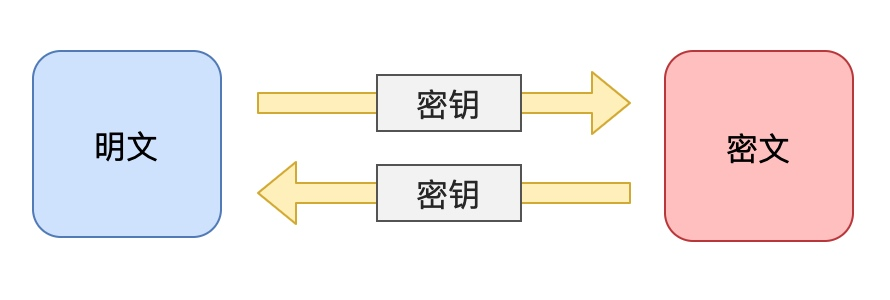
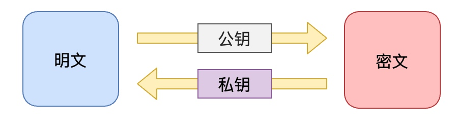

# 加密

## 对称加密

对称加密是使用相同的密钥来加密和解密数据。简单来说，对称加密是将明文数据使用密钥进行加密，得到密文数据，然后使用相同的密钥对密文数据进行解密，还原为明文数据。

举个例子，假设Alice想要向Bob发送一条加密消息。他们可以使用对称加密算法，例如Advanced Encryption Standard (AES)，来保护消息的机密性。Alice和Bob首先要协商一个密钥，然后Alice使用这个密钥将消息加密，并将密文发送给Bob。Bob使用相同的密钥对密文进行解密以获取原始的明文消息。

对称加密的优点是加密和解密速度非常快，适合用于大量数据的加密。然而，对称加密也有一个缺点，那就是密钥的管理问题。由于加密和解密使用相同的密钥，所以必须确保密钥不被泄露或被未经授权的人使用。




> **常见算法：** DES、3DES、TDEA、Blowfish、RC5、IDEA
> **优点：** 加密、解密速度快，适合对大数据量进行加密
> **缺点：** 在网络中需要分发密钥，增加了密钥被窃取的风险

## 非对称加密

非对称加密与对称加密不同，它需要使用两个不同的密钥：**公钥和私钥**。公钥可以公开发布，任何人都可以获得，而私钥只有密钥持有者才能拥有。非对称加密通常用于保护通信的安全性，例如在网上进行购物、银行转账等操作时，就需要使用非对称加密来保证数据传输的安全性。

举个例子，假设小明想要给小红发送一封加密的消息。小明可以使用小红的公钥进行加密，然后将加密后的消息发送给小红。小红可以使用自己的私钥进行解密，从而获取原始消息。由于只有小红拥有私钥，因此只有小红能够解密消息，保证了消息传输的安全性。

另外，非对称加密还可以用于数字签名，数字签名是一种验证数据完整性和真实性的方法。数字签名使用私钥对数据进行签名，然后使用公钥进行验证，从而确保数据没有被篡改或伪造。

总的来说，非对称加密使用公钥和私钥进行加密和解密，可以保证数据传输的安全性和完整性，是网络通信中常用的加密方式。



> 常见算法：RSA、Rabin、DSA、ECC、Elgamal、D-H
> 优点：安全（私钥仅被一方保存，不用于网络传输）
> 缺点：仅能一方进行解密


## 摘要/哈希/散列

摘要、哈希和散列加密算法的具体实现方式因算法不同而异，但它们的基本原理都是将任意长度的数据转换为固定长度的输出数据。

- **MD5摘要算法：** MD5算法将输入数据分成512位的块，然后对每个块进行处理，最终得到128位的摘要值。例如，对"Hello World"进行MD5摘要加密，得到的摘要值为5eb63bbbe01eeed093cb22bb8f5acdc3。

- **SHA-256哈希算法：** SHA-256算法将输入数据分成512位的块，然后对每个块进行处理，最终得到256位的哈希值。例如，对"Hello World"进行SHA-256哈希加密，得到的哈希值为b94d27b9934d3e08a52e52d7da7dabfac484efe37a5380ee9088f7ace2efcde9。

- **散列算法：** 散列算法将输入数据分成多个块，然后对每个块进行哈希计算。例如，SHA-256算法可以使用散列算法来提高加密的强度和安全性。对于密码"123456"，可以使用散列算法将其转换为多个块，然后对每个块进行SHA-256哈希计算，最终得到的哈希值可以用于保护密码的存储。


> 常见算法：MD4、MD5、SHA-1、SHA-256、SHA-512
> 优点：密文占用空间小（定长的短字符串）；难以被破解
> 缺点：无法解密


**MD5加密使用：**
```js
npm i md5
```

```js
const md5 = require('md5');

const origin = 'lorem ipsum dolor sit amet consectetur adipisicing elit. Quisquam, quod.'
  

const result = md5(origin);
console.log(result);
```