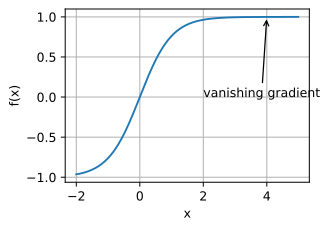

## 一、导入数据集

### 1. 处理数据集

> `torch.utils.data.TensorDataset(*tensors)`

这是 PyTorch 中的一个数据集类，用于针对**张量数据**创建数据集，即<strong style="color:red">将张量表示的数据封装为数据集对象</strong>，以便于之后用于训练模型。

该类接受一个或多个张量作为参数，其中每个张量表示数据集中的一个特征。例如，如果一个数据集包含图像和相应的标签，则需要使用两个张量来描述数据集，一个张量表示图像数据，另一个张量表示标签数据。

该类的初始化函数将所有参数合并为一个张量元组，即 `(*tensors)`，同时还可以定义一些额外的参数，例如 `transform=None` 用于对数据进行转换，`target_transform=None` 用于对标签进行转换。

例如，以下代码创建了一个 `TensorDataset` 对象，包含数据 `X` 和标签 `y`：

```python
import torch
from torch.utils.data import TensorDataset
X = torch.randn(100, 10)
y = torch.randint(0, 2, (100,))
ds = TensorDataset(X, y)
```

在上面的代码中，我们创建了一个大小为 `(100, 10)` 的张量 `X`，和一个大小为 `(100,)` 的张量 `y`，分别代表输入数据和标签。然后，我们创建了一个 `TensorDataset` 对象 `ds`，将 `X` 和 `y` 作为参数传入。这样，我们就将数据 `X` 与标签 `y` 封装为了一个 PyTorch 的数据集对象，即 `ds`。

> `torch.utils.data.Dataset`

这是一个抽象类，用作自定义数据集的基础。如果要**自定义数据集**，需要继承它并实现其中的两个方法：`len()` 和 `getItem()`。

`len()` 方法返回数据集中的样本数量，`getitem()` 方法传递样本索引并返回样本及其标签（如果不需要标签，则可以选择省略）。在`__init__`方法中，我们可以将数据集读取到内存中，可以使用 Pandas 库等来读取 CSV 格式的数据，也可以通过自己编写函数读取图像数据。

```python
import torch
from torch.utils.data import Dataset
import pandas as pd
from PIL import Image

class MyCustomDataset(Dataset):
    def __init__(self, csv_file, root_dir, transform=None):
        """
        csv_file (string): 文件路径，包括标签和图像信息。
        root_dir (string): 图像所在的目录。
        transform (callable, optional): 可选的图片转换(自定义或PyTorch中的)操作来增强数据。
        """
        self.annotations = pd.read_csv(csv_file)
        self.root_dir = root_dir
        self.transform = transform

    def __len__(self):
        return len(self.annotations)

    def __getitem__(self, index):
        img_path = os.path.join(self.root_dir, self.annotations.iloc[index, 0])
        image = Image.open(img_path)
        label = self.annotations.iloc[index, 1]

        if self.transform:
            image = self.transform(image)

        return (image, label)
```

- 在训练模型时，我们可以通过 `DataLoader` 类来使用 `TensorDataset` 或者`Dataset`对象，从而实现批量加载数据，并且可以进行数据增强和多线程加载等操作。

> `torch.utils.data.DataLoader(dataset, batch_size=1, shuffle=False, sampler=None, num_workers=0, collate_fn=None, pin_memory=False, drop_last=False)`

这是 PyTorch 中用于**数据加载**的工具类，用于<strong style="color:red">在训练过程中批量加载数据，进行数据增强、数据划分和多线程等操作</strong>。

- `dataset`: 加载数据所在的数据集。
- `batch_size`: 批处理大小。
- `shuffle`: 是否打乱数据。
- `sampler`: 样本抽样方式，可以自定义。
- `num_workers`: 线程的数量，0 表示不使用多线程。
- `collate_fn`: 自定义的 batch 操作。
- `pin_memory`: 是否将数据保存到 CUDA 的固定内存上，提高 GPU 效率。
- `drop_last`: 如果 dataset 中数据总数不能被 batch_size 整除，则 drop_last 如果为 True，则将多余的数据删除；否则放到最后一个 batch 里去。

例如，以下代码展示了如何使用 `DataLoader` 加载一个 `TensorDataset` 对象：

```python
import torch
from torch.utils.data import TensorDataset, DataLoader

X = torch.randn(100, 10)
y = torch.randint(0, 2, (100,))
ds = TensorDataset(X, y)

loader = DataLoader(ds, batch_size=10, shuffle=True)

for batch_idx, (data, target) in enumerate(loader):
    # 进行训练或推理的代码    pass
```

在上面的代码中，我们首先创建了一个大小为 `(100, 10)` 的数据张量 `X` 和大小为 `(100,)` 的标签张量 `y`，然后使用 `TensorDataset` 将这两个张量封装成一个数据集 `ds`。

接着，我们使用 `DataLoader` 对象 `loader` 加载数据集，批处理大小为 10，shuffle 为 True 表示每个 epoch 都会对数据进行随机打乱。在训练模型时，我们可以通过 `enumerate` 函数对 `loader` 进行迭代，通过 `(data, target)` 获取每个批次的输入数据和标签数据，进行模型的训练和推理。

以下代码展示使用`DataLoader` 加载一个 `Dataset` 对象：

```python
# 创建自定义数据集
custom_dataset = MyCustomDataset(data,csv_file, root_dir)

# 使用 DataLoader 加载数据
dataloader = DataLoader(custom_dataset, batch_size=2, shuffle=True)

# 迭代 DataLoader 并打印数据和标签
for inputs, labels in dataloader:
    print(inputs, labels)
```

### 2. 集成的数据集

> `torchvision.datasets`

`torchvision` 是 PyTorch 中的一个视觉处理库，提供了数据集、图片变换等一系列图像处理操作。

`torchvision.datasets` 中包含了一些常用的数据集，例如 `MNIST、CIFAR10、CIFAR100、ImageNet` 等。这些数据集通常是用于测试和比较不同模型的性能，同时也可以用于训练模型。

使用 `torchvision.datasets` 可以方便地下载、加载和预处理这些常用数据集。常用函数和参数如下：

- `torchvision.datasets.MNIST`

  ：加载 MNIST 数据集。

  - `root`：MNIST 数据集的根目录。
  - `train`：选择是否加载训练集，默认为 True。
  - `transform`：数据预处理函数，例如缩放、剪裁、随机切割等。
  - `target_transform`：标签数据的预处理函数。
  - `download`：是否下载 MNIST 数据集。如果数据已经下载过，则会直接读取本地数据。

- `torchvision.datasets.CIFAR10`：加载 CIFAR10 数据集，参数和 MNIST 数据集类似。

例如，以下代码给出了如何使用 `torchvision.datasets` 加载 MNIST 数据集并进行数据预处理：

```python
import torchvision.datasets as datasets
import torchvision.transforms as transforms
# 数据预处理，将输入数据放缩到 (0, 1) 范围内
transform = transforms.Compose(
    [transforms.ToTensor(),
     transforms.Normalize((0.5,), (0.5,))])
# 下载和加载数据集
train_data = datasets.MNIST('data/MNIST', train=True, download=True, transform=transform) test_data = datasets.MNIST('data/MNIST', train=False, download=True, transform=transform)
```

在上面的代码中，我们首先定义了一个数据预处理函数 `transform`，将输入数据放缩到 (0, 1) 范围内。然后，我们使用 `datasets.MNIST` 来下载和加载 MNIST 数据集，其中传入了一些参数，例如 `root` 表示数据存放的根目录，`train` 表示加载训练数据集，`transform` 是数据预处理函数。

最后，我们得到了 `train_data` 和 `test_data` 两个数据集对象，分别用于模型的训练和测试。

## 二、优化算法

### 1. 训练优化中的问题

**局部最小值**

深度学习模型的目标函数通常有许多局部最优解。当优化问题的数值解接近局部最优值时，随着目标函数解的梯度接近或变为零，通过最终迭代获得的数值解可能仅使目标函数*局部*最优，而不是*全局*最优。只有一定程度的噪声可能会使参数跳出局部最小值。事实上，这是小批量随机梯度下降的有利特性之一。


**鞍点**

除了局部最小值之外，鞍点是梯度消失的另一个原因。_鞍点_（saddle point）是指函数的所有梯度都消失但既不是全局最小值也不是局部最小值的任何位置。考虑这个函数 f(x)=x^3。它的一阶和二阶导数在 x=0 时消失。这时优化可能会停止，尽管它不是最小值。


**梯度消失**

假设我们想最小化函数$f(x)=tanh⁡(x)$，然后我们恰好从$x=4$开始。正如我们所看到的那样，f 的梯度接近零。更具体地说，$f′(x)=1−tanh^2⁡(x)$，因此是$f′(4)=0.0013$。因此，在我们取得进展之前，优化将会停滞很长一段时间。事实证明，这是在引入 ReLU 激活函数之前训练深度学习模型相当棘手的原因之一。



### 2. 优化算法

**随机梯度下降**

> `torch.optim.SGD(params, lr, momentum=0, dampening=0, weight_decay=0, nesterov=False)`

`torch.optim.SGD(params, lr, momentum=0, dampening=0, weight_decay=0, nesterov=False)` 是 PyTorch 中的一个优化器类，实现了随机梯度下降（SGD）算法。该算法是常用的优化算法之一，通过计算当前梯度和历史梯度的加权平均值来更新模型参数。

- `params`：待优化的参数。
- `lr`：学习率，控制每次更新的步长大小。
- `momentum`：动量（Momentum）因子，加速优化过程，防止参数在更新方向改变时来回摆动。默认值为 0。
- `dampening`：动量的抑制因子，范围为 [0, 1]。默认值为 0。
- `weight_decay`：权重衰减因子，用于控制模型复杂度。默认为 0，表示不使用权重衰减。
- `nesterov`：是否使用 Nesterov 加速梯度，即使用当前位置的动量项进行梯度估计，可以提高优化效果。默认值为 False。

例如，以下代码给出了如何使用 `torch.optim.SGD` 将模型的权重向量 w 进行随机梯度下降更新：

```python
import torch
import torch.optim as optim

model = MyModel()
optimizer = optim.SGD(model.parameters(), lr=0.01, momentum=0.9)

for inputs, labels in data_loader:
    optimizer.zero_grad()
    loss = loss_fn(model(inputs), labels)
    loss.backward()
    optimizer.step()
```

在上面的代码中，我们首先定义了一个模型 `MyModel`，然后使用 `model.parameters()` 获取模型的参数，传入 `optim.SGD()` 函数中创建一个 `SGD` 优化器对象 `optimizer`。在模型的训练过程中，我们使用 `optimizer.zero_grad()` 来清空历史梯度，然后进行前向传播和反向传播，最后通过 `optimizer.step()` 来更新模型的参数。

## 三、网络层结构

### 1. 展平层

`nn.Flatten()` 是 PyTorch 中的一个层（layer），用于将输入张量展平成一个向量，例如将一个大小为 `(n, c, h, w)` 的四维张量展平为一个大小为 `(n, c*h*w)` 的二维张量。

这个操作在神经网络中经常用到，通常出现在卷积和池化层后以便将其输出进入全连接层。具体来说，当卷积和池化层的输出为四维张量，而全连接层的输入为二维张量时，这时就需要使用 `nn.Flatten()` 来将张量展平为一个向量。

例如，以下代码演示了如何使用 `nn.Flatten()`：

```python
import torch.nn as nn
model = nn.Sequential(
    nn.Conv2d(in_channels=3, out_channels=32, kernel_size=3, padding=1),
    nn.ReLU(),
    nn.MaxPool2d(kernel_size=2),
    nn.Conv2d(in_channels=32, out_channels=64, kernel_size=3, padding=1),
    nn.ReLU(),
    nn.MaxPool2d(kernel_size=2),
    nn.Flatten(),
    nn.Linear(in_features=64*8*8, out_features=10)
)
```

在上面的代码中，我们定义了一个简单的 CNN 模型，其中包含了两个卷积层、两个 ReLU 激活层和两个 MaxPool 层。这些层的输出都是四维张量，因此我们需要在最后一个 MaxPool2d 层之后使用 `nn.Flatten()` 层将输出张量展平成二维张量，然后才能进入全连接层进行分类。

### 2. 卷积层

`nn.Conv2d`是 PyTorch 中用于定义二维卷积层的函数。它是基于 torch.nn.Module 构造出的类，可以直接使用 PyTorch 提供的 API 进行调用，其主要参数包括：输入通道数，输出通道数，卷积核大小，步长、填充等。当定义了卷积层后，需要调用 forward 函数计算输出值。

例如，下面是一个使用 nn.Conv2d 定义卷积层的简单示例：

```python
import torch.nn as nn
import torch

# 定义卷积层
conv_layer = nn.Conv2d(in_channels=3, out_channels=64, kernel_size=3, stride=1, padding=1)

# 假设输入一个大小为 [batch_size, 3, 28, 28] 的张量 x
x = torch.randn(16, 3, 28, 28)

# 计算卷积层输出
output = conv_layer(x)

# 输出结果的大小: [batch_size, 64, 28, 28]
print(output.size())
```

这个示例中，定义了一个输入通道数为 3，输出通道数为 64，卷积核大小为 3x3，步长、填充均为 1 的卷积层，并将其应用到一个大小为[16, 3, 28, 28]的张量上，然后输出的结果大小是[16, 64, 28, 28]，其中 16 是 batch_size 的大小。

### 3. 池化层

> `nn.MaxPool2d`

`nn.MaxPool2d`是 PyTorch 神经网络库中提供的最大池化层。它可以在输入上执行 2D 最大池化操作，将输入划分为固定的池化区域，并在每个池化区域内找到最大值。具体而言，MaxPool2d 的作用是将输入张量在每个池化窗口内取最大值，并将所有结果组合成一个张量，作为输出。

该函数有以下参数：

- `kernel_size`: 池化窗口的大小（宽度，高度）。
- `stride`： 池化窗口的移动步长。
- `padding`：对高度和宽度的零填充数量
- `dilation`: 控制滤波器元素之间距离的参数。
- `return_indices`：返回由最大值组成的张量的位置的指标，而不是最大值本身。
- `ceil_mode`：是否输出图像大小向上取整

下面是一个示例：

```python
import torch
import torch.nn as nn

# Define a 2D max pooling layer
maxpool_layer = nn.MaxPool2d(kernel_size=2, stride=2)

# Apply max pooling to an input tensor
input_tensor = torch.randn(1, 3, 4, 4)
output_tensor = maxpool_layer(input_tensor)

print(f"Input shape: {input_tensor.shape}")
print(f"Output shape: {output_tensor.shape}")
```

这段代码定义了一个 kernel 大小为 2 \* 2，步幅为 2 的 2D 最大池化层，并将该层应用于一个张量。输入张量的形状为（1，3，4，4），其中 1 表示批次大小，3 表示通道数，4 和 4 表示输入图像的宽度和高度。在这种情况下，MaxPool2d 的输出张量形状为（1，3，2，2），因为窗口中的 4 个池化区域中的每个都有一个输出值。在这个示例中，不使用其他参数，因此默认参数被用到。

---

> `nn.AdaptiveAvgPool2d`

`nn.AdaptiveAvgPool2d`是 PyTorch 神经网络库中提供的自适应平均池化层。它对输入进行二维平均池化，使输出具有特定形状。它可以自适应地考虑更大或更小的输入张量，并根据指定的输出大小调整窗口大小和步幅，以使输出具有期望的大小。

这个函数有一个必须的参数输出大小（output_size），我们希望输出的张量大小为（batch_size，channel，output_size，output_size）

`nn.AdaptiveAvgPool2d`的输出张量形状为指定大小的输出，无论输入张量的尺寸如何，它会自动调整窗口大小和步幅。

下面是一个示例：

```python
import torch
import torch.nn as nn

# Define a 2D adaptive average pooling layer
adaptive_avg_pool_layer = nn.AdaptiveAvgPool2d(output_size=2)

# Apply adaptive average pooling to an input tensor
input_tensor = torch.randn(1, 3, 4, 4)
output_tensor = adaptive_avg_pool_layer(input_tensor)

print(f"Input shape: {input_tensor.shape}")
print(f"Output shape: {output_tensor.shape}")
```

这段代码定义了一个 2D 自适应平均池化层，并将其应用于一个输入张量。输入张量的形状为（1，3，4，4），其中 1 表示批次大小，3 表示通道数，4 和 4 表示输入图像的宽度和高度。 在这个示例中，输出大小为（2,2），因此输出张量的形状为（1，3，2，2）。

### 4. Dropout

`dropout`是一种常用的正则化方法用于减少神经网络的过拟合风险。 在运行时期间，`dropout`以一定的概率丢弃（设置于 0）输入单元或输出单元的权重，然后从训练数据集的小批量数据中随机选择新的输入单元或输出单元的权重。 过拟合风险较大的神经元将会有较大的概率被丢弃，保留较小的概率，以减轻神经元之间的复杂协同关系。

在深度学习网络训练过程中，`dropout`层一般加在全连接层之后，可以通过`nn.Dropout(p = probability)`直接实现。p 为丢弃的概率，通常取 0.2~0.5 之间的值。

```python
dropout = nn.Dropout(p=0.2)
```

### 5. BatchNorm

`nn.BatchNorm2d`是 PyTorch 中的一个批量归一化（Batch Normalization）操作类。它会对输入进行标准化处理，让前一层的输出其均值为 0，方差为 1，并通过可学习的缩放和偏移参数，使模型能够恢复任意的变换。

该类的主要参数包括：

- `num_features`：输入特征的通道数。
- `eps`：为了避免分母为零的情况，在分母上加上一个很小的数 eps。
- `momentum`：用于计算移动平均值的动量系数，用于更新求得的均值和方差。
- `affine`: bool 类型，默认值为 True，表示是否启用可学习的缩放和平移参数。
- `track_running_stats`: bool 类型，默认值为 True，表示是否使用运行统计信息（如平均值和标准差）来标准化。

下面是一个简单的使用实例：

```python
import torch
import torch.nn as nn

# 初始化一个 BatchNorm2d
bn = nn.BatchNorm2d(num_features=3)

input = torch.randn(2, 3, 4, 4)
output = bn(input)

print(input.shape)
print(output.shape)
```

该例子中，`num_features`被设置为 3，表示输入特征的通道数为 3。输入的张量`input`的形状为(2, 3, 4, 4)，表示 batch_size 为 2，通道数为 3，每个特征图的大小为(4, 4)。执行`bn(input)`后，返回的输出张量`output`具有相同的形状。

在训练过程中，`BatchNorm2d` 对接收到的每个 `feature map` 分别执行以下操作：

1. 计算每个 feature map 的均值和方差，并通过移动平均的方式整合到全局均值和方差中。
2. 根据上述的均值和方差，对 feature map 进行标准化处理。
3. 通过可学习的缩放和偏移参数进行线性变换。
4. 返回标准化后的 feature map。

需要注意的是，在测试模式下，BatchNorm2d 的运作方式与训练模式不同，其前向传播不会使用 mini-batch 的均值和方差，而是使用全局的均值和方差（在训练过程中通过动量方式累积得到的均值和方差）来进行标准化处理。

### 6. Relu

`nn.ReLU`是对输入的数据进行修正线性单元(Rectified Linear Units, ReLU)操作的类。ReLU 是深度学习中常用的激活函数，它可以通过将负值变为 0 来增强线性神经网络的非线性性。其代数式为$f(x) = max(0,x)$，即当输入 x 大于 0 时$f(x)$等于$x$，否则$f(x)$等于 0。

`nn.ReLU`的功能很简单，它接收输入张量并将其作用于 ReLU 激活函数，输出 ReLU 激活后的张量。在 pytorch 中使用`nn.ReLU`的代码如下：

```python
import torch.nn as nn

relu = nn.ReLU()
output = relu(input)
```

其中`input`是输入张量，`output`是经过 ReLU 激活后的输出张量。

> `nn.ReLU(inplace=True)`

`nn.ReLU(inplace=True)`与`nn.ReLU()`的区别在于，它将原地修改输入张量而不是创建一个新的张量作为输出，并返回已修改的输入张量。

这意味着，使用`nn.ReLU(inplace=True)`会省略内存分配和释放，因为不会产生新的内存分配和释放操作。这在处理大量数据时，可以有效地减少内存开销，因为每次内存分配和释放都需要消耗大量的时间和资源。同时，使用 inplace 的操作还可以提高计算性能，因为不需要将数据从一个位置复制到另一个位置。

需要注意的是，使用`inplace=True`有时也可能会导致不可预测的结果或者梯度计算的错误。因此，在使用时需要谨慎，并根据具体情况判断是否需要开启 inplace 模式。

`nn.ReLU`可能存在的问题有两个：

1. 梯度消失或爆炸：当输入很大或很小的时候，ReLU 的导数会变成 0 或无穷大，从而导致梯度消失或爆炸的问题。
2. 神经元死亡：如果训练期间一个 ReLU 神经元被更新成一直输出 0 的状态，那么在以后的训练过程中该神经元的参数将一直保持不变，也就是被"死亡"了。这种情况的发生通常与学习率过高有关，可以通过减小学习率或使用其他激活函数来缓解。

### 7. 反卷积层

`nn.ConvTranspose2d` 是 PyTorch 中的一个卷积转置层，用于进行反卷积（Deconvolution）操作。它的作用是将一个低维的特征图映射到一个高维空间中，可以用于图像分割、语义分割、超分辨率等任务。

在具体实现中，`nn.ConvTranspose2d` 与 `nn.Conv2d` 的实现方式十分相似，都是通过卷积核与输入的特征图进行卷积操作，这里不再赘述。主要的区别在于反卷积操作是将卷积核中的值进行上采样之后进行卷积，从而实现特征图的上采样，对应于卷积操作中的下采样。

具体来说， `nn.ConvTranspose2d(in_channels, out_channels, kernel_size, stride=1, padding=0, output_padding=0, groups=1, bias=True, dilation=1)` 的参数含义介绍如下：

- `in_channels` : 输入特征图的通道数。
- `out_channels` : 输出特征图的通道数。
- `kernel_size` : 卷积核的大小。
- `stride` : 步长，默认值为 1。
- `padding` : 填充大小，默认值为 0。
- `output_padding` : 输出特征图填充大小，默认值为 0。
- `groups` : 组数，默认值为 1。一个 ConvTranspose2d 连接了多个输入通道组和多个输出通道组。
- `bias` : 是否使用偏置，默认为 `True`。
- `dilation` : 卷积核的膨胀率，默认为 1。

使用方法如下：

```python
import torch.nn as nn

conv_trans = nn.ConvTranspose2d(in_channels=32, out_channels=64, kernel_size=3, stride=2, padding=1, output_padding=1)

# 在输入特征图上进行反卷积
x = torch.randn(1, 32, 12, 12)
output = conv_trans(x)

print(output.size()) # 输出形状为 [1, 64, 25, 25]
```

在这里，我们首先创建了一个反卷积层 `conv_trans`，将输入通道数设为 32，输出通道数设为 64，卷积核大小为 (3, 3)。接着，我们使用 PyTorch 中的 `torch.randn()` 函数创建了一个大小为 (1, 32, 12, 12) 的输入特征图，其中 1 表示 batch_size，32 表示输入通道数，12 表示特征图高和宽。最后，我们对输入图像做了反卷积操作，输出的特征图大小为 (1, 64, 25, 25)，其中特征图高和宽分别为 25，可以根据卷积转置的计算公式推导来进行理解。

## 四、参数访问

### 1. `named_parameters()`或`parameters()`

使用 model.named_parameters()或 model.parameters()方法，返回一个生成器，遍历每个参数并返回对应的参数张量及名称，代码示例如下：

```python
import torch.nn as nn
import torch

class Net(nn.Module):
    def __init__(self):
        super(Net, self).__init__()
        self.conv1 = nn.Conv2d(3, 16, 3, padding=1)
        self.fc1 = nn.Linear(16*8*8, 64)
        self.fc2 = nn.Linear(64, 10)

    def forward(self, x):
        x = self.conv1(x)
        x = x.view(-1, 16*8*8)
        x = self.fc1(x)
        x = self.fc2(x)
        return x

model = Net()

# named_parameters()方法获取网络层参数及名称
for name, param in model.named_parameters():
     print(name, param.data.shape)
```

> `model.named_parameters`访问的是所有层的参数，要想访问具体某一层的参数，只需要`model.(层name).named_parameters`.

### 2. `model.layer.weight`

使用`model.layer.weight`和`model.layer.bias`直接获取某一层的权重和偏置，示例代码如下：

```python
import torch.nn as nn
import torch

class Net(nn.Module):
    def __init__(self):
        super(Net, self).__init__()
        self.layer = nn.Linear(5, 3)

    def forward(self, x):
        x = self.layer(x)
        return x

model = Net()

# 直接访问module的成员变量获取网络层参数
weight = model.layer.weight.data
bias = model.layer.bias.data
print(weight, bias)
```

- 直接使用`model.layer.weight`，返回值除了值外，还包括梯度等额外信息。

### 3. `state_dict`

使用 model.state_dict()方法获取网络层的参数字典，该字典包含每个层的名称和参数，例如`model.state_dict()['layer.weight']`，示例代码如下：

```python
import torch.nn as nn
import torch

class Net(nn.Module):
    def __init__(self):
        super(Net, self).__init__()
        self.layer = nn.Linear(5, 3)

    def forward(self, x):
        x = self.layer(x)
        return x

model = Net()

# state_dict方法获取网络层参数
params_dict = model.state_dict()
weight = params_dict['layer.weight']
bias = params_dict['layer.bias']
print(weight, bias)
```

> 下面是`state_dict()`返回的结果样例

```python
OrderedDict([('weight', tensor([[ 0.3016, -0.1901, -0.1991, -0.1220,  0.1121, -0.1424, -0.3060,  0.3400]])), ('bias', tensor([-0.0291]))])
```

## 五、保存和读取模型参数

### 1. 保存和读取

PyTorch 中，我们可以使用 `state_dict` 来保存和读取模型的参数。`state_dict` 是一个 Python 字典对象，它将每个层映射到其参数张量。可以将 `state_dict` 存储为文件以备以后使用，也可以将其作为 Python 对象传递给其他 PyTorch 模型。

下面是一个简单的示例，说明如何保存和读取模型参数：

```python
import torch
import torch.nn as nn

# 定义模型
class MyModel(nn.Module):
    def __init__(self):
        super(MyModel, self).__init__()
        self.linear = nn.Linear(10, 1)

    def forward(self, x):
        return self.linear(x)

model = MyModel()

# 保存模型参数
torch.save(model.state_dict(), 'model_params.pth')

# 加载模型参数
model.load_state_dict(torch.load('model_params.pth'))
```

在这个示例中，我们首先定义了一个简单的模型 `MyModel`，它包含一个线性层。接下来，我们通过调用 `torch.save` 函数，将模型的 `state_dict` 保存到名为 `'model_params.pth'` 的文件中。

最后，我们使用 `torch.load` 函数加载保存的 `state_dict`。然后调用 `model.load_state_dict` 将加载的 `state_dict` 传递给模型。这将更新模型的参数。

PyTorch 也支持 `save` 和 `load` 函数，这些函数将整个模型保存到文件中，并支持在 Python 和 C++ 中加载模型。这些函数在处理多个对象时更具有灵活性，但 `state_dict` 更适用于保存和加载模型参数。

```python
mydict = {'x': x, 'y': y}
torch.save(mydict, 'mydict')
mydict2 = torch.load('mydict')
mydict2
```

```python
{'x': tensor([0, 1, 2, 3]), 'y': tensor([0., 0., 0., 0.])}
```

### 2. 查看数据结构

使用 torch.save()函数保存的模型权重参数文件默认是以 Python 的 pickle 格式进行序列化的，包括 datasets 中数据集默认也是以这种方式进行的存储，这种文件直接使用文本打开会显示乱码，我们可以利用 pickle 对文件进行反序列化，以查看其数据结构：

```python
import pickle
filename = '../cifar10/cifar-10-batches-py/test_batch'
with open(filename,'rb') as f:
    dataset = pickle.load(f, encoding='bytes')
    print(type(dataset))

# out: <class 'dict'>
```

## 六、GPU 相关

```shell
nvidia-smi
```

- 使用`nvidia-smi`命令来查看显卡信息


```python
import torch
from torch import nn

torch.device('cpu'),
torch.device('cuda'), # cuda和cuda:0等价
torch.device('cuda:1'),
torch.device(f'cuda:{i}')

# 常用
device = 'cuda' if torch.cuda.is_available() else 'cpu'
```

### 1. 将模型参数放在 gpu

1. 在创建的时候指定 device

   ```python
   X = torch.ones(2, 3, device=torch.device('cuda'))
   X
   ```

2. 使用 cuda()复制

   ```python
   Z = X.cuda() # 参数为cuda的编号
   Z
   ```

3. 使用 to()指定

   ```python
   net = net.to(device=torch.device('cuda'))
   ```

### 2. 切换模型模式

- 切换：`model.train()和model.eval()`
- 判断：`torch.is_grad_enabled()`
  - 检查当前 PyTorch 计算图是否启用梯度计算。它返回一个布尔值，如果梯度计算启用，则返回 True，否则返回 False。

## 七、注意力机制

灵长类动物的视觉系统接受了大量的感官输入， 这些感官输入远远超过了大脑能够完全处理的程度。 然而，并非所有刺激的影响都是相等的。 意识的聚集和专注使灵长类动物能够在复杂的视觉环境中将注意力引向感兴趣的物体，例如猎物和天敌。 只关注一小部分信息的能力对进化更加有意义，使人类得以生存和成功。

在注意力机制中，会使用到三个重要的概念：查询(Query)、键(Keys)和值(Value)。

- 查询(Query)：代表我们要对输入中的哪一部分进行关注和处理，通常是在计算注意力权重时所依据的向量。它是通过上一步的输出来计算的，具体的计算方式取决于注意力机制的不同类型。

- 键(Keys)：它是用来表示输入序列中各个位置的特征的向量，一般是通过对输入进行变换（如全连接层或卷积操作）获得。

- 值(Value)：它是输入序列中的各个位置所对应的实际数值（训练时的输出 y），是未经过变换的原始输入。

在注意力机制中，我们做的实际上是以下 3 件事：

- 首先将查询向量与键向量计算余弦相似度或欧式距离（评分函数）
  - 越小代表键靠近自己想查询的值，随之计算出的权重越大
- 进行 softmax 激活后得到注意力权重
- 最后将注意力权重与值向量进行加权求和

这个操作的目的是对不同的输入位置赋予不同的权重，使得在对序列进行处理时，对最相关和最重要的部分给予更大的关注和权重，从而提高序列的表示能力。


## 八、一些通用函数

### 1. 训练函数

```python
def train_ch6(net, train_iter, test_iter, num_epochs, lr, device):
    # 初始化权重
    def init_weights(m):
        if type(m) == nn.Linear or type(m) == nn.Conv2d:
            nn.init.xavier_uniform_(m.weight)
    net.apply(init_weights)
    print('training on:', device)
    net.to(device)
    # 优化器
    optimizer = torch.optim.SGD(net.parameters(), lr=lr)
    # 损失函数
    loss = nn.CrossEntropyLoss()
    animator = Animator(xlabel='epoch', xlim=[1, num_epochs],
                            legend=['train loss', 'train acc', 'test acc'])
    timer, num_batches = Timer(), len(train_iter) #迭代次数
    for epoch in range(num_epochs):
        # 训练损失之和，训练准确率之和，样本数
        metric = Accumulator(3)
        net.train()
        for i, (X, y) in enumerate(train_iter):
            timer.start()
            optimizer.zero_grad()
            X, y = X.to(device), y.to(device)
            y_hat = net(X)
            l = loss(y_hat, y)
            l.backward()
            optimizer.step()
            with torch.no_grad():
                metric.add(l * X.shape[0], accuracy(y_hat, y), X.shape[0])
            timer.stop()
            train_l = metric[0] / metric[2]
            train_acc = metric[1] / metric[2]
            if (i + 1) % (num_batches // 5) == 0 or i == num_batches - 1:
                animator.add(epoch + (i + 1) / num_batches,
                             (train_l, train_acc, None))
        test_acc = evaluate_accuracy_gpu(net, test_iter)
        animator.add(epoch + 1, (None, None, test_acc))
    print(f'loss: {train_l:.3f}, train acc: {train_acc:.3f}, '
          f'test acc: {test_acc:.3f}')
    print(f'{metric[2] * num_epochs / timer.sum():.1f} examples/sec '
          f'on {str(device)}')
```
