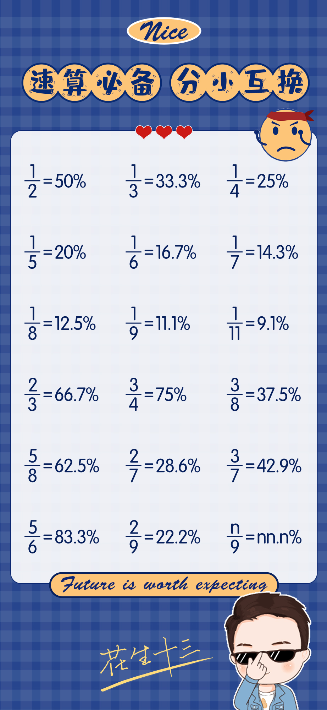
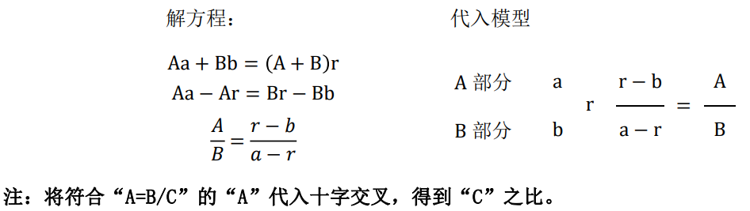
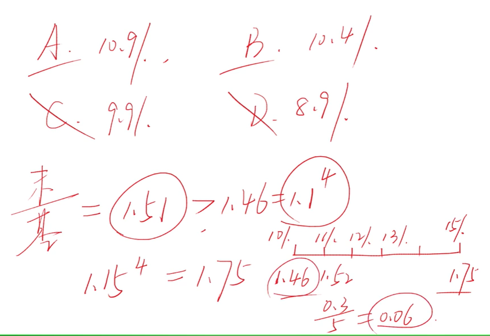
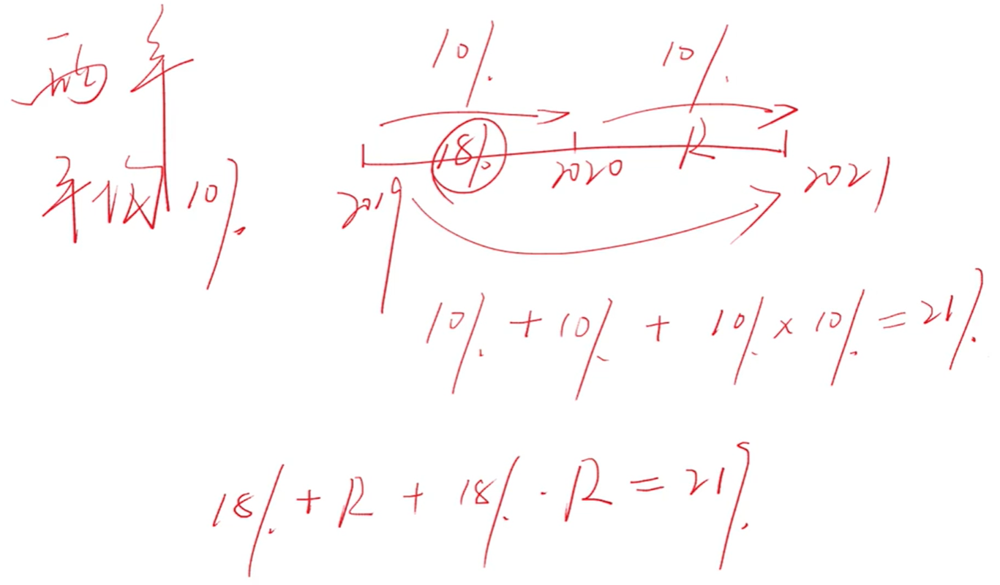
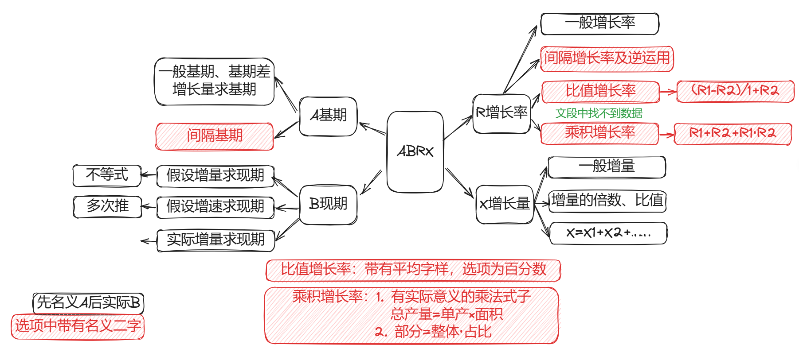
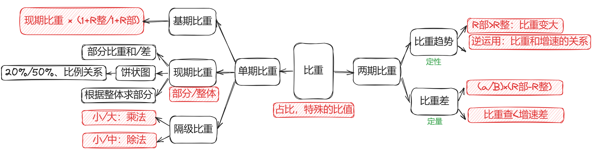
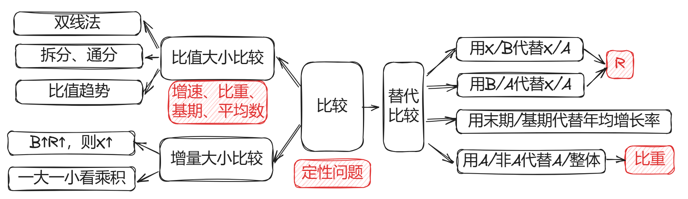
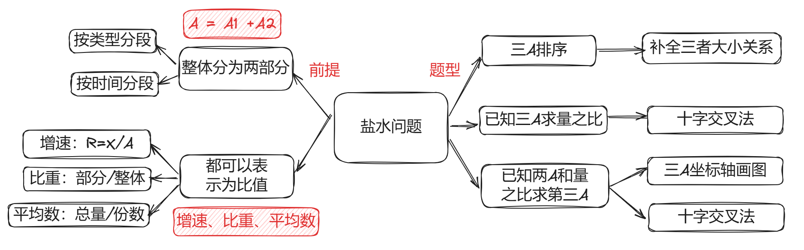

## 一、 速算技巧

### 1. 加法技巧

#### 尾数法

> 部分求和，加快速度

在多个数字 ==精确求和或求差== 时，从“尾数入手”，为保证精度和速度，一般可观察两位。

根据  ==选项之间的差异== 决定观察一位还是两位。如果选项的最后一位均不同，则只需要观察一位；而当存在两个选项的数字尾数相同时，观察两位。

`6914 + 7111 + 7858 + 8334`

当所有选项尾数各不相同，选择选项中尾数为7的选项 `4 + 1 + 8 + 4 = 17`；

当存在选项尾数相同，先去除尾数不为7的选项，然后同上步骤判断第二尾数（记得加上先前进位的1）。

#### 高位叠加

> 省去书写完整加法算式的时间

与传统的加法顺序相反，从高位算起，然后错位相加。适用于 ==非精确求和或没有选项作为参考== 的情况。

`3111 + 3375 + 3647 + 3919 + 4196`

依次计算5个数中每一位的和：16、20、22、28，然后错位相加。

```
1 6
  2 0
    2 2
      2 8
-------——————
1 8 2 4 8
```

### 2. 减法技巧

#### 整数基准值

被减数 - 减数 = （被减数 - 基准值）+（基准值 - 减数）：

`632 - 589 = （632 - 600）+（600 — 589）= 32 + 11 = 43`

#### 分段法

将三位数的减法分成两段，尽可能保证 ==不用借位== ，与基准值法结合使用。

```
  2 2 | 1
- 1 4 | 2
——————————
    8 | -1 = 79
```

### 3. 乘法技巧

#### 百分互换

乘法中的某个乘数可以转为某个 ==常见的分数== ，则将其转为两个整数的 ==简单除法== 。

需记忆的常见小数：



#### 乘法拆分

乘法中有某个乘数为百分数且能 ==拆成两个简单数值== （上述需要记忆的百分比），则将其拆成两部分相乘，要 ==擅用“1%”== （1个包子）。

常用的小数拆分如下：

```
45% = 50% - 5%     55% = 50% + 5%       15% = 10% + 5%
60% = 50% + 10%    95% = 1 - 5%         90% = 1 - 10%
及所有50%、100%附近的数字（利用1%）
```

### 4. 除法技巧

#### 拆分法

拆分是对直除的优化，可借助选项猜出答案，尤其 ==适合分子位数小于等于分母的除法计算== 。

拆分法具体应用：

- 如果分子在分母的50%附近，先拆出50%
- 如果分数大小约等于1（分子分母相差不大），可先拆出100%
- 如果分子很小，可根据实际情况拆出 10% 或 5% 或 1%；

```
322   304 + 18
——— = ———————— = 50% + 3%- = 53%-（-表示比53%小一点，利用1%计算得来）
608     608

50     48 + 2
——— = ———————— = 10% + 0.5%- = 10.5%-
484      484
```

#### 直除法

行测资料分析部分的除法一般可分为三类：

1. 和 ==基期、增长率、增长量== 相关，此类除法适用 ==假设分配法== 
2. 和 ==比重== 有关（以及所有分子小于分母可看作分数的除法），此类除法适用 ==拆分法==
3. 和 ==平均数、倍数、比值== 等相关的除法，此类适用 ==直除法== 。

另外，选项距离极近的所有除法题目，均适用直除法。

### 5. 415份数法

> 基期（A）、现期（B）、增长量（X）、增长率（R）

415份数法是将数量关系转化为份数比例关系，从而简化计算。

415份数法中“415”分别代表基期、变化量、现期的份数。

若增长率为25%（25%＝1/4），为方便计算我们可以将基期设为4份，变化量X＝AR＝1份，现期为基期和变化量的和，即为5份。则基期、变化量、现期的份数分别为4、1、5。这也是415份数法名字的由来。（同样依赖于常用小数的记忆）

需要特别注意的是，==增长率为负数时变化量a也为负数== ，此时“415份数法”即变成“4（－1）3份数法”。

很多时候增长率R并不与某个分数完全相等，而是将R近似的看成某个分数。估算必然会产生误差，对于估算出的一份量，规则为“ ==估大则一份变大、估小则一份变小== ”（把23%估算成1/4，即是估大了，则求出的一份量比实际量要大：把23%估算成1/5，即是估小了，则求出的一份量比实际量要小）。

### 6. 假设分配法

假设分配的核心思想和拆分一样，都是 ==“抓大放小”== ，将“大数”分完，“小数”有误差也不影响结果。

核心公式：X＝AR；

使用步骤：确定分配数，画出分配树（邪恶小人:joy:）。

【例】2021年，全国城市供水总量673.34亿立方米，同比增长6.96%；城市供水管道长度105.99万公里，同比增长5.26%；……

问题：2020年，全国城市供水总量约为：

A、600亿立方米   

B、620亿立方米     

C、630亿立方米                           

D、724亿立方米

```
         6 7 3
        /  |   \
     6 0 0 |   4 2    ( 600*7%(≈6.96%)=42 ) 
          3 1         ( 673-642=31 )
         /   \
        28    3       ( 31*10%=3.1向下修正 )
        
600 + 28 = 628
```

| R的大小         | 方法                             |
| --------------- | -------------------------------- |
| R在10%、20%附近 | 用此时被分配数的10%、20%上下修正 |
| R在25%左右      | 师父：徒弟＝4：1                 |
| R在33%左右      | 师父：徒弟＝3：1                 |
| R在50%左右      | 师父：徒弟＝2：1                 |
| R在66%左右      | 师父：徒弟＝3：2                 |
| R在80%以上      | 直接师徒平分再修正               |

- 由于我们近似的计算，结果肯定是存在误差的，去选项中的最相似值。
- 一般情况下我们采用三位进行分配足够，除非选项中存在两数相差很小。

> 在乘除法中采用近似的方法计算，存在误差是非常正常的，只要不影响做题，都在可控范围内

## 二、ABRX

### 1. 基本概念

A、B、R、X分别表示基期、现期、增长率和增长量。

同比是以上年同期为基期相比较，即现期某一时间段与上年某一时间段相比，可以理解为今年第n月与去年第 n 月的比较。

环比是与上一个相邻统计周期相比较，表明统计指标逐期的发展变化,可以理解为第n 月与第n-1月的比较。

### 2. 基期考法

基期：代入、直除、假设分配； 

基期差值：两次假设分配法求得两个基期作差。 

间隔基期：求出隔年增长率，即变成第一类考法； 

- 隔年增长率：`R = R1 + R2 + R1 × R2`

已知变化情况求基期：利用 `A = X / R`求出基期。

### 3. 现期考法

假设增量求后期：求出 X，列不等式即可  `B = A + nX`。

假设增速求后期：利用公式`B＝A＋AR`依次求出后一年，一般两到三次即可求得答案。

按照实际增长率求后期：根据名义增长率求得基期后，再利用实际增长率求后期。
$$
\frac{B}{1+R_{名}}\times(1+R_{实})
$$

### 4. 增长率

一般增长率：直接套用公式`R＝X/A`即可； 

隔年增长率：已知今年较去年增长 R1，去年较前年增长 R2，则今年较前年增长：
$$
\mathrm{R}_1+\mathrm{R}_2+\mathrm{R}_1\mathrm{R}_2
$$

> 当在段落中找不到数据时，想表达式

比值增长率：符合表达式 A＝B/C，材料中有 B、C 增长率，求 A 的增长率，即为比值增长率（多以平均数增长率形式出现），公式为：
$$
\frac{\mathrm{R_{b}-Rc}}{1+\mathrm{R_{C}}}
$$
乘积增长率：符合表达式 A＝B×C，材料中有 B、C 增长率，求 A 的增长率，即为乘积增长率，多以 ==实际含义关系式和部分增长率形式== 出现，例如：总产=单产×面积，部分=整体×占比。具体公式为 ：
$$
\mathrm{R}_b+\mathrm{R}_c+\mathrm{R}_b\mathrm{R}_c
$$

### 5. 增长量

一般增长量（求 X）：R 靠近某分数可使用 415 份数法，R 极小可直接 BR，其他可假设分配。

两期增长量倍数或比值（X1/X2）：依次求得 X1、X2，再求比值即可。

整体增量/部分增量（X＝X1＋X2＋X3…）：各部分增量相加等于总增量。

## 三、比重

### 1. 单期比重之现期比重

比重：套用公式即可，比重＝部分/整体、部分＝整体×比重、整体＝部分/比重；

部分比重和或比重差：套用公式即可，比重和（比重差）＝部分和（部分差）/整体；

饼状图：确定各部分所占比例，多利用 1/2、1/3、1/4、1/8 等或两部分之间的倍数关系，注意饼图中各部分的位置关系一般为从 12 点钟方向起，顺时针依次排列； 

根据整体求部分：假设某一部分情况和整体一致，按照整体情况求部分。

### 2. 单期比重之基期比重

基期比重等于现期比重乘上 1＋增长率反过来。 基期平均值、基期倍数、基期比值均可看作是“基期比重”，利用基期比重公式进行计算`（1+R分母）/（1+R分子）`。
$$
\text{前期比重}=\text{本期比重}\times\frac{\text{整体增长率}+1}{\text{部分增长率}+1}
$$
我们可以利用出题人出坑的方式做题， ==求出现期比重后根据增长率选择大于还是小于其的选项== 。

### 3. 单期比重之隔级比重

隔级比重，指的是题目中存在大集合、中集合、小集合的关系，求得两集合的占比关系。例如，学校为大集合，班级为中集合，班级内的女同学为小集合，若问的是班级内的女同学在学校中的比重为为多少，即是隔级比重。
$$
\text{隔级比重}=\frac{\text{小集合}}{\text{中集合}}\times\frac{\text{中集合}}{\text{大集合}}\\\\\text{隔级比重}=\frac{\text{小集合}}{\text{大集合}}\div\frac{\text{中集合}}{\text{大集合}}
$$

### 4. 两期比重变化之比重趋势

比重趋势是根据分子分母增速大小来判断本期比重与前期相比变化情况的定性分析方法。

- 分子增速大于分母，则分数变大（比重上升）
- 分子增速小于分母，则分数变小（比重下降）

> 注意比重趋势的逆运用，其表明比重和增速的关系。

### 5. 两期比重比较之比重差

比重差秒杀计：比重差绝对值小于增速差绝对值（比值差不能秒杀，可以使用下面公式）

具体公式：
$$
\text{比重差}=\text{本期比重}-\text{前期比重}=\frac{\text{前期部分}}{\text{本期整体}}{\times}\left(\text{部分增长率}-\text{整体增长率}\right)
$$

$$
\text{比重差}=\frac aB\times(R_1-R_2)
$$

其中a使用假设分配求得。要注意比重和比值考察问法的区别：

- 2023年，大豆的占比比去年同期高了多少个百分点？   ——比重差

- 2023年，大豆的占比比去年同期高了？选项为百分数   ——比重差

- 2023年，大豆的亩产比去年同期高了多少公斤？           ——比值差

  > 比值差和比重差具体计算的公式相同。

- 2023年，大豆的亩产比去年同期高了百分之多少？       ——比值增长率

## 四、比较类

> 读题分两步，先查找比较，再计算，避免遗忘，反复读题。

### 1. 比值大小比较

常用来比较的比值包括 ==增速、比重、基期、平均数== 。

常用的方法包括： ==双线法、趋势法（快、无需计算）；拆分法、通分法（需要计算）== 。

常用的 ==替代比较== 有：

- 用末期/基期代替 ==年均增长率== 比较
- 用倍数（B/A）代替增速（B/A—1）比较（AB的倍数关系比较明显） ==增速==
- 用 X/B 代替 X/A 比较（省去计算A的过程） ==增速==
-  用部分 A/部分非 A 代替部分 A/整体比较，反之亦然。

### 2. 增量大小比较

B 越大 R 越大则 X 越大（大大则大）。

我的 B 是你的 N 倍，你的 R 是我的 N 倍以上，我们的 X 才可能相等（一大一小看倍数）。

## 五、盐水类

### 1. 盐水题目识别特征

整体由 ==两部分== 组成（A＝A1＋A2），且整体部分均可表示为 ==A=B/C== 

资料分析中，适用盐水思维的常见类型有：

- 整体增长率和两部分增长率
- 整体比重和两部分比重
- 整体平均数（例如人均收入、人均消费、单位面积产量等）和两部分平均数（C通常为人数或面积）

两部分的划分通常有如下方式：

- ==按照时间分段== 累计（累计量=当月量+上月累计量）增速和两部分（当月量、上月累计量）增速 
- ==按照类型分段== 出口额（出口额=贸易顺差+进口额）增速和贸易顺差进口额增速。

### 2. 三浓度排序

牢记“部分 A 浓度＞整体浓度＞部分 B 浓度”，“部分 A 浓度＞整体浓度”等价于“整体浓度＞部分 B 浓度”，反之亦然。

### 3. 已知3A求量之比

采用十字交叉法，所求的量之比为 ==分母之比== 。

假设分别有浓度为 a 的盐水 Ag，浓度为 b 的盐水 Bg，混合后浓度为 r，求两份盐水之比。



### 4. 已知2A和量之比求第三A

首先 ==定性分析== ：整体的比值在中间，靠近C大（分母大）的一边。

如果第一步完成后无法确定答案，此时再 ==定量分析== ：十字交叉法。

## 六、平均倍数类

### 1. 平均数

平均数：是指在一组数据中所有数据之和（A）再除以数据的个数（B），即平均数=总数A/个数B

| 题目类型         | 方法                                       |
| ---------------- | ------------------------------------------ |
| 求单个平均数     | 只需要注意和时间有关的平均数，明确时间间隔 |
| 两个平均数之差   | 比值差                                     |
| 两个平均数之比   | A/B/C/D = AD/BC                            |
| 平均数的增长率   | 比值增长率                                 |
| 基期平均数       | 基期比重                                   |
| 平均数的变化情况 | 比重趋势                                   |

1. 均前每后做分母（或简单记为后除前）
2. (A/B)/(C/D)＝AD/BC（两边除中间） 
3. 时间平均数要注意闰年天数（366 天）、季度个数等

### 2. 倍数

> 1 倍=100%，倍数=增长率+100%，例如：增长了1.5 倍=增长了150%，A比B增长了 60%，即 A 是 B 的 1.6 倍。

题目题型：

- 求单个倍数
- 两个倍数之比（A/B/C/D）
- 基期倍数（同基期比重） 
- 比值增长率/间隔增长率变为倍数提问（比值倍数=比值增长率+100%、间隔倍数=间隔增长率+100%）

### 3. 年均增长量

年均增长量表示的是 n 年间增量的绝对平均值，公式：`年均增张量 = （末期−基期）/ n` 。其中，严谨来说，基期应向前推一年（但有时按照不严谨处理），n 为末期、基期年份差值。

严谨要推的情况：

- 五年计划
- 如2015-2017这 ==三年== 
- 图标给出前一年，出题特意延后一年

### 4. 年均增长率

年均增长率表示的是 n 年间的年平均增速。公式如下：
$$
(1+r)^n=\frac{\text{末期}}{\text{基期}}
$$
在年均增长率极小时，可简化为： 末期/基期 ≥ 1 + nr。

解题思路：

- 选项正常（相差较大），此时可以代入求解

- 选项比较近，尺子分段

  

- 选项又小又近，可以近似为1 + nr

==多步间隔增长率==

年均增长率与间隔增长率的一种结合问题，例如：



## 七、特殊题型

### 1. 拉动增长和增量贡献率

拉动增长＝ 部分增量 / 整体前期（类增长率，以拉动为边界，左增量/右前期）

增量贡献率＝ 部分增量 / 整体增量（类比重）

当比较不同部分对同一整体的增量贡献率时，因整体增量相同，只比较部分增量大小即可

### 2. 容斥问题

若问 ==有无交集== ：占比之和超过 100%，则一定有交集；

若问 ==至少== ：（1）考虑“尽量相斥”、“重合尽量少”（2）公式：==a＋b－100%或a＋b－总量==

若问 ==至多== ：（1）考虑“包含”（2）至多有“占比 ==较少项的比重== ”；

既 A 又 B 的占比范围：在“至少”和“至多”之间。（a＋b－100%，AB中较小的比重）

## 八、常见思维陷阱

1. 同比还是环比
2. 是多少倍还是多多少倍
3. 比重问题的整体（分母）
4. 进口/出口/进出口、额/量、顺差/逆差、主客体颠倒（A对B出口＝B 从 A 进口）
5. 累计图表，当期数据＝当期累计－上期累计
6. 一二月份合并
7. 多步计算的月均
8. 图标列举不全
9. 单位坑
10. 时间坑，首年、起止时间、平年闰年

## 九、整体总结









| 数据类型 |     去年      |        今年        |      增长率       |      增长量      |
| :------: | :-----------: | :----------------: | :---------------: | :--------------: |
|  单一量  | A=B/(1+R)=X/R |    B=A+X=A(1+R)    | R=X/A，间隔增长率 |      X=B-A       |
|   比重   |   基期比重    | 现期比重，隔级比重 |                   | 比重趋势，比重差 |
|  平均数  |  基期平均数   |     一般平均数     |    比值增长率     | 比值趋势，比重差 |
| 其他比值 |   基期比值    |        比值        |    比值增长率     | 比值趋势，比重差 |
|   乘积   |     a × b     |       A × B        |   A × B - a × b   |    乘积增长率    |

间隔增长率、乘积增长率共用一个公式：`R1 + R2 + R1 × R2`

比值增长率：`( Rb - Rc ) / ( 1 + Rc )`

基期比重、基期平均数、基期比值共用一个公式：`现比/平均数/比值 × （1+R分母）/（1+R分子）`

隔级比重：
$$
\text{隔级比重}=\frac{\text{小集合}}{\text{中集合}}\times\frac{\text{中集合}}{\text{大集合}}\\\\\text{隔级比重}=\frac{\text{小集合}}{\text{大集合}}\div\frac{\text{中集合}}{\text{大集合}}
$$
比重差：
$$
\text{比重差}=\frac aB\times(R_1-R_2)
$$
