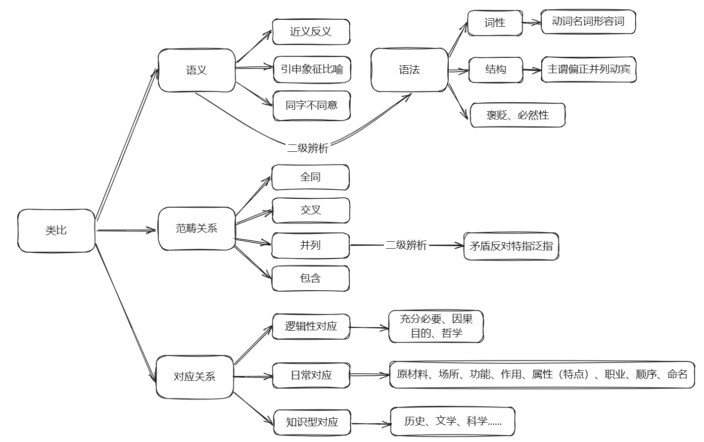
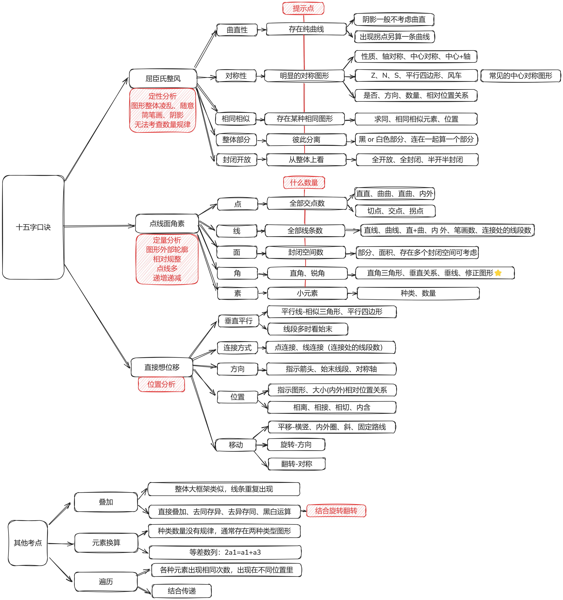
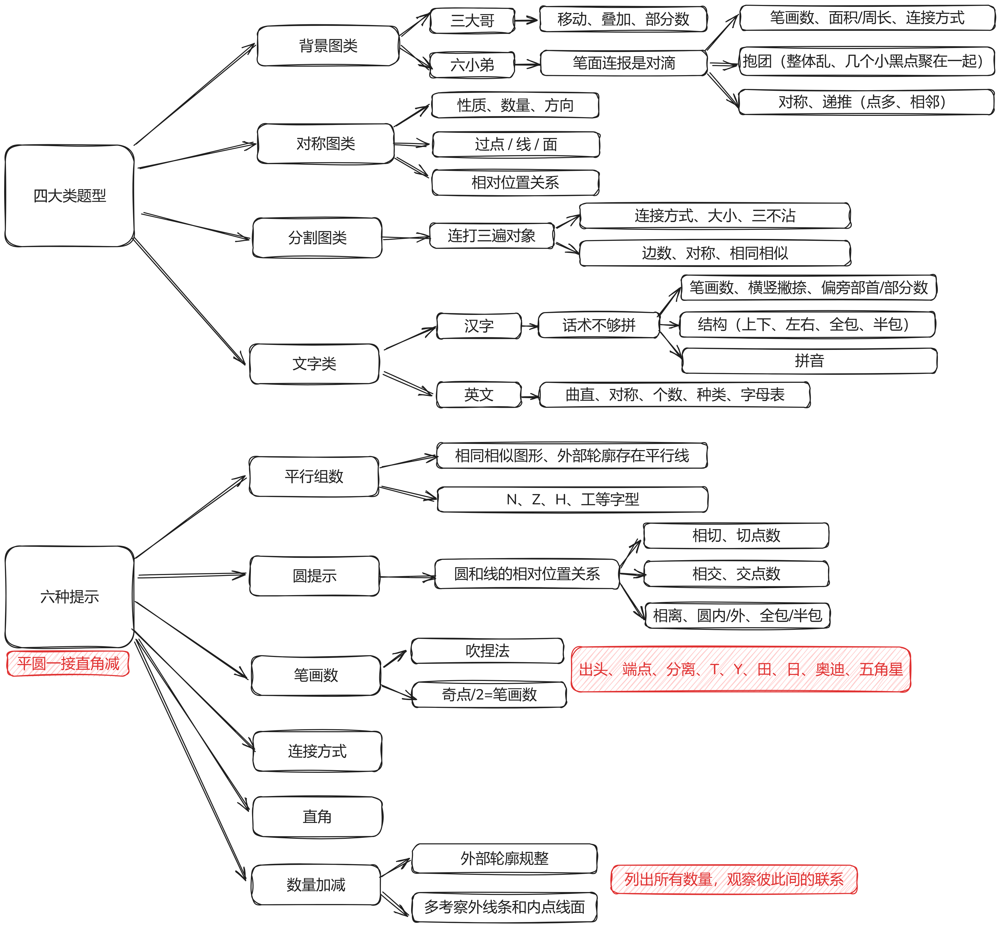
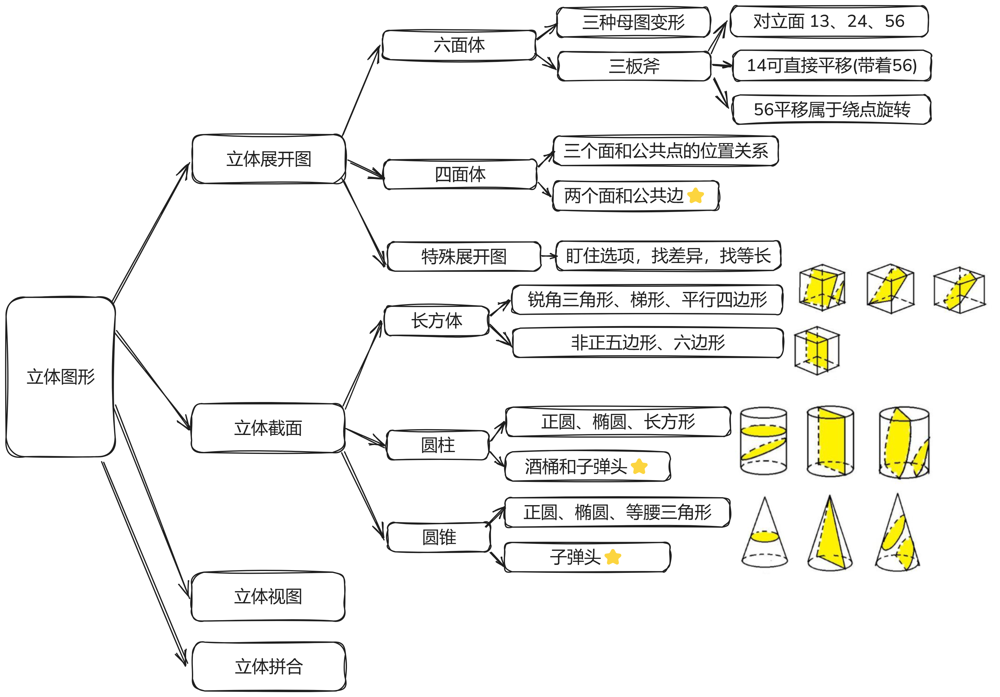
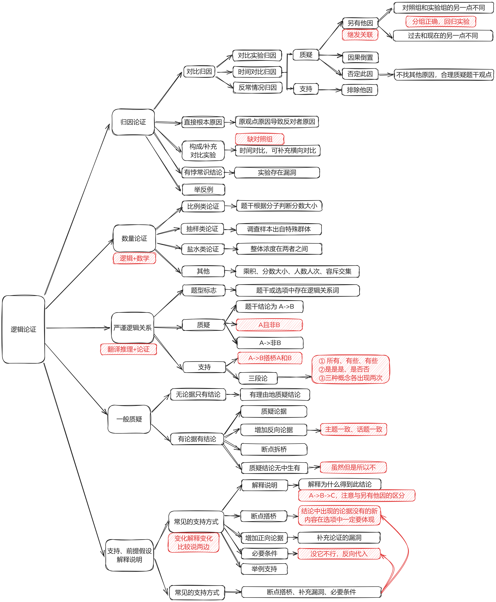
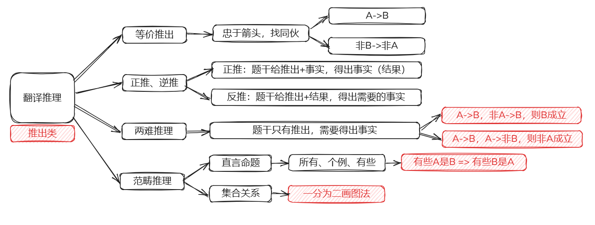
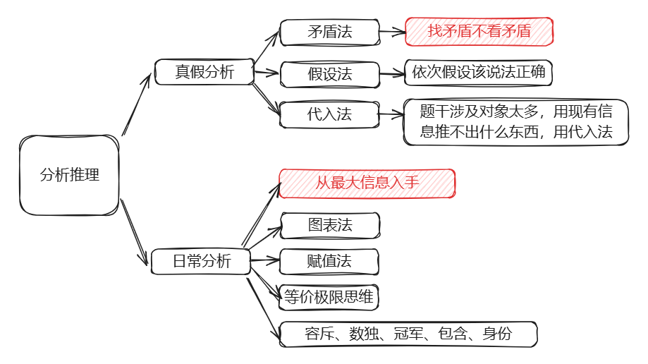

## 一、定义判断

> 一定不能忽略被定义词，它包含了最重要的部分特征，通过具体描述厘清被定义词中关键字的含义。
>
> 无论是定义判断还是类比推理，都要结合现实和常识进行联想判断。

当阅读与定义相关的描述时，重点关注：==被定义词、主体、对象、特殊要求。==

## 二、类比推理

## 三、图形推理

### 1. 主要考点

### 2. 主要题型

### 3. 立体图形

## 四、逻辑判断

### 1. 逻辑论证

### 2. 翻译推理

### 3. 分析推理

