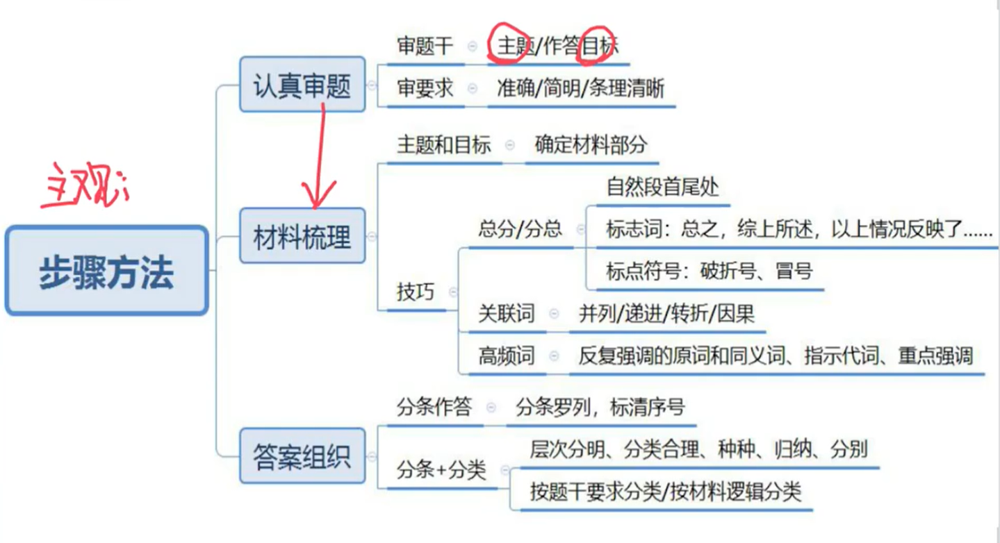
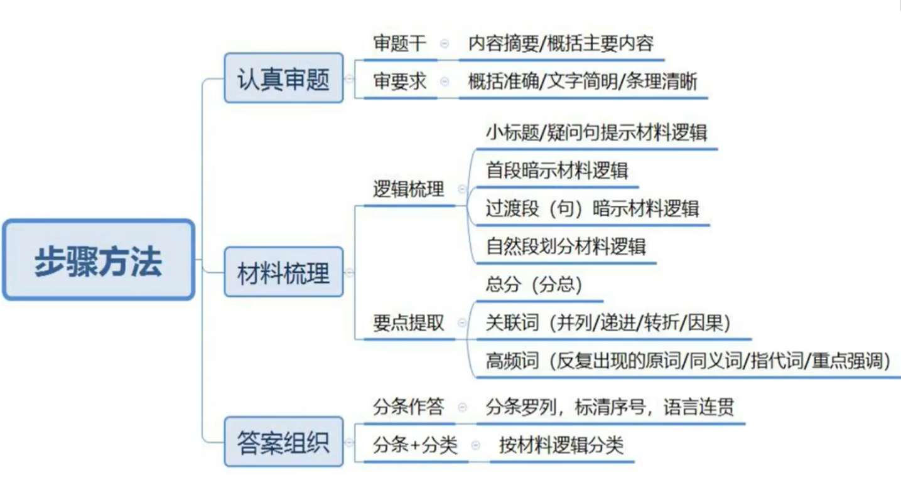
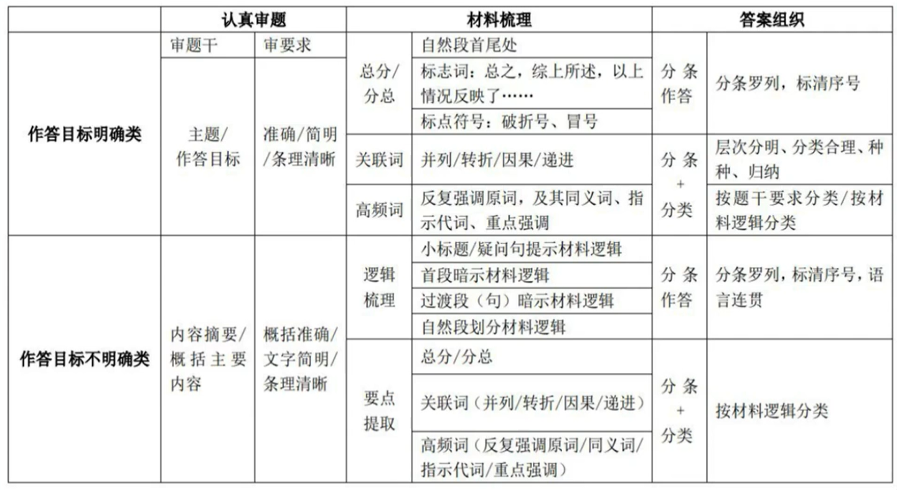
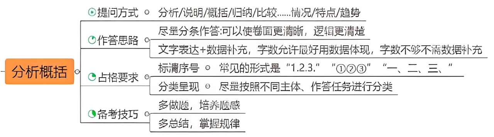
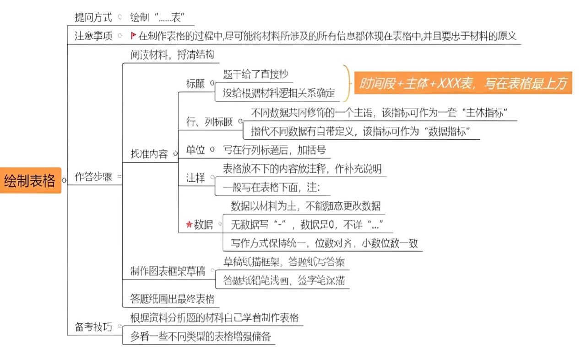
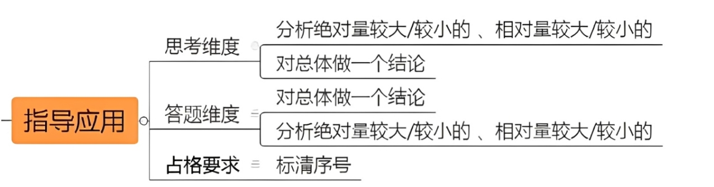
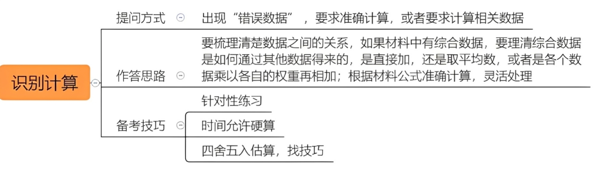
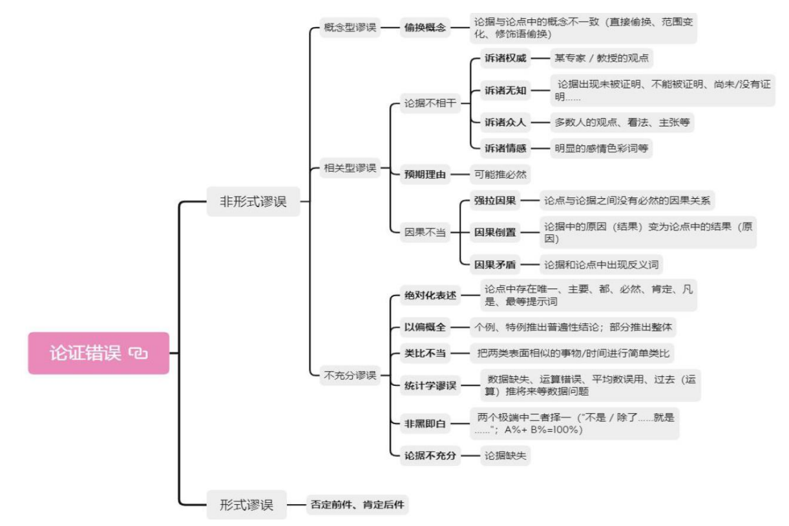
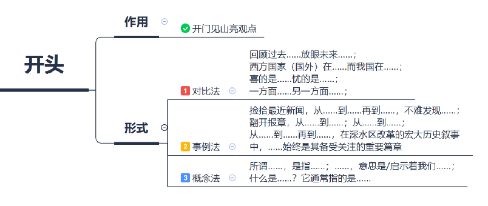

## 一、科技文献阅读

## 二、科技实务

### 1. 分析概括

- 特点：围绕主体，多角度描述比大小/高低等（ ==不需要带数据补充== ）
- 变化情况 | 趋势：围绕主体，时间对比下多角度描述增减变化过程，比如：增加了、减少了、降低了、升高了等（字数允许最好用数据体现增长）
- 理由：由整体到具体，整体主要说明理由，具体用来举例摆数据。
- 定义：
  - 单定义——符合定义的数量
  - 双定义——两个定义的区别

### 2. 绘制表格

### 3. 指导应用

例子：

治理的重点应该为先废水，其次为化学需氧量，最后是氨氮。

1. 废水：应重点治理城镇生活源与集中式两大废水排放。首先，治理增长量由427.9亿吨增长为462.7亿吨的城镇生活源废水排放。其次，再治理增幅达25%的集中式废水排放。
2. 化学需氧量：后期应继续加强治理排放量基数大以及降幅较缓的农业源与城镇生活源的排放。
3. 氨氮：应加强治理和监管排放较大以及降幅较缓的城镇生活源与农业源排放。

### 4. 识别计算

## 三、论证评价

## 四、作文素材

> 主题和观点要来自材料，不能主观发挥。题目写法：
> 
> - 为××注入××
> - 用××服务××
> - 迈好××的坚实一步
> 
> 除题目指定角度外，一般按照以下角度进行：
> 
> - 是什么（含义）
> - 为什么（好：意义；问题：危害）
> - 怎么做（政策）
>   - ……是……的前提/关键/保障/重点

**结尾：**时代是出卷人，人民是阅卷人，（主题）也要交出一份不负时代的合格答卷 。 在新的时间年轮里，（我们）（分论点总结）奋发有为、拼搏进取，一定能刻写下不负使命、不负时代的美好回忆。

### 1. 科学精神

#### 理证

科学精神的本质在于以理性为根基的自我超越——它要求以怀疑精神破除认知的傲慢，用实证逻辑替代主观臆断，在开放协作中对抗固步自封；这种精神既包含对真理的纯粹追求，也警惕技术异化的风险，更以持续试错的韧性直面未知。正如波普尔所言“科学在永恒的革命中前进”，每一次理论迭代都印证着：唯有将批判性思维、系统性验证与伦理自觉熔铸为思想准则，人类才能在浩瀚宇宙中走出蒙昧的洞穴。

#### 例证

科学家的坚持，是百年物理学家杨振宁心系祖国科教事业，重返清华，为国家的科技发展和中外科技文化交流做出了卓越贡献；是医学院士吴天义苦心孤诣 60 年，开展高原病研究，用毕生心血创造了高原反应的医学奇迹；是中国核电事业奠基人彭世录隐姓埋名几十年，为祖国建造核潜艇和核电站贡献了毕生精力。

### 2. 科技创新

#### 理证

科技兴则民族兴，科技强则国家强。

在人类历史上，从农业社会到工业社会，从刀耕火种到声光化电，每一次科技革命都会带来人类社会的深刻变革。处于新时代，面对新变化，应对……问题，万万不能忽视科技在其中担当的至关重要的角色。（例子）。这些攻关之举，有效之策，无不闪耀着科技的高光，无不体现着科学精神、科学态度。

创新，可以理解为打破旧的，创造新的；创新，也可以理解为自我革命、开拓进取。面对新时代，就要结合新情况，研究新问题，开创新方法，将创新作为引领发展的第一动力。……不问出身、无问西东，创新的赛道向每个人敞开，谁都可以跑出自己的一棒。

创新是一个民族进步的灵魂，是一个国家兴旺发达的不竭动力，也是中华民族最深沉的民族禀赋。重大科技创新成果是国之重器、国之利器，必须牢牢掌握在自己手上，必须依靠自力更生自主创新。

#### 例证

C919 大飞机实现商飞，国产大型邮轮完成试航，神舟家族太空接力，“奋斗者”号极限深潜┄┄经过久久为功的磨砺，中国的创新动力、发展活力勃发奔涌。科技创新不仅提高了传统产业的竞争力，也为发展新质生产力夯实了基础、增强了动力。

### 3. 农业科技

#### 理证

民为国基，谷为民命。“要坚持农业科技自立自强，加快推进农业关建核心技术攻关”，这一重要指示再次表明，粮食安全这根弦任何时候都不能松，保障粮食安全必须落实“藏粮于地、藏粮于技”战略，持续提高农业质量效益和竞争力。

#### 例证

近几年，我国粮食生产连续迈过了“新冠肺炎疫情关”“洪涝关”“台风关”“病虫关”等多个关口，交出了一份亮眼成绩单。粮食总产量为 13390 亿斤，喜获二十连丰，抗灾夺丰收靠的就是农业科技的保驾护航。

### 4. 科教兴国

人才是创新的第一资源。习近平总书记在中央人才工作会议上强调：“深入实施新时代人才强国战略，全方位培养、引进、用好人才，加快建设世界重要人才中心和创新高地”。国家发展靠人才，民族振兴靠人才。做好各项事业，都要在留住人才、用好人才上做文章、下功夫。

深入实施科教兴国战略，有利于激发“第一生产力”，激活“第一资源”，点燃“第一动力”，推动教育、科技、人才三者有机融合、相互促进，最终汇聚成全面建设社会主义现代化国家的强大推力。

### 5. 生态环境

"绿水青山就是金山银山"的科学论断，重塑着当今中国发展的逻辑和价值坐标。塞罕坝三代人植绿115万亩，将黄沙变成林海；安吉余村关停矿山发展生态旅游，收入翻了十倍。这些实践无不印证着：生态投入不是成本负担，而是发展资本。

### 6. 法制建设

商鞅"徙木立信"昭示法治权威，包拯"铁面无私"彰显司法公正。//新时代"枫桥经验"取得了创新发展，85%以上矛盾纠纷在县域以下化解，彰显了法治社会的根基。//正如习近平总书记强调："法治兴则民族兴，法治强则国家强。"

从"扫码立案"到"云上法庭"，司法改革让正义加速抵达。//深圳率先建立个人破产制度，为"诚实而不幸"者提供重生机会。//正如"阳光是最好的防腐剂"，裁判文书上网公开率达98%，让公平正义看得见、可检验。
