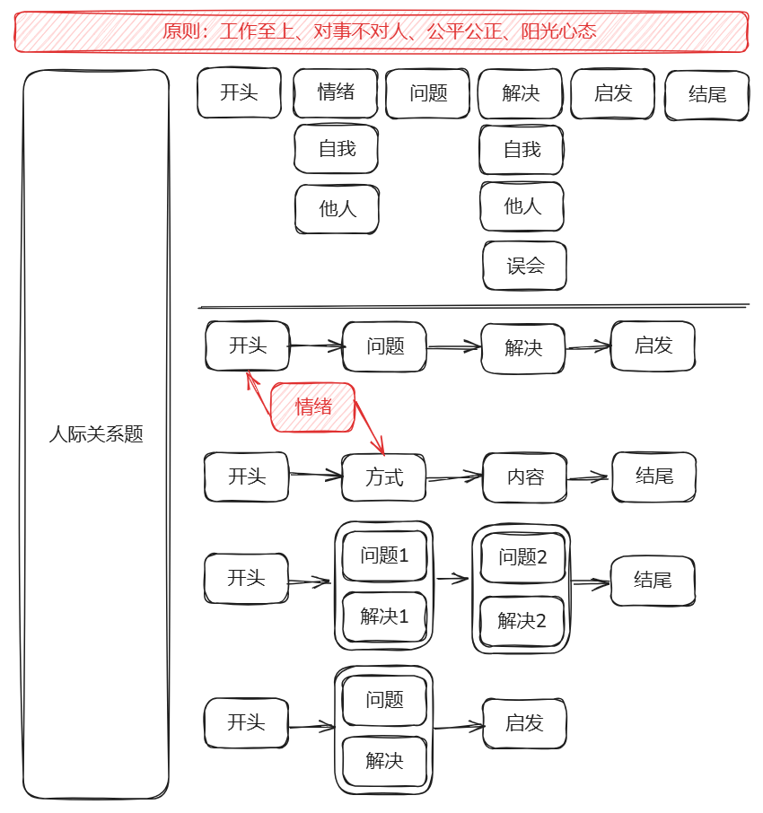
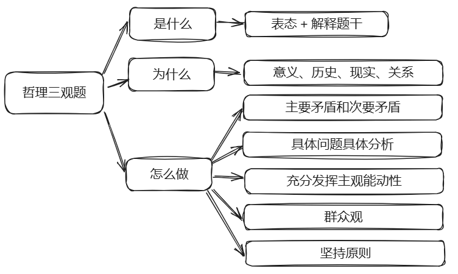
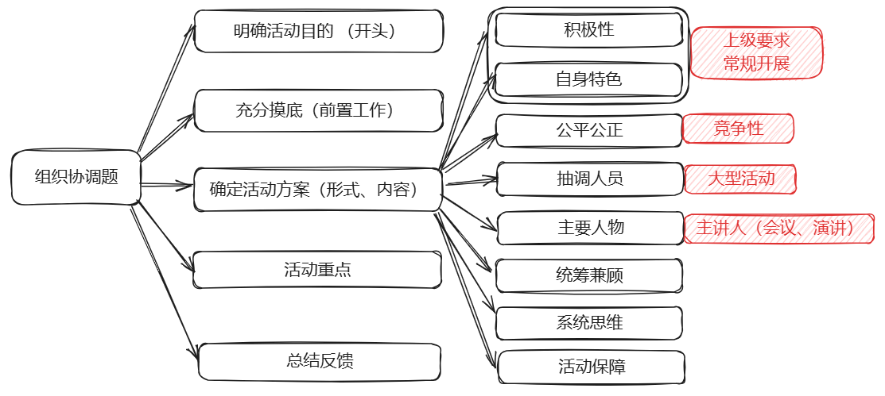
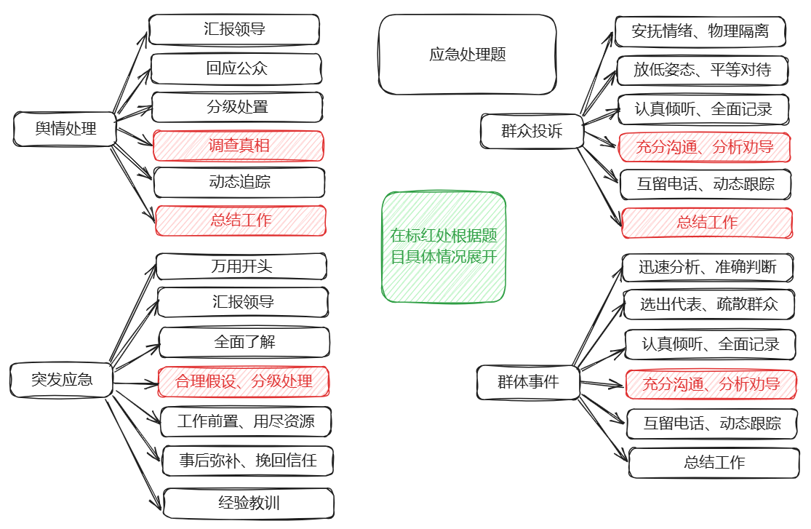

> 优先练习真题

反套路要做到：

- 题干中关键的主体信息
- 与题干紧密联系

两点论和重点论相统一，不必追求面面俱到。（突出重点）

**1. 审题**

背景引入 + 问题

速读背景引入，精读问题，判断题目在问什么，要求是什么

- 理解和认识 / 你的看法
- 组织思路 / 重点关注哪些方面
- 如何处理 / 现场模拟

精读背景引入，挖掘隐藏线索

**2. 打草稿**

大纲：开头 + 3-4个点 + 结尾，每个点要有一个小标题，列出论点中的关键词

- 作答框架不作为“套路化”的评判标准

- 对策和分析要切合主体信息，1-2个亮点，从微观入手，向纵深处要细节

> 要有分类的意识；要以小见大

**3. 作答**

- 用时应在规定时常的80%

- 戒掉卡顿时无用的语气词，可以替换为一些无用的废话（万能的过渡句），给脑子一个缓冲的时间。

- 答好第一题

**4. 遣词造句**

一些高大上的词语，由虚转实，接受大白话

## 一、政策理论题

### 1. 为什么制定

==回应时代呼声== ：时间是变化的标尺，空间是更迭的参照，改革开放四十多年来，我国经济年均增速近 10%，成为全球第二大经济体，我们用几十年时间走完了发达国家几百年走过的发展历程。同时，也不可避免的遇到一些发展的困难和瓶颈。所以，我们现在强调……就是对这一时代问题的回应。

==解决现实问题== ：所有政策的制定都属于国家顶层设计，但同时与都与我们每个人的生活息息相关，因为政策的制定归根结底是为了解决发展中遇到的实际问题。虽然政策的制定距离我们普通人很远，但政策想要解决的问题却真实的发生在 我们的生活中，例如……，大家都有切身的体会。所以，我们现在强调……就是对这一现实问题的回应。

### 2. 如何评价

==重要性== ：……虽小，但乘以 960 万平方公里和 14 亿人口就显得意义重大，不仅关乎人民日益增长的美好生活需要，更关乎人民群众获得感、幸福感、安全感。

==现实意义== ：……政策的制定是我们党（国家）长期历史经验的总结，在……年代……政策就发挥了不容忽视的重要作用，举例……；历史发展到今天，习近平总书记说我们已经进入了新时代，而……政策（理论）也在新时代被赋予了新内涵，对于我们实现中华民族伟大复兴/不断实现人民对美好生活的向往，具有特别重要的现实意义，举例……。

==发展需要== ：世界上每个国家都曾经或者正在面临着……问题，比如：举例……，但是每个国家在制定相关政策的时候都要结合自己国家的实际国情和当下的时代特点，因地制宜、实事求是的政策才是好政策。我认为……政策正是体现了我们国家当下的国情，是实事求是的，符合现阶段我们国家发展需要的。

### 3. 政策实施存在的问题和困难

==落实一刀切== ：国家制定了好的政策，但是各地方没有结合自己当地的实际情况制定科学的实施细则和落实方案，为了落实而落实，这就可能导致政策落实“一刀切”、“走过场”或者“水土不服”的情况，也可能出现新项目“一窝蜂”上马的现象。

==干部不作为== ：国家政策的落实最终要靠我们具体的每一个工作人员，现实中确实也存在有些干部，没有充分的领会和理解政策，没有用老百姓听得懂的语言给大家把政策解释清楚，没有把工作做实做细，从而导致政策落实过程中出现老百姓不理解、不支持的情况。

### 4.如何落实好政策？

==要坚持问题导向== ：人类认识世界、改造世界的过程，就是一个发现问题、解决问题的过程。政策的落实说到底就是不断解决问题的过程，旧的问题解决了，又会产生新的问题，而一个问题接着一个问题去攻克的过程，就是我们落实政策、完善政策，推动时代进步的过程。

==要坚持实事求是== ：“实事求是”不仅是我们百年大党的成功密码，更是我们想问题、办事情的出发点和落脚点。我们开展任何工作，都要坚持一切从实际出发，政策落实更是如此，要充分结合当地实际情况，考虑当地群众实际需求，使我们的工作符合实际情况、符合客观规律，这是确保政策落实的基本要求。

==要加强制度保障== ：政策是宏观的、全局的，而落实的过程是具体的、细节的，政策能不能落实好，关键还要看有没有科学的制度作保障，比如充分的宣传机制、科学的考核机制、严格的监督问责机制、人性化的容错机制、长效的管护机制等等，这些对于政策落实都是必不可少的。

==要狠抓落实工作== ： 我曾经看到《人民日报》有篇文章讲到：抓工作落实是个“苦差事”，越是接近尾声越是困难重重。我觉得这句话特别形象的揭示了政策落实难就难在“最后一公里”。更重要的是要做好吃苦的心理准备，只有“苦其心志，劳其筋骨”，任劳任怨、真抓实干才有可能把政策落实到位。

==要做到人人有责== ：中国有句古语：天下兴亡匹夫有责。……是个长期复杂的大工程，并不是敲锣打鼓、轻轻松松就能实现的，……应当“躬身入局”、担当历史使命，我们每个人首先应该从自己做起，
积极参与其中，不做看客，而要做行动者。我想这也体现了共建共治共享的现代化治理理念。

## 二、人际关系题

### 1. 开头

- 与人相处是一门学问，像我们这样刚刚走上工作岗位的年轻人，由于缺乏经验、为人简单，遇到题目中这种情况确实可能会觉得有些棘手，我试着说说我的解决思路。
- 我们每个人的成长环境、人生经历、性格脾气都各不相同，在工作中遇到一些小摩擦、小冲突是很正常的，而且大家都是处于公心，所以我想应该是可以想到办法解决的。

### 2. 情绪

- 自我情况管理：设身处地的想想，一般遇到这种情况，我们可能多多少少会有一些委屈/失落……但是作为成年人首先应该控制好自己的情绪，特别是不能因此影响自己的正常工作，应当心平气和的去处理问题。
- 安抚他人情绪：我父亲常常对我说：“要想公道，打个颠倒”，遇到事情要站在对方的角度去想一想，想想对方的处境和心情。

### 3. 原则

-  工作至上：我们想方设法处理好人际关系，根本目的是团结一致把工作做好。
-  对事不对人：多从事情发生的过程、细节着手思考问题，少从领导和同事身上挑毛病。
- 公平公正：不能一味追求良好的人际关系和工作氛围而突破底线，客观理性地看待工作中的人和事，要讲求方式方法，但绝不一味做老好人，绝不和稀泥。
-  阳光心态：建构理想中的工作环境和同事

### 4. 问题

#### （1）我的问题

- 缺乏大局观：来单位时间短，还没有完全了解单位的各方面工作，缺乏大局观、站位不够高。
- 缺乏经验：由于刚来单位不久，对工作业务不够熟悉，缺乏经验，没有完全准确领会领导/同事的意图。
- 表达不准确：为人简单，心真口快，没有把自己真实的想法表达准确，造成对方的误会。
- 工作方式方法：表达是否通俗易懂、接地气，态度是否平和得体，工作程序是否完全符合规定。

#### （2）对方的问题

- 工作忙：工作忙，压力大，无法兼顾更多工作任务，这种情况人人都可能遇到，这种情况下与同事交流时可能会忽视方式方法、态度直接。
- 家里有事：家里遇到老人孩子生病，孩子升学就业等大事，可能力不从心。
- 主观问题：性格脾气不相投，行事风格不一样。

#### （3）可能存在的误会

- 信息不对称造成的误会：因为工作比较忙，交流不充分，误传信息等原因造成了误会。
- 以偏概全造成的误会：看到的未必是事实，局部、片段不能代表全局和整体。

### 5. 解决

- 勇敢承认错误：如果这件事情，确实是自己做错了，那么错了就是错了，要勇于承认错误，积极改正错误，我记得邓小平同志曾经说过：错误是成长最好的肥料。犯错误不可怕，重要的是在改正错误的过程中收获成长。当然，如果有合适的机会，我也是诚恳地向领导/同事道歉。
- 主动解开误会：工作中由于信息不对称、沟通不充分、不及时所造成的误会，其实并不是真正的矛盾，只要我们积极主动、充分沟通就一定能够解决，最怕的就是误会双方都等着对方先开口中，所以我会做那个主动迈出出第一步、积极消除误会的人。
- 用制度管人：有些同事之间的工作矛盾，并不是主观故意的问题，而是工作机制不健全或者工作流程不顺畅造成的，这类问题都可以拿到部门工作会议上来讨论，形成具有可操作性的制度，用制度管人、用制度调节关系。
- 领导也是长辈：领导往往与我们的长辈年龄相仿，在单位里既要把他们当做又要把他们当作长辈，充分的信任他，多向他们请教，在力所能及的范围内，特别是一些小事杂事多主动帮忙。
- 同事也是战友：用年轻人之间的方式增加交流机会，比如下班后吃个便饭，周末组织大家开展打球、爬山、徒步、露营等集体活动；二要消除对手思维，建立合作思维和共赢思维；三要真心实意想办法帮助同事，与他一起想办法联手解决面临的困难和问题，真诚分享自己的好经验和好做法。
- 整合资源：可以请与双方都熟悉的老同事居中协调，或者向有同样类似经历的同事请教，必要时也可以请示领导得到指点。
- 柔性方式：多思考、多沉淀、写文章、写报告。

### 6. 启发

- 工作前置：在工作中要善于观察和把握工作规律，对于一些可以提前做好的基础性工作，比如数据收集整理、文件归档等等，都可以做在前面，这样当领导安排多项工作时，我们就可以自己多承担一些，与同事一起从容应对，彼此间的矛盾摩擦也会减少。
- 人际相处前置：同事之间工作友谊的积累是一个长期的过程，要在平时乐于助人、与人为善，才能在遇到困难时得到别人的无私帮助。
- 深入基层/群众：主动深入到基层一线/群众当中，真正了解熟悉他们的实际工作和生活，与大家打成一片，建立良好的工作友谊。
- 终身学习：虽然一个人的脾气性格会影响同事之间的相处，但是在一个单位长期相处合作，归根到底还是要靠过硬的专业素养和工作能力，与时俱进地保持学习状态，专注主业，成为工作的行家里手，会得到所有人的尊重和认可，也有助于建立简单友善的人际关系。
- 多问一句为什么：为什么会发生题目中出现的情况，对我们日常工作和为人处事有没有什么启发，怎么做才能尽量避免今后再出现这样的情况。

### 7. 结尾

- 这个世界上，矛盾是永远存在的。在我们与家人相处的过程中，都会产生小摩擦和小矛盾，更不要说与观念、背景、年龄各不相同的同事之间了，但我认为通往世界唯一的道路是真诚，没有人会拒绝一个真诚、勤奋、上进的年轻人。
- 我们这一代人出生和成长于改革开放之后，是最幸运的一代人，良好的物质生活条件让我们更具有自我意识，而我们工作中最重要的真正融入团队，

## 三、哲理三观题

### 1.  是什么

表态+解释题干/或者“先解释题干”+“表态”。具体展开：
【表态】首先，我认为这句话 说的非常有道理/片面/要辩证地来看。/虽然只有短短……个字，但深入思考，内涵却非常深刻。+【解释题干】简单解释题干内容。

### 2. 为什么

1. 意义角度：……在今天，有着丰富的内涵/重要的意义/重要作用/是根本/关键

   > 人民意义模块：
   > 我国宪法规定：我们国家的国体就是以工人阶级领导的，工农联盟为基础的人民民主专政的社会国家，一切权利属于人民，我们工作的出发点和落脚点都是让人民群众获得实惠让他们满意，提升群众的幸福感和获得感。
   >
   > 基层意义模块：
   > 基层工作直接面对群众，是党和政府各项方针和思路的最前沿。基层一线是最直接接触到群众的地方，也是最能了解群众需求的地方。基层工作虽然繁重而艰苦，却有助于青年人锻炼成长。

2. 历史角度

   **近代史/党史模块**：
   回顾近代历史，1840 年鸦片战争以来，我们国家遭遇了深重的苦难，对内积贫积弱，对外饱受屈辱，在这个过程中，各种不同的政党你方唱罢我登场，但没有一个能够解决中国的问题。而正是中国共产党，“始终以百姓之心为心”，才最终带领中国人民推翻三座大山，赢得了民族独立和民族解放。也正是中国共产党，在取得这些胜利之后，没有停歇，继续带领中国人民，赢得了改革开放的胜利，脱贫攻坚的胜利，用 40 年的时间走过了发达国家 100 年走过的路，让接近1 亿农村贫困人口摆脱了贫困，解决了世界上最大的贫困问题，实现了从站起来、强起来到富起来的跨越。这些，也都是由我们党的……决定的。

   **发展历史模块**：
   改革开放四十多年来，中国经济年均增速近 10％，成为全球第二大经济体，用几十年的时间走完了发达国家几百年的发展历程。

3. 现实角度：同时，我们也会看到，部分人……（行为）+……（危害性）

4. 关系角度：观点 A……+观点 B……+观点（A+B）

### 3. 怎么办

- 主要矛盾和次要矛盾
  ……要求我们，要坚持两点论与重点论相统一的方法。一方面，坚持两点论，既要看到主要矛盾，又要看到次要矛盾。对于……要……而另一方面，要坚持重点论，着重把握主要矛盾，“牵牛要牵牛鼻子”、
  学会“十个指头弹钢琴”，对于……要……
- 具体问题具体分析
  事物的矛盾各不相大同，决定了解决矛盾的方法也不相同。因此我们需要对具体问题作具体分析、尊重客观规律，对症下药，一把钥匙开一把锁，针对不同问题，采取不同的解决方法。
- 充分发挥主观能动性
  要充分发挥主观能动性：积极学习，从书本上学，多啃一些大部头的经典理论著作；要讲究方法，不断提升……各项工作能力和方法，锻炼……能力；同时还要用理论去指导实践，学深悟透，进而推动事业发展。
- 群众观
  群众利益无小事，我们在工作、生活的过程中，要注重紧密联系群众，从群众中来，到群众中去，知其所思、所想，这样才能把工作扎扎实实地落在实处。
- 坚持原则
  良好的……固然重要，但……不可能永远是一团和气，面对违反了做人原则、违反了工作纪律、工作规矩的事情，那么就必须坚决的站出来，必须坚定的反对，而不能因为……而妥协，这是作为……的底线、更是红线。

## 四、社会现象题

1. 开头：看到题目中的现象让我想到了……
2. 表态
- 常规表态：这样的现象，让我觉得很值得点赞/值得竖大拇指/很替他们高兴/遗憾/愤怒/难过/无奈/感同身受……
- 新事物表态：任何新生事物，在成长初期都会存在这样或那样的问题和不足，对待新生事物既不能一棒子打死，也不能放任自流，一方面要给新生事物足够的成长的空间和机会；另一方面要不断加强规范和引导。
3. 原因：
- 表面原因：出现题目中这样的现象，表面上看可能是因为个别干部不作为/商人逐利/法律意识单薄/道德滑坡/
- 本质原因：
  - 不平衡不匹配：我们国家是一个有 960 万平方公里和 14 亿人口的超级大国，东西部之间、南北之间、城乡之间、产业之间、行业之间、各方面都可能存在一定程度的发展不平衡/资源配置不平衡/供需不平衡。
  - 存在形式主义的问题：个别单位、个别官员犯了形式主义的错误，由于政绩观错位、责任心缺失，用轰轰烈烈的形式代替了扎扎实实的落实，用光鲜亮丽的外表掩盖矛盾和问题。
  - 存在官僚主义的问题：个别单位、个别官员官僚风气过重，由于官本位思想严重，脱离实际、脱离群众，不关心群众利益，自以为是，只发号施令而不进行调查研究，不担当不作为、相互推诿。
4. 虚对策/评价
- 做到换位思考：心理学中有个“共情”的概念，就是同理心，设身处地为他人着想。只有真正站在对方的角度思考问题、体谅对方的感受，才想找到最好的解决办法。
- 以人民为中心：习近平总书记反复强调，要把人民利益放在最高位置，他说自己的执政理念，概括起来就是：为人民服务，担当起该担当的责任”，这也是我们开展工作应当遵循的理念。
-  坚持问题导向：问题出现了，就要勇于承认问题、敢于面对问题，想办法解决问题，比如……。
- 坚持系统思维：恩格斯曾经指出，当我们认真观察世界时，首先呈现在我们眼前的，是一幅由种种联系和相互作用交织起来的画面。也就是说我面对任何问题都要全面的系统的去思考和解决，而不是孤立的头痛医头脚痛医脚。
- 坚持辩证统一：世界万事万物之间无不处于既对立又统一的关系之中，认识A 与 B 之间的联系，正确处理好 A 与 B 之间的矛盾，是时代摆在我们面前的一道考题，唯有坚持辩证统一才有可能真正解决问题。
- 做到人人有责：中国有句古语：天下兴亡匹夫有责。……是个长期复杂的大工程，并不是敲锣打鼓、轻轻松松就能实现的，……应当“躬身入局”、担当历史使命，我们每个人首先应该从自己做起，积极参与其中，不做看客，而要做行动者。这也体现了现代化的共享共建的国家治理理念。
5. 实对策
- 激励机制：建立科学的考核机制和评价机制，营造包容、公平、开放的竞争环境，避免劣币驱逐良币，让真正优秀的人/事脱颖而出。
- 容错机制：某某某强调，“干部干部，干字当头的，既要想干愿干积极干，又要能干会干善于干，其中积极性又是首要的” ，建立“容错免责”机制，就是为干部松绑解套，为敢想的人“开绿灯”，为敢干的人“兜住底”。
-  问责机制：动员千遍不如问责一次。只有使问责严起来，才能发挥“问责一个、警醒一片”的震撼效果，以强力问责倒逼责任落实。
- 监督机制： 坚持问题导向，强化全程监督，建立常态化的管理、监督、考核和激励机制，以全程有效监督推动工作开展。/以数字化改革推进监督方式创新，用 “算力”补充“人力”，打破信息孤岛，智能化碰撞分析数据信息，及时发现潜在问题，不断提升监督质效。
- 长效机制：……不是单场“百米赛”，不可能一蹴而就，也不可能一劳永逸，而是一个接一个的“马拉松”，比拼的不是瞬时的精彩，而是长久的稳健。既要尽快解决眼前的问题，也要拿出滴水穿石的韧劲，坚定久久为功的恒心，建构切合实际的长效机制。
- 人才机制：发挥人才政策的“指挥棒”功能，因地制宜出台有效的人才引进政策，加大引才聚才力度；加强人才的培养培训，提供具有针对性的培训课程，通过“育才”提升专业能力和综合素质；建立科学激励机制和考核标准，搭建平台、科学“用才”，避免人才流失，促进人才合理有序流动/留下留住。
- 重视科技：要重视科学技术的作用，推动运用新技术、新方法解决问题。

## 五、组织协调题

1. 明确活动目的：我理解单位组织开展……活动的目的是……，作为工作的负责人/组织者我会确保活动的筹划、组织、实施全过程都紧紧围绕着这个目标开展。
2. 充分摸底：了解上级单位、本单位和兄弟单位组织开展此类活动的情况，学习好的经验、避免可能存在的问题，同时全面了解与活动相关的典型做法、成效以及数据和事例，做到心中有数。
3. 确定活动的方案（形式、内容、思路）：
  - 根据活动目的和实际情况，计划采取实地参观/宣传/培训/演讲比赛/征文比赛/知识竞赛/联欢会/评优/运动会/换岗体验等形式组织这次活动。
  - 活动方案的思路和总体考虑。
4. 活动的重点和亮点：（实际工作中的难点就是答题的重点和亮点）
  - 前期做好动员，充分调动积极性：活动办得好不好，首要的就是要确保活动的参加人数，根据实际情况可以通过召开会议统一思想、逐个做思想工作、请领导和老同志带头、请年轻同事参加、设置激励奖励机制、与考核挂钩等方式，想方设法调动大家参加活动的积极性。
  - 做好规定动作，突出自身特色：按照上级要求或常规开展这类活动的惯例，该做到的一定要按照要求做到位，但同时也要根据自己单位的主责主业、工作安排等客观因素，努力挖掘自身特色，使活动更符合实际情况，有助于推动单位整体工作，有利于同志们提升业务能力和综合素质。
  - 精心制定规则，确保公平公正：但凡是具有竞争性的活动，确保公平公正就是最重要的环节，通过请教有经验的领导和同事，充分考虑和平衡各方面细节，制定科学的评选规则，组成结构合理的评审组。
  - 大型复杂活动，抽调工作人员：要抽调有经验的、有特长的同事，人不在多，而在精，要做到责任明确，人人有事做，事事有人管。
  - 活动成功关键，抓住主要人物：在选择主讲人上下功夫，了解主讲人的背景和授课风格，与主讲人充分沟通，协助老师完善、测试 PPT，做好具体对接服务工作；起草主持词，确保主持人掌握活动的全流程和细节；选择熟悉单位情况、调动气氛能力强的同事担任主持人；协助评委熟悉评选规则，就评选细节进行充分沟通，统一思想。
  - 树立导演意识，统筹全盘考虑：永远遵循，整体效果第一、比赛第二的原则，从活动目的入手，想方设法提升活动整体效果。
  - 坚持系统思维，提升活动成效：坚持系统思维，把活动嵌入到单位的全局工作、长期工作中通盘考虑，采取线上线下结合的方式、短期长期结合的方式，提升活动成效。
  - 落实精细管理，做好活动保障：考虑人数、经费、场地等实际情况，本着不影响单位整体工作、不增加同志们负担的原则，安排好活动时间；严格按照“八项规定”要求，量入为出、依法依规，做好经费预算；做到反复核对、提前测试，确保会场座次、灯光、音响、温度等安排妥当；户外活动和有退休老同志参加的活动要考虑天气情况，做好交通、医疗保障。
5. 活动总结和反馈：最后要做好活动的总结，工作总结要突出两个方面内容，一是做好活动全程文字、图片、影像资料的收集整理，便于后续宣传和存档；二是重点对本次活动中积累的好经验、好做法以及存在的不足和问题进行全面梳理，主动向参与活动的人和部门询问活动效果，听取和收集大家的建议意见，这样做有助于下一次开展类似工作时可以做得好准备。

## 六、应急处理题

### 舆情处置

开头：题目中这样的情况发生之后，会将事件和相关部门置于舆论中心，此时如果处置过程中稍有不慎，就可以引发二次舆情，会严重影响到政府的公信力，因此要实事求是的原则快速稳妥处置。

1. 汇报情况，提出处理方案：舆情发生后，快速全面了解掌握基本情况，向汇报领导并提出下一步处理方案，得到指示后着手处理。
2. 24 小时内，快速回应公众：24 小时内，通过媒体先将目前掌握的实际情况回应公众，并说明后续工作安排。
3. 依法依规，分类分级处置：按照法律法规规定，对舆情信息进行分级分类处理，对于询问诉求信息和改革建议意见，安排相关部门对接处理；恶意歪曲事实、炒作传播、捏造夸大的，依法依规快速查处。
4. 最短时间，调查事件真相：把握好舆情处理的黄金窗口期，坚持事实求是原则，不隐瞒不拖延，调集专业人员在最短时间内调查事件真相，起草事件公告。
5. 统筹公布，动态持续跟踪：根据事件发展情况，及时召开新闻发布会或通过媒体动态公布调查进展和处理结果，在公布进展情况时，要统筹信息发布，确保信息准确性和一致性，信息公布后，要动态持续跟踪舆情，避免二次舆情发生。
6. 总结工作，强化政府公信力：总结舆情处理工作的经验和做法，针对政府舆情特点，着力在强化政府公信力上下功夫

### 突发应急处置

开头：突发情况在我们工作中是不可避免的，但是越是突发情况作为现场工作人员就越要冷静果断，最大限度的降低突发情况对工作的影响，最大限度的确保原本工作的顺利进行。

1. 汇报情况，提出处理方案：我会快速全面了解掌握基本情况，向汇报领导并提出下一步处置工作，让领导掌握总体情况。
2. 联系协调，全面了解情况：充分考虑突发事件中的所有相关人、相关事件，通过多方沟通，全面了解突发事件发生的原因，厘清问题关键点。
3. 合理假设，分级分类处理：对问题解决进行合理假设，由易到难，层层假设，分级分类处理问题。
4. 工作前置，用尽所有资源：考虑事件的所有相关因素， 注意事件发生时，所有可以帮得上忙的人，包括领导、同事、家人、朋友以及老百姓。
5. 事后弥补，细节挽回信任：如果突发事件影响了工作的进展，要想方设法在事后弥补，通过细致的工作挽回信任。
6. 总结工作，做到未雨绸缪：总结这次突发事件处理的经验和教训，对于出现问题的软硬件原因提出改进建议。（软件是思想意识、工作流程等，硬件是基础设施、设备机器等）

### 群众投诉处置

开头：突发情况在我们工作中是不可避免的，但是越是突发情况作为现场工作人员就越要冷静果断，最大限度的降低突发情况对工作的影响，最大限度的确保我们日常工作的顺利进行。

1. 安抚情绪，物理空间分隔：请群众不要激动，安抚对方情绪，并承诺认真对待、给出明确答复，邀请群众到会议室或休息室详细沟通，避免围观、发生舆情。
2. 平等对待，做到“三个一”：认真平等的对待群众，给对方搬一把椅子，倒一杯水，面带微笑、情绪平和的与群众交流，让对方放心对立思维，平复情绪。
3. 认真倾听，全面详细记录：认真倾听对方诉求，理解对方的情绪，认真记录群众反映的情况，对细节追问，力求对问题全面掌握。
4. 充分沟通，帮助分析劝导：在充分沟通后，帮助对方分析问题，在自己职权范围内给出建议和答复，必要时可以请教相关部门同事或领导。
5. 互留电话，动态持续跟踪：记下群众的电话，也将自己的电话留给群众，对群众负责到底，后续会跟进问题的处理进展，将重要进展及时反馈群众。
6. 总结工作，做到未雨绸缪：对突发情况发生的主要原因进行分析，针对可能存在的工作漏洞和风险，采取必要的措施改进。

### 群体性事件处置

开头：面对群体性事件，作为现场工作人员就越要冷静果断，正所谓每临大事有静气，我会抓住事件处理的黄金窗口期，想方设法抓紧处理，无论如何都要避免事态扩大。

1. 迅速分析，作出准确判断：首先我要马上分析，群众这么激动的原因是什么？是对相关政策有误会，还是由于信息的不对称而产生了急躁的情绪？迅速找准原因，才能准确判断，找到处置方法，避免事态扩大。
2. 选出代表，疏散聚集群众：面对群体性事件，由于聚集的群众比较多，激动的情绪容易相互影响，这时要请大家推选出群众代表，代表留下座谈交流沟通，同时疏散其他群众。
3. 认真倾听，全面详细记录：认真倾听对方诉求，理解对方的情绪，认真记录群众反映的情况，对细节追问，力求对问题全面掌握。
4. 充分沟通，帮助分析劝导：面对面坐下来，晓之以理、示之以害、动之以情、彰之以法，认真做好记录，帮助对方分析问题，在自己职权范围内给出建议和答复，必要时可以请教相关部门同事或领导。
5. 互留电话，动态持续跟踪：记下群众的电话，也将自己的电话留给群众，对群众负责到底，后续会跟进问题的处理进展，将重要进展及时反馈群众。
6. 总结工作，做到未雨绸缪：总结工作，做到未雨绸缪：对突发情况发生的主要原因进行分析，针对可能存在的工作漏洞和风险，采取必要的措施改进。
