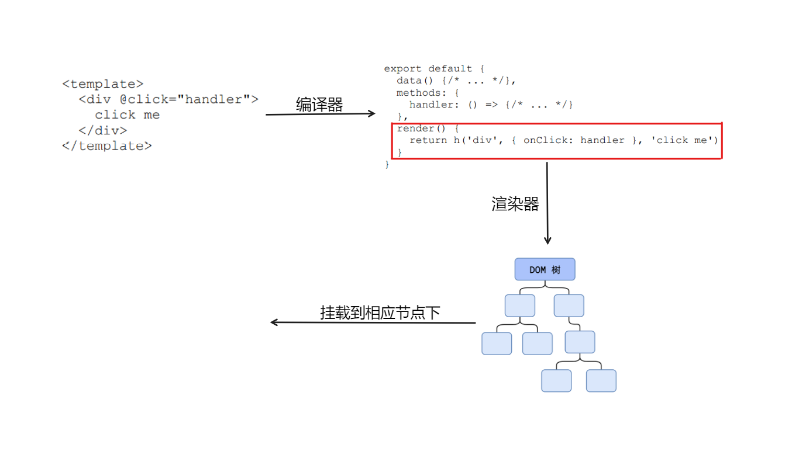
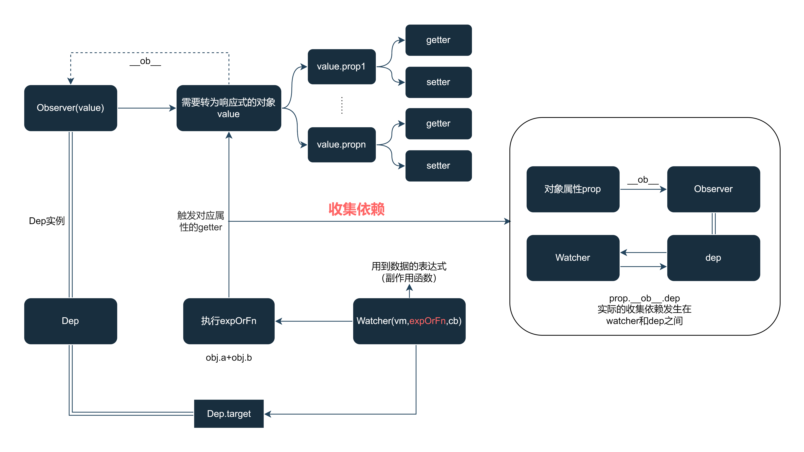
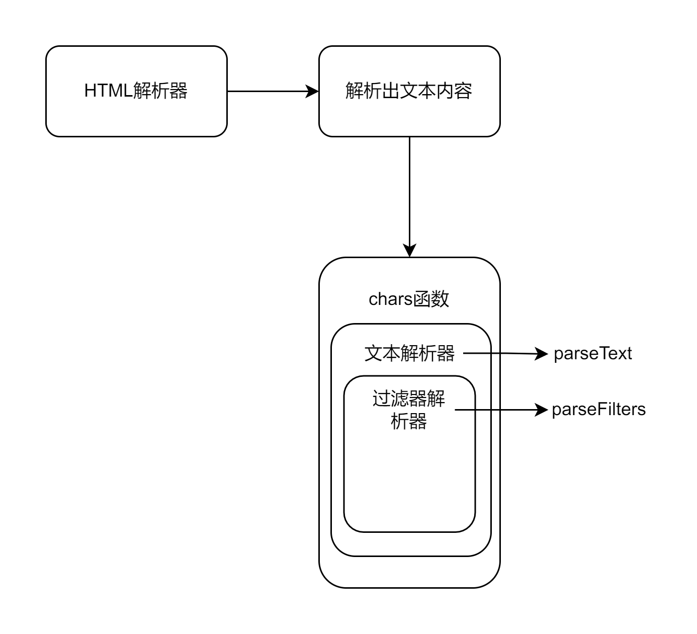
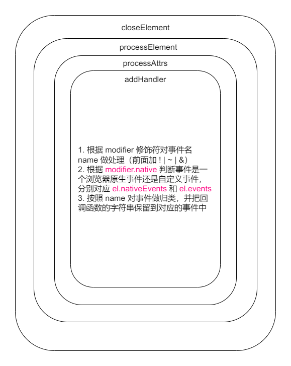

**目录结构**

```sh
├─src                    # 项目源代码
│    ├─complier          # 与模板编译相关的代码
│    ├─core              # 通用的、与运行平台无关的运行时代码
│    │  ├─observe        # 实现变化侦测的代码
│    │  ├─vdom           # 实现virtual dom的代码
│    │  ├─instance       # Vue.js实例的构造函数和原型方法
│    │  ├─global-api     # 全局api的代码
│    │  └─components     # 内置组件的代码
│    ├─server            # 与服务端渲染相关的代码
│    ├─platforms         # 特定运行平台的代码，如weexsh
│    ├─sfc               # 单文件组件的解析代码
│    └─shared            # 项目公用的工具代码
```

我们可以知道，Vue实际上完成了两件事， ==组件化== 和 ==响应式== 。

响应式使我们更加关注于数据的变化，由Vue自身来根据数据变化驱动视图更新。组件化中包含了 ==模板编译== ， ==Diff算法== ， ==渲染器== 等内容。



`template  ==> render ==> VNode ==> DOM` 

## 一、响应式

要想实现响应式，有两个关键性的问题，一个是 ==时机== ，一个是 ==对象== 。即我们首先要知道数据什么时候发生变化，其次要知道数据变化时通知哪部分的视图进行更新（谁用到数据更新谁）。

### 1. 对象的响应式



当为添加了响应式的对象属性设置新的值时，会取出`prop.__ob__.dep`中的所有`watcher`实例，重新执行其中的`expOrFn`。

> Observer(value)

**功能**：

- 实例化时递归地为value对象的每个属性添加`getter/setter`，在`getter`中收集依赖，在`setter`中通知依赖更新。
- 为value添加了`__ob__`属性，指向创建的`Observer`实例，标记此数据已经转为响应式。

**实例属性**：

- value：观察对象；
- dep：依赖管理器
- vmCount：将value作为data的组件数量

> Dep()

**功能**：用来管理已添加`getter/setter`属性的依赖

**实例属性**：

- id：dep的唯一标识
- subs：管理依赖的数组（其中存储的为watcher实例）

**静态属性**：

- target：用来暂存当前运行中的watcher实例

>  Watcher(vm,expOrFn,cb,[options,isRenderWatcher])

**功能**：类似于副作用函数的注册函数，dep存储的依赖本身，通知更新时重新执行副作用函数。

**实例属性**：

- deep: 是否深度监测
- user：此watcher实例是否为用户手动创建

-  lazy：是否懒执行
-  dirty：与lazy配套使用表明执行时机
-  sync：是否同步
  - 当`sync`为`true`时，表示该Watcher是同步执行的。即，在数据变化后，Watcher会立即执行同步任务队列中的回调，而不会异步延迟执行
  - 当`sync`为`false`时，表示该Watcher是异步执行的。即，在数据变化后，Watcher会被推入异步任务队列中，等待下一个事件循环（Event Loop）时才执行回调函数。这样可以利用Vue的 ==批量异步更新机制== ，提高性能和效率。
-  before： 需要在回调前执行的函数

### 2. 数组的响应式

很明显对于使用`Object.defineProperty`实现的响应式并不适用于数组对象，因此Vue为数组设立了其独自的响应式方案。

重写会改变原始数组的原生方法，将其拦截在数组实例与`Array.prototype`之间，这样使用这些方法时会优先使用改写之后的。

**定义**

```js
const arrayProto = Array.prototype;
export const arrayMethods = Object.create(arrayProto);

const methodsToPatch = [
  "push",
  "pop",
  "shift",
  "unshift",
  "splice",
  "sort",
  "reverse",
];
methodsToPatch.forEach(function (method) {
  // 缓存原生方法
  const original = arrayProto[method];
  def(arrayMethods, method, function mutator(...args) {
    const result = original.apply(this, args);
    const ob = this.__ob__; // 这里的this为响应式数据value
    let inserted;
    // 对数组新增元素添加侦测（push、unshift、splice）
    switch (method) {
      case "push":
      case "unshift":
        inserted = args; // 如果是push或unshift方法，那么传入参数就是新增的元素
        break;
      case "splice":
        inserted = args.slice(2); // 如果是splice方法，那么传入参数列表中下标为2的就是新增的元素
        break;
    }
    if (inserted) ob.observeArray(inserted); // 调用observe函数将新增的元素转化成响应式
    // 通知变化
    ob.dep.notify();
    return result;
  });
});
```

- 调用原生方法
- 为新增元素添加响应式
- 通知依赖更新

**使用**

```js {9-15}
class Observer {
    constructor(value: any) {
        this.value = value;
        this.dep = new Dep(); // 实例化一个依赖管理器，用来收集数组依赖
        this.vmCount = 0;
        def(value, "__ob__", this); // 附加Observer实例，标记已经转为响应式

        // 让自定义的数组方法替代原生方法执行(把它挂载到数组实例与Array.prototype之间)
        if (Array.isArray(value)) {
            if (hasProto) {
                protoAugment(value, arrayMethods);
            } else {
                copyAugment(value, arrayMethods, arrayKeys);
            }
            this.observeArray(value); // 将数组中的所有元素都转化为可被侦测的响应式
        } else {
            this.walk(value);
        }
    }

    walk(obj: Object) {
        const keys = Object.keys(obj);
        for (let i = 0; i < keys.length; i++) {
            defineReactive(obj, keys[i]);
        }
    }

    observeArray(items: Array<any>) {
        for (let i = 0, l = items.length; i < l; i++) {
            observe(items[i]);
        }
    }
}
```

- arr实例 ==> 改写后的方法对象 ==> Array的原型对象

**收集依赖**

```js
// ...省略其他代码
get: function reactiveGetter() {
    const value = getter ? getter.call(obj) : val;
    if (Dep.target) {
        dep.depend(); // 收集依赖
        if (childOb) {
            childOb.dep.depend();
            if (Array.isArray(value)) {
                dependArray(value);
            }
        }
    }
    return value;
}
// ...

function dependArray(value: Array<any>) {
  for (let e, i = 0, l = value.length; i < l; i++) {
    e = value[i];
    e && e.__ob__ && e.__ob__.dep.depend();
    if (Array.isArray(e)) {
      dependArray(e);
    }
  }
}
```

- 在访问数组内元素时，无法像属性`getter`那样拦截，所以通过递归遍历数组元素，手动调用`dep.depend()`来收集依赖。

### 3. 相关api

对于对象来说，通过`Object.defineProperty`方法实现的对`object`数据的观测仅仅只能观测到`object`数据的取值及设置值，当我们向`object`数据里添加一对新的`key/value`或删除一对已有的`key/value`时，它是无法观测到的。

而对于数组来说，响应式都必须借由改写后的方法来实现，所以我们直接使用数组下标`arr[0]=2`的方式来更改数据是监测不到的。

为了解决上述问题，`Vue`增加了两个全局API:`Vue.set`和`Vue.delete`。


> `Vue.set(target, propertyName / index, value)`<span id="set"></span>

```js
export function set(target: Array<any> | Object, key: any, val: any) {
  // target为undefined、null、原始值 
  if (
    process.env.NODE_ENV !== "production" &&
    (isUndef(target) || isPrimitive(target))
  ) {
    warn(
      `Cannot set reactive property on undefined, null, or primitive value: ${target}`
    );
  }
  // 数组
  if (Array.isArray(target) && isValidArrayIndex(key)) {
    target.length = Math.max(target.length, key);
    target.splice(key, 1, val); // splice已经被重写
    return val;
  }
  // 对象（非新增）
  if (key in target && !(key in Object.prototype)) {
    target[key] = val;
    return val;
  }
  const ob = target.__ob__;
  // 如果tragte是 Vue 实例，或者是 Vue 实例的根数据对象
  if (target._isVue || (ob && ob.vmCount)) {
    process.env.NODE_ENV !== "production" &&
      warn(
        "Avoid adding reactive properties to a Vue instance or its root $data " +
          "at runtime - declare it upfront in the data option."
      );
    return val;
  }
  // 非响应式对象
  if (!ob) {
    target[key] = val;
    return val;
  }
  defineReactive(ob.value, key, val);
  // 更新依赖 
  ob.dep.notify();
  return val;
}
```
- 数组：借用已重写的`splice`方法完成响应式
- 对象（非新增 | 非响应式）：直接修改对应属性的值
- 对象（新增）：调用`defineReactive`函数添加响应式
- 通知更新


> `Vue.delete(target, propertyName / index)`<span id="del"></span>

```js
export function del(target, key) {
  // target为undefined、null、原始值 
  if (
    process.env.NODE_ENV !== "production" &&
    (isUndef(target) || isPrimitive(target))
  ) {
    warn(
      `Cannot delete reactive property on undefined, null, or primitive value: ${target}`
    );
  }
  // 数组 
  if (Array.isArray(target) && isValidArrayIndex(key)) {
    target.splice(key, 1);
    return;
  }
  const ob = target.__ob__;
  // 如果tragte是 Vue 实例，或者是 Vue 实例的根数据对象
  if (target._isVue || (ob && ob.vmCount)) {
    process.env.NODE_ENV !== "production" &&
      warn(
        "Avoid deleting properties on a Vue instance or its root $data " +
          "- just set it to null."
      );
    return;
  }
  if (!hasOwn(target, key)) {
    return;
  }
  delete target[key];
  if (!ob) {
    return;
  }
  ob.dep.notify();
}
```

## 二、Diff算法

### 1. 虚拟DOM

所谓虚拟DOM，就是用一个`JS`对象来描述一个`DOM`节点，像如下示例：

```javascript
// <div class="a" id="b">我是内容</div>
{
  tag:'div',        // 元素标签
  attrs:{           // 属性
    class:'a',
    id:'b'
  },
  text:'我是内容',  // 文本内容
  children:[]       // 子元素
}
```

我们把组成一个`DOM`节点的必要东西通过一个`JS`对象表示出来，那么这个`JS`对象就可以用来描述这个`DOM`节点，我们把这个`JS`对象就称为是这个真实`DOM`节点的虚拟`DOM`节点。

**VNode节点**

```js
export default class VNode {
  constructor (
    tag?: string,
    data?: VNodeData,
    children?: ?Array<VNode>,
    text?: string,
    elm?: Node,
    context?: Component,
    componentOptions?: VNodeComponentOptions,
    asyncFactory?: Function
  ) {
    this.tag = tag                                /*当前节点的标签名*/
    this.data = data        /*当前节点对应的对象，包含了具体的一些数据信息，是一个VNodeData类型，可以参考VNodeData类型中的数据信息*/
    this.children = children  /*当前节点的子节点，是一个数组*/
    this.text = text     /*当前节点的文本*/
    this.elm = elm       /*当前虚拟节点对应的真实dom节点*/
    this.ns = undefined            /*当前节点的名字空间*/
    this.context = context          /*当前组件节点对应的Vue实例*/
    this.fnContext = undefined       /*函数式组件对应的Vue实例*/
    this.fnOptions = undefined		/*函数式组件对应的配置项*/
    this.fnScopeId = undefined
    this.key = data && data.key           /*节点的key属性，被当作节点的标志，用以优化*/
    this.componentOptions = componentOptions   /*组件的option选项*/
    this.componentInstance = undefined       /*当前节点对应的组件的实例*/
    this.parent = undefined           /*当前节点的父节点*/
    this.raw = false         /*简而言之就是是否为原生HTML或只是普通文本，innerHTML的时候为true，textContent的时候为false*/
    this.isStatic = false         /*静态节点标志*/
    this.isRootInsert = true      /*是否作为跟节点插入*/
    this.isComment = false             /*是否为注释节点*/
    this.isCloned = false           /*是否为克隆节点*/
    this.isOnce = false                /*是否有v-once指令*/
    this.asyncFactory = asyncFactory
    this.asyncMeta = undefined
    this.isAsyncPlaceholder = false
  }

  get child (): Component | void {
    return this.componentInstance
  }
}
```

- `VNode`类中包含了描述一个真实`DOM`节点所需要的一系列属性，如`tag`表示节点的标签名，`text`表示节点中包含的文本，`children`表示该节点包含的子节点等。通过 ==属性之间不同的搭配== ，就可以描述出各种类型的真实`DOM`节点。包括 ==注释节点、文本节点、元素节点、组件节点、函数式组件节点、克隆节点== 。
- 我们在视图渲染之前，把写好的`template`模板先编译成`VNode`并缓存下来，等到数据发生变化页面需要重新渲染的时候，我们把数据发生变化后生成的`VNode`与前一次缓存下来的`VNode`进行对比，找出差异，然后有差异的`VNode`对应的真实`DOM`节点就是需要重新渲染的节点，最后根据有差异的`VNode`创建出真实的`DOM`节点再插入到视图中，最终完成一次视图更新。

### 2. Diff算法

操作真实DOM是非常消耗性能的，Vue通过进行数据变化前后的虚拟`DOM-Diff`，最终做到只更新有差异的视图，从而达到尽可能少的操作真实`DOM`的目的，以节省性能。

`DOM-Diff`的过程也叫`patch`过程，即打补丁，本质上是**以新的VNode为基准，改造旧的oldVNode使之成为跟新的VNode一样，这就是patch过程要干的事**。

- 创建节点：新的`VNode`中有而旧的`oldVNode`中没有，就在旧的`oldVNode`中创建。
- 删除节点：新的`VNode`中没有而旧的`oldVNode`中有，就从旧的`oldVNode`中删除。
- 更新节点：新的`VNode`和旧的`oldVNode`中都有，就以新的`VNode`为准，更新旧的`oldVNode`。

`Vue`在模板编译后，`vnode`为一个对象，而`vnode.children`为一个数组，所以`vnode`节点之间的`patch`和`vnode`子节点之间的`patch`是存在区别的（会多一个循环的过程和一些特殊情况处理）。

> 创建元素节点

```js
// 创建元素节点
function createElm (vnode, parentElm, refElm) {
    const data = vnode.data
    const children = vnode.children
    const tag = vnode.tag
    if (isDef(tag)) {
        vnode.elm = nodeOps.createElement(tag, vnode)   // 创建元素节点
        createChildren(vnode, children, insertedVnodeQueue) // 创建元素节点的子节点
        insert(parentElm, vnode.elm, refElm)       // 插入到DOM中
    } else if (isTrue(vnode.isComment)) {
        vnode.elm = nodeOps.createComment(vnode.text)  // 创建注释节点
        insert(parentElm, vnode.elm, refElm)           // 插入到DOM中
    } else {
        vnode.elm = nodeOps.createTextNode(vnode.text)  // 创建文本节点
        insert(parentElm, vnode.elm, refElm)           // 插入到DOM中
    }
}

// 创建元素子节点
function createChildren(vnode, children, insertedVnodeQueue) {
    if (Array.isArray(children)) {
        if (process.env.NODE_ENV !== "production") {
            checkDuplicateKeys(children);
        }
        for (let i = 0; i < children.length; ++i) {
            createElm(
                children[i],
                insertedVnodeQueue,
                vnode.elm,
                null,
                true,
                children,
                i
            );
        }
    } else if (isPrimitive(vnode.text)) {
        nodeOps.appendChild(
            vnode.elm,
            nodeOps.createTextNode(String(vnode.text))
        );
    }
}
```

- 存在tag属性，为元素节点
- isComment为true，为注释节点
- 如果既不是元素节点，也不是注释节点，那就认为是文本节点


> 删除节点

```js
function removeNode (el) {
  const parent = nodeOps.parentNode(el)  // 获取父节点
  if (isDef(parent)) {
    nodeOps.removeChild(parent, el)  // 调用父节点的removeChild方法
  }
}
```

> 更新节点

**新旧vndoe之间的patch**

```js
function patchVnode(
 oldVnode,
 vnode,
 insertedVnodeQueue,
 ownerArray,
 index,
 removeOnly
) {
    // vnode与oldVnode是否完全一样？若是，退出程序
    if (oldVnode === vnode) {
        return;
    }

    if (isDef(vnode.elm) && isDef(ownerArray)) {
        // 克隆重复使用的节点
        vnode = ownerArray[index] = cloneVNode(vnode);
    }

    const elm = (vnode.elm = oldVnode.elm); // 旧节点对应的dom元素

    // 异步占位节点
    if (isTrue(oldVnode.isAsyncPlaceholder)) {
        if (isDef(vnode.asyncFactory.resolved)) {
            hydrate(oldVnode.elm, vnode, insertedVnodeQueue);
        } else {
            vnode.isAsyncPlaceholder = true;
        }
        return;
    }

 	// 在模板编译的优化阶段会标记静态节点
    // vnode与oldVnode是否都是静态节点？若是，退出程序
    if (
        isTrue(vnode.isStatic) &&
        isTrue(oldVnode.isStatic) &&
        vnode.key === oldVnode.key &&
        (isTrue(vnode.isCloned) || isTrue(vnode.isOnce))
    ) {
        vnode.componentInstance = oldVnode.componentInstance;
        return;
    }

    // 一些钩子函数
    let i;
    const data = vnode.data;
    if (isDef(data) && isDef((i = data.hook)) && isDef((i = i.prepatch))) {
        i(oldVnode, vnode);
    }
    const oldCh = oldVnode.children;
    const ch = vnode.children;
    if (isDef(data) && isPatchable(vnode)) {
        for (i = 0; i < cbs.update.length; ++i) cbs.update[i](oldVnode, vnode);
        if (isDef((i = data.hook)) && isDef((i = i.update))) i(oldVnode, vnode);
    }

    // vnode.text未定义
    if (isUndef(vnode.text)) {
        // vnode的子节点与oldVnode的子节点是否都存在？
        if (isDef(oldCh) && isDef(ch)) {
            // 若都存在，判断子节点是否相同，不同则更新子节点
            if (oldCh !== ch)
                updateChildren(elm, oldCh, ch, insertedVnodeQueue, removeOnly);
        }
        // 若只有vnode的子节点存在，则此节点为新增节点
        else if (isDef(ch)) {
            if (process.env.NODE_ENV !== "production") {
                checkDuplicateKeys(ch);
            }
            /**
         	 * 判断oldVnode是否有文本？
         	 * 若没有，则把vnode的子节点添加到真实DOM中
         	 * 若有，则清空Dom中的文本，再把vnode的子节点添加到真实DOM中
         	 */
            if (isDef(oldVnode.text)) nodeOps.setTextContent(elm, "");
            // 遍历ch，为每个元素创建dom，然后插入到elm中
            addVnodes(elm, null, ch, 0, ch.length - 1, insertedVnodeQueue);
        }
        // 若只有oldnode的子节点存在，此节点为需要删除的节点
        else if (isDef(oldCh)) {
            // 清空DOM中的子节点
            removeVnodes(elm, oldCh, 0, oldCh.length - 1);
        }
        // 若vnode和oldnode都没有子节点，但是oldnode中有文本
        else if (isDef(oldVnode.text)) {
            // 清空oldnode文本
            nodeOps.setTextContent(elm, "");
        }
    }
    // vnode.text已定义，vnode的text属性与oldVnode的text属性是否相同？
    else if (oldVnode.text !== vnode.text) {
        // 若不相同：则用vnode的text替换真实DOM的文本
        nodeOps.setTextContent(elm, vnode.text);
    }
    if (isDef(data)) {
        if (isDef((i = data.hook)) && isDef((i = i.postpatch)))
            i(oldVnode, vnode);
    }
}
```


**新旧vnode.children之间（数组）的patch**  

```js
function updateChildren(
    parentElm,
    oldCh,
    newCh,
    insertedVnodeQueue,
    removeOnly
  ) {
    let oldStartIdx = 0; // oldChildren开始索引
    let oldEndIdx = oldCh.length - 1; // oldChildren结束索引
    let oldStartVnode = oldCh[0]; // oldChildren中所有未处理节点中的第一个
    let oldEndVnode = oldCh[oldEndIdx]; // oldChildren中所有未处理节点中的最后一个

    let newStartIdx = 0; // newChildren开始索引
    let newEndIdx = newCh.length - 1; // newChildren结束索引
    let newStartVnode = newCh[0]; // newChildren中所有未处理节点中的第一个
    let newEndVnode = newCh[newEndIdx]; // newChildren中所有未处理节点中的最后一个

    let oldKeyToIdx, idxInOld, vnodeToMove, refElm;

    const canMove = !removeOnly;

    if (process.env.NODE_ENV !== "production") {
      checkDuplicateKeys(newCh);
    }

    // 以"新前"、"新后"、"旧前"、"旧后"的方式开始比对节点
    while (oldStartIdx <= oldEndIdx && newStartIdx <= newEndIdx) {
      if (isUndef(oldStartVnode)) {
        oldStartVnode = oldCh[++oldStartIdx]; // 如果oldStartVnode不存在，则直接跳过，比对下一个
      } else if (isUndef(oldEndVnode)) {
        oldEndVnode = oldCh[--oldEndIdx]; // 如果oldEndVnode不存在，则直接跳过，将oldEndIdx减1，比对前一个
      } else if (sameVnode(oldStartVnode, newStartVnode)) {
        // 如果新前与旧前节点相同，就把两个节点进行patch更新
        patchVnode(
          oldStartVnode,
          newStartVnode,
          insertedVnodeQueue,
          newCh,
          newStartIdx
        );
        // 将新旧节点皆移向下一个节点
        oldStartVnode = oldCh[++oldStartIdx];
        newStartVnode = newCh[++newStartIdx];
      } else if (sameVnode(oldEndVnode, newEndVnode)) {
        // 如果新后与旧后节点相同，就把两个节点进行patch更新
        patchVnode(
          oldEndVnode,
          newEndVnode,
          insertedVnodeQueue,
          newCh,
          newEndIdx
        );
        oldEndVnode = oldCh[--oldEndIdx];
        newEndVnode = newCh[--newEndIdx];
      } else if (sameVnode(oldStartVnode, newEndVnode)) {
        // 如果新后与旧前节点相同，先把两个节点进行patch更新，然后把旧前节点移动到oldChilren中所有未处理节点之后
        patchVnode(
          oldStartVnode,
          newEndVnode,
          insertedVnodeQueue,
          newCh,
          newEndIdx
        );
        canMove &&
          nodeOps.insertBefore(
            parentElm,
            oldStartVnode.elm,
            nodeOps.nextSibling(oldEndVnode.elm)
          );
        oldStartVnode = oldCh[++oldStartIdx];
        newEndVnode = newCh[--newEndIdx];
      } else if (sameVnode(oldEndVnode, newStartVnode)) {
        // 如果新前与旧后节点相同，先把两个节点进行patch更新，然后把旧后节点移动到oldChilren中所有未处理节点之前
        patchVnode(
          oldEndVnode,
          newStartVnode,
          insertedVnodeQueue,
          newCh,
          newStartIdx
        );
        canMove &&
          nodeOps.insertBefore(parentElm, oldEndVnode.elm, oldStartVnode.elm);
        oldEndVnode = oldCh[--oldEndIdx];
        newStartVnode = newCh[++newStartIdx];
      } else {
        // 如果不属于以上四种情况，就进行常规的循环比对patch
        if (isUndef(oldKeyToIdx))
          oldKeyToIdx = createKeyToOldIdx(oldCh, oldStartIdx, oldEndIdx);
        idxInOld = isDef(newStartVnode.key)
          ? oldKeyToIdx[newStartVnode.key]
          : findIdxInOld(newStartVnode, oldCh, oldStartIdx, oldEndIdx);
        // 如果在oldChildren里找不到当前循环的newChildren里的子节点
        if (isUndef(idxInOld)) {
          // 新增节点并插入到合适位置
          createElm(
            newStartVnode,
            insertedVnodeQueue,
            parentElm,
            oldStartVnode.elm,
            false,
            newCh,
            newStartIdx
          );
        } else {
          // 如果在oldChildren里找到了当前循环的newChildren里的子节点
          vnodeToMove = oldCh[idxInOld];
          // 如果两个节点相同
          if (sameVnode(vnodeToMove, newStartVnode)) {
            // 调用patchVnode更新节点
            patchVnode(
              vnodeToMove,
              newStartVnode,
              insertedVnodeQueue,
              newCh,
              newStartIdx
            );
            oldCh[idxInOld] = undefined;
            // canmove表示是否需要移动节点，如果为true表示需要移动，则移动节点，如果为false则不用移动
            canMove &&
              nodeOps.insertBefore(
                parentElm,
                vnodeToMove.elm,
                oldStartVnode.elm
              );
          } else {
            // same key but different element. treat as new element
            createElm(
              newStartVnode,
              insertedVnodeQueue,
              parentElm,
              oldStartVnode.elm,
              false,
              newCh,
              newStartIdx
            );
          }
        }
        newStartVnode = newCh[++newStartIdx];
      }
    }
    if (oldStartIdx > oldEndIdx) {
      /**
       * 如果oldChildren比newChildren先循环完毕，
       * 那么newChildren里面剩余的节点都是需要新增的节点，
       * 把[newStartIdx, newEndIdx]之间的所有节点都插入到DOM中
       */
      refElm = isUndef(newCh[newEndIdx + 1]) ? null : newCh[newEndIdx + 1].elm;
      addVnodes(
        parentElm,
        refElm,
        newCh,
        newStartIdx,
        newEndIdx,
        insertedVnodeQueue
      );
    } else if (newStartIdx > newEndIdx) {
      /**
       * 如果newChildren比oldChildren先循环完毕，
       * 那么oldChildren里面剩余的节点都是需要删除的节点，
       * 把[oldStartIdx, oldEndIdx]之间的所有节点都删除
       */
      removeVnodes(parentElm, oldCh, oldStartIdx, oldEndIdx);
    }
  }
```


## 三、模板编译


模板编译过程就是把用户写的模板经过一系列处理最终生成`render`函数的过程。其具体流程可大致分为三个阶段：

1. 模板解析阶段：将一堆模板字符串用正则等方式解析成抽象语法树`AST`； 解析器（parse）
2. 优化阶段：遍历`AST`，找出其中的静态节点，并打上标记； 优化器（optimizer）
3. 代码生成阶段：将`AST`转换成渲染函数； 代码生成器（codegen）

```js
// 源码位置: /src/complier/index.js

export const createCompiler = createCompilerCreator(function baseCompile (
  template: string,
  options: CompilerOptions
): CompiledResult {
  // 模板解析阶段：用正则等方式解析 template 模板中的指令、class、style等数据，形成AST
  const ast = parse(template.trim(), options)
  if (options.optimize !== false) {
    // 优化阶段：遍历AST，找出其中的静态节点，并打上标记；
    optimize(ast, options)
  }
  // 代码生成阶段：将AST转换成渲染函数；
  const code = generate(ast, options)
  return {
    ast,
    render: code.render,
    staticRenderFns: code.staticRenderFns
  }
})
```


### 1. 模板解析

在`<template></template>`模板内，除了有常规的`HTML`标签外，还会包含一些文本信息以及在文本信息中包含过滤器。而这些不同的内容在解析起来肯定需要不同的解析规则，所以解析器不可能只有一个，它应该除了有解析常规`HTML`的HTML解析器，还应该有解析文本的文本解析器以及解析文本中如果包含过滤器的过滤器解析器。

HTML解析器是主线， ==先用HTML解析器进行解析整个模板，在解析过程中如果碰到文本内容，那就调用文本解析器来解析文本，如果碰到文本中包含过滤器那就调用过滤器解析器来解析== 。



```js
export function parse(template, options) {
   // ...
  // 向parseHTML中传入start|end|chars|comment四个钩子函数
  parseHTML(template, {
    warn,
    expectHTML: options.expectHTML,
    isUnaryTag: options.isUnaryTag,
    canBeLeftOpenTag: options.canBeLeftOpenTag,
    shouldDecodeNewlines: options.shouldDecodeNewlines,
    shouldDecodeNewlinesForHref: options.shouldDecodeNewlinesForHref,
    shouldKeepComment: options.comments,
    // 当解析到开始标签时，调用该函数
    start (tag, attrs, unary) {

    },
    // 当解析到结束标签时，调用该函数
    end () {

    },
    /**
     * 当解析到文本时，调用该函数，生成文本类型的AST节点
     * 首先会判断文本是不是一个带变量的动态文本，如“hello ”。
     * 如果是动态文本，则创建动态文本类型的AST节点；
     * 如果不是动态文本，则创建纯静态文本类型的AST节点。
     */
    chars (text) {

    },
    // 当解析到注释时，调用该函数，该钩子函数会创建一个注释类型的AST节点。
    comment (text) {

    }
  })
  return root
}
```

在解析整个HTML的过程中，要完成的任务包括：

- 需要越过合法但无效的信息，比如：DOCTYPE、条件注释
- 提取出合法且有效的信息，并将其作为参数，依据信息类型，调用相应的钩子函数生成AST

其中`AST`的结构如下：

```js
function createASTElement(
  tag: string,
  attrs: Array<ASTAttr>,
  parent: ASTElement | void
): ASTElement {
  return {
    type: 1,
    tag,
    attrsList: attrs,
    attrsMap: makeAttrsMap(attrs),
    rawAttrsMap: {},
    parent,
    children: [],
  };
}
```

在调用`parseHTML`传入的配置项中，定义了四个钩子函数：`start、end、chars、comment`。

| 钩子函数 | 实现功能                                                     |
| -------- | ------------------------------------------------------------ |
| start    | 创建元素类型（1）的AST节点，进行一些预变换操作，执行解析模板中的结构化指令（v-for、v-if、v-once） |
| end      | 弹出调用栈栈顶的AST节点，在编译过程中处理元素的关闭操作，并进行相应的树管理（AST节点之间的层级关系） |
| chars    | 处理文本之间的回车符、空白符和编解码，调用parseText解析文本，根据返回的结果创建带变量（2）的AST节点或纯文本节点（3） |
| comment  | 创建注释节点（3且isComment为true）                           |

#### HTML解析器

1. 当前html字符串没有父节点或者父节点不是纯文本标签(`script,style,textarea`)
   1. 如果html字符串是以`<`开头,则有以下五种可能，一一去匹配尝试
      - 开始标签:`<div>`，提取组织数据格式，调用`start(tagName, attrs, unary, match.start, match.end)`
      - 结束标签:`</div>`，调用`end(stack[i].tag, start, end)`
      - 注释:`<!-- 我是注释 -->`，调用`comment('我是注释',start,end)`创建注释AST
      - 条件注释:`<!-- [if !IE] --> <!-- [endif] -->`，直接越过
      - DOCTYPE:`<!DOCTYPE html>`，直接越过
   2. `<` 不在第一个位置，说明html字符串以文本开头,需要提取出这段文本，然后越过
   3. 整个模板字符串里没有找到`<`,说明整个模板字符串都是文本
   4. 越过文本内容，然后把截取出来的`text`转化成`textAST`，`chars(text, start, end)`
2. 父元素为`script、style、textarea`时，因为在这三个标签里的内容肯定不会有HTML标签，所以其内部的内容全部当做纯文本处理

```js
export function parseHTML(html, options) {
    const stack = []; // 维护AST节点层级的栈
    const expectHTML = options.expectHTML;
    const isUnaryTag = options.isUnaryTag || no; // 是否自闭和
    const canBeLeftOpenTag = options.canBeLeftOpenTag || no; //用来检测一个标签是否是可以省略闭合标签的非自闭合标签
    let index = 0; //解析游标，标识当前从何处开始解析模板字符串
    let last, // 存储剩余还未解析的模板字符串·
        lastTag; // 存储着位于 stack 栈顶的元素

    // 开启一个 while 循环，循环结束的条件是 html 为空，即 html 被 parse 完毕
    while (html) {
        last = html;
        // 确保即将 parse 的内容不是在纯文本标签里 (script,style,textarea)
        // !lastTag表示当前html字符串没有父节点
        // 也就是说当前html字符串要么没有父节点要么父节点不是纯文本标签
        if (!lastTag || !isPlainTextElement(lastTag)) {
            let textEnd = html.indexOf("<");
            /**
       * 如果html字符串是以'<'开头,则有以下五种可能
       * 1. 开始标签:<div>
       * 2. 结束标签:</div>
       * 3. 注释:<!-- 我是注释 -->
       * 4. 条件注释:<!-- [if !IE] --> <!-- [endif] -->
       * 5. DOCTYPE:<!DOCTYPE html>
       * 需要一一去匹配尝试
       */
            if (textEnd === 0) {
                // 若为注释，则继续查找是否存在'-->'
                if (comment.test(html)) {
                    const commentEnd = html.indexOf("-->");

                    if (commentEnd >= 0) {
                        // 若存在 '-->',继续判断options中是否保留注释
                        if (options.shouldKeepComment) {
                            // 若保留注释，则把注释截取出来传给options.comment，创建注释类型的AST节点
                            options.comment(
                                html.substring(4, commentEnd),
                                index,
                                index + commentEnd + 3
                            );
                        }
                        // 若不保留注释，则将游标移动到'-->'之后，继续向后解析
                        advance(commentEnd + 3);
                        continue;
                    }
                }

                // 解析是否是条件注释
                if (conditionalComment.test(html)) {
                    // 若为条件注释，则继续查找是否存在']>'
                    const conditionalEnd = html.indexOf("]>");

                    // 若存在 ']>',则从原本的html字符串中把条件注释截掉，
                    // 把剩下的内容重新赋给html，继续向后匹配
                    if (conditionalEnd >= 0) {
                        advance(conditionalEnd + 2);
                        continue;
                    }
                }

                // 解析是否是DOCTYPE
                const doctypeMatch = html.match(doctype);
                if (doctypeMatch) {
                    advance(doctypeMatch[0].length);
                    continue;
                }

                // 解析是否是结束标签
                const endTagMatch = html.match(endTag);
                if (endTagMatch) {
                    const curIndex = index;
                    advance(endTagMatch[0].length);
                    parseEndTag(endTagMatch[1], curIndex, index);
                    continue;
                }

                // 解析是否是开始标签
                const startTagMatch = parseStartTag(); // match{tagName,attrs,start}
                if (startTagMatch) {
                    handleStartTag(startTagMatch);
                    if (shouldIgnoreFirstNewline(startTagMatch.tagName, html)) {
                        advance(1);
                    }
                    continue;
                }
            }

            let text, rest, next;
            // '<' 不在第一个位置，说明html字符串以文本开头,需要提取出这段文本
            if (textEnd >= 0) {
                // 如果html字符串不是以'<'开头,说明'<'前面的都是纯文本，无需处理
                // 那就把'<'以后的内容拿出来赋给rest
                rest = html.slice(textEnd);
                while (
                    !endTag.test(rest) &&
                    !startTagOpen.test(rest) &&
                    !comment.test(rest) &&
                    !conditionalComment.test(rest)
                ) {
                    /**
           * 用'<'以后的内容rest去匹配endTag、startTagOpen、comment、conditionalComment
           * 如果都匹配不上，表示'<'是属于文本本身的内容
           */
                    // 在'<'之后查找是否还有'<'
                    next = rest.indexOf("<", 1);
                    // 如果没有了，表示'<'后面也是文本
                    if (next < 0) break;
                    // 如果还有，表示'<'是文本中的一个字符
                    textEnd += next;
                    // 那就把next之后的内容截出来继续下一轮循环匹配
                    rest = html.slice(textEnd);
                }
                // '<'是结束标签的开始 ,说明从开始到'<'都是文本，截取出来
                text = html.substring(0, textEnd);
            }

            // 整个模板字符串里没有找到`<`,说明整个模板字符串都是文本
            if (textEnd < 0) {
                text = html;
            }

            if (text) {
                advance(text.length);
            }

            // 把截取出来的text转化成textAST
            if (options.chars && text) {
                options.chars(text, index - text.length, index);
            }
        }
        // 父元素为script、style、textarea时，其内部的内容全部当做纯文本处理
        // 因为在这三个标签里的内容肯定不会有HTML标签
        else {
            let endTagLength = 0;
            const stackedTag = lastTag.toLowerCase(); //当前正在处理的标签名
            const reStackedTag =
                  reCache[stackedTag] ||
                  (reCache[stackedTag] = new RegExp(
                      "([\\s\\S]*?)(</" + stackedTag + "[^>]*>)",
                      "i"
                  ));
            // 回调函数会在每次匹配到闭合标签时被调用
            const rest = html.replace(reStackedTag, function (all, text, endTag) {
                endTagLength = endTag.length;
                if (!isPlainTextElement(stackedTag) && stackedTag !== "noscript") {
                    text = text
                        .replace(/<!\--([\s\S]*?)-->/g, "$1") // #7298
                        .replace(/<!\[CDATA\[([\s\S]*?)]]>/g, "$1");
                }
                if (shouldIgnoreFirstNewline(stackedTag, text)) {
                    text = text.slice(1);
                }
                if (options.chars) {
                    options.chars(text);
                }
                return "";
            });
            index += html.length - rest.length;
            html = rest;
            parseEndTag(stackedTag, index - endTagLength, index);
        }

        // 经过上述所有处理逻辑处理过后，html字符串没有任何变化，表示html字符串没有匹配上任何一条规则，那么就把html字符串当作纯文本对待
        if (html === last) {
            options.chars && options.chars(html);
            if (
                process.env.NODE_ENV !== "production" &&
                !stack.length &&
                options.warn
            ) {
                options.warn(`Mal-formatted tag at end of template: "${html}"`, {
                    start: index + html.length,
                });
            }
            break;
        }
    }

    // Clean up any remaining tags
    // 调用parseEndTag函数并不传递任何参数
    // 用于处理栈中剩余未处理的标签
    parseEndTag();

    /**
   * 移动解析游标
   * @param {*} n 字符串向右移动的索引数
   */
    function advance(n) {
        index += n;
        html = html.substring(n);
    }

  /**
   * 解析开始标签
   * @example
   * match{
   *  tagName:'div',
   *  start:,
   *  end:,
   *  attrs:[
   *    ["class="a"", "class", "=", "a", undefined, undefined, index: 0, input: "class="a" id="b"></div>", groups: undefined],
   *    ...
   *  ]
   * }
   */
    function parseStartTag() {
        // 解析开始标签  // '<div></div>'.match(startTagOpen)  => ['<div','div',index:0,input:'<div></div>']
        const start = html.match(startTagOpen);
        if (start) {
            const match = {
                tagName: start[1],
                attrs: [],
                start: index,
            };
            advance(start[0].length);
            let end, attr;
            /**
       * <div a=1 b=2 c=3></div>
       * 从<div之后到开始标签的结束符号'>'之前，一直匹配属性attrs
       * 所有属性匹配完之后，html字符串还剩下
       * 自闭合标签剩下：'/>'
       * 非自闭合标签剩下：'></div>'
       */
            // 解析标签属性
            // 不符合开始标签的结束特征（startTagClose）并且符合标签属性的特征，说明还有未提取出的标签属性
            while (
                !(end = html.match(startTagClose)) &&
                (attr = html.match(dynamicArgAttribute) || html.match(attribute))
            ) {
                attr.start = index;
                advance(attr[0].length);
                attr.end = index;
                match.attrs.push(attr);
            }
            /**
       * 这里判断了该标签是否为自闭合标签
       * 自闭合标签如:<input type='text' />
       * 非自闭合标签如:<div></div>
       * '></div>'.match(startTagClose) => [">", "", index: 0, input: "></div>", groups: undefined]
       * '/><div></div>'.match(startTagClose) => ["/>", "/", index: 0, input: "/><div></div>", groups: undefined]
       * 因此，我们可以通过end[1]是否是"/"来判断该标签是否是自闭合标签
       */
            if (end) {
                match.unarySlash = end[1];
                advance(end[0].length);
                match.end = index;
                return match;
            }
        }
    }

    /**
   * 处理提取出的信息(attrs),
   * 组装好数据之后创建ast节点
   * @example
   * attrs:[
   *  {
   *    name:'class',
   *    value:'a'
   *  }
   * ]
   *
   */
    function handleStartTag(match) {
        const tagName = match.tagName; // 开始标签的标签名
        const unarySlash = match.unarySlash; // 是否为自闭合标签的标志，自闭合为"",非自闭合为"/"

        if (expectHTML) {
            if (lastTag === "p" && isNonPhrasingTag(tagName)) {
                parseEndTag(lastTag);
            }
            if (canBeLeftOpenTag(tagName) && lastTag === tagName) {
                parseEndTag(tagName);
            }
        }

        const unary = isUnaryTag(tagName) || !!unarySlash; // 布尔值，标志是否为自闭合标签
        const l = match.attrs.length; // match.attrs 数组的长度
        const attrs = new Array(l); // 一个与match.attrs数组长度相等的数组

        for (let i = 0; i < l; i++) {
            // ["class="a"", "class", "=", "a", undefined, undefined, index: 0, input: "class="a" id="b"></div>", groups: undefined]
            const args = match.attrs[i];
            const value = args[3] || args[4] || args[5] || "";
            // 做一些兼容性处理， 如果 shouldDecodeNewlines 为 true，意味着 Vue 在编译模板的时候，要对属性值中的换行符或制表符做兼容处理。
            // shouldDecodeNewlinesForHref为true 意味着Vue在编译模板的时候，要对a标签的 href属性值中的换行符或制表符做兼容处理
            const shouldDecodeNewlines =
                  tagName === "a" && args[1] === "href"
            ? options.shouldDecodeNewlinesForHref
            : options.shouldDecodeNewlines;
            attrs[i] = {
                name: args[1], // 标签属性的属性名，如class
                value: decodeAttr(value, shouldDecodeNewlines), // 标签属性的属性值，如class对应的a
            };
            if (process.env.NODE_ENV !== "production" && options.outputSourceRange) {
                attrs[i].start = args.start + args[0].match(/^\s*/).length;
                attrs[i].end = args.end;
            }
        }

        // 如果该标签是非自闭合标签，则将标签推入栈中
        if (!unary) {
            stack.push({
                tag: tagName,
                lowerCasedTag: tagName.toLowerCase(),
                attrs: attrs,
                start: match.start,
                end: match.end,
            });
            lastTag = tagName;
        }

        // 如果该标签是自闭合标签，调用start钩子函数并传入处理好的参数来创建AST节点
        if (options.start) {
            options.start(tagName, attrs, unary, match.start, match.end);
        }
    }

    /** 解析结束标签，从标签栈中匹配正确的标签 */
    function parseEndTag(tagName, start, end) {
        let pos, lowerCasedTagName;
        if (start == null) start = index;
        if (end == null) end = index;

        /**
     * 如果tagName存在，那么就从后往前遍历栈，
     * 在栈中寻找与tagName相同的标签并记录其所在的位置pos，
     * 如果tagName不存在，则将pos置为0
     */
        if (tagName) {
            lowerCasedTagName = tagName.toLowerCase();
            for (pos = stack.length - 1; pos >= 0; pos--) {
                if (stack[pos].lowerCasedTag === lowerCasedTagName) {
                    break;
                }
            }
        } else {
            // If no tag name is provided, clean shop
            pos = 0;
        }

        // pos>=0，说明栈中存在与之对应的开始标签
        if (pos >= 0) {
            /**
       * 正常的pos应该是栈顶位置，后面不应该再有元素，
       * 如果后面还有元素，那么后面的元素就都缺少闭合标签
       */
            for (let i = stack.length - 1; i >= pos; i--) {
                if (
                    process.env.NODE_ENV !== "production" &&
                    (i > pos || !tagName) &&
                    options.warn
                ) {
                    options.warn(`tag <${stack[i].tag}> has no matching end tag.`, {
                        start: stack[i].start,
                    });
                }
                if (options.end) {
                    options.end(stack[i].tag, start, end);
                }
            }

            // 把pos位置以后的元素都从stack栈中弹出，以及把lastTag更新为栈顶元素:
            stack.length = pos;
            lastTag = pos && stack[pos - 1].tag;
        }

        // pos<0,在 stack 栈中没有找到对应的开始标签
        // 判断 tagName 是否为br 或p标签
        // 浏览器会自动把</br>标签解析为正常的 <br>标签，而对于</p>浏览器则自动将其补全为<p></p>
        else if (lowerCasedTagName === "br") {
            if (options.start) {
                options.start(tagName, [], true, start, end); // 创建<br>AST节点
            }
        } else if (lowerCasedTagName === "p") {
            // 补全p标签并创建AST节点
            if (options.start) {
                options.start(tagName, [], false, start, end);
            }
            if (options.end) {
                options.end(tagName, start, end);
            }
        }
    }
}
```

#### 文本解析器

```js
export function parseText(
  text: string, //传入的文本
  delimiters?: [string, string] //可选参数，自定义包裹变量所用符号
): TextParseResult | void {
  const tagRE = delimiters ? buildRegex(delimiters) : defaultTagRE;
  if (!tagRE.test(text)) {
    return;
  }
  const tokens = [];
  const rawTokens = [];
  let lastIndex = (tagRE.lastIndex = 0); // tagRE.lastIndex表示下一次开始搜索的索引值
  let match, index, tokenValue;
  while ((match = tagRE.exec(text))) {
    // ['{{name}}', 'name', index: 0, input: '{{name}}', groups: undefined]
    index = match.index; // 第一个匹配项的起始位置
    // push text token
    if (index > lastIndex) {
      // 先把'{{'前面的文本放入tokens中
      rawTokens.push((tokenValue = text.slice(lastIndex, index)));
      tokens.push(JSON.stringify(tokenValue));
    }
    // 如果index不大于lastIndex，那说明index也为0，即该文本一开始就是变量
    // 取出'{{ }}'中间的变量exp
    const exp = parseFilters(match[1].trim());
    // 把变量exp改成_s(exp)形式也放入tokens中
    tokens.push(`_s(${exp})`);
    rawTokens.push({ "@binding": exp });
    // 更新lastIndex
    lastIndex = index + match[0].length;
  }
  // 当剩下的text不再被正则匹配上时，表示所有变量已经处理完毕
  // 此时如果lastIndex < text.length，表示在最后一个变量后面还有文本
  // 最后将后面的文本再加入到tokens中
  if (lastIndex < text.length) {
    rawTokens.push((tokenValue = text.slice(lastIndex)));
    tokens.push(JSON.stringify(tokenValue));
  }

  return {
    expression: tokens.join("+"),
    tokens: rawTokens,
  };
}
```

* 判断传入的文本是否包含变量
* 构造`expression`
* 构造`tokens`

 ```js
 //"我叫{{name}}，我今年{{age}}岁了"
 res = {
     expression:"我叫"+_s(name)+"，我今年"+_s(age)+"岁了",
     tokens:[
         "我叫",
         {'@binding': name },
         "，我今年"
         {'@binding': age },
     	"岁了",
     ]
 }
 ```

#### 过滤器解析器<span id="filter"></span>

```js
export function parseFilters(exp: string): string {
  let inSingle = false; // exp是否在 '' 中
  let inDouble = false; // exp是否在 "" 中
  let inTemplateString = false; // exp是否在 `` 中
  let inRegex = false; // exp是否在 \\ 中
  let curly = 0; // 在exp中发现一个 { 则curly加1，发现一个 } 则curly减1，直到culy为0 说明 { ... }闭合
  let square = 0; // 在exp中发现一个 [ 则curly加1，发现一个 ] 则curly减1，直到culy为0 说明 [ ... ]闭合
  let paren = 0; // 在exp中发现一个 ( 则curly加1，发现一个 ) 则curly减1，直到culy为0 说明 ( ... )闭合
  let lastFilterIndex = 0;
  let c, prev, i, expression, filters;

  for (i = 0; i < exp.length; i++) {
    prev = c;
    c = exp.charCodeAt(i);

    // \'、\"、\`、\/
    if (inSingle) {
      if (c === 0x27 && prev !== 0x5c) inSingle = false;
    } else if (inDouble) {
      if (c === 0x22 && prev !== 0x5c) inDouble = false;
    } else if (inTemplateString) {
      if (c === 0x60 && prev !== 0x5c) inTemplateString = false;
    } else if (inRegex) {
      if (c === 0x2f && prev !== 0x5c) inRegex = false;
    }

    // 单个 | 符号且括号闭合
    else if (
      c === 0x7c &&
      exp.charCodeAt(i + 1) !== 0x7c &&
      exp.charCodeAt(i - 1) !== 0x7c &&
      !curly &&
      !square &&
      !paren
    ) {
      if (expression === undefined) {
        // first filter, end of expression
        lastFilterIndex = i + 1;
        expression = exp.slice(0, i).trim(); // 存储待处理的表达式
      }
      // 存在多个‘|’符，将中间的filter放入filters数组
      else {
        pushFilter();
      }
    } else {
      switch (c) {
        case 0x22:
          inDouble = true;
          break; // "
        case 0x27:
          inSingle = true;
          break; // '
        case 0x60:
          inTemplateString = true;
          break; // `
        case 0x28:
          paren++;
          break; // (
        case 0x29:
          paren--;
          break; // )
        case 0x5b:
          square++;
          break; // [
        case 0x5d:
          square--;
          break; // ]
        case 0x7b:
          curly++;
          break; // {
        case 0x7d:
          curly--;
          break; // }
      }
      if (c === 0x2f) {
        // /
        let j = i - 1;
        let p;
        // find first non-whitespace prev char
        for (; j >= 0; j--) {
          p = exp.charAt(j);
          if (p !== " ") break;
        }
        if (!p || !validDivisionCharRE.test(p)) {
          inRegex = true;
        }
      }
    }
  }

  // 不存在 | 过滤符，全部为表达式
  if (expression === undefined) {
    expression = exp.slice(0, i).trim();
  }
  // 将最后一个|过滤符后面的加入fiters
  else if (lastFilterIndex !== 0) {
    pushFilter();
  }

  function pushFilter() {
    (filters || (filters = [])).push(exp.slice(lastFilterIndex, i).trim());
    lastFilterIndex = i + 1;
  }

  if (filters) {
    for (i = 0; i < filters.length; i++) {
      expression = wrapFilter(expression, filters[i]);
    }
  }

  return expression;
}
```

示例

```js
// input:
message | filter1 | filter2(arg)
// wrapFilter调用前
expression = 'message'
filters = ['filter1','filter2(arg)']
// wrapFilter调用后
_f("filter2")(_f("filter1")('message'),arg)
```

### 2. 优化阶段

有一种节点一旦首次渲染之后不管状态再怎么变化它都不会变了，这种节点叫做静态节点。优化节点的目标就是：

- 在`AST`中找出所有静态节点并打上标记；
- 在`AST`中找出所有静态根节点并打上标记；

> 判断一个ast节点本身是否为静态节点

```js
function isStatic(node: ASTNode): boolean {
  if (node.type === 2) {
    // 包含变量的动态文本节点
    return false;
  }
  if (node.type === 3) {
    // 不包含变量的纯文本节点
    return true;
  }
  // 此时为元素节点，进一步判断
  return !!(
    (
      node.pre || //使用了v-pre指令
      (!node.hasBindings && // 不能使用动态绑定语法，即标签上不能有v-、@、:开头的属性；
        !node.if && // 不能使用v-if、v-else、v-for指令
        !node.for && // not v-if or v-for or v-else
        !isBuiltInTag(node.tag) && // 不能是内置组件，即标签名不能是slot和component；
        isPlatformReservedTag(node.tag) && // 标签名必须是平台保留标签，即不能是组件
        !isDirectChildOfTemplateFor(node) && //当前节点的父节点不能是带有 v-for 的 template 标签；
        Object.keys(node).every(isStaticKey))
    ) //节点的所有属性的 key 都必须是静态节点才有的 key；
  );
}
```

> 标记静态节点

```js
function markStatic(node: ASTNode) {
  node.static = isStatic(node);
  if (node.type === 1) {
	// 不处理slot函数内部的组件
    if (
      !isPlatformReservedTag(node.tag) &&
      node.tag !== "slot" &&
      node.attrsMap["inline-template"] == null
    ) {
      return;
    }
    for (let i = 0, l = node.children.length; i < l; i++) {
      const child = node.children[i];
      // 递归标记子节点，有一个为false即为false
      markStatic(child);
      if (!child.static) {
        node.static = false;
      }
    }
    /**
     * 循环node.children后还不算把所有子节点都遍历完，
     * 因为如果当前节点的子节点中有标签带有v-if、v-else-if、v-else等指令时，
     * 这些子节点在每次渲染时都只渲染一个，所以其余没有被渲染的肯定不在node.children中，
     * 而是存在于node.ifConditions，所以我们还要把node.ifConditions循环一遍
     */
    if (node.ifConditions) {
      for (let i = 1, l = node.ifConditions.length; i < l; i++) {
        const block = node.ifConditions[i].block;
        markStatic(block);
        if (!block.static) {
          node.static = false;
        }
      }
    }
  }
}
```

> 标记静态根节点

```js
function markStaticRoots(node: ASTNode, isInFor: boolean) {
  if (node.type === 1) {
    //已经是 static 的节点或者是 v-once 指令的节点
    if (node.static || node.once) {
      node.staticInFor = isInFor;
    }
    /*
     * 为了使节点有资格作为静态根节点，它应具有不只是静态文本的子节点。 否则，优化的成本将超过收益，最好	 * 始终将其更新。
     */
    if (
      node.static &&
      node.children.length &&
      !(node.children.length === 1 && node.children[0].type === 3)
    ) {
      node.staticRoot = true;
      return;
    } else {
      node.staticRoot = false;
    }
    // 如果当前节点不是静态根节点，那就继续递归遍历它的子节点
    if (node.children) {
      for (let i = 0, l = node.children.length; i < l; i++) {
        markStaticRoots(node.children[i], isInFor || !!node.for);
      }
    }
    if (node.ifConditions) {
      for (let i = 1, l = node.ifConditions.length; i < l; i++) {
        markStaticRoots(node.ifConditions[i].block, isInFor);
      }
    }
  }
}
```

静态根节点必须满足如下条件，否则的话，对它的优化成本将大于优化后带来的收益。

- 节点本身必须是静态节点；
- 必须拥有子节点 children；
- 子节点不能只是只有一个文本节点；

### 3.代码生成

```js
export function generate (ast,option) {
  const state = new CodegenState(options)
  const code = ast ? genElement(ast, state) : '_c("div")'
  return {
    render: `with(this){return ${code}}`,
    staticRenderFns: state.staticRenderFns
  }
}
```

`genElement`函数定义如下：

```js
export function genElement (el: ASTElement, state: CodegenState): string {
  if (el.staticRoot && !el.staticProcessed) {
    return genStatic(el, state)
  } else if (el.once && !el.onceProcessed) {
    return genOnce(el, state)
  } else if (el.for && !el.forProcessed) {
    return genFor(el, state)
  } else if (el.if && !el.ifProcessed) {
    return genIf(el, state)
  } else if (el.tag === 'template' && !el.slotTarget) {
    return genChildren(el, state) || 'void 0'
  } else if (el.tag === 'slot') {
    return genSlot(el, state)
  } else {
    // component or element
    let code
    if (el.component) {
      code = genComponent(el.component, el, state)
    } else {
      const data = el.plain ? undefined : genData(el, state)

      const children = el.inlineTemplate ? null : genChildren(el, state, true)
      code = `_c('${el.tag}'${
        data ? `,${data}` : '' // data
      }${
        children ? `,${children}` : '' // children
      })`
    }
    // module transforms
    for (let i = 0; i < state.transforms.length; i++) {
      code = state.transforms[i](el, code)
    }
    return code
  }
}
```

根据当前 `AST` 元素节点属性的不同从而执行不同的代码生成函数：

- 元素节点：`_c(tagName,data,children)`
- 文本节点：`_v(text.expression)`或`_v(text)`
- 注释节点：`_e(comment.text)`

- slot：`_t(slotName,children,attrs)`

- ......

#### 举例

> `template`

```html
<div id="NLRX"><p>Hello {{name}}</p></div>
```

> 模板编译优化后的`AST`
```js
ast = {
    'type': 1,
    'tag': 'div',
    'attrsList': [
        {
            'name':'id',
            'value':'NLRX',
        }
    ],
    'attrsMap': {
      'id': 'NLRX',
    },
    'static':false,
    'parent': undefined,
    'plain': false,
    'children': [{
      'type': 1,
      'tag': 'p',
      'plain': false,
      'static':false,
      'children': [
        {
            'type': 2,
            'expression': '"Hello "+_s(name)',
            'text': 'Hello {{name}}',
            'static':false,
        }
      ]
    }]
  }
```

> 生成的render代码

```js
{
    render: ` 
    with(this){
       return _c(
         'div',
         {
           attrs:{"id":"NLRX"},
         },
         [
           _c(
             'p',
             {
               attrs:{}
             },
             [
               _v("Hello "+_s(name))
             ]
           )
         ]
       )
     }`,
    staticRenderFns: state.staticRenderFns,
};
```

`_c、_v、_e `代表了不同的辅助函数，利用其括号内传入的参数，生成不同的`VNode`节点。

- `_c`：`_c` 是 `createElement` 函数的别名，用于创建 VNode，即创建一个虚拟 DOM 元素。它接受三个参数，分别是标签名、元素属性对象和子元素数组。
- `_v`：`_v` 是 `createTextVNode` 函数的别名，用于创建文本节点的 VNode，即创建一个只包含文本内容的虚拟 DOM 元素。它接受一个参数，即要显示的文本内容。

- `_s`：`_s` 是 `toString` 函数的别名，用于将 JavaScript 表达式转换为字符串。它接受一个参数，即要转换为字符串的表达式。
- `_e`：`_e` 是 `createEmptyVNode` 函数的别名，用于创建一个空的 VNode。它可以用作占位符，或者在某些无内容的情况下作为默认 VNode（注释节点）

**其他辅助函数**

```js
export function installRenderHelpers (target: any) {
  target._o = markOnce //v-once
  target._n = toNumber
  target._s = toString
  target._l = renderList //v-for
  target._t = renderSlot
  target._q = looseEqual
  target._i = looseIndexOf
  target._m = renderStatic
  target._f = resolveFilter //filter
  target._k = checkKeyCodes
  target._b = bindObjectProps
  target._v = createTextVNode
  target._e = createEmptyVNode
  target._u = resolveScopedSlots
  target._g = bindObjectListeners
  target._d = bindDynamicKeys
  target._p = prependModifier
}
```

## 四、生命周期


### 1. 初始化整体流程

在初始化阶段的工作主要是：

- 初始化配置项，包括初始化组件的配置项和合并配置项
- 初始化代理，在访问vm属性出错时提示错误
- 初始化生命周期、初始化事件、初始化渲染
- 调用`beforeCreate`生命周期钩子函数
- 初始化injections、初始化State(`props,methods,data,computed,watch`)、初始化provide
- 调用`created`生命周期钩子函数
- 如果el存在，调用$mount挂载

> 整个初始化阶段就是在给vm挂载各种的属性对象。

```js
function Vue(options) {
  if (process.env.NODE_ENV !== "production" && !(this instanceof Vue)) {
    warn("Vue is a constructor and should be called with the `new` keyword");
  }
  this._init(options);
}

export function initMixin (Vue: Class<Component>) {
  Vue.prototype._init = function (options?: Object) {
    const vm: Component = this
    // a uid
    vm._uid =       ++

    let startTag, endTag
    /* istanbul ignore if */
    if (process.env.NODE_ENV !== 'production' && config.performance && mark) {
      startTag = `vue-perf-start:${vm._uid}`
      endTag = `vue-perf-end:${vm._uid}`
      mark(startTag)
    }

    // a flag to avoid this being observed
    vm._isVue = true
    // 合并配置项
    if (options && options._isComponent) {
      // optimize internal component instantiation
      // since dynamic options merging is pretty slow, and none of the
      // internal component options needs special treatment.
      initInternalComponent(vm, options)
    } else {
      // 合并配置项（其中规范化了props、inject、directives）
      vm.$options = mergeOptions(
        resolveConstructorOptions(vm.constructor),
        options || {},
        vm
      )
    }

    /* istanbul ignore else */
    if (process.env.NODE_ENV !== 'production') {
      // 在访问vm属性出错时提示错误
      initProxy(vm)
    } else {
      vm._renderProxy = vm
    }
    // expose real self
    vm._self = vm
    initLifecycle(vm) // 初始化生命周期
    initEvents(vm) // 初始化事件
    initRender(vm) // 初始化渲染
    callHook(vm, 'beforeCreate') // 调用生命周期钩子函数
    initInjections(vm) // 初始化injections
    initState(vm) // 初始化props,methods,data,computed,watch
    initProvide(vm) // 初始化 provide
    callHook(vm, 'created') // 调用生命周期钩子函数

    /* istanbul ignore if */
    // 衡量性能
    if (process.env.NODE_ENV !== 'production' && config.performance && mark) {
      vm._name = formatComponentName(vm, false)
      mark(endTag)
      measure(`vue ${vm._name} init`, startTag, endTag)
    }

    if (vm.$options.el) {
      vm.$mount(vm.$options.el)
    }
  }
}
```

在生命周期开始前先 ==合并配置项== ，确定`vm.$options`的取值。

### 2. 初始化生命周期

> ==确定父子关系== ，初始化部分属性

```js
export function initLifecycle(vm: Component) {
  const options = vm.$options;

  // 寻找第一个非抽象类型的父级
  let parent = options.parent;
  if (parent && !options.abstract) {
    while (parent.$options.abstract && parent.$parent) {
      parent = parent.$parent;
    }
    parent.$children.push(vm);
  }

  vm.$parent = parent; // 父组件实例
  vm.$root = parent ? parent.$root : vm; // 根组件实例
  vm.$children = [];
    
  vm.$refs = {};
  vm._watcher = null; // 用来挂载渲染watcher
  vm._inactive = null; // 指示组件是否处于激活状态
  vm._directInactive = false; 
  vm._isMounted = false;
  vm._isDestroyed = false;
  vm._isBeingDestroyed = false;
}
```

抽象组件是一种特殊的组件，在Vue中不会被渲染成真实的DOM元素，而是被用作其他组件的模板或占位符。它们通常用于封装通用的逻辑或行为，并可以通过继承或混入来复用确定父子关系。（`<transition>和<keep-alive>`）

```vue
Vue.component('my-component', {
  abstract: true, // 设置为抽象组件
  // 其他组件选项
});
```

-  给实例初始化了一些属性，包括以`$`开头的供用户使用的外部属性，也包括以`_`开头的供内部使用的内部属性

-  确定父子关系：`vm.$parent`，`vm.$children`，`vm.$root`

### 3. 初始化事件

> 将父组件在模板中使用v-on或@注册的监听子组件内触发的事件 ，挂载到`vm._events`(通过调用`$on`)

在模板编译时，遇到闭合标签，会调用`end`钩子函数，其内部调用了`closeElement`函数处理元素的关闭操作，并进行相应的dom结构管理（`start`钩子函数中遇到自闭和也会调用）



#### 举例说明

在编译阶段 ==模板解析== 生成如下的AST节点属性

```js
el.events = {
  select: {
    value: 'selectHandler'
  }
}

el.nativeEvents = {
  click: {
    value: 'clickHandler'
  }
}
```

在编译阶段 ==代码生成== 后会生成如下的`data`数据传入`_c(tagName,data,children)`:

```js
{
  // ...
  on: {"select": selectHandler},
  nativeOn: {"click": function($event) {
      return clickHandler($event)
    }
  }
  // ...
}
```

==调用render函数== 生成虚拟dom中，会调用`createComponent`函数创建VNode节点，也就是前面提到的`_c`，其中把自定义事件`data.on` 赋值给了 `listeners`，把浏览器原生事件 `data.nativeOn` 赋值给了 `data.on`，这说明 ==所有的原生浏览器事件处理是在当前父组件环境中处理的== 。

而对于自定义事件，会把 `listeners` 作为 `vnode` 的 `componentOptions` 传入，放在 ==子组件初始化阶段== 中处理， 在子组件初始化的时候， 拿到父组件传入的 `listeners`，然后在执行 `initEvents` 的过程中，会处理这个 `listeners`。

```js
export function createComponent (
  Ctor: Class<Component> | Function | Object | void,
  data: ?VNodeData,
  context: Component,
  children: ?Array<VNode>,
  tag?: string
): VNode | Array<VNode> | void {
  // ...
  const listeners = data.on
  data.on = data.nativeOn
  // ...
  const name = Ctor.options.name || tag
  const vnode = new VNode(
    `vue-component-${Ctor.cid}${name ? `-${name}` : ""}`,
    data,
    undefined,
    undefined,
    undefined,
    context,
    { Ctor, propsData, listeners, tag, children },
    asyncFactory
  );

  return vnode
}
```

#### initEvent函数

```js {5}
export function initEvents(vm: Component) {
  vm._events = Object.create(null);
  vm._hasHookEvent = false;
  // init parent attached events
  const listeners = vm.$options._parentListeners; // 父组件注册的事件
  if (listeners) {
    updateComponentListeners(vm, listeners);
  }
}

function add(event, fn) {
  target.$on(event, fn);
}
function remove(event, fn) {
  target.$off(event, fn);
}
export function updateComponentListeners(
  vm: Component,
  listeners: Object,
  oldListeners: ?Object
) {
  target = vm;
  updateListeners(
    listeners,
    oldListeners || {},
    add, // $on
    remove, // $off
    createOnceHandler,
    vm
  );
  target = undefined;
}

export function updateListeners(
  on: Object,
  oldOn: Object,
  add: Function,
  remove: Function,
  createOnceHandler: Function,
  vm: Component
) {
  let name, def, cur, old, event;
  for (name in on) {
    def = cur = on[name];
    old = oldOn[name];
    event = normalizeEvent(name);
    /* istanbul ignore if */
    if (__WEEX__ && isPlainObject(def)) {
      cur = def.handler;
      event.params = def.params;
    }
    if (isUndef(cur)) {
      process.env.NODE_ENV !== "production" &&
        warn(
          `Invalid handler for event "${event.name}": got ` + String(cur),
          vm
        );
    } else if (isUndef(old)) {
      if (isUndef(cur.fns)) {
        cur = on[name] = createFnInvoker(cur, vm);
      }
      if (isTrue(event.once)) {
        cur = on[name] = createOnceHandler(event.name, cur, event.capture);
      }
      add(event.name, cur, event.capture, event.passive, event.params);
    } else if (cur !== old) {
      old.fns = cur;
      on[name] = old;
    }
  }
  for (name in oldOn) {
    if (isUndef(on[name])) {
      event = normalizeEvent(name);
      remove(event.name, oldOn[name], event.capture);
    }
  }
}
```

父组件给子组件的注册事件中，把自定义事件传给子组件，在子组件实例化的时候进行初始化；而浏览器原生事件是在父组件中处理。

初始化事件函数`initEvents`实际上初始化的是 ==父组件在模板中使用v-on或@注册的监听子组件内触发的事件== ，挂载到`vm._events`(通过调用`$on`)。

### 4.  初始化inject

父组件可以使用`provide`选项给自己的下游子孙组件内注入一些数据，在下游子孙组件中可以使用`inject`选项来接收这些数据以便为自己所用。另外，这里有一点需要注意：

- `provide` 和 `inject` 选项绑定的数据不是响应式的。

```js
export function initProvide(vm: Component) {
  const provide = vm.$options.provide;
  if (provide) {
    vm._provided = typeof provide === "function" ? provide.call(vm) : provide;
  }
}

/** 将注入（inject）的属性添加到vm实例上 */
export function initInjections(vm: Component) {
  const result = resolveInject(vm.$options.inject, vm);
  if (result) {
    // 告诉defineReactive函数仅仅是把键值添加到当前实例上而不需要将其转换成响应式
    toggleObserving(false); // shouldObserve = false
    Object.keys(result).forEach((key) => {
      /* istanbul ignore else */
      if (process.env.NODE_ENV !== "production") {
        defineReactive(vm, key, result[key], () => {
          warn(
            `Avoid mutating an injected value directly since the changes will be ` +
              `overwritten whenever the provided component re-renders. ` +
              `injection being mutated: "${key}"`,
            vm
          );
        });
      } else {
        defineReactive(vm, key, result[key]);
      }
    });
    toggleObserving(true);
  }
}

/** 将inject对象转为key-value值的形式 */
export function resolveInject(inject: any, vm: Component): ?Object {
  if (inject) {
    // inject is :any because flow is not smart enough to figure out cached
    const result = Object.create(null);
    const keys = hasSymbol ? Reflect.ownKeys(inject) : Object.keys(inject);

    for (let i = 0; i < keys.length; i++) {
      const key = keys[i];
      // #6574 in case the inject object is observed...
      if (key === "__ob__") continue;
      const provideKey = inject[key].from;
      let source = vm;
      // 按父组件层级依次向上找到provide
      while (source) {
        if (source._provided && hasOwn(source._provided, provideKey)) {
          result[key] = source._provided[provideKey];
          break;
        }
        source = source.$parent;
      }
      // 父组件中没找到provide
      if (!source) {
        if ("default" in inject[key]) {
          const provideDefault = inject[key].default;
          result[key] =
            typeof provideDefault === "function"
              ? provideDefault.call(vm)
              : provideDefault;
        } else if (process.env.NODE_ENV !== "production") {
          warn(`Injection "${key}" not found`, vm);
        }
      }
    }
    return result;
  }
}
```

- 初始化inject在初始化provide之前？
  - 因为`initInjections`是将当前组件实例用到的`inject`挂载为其自身属性，它用到的`provide`注入的对象在父组件初始化时已经挂载到了`vm.__provided`，而`initProvide`是将当前组件实例注入的属性挂载，在子孙组件中使用。
- 初始化inject在初始化State之前？
  - 因为在初始化State中，`props,methods,data,computed,watch`中有可能会用到`inject`的数据

### 5. 初始化State

初始化State的整体流程很简单，在options中传了哪些配置就调用对应的初始化函数进行初始化。

```js
export function initState(vm: Component) {
  vm._watchers = []; // 用来存储当前实例中所有的watcher实例
  const opts = vm.$options;
  if (opts.props) initProps(vm, opts.props);
  if (opts.methods) initMethods(vm, opts.methods);
  if (opts.data) {
    initData(vm);
  } else {
    observe((vm._data = {}), true /* asRootData */);
  }
  if (opts.computed) initComputed(vm, opts.computed);
  if (opts.watch && opts.watch !== nativeWatch) {
    initWatch(vm, opts.watch);
  }
}
```

- `vm._watchers`属性，用来存放这个组件内用到的所有状态的依赖，当其中一个状态发生变化时，就会通知到组件，然后由组件内部使用虚拟`DOM`进行数据比对，从而降低内存开销，提高性能。

> `initProps`

```js
function initProps(vm: Component, propsOptions: Object) {
  const propsData = vm.$options.propsData || {}; //父组件传入的真实props数据
  const props = (vm._props = {}); // 指向vm._props的指针，所有设置到props变量中的属性都会保存到vm._props中

  // 指向vm.$options._propKeys的指针，缓存props对象中的key，
  // 将来更新props时只需遍历vm.$options._propKeys数组即可得到所有props的key。
  const keys = (vm.$options._propKeys = []);
  const isRoot = !vm.$parent; // 当前组件是否为根组件。
  // root instance props should be converted
  if (!isRoot) {
    toggleObserving(false);
  }
  for (const key in propsOptions) {
    keys.push(key);
    const value = validateProp(key, propsOptions, propsData, vm); // 校验数据类型是否匹配
    /* istanbul ignore else */
    if (process.env.NODE_ENV !== "production") {
      const hyphenatedKey = hyphenate(key);
      if (
        isReservedAttribute(hyphenatedKey) ||
        config.isReservedAttr(hyphenatedKey)
      ) {
        warn(
          `"${hyphenatedKey}" is a reserved attribute and cannot be used as component prop.`,
          vm
        );
      }
      defineReactive(props, key, value, () => {
        if (!isRoot && !isUpdatingChildComponent) {
          warn(
            `Avoid mutating a prop directly since the value will be ` +
              `overwritten whenever the parent component re-renders. ` +
              `Instead, use a data or computed property based on the prop's ` +
              `value. Prop being mutated: "${key}"`,
            vm
          );
        }
      });
    } else {
      defineReactive(props, key, value);
    }
    // static props are already proxied on the component's prototype
    // during Vue.extend(). We only need to proxy props defined at
    // instantiation here.
    // 当使用vm[key]访问数据时，其实访问的是vm._props[key]
    if (!(key in vm)) {
      proxy(vm, `_props`, key);
    }
  }
  toggleObserving(true);
}
```

- 将props传递的属性添加到组件实例中(`vm._props:{key,value}`)

- 类型验证、 默认值处理、 添加响应式
- 当使用`vm[key]`访问数据时，其实访问的是`vm._props[key]`，触发响应式

> `initMethods `

```js
function initMethods(vm: Component, methods: Object) {
  const props = vm.$options.props;
  for (const key in methods) {
    if (process.env.NODE_ENV !== "production") {
      if (typeof methods[key] !== "function") {
        warn(
          `Method "${key}" has type "${typeof methods[
            key
          ]}" in the component definition. ` +
            `Did you reference the function correctly?`,
          vm
        );
      }
      // props和methods重名
      if (props && hasOwn(props, key)) {
        warn(`Method "${key}" has already been defined as a prop.`, vm);
      }
      //提示用户方法名命名不规范（以$ | _ 开头）
      if (key in vm && isReserved(key)) {
        warn(
          `Method "${key}" conflicts with an existing Vue instance method. ` +
            `Avoid defining component methods that start with _ or $.`
        );
      }
    }
    vm[key] =
      typeof methods[key] !== "function" ? noop : bind(methods[key], vm);
  }
}
```

- 类型检查
- 将`methods`中定义的方法添加到组件实例上（`vm[method.name]`）

> `initData`

```js
function initData(vm: Component) {
  let data = vm.$options.data;
  data = vm._data = typeof data === "function" ? getData(data, vm) : data || {};
  if (!isPlainObject(data)) {
    data = {};
    process.env.NODE_ENV !== "production" &&
      warn(
        "data functions should return an object:\n" +
          "https://vuejs.org/v2/guide/components.html#data-Must-Be-a-Function",
        vm
      );
  }
  // proxy data on instance
  const keys = Object.keys(data);
  const props = vm.$options.props;
  const methods = vm.$options.methods;
  let i = keys.length;
  while (i--) {
    const key = keys[i];
    // 不能重名
    if (process.env.NODE_ENV !== "production") {
      if (methods && hasOwn(methods, key)) {
        warn(
          `Method "${key}" has already been defined as a data property.`,
          vm
        );
      }
    }
    if (props && hasOwn(props, key)) {
      process.env.NODE_ENV !== "production" &&
        warn(
          `The data property "${key}" is already declared as a prop. ` +
            `Use prop default value instead.`,
          vm
        );
    } else if (!isReserved(key)) {
      // 将data对象中key不以_或$开头的属性代理到实例vm上，
      // 这样，我们就可以通过this.xxx来访问data选项中的xxx数据
      proxy(vm, `_data`, key);
    }
  }
  // 添加响应式
  observe(data, true /* asRootData */);
}
export function getData(data: Function, vm: Component): any {
  // 暂停依赖收集
  pushTarget();
  try {
    return data.call(vm, vm);
  } catch (e) {
    handleError(e, vm, `data()`);
    return {};
  } finally {
    popTarget();
  }
}
```

- 类型检查、重名检查
- 代理vm属性，访问`this.xxx`实际访问的是`this._data.xxx`
- 为data添加响应式

> `initComputed`

```js {14-19,84-92}
function initComputed(vm: Component, computed: Object) {
  const watchers = (vm._computedWatchers = Object.create(null));
  const isSSR = isServerRendering();

  for (const key in computed) {
    const userDef = computed[key];
    const getter = typeof userDef === "function" ? userDef : userDef.get;
    if (process.env.NODE_ENV !== "production" && getter == null) {
      warn(`Getter is missing for computed property "${key}".`, vm);
    }

    if (!isSSR) {
      // create internal watcher for the computed property.
      watchers[key] = new Watcher(
        vm,
        getter || noop,
        noop,
        computedWatcherOptions // lazy
      );
    }

    if (!(key in vm)) {
      defineComputed(vm, key, userDef);
    }
    // 重名问题
    else if (process.env.NODE_ENV !== "production") {
      if (key in vm.$data) {
        warn(`The computed property "${key}" is already defined in data.`, vm);
      } else if (vm.$options.props && key in vm.$options.props) {
        warn(
          `The computed property "${key}" is already defined as a prop.`,
          vm
        );
      }
    }
  }
}

// 描述器模板
const sharedPropertyDefinition = {
  enumerable: true,
  configurable: true,
  get: noop,
  set: noop
}
export function defineComputed(
  target: any,
  key: string,
  userDef: Object | Function
) {
  const shouldCache = !isServerRendering(); //非服务端渲染时应缓存
  if (typeof userDef === "function") {
    // 仅读取
    sharedPropertyDefinition.get = shouldCache
      ? createComputedGetter(key)
      : createGetterInvoker(userDef);
    sharedPropertyDefinition.set = noop;
  } else {
    // 读取和设置
    sharedPropertyDefinition.get = userDef.get
      ? shouldCache && userDef.cache !== false
        ? createComputedGetter(key)
        : createGetterInvoker(userDef.get)
      : noop;
    sharedPropertyDefinition.set = userDef.set || noop;
  }
  if (
    process.env.NODE_ENV !== "production" &&
    sharedPropertyDefinition.set === noop
  ) {
    sharedPropertyDefinition.set = function () {
      warn(
        `Computed property "${key}" was assigned to but it has no setter.`,
        this
      );
    };
  }
  // 将计算属性添加到vm上 
  Object.defineProperty(target, key, sharedPropertyDefinition);
}
/** 完成计算属性的缓存功能 */
function createComputedGetter(key) {
  return function computedGetter() {
    const watcher = this._computedWatchers && this._computedWatchers[key];
    if (watcher) {
      if (watcher.dirty) {
        watcher.evaluate(); // 重新收集依赖并将watcher的dirty变为false
      }
      if (Dep.target) {
        watcher.depend();
      }
      return watcher.value;
    }
  };
}
function createGetterInvoker(fn) {
  return function computedGetter() {
    return fn.call(this, this);
  };
}
```

- 重名检查
- 为计算属性的`getter`创建`watcher`
- 将计算属性添加到vm上 
- 完成计算属性的缓存功能

> `initWatch `

```js
function initWatch(vm: Component, watch: Object) {
  for (const key in watch) {
    const handler = watch[key];
    if (Array.isArray(handler)) {
      for (let i = 0; i < handler.length; i++) {
        createWatcher(vm, key, handler[i]);
      }
    } else {
      createWatcher(vm, key, handler);
    }
  }
}

function createWatcher(
  vm: Component,
  expOrFn: string | Function,
  handler: any,
  options?: Object
) {
  // 对象写法
  if (isPlainObject(handler)) {
    options = handler;
    handler = handler.handler;
  }
  // 字符串写法
  if (typeof handler === "string") {
    handler = vm[handler];
  }
  return vm.$watch(expOrFn, handler, options);
}
```

> 这5个选项中的所有属性最终都会被绑定到实例上，这也就是我们为什么可以使用`this.xxx`来访问任意属性。
>
> 除此之外还有`this._props、this._data、this._watchers`

### 6. 模板编译


`Vue`源码构建有两种版本：完整版本和只包含运行时版本。模板编译阶段只存在于完整版中，在只包含运行时版本中不存在该阶段，这是因为在只包含运行时版本中，当使用`vue-loader`或`vueify`时，`*.vue`文件内部的模板会在构建时预编译成渲染函数，所以是不需要编译的，从而不存在模板编译阶段。

模板编译发生在 ==完整版本== 中调用`$mount`时：

```js
const mount = Vue.prototype.$mount; // 原$mount的备份
Vue.prototype.$mount = function (
  el?: string | Element,
  hydrating?: boolean
): Component {
  // 根据传入的el参数获取DOM元素
  el = el && query(el);

  /* istanbul ignore if */
  if (el === document.body || el === document.documentElement) {
    process.env.NODE_ENV !== "production" &&
      warn(
        `Do not mount Vue to <html> or <body> - mount to normal elements instead.`
      );
    return this;
  }

  // 在用户没有手写render函数的情况下获取传入的模板template
  const options = this.$options;
  // resolve template/el and convert to render function
  if (!options.render) {
    let template = options.template;
    if (template) {
      // 可以使用id选择器将页面中已存在的一个DOM元素作为模板
      if (typeof template === "string") {
        // id选择器
        if (template.charAt(0) === "#") {
          template = idToTemplate(template);
          /* istanbul ignore if */
          if (process.env.NODE_ENV !== "production" && !template) {
            warn(
              `Template element not found or is empty: ${options.template}`,
              this
            );
          }
        }
      }
      // dom元素
      else if (template.nodeType) {
        template = template.innerHTML;
      } else {
        if (process.env.NODE_ENV !== "production") {
          warn("invalid template option:" + template, this);
        }
        return this;
      }
    } else if (el) {
      template = getOuterHTML(el);
    }

    if (template) {
      /* istanbul ignore if */
      if (process.env.NODE_ENV !== "production" && config.performance && mark) {
        mark("compile");
      }

      // 将获取到的template编译成render函数
      const { render, staticRenderFns } = compileToFunctions(
        template,
        {
          outputSourceRange: process.env.NODE_ENV !== "production",
          shouldDecodeNewlines,
          shouldDecodeNewlinesForHref,
          delimiters: options.delimiters,
          comments: options.comments,
        },
        this
      );
      options.render = render;
      options.staticRenderFns = staticRenderFns;

      /* istanbul ignore if */
      if (process.env.NODE_ENV !== "production" && config.performance && mark) {
        mark("compile end");
        measure(`vue ${this._name} compile`, "compile", "compile end");
      }
    }
  }
  // 调用原mount 
  return mount.call(this, el, hydrating);
};
```

- 调用`compileToFunctions`将配置项中的`template`编译成`render`函数
- 将`render`挂载到`options.render`，调用原`mount`

### 7. 模板挂载

模板编译阶段完成之后，接下来就进入了挂载阶段，从官方文档给出的生命周期流程图中可以看到，挂载阶段所做的主要工作是创建`Vue`实例并用其替换`el`选项对应的`DOM`元素，同时还要开启对模板中数据（状态）的监控，当数据（状态）发生变化时通知其依赖进行视图更新。


**$mount**<span id="mount"></span>

```js {15-25}
Vue.prototype.$mount = function (el,hydrating) {
  el = el && inBrowser ? query(el) : undefined;
  return mountComponent(this, el, hydrating)
};

export function mountComponent (vm,el,hydrating) {
    vm.$el = el
    if (!vm.$options.render) {
        vm.$options.render = createEmptyVNode // 创建一个注释类型的VNode节点
    }
    callHook(vm, 'beforeMount') // 触发beforeMount生命周期钩子函数

    let updateComponent

    // 将最新的模板内容渲染到视图页面（dom更新）
    updateComponent = () => {
        vm._update(vm._render(), hydrating)
    }
    new Watcher(vm, updateComponent, noop, {
        before () {
            if (vm._isMounted) {
                callHook(vm, 'beforeUpdate')
            }
        }
    }, true /* isRenderWatcher */)
    hydrating = false

    if (vm.$vnode == null) {
        vm._isMounted = true
        callHook(vm, 'mounted') // 调用挂载完成的生命周期钩子函数mounted
    }
    return vm
}
```

- `vm._render()`会调用`render`函数生成最新的`VNode`，而`vm._update`中会调用`vm.__patch__`实现新旧VNode的对比并更新DOM节点，完成一次渲染。（ ==创建vm.$el并用其替换el== ）
- 创建一个`Watcher`实例，将定义好的`updateComponent`函数传入。创建时会执行函数，从而触发函数内数据的`getter`方法，而在`getter`方法中会将`watcher`实例添加到该数据的依赖列表中，当该数据发生变化时就会通知依赖列表中所有的依赖（包括此`watcher`实例），依赖接收到通知后就会重新执行`updateComponent`函数完成新一轮渲染。

> `isRenderWatcher`为true，这会将此`watcher`赋值给`vm._watcher_`

### 8. 销毁阶段

接下来到了生命周期流程的最后一个阶段——销毁阶段。从官方文档给出的生命周期流程图中可以看到，当调用了`vm.$destroy`方法，`Vue`实例就进入了销毁阶段，该阶段所做的主要工作是 ==将当前的Vue实例从其父级实例中删除，取消当前实例上的所有依赖追踪并且移除实例上的所有事件监听器== 。


**$destroy**<span id="destroy"></span>

```js
  Vue.prototype.$destroy = function () {
    const vm: Component = this;
    if (vm._isBeingDestroyed) {
      return;
    }

    callHook(vm, "beforeDestroy"); // 调用beforeDestroy的钩子函数
    vm._isBeingDestroyed = true;
    // 将当前的Vue实例从其父级实例中删除
    const parent = vm.$parent;
    if (parent && !parent._isBeingDestroyed && !vm.$options.abstract) {
      remove(parent.$children, vm);
    }
    // teardown watchers
    if (vm._watcher) {
      vm._watcher.teardown(); // 将渲染实例从其他数据的依赖列表中删除
    }
    let i = vm._watchers.length;
    while (i--) {
      vm._watchers[i].teardown(); // 移除实例内数据对其他数据的依赖
    }
    // remove reference from data ob
    // frozen object may not have observer.
    // 组件实例的数量
    if (vm._data.__ob__) {
      vm._data.__ob__.vmCount--;
    }
    // call the last hook...
    vm._isDestroyed = true;
    // 将实例的VNode树设置为null
    vm.__patch__(vm._vnode, null);
    // 调用destroyed的钩子函数
    callHook(vm, "destroyed");
    // 移除实例上的所有事件监听器
    vm.$off();
    // remove __vue__ reference
    if (vm.$el) {
      vm.$el.__vue__ = null;
    }
    // release circular reference (#6759)
    if (vm.$vnode) {
      vm.$vnode.parent = null;
    }
  };
}
```

## 五、实例方法

实例方法是将各种自定义方法挂载到`Vue`的原型对象上，`Vue..prototype.$xxx = xxx`

### 1. 数据相关

与数据相关的实例方法有 3 个，分别是`vm.$set`、`vm.$delete`和`vm.$watch`。它们是在`stateMixin`函数中挂载到`Vue`原型上的。

#### vm.$watch

```js
Vue.prototype.$watch = function(expOrFn, cb, options) {
  const vm: Component = this;
  if (isPlainObject(cb)) {
    // cb中包含回调和配置，拆分出来再调用$watch
    return createWatcher(vm, expOrFn, cb, options);
  }
  options = options || {};
  options.user = true;
  const watcher = new Watcher(vm, expOrFn, cb, options);
  if (options.immediate) {
    cb.call(vm, watcher.value);
  }
  return function unwatchFn() {
    watcher.teardown();
  };
};
```

- 统一不同的传参情况，解析出回调和配置，实例化`watcher`
- 传入`immediate`配置，立即调用
- 返回`watcher`的卸载函数

#### [vm.$set](#set)

#### [vm.$delete](#del)

### 2. 事件相关

与事件相关的实例方法有4个，分别是`vm.$on`、`vm.$emit`、`vm.$off`和`vm.$once`。它们是在`eventsMixin`函数中挂载到`Vue`原型上的。

> 所有的方法都围绕着`vm._events`

#### vm.$on

```js
Vue.prototype.$on = function (event, fn) {
    const vm: Component = this
    if (Array.isArray(event)) {
        for (let i = 0, l = event.length; i < l; i++) {
            this.$on(event[i], fn)
        }
    } else {
        (vm._events[event] || (vm._events[event] = [])).push(fn)
    }
    return vm
}
```

- 将定义的事件和回调存入`vm._events`

#### vm.$emit

```js
Vue.prototype.$emit = function (event: string): Component {
    const vm: Component = this
    let cbs = vm._events[event]
    if (cbs) {
      cbs = cbs.length > 1 ? toArray(cbs) : cbs
      const args = toArray(arguments, 1)
      for (let i = 0, l = cbs.length; i < l; i++) {
        try {
          cbs[i].apply(vm, args)
        } catch (e) {
          handleError(e, vm, `event handler for "${event}"`)
        }
      }
    }
    return vm
  }
}
```

- 取出`vm._event`中对应事件名的回调函数并执行

#### vm.$off

```js
Vue.prototype.$off = function (event, fn) {
    const vm: Component = this
    // 不传参移除所有事件
    if (!arguments.length) {
        vm._events = Object.create(null)
        return vm
    }
    // array of events
    if (Array.isArray(event)) {
        for (let i = 0, l = event.length; i < l; i++) {
            this.$off(event[i], fn)
        }
        return vm
    }
    // specific event
    const cbs = vm._events[event]
    if (!cbs) {
        return vm
    }
    if (!fn) {
        vm._events[event] = null
        return vm
    }
    if (fn) {
        // specific handler
        let cb
        let i = cbs.length
        while (i--) {
            cb = cbs[i]
            if (cb === fn || cb.fn === fn) {
                cbs.splice(i, 1)
                break
            }
        }
    }
    return vm
}
```

根据传参的不同作不同的处理：

- 不传参，移除所有事件

#### vm.$once

监听一个自定义事件，但是只触发一次。一旦触发之后，监听器就会被移除。

```js
Vue.prototype.$once = function (event, fn) {
    const vm: Component = this
    function on () {
        vm.$off(event, on)
        fn.apply(vm, arguments)
    }
    on.fn = fn
    vm.$on(event, on)
    return vm
}
```

- 注册一个事件，在事件回调中卸载事件并执行回调函数

### 3. 生命周期相关

与生命周期相关的实例方法有4个，分别是`vm.$mount`、`vm.$forceUpdate`、`vm.$nextTick`和`vm.$destory`。其中，`$forceUpdate`和`$destroy`方法是在`lifecycleMixin`函数中挂载到`Vue`原型上的，`$nextTick`方法是在`renderMixin`函数中挂载到`Vue`原型上的，而`$mount`方法是在跨平台的代码中挂载到`Vue`原型上的。

#### [vm.$mount](#mount)

#### [vm.$destory](#destroy)

#### vm.$forceUpdate

迫使 `Vue` 实例重新渲染。也就是说，当调用了该方法，当前实例会立即 ==重新渲染== 。注意它仅仅影响实例本身和插入插槽内容的子组件，而不是所有子组件。

> 谈到重新渲染，理所当然会想到`watcher`渲染实例的`update`函数，其调用时会重新渲染组件

```js
Vue.prototype.$forceUpdate = function () {
    const vm: Component = this
    if (vm._watcher) {
        vm._watcher.update()
    }
}
```

#### vm.$nextTick

将回调延迟到下次 DOM 更新循环之后执行。

```js
// 检测浏览器是否原生支持 Promise
if (typeof Promise !== "undefined" && isNative(Promise)) {
    const p = Promise.resolve();
    timerFunc = () => {
        p.then(flushCallbacks);
        if (isIOS) setTimeout(noop);
    };
    isUsingMicroTask = true; // 是否为微任务
}
// 检测浏览器是否原生支持MutationObserver
else if (
    !isIE &&
    typeof MutationObserver !== "undefined" &&
    (isNative(MutationObserver) || MutationObserver.toString() === "[object MutationObserverConstructor]")
) {
    let counter = 1;
    const observer = new MutationObserver(flushCallbacks);
    const textNode = document.createTextNode(String(counter));
    observer.observe(textNode, {
        characterData: true,
    });
    timerFunc = () => {
        counter = (counter + 1) % 2;
        textNode.data = String(counter);
    };
    isUsingMicroTask = true;
}
// 检测是否支持原生 setImmediate(高版本 IE 和 Edge 支持)
else if (typeof setImmediate !== "undefined" && isNative(setImmediate)) {
    timerFunc = () => {
        setImmediate(flushCallbacks);
    };
}
// 都不支持直接使用setTimeout
else {
    timerFunc = () => {
        setTimeout(flushCallbacks, 0);
    };
}
```

- 根据不同的环境以不同的方式执行回调

```js
export function nextTick(cb?: Function, ctx?: Object) {
  let _resolve;
  // 将回调函数推入回调队列
  callbacks.push(() => {
    if (cb) {
      try {
        cb.call(ctx);
      } catch (e) {
        handleError(e, ctx, "nextTick");
      }
    } else if (_resolve) {
      _resolve(ctx);
    }
  });
  // 如果异步锁未锁上，锁上异步锁，调用异步函数，准备等同步函数执行完后，就开始执行回调函数队列
  if (!pending) {
    pending = true;
    timerFunc();
  }

  // 如果没有提供回调，并且支持Promise，返回一个Promise
  if (!cb && typeof Promise !== "undefined") {
    return new Promise((resolve) => {
      _resolve = resolve;
    });
  }
}

const callbacks = [];
let pending = false;
function flushCallbacks() {
  pending = false; // 重置异步锁
  const copies = callbacks.slice(0);
  callbacks.length = 0; // 清空回调队列
  // 执行回调函数队列
  for (let i = 0; i < copies.length; i++) {
    copies[i]();
  }
}
```

- 异步锁是为了每次事件循环中只执行一次`flushCallbacks`来清空回调队列

## 六、全局API

### 1.  vue.use

- **参数**：

  - `{Object | Function} plugin`

- **用法**：

  安装 Vue.js 插件。如果插件是一个对象，必须提供 `install` 方法。如果插件是一个函数，它会被作为 `install` 方法。`install` 方法调用时，会将 `Vue` 作为参数传入。

  该方法需要在调用 `new Vue()` 之前被调用。

  ==当 install 方法被同一个插件多次调用，插件将只会被安装一次== 。

```js
/**  添加Vue.use全局api */
export function initUse(Vue: GlobalAPI) {
  Vue.use = function (plugin: Function | Object) {
    const installedPlugins =
      this._installedPlugins || (this._installedPlugins = []);
    //已安装过此插件
    if (installedPlugins.indexOf(plugin) > -1) {
      return this;
    }

    // vue.use除插件名外的其他参数将作为插件运行的参数
    const args = toArray(arguments, 1);
    args.unshift(this); // 将Vue作为传入的第一个参数
    if (typeof plugin.install === "function") {
      plugin.install.apply(plugin, args);
    } else if (typeof plugin === "function") {
      plugin.apply(null, args);
    }
    installedPlugins.push(plugin);
    return this;
  };
}
```

### 2. vue.extend

- **参数**：

  - `{Object} options`

- **用法**：

  使用基础 Vue 构造器，创建一个“子类”。参数是一个包含组件选项的对象。

  `data` 选项是特例，需要注意 - 在 `Vue.extend()` 中它必须是函数

```js
// 创建构造器
var Profile = Vue.extend({
  template: '<p>{{firstName}} {{lastName}} aka {{alias}}</p>',
  data: function () {
    return {
      firstName: 'Walter',
      lastName: 'White',
      alias: 'Heisenberg'
    }
  }
})
// 创建 Profile 实例，并挂载到一个元素上。
new Profile().$mount('#mount-point')
```

```js {31-36}
/**
 * 使用基础 Vue 构造器，创建一个“子类”，作为组件实例的构造函数
 */
Vue.extend = function (extendOptions: Object): Function {
    extendOptions = extendOptions || {};
    const Super = this;
    const SuperId = Super.cid;
    // 缓存池，用于缓存创建出来的类
    const cachedCtors = extendOptions._Ctor || (extendOptions._Ctor = {}); 
    if (cachedCtors[SuperId]) {
        return cachedCtors[SuperId];
    }

    // 获取到传入的选项参数中的name字段，并且在开发环境下校验name字段是否合法
    const name = extendOptions.name || Super.options.name;
    if (process.env.NODE_ENV !== "production" && name) {
        validateComponentName(name);
    }

    // 将要继承基础Vue类的子类
    const Sub = function VueComponent(options) {
        this._init(options);
    };
    Sub.prototype = Object.create(Super.prototype); //子类的原型指向vue的原型对象
    Sub.prototype.constructor = Sub;
    Sub.cid = cid++; //唯一标识

    Sub.options = mergeOptions(Super.options, extendOptions);
    Sub["super"] = Super;

    if (Sub.options.props) {
        initProps(Sub);
    }
    if (Sub.options.computed) {
        initComputed(Sub);
    }

    // 将父类中的一些属性复制到子类中
    Sub.extend = Super.extend;
    Sub.mixin = Super.mixin;
    Sub.use = Super.use;

    //'component','directive','filter'
    ASSET_TYPES.forEach(function (type) {
        Sub[type] = Super[type];
    });
    // enable recursive self-lookup
    if (name) {
        Sub.options.components[name] = Sub;
    }

    // 给子类新增三个独有的属性
    Sub.superOptions = Super.options; // 父类Vue的配置项
    Sub.extendOptions = extendOptions; // 子类的配置项
    Sub.sealedOptions = extend({}, Sub.options); // 合并之后的配置项

    // 缓存构造器
    cachedCtors[SuperId] = Sub;
    return Sub;
};
```

`initComputed`将组件定义的计算属性挂载到组件构造函数的 ==原型对象== 上（==生成子类阶段，未实例化==）

- 可以通过`vm[computedName]`访问计算属性

我们编写的所有配置文件（data、props等）皆用于创建组件的构造函数，即作为`Vue.extend`调用的参数，而生成组件实例是在模板挂载时发生的，`VueComponent(options)`中传入的`options`格式如下所示：

```tsx
const options: InternalComponentOptions = {
    _isComponent: true, //是否为组件
    _parentVnode: vnode, // 组件占位符 VNode
    parent, // 父组件实例
};
```


### 3. vue.mixin

- **参数**：

  - `{Object} mixin`

- **用法**：

  全局注册一个混入，影响注册之后所有创建的每个 Vue 实例。插件作者可以使用混入，向组件注入自定义的行为。**不推荐在应用代码中使用**。

```js
Vue.mixin = function (mixin: Object) {
    this.options = mergeOptions(this.options, mixin);
    return this;
};
```

### 4. Vue.observable( object )

- **参数**：

  - `{Object} object`

- **用法**：

  让一个对象可响应。Vue 内部会用它来处理 `data` 函数返回的对象。

  返回的对象可以直接用于渲染函数和计算属性内，并且会在发生变更时触发相应的更新。也可以作为最小化的跨组件状态存储器，用于简单的场景：

  ```js
  const state = Vue.observable({ count: 0 })
  
  const Demo = {
    render(h) {
      return h('button', {
        on: { click: () => { state.count++ }}
      }, `count is: ${state.count}`)
    }
  }
  ```

```js
  Vue.observable = (obj) => {
    observe(obj);
    return obj;
  };
```

### 5. directive、filter、component

```js
export const ASSET_TYPES = [
  'component',
  'directive',
  'filter'
]

Vue.options = Object.create(null)
ASSET_TYPES.forEach(type => {
    Vue.options[type + 's'] = Object.create(null)
})

ASSET_TYPES.forEach(type => {
    Vue[type] = function (id,definition) {
        if (!definition) {
            return this.options[type + 's'][id]
        } else {
            if (process.env.NODE_ENV !== 'production' && type === 'component') {
                validateComponentName(id)
            }
            if (type === 'component' && isPlainObject(definition)) {
                definition.name = definition.name || id
                definition = this.options._base.extend(definition)
            }
            if (type === 'directive' && typeof definition === 'function') {
                definition = { bind: definition, update: definition }
            }
            this.options[type + 's'][id] = definition
            return definition
        }
    }
})
```

在`Vue`类上创建了`options`属性，其属性值为一个空对象，并且在`options`属性中添加了`directives、filters、components`属性，其值也是空对象，分别用来存放指令、过滤器和注册的组件。

- 如果没有传入`definition`参数，表示为获取操作，根据`id`来读取相应的对象。
- 如果传入了`definition`参数，表示为注册操作，对`definition`处理之后保存在`this.options[type]`中。

