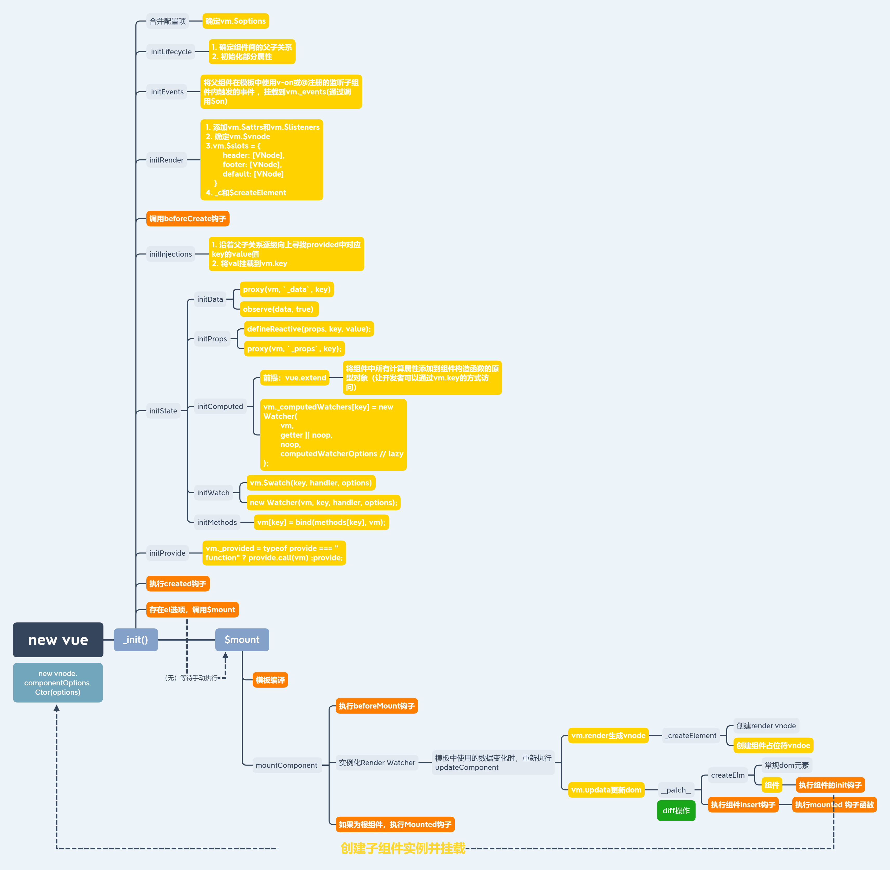

## 一、组件挂载


## 二、生成vnode

`_render`函数的总流程大致如下：


### 1. 组件占位符 VNode 数据结构

假设组件标签如下

```vue
<HelloWorld id="js_hello" :flag="flag" msg="Welcome to Your Vue.js App"/>
```

```js {2-13}
{
    // 组件占位符 VNode 特有的属性
    componentInstance: undefined, // 子组件的 Vue 实例，子组件Vue实例创建完成后赋值
    componentOptions: { // 组件占位符 VNode 特有的属性
      propsData: { // 根据子组件定义的 props 属性，获取传入子组件的值
          flag: 1,
          msg: "Welcome to Your Vue.js App"
      }
      listeners: undefined, // 自定义事件
      tag: 'HelloWorld', // 组件名
      children: undefined, // 插槽内容
      Ctor: ƒ // 构建子组件 Vue实例 的构造函数
    },
    context: {…}, // 父组件的 Vue实例,
    data: { // 组件标签上的属性或者 render 函数的第二个参数
      attrs: { // 组件标签上的属性，不包含子组件中定义的 props 属性
          id: 'js_hello'
      },
      on: undefined, // 有 .native 修饰符的事件
      hook: {…}  // 钩子函数，在 patch 的不同时机触发
    },
    elm: DOM, // 组件根元素，在 patch 过程创建
    tag: "vue-component-2-HelloWorld"
}
```

组件占位符VNode 里面存储子组件Vue实例的构造函数、以及存储传给子组件的数据。他的作用其实就是一个占位符。当子组件的DOM创建完成，会将 DOM 赋值给组件占位符VNode 的`elm` 属性。而渲染时使用的就是这个`elm`。


- `vm.$vnode = parentVnode`组件实例的`$vnode`属性指向组件的占位符VNode
- `vm.$options._parentVnode = parentVnode;`
- `vnode.parent = parentVnode`组件渲染VNode的`parent`属性指向组件的占位符VNode


### 2. 渲染VNode 数据结构

假设组件内容如下

```vue
<template>
  <div class="hello">
    <h1>{{ msg }}</h1>
  </div>
</template>
```

```js
{
    children: [{  // 子元素
        context: {}, 
        data: { // 组件标签上的属性或者 render 函数的第二个参数
            staticClass: 'hello',
        },
        elm: undefined, // 根的 DOM 元素
        parent: undefined, // 组件的组件占位符VNode，只有组件 根VNode 才有
        tag: 'h1',
        children:[{
          text: "Welcome to Your Vue.js App",
          context: undefined,
          data: undefined,
          elm: undefined,
          parent: undefined,
          tag: undefined
        }]
    }],
    context: {}, // 当前组件的Vue实例
    data: { // 组件标签上的属性或者 render 函数的第二个参数
        staticClass: 'hello',
    },
    elm: undefined, // 根的 DOM 元素
    parent: {}, // 组件的组件占位符VNode，只有组件 根VNode 才有
    tag: 'div'
}
```

组件占位符VNode 和渲染VNode 的区别:

- 组件占位符VNode，是一个占位符；描述的是 ==组件标签== 。存储传递给子组件的信息`componentOptions`
- 渲染VNode，描述普通标签。存储标签信息。

> vue中将`template`编译为`render`函数并挂载到组件实例的`$options`中，其中`render`函数使用了如下方式进行包裹以便在模板中可以直接访问组件实例的属性和方法。
>
> ```js
> with(this){return ${code}}
> ```

## 三、data

在组件实例化（ ==new vue | vm== ）时会进行组件的初始化（ ==_init== ），初始化阶段操作的主要对象是`vm.$options`，即用户自定义的配置对象，会将 `data`、`props`、`computed`、`watch` 设置为 ==响应式对象== ，另外为了方便用户的操作，将配置项中的部分内容挂载到组件实例上。

`vm._data`

`vm._props`

`vm._computedWatchers`

`vm[key]=methods[key]`


```js
data = vm._data = typeof data === "function" ? getData(data, vm) : data || {};
proxy(vm, `_data`, key); // 代理到组件属性
observe(data, true /* asRootData */) // 添加响应式

const dataDef = {};
dataDef.get = function () {
    return this._data;
};
Object.defineProperty(Vue.prototype, "$data", dataDef); 
```

在Vue的设计中，`_` 开头的属性被认为是私有的，可能会修改，而 `$` 开头的属性则被认为是内部的，可以被外部调用但不应被外部赋值。为了保护 `_data`，不让外部直接操作，所以通过 `Object.defineProperty` 来创建 `$data`，只允许获取 `_data`，而无法设置它。


## 四、props

### 1. 子组件获取传入的`props`数据

在执行父组件的`render`函数时，会为子组件创建组件占位符VNode，此时会根据子组件中`props`的定义从组件标签的属性中匹配传入的数据，并存储在组件占位符VNode 中。


```js
const value = validateProp(key, propsOptions, propsData, vm);
defineReactive(props, key, value);
proxy(vm, `_props`, key);

const propsDef = {};
propsDef.get = function () {
    return this._props;
};
Object.defineProperty(Vue.prototype, "$props", propsDef);
```


### 2. props的初始化


### 3. props更新

初始化子组件的 Vue 实例时，通过`Object.defineProperty`给传入的`prop`数据添加拦截，如果传入的是一个对象类型，由于父组件已经对对象的属性添加了拦截，所以不会再次在子组件添加拦截。

和`data`的区别就是，`data`中的属性如果不是基本数据类型会为这个属性创建`Observer`实例；而`props`的数据不会；有一种情况除外，就是`prop`默认值是对象类型，会给这个默认值创建`Observer`实例。

> ==注意== ：当父组件传递给子组件的 prop 是一个固定值而不是绑定值时，例如 `msg="hello"`，Vue 并不会检测到这个 prop 数据的变化。
>
> Vue 的响应式系统只会追踪和响应通过 ==数据绑定== 传递的 prop 数据的变化。对于直接传递的固定值，Vue 认为它是静态的，不会进行追踪和更新。

接下来从两个方面分别说一下依赖收集和派发更新

- 传给子组件的是基本数据类型
- 传给子组件的是对象

#### 传给子组件的是基本数据类型

父组件创建 VNode 时，收集当前 Render Watcher 到响应式属性的`dep.subs`中。创建 子组件VNode 时，也会收集当前Render Watcher 到`prop`数据的`dep.subs`中。

当父组件修改数据时，触发父组件的视图更新，获取最新的`prop`数据；在创建父组件 DOM树的过程中，赋值给子组件的`vm._props`；从而被`prop`数据的`setter`捕获，触发子组件视图更新。

==也就是说，如果传给子组件的是基本数据类型，他们的更新原理是父组件驱动子组件更新==

#### 传给子组件的是对象

父组件创建 VNode 时，收集当前 Render Watcher 到响应式属性的`dep.subs`中。创建 子组件VNode 时，也会收集当前Render Watcher 到`prop`数据的`dep.subs`中。和上面不同的是，当子组件使用的是`prop`数据的内部属性时，会将Render Watcher 添加到父组件对应内部属性的`dep.subs`中。

当父组件修改属性的内部属性时，不会触发父组件更新，因为父组件没有使用这个内部属性，而使用的是整个对象。但是会触发子组件更新，因为子组件的Render Watcher 被收集到了这个内部属性的`dep.subs`里面了。

==也就是说如果传给子组件的是一个对象，并且子组件使用了这个内部属性，子组件的 Render Watcher会被这个内部属性的dep.subs收集==

如果父组件直接修改这个对象的引用，则和传入基本数据类型的更新流程一致。

## 五、computed

### 1. 初始化

#### 组件`computed`的初始化

对于组件`computed`的初始化，就是在创建组件构造函数（ ==vue.extend== ）时，通过`Object.defineProperty`方法将组件中所有计算属性添加到 ==组件构造函数的原型对象== 上，并设置存取描述符。

> 与`data`和 `props`不同，同一个构造函数不同的组件实例之间`computed`属性是不会变的，所以将`computed`定义在了构造函数的原型对象上，而`data`和`props`则定义在具体的组件实例上。

当创建组件实例时，为每个计算属性创建一个`Computed Watcher`，并将计算属性复制给`Watcher`实例的`getter`属性（ ==initComputed== ）；并且开发环境下会判断`computed`中的`key`和`data`、`props`中的`key`是否重复。

> 将所有创建的`watcher`放在`vm._computedWatchers`

#### 根实例`computed`的初始化

对于根实例`computed`的初始化，就比较简单了，就是获取计算属性，并给`computed`的每个`key`创建一个`Computed Watcher`，通过`Object.defineProperty`方法将所有计算属性挂载到组件实例上，并设置存取描述符。

#### `Computed Watcher` 和 `Render Watcher`的区别

```js
// Watcher类内部代码

this.lazy = !!options.lazy
// ...

this.dirty = this.lazy
// ...

this.value = this.lazy ? undefined : this.get()

```

- `Computed Watcher`的`lazy`为`true`，并且`dirty`也为`true`；

- 因为 `lazy`为`true`，所以在创建`Computed Watcher`过程中并不会执行`this.get()` 方法；也就不会立即获取计算属性的返回值。


### 2. 响应

#### 依赖收集

```js
function createComputedGetter (key) {
  return function computedGetter () {
    const watcher = this._computedWatchers && this._computedWatchers[key]
    if (watcher) {
      // 只做一次依赖收集
      if (watcher.dirty) {
        // dirty变为false，执行定义的get函数，收集依赖
        watcher.evaluate()
      }
      if (Dep.target) {
        // 将render watcher 添加到依赖属性的dep中，当依赖属性修改后，通过render watcher的get方法去触发组件更新
        watcher.depend()
      }
      // 之前获取的计算属性的值保存在watcher.value中 
      return watcher.value
    }
  }
}

```

- 将`Computed Watcher`添加到响应式变量的`dep.subs`中，第一次获取计算属性时，执行上述函数收集依赖（当响应式数据变化时可以更新计算属性）
- 将组件的`Render Watcher`添加到该计算属性所有依赖属性的`dep.subs`中（当响应式数据变化时可以更新当前组件）

#### 通知更新

当计算属性依赖的响应式属性修改时，会触发依赖属性的`setter`方法通知所有`Watcher`更新，其中就包括`Computed Watcher`和`Render Watcher`；调用`Computed Watcher`的`update`方法将`dirty`设为`true`。而`Render Watcher`会执行`Watcher`实例的`run`方法，从而重新执行组件的`render`函数，获取计算属性的值，从而更新计算属性的返回值并返回。

## 六、watch

### 1. 初始化

`watch`的初始化过程最终目的就是给每个`watch`创建一个 `User Watcher`，在创建过程中会对被监听的属性做依赖收集。

### 2. 响应

#### 依赖收集

在初始化过程中会为每个`watch`创建一个`User Watcher`，而创建过程中会对被监听属性做依赖收集

```js
const watcher = new Watcher(vm, expOrFn, cb, options)

// vm 组件实例
// expOrFn 被监听的属性名（xxx、'xxx.yyy'）
// cb 回调函数
// options { user: true, deep: [自定义配置项], async: [自定义配置项] }
```

实例化一个`Watcher`时会判断`expOrFn`参数的数据类型，对于`User Watcher`而言，`expOrFn`就是被监听的属性名，是一个字符串，所以会执行`parsePath`方法，根据`.`将字符串切割成字符串数组，并返回一个函数，这个函数会赋值给`User Watcher`的`getter`属性；函数内部会依次获取数组中所有元素对应的属性值并返回该属性值。

假设被监听的属性名是`a.b.c`，则此函数会依次获取`this.a`、`this.a.b`、`this.a.b.c`的属性值，从而触发被监听属性的`getter`方法，将`User Watcher`添加到此属性的`dep.subs`中。

#### 通知更新

当修改被监听属性的属性值时，触发属性的`setter`，通知 `dep.subs`中所有 `Watcher` 更新，执行`watcher.update`方法

```js
run () {
    if (this.active) {
        const value = this.get()
        if (
            value !== this.value ||
            isObject(value) ||
            this.deep
        ) {
            // 当添加自定义 watcher 的时候能在回调函数的参数中拿到新旧值的原因
            const oldValue = this.value
            this.value = value
            if (this.user) {
                try {
                    this.cb.call(this.vm, value, oldValue)
                } catch (e) {
                    handleError(e, this.vm, `callback for watcher "${this.expression}"`)
                }
            } else {
                this.cb.call(this.vm, value, oldValue)
            }
        }
    }
}

```

对于`User Watcher`的`run`方法，首先会调用`this.get()`重新让被监听属性做依赖收集，并获取最新值；如果最新值与旧老值不相等，调用回调函数，并将新旧值作为参数传入。

### 3. Computed 和 watch 的区别

#### computed

- 本质是一个具备缓存的 Watcher，只有依赖属性发生变化时才会更新视图，而且结果是在下次使用时获取
- 不支持异步，当`computed`内有异步操作时无效，无法监听数据的变化
- 当需要进行数值计算，并且依赖于其它数据时，应该使用`computed`，因为可以利用`computed`的缓存特性，避免每次获取值时都要重新计算

#### watch

- 没有缓存性，更多的是观察的作用，某些数据变化时会执行回调
- watch支持异步；可以设置异步返回前的中间状态
- 可以在初始化时执行回调
- 可以深度监听对象属性
- 可以设置回调的执行时机，通过设置`sync`属性可以在当前队列执行，默认是下一队列
- 通过`vm.$watch`注册的监听，会返回一个`unWatch`函数，调用该函数可以取消监听

### 4. computed 的响应原理

在初始化阶段，会为每个计算属性创建一个`Computed Watcher`，通过`Object.defineProperty`将所有计算属性添加到`组件实例 / 组件构造函数的原型对象`上，并为所有计算属性添加存取描述符。

当获取计算属性时，触发计算属性的`getter`，计算`computed`的值，并将`dirty`置为`false`，这样做的目的是再次获取计算属性时直接返回缓存值；在计算`computed`值的过程中会将`Computed Watcher`、`Render Watcher`添加到依赖属性的`Dep`中

当依赖属性发生变化会触发`Computed Watcher`的更新，将`dirty`置为`true`，在下次获取计算属性时，会重新计算`computed`的值。也会触发当前`Render Watcher`的更新，从而获取最新的计算属性的值

### 5. watch 的响应原理

在初始化阶段，会为每个`watch`创建一个`User Watcher`，如果`watch`的`immediate`为`true`，会马上执行一次回调；创建`User Watcher`过程中会获取一次被监听属性的值，从而触发被监听属性的`getter`方法，将`User Watcher`添加到被监听属性的`Dep`实例中。

当被监听属性发生改变时，通知`User Watcher`更新，如果`watch`的`sync`为`true`，会马上执行`watch`的回调；否则会将`User Watcher`的`update`方法通过`nextTick`放到缓存队列中，在下一个的事件循环中，会重新获取被监听属性的属性值，并判断新旧值是否相等、是否设置了`deep`为`true`、被监听属性是否是对象类型，如果成立就执行回调。

## 七、methods

`initMethods`时直接遍历所有定义的method，将其挂载到组件实例上。

```js
vm[key] = typeof methods[key] !== "function" ? noop : bind(methods[key], vm);
```


## 八、patch


当组件挂载时，创建`Render Watcher`，执行`render`函数获取组件的 ==渲染VNode== ；然后执行`_update`函数，`_update`函数内执行`patch`函数创建节点并插入到DOM中（`vm.$el = vm.__patch__()`）；如果组件中有子组件，调用组件占位符VNode的`init`钩子函数，为子组件创建`Vue`实例，执行子组件的`$mount`方法创建`Render Watcher`，并对子组件执行上述流程。

```js
if (!prevVnode) {
    // 首次渲染时
    vm.$el = vm.__patch__(vm.$el, vnode, hydrating, false /* removeOnly */); // 新的dom节点
} else {
    // 更新页面时
    vm.$el = vm.__patch__(prevVnode, vnode);
}
```

等子组件执行完成之后将子组件的DOM树挂载到组件占位符VNode的`elm`上，并将其插入到父元素中或相邻元素前后。这样父子组件的DOM树就关联起来了。


## 九、总览



### 1. $options


- `parent`:当前实例的父组件，帮助`initLifecycle`确认组件之间的父子关系（`$parent、$children、$root`）
- `propsData`：父组件实际传递的`props`值，帮助`initProps`定义prop的响应式（`vm.prop`）
- `_componentTag`：当前组件的名称
- `_parentListeners`：父组件注册的自定义事件，提供了可供用户访问的公共属性`vm.$listeners`
- `_parentVnode`：当前组件的占位符节点，提供了可供用户访问的公共属性`vm.$vnode`
- `_propKeys`：储存所有 `props` 的 `key` 值。当一个 prop 发生变化时，Vue 需要知道哪些组件需要更新。而这个 `_propKeys` 数组就可以很好地帮助我们找到哪些组件是依赖于这个 prop 的。

### 2. 实例属性


- `$parent、$root、$children、$vnode、$listeners`：见上节
- `$attrs`：组件占位符节点`data.attrs`的供用户访问版
- `$createElement`：`(a, b, c, d) => createElement(vm, a, b, c, d, true)`
- `$slots`：用来访问父组件传递的 ==静态插槽== ，包含对应插槽名称的vnode节点数组
- `$scopedSlots`：用来访问 ==作用域插槽== ，包含一个返回相应 VNode 的函数。
  - 自2.6.0后，所有的 `$slots` 都会作为函数暴露在 `$scopedSlots` 中

### 3. 虚拟dom

虚拟dom，即vnode是一个树形结构，children中包含着它的子节点。


- `compomnentInstance和componentOptions`是组件占位符特有的属性
- `child`指向vnode的`compomnentInstance`，所以也是当vnode为组件占位符时才有值

## 十、单文件组件

当我们使用webpack或者vue-cli进行单文件组件的开发时，使用vue-loader来进行解析，具体过程可以参考[一文读懂 vue-loader 原理 ](https://juejin.cn/post/7028410359207690247)