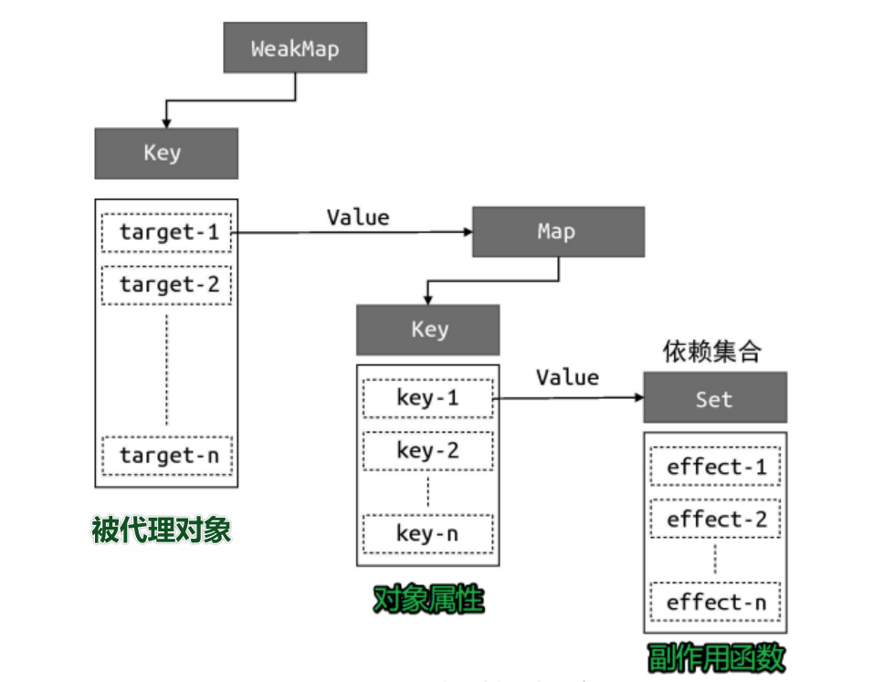

# 2. 基础响应系统的实现

## 一、 响应式数据与副作用函数

​ **副作用函数**是指会产生副作用的函数，即它会直接或间接地影响其他函数的执行。


而**响应式数据**是指会导致视图变化的数据。

## 二、 完成响应式的基本思路

拦截**响应式数据**的存取行为，在读取数据时，将副作用函数存到一个“桶”里；当设置数据时，将副作用函数从“桶”里取出执行。


<p></p>

其中拦截存取的操作，在 Vue2 中使用`Object.defineProperty`实现；在 Vue3 中使用`Proxy`实现。

> 基本思路的实现

```js
// 存储副作用函数的桶
const bucket = new Set();

// 原始数据
const data = { text: 'hello world' };
// 对原始数据的代理
const obj = new Proxy(data, {
  // 拦截读取操作
  get(target, key) {
    // 将副作用函数 effect 添加到存储副作用函数的桶中
    bucket.add(effect);
    // 返回属性值
    return target[key];
  },
  // 拦截设置操作
  set(target, key, newVal) {
    // 设置属性值
    target[key] = newVal;
    // 把副作用函数从桶里取出并执行
    bucket.forEach((fn) => fn());
    // 返回 true 代表设置操作成功
    return true;
  },
});
```

## 三、 较完善响应式的实现

### 1. 硬编码

> **问题**：硬编码，副作用函数的名字固定为 effect，导致一旦副作用函数的名字不叫 effect，那么这段代码就不能正确地工作了。
>
> **action**：添加副作用函数注册机制

```js {1}
// 用一个全局变量存储被注册的副作用函数 || vue2中使用的是Dep.target
let activeEffect;
// effect 函数用于注册副作用函数
function effect(fn) {
  // 当调用 effect 注册副作用函数时，将副作用函数 fn 赋值给activeEffect
  activeEffect = fn;
  // 执行副作用函数
  fn();
}
```

当使用时

```js
effect(
  // 一个匿名的副作用函数
  () => {
    document.body.innerText = obj.text;
  }
);
```

activeEffect 保存着当前的副作用函数，副作用函数执行时触发响应式数据 obj.text 的读取操作，进而触发代理对象 Proxy 的 get 拦截函数。

相应地对代理操作进行改进，这样 ==响应系统就不依赖副作用函数的名字了==

```js {4-6}
const obj = new Proxy(data, {
  get(target, key) {
    // 将 activeEffect 中存储的副作用函数收集到“桶”中
    if (activeEffect) {
      //改进
      bucket.add(activeEffect);
    }
    return target[key];
  },
  set(target, key, newVal) {
    target[key] = newVal;
    bucket.forEach((fn) => fn());
    return true;
  },
});
```

### 2. "桶"结构的重新设计

> **问题**：没有在副作用函数与被操作的目标字段之间建立明确的联系。当读取属性时，无论读取的是哪一个属性，其实都一样，都会把副作用函数收集到“桶”里；当 设置属性时，无论设置的是哪一个属性，也都会把“桶”里的副作用函数取出并执行。
>
> **action**：改写“桶”的结构



vue2 中使用`Object.defineProperty`来完成代理，属于属性级别的劫持，所以没有代理对象这层，通过闭包在属性的 get 中维护 dep 依赖。


```js
// 存储副作用函数的桶
const bucket = new WeakMap();

const obj = new Proxy(data, {
  // 拦截读取操作
  get(target, key) {
    // 没有 activeEffect，直接 return
    if (!activeEffect) return target[key];
    // 根据 target 从“桶”中取得 depsMap，它也是一个 Map 类型：key -->effects
    let depsMap = bucket.get(target);
    // 如果不存在 depsMap，那么新建一个 Map 并与 target 关联
    if (!depsMap) {
      bucket.set(target, (depsMap = new Map()));
    }
    // 再根据 key 从 depsMap 中取得 deps，它是一个 Set 类型，
    // 里面存储着所有与当前 key 相关联的副作用函数：effects
    let deps = depsMap.get(key);
    // 如果 deps 不存在，同样新建一个 Set 并与 key 关联
    if (!deps) {
      depsMap.set(key, (deps = new Set()));
    }
    // 最后将当前激活的副作用函数添加到“桶”里
    deps.add(activeEffect);

    // 返回属性值
    return target[key];
  },
  // 拦截设置操作
  set(target, key, newVal) {
    // 设置属性值
    target[key] = newVal;
    // 根据 target 从桶中取得 depsMap，它是 key --> effects
    const depsMap = bucket.get(target);
    if (!depsMap) return;
    // 根据 key 取得所有副作用函数 effects
    const effects = depsMap.get(key);
    // 执行副作用函数
    effects && effects.forEach((fn) => fn());
  },
});
```

- WeakMap 对 key 是弱引用，不影响垃圾回收器的工作。如果 target 对象没有任何引用了，说明用户侧不再需要它了， 这时垃圾回收器会完成回收任务。

为了方便后续操作，将副作用收集到“桶”中的逻辑和取出执行的逻辑进行封装：

**将副作用函数收集到“桶”里**

```js
// 在 get 拦截函数内调用 track 函数追踪变化
function track(target, key) {
  // 没有 activeEffect，直接 return
  if (!activeEffect) return;
  let depsMap = bucket.get(target);
  if (!depsMap) {
    bucket.set(target, (depsMap = new Map()));
  }
  let deps = depsMap.get(key);
  if (!deps) {
    depsMap.set(key, (deps = new Set()));
  }
  deps.add(activeEffect);
}
```

**触发副作用函数重新执行**

```js
// 在 set 拦截函数内调用 trigger 函数触发变化
function trigger(target, key) {
  const depsMap = bucket.get(target);
  if (!depsMap) return;
  const effects = depsMap.get(key); //依赖集合
  effects && effects.forEach((fn) => fn());
}
```

**对象的代理操作**

```js {5,14}
const obj = new Proxy(data, {
  // 拦截读取操作
  get(target, key) {
    // 将副作用函数 activeEffect 添加到存储副作用函数的桶中
    track(target, key);
    // 返回属性值
    return target[key];
  },
  // 拦截设置操作
  set(target, key, newVal) {
    // 设置属性值
    target[key] = newVal;
    // 把副作用函数从桶里取出并执行
    trigger(target, key);
  },
});
```

### 3. cleanup

> **问题**：代码分支可能会产生遗留的副作用函数，导致数据不必要的更新。
>
> **action**：每次副作用函数执行时，先把它从所有与之关联的依赖集合中删除（重新收集副作用函数中用到的响应式数据）

`document.body.innerText = obj.ok ? obj.text : 'not'`

当 obj.ok 为 true 时的结构如图：


当修改 obj.ok 的值为 false 时，结构理应变成：


然而并没有，因为这个“桶”它只进不出，之前存进去的就一直呆在里面了，所以以后再修改 obj.text 的值时，依然会触发副作用函数执行。

比如模板中经常会包含 v-if 等判断分支，随着用户的交互导致最终 render 函数所执行的代码分支是变化的，因此需要对包含此副作用函数的依赖集合进行更新。为此我们==需要知道哪些依赖集合中包含这个副作用函数==。

**修改副作用注册函数**

```js {4-12}
// 用一个全局变量存储被注册的副作用函数
let activeEffect;
function effect(fn) {
  const effectFn = () => {
    // 当 effectFn 执行时，将其设置为当前激活的副作用函数
    activeEffect = effectFn;
    fn();
  };
  // activeEffect.deps 用来存储所有与该副作用函数相关联的依赖集合
  // 类似于watcher.deps，不再使用类的写法
  effectFn.deps = [];
  // 执行副作用函数
  effectFn();
}
```

vue2 中的方案是在 Dep 中维护了一个 subs 数组，用来存储依赖的 watchers；而 watcher 中同样维护了 deps 用来存储对应的依赖集合，在收集依赖时进行双向的收集。

**track 函数**

```js {12-14}
function track(target, key) {
  if (!activeEffect) return;
  let depsMap = bucket.get(target);
  if (!depsMap) {
    bucket.set(target, (depsMap = new Map()));
  }
  let deps = depsMap.get(key);
  if (!deps) {
    depsMap.set(key, (deps = new Set()));
  }
  deps.add(activeEffect);
  // deps 就是一个与当前副作用函数存在联系的依赖集合
  // 相当于vue2中watcher实例的deps数组
  // 将其添加到 activeEffect.deps 数组中
  activeEffect.deps.push(deps); // 新增
}
```

==在每次副作用函数执行时，将副作用函数从依赖集合中移除==

**修改副作用注册函数**

```js {5-6}
// 用一个全局变量存储被注册的副作用函数
let activeEffect;
function effect(fn) {
  const effectFn = () => {
    // 调用 cleanup 函数完成清除工作
    cleanup(effectFn); // 新增
    activeEffect = effectFn;
    fn();
  };
  effectFn.deps = [];
  effectFn();
}
```

**cleanup**

```js
function cleanup(effectFn) {
    // 遍历 effectFn.deps 数组
    for (let i =  ; i < effectFn.deps.length; i++) {
        // deps 是依赖集合
        const deps = effectFn.deps[i]
        // 将 effectFn 从依赖集合中移除
        deps.delete(effectFn)
    }
    // 最后需要重置 effectFn.deps 数组
    effectFn.deps.length = 0
}
```

将代码按上述修改之后会产生无限循环的问题，问题出现在 Trigger 函数中的循环中

```js
effects && effects.forEach((fn) => fn());
```

==解决死循环的问题==

当副作用函数执行时，先调用 `cleanup` 进行清除，然后副作用函数执行时又加回来，一个集合左边删右边加，导致循环结束不了，为此进行如下修改：

**trigger**

```js {6-8}
function trigger(target, key) {
  const depsMap = bucket.get(target);
  if (!depsMap) return;
  const effects = depsMap.get(key);

  const effectsToRun = new Set(effects); // 新增
  effectsToRun.forEach((effectFn) => effectFn()); // 新增
  // effects && effects.forEach(effectFn => effectFn()) // 删除
}
```

### 4. 使 effect 可嵌套

> **问题**：组件是可以嵌套的，而组件的渲染函数是在 effect 中执行的，此时就发生了 effect 的嵌套，但目前的响应系统不支持嵌套。
>
> ```js
> effect(() => {
>   Foo.render();
>   // 嵌套
>   effect(() => {
>     Bar.render();
>   });
> });
> ```
>
> **action**：准备一个副作用函数栈（vue2 中采用相同的处理）

不支持嵌套的原因是使用变量 activeEffect 保存当前的副作用函数，同时只能存在一个，后来的会覆盖先前的，所以我们需要一个副作用函数栈 effectStack， 在副作用函数执行时，将当前副作用函数压入栈中，待副作用函数执行完毕后将其从栈中弹出，并始终让 activeEffect 指向栈顶的副作用函数。

```js {4,12,15-16}
// 用一个全局变量存储当前激活的 effect 函数
let activeEffect;
// effect 栈
const effectStack = []; // 新增

function effect(fn) {
  const effectFn = () => {
    cleanup(effectFn);
    // 当调用 effect 注册副作用函数时，将副作用函数赋值给 activeEffect
    activeEffect = effectFn;
    // 在调用副作用函数之前将当前副作用函数压入栈中
    effectStack.push(effectFn); // 新增
    fn();
    // 在当前副作用函数执行完毕后，将当前副作用函数弹出栈，并把activeEffect 还原为之前的值
    effectStack.pop(); // 新增
    activeEffect = effectStack[effectStack.length - 1]; // 新增
  };
  // activeEffect.deps 用来存储所有与该副作用函数相关的依赖集合
  effectFn.deps = [];
  // 执行副作用函数
  effectFn();
}
```


### 5. 解决读写操作一起时的无限递归

> **问题**：类似 obj.foo++这种操作，既会读取 obj.foo 的值，又会设置 obj.foo 的值。读取 obj.foo 的值，会触发 track 操作，将当前副作用函数收集到“桶”中，接着将其加 1 后再赋值给 obj.foo，此时会触发 trigger 操作，即把“桶”中的副作用函数取出并执行。但问题是该副作用函数正在执行中，还没有执行完毕，就要开始下一次的执 行。这样会导致无限递归地调用自己，于是就产生了栈溢出。
>
> **action**：如果 trigger 触发执行的副作用函数与当前正在执行的副作用函数相同，则不触发执行

```js {6-12}
function trigger(target, key) {
  const depsMap = bucket.get(target);
  if (!depsMap) return;
  const effects = depsMap.get(key);

  const effectsToRun = new Set();
  effects &&
    effects.forEach((effectFn) => {
      // 如果 trigger 触发执行的副作用函数与当前正在执行的副作用函数相同，则不触发执行
      if (effectFn !== activeEffect) {
        // 新增
        effectsToRun.add(effectFn);
      }
    });
  effectsToRun.forEach((effectFn) => effectFn());
  // effects && effects.forEach(effectFn => effectFn())
}
```

### 6. 完成可调度性

> **问题**：我们需要在 trigger 触发副作用函数重新执行时有能力决定副作用函数执行的时机、次数以及方式。
>
> **action**：为副作用函数添加调度函数

**拓展 effect 函数**

```js {1,14}
function effect(fn, options = {}) {
  const effectFn = () => {
    cleanup(effectFn);
    // 当调用 effect 注册副作用函数时，将副作用函数赋值给 activeEffect
    activeEffect = effectFn;
    // 在调用副作用函数之前将当前副作用函数压栈
    effectStack.push(effectFn);
    fn();
    // 在当前副作用函数执行完毕后，将当前副作用函数弹出栈，并把activeEffect 还原为之前的值
    effectStack.pop();
    activeEffect = effectStack[effectStack.length - 1];
  };
  // 将 options 挂载到 effectFn 上
  effectFn.options = options; // 新增
  // activeEffect.deps 用来存储所有与该副作用函数相关的依赖集合
  effectFn.deps = [];
  // 执行副作用函数
  effectFn();
}
```

**trigger 函数**

```js {14-15}
function trigger(target, key) {
  const depsMap = bucket.get(target);
  if (!depsMap) return;
  const effects = depsMap.get(key);

  const effectsToRun = new Set();
  effects &&
    effects.forEach((effectFn) => {
      if (effectFn !== activeEffect) {
        effectsToRun.add(effectFn);
      }
    });
  effectsToRun.forEach((effectFn) => {
    // 如果一个副作用函数存在调度器，则调用该调度器，并将副作用函数作为参数传递
    if (effectFn.options.scheduler) {
      // 新增
      effectFn.options.scheduler(effectFn); // 新增
    } else {
      // 否则直接执行副作用函数（之前的默认行为）
      effectFn(); // 新增
    }
  });
}
```

**使用时**

```js
effect(
  () => {
    console.log(obj.foo);
  },
  // options
  {
    // 调度器 scheduler 是一个函数
    scheduler(fn) {
      // 将副作用函数放到宏任务队列中执行
      setTimeout(fn);
    },
  }
);
```

### 7. 副作用函数的懒加载

> **问题**：在有些场景下，我们并不希望副作用函数立即执行，而是希望它在需要的时候才执行，例如计算属性。
>
> **action**：在 options 中添加 lazy 属性

**使用时**

```js
effect(
  // 指定了 lazy 选项，这个函数不会立即执行
  () => {
    console.log(obj.foo);
  },
  // options
  {
    lazy: true,
  }
);
```

**effect 函数**

```js {13-18}
function effect(fn, options = {}) {
  const effectFn = () => {
    cleanup(effectFn);
    activeEffect = effectFn;
    effectStack.push(effectFn);
    fn();
    effectStack.pop();
    activeEffect = effectStack[effectStack.length - 1];
  };
  effectFn.options = options;
  effectFn.deps = [];
  // 只有非 lazy 的时候，才执行
  if (!options.lazy) {
    // 新增
    // 执行副作用函数
    effectFn();
  }
  // 将副作用函数作为返回值返回
  return effectFn; // 新增
}
```

- 通过返回值能够拿到对应的副作用函数，这样我们就能手动执行该副作用函数

### 8. getter 的实现

> **问题**：能够手动执行副作用函数，作用并不大，我们想要拿到副作用函数（getter）的返回值
>
> **action**：副作用函数中添加变量保存 fn 的值

**effect 函数**

```js {7,11}
function effect(fn, options = {}) {
  const effectFn = () => {
    cleanup(effectFn);
    activeEffect = effectFn;
    effectStack.push(effectFn);
    // 将 fn 的执行结果存储到 res 中
    const res = fn(); // 新增
    effectStack.pop();
    activeEffect = effectStack[effectStack.length - 1];
    // 将 res 作为 effectFn 的返回值
    return res; // 新增
  };
  effectFn.options = options;
  effectFn.deps = [];
  if (!options.lazy) {
    effectFn();
  }
  return effectFn;
}
```

## 四、 计算属性 computed 的实现

> 借助上述函数完成的基本框架

**computed 函数**

```js
function computed(getter) {
  // 把 getter 作为副作用函数，创建一个 lazy 的 effect
  const effectFn = effect(getter, {
    lazy: true,
  });

  const obj = {
    // 当读取 value 时才执行 effectFn
    get value() {
      return effectFn();
    },
  };

  return obj;
}
```

**使用**

```js
const data = { foo: 1, bar: 2 };
const obj = new Proxy(data, {
  /* ... */
});

const sumRes = computed(() => obj.foo + obj.bar);

console.log(sumRes.value); //  3
```

- 只有真正读取 `sumRes.value` 的值时， 它才会进行计算并得到值

> 添加缓存功能

**computed 函数**

```js {3-5,14-17}
function computed(getter) {
  // value 用来缓存上一次计算的值
  let value;
  // dirty 标志，用来标识是否需要重新计算值，为 true 则意味着“脏”，需要计算
  let dirty = true;

  const effectFn = effect(getter, {
    lazy: true,
  });

  const obj = {
    get value() {
      // 只有“脏”时才计算值，并将得到的值缓存到 value 中
      if (dirty) {
        value = effectFn();
        // 将 dirty 设置为 false，下一次访问直接使用缓存到 value 中的值
        dirty = false;
      }
      return value;
    },
  };

  return obj;
}
```

这时存在一个问题就是读取 value 时 dirty 被改成 false，然后变不回来了，以后一直访问的缓存值，为此利用之前实现的调度器做出如下修改：

```js {8-10}
function computed(getter) {
  let value;
  let dirty = true;

  const effectFn = effect(getter, {
    lazy: true,
    // 添加调度器，在调度器中将 dirty 重置为 true
    scheduler() {
      dirty = true;
    },
  });

  const obj = {
    get value() {
      if (dirty) {
        value = effectFn();
        dirty = false;
      }
      return value;
    },
  };

  return obj;
}
```

> **问题**：在另一个 effect 中读取计算属性的值时，计算属性内属性值的变化不会触发副作用函数的重新渲染
>
> **action**：当读取计算属性的值时，手动调用 track 函数进行追踪；当计算属性依赖的响应式数据发生变化时，手动调用 trigger 函数触发响应

**compute 函数**

```js {11,23}
function computed(getter) {
  let value;
  let dirty = true;

  const effectFn = effect(getter, {
    lazy: true,
    scheduler() {
      if (!dirty) {
        dirty = true;
        // 当计算属性依赖的响应式数据变化时，手动调用 trigger 函数触发响应
        trigger(obj, 'value');
      }
    },
  });

  const obj = {
    get value() {
      if (dirty) {
        value = effectFn();
        dirty = false;
      }
      // 当读取 value 时，手动调用 track 函数进行追踪
      track(obj, 'value');
      return value;
    },
  };

  return obj;
}
```

## 五、watch 的实现

所谓 watch，其本质就是观测一个响应式数据，当数据发生变化时通知并执行相应的回调函数。==watch 的实现本质上就是利用了 effect 以及 options.scheduler 选项==

> 简单实现

**watch 函数**

```js
// watch 函数接收两个参数，source 是响应式数据，cb 是回调函数
function watch(source, cb) {
  effect(
    // 触发读取操作，从而建立联系
    () => source.foo,
    {
      scheduler() {
        // 当数据变化时，调用回调函数 cb
        cb();
      },
    }
  );
}
```

**使用时**

```js
const data = { foo: 1 };
const obj = new Proxy(data, {
  /* ... */
});

watch(obj, () => {
  console.log('数据变化了');
});

obj.foo++;
```

> 解决 source.foo 的硬编码问题

**watch 函数**

```js {4}
function watch(source, cb) {
  effect(
    // 调用 traverse 递归地读取
    () => traverse(source),
    {
      scheduler() {
        // 当数据变化时，调用回调函数 cb
        cb();
      },
    }
  );
}
```

**traverse 函数**（通用的读取操作）

```js
function traverse(value, seen = new Set()) {
  // 如果要读取的数据是原始值，或者已经被读取过了，那么什么都不做
  if (typeof value !== 'object' || value === null || seen.has(value)) return;
  // 将数据添加到 seen 中，代表遍历地读取过了，避免循环引用引起的死循环
  seen.add(value);
  // 暂时不考虑数组等其他结构
  // 假设 value 就是一个对象，使用 for...in 读取对象的每一个值，并递归地调用 traverse 进行处理
  for (const k in value) {
    traverse(value[k], seen);
  }
  return value;
}
```

> 实现可监测 getter 函数

**watch 函数**

```js {3-10}
function watch(source, cb) {
  // 定义 getter
  let getter;
  // 如果 source 是函数，说明用户传递的是 getter，所以直接把 source 赋值给 getter
  if (typeof source === 'function') {
    getter = source;
  } else {
    // 否则按照原来的实现调用 traverse 递归地读取
    getter = () => traverse(source);
  }

  effect(
    // 执行 getter
    () => getter(),
    {
      scheduler() {
        cb();
      },
    }
  );
}
```

> 实现在 watch 回调函数中拿到新旧值

==利用 effect 函数的 lazy 选项==

**watch 函数**

```js {9,11,14,17-21,26}
function watch(source, cb) {
  let getter;
  if (typeof source === 'function') {
    getter = source;
  } else {
    getter = () => traverse(source);
  }
  // 定义旧值与新值
  let oldValue, newValue;
  // 使用 effect 注册副作用函数时，开启 lazy 选项，并把返回值存储到effectFn 中以便后续手动调用
  const effectFn = effect(() => getter(), {
    lazy: true,
    scheduler() {
      // 在 scheduler 中重新执行副作用函数，得到的是新值
      newValue = effectFn();
      // 将旧值和新值作为回调函数的参数
      cb(newValue, oldValue);
      // 更新旧值，不然下一次会得到错误的旧值
      oldValue = newValue;
    },
  });
  // 手动调用副作用函数，拿到的值就是旧值
  oldValue = effectFn();
}
```

> 设置 immediate 为 true 来使回调函数开始执行一次;
>
> 设置 flush 指定回调函数的执行时机

**watch 函数**

```js {12-16,24-31,36-38}
function watch(source, cb, options = {}) {
  let getter;
  if (typeof source === 'function') {
    getter = source;
  } else {
    getter = () => traverse(source);
  }

  let oldValue, newValue;

  // 提取 scheduler 调度函数为一个独立的 job 函数
  const job = () => {
    newValue = effectFn();
    cb(newValue, oldValue);
    oldValue = newValue;
  };

  const effectFn = effect(
    // 执行 getter
    () => getter(),
    {
      lazy: true,
      // 使用 job 函数作为调度器函数
      scheduler: () => {
        // 在调度函数中判断 flush 是否为 'post'，如果是，将其放到微任务队列中执行
        if (options.flush === 'post') {
          const p = Promise.resolve();
          p.then(job);
        } else {
          job();
        }
      },
    }
  );

  if (options.immediate) {
    // 当 immediate 为 true 时立即执行 job，从而触发回调执行
    job();
  } else {
    oldValue = effectFn();
  }
}
```

> 解决竞态问题（需要一种使副作用过期的手段）


请求 A 是副作用函数第一次执行所产生的副作用，请求 B 是副作用函数第二次执行所产 生的副作用。由于请求 B 后发生，所以请求 B 的结果应该被视为“最 新”的，而请求 A 已经“过期”了，其产生的结果应被视为无效。

watch 函数的回调函数接收第三个参数 `onInvalidate`，它是一个函数，类似于事件监听器，我们可以使用 `onInvalidate` 函数注册一个回调，这个回调函数会在当前副作用函数过期时执行：

**使用时**

```js
watch(obj, async (newValue, oldValue, onInvalidate) => {
  // 定义一个标志，代表当前副作用函数是否过期，默认为 false，代表没有过期
  let expired = false;
  // 调用 onInvalidate() 函数注册一个过期回调
  onInvalidate(() => {
    // 当过期时，将 expired 设置为 true
    expired = true;
  });

  // 发送网络请求
  const res = await fetch('/path/to/request');

  // 只有当该副作用函数的执行没有过期时，才会执行后续操作。
  if (!expired) {
    finalData = res;
  }
});
```

**watch 函数**

```js {11-17,22-24}
function watch(source, cb, options = {}) {
  let getter;
  if (typeof source === 'function') {
    getter = source;
  } else {
    getter = () => traverse(source);
  }

  let oldValue, newValue;

  // cleanup 用来存储用户注册的过期回调
  let cleanup;
  // 定义 onInvalidate 函数
  function onInvalidate(fn) {
    // 将过期回调存储到 cleanup 中
    cleanup = fn;
  }

  const job = () => {
    newValue = effectFn();
    // 在调用回调函数 cb 之前，先调用过期回调
    if (cleanup) {
      cleanup();
    }
    // 将 onInvalidate 作为回调函数的第三个参数，以便用户使用
    cb(newValue, oldValue, onInvalidate);
    oldValue = newValue;
  };

  const effectFn = effect(
    // 执行 getter
    () => getter(),
    {
      lazy: true,
      scheduler: () => {
        if (options.flush === 'post') {
          const p = Promise.resolve();
          p.then(job);
        } else {
          job();
        }
      },
    }
  );

  if (options.immediate) {
    job();
  } else {
    oldValue = effectFn();
  }
}
```

- `onInvalidate`的过期回调在`watch`回调执行时注册，而过期回调是在`watch`回调执行前运行的，所以当属性修改触发回调执行后才注册了过期回调，当再次修改属性值时，过期回调存在优先执行，将之前回调返回的数据抛弃。
