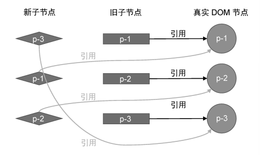
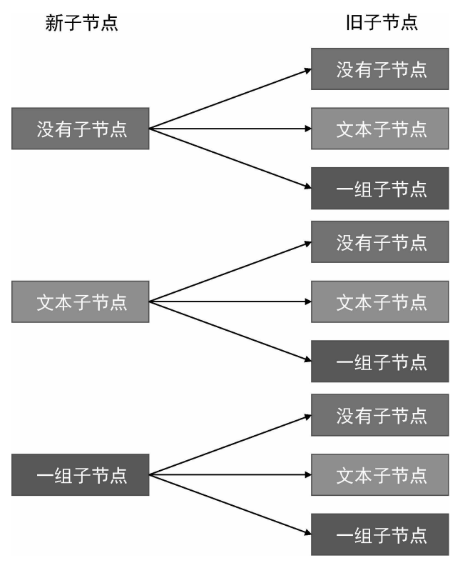

# 5. 渲染器

## 一、 渲染器的基本概念

### 1. 与响应式的关系

```javascript
const count = ref(1)
effect(() => {
  renderer(`<h1>${count.value}</h1>`,document.getElementById('app'))
})
count.value++
```

副作用函数执行完毕后，会与响应式数据建立响应联系。当我们修改 `count.value` 的值时，副作用函数会重新执行，完成重新渲染。

利用响应系统的能力，从而自动调用渲染器完成页面的渲染和更新。

### 2.  render 函数的基本实现

作用：把虚拟DOM（vnode）渲染为特定平台上的真实元素    

渲染器不仅仅包含用来渲染的render函数，还包括其他的功能。

```javascript
function createRenderer() {
    function render(vnode, container) {
        if (vnode) {
            // 1. 更新
            // 新 vnode 存在，将其与旧 vnode 一起传递给 patch 函数，进行打补丁
            patch(container._vnode, vnode, container)
        } else {
            if (container._vnode) {
                // 2. 卸载
                // 旧 vnode 存在，且新 vnode 不存在，说明是卸载（unmount）操作
                unmount(container._vnode)
            }
        }
        // 把 vnode 存储到 container._vnode 下，即后续渲染中的旧 vnode
        container._vnode = vnode
    }
    
    function patch(oldVnode, Vnode, container) {
        if(!oldVnode){
            // 3. 挂载
            mountElement(Vnode, container)
        }else{
            // Vnode存在，意味着打补丁，暂时省略
        }
    }

    return {
        render
    }
}
```

甚至`createApp`实际调用的也是渲染器中定义的函数

```js
const app = createApp(APP)
const app = ensureRenderer().createApp(APP)
// 实例化渲染器并执行其中的函数
const app = createRenderer(rendererOptions).createApp(APP)
const app = baseCreateRenderer(rendererOptions).createApp(APP)
const app = createAppAPI(render)(App)

app.mount('#app')
const container = normalizeContainer('#app')
const vnode = createVNode(App)
render(vnode, container)
patch(null, vnode, container)
mountComponent(vnode, container)
```

## 二、 渲染器的设计

### 1. 抽离API

将依赖于特定平台的API作为配置项传入创建渲染器的函数中：

```javascript
// 在创建 renderer 时传入配置项
const renderer = createRenderer({
    // 用于创建元素
    createElement(tag) {
        return document.createElement(tag)
    },
    // 用于设置元素的文本节点
    setElementText(el, text) {
        el.textContent = text
    },
    // 用于在给定的 parent 下添加指定元素
    insert(el, parent, anchor = null) {
        parent.insertBefore(el, anchor)
    }
})
```

这样在`createRenderer`函数的内部可以通过解构获取传入的操作：

```js
const {
    createElement,
    insert,
    setElementText,
    ...
} = options
```

### 2. 渲染器的挂载操作

#### 挂载元素

```javascript
function createRenderer(options) {
    // 通过 options 得到操作 DOM 的 API
    const {
        createElement,
        insert,
        setElementText
    } = options

    function shouldSetAsProps(el, key, value) {
        // 特殊处理（input标签的el.form属性是一个只读属性）
        if (key === 'form' && el.tagName === 'INPUT') return false
        // 兜底
        return key in el
    }

    // 在这个作用域内定义的函数都可以访问那些 API
    // 挂载真实标签
    function mountElement(vnode, container,anchor) {
        // 在 vnode 与真实 DOM 元素之间建立联系
        const el = vnode.el = createElement(vnode.type)

        if (typeof vnode.children === 'string') {
            // 文本节点
            setElementText(el, vnode.children)
        } else if (Array.isArray(vnode.children)) {
            // 如果 children 是数组，则遍历每一个子节点，并调用 patch 函数挂载它
            vnode.children.forEach(child => {
                patch(null, child, el)
            })
        }

        if (vnode.props) {
            for (const key in vnode.props) {
                //  调用 patchProps 函数即可
                patchProps(el, key, null, vnode.props[key])
            }
        }
        insert(el, container,anchor)
    }

    function patch(n1, n2, container) {
        // ...
    }

    function render(vnode, container) {
        // ...
    }

    return {
        render
    }
}
```

要挂载元素的子节点  -->  循环children数组进行递归调用

#### 挂载属性

要挂载元素的属性，将其抽离为`patchProps`函数

- class类名
- style样式
- 事件

```js
// 将属性设置相关操作封装到 patchProps 函数中，并作为渲染器选项传递
patchProps(el, key, prevValue, nextValue) {
    // 对事件的处理
    if (/^on/.test(key)) {
        const invokers = el._vei || (el._vei = {});
        let invoker = invokers[key];
        const name = key.slice(2).toLowerCase();
        if (nextValue) {
            if (!invoker) {
                invoker = el._vei[key] = (e) => {
                    // e.timeStamp 是事件发生的时间
                    // 如果事件发生的时间早于事件处理函数绑定的时间，则不执行事件处理函数
                    if (e.timeStamp < invoker.attached) return;
                    // 如果 invoker.value 是数组，则遍历它并逐个调用事件处理函数
                    if (Array.isArray(invoker.value)){
                        invoker.value.forEach((fn) => fn(e));
                    } else {
                        // 当伪造的事件处理函数执行时，会执行真正的事件处理函数
                        invoker.value(e);
                    }
                };
                invoker.value = nextValue;
                // 添加 invoker.attached 属性，存储事件处理函数被绑定的时间
                invoker.attached = performance.now();
                el.addEventListener(name, invoker);
            } else {
                invoker.value = nextValue;
            }
        } else if (invoker) {
            el.removeEventListener(name, invoker);
        }
    }
    
    // 对 class 进行特殊处理
    if (key === "class") {
        el.className = nextValue || "";
    }
    
    // 优先设置dom的props
    else if (shouldSetAsProps(el, key, nextValue)) {
        const type = typeof el[key];
        // 当值为空字符串时，要手动将值矫正为 true
        if (type === "boolean" && nextValue === "") {
            el[key] = true;
        } else {
            el[key] = nextValue;
        }
    } else {
        el.setAttribute(key, nextValue);
    }
},
```

> 如何正确设置元素的属性？   property   or   attribute？

 - HTML Attributes 的作用是设置与之对应的 DOM Properties 的初始值；

 - 优先设置元素的 DOM Properties，但当值为空字符串时，要手动将值矫正为 true。

 - DOM中部分属性是只读的，们只能够通过 setAttribute 函数来设置。

> 对于class和style的处理

- 因为其值可以是多种类型，所以我们必须在设置元素的 class | style 之前将值归一化为统一的字符串形式，再把该字符串作为元素的 class | style 值去设置
- 需要封装`normalizeClass`和`normalizeStyle`
- 很多时候出于上层API的设计，vnode.props 对象中定义的属性值的类型并不总是与 DOM 元素属性的数据结构保持一致，在底层实现时需要首先对其进行规范化
- el.className、setAttribute 和 el.classList三种设置类名的方法中el.className 的性能最优。

> 更新事件要如何处理？

常规思路：先移除之前添加的事件处理函数，然后再将新的事件处理函数绑定到 DOM 元素上

```js
if (/^on/.test(key)) {
    const name = key.slice(2).toLowerCase()
    // 移除上一次绑定的事件处理函数
    prevValue && el.removeEventListener(name, prevValue)
    // 绑定新的事件处理函数
    el.addEventListener(name, nextValue)
}
```

优化思路：在绑定事件时绑定一个伪造的事件处理函数 invoker，然后把真正的事件处理函数设置为 invoker.value 属性的值。这样当更新事件的时候，就不再需要调用 removeEventListener 函数来移除上一次绑定的事件，只需要更新 invoker.value 的值。

### 3. 渲染器的卸载操作

卸载时要连同对应的 ==dom事件== 、组件的 ==生命周期钩子函数== 、自定义的 ==指令== 操作等一起卸载。

```js
function unmount(vnode) {
    const parent = vnode.el.parentNode
    if (parent) {
        parent.removeChild(vnode.el)
    }
    // 处理上述事件、生命周期和指令
    // ...
}
```

### 4. patch

完成新旧虚拟dom的“补丁”操作

- 挂载 `mountElement`
- 卸载 `unmount`
- 深入对比 `patchElement`

```javascript
function patch(n1, n2, container,anchor) {
    // 新旧节点类型不同，则直接将旧 vnode 卸载
    if (n1 && n1.type !== n2.type) {
        unmount(n1)
        n1 = null
    }
    // 代码运行到这里，证明 n1 和 n2 所描述的内容相同
    const { type } = n2

    // 1.常规元素节点
    if (typeof type === 'string') {
        if (!n1) {
            mountElement(n2, container,anchor)
        } else {
            patchElement(n1, n2)
        }
    } 
    // 2.文本节点（注释节点同理）
    else if (type === Text) {
        if (!n1) {
            // 调用 createText 函数创建文本节点
            const el = n2.el = createText(n2.children)
            insert(el, container)
        } else {
            const el = n2.el = n1.el
            if (n2.children !== n1.children) {
                // 调用 setText 函数更新文本节点的内容
                setText(el, n2.children)
            }
        }
    } 
    // 3.Fragment类型
    else if (type === Fragment) { // 处理 Fragment 类型的 vnode
        if (!n1) {
            // 如果旧 vnode 不存在，则只需要将 Fragment 的 children 逐个挂载即可
            n2.children.forEach(c => patch(null, c, container))
        } else {
            // 如果旧 vnode 存在，则只需要更新 Fragment 的 children 即可
            patchChildren(n1, n2, container)
        }
    }
    // 4. 组件对象
    else if (typeof type === 'object') {
        // vnode.type 的值是选项对象，作为组件来处理
        if (!n1) {
            // 挂载组件
            mountComponent(n2, container, anchor)
        } else {
            // 更新组件
            patchComponent(n1, n2, anchor)
        }
    } else if (type === 'xxx') {
        // 处理其他类型的 vnode
    }
}
```

> patchElement

```js
function patchElement(n1, n2) {
    // 新的 vnode 也引用了真实 DOM 元素
    const el = n2.el = n1.el
    const oldProps = n1.props
    const newProps = n2.props
    
    // 第一步：更新 props
    for (const key in newProps) {
        if (newProps[key] !== oldProps[key]) {
            patchProps(el, key, oldProps[key], newProps[key])
        }
    }
    for (const key in oldProps) {
        if (!(key in newProps)) {
            patchProps(el, key, oldProps[key], null)
        }
    }
    // 第二步：更新 children
    patchChildren(n1, n2, el)
}
```
将旧节点的 n1.el 属性赋值给新节点的 n2.el 属性，本质上是dom元素的复用，在复用了 DOM 元素之后，新节点也将持有对真实 DOM 的引用。



> pathchChildren

更新子节点时共有以下九种可能：



```js {16}
function patchChildren(n1, n2, container) {
    // 新子节点的类型是文本节点
    if (typeof n2.children === 'string') {
        // 旧子节点的类型有三种可能：没有子节点、文本子节点以及一组子节点
        // 只有当旧子节点为一组子节点时，才需要逐个卸载，其他情况下什么都不需要做
        if (Array.isArray(n1.children)) {
            n1.children.forEach((c) => unmount(c))
        }
        // 最后将新的文本节点内容设置给容器元素
        setElementText(container, n2.children)
    } 
    // 新子节点是一组子节点
    else if (Array.isArray(n2.children)) {
        // 判断旧子节点是否也是一组子节点
        if (Array.isArray(n1.children)) {
            // 代码运行到这里，则说明新旧子节点都是一组子节点，这里涉及核心的Diff 算法
        } else {
            // 此时：旧子节点要么是文本子节点，要么不存在
            // 但无论哪种情况，我们都只需要将容器清空，然后将新的一组子节点逐个挂载
            setElementText(container, '')
            n2.children.forEach(c => patch(null, c, container))
        }
    }
    // 代码运行到这里，说明新子节点不存在
    else {
        // 旧子节点是一组子节点，只需逐个卸载即可
        if (Array.isArray(n1.children)) {
            n1.children.forEach(c => unmount(c))
        } 
        // 旧子节点是文本子节点，清空内容即可
        else if (typeof n1.children === 'string') {
            setElementText(container, '')
        }
        // 如果也没有旧子节点，那么什么都不需要做
    }
}
```

## 三、渲染组件

### 1. 定义组件

当用户定义一个组件的时候，主要定义的有两部分：==模板和配置对象== 。模板会经由编译器编译为render函数挂载到配置对象中。配置对象的主要内容如下所示：

**选项式API**

```js
const MyComponent = {
    name: 'MyComponent',
    data(){
        return{
            foo:'hello world'
        }
    },
    // 组件接收名为 title 的 props，并且该 props 的类型为 String
    props: {
        title: String
    },
    // 组件的生命周期
    beforeCreate(){
        console.log('beforeCreate!')
    },
    render() {
        return {
            type: 'div',
            children: ` foo 的值是: ${this.foo};
            			count is: ${this.title}` // 访问data和props 数据
        }
    }
}
```

**Setup函数**

```js
// 返回一个函数
const Comp = {
    setup() {
        // setup 函数可以返回一个函数，该函数将作为组件的渲染函数
        return () => {
            return { type: 'div', children: 'hello' }
        }
    }
}

// 返回一个对象
const Comp = {
    name: 'MyComponent',
    setup(props, { emit,slots,attrs,expose }) {
        const count = ref(0)
        // 发射 change 事件，并传递给事件处理函数两个参数
        emit('change', 1, 2)
        onMounted(){
            console.log('mounted!')
        }
        // 返回一个对象，对象中的数据会暴露到渲染函数中
        return {
            count
        }
    },
    render() {
        // 通过 this 可以访问 setup 暴露出来的响应式数据
        return { type: 'div', children: `count is: ${this.count}` }
    }
}
```

从用户使用的角度来说，组件应该包含以下内容：

- 可以通过data函数定义组件自身的状态，并在其变化时重新渲染组件
- 可以通过props接受传入的数据，并在其变化时重新渲染组件
- 可以定义生命周期的钩子函数，并在适当的时间点触发相应的钩子函数
- 可以传入setup的配置项，并从配置中接受props、emit、slots、attrs、expose参数

### 2. mountComponent

渲染组件状态的代码位于`mountComponent`中

```js
// 任务缓存队列，用一个 Set 数据结构来表示，这样就可以自动对任务进行去重
const queue = new Set()
// 一个标志，代表是否正在刷新任务队列
let isFlushing = false
// 创建一个立即 resolve 的 Promise 实例
const p = Promise.resolve()
// 调度器的主要函数，用来将一个任务添加到缓冲队列中，并开始刷新队列
function queueJob(job) {
    // 将 job 添加到任务队列 queue 中
    queue.add(job)
    // 如果还没有开始刷新队列，则刷新之
    if (!isFlushing) {
        // 将该标志设置为 true 以避免重复刷新
        isFlushing = true
        // 在微任务中刷新缓冲队列
        p.then(() => {
            try {
                // 执行任务队列中的任务
                queue.forEach(job => job())
            } finally {
                // 重置状态
                isFlushing = false
                queue.clear = 0
            }
        })
    }
}

// resolveProps 函数用于解析组件 props 和 attrs 数据
function resolveProps(options, propsData) {
    const props = {}
    const attrs = {}
    // 遍历为组件传递的 props 数据
    for (const key in propsData) {
        // 以字符串 on 开头的 props，无论是否显式地声明，都将其添加到 props数据中，而不是添加到 attrs 中
        if (key in options || key.startsWith('on')) {
            // 如果为组件传递的 props 数据在组件自身的 props 选项中有定义，则将其视为合法的 props
            props[key] = propsData[key]
        } else {
            // 否则将其作为 attrs
            attrs[key] = propsData[key]
        }
    }
    // 最后返回 props 与 attrs 数据
    return [ props, attrs ]
}

// 全局变量，存储当前正在被初始化的组件实例
let currentInstance = null
// 该方法接收组件实例作为参数，并将该实例设置为 currentInstance
function setCurrentInstance(instance) {
    currentInstance = instance
}
function onMounted(fn) {
    if (currentInstance) {
        // 将生命周期函数添加到 instance.mounted 数组中
        currentInstance.mounted.push(fn)
    } else {
        console.error('onMounted 函数只能在 setup 中调用')
    }
}

function mountComponent(vnode, container, anchor) {
    const componentOptions = vnode.type
    const { render, data, props: propsOption, beforeCreate, created, beforeMount,mounted, beforeUpdate, updated } = componentOptions

    // 在这里调用 beforeCreate 钩子
    beforeCreate && beforeCreate()

    // 调用 data 函数得到原始数据，并调用 reactive 函数将其包装为响应式数据
    const state = reactive(data())
    // 调用 resolveProps 函数解析出最终的 props 数据与 attrs 数据
    const [props, attrs] = resolveProps(propsOption, vnode.props)

    // 定义组件实例，一个组件实例本质上就是一个对象，它包含与组件有关的状态信息
    const instance = {
        // 组件自身的状态数据，即 data
        state,
        // 将解析出的 props 数据包装为 shallowReactive 并定义到组件实例上
        props: shallowReactive(props),
        // 一个布尔值，用来表示组件是否已经被挂载，初始值为 false
        isMounted: false,
        // 组件所渲染的内容，即子树（subTree）
        subTree: null,
        slots,
        attrs,
        // 在组件实例中添加 mounted 数组，用来存储通过 onMounted 函数注册的生命周期钩子函数
        mounted: []
    }

    // 定义 emit 函数，它接收两个参数
    // event: 事件名称
    // payload: 传递给事件处理函数的参数
    function emit(event, ...payload) {
        // 根据约定对事件名称进行处理，例如 change --> onChange
        const eventName = `on${event[0].toUpperCase() + event.slice(1)}`
        // 根据处理后的事件名称去 props 中寻找对应的事件处理函数
        const handler = instance.props[eventName]
        if (handler) {
            // 调用事件处理函数并传递参数
            handler(...payload)
        } else {
            console.error('事件不存在')
        }
    }

    // 直接使用编译好的 vnode.children 对象作为 slots 对象即可
    const slots = vnode.children || {}

    // setupContext，由于我们还没有讲解 emit 和 slots，所以暂时只需要attrs
    const setupContext = { attrs, emit, slots }

    // 在调用 setup 函数之前，设置当前组件实例
    setCurrentInstance(instance)
    // 调用 setup 函数，将只读版本的 props 作为第一个参数传递，避免用户意外地修改 props 的值，
    // 将 setupContext 作为第二个参数传递
    const setupResult = setup(shallowReadonly(instance.props),setupContext)
    // 在 setup 函数执行完毕之后，重置当前组件实例
    setCurrentInstance(null)

    // setupState 用来存储由 setup 返回的数据
    let setupState = null
    // 如果 setup 函数的返回值是函数，则将其作为渲染函数
    if (typeof setupResult === 'function') {
        // 报告冲突
        if (render) console.error('setup 函数返回渲染函数，render 选项将被忽略')
        // 将 setupResult 作为渲染函数
        render = setupResult
    } else {
        // 如果 setup 的返回值不是函数，则作为数据状态赋值给 setupState
        setupState = setupResult
    }

    // 将组件实例设置到 vnode 上，用于后续更新
    vnode.component = instance

    // 在这里调用 created 钩子
    created && created.call(state)

    effect(() => {
        // 调用组件的渲染函数，获得子树
        const subTree = render.call(state, state)
        // 检查组件是否已经被挂载
        if (!instance.isMounted) {
            // 在这里调用 beforeMount 钩子
            beforeMount && beforeMount.call(state)

            // 初次挂载，调用 patch 函数第一个参数传递 null
            patch(null, subTree, container, anchor)
            // 重点：将组件实例的 isMounted 设置为 true，这样当更新发生时就不会再次进行挂载操作，而是会执行更新
            instance.isMounted = true

            // 在这里调用 mounted 钩子
            mounted && mounted.call(state)
            // 遍历 instance.mounted 数组并逐个执行即可
            instance.mounted && instance.mounted.forEach(hook => hook.call(renderContext))

        } else {
            // 在这里调用 beforeUpdate 钩子
            beforeUpdate && beforeUpdate.call(state)

            // 当 isMounted 为 true 时，说明组件已经被挂载，只需要完成自更新即可，
            // 所以在调用 patch 函数时，第一个参数为组件上一次渲染的子树，
            // 意思是，使用新的子树与上一次渲染的子树进行打补丁操作
            patch(instance.subTree, subTree, container, anchor)

            // 在这里调用 updated 钩子
            updated && updated.call(state)
        }
        // 更新组件实例的子树
        instance.subTree = subTree
    }, { scheduler: queueJob })
}
```

- 默认情况下重新渲染是同步执行的，这导致无法对任务去重，因此在创建渲染副作用函数时，指定副作用函数的调度器为`queueJob`。该调度器的作用是，当组件自身的响应式数据发生变化时，副作用函数不会立即同步执行，而是会被 `queueJob` 函数调度，将渲染副作用函数缓冲到微任务队列中。
- 在vue2中，组件运行过程中的状态保存在组件实例中，而在vue3中使用函数式编程重构，需要我们手动构造一个实例对象，挂载到`vnode.component`。
- 编译器会将传入的slot编译为返回vnode的函数，将定义slot的模板编译为`children: [this.$slots.header()]`。

### 3. patchComponent

当父组件的状态发生变化会引起自身的重渲染，从而触发子组件的更新，相关代码位于`patchComponent`中。

```js
function patchComponent(n1, n2, anchor) {
    // 获取组件实例，即 n1.component，同时让新的组件虚拟节点 n2.component也指向组件实例
    const instance = (n2.component = n1.component)
    // 获取当前的 props 数据
    const { props } = instance
    // 调用 hasPropsChanged 检测为子组件传递的 props 是否发生变化，如果没有变化，则不需要更新
    if (hasPropsChanged(n1.props, n2.props)) {
        // 调用 resolveProps 函数重新获取 props 数据
        const [ nextProps ] = resolveProps(n2.type.props, n2.props)
        // 更新 props
        for (const k in nextProps) {
            props[k] = nextProps[k]
        }
        // 删除不存在的 props
        for (const k in props) {
            if (!(k in nextProps)) delete props[k]
        }
    }
}
function hasPropsChanged(prevProps,nextProps) {
    const nextKeys = Object.keys(nextProps)
    // 如果新旧 props 的数量变了，则说明有变化
    if (nextKeys.length !== Object.keys(prevProps).length) {
        return true
    }
    for (let i = 0; i < nextKeys.length; i++) {
        const key = nextKeys[i]
        // 有不相等的 props，则说明有变化
        if (nextProps[key] !== prevProps[key]) return true
    }
    return false
}
```

父组件响应式数据变化会引起子组件的被动更新，此时会检查子组件props是否发生变化，如果未发生变化则子组件不会重新渲染；如果发生变化，则更新子组件的props，因为其为浅响应，其值的变化会触发子组件重新渲染。

### 4. 渲染上下文对象

props 数据与组件自身的状态数据（data）都需要暴露到渲染函数中，并使得渲染函数能够通过 this 访问它们，因此我们需要封装一个渲染上下文对象。

```js {4-33}
function mountComponent(vnode, container, anchor) {
    // 省略部分代码

    // 创建渲染上下文对象，本质上是组件实例的代理
    const renderContext = new Proxy(instance, {
        get(t, k, r) {
            // 取得组件自身状态与 props 数据
            const { state, props, slots } = t
            // 当 k 的值为 $slots 时，直接返回组件实例上的 slots
            if (k === '$slots') return slots
            // 当 k 的值为 $attrs 时，直接返回组件实例上的 attrs
            if (k === '$attrs') return attrs
            // 先尝试读取自身状态数据
            if (state && k in state) {
                return state[k]
            } else if (k in props) { // 如果组件自身没有该数据，则尝试从props 中读取
                return props[k]
            }  else if (setupState && k in setupState) {
                return setupState[k]
            }else {
                console.error('不存在')
            }
        },
        set (t, k, v, r) {
            const { state, props } = t
            if (state && k in state) {
                state[k] = v
            } else if (k in props) { // 会打破单项数据流
                console.warn(`Attempting to mutate prop "${k}". Props
are readonly.`)
            } else if (setupState && k in setupState){
                setupState[k] = v
            } else {
                console.error('不存在')
            }
        }
    })

    // 生命周期函数调用时要绑定渲染上下文对象
    created && created.call(renderContext)
    // 省略部分代码
}
```

- 暴露到渲染环境的数据包括data、props、setup返回的数据以及定义的方法计算属性（此处省略）等。
- 在组件模板中可以直接使用`$slots`和`$attrs`，因此需要对其进行代理，实际访问的是实例中的相应属性
