# 6. Diff 算法

> 无论是哪种 Diff 算法，都遵循同样的处理规则：
>
> - 判断是否有节点需要移动，以及应该如何移动；（可复用的节点）
> - 找出那些需要被添加或移除的节点。（其他的节点）

## 一、简单 Diff

### 1. 不考虑 dom 复用

```js
const oldChildren = n1.children;
const newChildren = n2.children;
// 旧的一组子节点的长度
const oldLen = oldChildren.length;
// 新的一组子节点的长度
const newLen = newChildren.length;
// 两组子节点的公共长度，即两者中较短的那一组子节点的长度
const commonLength = Math.min(oldLen, newLen);
// 遍历 commonLength 次
for (let i = 0; i < commonLength; i++) {
  patch(oldChildren[i], newChildren[i], container);
}
// 如果 newLen > oldLen，说明有新子节点需要挂载
if (newLen > oldLen) {
  for (let i = commonLength; i < newLen; i++) {
    patch(null, newChildren[i], container);
  }
} else if (oldLen > newLen) {
  // 如果 oldLen > newLen，说明有旧子节点需要卸载
  for (let i = commonLength; i < oldLen; i++) {
    unmount(oldChildren[i]);
  }
}
```

### 2. 考虑 dom 复用

在 patch 时，很多时候新旧节点之间存在相同的子节点，二者仅仅是顺序不同，为了提高性能，我们需要复用这些节点，==通过 DOM 的移动来完成子节点的更新== 。

| 问题                         | 回答                                                 |
| ---------------------------- | ---------------------------------------------------- |
| 如何确定哪些节点可复用       | 新旧节点中 key 值相同                                |
| 如何判断一个节点是否需要移动 | 节点在旧 children 中的索引小于最大索引值 lastIndex   |
| 一个节点该移动到哪里         | 新 children 的顺序就是更新后真实 DOM 节点应有的顺序  |
| 如何确定新增节点             | 新节点没有在旧的一组子节点中找到可复用的节点         |
| 如何确定卸载节点             | 遍历完旧的 children 依然存在新 children 中没有的节点 |

```js
const oldChildren = n1.children;
const newChildren = n2.children;
// 用来存储寻找过程中遇到的最大索引值
let lastIndex = 0;

for (let i = 0; i < newChildren.length; i++) {
  const newVNode = newChildren[i];
  let j = 0;
  // 在第一层循环中定义变量 find，代表是否在旧的一组子节点中找到可复用的节点，
  // 初始值为 false，代表没找到
  let find = false;
  for (j; j < oldChildren.length; j++) {
    const oldVNode = oldChildren[j];
    // 如果找到了具有相同 key 值的两个节点，说明可以复用，但仍然需要调用patch函数更新
    if (newVNode.key === oldVNode.key) {
      // 一旦找到可复用的节点，则将变量 find 的值设为 true
      find = true;
      patch(oldVNode, newVNode, container);

      // 如果当前找到的节点在旧 children 中的索引小于最大索引值lastIndex，
      // 说明该节点对应的真实 DOM 需要移动
      if (j < lastIndex) {
        // 先获取 newVNode 的前一个 vnode，即 prevVNode
        const prevVNode = newChildren[i - 1];
        // 如果 prevVNode 不存在，则说明当前 newVNode 是第一个节点，它不需要移动
        if (prevVNode) {
          // 由于我们要将 newVNode 对应的真实 DOM 移动到prevVNode 对应真实 DOM后面
          // 所以我们需要获取 prevVNode 所对应真实 DOM 的下一个兄弟节点，并将其作为锚点
          const anchor = prevVNode.el.nextSibling;
          // 调用 insert 方法将 newVNode 对应的真实 DOM 插入到锚点元素前面，
          // 也就是 prevVNode 对应真实 DOM 的后面
          insert(newVNode.el, container, anchor);
        }
      } else {
        // 如果当前找到的节点在旧 children 中的索引不小于最大索引值，
        // 则更新 lastIndex 的值
        lastIndex = j;
      }
      break;
    }
  }

  // 如果代码运行到这里，find 仍然为 false，
  // 说明当前 newVNode 没有在旧的一组子节点中找到可复用的节点
  // 也就是说，当前 newVNode 是新增节点，需要挂载
  if (!find) {
    // 为了将节点挂载到正确位置，我们需要先获取锚点元素
    // 首先获取当前 newVNode 的前一个 vnode 节点
    const prevVNode = newChildren[i - 1];
    let anchor = null;
    if (prevVNode) {
      // 如果有前一个 vnode 节点，则使用它的下一个兄弟节点作为锚点元素
      anchor = prevVNode.el.nextSibling;
    } else {
      // 如果没有前一个 vnode 节点，说明即将挂载的新节点是第一个子节点
      // 这时我们使用容器元素的 firstChild 作为锚点
      anchor = container.firstChild;
    }
    // 挂载 newVNode
    patch(null, newVNode, container, anchor);
  }
}

// 遍历旧的一组子节点
for (let i = 0; i < oldChildren.length; i++) {
  const oldVNode = oldChildren[i];
  // 拿旧子节点 oldVNode 去新的一组子节点中寻找具有相同 key 值的节点
  const has = newChildren.find((vnode) => vnode.key === oldVNode.key);
  if (!has) {
    // 如果没有找到具有相同 key 值的节点，则说明需要删除该节点
    // 调用 unmount 函数将其卸载
    unmount(oldVNode);
  }
}
```

- 如果找到了具有相同 key 值的两个节点，说明可以复用，但仍然需要调用 patch 函数更新，因为新的虚拟节点子节点的内容可能发生改变。
- 移动节点指的是，移动一个虚拟节点所对应的真实 DOM 节点，并不是移动虚拟节点本身。

简单 Diff 算法的核心逻辑是，拿新的一组子节点中的节点去旧的一组子节点中寻找可复用的节点。如果找到了，则记录该节点的位置索引。我们把这个位置索引称为最大索引。在整个更新过程中，如果一 个节点的索引值小于最大索引，则说明该节点对应的真实 DOM 元素需要移动。

## 二、双端 Diff

### 1. 简单 Diff 存在的问题

简单 Diff 算法的问题在于，它对 DOM 的移动操作并不是最优的。如下图所示的节点，如果使用简单 Diff 来更新，会发生两次 DOM 移动操作。

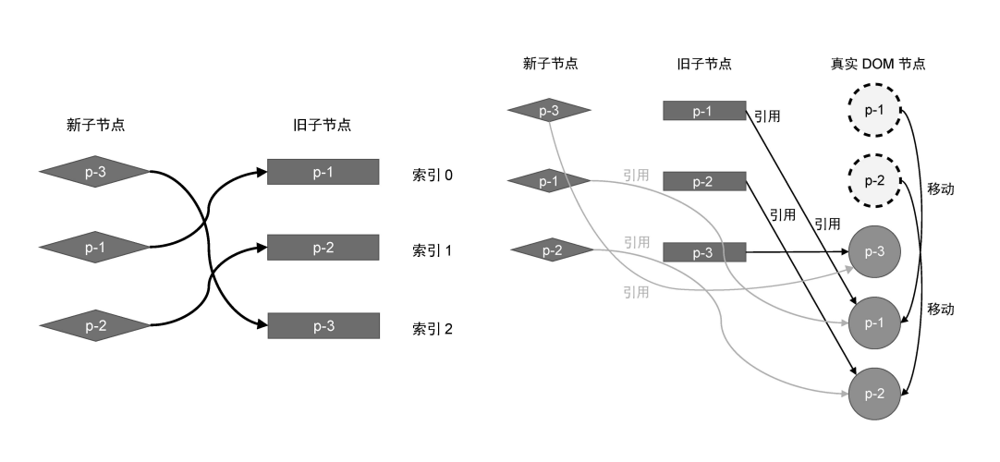

然而我们很容易的可以看出，其实只需要一步 DOM 节点的移动操作就可以完成更新，即只需要把真实 DOM 节点 p-3 移动到真实 DOM 节点 p-1 前面。

<figure>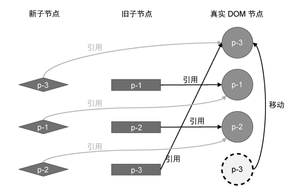</figure>

### 2. 双端 Diff 的理想情况

顾名思义，双端 Diff 算法是一种同时对新旧两组子节点的两个端点进行比较的算法。因此我们需要四个索引值，分别指向新旧两组子节点的端点，如图所示。

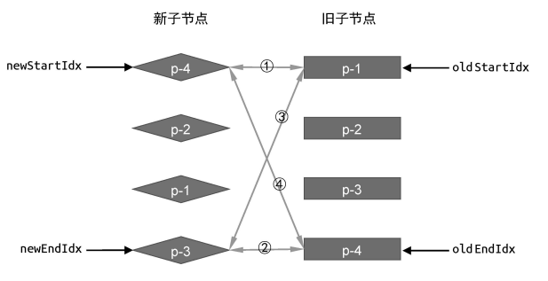

理想情况下假设双端 Diff 算法的每一轮比较都会命中四个步骤中的一种，此时其过程如下图所示

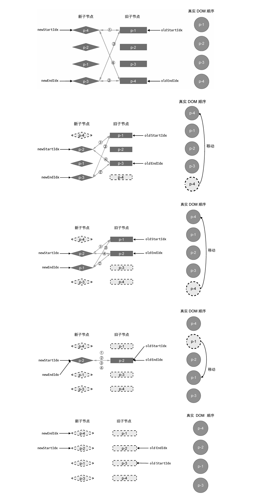

对应的代码实现如下

```js
function patchKeyedChildren(n1, n2, container) {
  const oldChildren = n1.children;
  const newChildren = n2.children;
  // 四个索引值
  let oldStartIdx = 0;
  let oldEndIdx = oldChildren.length - 1;
  let newStartIdx = 0;
  let newEndIdx = newChildren.length - 1;
  // 四个索引指向的 vnode 节点
  let oldStartVNode = oldChildren[oldStartIdx];
  let oldEndVNode = oldChildren[oldEndIdx];
  let newStartVNode = newChildren[newStartIdx];
  let newEndVNode = newChildren[newEndIdx];

  while (oldStartIdx <= oldEndIdx && newStartIdx <= newEndIdx) {
    if (oldStartVNode.key === newStartVNode.key) {
      // 第一步：oldStartVNode 和 newStartVNode 比较（不用移动）
      // 1. patch
      patch(oldStartVNode, newStartVNode, container);
      // 2. 更新相关索引，指向下一个位置
      oldStartVNode = oldChildren[++oldStartIdx];
      newStartVNode = newChildren[++newStartIdx];
    } else if (oldEndVNode.key === newEndVNode.key) {
      // 第二步：oldEndVNode 和 newEndVNode 比较（不用移动）
      patch(oldEndVNode, newEndVNode, container);
      oldEndVNode = oldChildren[--oldEndIdx];
      newEndVNode = newChildren[--newEndIdx];
    } else if (oldStartVNode.key === newEndVNode.key) {
      // 第三步：oldStartVNode 和 newEndVNode 比较（需要移动）
      patch(oldStartVNode, newEndVNode, container);
      // 将oldStartVNode移动到oldEndVNode的后面
      insert(oldStartVNode.el, container, oldEndVNode.el.nextSibling);
      oldStartVNode = oldChildren[++oldStartIdx];
      newEndVNode = newChildren[--newEndIdx];
    } else if (oldEndVNode.key === newStartVNode.key) {
      // 第四步：oldEndVNode 和 newStartVNode 比较（需要移动）
      patch(oldEndVNode, newStartVNode, container);
      // oldEndVNode.el 移动到 oldStartVNode.el 前面
      insert(oldEndVNode.el, container, oldStartVNode.el);
      // 移动 DOM 完成后，更新索引值，并指向下一个位置
      oldEndVNode = oldChildren[--oldEndIdx];
      newStartVNode = newChildren[++newStartIdx];
    }
  }
}
```

### 3. 双端 Diff 的非理想情况

双端 Diff 算法的每一轮比较不一定都会命中四个步骤中的一种，如下图所示，四次比较都不能命中从而进行复用，此时的做法应该是：==拿新的一组子节点中的头部节点去旧的一组子节点中寻找，如果存在说明此节点可复用，将其移动到旧子节点首节点的前面；如果没有找到，说明此节点为新增节点，将其挂载到头部。==

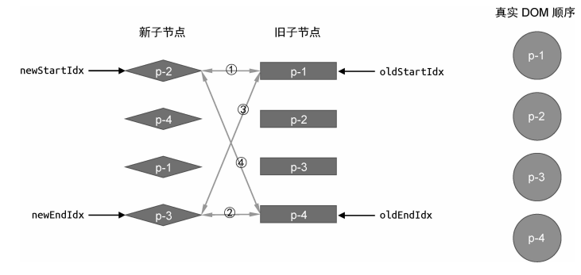

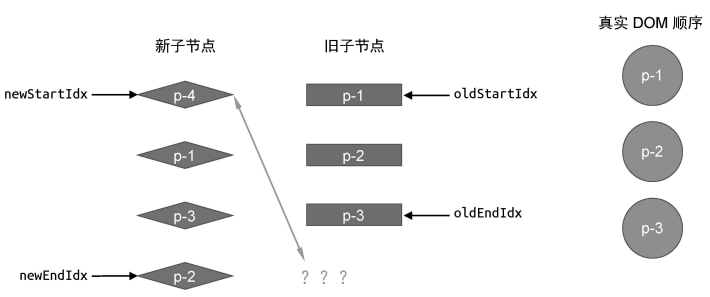

另外还存在一个问题是按照这四个步骤遍历完之后，新旧节点中可能存在还未处理的节点，如果存在新子节点未处理，说明需要对其进行挂载；而存在旧子节点未处理，说明需要对其进行卸载。

```js {16-18,29-62}
function patchKeyedChildren(n1, n2, container) {
  const oldChildren = n1.children;
  const newChildren = n2.children;
  // 四个索引值
  let oldStartIdx = 0;
  let oldEndIdx = oldChildren.length - 1;
  let newStartIdx = 0;
  let newEndIdx = newChildren.length - 1;
  // 四个索引指向的 vnode 节点
  let oldStartVNode = oldChildren[oldStartIdx];
  let oldEndVNode = oldChildren[oldEndIdx];
  let newStartVNode = newChildren[newStartIdx];
  let newEndVNode = newChildren[newEndIdx];

  while (oldStartIdx <= oldEndIdx && newStartIdx <= newEndIdx) {
    // 增加两个判断分支，如果头尾部节点为 undefined，则说明该节点已经被处理过了，直接跳到下一个位置
    if (!oldStartVNode) {
      oldStartVNode = oldChildren[++oldStartIdx];
    } else if (!oldEndVNode) {
      oldEndVNode = oldChildren[--oldEndIdx];
    } else if (oldStartVNode.key === newStartVNode.key) {
      // 省略部分代码
    } else if (oldEndVNode.key === newEndVNode.key) {
      // 省略部分代码
    } else if (oldStartVNode.key === newEndVNode.key) {
      // 省略部分代码
    } else if (oldEndVNode.key === newStartVNode.key) {
      // 省略部分代码
    } else {
      const idxInOld = oldChildren.findIndex((node) => node.key === newStartVNode.key);
      // 1. 存在可复用的节点
      if (idxInOld > 0) {
        const vnodeToMove = oldChildren[idxInOld];
        patch(vnodeToMove, newStartVNode, container);
        insert(vnodeToMove.el, container, oldStartVNode.el);
        oldChildren[idxInOld] = undefined;
        newStartVNode = newChildren[++newStartIdx];
      } else {
        // 2. 新增节点
        // 将 newStartVNode 作为新节点挂载到头部，使用当前头部节点oldStartVNode.el 作为锚点
        patch(null, newStartVNode, container, oldStartVNode.el);
      }
      newStartVNode = newChildren[++newStartIdx];
    }
  }
  // 循环结束后检查索引值的情况，
  if (oldEndIdx < oldStartIdx && newStartIdx <= newEndIdx) {
    // 如果满足条件，则说明有新的节点遗留，需要挂载它们
    // 3. 新增节点
    for (let i = newStartIdx; i <= newEndIdx; i++) {
      patch(null, newChildren[i], container, oldStartVNode.el);
    }
  } else if (newEndIdx < newStartIdx && oldStartIdx <= oldEndIdx) {
    // 4. 卸载节点（移除操作）
    for (let i = oldStartIdx; i <= oldEndIdx; i++) {
      unmount(oldChildren[i]);
    }
  }
}
```

vue2 中使用的就是这种双端 Diff 的算法

## 三、快速 Diff

### 1. 特殊情况

快速 Diff 算法借鉴了纯文本 Diff 算法中预处理的步骤，对 Diff 过程两组子节点中 ==相同的前置和后置节点== 优先进行处理，因为这部分前后的相对位置不变，不需要进行移动，只需要在两者之间打补丁即可。

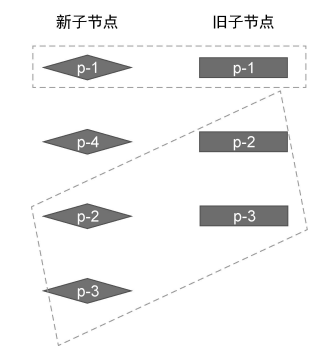

在所有旧子节点处理完毕，而新子节点中还存在未被处理的节点，则这些遗留的节点应该作为新增节点被 ==挂载== 。

在所有新子节点处理完毕，而旧子节点中还存在未被处理的节点，则这些遗留的节点应该被 ==卸载== 。

```js
function patchKeyedChildren(n1, n2, container) {
  const newChildren = n2.children;
  const oldChildren = n1.children;

  // 1. 更新相同的前置节点
  let j = 0;
  let oldVNode = oldChildren[j];
  let newVNode = newChildren[j];
  while (oldVNode.key === newVNode.key) {
    patch(oldVNode, newVNode, container);
    j++;
    oldVNode = oldChildren[j];
    newVNode = newChildren[j];
  }

  // 2. 更新相同的后置节点
  // 由于新旧两组子节点的数量可能不同，所以我们需要两个索引
  let oldEnd = oldChildren.length - 1;
  let newEnd = newChildren.length - 1;
  oldVNode = oldChildren[oldEnd];
  newVNode = newChildren[newEnd];
  while (oldVNode.key === newVNode.key) {
    patch(oldVNode, newVNode, container);
    oldEnd--;
    newEnd--;
    oldVNode = oldChildren[oldEnd];
    newVNode = newChildren[newEnd];
  }

  // 3. 需被挂载的节点
  if (j > oldEnd && j <= newEnd) {
    // 锚点的索引
    const anchorIndex = newEnd + 1;
    // 锚点元素
    const anchor = anchorIndex < newChildren.length ? newChildren[anchorIndex].el : null;
    // 采用 while 循环，调用 patch 函数逐个挂载新增节点
    while (j <= newEnd) {
      patch(null, newChildren[j++], container, anchor);
    }
  }
  // 4. 需被卸载的节点
  else if (j > newEnd && j <= oldEnd) {
    // j -> oldEnd 之间的节点应该被卸载
    while (j <= oldEnd) {
      unmount(oldChildren[j++]);
    }
  }
}
```

### 2. 一般情况处理

在特殊情况下，给出的例子比较理想化，当 处理完相同的前置节点或后置节点后，新旧两组子节点中总会有一组子节点全部被处理完毕。在这种情况下，只需要简单地挂载、卸载节点即可。但一般情况下情况会更加复杂，如图所示：

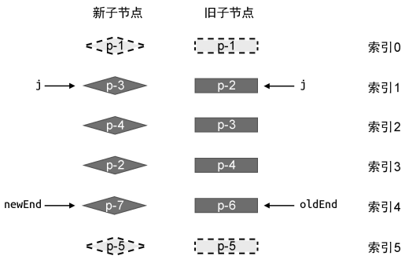

在处理完相同的前置和后置节点之后，剩下的依然是两组子节点序列。按照通用思路思考，接下来需要找出可复用的节点，是否需要移动，移动到什么位置以及需要进行挂载和删除的其他节点。

这里大体的思路是：

- 构造 source 数组：表示新子节点在旧子节点中的位置索引，长度为新子节点中尚未处理的节点数。

  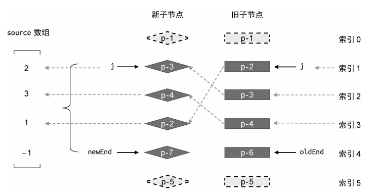

- 构造最长递增子序列：依据 source 数组构造最长递增子序列，此序列表示其中节点的相对位置没有发生变化。

  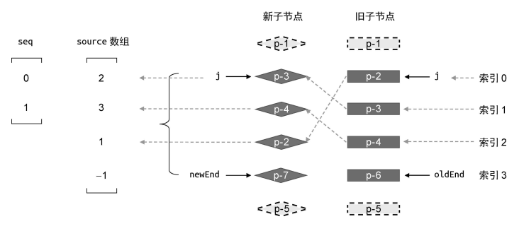

即找出更新前后顺序没有发生变化的节点，移动剩下的节点从而完成最小的移动次数。

```js {40-132}
function patchKeyedChildren(n1, n2, container) {
  const newChildren = n2.children;
  const oldChildren = n1.children;

  let j = 0;
  let oldVNode = oldChildren[j];
  let newVNode = newChildren[j];
  while (oldVNode.key === newVNode.key) {
    patch(oldVNode, newVNode, container);
    j++;
    oldVNode = oldChildren[j];
    newVNode = newChildren[j];
  }

  let oldEnd = oldChildren.length - 1;
  let newEnd = newChildren.length - 1;
  oldVNode = oldChildren[oldEnd];
  newVNode = newChildren[newEnd];
  while (oldVNode.key === newVNode.key) {
    patch(oldVNode, newVNode, container);
    oldEnd--;
    newEnd--;
    oldVNode = oldChildren[oldEnd];
    newVNode = newChildren[newEnd];
  }

  if (j > oldEnd && j <= newEnd) {
    const anchorIndex = newEnd + 1;
    const anchor = anchorIndex < newChildren.length ? newChildren[anchorIndex].el : null;
    while (j <= newEnd) {
      patch(null, newChildren[j++], container, anchor);
    }
  } else if (j > newEnd && j <= oldEnd) {
    while (j <= oldEnd) {
      unmount(oldChildren[j++]);
    }
  } else {
    // 构造 source 数组
    // 长度为新的一组子节点中剩余未处理节点的数量，默认值为-1
    const count = newEnd - j + 1;
    const source = new Array(count).fill(-1);

    const oldStart = j;
    const newStart = j;
    // 用来标志是否需要进行移动
    let moved = false;
    // 记录最大索引值
    let pos = 0;

    // 构建索引表，key为新子节点的key，value为其索引
    const keyIndex = {};
    for (let i = newStart; i <= newEnd; i++) {
      keyIndex[newChildren[i].key] = i;
    }

    // 新增 patched 变量，代表更新过的节点数量
    let patched = 0;
    // 遍历旧的一组子节点中剩余未处理的节点
    for (let i = oldStart; i <= oldEnd; i++) {
      oldVNode = oldChildren[i];
      // 如果更新过的节点数量小于等于需要更新的节点数量，则执行更新
      if (patched <= count) {
        // 与旧子节点具有相同key的新子节点的索引
        const k = keyIndex[oldVNode.key];
        if (typeof k !== 'undefined') {
          newVNode = newChildren[k];
          patch(oldVNode, newVNode, container);
          // k - newStart表示相对索引，newStart的索引表示为0
          source[k - newStart] = i;
          if (k < pos) {
            // 需要进行移动
            moved = true;
          } else {
            pos = k;
          }
        } else {
          // 没找到，将旧子节点进行卸载
          unmount(oldVNode);
        }
      } else {
        // 如果更新过的节点数量大于需要更新的节点数量，则卸载多余的节点
        unmount(oldVNode);
      }
    }

    // 进行节点的移动
    if (moved) {
      // 获取最长递增子序列的索引数组
      const seq = lis(sources);
      // s 指向最长递增子序列的最后一个元素
      let s = seq.length - 1;
      // i 指向新的一组子节点的最后一个元素
      let i = count - 1;
      for (i; i >= 0; i--) {
        if (source[i] === -1) {
          // 说明索引为 i 的节点是全新的节点，应该将其挂载
          // 该节点在新 children 中的真实位置索引
          const pos = i + newStart;
          const newVNode = newChildren[pos];
          // 该节点的下一个节点的位置索引
          const nextPos = pos + 1;
          // 锚点
          const anchor = nextPos < newChildren.length ? newChildren[nextPos].el : null;
          // 挂载
          patch(null, newVNode, container, anchor);
        } else if (i !== seq[s]) {
          // 说明该节点需要移动
          // 该节点在新的一组子节点中的真实位置索引
          const pos = i + newStart;
          const newVNode = newChildren[pos];
          // 该节点的下一个节点的位置索引
          const nextPos = pos + 1;
          // 锚点
          const anchor = nextPos < newChildren.length ? newChildren[nextPos].el : null;
          // 移动
          insert(newVNode.el, container, anchor);
        } else {
          // 当 i === seq[s] 时，说明该位置的节点不需要移动
          // 并让 s 指向下一个位置
          s--;
        }
      }
    }
  }
}
```

在构造 source 数组时，为了提高性能，先遍历新子节点构造出索引表；然后遍历旧子节点根据相同的 key 值可以从索引表中取出对应的节点的索引，从而可以得出新子节点在旧子节点中的位置索引。

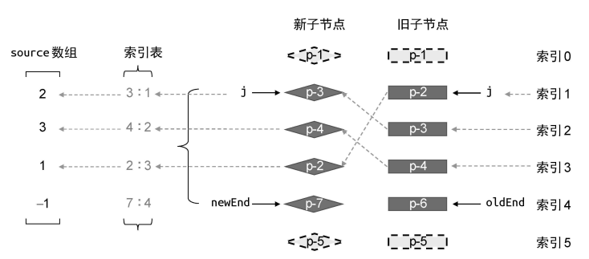

判断是否需要进行移动的方式与简单 Diff 相同——节点在旧 children 中的索引小于最大索引值。
