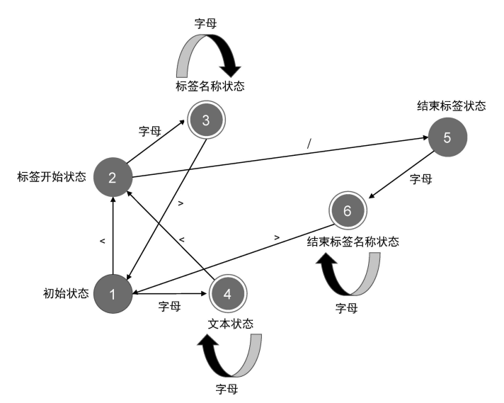
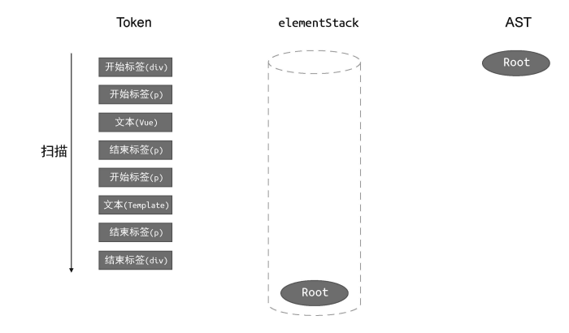
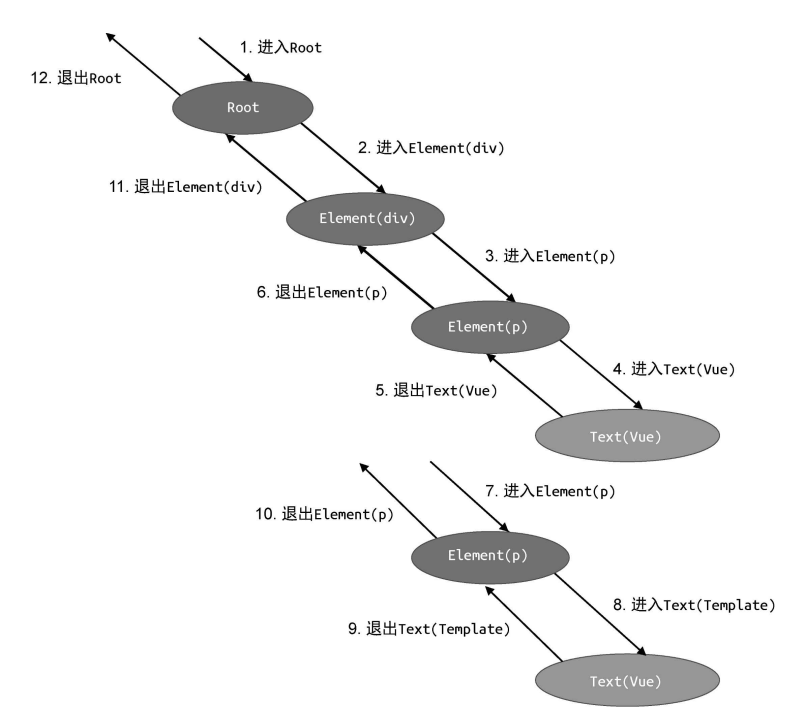

# 7. 编译器

编译器将 ==源代码== 翻译为 ==目标代码== 的过程叫作编译（compile）。完整的编译过程通常包含词法分析、语法分析、语义分析、中间代码生成、优化、目标代码生成等步骤。


Vue.js 模板编译器的目标代码其实就是渲染函数。具体而言包含以下几部分：


其中关键函数包含已下三种：


```js
const templateAST = parse(template)  // 解析器
const jsAST = transform(templateAST) // 转换器
const code = generate(jsAST)		 // 生成器
```

## 一、 解析器

将用户编写的模板解析为模板AST

### 1. 分阶段实现

> 利用状态机在 ==不同状态之间的迁移== 完成词法分析，形成 ==Token列表==



```js
// 定义状态机的状态
const State = {
    initial: 1, // 初始状态
    tagOpen: 2, // 标签开始状态
    tagName: 3, // 标签名称状态
    text: 4, // 文本状态
    tagEnd: 5, // 结束标签状态
    tagEndName:  // 结束标签名称状态
}
    // 一个辅助函数，用于判断是否是字母
    function isAlpha(char) {
        return char >= 'a' && char <= 'z' || char >= 'A' && char <= 'Z'
    }
// 接收模板字符串作为参数，并将模板切割为 Token 返回
function tokenize(str) {
    // 状态机的当前状态：初始状态
    let currentState = State.initial
    // 用于缓存字符
    const chars = []
    // 生成的 Token 会存储到 tokens 数组中，并作为函数的返回值返回
    const tokens = []
    // 使用 while 循环开启自动机，只要模板字符串没有被消费尽，自动机就会一直运行
    while(str) {
        // 查看第一个字符，注意，这里只是查看，没有消费该字符
        const char = str[0]
        // switch 语句匹配当前状态
        switch (currentState) {
                // 状态机当前处于初始状态
            case State.initial:
                // 遇到字符 <
                if (char === '<') {
                    // 1. 状态机切换到标签开始状态
                    currentState = State.tagOpen
                    // 2. 消费字符 <
                    str = str.slice(1)
                } else if (isAlpha(char)) {
                    // 1. 遇到字母，切换到文本状态
                    currentState = State.text
                    // 2. 将当前字母缓存到 chars 数组
                    chars.push(char)
                    // 3. 消费当前字符
                    str = str.slice(1)
                }
                break
                // 状态机当前处于标签开始状态
            case State.tagOpen:
                if (isAlpha(char)) {
                    // 1. 遇到字母，切换到标签名称状态
                    currentState = State.tagName
                    // 2. 将当前字符缓存到 chars 数组
                    chars.push(char)
                    // 3. 消费当前字符
                    str = str.slice(1)
                } else if (char === '/') {
                    // 1. 遇到字符 /，切换到结束标签状态
                    currentState = State.tagEnd
                    // 2. 消费字符 /
                    str = str.slice(1)
                }
                break
                // 状态机当前处于标签名称状态
            case State.tagName:
                if (isAlpha(char)) {
                    // 1. 遇到字母，由于当前处于标签名称状态，所以不需要切换状态，
                    // 但需要将当前字符缓存到 chars 数组
                    chars.push(char)
                    // 2. 消费当前字符
                    str = str.slice(1)
                } else if (char === '>') {
                    // 1.遇到字符 >，切换到初始状态
                    currentState = State.initial
                    // 2. 同时创建一个标签 Token，并添加到 tokens 数组中
                    // 注意，此时 chars 数组中缓存的字符就是标签名称
                    tokens.push({
                        type: 'tag',
                        name: chars.join('')
                    })
                    // 3. chars 数组的内容已经被消费，清空它
                    chars.length =   // 4. 同时消费当前字符 >
                        str = str.slice(1)
                }
                break
                // 状态机当前处于文本状态
            case State.text:
                if (isAlpha(char)) {
                    // 1. 遇到字母，保持状态不变，但应该将当前字符缓存到 chars 数组
                    chars.push(char)
                    // 2. 消费当前字符
                    str = str.slice(1)
                } else if (char === '<') {
                    // 1. 遇到字符 <，切换到标签开始状态
                    currentState = State.tagOpen
                    // 2. 从 文本状态 --> 标签开始状态，此时应该创建文本 Token，
                    并添加到 tokens 数组
                    // 注意，此时 chars 数组中的字符就是文本内容
                    tokens.push({
                        type: 'text',
                        content: chars.join('')
                    })
                    // 3. chars 数组的内容已经被消费，清空它
                    chars.length =   // 4. 消费当前字符
                        str = str.slice(1)
                }
                break
                // 状态机当前处于标签结束状态
            case State.tagEnd:
                if (isAlpha(char)) {
                    // 1. 遇到字母，切换到结束标签名称状态
                    currentState = State.tagEndName
                    // 2. 将当前字符缓存到 chars 数组
                    chars.push(char)
                    // 3. 消费当前字符
                    str = str.slice(1)
                }
                break
                // 状态机当前处于结束标签名称状态
            case State.tagEndName:
                if (isAlpha(char)) {
                    // 1. 遇到字母，不需要切换状态，但需要将当前字符缓存到 chars数组
                    chars.push(char)
                    // 2. 消费当前字符
                    str = str.slice(1)
                } else if (char === '>') {
                    // 1. 遇到字符 >，切换到初始状态
                    currentState = State.initial
                    // 2. 从 结束标签名称状态 --> 初始状态，应该保存结束标签名称Token
                    // 注意，此时 chars 数组中缓存的内容就是标签名称
                    tokens.push({
                        type: 'tagEnd',
                        name: chars.join('')
                    })
                    // 3. chars 数组的内容已经被消费，清空它
                    chars.length =   // 4. 消费当前字符
                        str = str.slice(1)
                }
                break
        }
    }
    // 最后，返回 tokens
    return tokens
}
```

严格按照状态迁移过程编写，但其中可优化的点很多

> 根据Token列表构造AST

一棵用于描述 HTML 的 AST 将拥有与 HTML 标签非常相似的树型结构，根据 Token 列表构建 AST 的过程，其实就是对 Token 列表进行扫 描的过程。从第一个 Token 开始，顺序地扫描整个 Token 列表，直到列表中的所有 Token 处理完毕。



```js
// parse 函数接收模板作为参数
function parse(str) {
    // 首先对模板进行标记化，得到 tokens
    const tokens = tokenize(str)
    // 创建 Root 根节点
    const root = {
        type: 'Root',
        children: []
    }
    // 创建 elementStack 栈，起初只有 Root 根节点
    const elementStack = [root]
    // 开启一个 while 循环扫描 tokens，直到所有 Token 都被扫描完毕为止
    while (tokens.length) {
        // 获取当前栈顶节点作为父节点 parent
        const parent = elementStack[elementStack.length - 1]
        // 当前扫描的 Token
        const t = tokens[0]
        switch (t.type) {
            case 'tag':
                // 如果当前 Token 是开始标签，则创建 Element 类型的 AST 节点
                const elementNode = {
                    type: 'Element',
                    tag: t.name,
                    children: []
                }
                // 将其添加到父级节点的 children 中
                parent.children.push(elementNode)
                // 将当前节点压入栈
                elementStack.push(elementNode)
                break
            case 'text':
                // 如果当前 Token 是文本，则创建 Text 类型的 AST 节点
                const textNode = {
                    type: 'Text',
                    content: t.content
                }
                // 将其添加到父节点的 children 中
                parent.children.push(textNode)
                break
            case 'tagEnd':
                // 遇到结束标签，将栈顶节点弹出
                elementStack.pop()
                break
        }
        // 消费已经扫描过的 token
        tokens.shift()
    }
    // 最后返回 AST
    return root
}

```

> 实例测试：`<div><p>Vue</p><p>Template</p></div>`

**Tokens**

```js
const tokens = [
    {type: "tag", name: "div"}, // div 开始标签节点
    {type: "tag", name: "p"}, // p 开始标签节点
    {type: "text", content: "Vue"}, // 文本节点
    {type: "tagEnd", name: "p"}, // p 结束标签节点
    {type: "tag", name: "p"}, // p 开始标签节点
    {type: "text", content: "Template"}, // 文本节点
    {type: "tagEnd", name: "p"}, // p 结束标签节点
    {type: "tagEnd", name: "div"} // div 结束标签节点
]
```

**AST**

```js
const ast = {
    // AST 的逻辑根节点
    type: 'Root',
    children: [
        // 模板的 div 根节点
        {
            type: 'Element',
            tag: 'div',
            children: [
                // div 节点的第一个子节点 p
                {
                    type: 'Element',
                    tag: 'p',
                    // p 节点的文本节点
                    children: [
                        {
                            type: 'Text',
                            content: 'Vue'
                        }
                    ]
                },
                // div 节点的第二个子节点 p
                {
                    type: 'Element',
                    tag: 'p',
                    // p 节点的文本节点
                    children: [
                        {
                            type: 'Text',
                            content: 'Template'
                        }
                    ]
                }
            ]
        }
    ]
}
```

## 二、转换器

编译的目标是将模板编译为渲染函数，而渲染函数是用JavaScript代码描述的，所以需要将模板 AST 转换为用于描述渲染函数的 JavaScript AST。

如上例所用模板，其对应的渲染函数为：

```js
function render() {
    return h('div', [
        h('p', 'Vue'),
        h('p', 'Template')
    ])
}
```

则转换后的JavaScript AST应该如下所示：

```js
const FunctionDeclNode = {
    type: 'FunctionDecl' ,// 代表该节点是函数声明
    // 函数的名称是一个标识符，标识符本身也是一个节点
    id: {
        type: 'Identifier',
        name: 'render' // name 用来存储标识符的名称，在这里它就是渲染函数的名称 render
    },
    params: [], // 参数，目前渲染函数还不需要参数，所以这里是一个空数组
    // 渲染函数的函数体只有一个语句，即 return 语句
    body: [
        {
            type: 'ReturnStatement',
            // 最外层的 h 函数调用
            return: {
                type: 'CallExpression',
                callee: { type: 'Identifier', name: 'h' },
                arguments: [
                    // 第一个参数是字符串字面量 'div'
                    {
                        type: 'StringLiteral',
                        value: 'div'
                    },
                    // 第二个参数是一个数组
                    {
                        type: 'ArrayExpression',
                        elements: [
                            // 数组的第一个元素是 h 函数的调用
                            {
                                type: 'CallExpression',
                                callee: { type: 'Identifier', name: 'h' },
                                arguments: [
                                    // 该 h 函数调用的第一个参数是字符串字面量
                                    { type: 'StringLiteral', value: 'p' },
                                    // 第二个参数也是一个字符串字面量
                                    { type: 'StringLiteral', value: 'Vue' },
                                ]
                            },
                            // 数组的第二个元素也是 h 函数的调用
                            {
                                type: 'CallExpression',
                                callee: { type: 'Identifier', name: 'h' },
                                arguments: [
                                    // 该 h 函数调用的第一个参数是字符串字面量
                                    { type: 'StringLiteral', value: 'p' },
                                    // 第二个参数也是一个字符串字面量
                                    { type: 'StringLiteral', value: 'Template' },
                                ]
                            }
                        ]
                    }
                ]
            }
        }
    ]
}
```

### 1.  深度优先遍历

为了对 AST 进行转换，我们需要能访问 AST 的每一个节点，这样才有机会对特定节点进行修改、替换、删除等操作。因此首先需要编写一个深度优先的遍历算法，实现对 AST 中节点的访问。

```js {5-8}
function traverseNode(ast) {
    // 当前节点，ast 本身就是 Root 节点
    const currentNode = ast
    
    // Todo：需要进行的操作
    // 操作1
    // 操作2
    // ...
    
    // 如果有子节点，则递归地调用 traverseNode 函数进行遍历
    const children = currentNode.children
    if (children) {
        for (let i = 0; i < children.length; i++) {
            traverseNode(children[i])
        }
    }
}
```

### 2. 插件化架构

如上述代码光标处所示，如果将所有需要进行的转换操作全部写与`traverseNode`函数中，显得过于臃肿和耦合，为此利用回调函数的机制将此部分提取出去进行解耦。

```js {1,4-9}
// 接收第二个参数 context
function traverseNode(ast, context) {
    const currentNode = ast
    // context.nodeTransforms 是一个数组，其中每一个元素都是一个函数
    const transforms = context.nodeTransforms
    for (let i = 0; i < transforms.length; i++) {
        // 将当前节点 currentNode 和 context 都传递给 nodeTransforms 中注册的回调函数
        transforms[i](currentNode, context)
    }
    const children = currentNode.children
    if (children) {
        for (let i = 0; i < children.length; i++) {
            traverseNode(children[i], context)
        }
    }
}

function transform(ast) {
    // 在 transform 函数内创建 context 对象
    const context = {
        // 注册 nodeTransforms 数组,用来保存需要进行的转换操作
        nodeTransforms: [
            transformElement, 
            transformText
        ]
    }
    // 调用 traverseNode 完成转换
    traverseNode(ast, context)
}
```

`Context`指的是上下文对象，是程序在 ==某个范围内的全局变量== 。为其添加额外的上下文信息。

```js
function transform(ast) {
    const context = {
        // 增加 currentNode，用来存储当前正在转换的节点
        currentNode: null,
        // 增加 childIndex，用来存储当前节点在父节点的 children 中的位置索引
        childIndex: 0,
        // 增加 parent，用来存储当前转换节点的父节点
        parent: null,
        // 用于替换节点的函数，接收新节点作为参数
        replaceNode(node) {
            // 为了替换节点，需要修改 AST
            // 找到当前节点在父节点的 children 中的位置：context.childIndex
            // 然后使用新节点替换即可
            context.parent.children[context.childIndex] = node
            // 由于当前节点已经被新节点替换掉了，因此我们需要将 currentNode 更新为新节点
            context.currentNode = node
        },
        // 用于删除当前节点
        removeNode() {
            if (context.parent) {
                // 调用数组的 splice 方法，根据当前节点的索引删除当前节点
                context.parent.children.splice(context.childIndex, 1)
                // 将 context.currentNode 置空
                context.currentNode = null
            }
        },
        nodeTransforms: [
            transformElement,
            transformText
        ]
    }
    traverseNode(ast, context)
}
```

在合适的地方设置转换上下文对象中的数据

```js {2-3,9,14-17}
function traverseNode(ast, context) {
    // 设置当前转换的节点信息 context.currentNode
    context.currentNode = ast
    const transforms = context.nodeTransforms
    for (let i = 0; i < transforms.length; i++) {
        transforms[i](context.currentNode, context)
        // 由于任何转换函数都可能移除当前节点，因此每个转换函数执行完毕后，
        // 都应该检查当前节点是否已经被移除，如果被移除了，直接返回即可
        if (!context.currentNode) return
    }
    const children = context.currentNode.children
    if (children) {
        for (let i = 0; i < children.length; i++) {
            // 递归地调用 traverseNode 转换子节点之前，将当前节点设置为父节点
            context.parent = context.currentNode
            // 设置位置索引
            context.childIndex = i
            // 递归地调用时，将 context 透传
            traverseNode(children[i], context)
        }
    }
}
```

在转换 AST 节点的过程中，往往需要根据其子节点的情况来决定如何对当前节点进行转换。这就要求父节点的转换操作必须等待其所有子节点全部转换完毕后再执行。为此做出如下设计：



对节点的访问分为两个阶段，即进入阶段和退出阶段：

```js {4,7-12,23-28}
function traverseNode(ast, context) {
    context.currentNode = ast
    // 1. 增加退出阶段的回调函数数组
    const exitFns = []
    const transforms = context.nodeTransforms
    for (let i = 0; i < transforms.length; i++) {
        // 2. 转换函数可以返回另外一个函数，该函数即作为退出阶段的回调函数
        const onExit = transforms[i](context.currentNode, context)
        if (onExit) {
            // 将退出阶段的回调函数添加到 exitFns 数组中
            exitFns.push(onExit)
        }
        if (!context.currentNode) return
    }
    const children = context.currentNode.children
    if (children) {
        for (let i = 0; i < children.length; i++) {
            context.parent = context.currentNode
            context.childIndex = i
            traverseNode(children[i], context)
        }
    }
    // 在节点处理的最后阶段执行缓存到 exitFns 中的回调函数
    // 注意，这里我们要反序执行
    let i = exitFns.length
    while (i--) {
        exitFns[i]()
    }
}

```

在编写转换函数时，可以将转换逻辑编 写在退出阶段的回调函数中，从而保证在对当前访问的节点进行转换之前，其子节点一定全部处理完毕。

```js
function transformElement(node, context) {
    // 进入节点

    // 返回一个会在退出节点时执行的回调函数
    return () => {
        // 在这里编写退出节点的逻辑，当这里的代码运行时，当前转换节点的子节点一定处理完毕了
    }
}
```

### 3. AST的转换

用来创建 JavaScript AST 节点的辅助函数

```js
// 用来创建 StringLiteral 节点
function createStringLiteral(value) {
    return {
        type: 'StringLiteral',
        value
    }
}
// 用来创建 Identifier 节点
function createIdentifier(name) {
    return {
        type: 'Identifier',
        name
    }
}
// 用来创建 ArrayExpression 节点
function createArrayExpression(elements) {
    return {
        type: 'ArrayExpression',
        elements
    }
}
// 用来创建 CallExpression 节点
function createCallExpression(callee, arguments) {
    return {
        type: 'CallExpression',
        callee: createIdentifier(callee),
        arguments
    }
}
```

转换操作

```js
// 转换文本节点
function transformText(node) {
    // 如果不是文本节点，则什么都不做
    if (node.type !== 'Text') {
        return
    }
    // 文本节点对应的 JavaScript AST 节点其实就是一个字符串字面量，
    // 因此只需要使用 node.content 创建一个 StringLiteral 类型的节点即可
    // 最后将文本节点对应的 JavaScript AST 节点添加到 node.jsNode 属性下
    node.jsNode = createStringLiteral(node.content)
}


// 转换标签节点
function transformElement(node) {
    // 将转换代码编写在退出阶段的回调函数中，
    // 这样可以保证该标签节点的子节点全部被处理完毕
    return () => {
        // 如果被转换的节点不是元素节点，则什么都不做
        if (node.type !== 'Element') {
            return
        }
        // 1. 创建 h 函数调用语句,
        // h 函数调用的第一个参数是标签名称，因此我们以 node.tag 来创建一个字符串字面量节点作为第一个参数
        const callExp = createCallExpression('h', [
            createStringLiteral(node.tag)
        ])
        // 2. 处理 h 函数调用的参数
        node.children.length ===   // 如果当前标签节点只有一个子节点，则直接使用子节点的 jsNode 作为参数
            ? callExp.arguments.push(node.children[0].jsNode)
        // 如果当前标签节点有多个子节点，则创建一个 ArrayExpression 节点作为参数
        : callExp.arguments.push(
            // 数组的每个元素都是子节点的 jsNode
            createArrayExpression(node.children.map(c => c.jsNode))
        )
        // 3. 将当前标签节点对应的 JavaScript AST 添加到 jsNode 属性下
        node.jsNode = callExp
    }
}

// 转换 Root 根节点
function transformRoot(node) {
    // 将逻辑编写在退出阶段的回调函数中，保证子节点全部被处理完毕
    return () => {
        // 如果不是根节点，则什么都不做
        if (node.type !== 'Root') {
            return
        }
        // node 是根节点，根节点的第一个子节点就是模板的根节点，
        // 当然，这里我们暂时不考虑模板存在多个根节点的情况
        const vnodeJSAST = node.children[0].jsNode
        // 创建 render 函数的声明语句节点，将 vnodeJSAST 作为 render 函数体的返回语句
        node.jsNode = {
            type: 'FunctionDecl',
            id: { type: 'Identifier', name: 'render' },
            params: [],
            body: [
                {
                    type: 'ReturnStatement',
                    return: vnodeJSAST
                }
            ]
        }
    }
}

```

在转换标签节点时，我们需要将转换逻辑编写在退出阶段的回调函数内，这样才能保证其子节点全部被处理完毕； 

无论是文本节点还是标签节点，它们转换后的 JavaScript AST 节点 都存储在节点的 `node.jsNode` 属性下。

## 三、生成器

根据 JavaScript AST 生成渲染函数代码，代码生成本质上是字符串拼接的艺术。与 AST 转换一样，代码生成也需要上下文对象。该上下文对象用来维护代码生成过程中程序的运行状态。

```js
function generate(node) {
    const context = {
        // 存储最终生成的渲染函数代码
        code: '',
        // 在生成代码时，通过调用 push 函数完成代码的拼接
        push(code) {
            context.code += code
        },
        // 当前缩进的级别，初始值为 0，即没有缩进
        currentIndent: 0,
        // 该函数用来换行，即在代码字符串的后面追加 \n 字符，
        // 另外，换行时应该保留缩进，所以我们还要追加 currentIndent *  个空格字符
        newline() {
            context.code += '\n' + ` `.repeat(context.currentIndent)
        },
        // 用来缩进，即让 currentIndent 自增后，调用换行函数
        indent() {
            context.currentIndent++
            context.newline()
        },
        // 取消缩进，即让 currentIndent 自减后，调用换行函数
        deIndent() {
            context.currentIndent--
            context.newline()
        }
    }
    genNode(node, context)
    return context.code
}


function genNode(node, context) {
    switch (node.type) {
        case 'FunctionDecl':
            genFunctionDecl(node, context)
            break
        case 'ReturnStatement':
            genReturnStatement(node, context)
            break
        case 'CallExpression':
            genCallExpression(node, context)
            break
        case 'StringLiteral':
            genStringLiteral(node, context)
            break
        case 'ArrayExpression':
            genArrayExpression(node, context)
            break
    }
}
```

各自的生成函数代码

```js
function genFunctionDecl(node, context) {
    // 从 context 对象中取出工具函数
    const { push, indent, deIndent } = context
    // node.id 是一个标识符，用来描述函数的名称，即 node.id.name
    push(`function ${node.id.name} `)
    push(`(`)
    // 调用 genNodeList 为函数的参数生成代码
    genNodeList(node.params, context)
    push(`) `)
    push(`{`)
    // 缩进
    indent()
    // 为函数体生成代码，这里递归地调用了 genNode 函数
    node.body.forEach(n => genNode(n, context))
    // 取消缩进
    deIndent()
    push(`}`)
}

function genNodeList(nodes, context) {
    const { push } = context
    for (let i = 0; i < nodes.length; i++) {
        const node = nodes[i]
        genNode(node, context)
        if (i < nodes.length - 1) {
            push(', ')
        }
    }
}

function genArrayExpression(node, context) {
    const { push } = context
    // 追加方括号
    push('[')
    // 调用 genNodeList 为数组元素生成代码
    genNodeList(node.elements, context)
    // 补全方括号
    push(']')
}

function genReturnStatement(node, context) {
    const { push } = context
    // 追加 return 关键字和空格
    push(`return `)
    // 调用 genNode 函数递归地生成返回值代码
    genNode(node.return, context)
}

function genStringLiteral(node, context) {
    const { push } = context
    // 对于字符串字面量，只需要追加与 node.value 对应的字符串即可
    push(`'${node.value}'`)
}

function genCallExpression(node, context) {
    const { push } = context
    // 取得被调用函数名称和参数列表
    const { callee, arguments: args } = node
    // 生成函数调用代码
    push(`${callee.name}(`)
    // 调用 genNodeList 生成参数代码
    genNodeList(args, context)
    // 补全括号
    push(`)`)
}
```

依然使用之前的实例，最终生成的代码字符串如下：

```js
function render () {
    return h('div', [h('p', 'Vue'), h('p', 'Template')])
}
```

