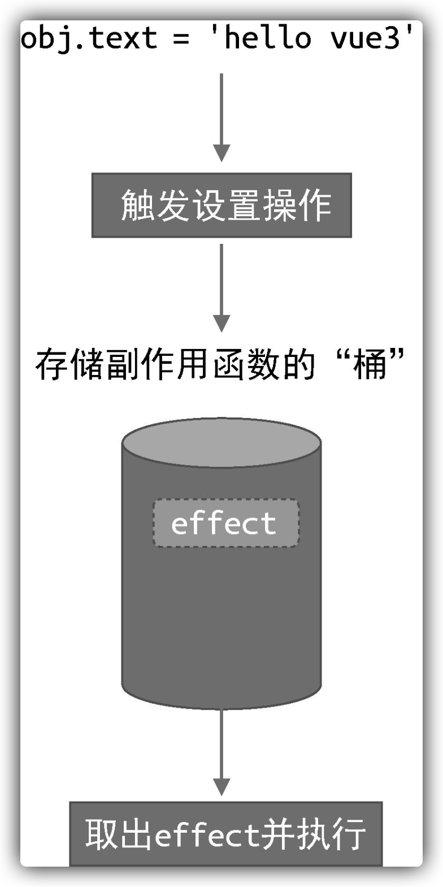
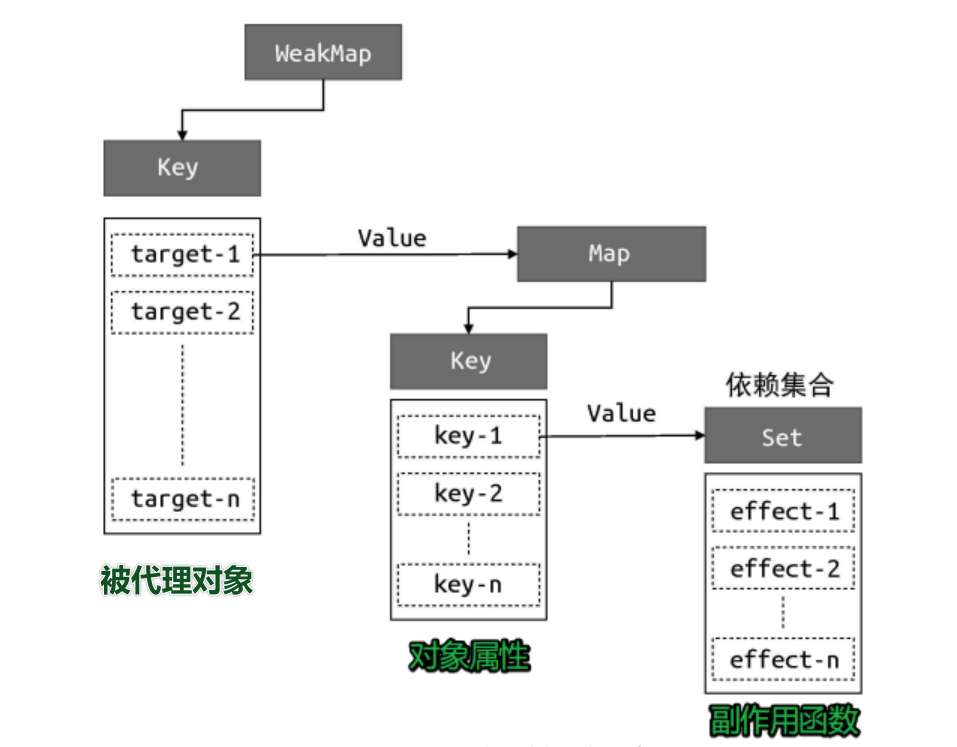
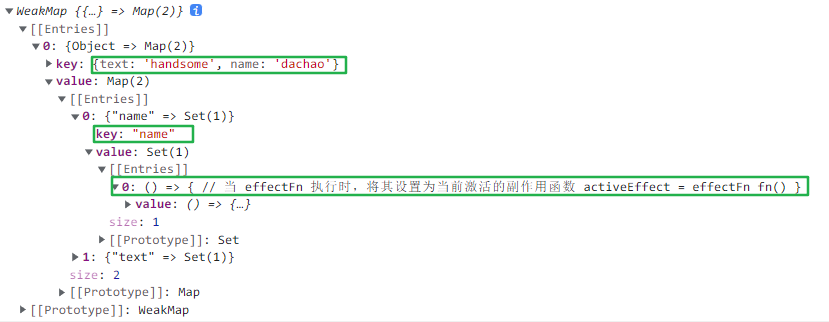
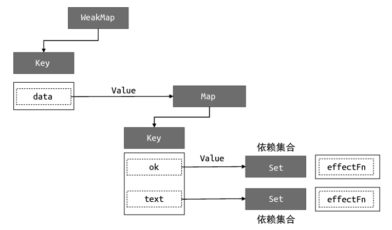
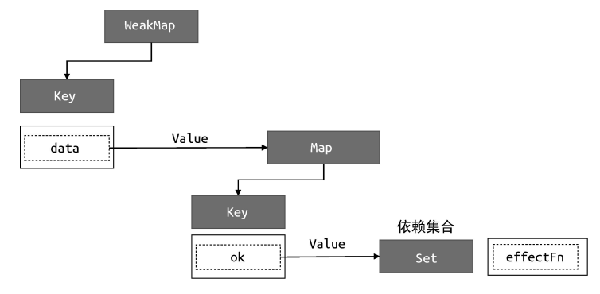
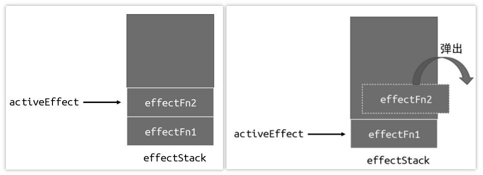
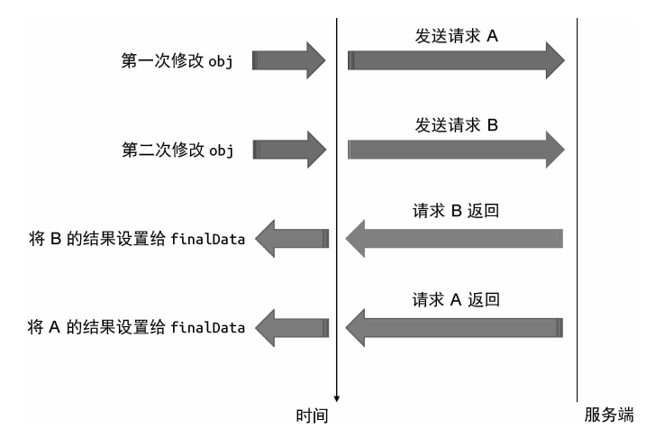

# vue的设计与实现（1-4章）

> 霍春阳《Vue.js设计与实现》的笔记

## 一、vue整体方向的选择（权衡）

### 1. 声明式or命令式

**命令式（关注过程）**

```js
const div = document.querySelector('#app') // 获取 div
div.innerText ='hello world' // 设置文本内容
div.addEventlistener('click'，() =>[ alert('ok') )) // 绑定点击事件
```

**声明式（关注结果）**

```vue
<div @click="()=> alert('ok')">hello world</div>
```

这部分的选择主要基于两个方面：**性能**和**可维护性**。

|        | 性能 | 可维护性 |
| :-: | :--: | :--: |
| 对比 | 命令式 > 声明式 | 声明式 >> 命令式 |

- 因为声明式在命令式性能消耗的基础上多出了**diff的性能消耗**，所以在性能上会差一些
- 但随之带来的是可维护性的巨大提升

> Vue封装命令式的代码，实现面向用户的声明式

### 2. 虚拟dom的选择

上面提到声明式带来的额外性能消耗——**diff的性能消耗**，虚拟dom便是为了最小化此消耗采取的措施。其中虚拟dom是一个普通的JS对象，用来表示对真实dom的描述。

```js
const obj = {
    tag: 'div',
    children: [
        { tag: 'span', children: 'hello world' }
    ]
}
```


### 3. 运行时or编译时

- 运行时
  - 利用 `render` 函数，直接把 ==虚拟DOM==  转化为 ==真实DOM== 元素
  - 没有编译过程，无法分析用户提供的内容
  - 需要我们手写`render`函数（:confounded:）
- 编译时
  - 直接把 ==template 模板== 中的内容，转化为 ==真实 DOM== 元素
  - 可以分析用户提供的内容，理论上性能会更好，但是有损灵活性
- 运行时编译（Vue选用）
  - 先把 ==template 模板== 转化为 ==render 函数==
  - 再利用render 函数，把 ==虚拟 DOM==  转化为 ==真实 DOM==

## 二、 框架设计的核心要素

- 提升用户的开发体验
  - 引入友好的警告信息，帮助开发者里快速定位问题
  - 警告信息详细导致框架体积增大，通过判断所处环境来决定构建的版本是否包含这些警告信息
- 引入`Tree-Shaking`机制
  - 配合预定义变量，排除dead code，缩小打包体积

- 根据应用环境的不同输出不同的构建产物（ ==多版本==）
- 提供功能的特性开关，让用户自由选择是否使用
- 提供统一的错误处理接口：`callWithErrorHandling`
- 提供良好的TS类型支持

## 三、Vue3的设计思路

### 1. 描述UI

Vue3中支持两种方式来描述UI。第一种是 ==模板==，即我们常在template标签中书写的内容：

```vue
 <h1 @click="handler"><span></span></h1>
```

- 这种方式vue最终还是会将其编译为`render`函数（通过**编译器**）

另外一种是直接使用js对象来描述UI，即所谓的 ==虚拟DOM==。

```js
import { h } from 'vue'
export default {
    render() {
        return h('h1', { onClick: handler }) // 虚拟 DOM
    }
}
```

- `render`函数运行返回一个虚拟DOM对象
- 其中h为辅助创建虚拟DOM的工具函数

### 2. 渲染器

渲染器的作用就是 ==把虚拟 DOM 渲染为真实 DOM==，以下是一个不考虑更新节点的简易版本

```js
function renderer(vnode, container) {
    // 使用 vnode.tag 作为标签名称创建 DOM 元素
    const el = document.createElement(vnode.tag)
    // 遍历 vnode.props，将属性、事件添加到 DOM 元素
    for (const key in vnode.props) {
        if (/^on/.test(key)) {
            // 如果 key 以 on 开头，说明它是事件
            el.addEventListener(
                key.substr(2).toLowerCase(), // 事件名称 onClick --->click
                vnode.props[key] // 事件处理函数
            )
        }
    }
    // 处理 children
    if (typeof vnode.children === 'string') {
        // 如果 children 是字符串，说明它是元素的文本子节点
        el.appendChild(document.createTextNode(vnode.children))
    } else if (Array.isArray(vnode.children)) {
        // 递归地调用 renderer 函数渲染子节点，使用当前元素 el 作为挂载点
        vnode.children.forEach(child => renderer(child, el))
    }
    // 将元素添加到挂载点下
    container.appendChild(el)
}
```

### 3. 组件

==组件就是一组DOM元素的封装==，这组DOM元素就是组件要渲染的内容。而虚拟DOM不光可以用来描述真实DOM，还可以用来描述组件，只是其中`tag`变成了组件。

```js
const vnode = {
    tag: MyComponent
}
```

```js
//MyComponent是一个对象
const MyComponent = {
    render(){
        return{
            tag:'div',
            props:{
                onclick:()=>alert ('hello')
            },
            children:'click me'
        }
    }
}

//MyComponent是一个函数
const MyComponent = function () {
    return {
        tag: 'div',
        props: {
            onClick: () => alert('hello')
        },
        children: 'click me'
    }
}
```

`MyComponent`可以是函数，可以是对象，只要最终返回的是一组虚拟dom即可。我们根据`MyComponent`的类型对渲染器进行相应的修改

```js
function renderer(vnode, container) {
    if (typeof vnode.tag === 'string') {
        // 说明 vnode 描述的是标签元素
        mountElement(vnode, container)
    } else if (typeof vnode.tag === 'function') { //或者=== 'Object'
        // 说明 vnode 描述的是组件
        mountComponent(vnode, container)
    }
}
```

其中mountElement即上述渲染器的部分，而新加的处理组件的函数`mountComponent`，大致流程为：

```js
function mountComponent(vnode, container) {
    // 调用组件函数，获取组件要渲染的内容（虚拟 DOM）
    const subtree = vnode.tag() //vnode.tag.render()
    // 递归地调用 renderer 渲染 subtree
    renderer(subtree, container)
}
```

### 4. 编译器

编译器的作用是 ==将模板编译为渲染函数==，对于编译器来说，模板就是一个普通的字符串，它会分析该字符 串并生成一个功能与之相同的渲染函数

```vue
<template>
	<div @click="handler">
    	click me
    </div>
</template>

<script>
    export default {
        data() {/* ... */},
        methods: {
            handler: () => {/* ... */}
        }
    }
</script>
```

`<template>` 标签里的内容就是模板内容，编译器会把模板内容 编译成渲染函数并添加到 `<script>`标签块的组件对象上，所以最终在浏览器里运行的代码就是：

```js
export default {
    data() {/* ... */},
    methods: {
        handler: () => {/* ... */}
    },
    render() {
        return h('div', { onClick: handler }, 'click me')
    }
}
```

### 5. 页面渲染流程


## 四、响应系统的作用与实现

### 1. 响应式数据与副作用函数

​	**副作用函数**是指会产生副作用的函数，即它会直接或间接地影响其他函数的执行。


而**响应式数据**是指会导致视图变化的数据。

### 2. 完成响应式的基本思路

拦截**响应式数据**的存取行为，在读取数据时，将副作用函数存到一个“桶”里；当设置数据时，将副作用函数从“桶”里取出执行。


<p></p>

其中拦截存取的操作，在Vue2中使用`Object.defineProperty`实现；在Vue3中使用`Proxy`实现。

> 基本思路的实现

```js
// 存储副作用函数的桶
const bucket = new Set()

// 原始数据
const data = { text: 'hello world' }
// 对原始数据的代理
const obj = new Proxy(data, {
    // 拦截读取操作
    get(target, key) {
        // 将副作用函数 effect 添加到存储副作用函数的桶中
        bucket.add(effect)
        // 返回属性值
        return target[key]
    },
    // 拦截设置操作
    set(target, key, newVal) {
        // 设置属性值
        target[key] = newVal
        // 把副作用函数从桶里取出并执行
        bucket.forEach(fn => fn())
        // 返回 true 代表设置操作成功
        return true
    }
})
```

### 3. 较完善响应式的实现

#### 硬编码

> **问题**：硬编码，副作用函数的名字固定为effect，导致一旦副作用函数的名字不叫 effect，那么这段代码就不能正确地工作了。
>
> **action**：添加副作用函数注册机制

```js
// 用一个全局变量存储被注册的副作用函数
let activeEffect
// effect 函数用于注册副作用函数
function effect(fn) {
    // 当调用 effect 注册副作用函数时，将副作用函数 fn 赋值给activeEffect
    activeEffect = fn
    // 执行副作用函数
    fn()
}
```

当使用时

```js
effect(
    // 一个匿名的副作用函数
    () => {
        document.body.innerText = obj.text
    }
)
```

activeEffect保存着当前的副作用函数，副作用函数执行时触发响应式数据 obj.text 的读取操作，进而触发代理对象 Proxy 的 get 拦截函数。

相应地对代理操作进行改进，这样 ==响应系统就不依赖副作用函数的名字了==

```js {4-6}
const obj = new Proxy(data, {
    get(target, key) {
        // 将 activeEffect 中存储的副作用函数收集到“桶”中
        if (activeEffect) {//改进
            bucket.add(activeEffect)
        } 
        return target[key]
    },
    set(target, key, newVal) {
        target[key] = newVal
        bucket.forEach(fn => fn())
        return true
    }
})
```

#### "桶"结构的重新设计

> **问题**：没有在副作用函数与被操作的目标字段之间建立明确的联系。当读取属性时，无论读取的是哪一个属性，其实都一样，都会把副作用函数收集到“桶”里；当 设置属性时，无论设置的是哪一个属性，也都会把“桶”里的副作用函数取出并执行。
>
> **action**：改写“桶”的结构





```js
// 存储副作用函数的桶
const bucket = new WeakMap()

const obj = new Proxy(data, {
    // 拦截读取操作
    get(target, key) {
        // 没有 activeEffect，直接 return
        if (!activeEffect) return target[key]
        // 根据 target 从“桶”中取得 depsMap，它也是一个 Map 类型：key -->effects
        let depsMap = bucket.get(target)
        // 如果不存在 depsMap，那么新建一个 Map 并与 target 关联
        if (!depsMap) {
            bucket.set(target, (depsMap = new Map()))
        }
        // 再根据 key 从 depsMap 中取得 deps，它是一个 Set 类型，
        // 里面存储着所有与当前 key 相关联的副作用函数：effects
        let deps = depsMap.get(key)
        // 如果 deps 不存在，同样新建一个 Set 并与 key 关联
        if (!deps) {
            depsMap.set(key, (deps = new Set()))
        }
        // 最后将当前激活的副作用函数添加到“桶”里
        deps.add(activeEffect)

        // 返回属性值
        return target[key]
    },
    // 拦截设置操作
    set(target, key, newVal) {
        // 设置属性值
        target[key] = newVal
        // 根据 target 从桶中取得 depsMap，它是 key --> effects
        const depsMap = bucket.get(target)
        if (!depsMap) return
        // 根据 key 取得所有副作用函数 effects
        const effects = depsMap.get(key)
        // 执行副作用函数
        effects && effects.forEach(fn => fn())
    }
})
```

- WeakMap 对 key 是弱引用，不影响垃圾回收器的工作。如果 target 对象没有任何引用了，说明用户侧不再需要它了， 这时垃圾回收器会完成回收任务。

为了方便后续操作，将副作用收集到“桶”中的逻辑和取出执行的逻辑进行封装：

**将副作用函数收集到“桶”里**

```js
// 在 get 拦截函数内调用 track 函数追踪变化
function track(target, key) {
    // 没有 activeEffect，直接 return
    if (!activeEffect) return
    let depsMap = bucket.get(target)
    if (!depsMap) {
        bucket.set(target, (depsMap = new Map()))
    }
    let deps = depsMap.get(key)
    if (!deps) {
        depsMap.set(key, (deps = new Set()))
    }
    deps.add(activeEffect)
}
```

**触发副作用函数重新执行**

```js
// 在 set 拦截函数内调用 trigger 函数触发变化
function trigger(target, key) {
    const depsMap = bucket.get(target)
    if (!depsMap) return
    const effects = depsMap.get(key) //依赖集合
    effects && effects.forEach(fn => fn())
}
```

**对象的代理操作**

```js {5,14}
const obj = new Proxy(data, {
    // 拦截读取操作
    get(target, key) {
        // 将副作用函数 activeEffect 添加到存储副作用函数的桶中
        track(target, key)
        // 返回属性值
        return target[key]
    },
    // 拦截设置操作
    set(target, key, newVal) {
        // 设置属性值
        target[key] = newVal
        // 把副作用函数从桶里取出并执行
        trigger(target, key)
    }
})
```

#### cleanup

> **问题**：代码分支可能会产生遗留的副作用函数，导致数据不必要的更新。
>
> **action**：每次副作用函数执行时，先把它从所有与之关联的依赖集合中删除（重新收集副作用函数中用到的响应式数据）

`document.body.innerText = obj.ok ? obj.text : 'not'`

当obj.ok为true时的结构如图：



当修改obj.ok的值为false时，结构理应变成：



然而并没有，因为这个“桶”它只进不出，之前存进去的就一直呆在里面了，所以以后再修改obj.text的值时，依然会触发副作用函数执行。

==要知道哪些依赖集合中包含这个副作用函数==

**修改副作用注册函数**

```js {4-12}
// 用一个全局变量存储被注册的副作用函数
let activeEffect
function effect(fn) {
    const effectFn = () => {
        // 当 effectFn 执行时，将其设置为当前激活的副作用函数
        activeEffect = effectFn
        fn()
    }
    // activeEffect.deps 用来存储所有与该副作用函数相关联的依赖集合
    effectFn.deps = []
    // 执行副作用函数
    effectFn()
}
```

**track函数**

```js {12-14}
function track(target, key) {
    if (!activeEffect) return
    let depsMap = bucket.get(target)
    if (!depsMap) {
        bucket.set(target, (depsMap = new Map()))
    }
    let deps = depsMap.get(key)
    if (!deps) {
        depsMap.set(key, (deps = new Set()))
    }
    deps.add(activeEffect)
    // deps 就是一个与当前副作用函数存在联系的依赖集合
    // 相当于vue2中watcher实例的deps数组
    // 将其添加到 activeEffect.deps 数组中
    activeEffect.deps.push(deps) // 新增
}
```

==在每次副作用函数执行时，将副作用函数从依赖集合中移除==

**修改副作用注册函数**

```js {5-6}
// 用一个全局变量存储被注册的副作用函数
let activeEffect
function effect(fn) {
    const effectFn = () => {
        // 调用 cleanup 函数完成清除工作
        cleanup(effectFn) // 新增
        activeEffect = effectFn
        fn()
    }
    effectFn.deps = []
    effectFn()
}
```

**cleanup**

```js
function cleanup(effectFn) {
    // 遍历 effectFn.deps 数组
    for (let i =  ; i < effectFn.deps.length; i++) {
        // deps 是依赖集合
        const deps = effectFn.deps[i]
        // 将 effectFn 从依赖集合中移除
        deps.delete(effectFn)
    }
    // 最后需要重置 effectFn.deps 数组
    effectFn.deps.length = 0
}
```

将代码按上述修改之后会产生无限循环的问题，问题出现在Trigger函数中的循环中

```js
effects && effects.forEach(fn => fn())
```

==解决死循环的问题==

当副作用函数执行时，先调用 `cleanup` 进行清除，然后副作用函数执行时又加回来，一个集合左边删右边加，导致循环结束不了，为此进行如下修改：

**trigger**

```js {6-8}
function trigger(target, key) {
    const depsMap = bucket.get(target)
    if (!depsMap) return
    const effects = depsMap.get(key)

    const effectsToRun = new Set(effects) // 新增
    effectsToRun.forEach(effectFn => effectFn()) // 新增
    // effects && effects.forEach(effectFn => effectFn()) // 删除
}
```

#### 使effect可嵌套

> **问题**：组件是可以嵌套的，而组件的渲染函数是在effect中执行的，此时就发生了effect的嵌套，但目前的响应系统不支持嵌套。
>
> ```js
> effect(() => {
>     Foo.render()
>     // 嵌套
>     effect(() => {
>         Bar.render()
>     })
> })
> ```
>
> **action**：准备一个副作用函数栈

不支持嵌套的原因是使用变量activeEffect保存当前的副作用函数，同时只能存在一个，后来的会覆盖先前的，所以我们需要一个副作用函数栈 effectStack， 在副作用函数执行时，将当前副作用函数压入栈中，待副作用函数执行完毕后将其从栈中弹出，并始终让 activeEffect 指向栈顶的副作用函数。

```js {4,12,15-16}
// 用一个全局变量存储当前激活的 effect 函数
let activeEffect
// effect 栈
const effectStack = [] // 新增

function effect(fn) {
    const effectFn = () => {
        cleanup(effectFn)
        // 当调用 effect 注册副作用函数时，将副作用函数赋值给 activeEffect
        activeEffect = effectFn
        // 在调用副作用函数之前将当前副作用函数压入栈中
        effectStack.push(effectFn) // 新增
        fn()
        // 在当前副作用函数执行完毕后，将当前副作用函数弹出栈，并把activeEffect 还原为之前的值
        effectStack.pop() // 新增
        activeEffect = effectStack[effectStack.length - 1] // 新增
    }
    // activeEffect.deps 用来存储所有与该副作用函数相关的依赖集合
    effectFn.deps = []
    // 执行副作用函数
    effectFn()
}
```



#### 解决读写操作一起时的无限递归

> **问题**：类似obj.foo++这种操作，既会读取 obj.foo 的值，又会设置 obj.foo 的值。读取 obj.foo 的值，会触发 track 操作，将当前副作用函数收集到“桶”中，接着将其加 1 后再赋值给 obj.foo，此时会触发 trigger 操作，即把“桶”中的副作用函数取出并执行。但问题是该副作用函数正在执行中，还没有执行完毕，就要开始下一次的执 行。这样会导致无限递归地调用自己，于是就产生了栈溢出。
>
> **action**：如果 trigger 触发执行的副作用函数与当前正在执行的副作用函数相同，则不触发执行

```js {6-12}
function trigger(target, key) {
    const depsMap = bucket.get(target)
    if (!depsMap) return
    const effects = depsMap.get(key)

    const effectsToRun = new Set()
    effects && effects.forEach(effectFn => {
        // 如果 trigger 触发执行的副作用函数与当前正在执行的副作用函数相同，则不触发执行
        if (effectFn !== activeEffect) { // 新增
            effectsToRun.add(effectFn)
        }
    })
    effectsToRun.forEach(effectFn => effectFn())
    // effects && effects.forEach(effectFn => effectFn())
}
```

#### 完成可调度性

> **问题**：我们需要在trigger触发副作用函数重新执行时有能力决定副作用函数执行的时机、次数以及方式。
>
> **action**：为副作用函数添加调度函数

**拓展effect函数**

```js {1,14}
function effect(fn, options = {}) {
    const effectFn = () => {
        cleanup(effectFn)
        // 当调用 effect 注册副作用函数时，将副作用函数赋值给 activeEffect
        activeEffect = effectFn
        // 在调用副作用函数之前将当前副作用函数压栈
        effectStack.push(effectFn)
        fn()
        // 在当前副作用函数执行完毕后，将当前副作用函数弹出栈，并把activeEffect 还原为之前的值
        effectStack.pop()
        activeEffect = effectStack[effectStack.length - 1 ]
    }
    // 将 options 挂载到 effectFn 上
    effectFn.options = options // 新增
    // activeEffect.deps 用来存储所有与该副作用函数相关的依赖集合
    effectFn.deps = []
    // 执行副作用函数
    effectFn()
}
```

**trigger函数**

```js {14-15}
function trigger(target, key) {
    const depsMap = bucket.get(target)
    if (!depsMap) return
    const effects = depsMap.get(key)

    const effectsToRun = new Set()
    effects && effects.forEach(effectFn => {
        if (effectFn !== activeEffect) {
            effectsToRun.add(effectFn)
        }
    })
    effectsToRun.forEach(effectFn => {
        // 如果一个副作用函数存在调度器，则调用该调度器，并将副作用函数作为参数传递
        if (effectFn.options.scheduler) { // 新增
            effectFn.options.scheduler(effectFn) // 新增
        } else {
            // 否则直接执行副作用函数（之前的默认行为）
            effectFn() // 新增
        }
    })
}
```

**使用时**

```js
effect(
    () => {
        console.log(obj.foo)
    },
    // options
    {
        // 调度器 scheduler 是一个函数
        scheduler(fn) {
            // 将副作用函数放到宏任务队列中执行
            setTimeout(fn)
        }
    }
)
```

#### 副作用函数的懒加载

> **问题**：在有些场景下，我们并不希望副作用函数立即执行，而是希望它在需要的时候才执行，例如计算属性。
>
> **action**：在 options 中添加 lazy 属性

**使用时**

```js
effect(
    // 指定了 lazy 选项，这个函数不会立即执行
    () => {
        console.log(obj.foo)
    },
    // options
    {
        lazy: true
    }
)
```

**effect函数**

```js {13-18}
function effect(fn, options = {}) {
    const effectFn = () => {
        cleanup(effectFn)
        activeEffect = effectFn
        effectStack.push(effectFn)
        fn()
        effectStack.pop()
        activeEffect = effectStack[effectStack.length - 1 ]
    }
    effectFn.options = options
    effectFn.deps = []
    // 只有非 lazy 的时候，才执行
    if (!options.lazy) { // 新增
        // 执行副作用函数
        effectFn()
    }
    // 将副作用函数作为返回值返回
    return effectFn // 新增
}
```

- 通过返回值能够拿到对应的副作用函数，这样我们就能手动执行该副作用函数

#### getter的实现

>  **问题**：能够手动执行副作用函数，作用并不大，我们想要拿到副作用函数（getter）的返回值
>
> **action**：副作用函数中添加变量保存fn的值

**effect函数**

```js {7,11}
function effect(fn, options = {}) {
    const effectFn = () => {
        cleanup(effectFn)
        activeEffect = effectFn
        effectStack.push(effectFn)
        // 将 fn 的执行结果存储到 res 中
        const res = fn() // 新增
        effectStack.pop()
        activeEffect = effectStack[effectStack.length - 1 ]
        // 将 res 作为 effectFn 的返回值
        return res // 新增
    }
    effectFn.options = options
    effectFn.deps = []
    if (!options.lazy) {
        effectFn()
    }
    return effectFn
}
```

### 4. 计算属性computed的实现

> 借助上述函数完成的基本框架

**computed函数**

```js
function computed(getter) {
    // 把 getter 作为副作用函数，创建一个 lazy 的 effect
    const effectFn = effect(getter, {
        lazy: true
    })

    const obj = {
        // 当读取 value 时才执行 effectFn
        get value() {
            return effectFn()
        }
    }

    return obj
}
```

**使用**

```js
const data = { foo: 1 , bar: 2  }
const obj = new Proxy(data, { /* ... */ })

const sumRes = computed(() => obj.foo + obj.bar)

console.log(sumRes.value) //  3
```

- 只有真正读取 `sumRes.value` 的值时， 它才会进行计算并得到值

> 添加缓存功能

**computed函数**

```js {3-5,14-17}
function computed(getter) {
    // value 用来缓存上一次计算的值
    let value
    // dirty 标志，用来标识是否需要重新计算值，为 true 则意味着“脏”，需要计算
    let dirty = true

    const effectFn = effect(getter, {
        lazy: true
    })

    const obj = {
        get value() {
            // 只有“脏”时才计算值，并将得到的值缓存到 value 中
            if (dirty) {
                value = effectFn()
                // 将 dirty 设置为 false，下一次访问直接使用缓存到 value 中的值
                dirty = false
            }
            return value
        }
    }

    return obj
}
```

这时存在一个问题就是读取value时dirty被改成false，然后变不回来了，以后一直访问的缓存值，为此利用之前实现的调度器做出如下修改：

```js {8-10}
function computed(getter) {
    let value
    let dirty = true

    const effectFn = effect(getter, {
        lazy: true,
        // 添加调度器，在调度器中将 dirty 重置为 true
        scheduler() {
            dirty = true
        }
    })

    const obj = {
        get value() {
            if (dirty) {
                value = effectFn()
                dirty = false
            }
            return value
        }
    }

    return obj
}
```

> **问题**：在另一个effect中读取计算属性的值时，计算属性内属性值的变化不会触发副作用函数的重新渲染
>
> **action**：当读取计算属性的值时，手动调用 track 函数进行追踪；当计算属性依赖的响应式数据发生变化时，手动调用 trigger 函数触发响应

**compute函数**

```js {11,23}
function computed(getter) {
    let value
    let dirty = true

    const effectFn = effect(getter, {
        lazy: true,
        scheduler() {
            if (!dirty) {
                dirty = true
                // 当计算属性依赖的响应式数据变化时，手动调用 trigger 函数触发响应
                trigger(obj, 'value')
            }
        }
    })

    const obj = {
        get value() {
            if (dirty) {
                value = effectFn()
                dirty = false
            }
            // 当读取 value 时，手动调用 track 函数进行追踪
            track(obj, 'value')
            return value
        }
    }

    return obj
}

```

### 5. watch的实现

所谓 watch，其本质就是观测一个响应式数据，当数据发生变化时通知并执行相应的回调函数。==watch 的实现本质上就是利用了effect 以及 options.scheduler 选项==

> 简单实现

**watch函数**

```js
// watch 函数接收两个参数，source 是响应式数据，cb 是回调函数
function watch(source, cb) {
    effect(
        // 触发读取操作，从而建立联系
        () => source.foo,
        {
            scheduler() {
                // 当数据变化时，调用回调函数 cb
                cb()
            }
        }
    )
}
```

**使用时**

```js
const data = { foo:  1 }
const obj = new Proxy(data, { /* ... */ })

watch(obj, () => {
    console.log('数据变化了')
})

obj.foo++
```

> 解决source.foo的硬编码问题

**watch函数**

```js {4}
function watch(source, cb) {
    effect(
        // 调用 traverse 递归地读取
        () => traverse(source),
        {
            scheduler() {
                // 当数据变化时，调用回调函数 cb
                cb()
            }
        }
    )
}
```

**traverse函数**（通用的读取操作）

```js
function traverse(value, seen = new Set()) {
    // 如果要读取的数据是原始值，或者已经被读取过了，那么什么都不做
    if (typeof value !== 'object' || value === null || seen.has(value)) return
    // 将数据添加到 seen 中，代表遍历地读取过了，避免循环引用引起的死循环
    seen.add(value)
    // 暂时不考虑数组等其他结构
    // 假设 value 就是一个对象，使用 for...in 读取对象的每一个值，并递归地调用 traverse 进行处理
    for (const k in value) {
        traverse(value[k], seen)
    }
    return value
}
```

> 实现可监测getter函数

**watch函数**

```js {3-10}
function watch(source, cb) {
    // 定义 getter
    let getter
    // 如果 source 是函数，说明用户传递的是 getter，所以直接把 source 赋值给 getter
    if (typeof source === 'function') {
        getter = source
    } else {
        // 否则按照原来的实现调用 traverse 递归地读取
        getter = () => traverse(source)
    }

    effect(
        // 执行 getter
        () => getter(),
        {
            scheduler() {
                cb()
            }
        }
    )
}
```

> 实现在watch回调函数中拿到新旧值

==利用 effect 函数的 lazy 选项==

**watch函数**

```js {9,11,14,17-21,26}
function watch(source, cb) {
    let getter
    if (typeof source === 'function') {
        getter = source
    } else {
        getter = () => traverse(source)
    }
    // 定义旧值与新值
    let oldValue, newValue
    // 使用 effect 注册副作用函数时，开启 lazy 选项，并把返回值存储到effectFn 中以便后续手动调用
    const effectFn = effect(
        () => getter(),
        {
            lazy: true,
            scheduler() {
                // 在 scheduler 中重新执行副作用函数，得到的是新值
                newValue = effectFn()
                // 将旧值和新值作为回调函数的参数
                cb(newValue, oldValue)
                // 更新旧值，不然下一次会得到错误的旧值
                oldValue = newValue
            }
        }
    )
    // 手动调用副作用函数，拿到的值就是旧值
    oldValue = effectFn()
}
```

> 设置immediate为true来使回调函数开始执行一次;
>
> 设置flush指定回调函数的执行时机

**watch函数**

```js {12-16,24-31,36-38}
function watch(source, cb, options = {}) {
    let getter
    if (typeof source === 'function') {
        getter = source
    } else {
        getter = () => traverse(source)
    }

    let oldValue, newValue

    // 提取 scheduler 调度函数为一个独立的 job 函数
    const job = () => {
        newValue = effectFn()
        cb(newValue, oldValue)
        oldValue = newValue
    }

    const effectFn = effect(
        // 执行 getter
        () => getter(),
        {
            lazy: true,
            // 使用 job 函数作为调度器函数
            scheduler: () => {
                // 在调度函数中判断 flush 是否为 'post'，如果是，将其放到微任务队列中执行
                if (options.flush === 'post') {
                    const p = Promise.resolve()
                    p.then(job)
                } else {
                    job()
                }
            }
        }
    )

    if (options.immediate) {
        // 当 immediate 为 true 时立即执行 job，从而触发回调执行
        job()
    } else {
        oldValue = effectFn()
    }
}
```

> 解决竞态问题（需要一种使副作用过期的手段）



请求 A 是副作用函数第一次执行所产生的副作用，请求 B 是副作用函数第二次执行所产 生的副作用。由于请求 B 后发生，所以请求 B 的结果应该被视为“最 新”的，而请求 A 已经“过期”了，其产生的结果应被视为无效。

watch 函数的回调函数接收第三个参数 `onInvalidate`，它是一个函数，类似于事件监听器，我们可以使用 `onInvalidate` 函数注册一个回调，这个回调函数会在当前副作用函数过期时执行：

**使用时**

```js
watch(obj, async (newValue, oldValue, onInvalidate) => {
    // 定义一个标志，代表当前副作用函数是否过期，默认为 false，代表没有过期
    let expired = false
    // 调用 onInvalidate() 函数注册一个过期回调
    onInvalidate(() => {
        // 当过期时，将 expired 设置为 true
        expired = true
    })

    // 发送网络请求
    const res = await fetch('/path/to/request')

    // 只有当该副作用函数的执行没有过期时，才会执行后续操作。
    if (!expired) {
        finalData = res
    }
})
```

**watch函数**

```js {11-17,22-24}
function watch(source, cb, options = {}) {
    let getter
    if (typeof source === 'function') {
        getter = source
    } else {
        getter = () => traverse(source)
    }

    let oldValue, newValue

    // cleanup 用来存储用户注册的过期回调
    let cleanup
    // 定义 onInvalidate 函数
    function onInvalidate(fn) {
        // 将过期回调存储到 cleanup 中
        cleanup = fn
    }

    const job = () => {
        newValue = effectFn()
        // 在调用回调函数 cb 之前，先调用过期回调
        if (cleanup) {
            cleanup()
        }
        // 将 onInvalidate 作为回调函数的第三个参数，以便用户使用
        cb(newValue, oldValue, onInvalidate)
        oldValue = newValue
    }

    const effectFn = effect(
        // 执行 getter
        () => getter(),
        {
            lazy: true,
            scheduler: () => {
                if (options.flush === 'post') {
                    const p = Promise.resolve()
                    p.then(job)
                } else {
                    job()
                }
            }
        }
    )

    if (options.immediate) {
        job()
    } else {
        oldValue = effectFn()
    }
}
```

- `onInvalidate`的过期回调在`watch`回调执行时注册，而过期回调是在`watch`回调执行前运行的，所以当属性修改触发回调执行后才注册了过期回调，当再次修改属性值时，过期回调存在优先执行，将之前回调返回的数据抛弃。
