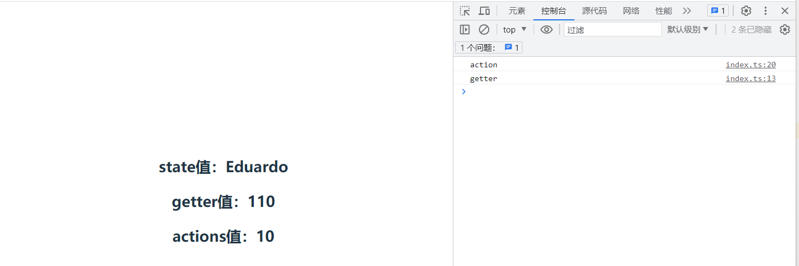

# 实现 mini-Pinia

> vuex 的基本原理参考：[手写 vuex 原理](https://juejin.cn/post/6855474001838342151)

## 一、Pinia 基础使用

### 1. vue3+vite 安装

```bash
npm create vite@latest 或 npm create vue3_pinia
```

根据提示输入项目名称创建脚手架，选择 Vue+Typescript，保证能够正确运行

### 2. pinia 安装与使用

```bash
npm install pinia
```

项目根目录按照上述方式安装 pinia

### 3. main.ts 注入 use

```js
import { createApp } from 'vue';
import './style.css';
import App from './App.vue';
//引入createPinia()
import { createPinia } from 'pinia';

const pinia = createPinia();
//注册pinia
app.use(pinia);
app.mount('#app');
```

### 4. 创建 Pinia 模块

常规操作时在 src 文件夹下创建一个 store 文件夹专门用来管理 pinia 模块，在这个文件夹下可以创建多个 js 和 ts 模块。


### 5. index.ts

```js
import { defineStore } from 'pinia';

export const useStore = defineStore('storeId', {
  state: () => {
    return {
      counter: 0,
      name: 'Eduardo',
      isAdmin: true,
    };
  },
  getters: {
    counterPar() {
      console.log('getter');
      return this.counter + 100;
    },
  },
  actions: {
    changeCounter(val) {
      console.log('action');
      return (this.counter += val);
    },
  },
});
```

### 6. 在组件中使用 pinia

```vue
<template>
  <div>
    <h2>state值：{{ name }}</h2>
    <h2>getter值：{{ store.counterPar }}</h2>
    <h2>actions值：{{ newStore }}</h2>
  </div>
</template>

<script setup>
  //引入store
  import { useStore } from '../store';
  //创建store对象
  const store = useStore();
  //结构name
  const name = store.name;
  //调用actions
  const newStore = store.changeCounter(10);
</script>
```

### 7. 最终显示



### 8. 需求总结

**1.pinia 可以解构操作的有两个数据（createPinia）（defineStore），都是函数**

```js
export function createPinia() {}

export function defineStore() {}
```

**2.createPinia 返回一个 pinia 对象**

```js
export function createPinia() {
  return pinia对象;
}
```

**3.defineStore 返回一个 useStore()函数**

```js
export function defineStore() {
  const userStore = () => {};
  return userStore;
}
```

**4.useStore 返回 store 存储数据对象**

```js
export function defineStore() {
  const userStore = () => {
    return store对象; //所有状态机的数据state函数返回，（副作用-getters和actions）
  };
  return userStore;
}
```

## 二、实现 createPinia

`createPinia`返回的是一个 pinia 对象，首先我们需要构造一个这样的对象并返回。

```js
export function createPinia() {
  const piniaStore = {};
  return piniaStore;
}
```

返回的 pinia 对象可以通过`app.use`进行注册，我们知道注册时实际执行的是对象内的 install 方法，因此还需要实现一个`install`函数。

在 vue2 中使用`Vue.use`注册插件时，大多会将额外需要的数据和方法挂载到组件实例中，如 vuex 或 vue-router 中实现的那样，先将其实例作为 options 在 Vue 实例化时作为参数传入，然后利用钩子函数和组件间的父子关系挂载到每个组件的实例上，如下所示：

```js
let install = function (Vue) {
  Vue.mixin({
    beforeCreate() {
      if (this.$options && this.$options.store) {
        // 如果是根组件
        this.$store = this.$options.store;
      } else {
        //如果是子组件
        this.$store = this.$parent && this.$parent.$store;
      }
    },
  });
};
```

而在 vue3 中因为不存在 vue 实例，所以需要新的全局挂载方式。全局化方法有两种写法：

- 注入注册操作`provide-inject`。这种方式可以让 vue3 的所有组件都通过使用`app.inject("key")`来访问到注入的 piniaStore。
- `config.globalProperties`。兼容 vue2 的组件实例共享模式

```js
export function createPinia() {
  const piniaStore = {
    install(app) {
      app.provide(piniaSymbol, piniaStore);
      app.config.globalProperties.$pinia = piniaStore;
    },
  };
  return piniaStore;
}
```

然后在 pinia 对象上新建一个 stores 对象来维护所有 defineStore 返回的函数创建的 store 对象。

```js
import { piniaSymbol } from './piniaSymbol'; // piniaSymbol = Symbol()

export function createPinia() {
  const piniaStore = {
    _stores: new Map(), //存放所有store对象的位置
    state: {}, //初始化一个state对象，后续会完成计算属性和对象的使用

    install(app) {
      app.provide(piniaSymbol, piniaStore);
      app.config.globalProperties.$pinia = piniaStore;
      console.log('createPinia正常运行'); // 方便观察
    },
  };

  return piniaStore;
}
```

`state` 是一个对象，保存的是所有 store 的状态数据。它的主要作用包括：

- **集中管理状态数据** ：将所有 store 的状态数据集中在一个地方，方便统一管理和调试。

- **响应式状态**：Vue 的响应式系统会自动追踪 `state` 对象的变化，使得应用在状态变化时能够自动更新视图。

- **快照和持久化**：因为所有的状态数据都集中在 `state` 对象里，所以可以很容易地实现状态的快照和恢复功能，也可以将整个状态对象持久化保存并在页面刷新时恢复。

为什么有了`_stores`还需要 state 对象？

- **分工明确**：`_stores` 用于管理 store 实例，`state` 用于管理状态数据。这样分工明确，各自处理不同的职责。
- **提高性能**：`_stores` 采用 `Map` 数据结构，查找速度快，适合存放大量 store 实例。`state` 是一个普通对象，更加直观且易于响应式管理。
- **解耦合**：`_stores` 和 `state` 分开存储有助于解耦逻辑，使得管理 store 实例和状态数据的逻辑彼此独立，减少相互影响。

## 三、实现 defineStore

### 1. 基本结构

`defineStore`返回一个函数，此函数执行会返回对应的 store 对象，习惯上我们会将此函数命名为`use{Name}Store`。

```js
export function defineStore() {
  //返回函数
  function useStore() {}
  return useStore; //用户使用这个函数就能获取 store实例对象
}
```

### 2. 参数情况

defineStore 接受三种传参方式

- 第一种是传入 id+options

  ```js
  export const useStore = defineStore('stroeId', {
    state: () => {
      return {
        name: 'jack chen',
        age: 40,
      };
    },
    actions: {
      increment(num) {
        console.log(this.age + num);
        return this.age + num;
      },
    },
    getters: {
      doubleAge: (state) => state.age * 2,
    },
  });
  ```

- 第二种是只传入 options（而 id 包含在这个 options 内部），options 是对象

  ```js
  export const useStore = defineStore({
    id: 'storeId',
    state: () => {
      return {
        name: 'alice',
        age: 30,
      };
    },
    actions: {
      increment(num) {
        console.log(this.age + num);
        return this.age + num;
      },
    },
    getters: {
      doubleAge: (state) => state.age * 2,
    },
  });
  ```

- 第三种是传入 id+setup 函数

  ```js
  export const useStore = defineStore('storedId', () => {
    const age = ref(21);
    const name = 'jack';
    function changeCounter(val) {
      age.value = val;
      return age.value;
    }
    const age10 = computed(() => {
      return age.value + 100;
    });

    return {
      age,
      name,
      changeCounter,
      age10,
    };
  });
  ```

首先需要根据传入参数的情况进行参数归一化，如下所示：

```js
import { computed, getCurrentInstance, inject, isReactive, reactive, isRef } from 'vue';
import { piniaSymbol } from './piniaSymbol';

export function defineStore(idOrOptions, optionsOrSetup) {
  //单独定义id和Options
  let id, options;
  //接受和处理第一个参数,id:string,options:object
  if (typeof idOrOptions == 'string') {
    id = idOrOptions;
    options = optionsOrSetup; //对象或函数
  } else {
    options = idOrOptions; //对象
    id = options.id;
  }

  function useStore() {
    //当前组件实例是否存在
    const instance = getCurrentInstance(); //获取当前组件实例
    let piniaStore = instance && inject(piniaSymbol); // 如果当前组件实例存在就注入整个piniaStore(因为只有在vue组件里才可以使用inject)
    if (!piniaStore._stores.has(id)) {
      //如果在piniastore的map中没有对应的id，则表示需要新建，如果已经存在则只需要返回数据
      //录入新的数据（state,actions,getters）包含的对象一起放入map中
      //id不存在则添加的是options数据
      if (typeof optionsOrSetup === 'function') {
        //传入进来的是一个函数
        //将对应的id里的options，放置到piniaStore
        createSetupStore(id, optionsOrSetup, piniaStore); //函数形式
      } else {
        //前两种传参方式都用这个来解构store
        //将对应的id里的options，放置到piniaStore
        createOptionsStore(id, options, piniaStore); //对象形式
      }
    }
    return piniaStore._stores.get(id); //获取目前use的这个store
  }
  return useStore;
}
```

### 3. createSetupStore

createSetupStore 的第四个参数表示此 store 是否通过 options 调用所创建。

```js
//处理函数式defineStore
function createSetupStore(id, setup, piniaStore, isOptionsStore) {
  //建立一个将来返回数据的响应式对象
  const store = reactive({});
  //执行setup函数，返回一个包含state,actions,getters的对象
  const setupStore = setup();

  //遍历一个store里所有的属性，做进一步处理
  for (let key in setupStore) {
    const prop = setupStore[key];
    // 1.处理actions
    // 改变函数的指向问题
    if (typeof prop == 'function') {
      setupStore[key] = wrapAction(prop);
    }
    // 2.处理state
    // 如果是setup函数，则把里面的state存到全局state中去
    // createOptionStore 直接在 pinia.state.value 中设置状态
    if ((isRef(prop) && !isComputed(prop)) || isReactive(prop)) {
      // 如果它是ref或者reactive则说明他是state
      // 由于computed也是ref，所以要排除计算属性
      if (!isOptionsStore) {
        piniaStore.state[key] = prop;
      }
    }
  }

  //判断计算属性，ref，同时也是一个effect
  function isComputed(v) {
    return isRef(v) && v.effect;
  }

  function wrapAction(action) {
    return function () {
      let ret = action.apply(store, arguments);
      return ret;
    };
  }

  Object.assign(store, setupStore);
  piniaStore._stores.set(id, store);
}
```

### 4. createOptionsStore

```js
// defineStore传入options时调用这个函数
function createOptionsStore(id, options, piniaStore) {
  const { state, actions, getters } = options; //解构当前的对象数据

  function setup() {
    // 专门处理store里的state,actions,getters
    piniaStore.state[id] = state ? state() : {}; //将解构出的state存入到全局state对象中
    const localState = piniaStore.state[id];

    return Object.assign(
      localState,
      actions,
      Object.keys(getters).reduce((computedGetters, name) => {
        computedGetters[name] = computed(() => {
          //获取当前store的指向
          let store = piniaStore._stores.get(id);
          return getters[name].call(store, store);
        });
        return computedGetters;
      }, {})
    );
  }
  createSetupStore(id, setup, piniaStore, true);
}
```
