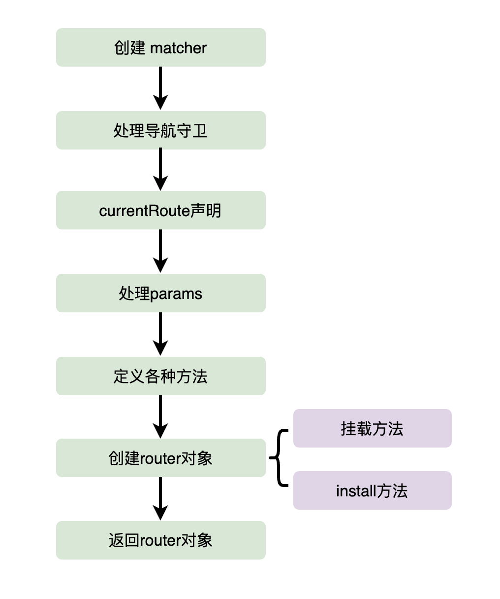
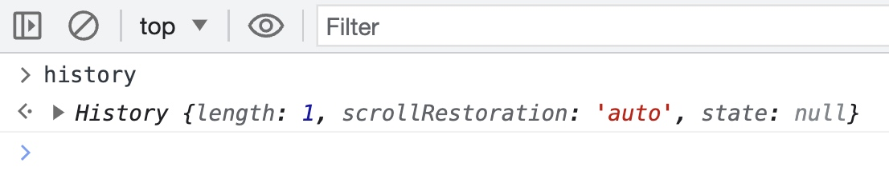
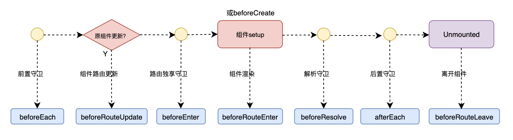

# 新版vue-Router原理解析

> 本文章内容vue-Router的版本为4.x，3.x的基本原理可以参考[vue-router原理解析](./vue-router.html)

## 一、createRouter结构解析

### 1. 准备工作

在开始之前，我们肯定是需要去看一下 vue-router 对应的源码，源码可以在 github 上面找到，地址如下：

https://github.com/vuejs/router

vue-router 整体项目采用的是 monorepo 的代码管理风格，使用 pnpm + workspace 的方式来搭建的 monorepo 项目，源码目录如下：

```
├── .github
├── .vscode
├── packages             // 项目分包
│   ├── docs             // vue router API文档
│   ├── playground       // 本地项目效果预览
│   └── router           // vue router源码
├── scripts              // 工程脚本
├── .gitignore
├── .npmrc               // 项目的配置文件
├── .prettierignore
├── .prettierrc
├── LICENSE
├── README.md
├── netlify.toml
├── package.json
├── pnpm-lock.yaml       // 依赖版本控制
└── pnpm-workspace.yaml  // 工作空间根目录
```

其中关于 router 的源码位于 packages/router/src，结构如下：

```
├── history
├── matcher
├── types
├── utils
├── RouterLink.ts
├── RouterView.ts
├── config.ts
├── devtools.ts
├── encoding.ts
├── errors.ts
├── global.d.ts
├── globalExtensions.ts
├── index.ts
├── injectionSymbols.ts
├── location.ts
├── navigationGuards.ts
├── query.ts
├── router.ts
├── scrollBehavior.ts
├── useApi.ts
└── warning.ts
```

作为一个项目的入口，我们自然会去 index.ts，这个 index.ts 整体比较简单，就是单纯的将其他文件的工具方法或者类型导出而已，其中就包含了非常重要的一个方法 `createRouter`：

```ts
export { createRouter } from './router'
```

接下来我们就可以顺藤摸瓜，到 router.ts 里面去查看 createRouter 的源码。

### 2. 整体结构分析

在分析 createRouter 方法之前，我们首先需要回忆一下，整个 createRouter 是如何使用的

```ts
import { createRouter } from "vue-router";
// 调用 createRouter 方法的时候，传入一个配置对象
const router = createRouter({
  history: createWebHistory(import.meta.env.BASE_URL),
  routes: [
    {
      path: '/',
      name: 'home',
      component: HomeView
    },
    {
      path: '/about',
      name: 'about',
      component: () => import('../views/AboutView.vue')
    }
  ]
})

export default router
```

- 关于传入 createRouter 方法的配置对象所支持的配置项可以参阅：[https://router.vuejs.org/zh/api/interfaces/RouterOptions.html](https://router.vuejs.org/zh/api/interfaces/RouterOptions.html) 
- 注意：该配置对象在官方中对应的类型 RouterOptions
- 返回值是一个对象，该对象对应的类型就是 Router，既然是对象，那么上面会有一些属性以及方法
  - 属性：currentRoute、listening、options
  - 方法：addRoute、getRoutes、push、repalce、go、beforeEach...

接下来我们会在项目中的 main.ts 中引入这个对象：

```ts
import router from "./router"

const app = createApp(App);
app.use(router) // 注册插件
```

接下来我们到 packages/router/src/router.ts 中，找到 createRouter 方法，该方法的整体结构如下：

```ts
export function createRouter(options: RouterOptions): Router {
    /*
     * 1. 各种变量的定义
     */
    const matcher = ...
    const parseQuery = ...
    const stringifyQuery = ...
    const routerHistory = ...
    
    /*
     * 2. 导航守卫
     */
    const beforeGuards = ...
    const beforeResolveGuards = ...
    const afterGuards = ...
    
    /*
     * 3. 当前路由初始化
     */
    const currentRoute = ...
    let pendingLocation: RouteLocation = ...
    
    /*
     * 4. params 相关处理
     */
    const normalizeParams = ...
    const encodeParams = ...
    const decodeParams = ...
    
    /*
     * 5. 各种方法的定义
     * 这些方法里面有供内部使用的方法，也有暴露出去给外部使用的方法
     */
    function addRoute( ... ) { ... }
    function removeRoute() { ... }
    function getRoutes() { ... }
    function hasRoute( ... ) { ... }
    function resolve( ... ) { ... }
    function locationAsObject( ... ) { ... }
    function checkCanceledNavigation( ... ) { ... }
    function push( ... ) { ... }
    function replace( ... ) { ... }
    function handleRedirectRecord( ... ) { ... }   
    function pushWithRedirect( ... ) { ... }
    function checkCanceledNavigationAndReject( ... ) { ... }
    function runWithContext( ... ) { ... }
    function navigate( ... ) { ... }
    function triggerAfterEach( ... ) { ... }
    function finalizeNavigation( ... ) { ... }
    function setupListeners( ... ) { ... }
    function triggerError( ... ) { ... }
    function isReady( ... ) { ... }
    function markAsReady( ... ) { ... }
    function handleScroll( ... ) { ... }
    
    
    /*
     * 6. 向外部返回的对象
     * 该对象会包含部分上面所定义的方法，必须要有一个 install 方法
     */
    const router: Router = {
      currentRoute,
      listening: true,
  
      addRoute,
      removeRoute,
      hasRoute,
      getRoutes,
      resolve,
      options,
  
      push,
      replace,
      go,
      back: () => go(-1),
      forward: () => go(1),
  
      beforeEach: beforeGuards.add,
      beforeResolve: beforeResolveGuards.add,
      afterEach: afterGuards.add,
  
      onError: errorListeners.add,
      isReady,
      
      install(){ ... }
    }
    
    return router;
}
```

通过上面的代码，我们能够将 `createRouter` 这个核心方法的整体结构搞清楚，内部声明了一些变量以及方法，最终会导出一个对象，该对象身上会包含一部分上面所声明的变量以及方法。

`createRouter` 整体工作流程如下图所示：




### 3. 创建 matcher

createRouter 方法内部的第一句代码就是创建 matcher

```ts
const matcher = createRouterMatcher(options.routes, options)
```

`createRouterMatcher` 方法位于 matcher 目录下面的 index.ts，我们首先看一下该方法的方法签名：

```ts
export function createRouterMatcher(
  // routes 是一个只读数组，里面存放的就是开发者所写的一条一条的路由记录
  // 每一条路由记录是一个对象 [{ path: '/',name: 'home', component: HomeView }, {...}]
  routes: Readonly<RouteRecordRaw[]>,
  // globalOptions 就是用户调用 createRouter 方法时传入的一整个配置对象 {history: ..., routes : [...]} 
  globalOptions: PathParserOptions
): RouterMatcher
```

接下来我们来看一下整个 `createRouterMathcer` 方法究竟在干什么？

下面是整个 `creatRouterMatcher` 方法的整体结构：

```ts
export function createRouterMatcher(routes, globalOptions) {
  /*
   * 做一些初始化工作
   */
  ...
  
  /*
   * 内部定义的方法
   */
  function getRecordMatcher( ... ) { ... }
  function addRoute( ... ) { ... }
  function removeRoute( ... ) { ... }
  function getRoutes( ... ) { ... }
  function insertMatcher( ... ) { ... }
  function resolve( ... ) { ... }
  
  /*
   * 遍历 routes 数组
   * 利用内部的 addRoute 方法来添加路由
   * 也就是，整个路由的初始化添加工作是在 createRouterMatcher 方法里面完成的
   */
  routes.forEach(route => addRoute(route))
 
  /*
   * 向外部返回一个对象，这也就是 createRouter 方法中的 matcher 对象    
   * 是一个包含了内部方法的对象   
   */                        
  return { addRoute, resolve, removeRoute, getRoutes, getRecordMatcher }
}
```

目前通过阅读 `createRouter` 以及 `createRouterMatcher` 方法，我们能够发现这是一种非常常见的模式。一个方法返回一个对象，这个对象里面会包含部分方法内部所定义的方法，这里其实就用到了闭包。

最终外部（ `createRouter` 调用的地方）会拿到这个对象：

```ts
const mathcer = { addRoute, resolve, removeRoute, getRoutes, getRecordMatcher }
```

我们可以看到，在 createRouter 内部同样定义了诸如 addRoute、removeRoute 以及 getRoutes 等方法，那么我们可以很自然的想到，这些方法的内部，肯定是调用了返回的 matcher 对象的同名方法。

### 4. 处理导航守卫

接下来有一段代码是处理导航守卫：

```ts
const beforeGuards = useCallbacks<NavigationGuardWithThis<undefined>>()
const beforeResolveGuards = useCallbacks<NavigationGuardWithThis<undefined>>()
const afterGuards = useCallbacks<NavigationHookAfter>()
```

这里我们首先回忆一下，导航守卫是如何使用的：

```ts
const router = createRouter({...})        
router.beforeEach((to, from, next)=>{ ... })
```

在源码中，挂在 router 对象的 beforeEach 方法对应如下：

```ts
beforeEach: beforeGuards.add,
```

也就是说，实际上在调用 beforeGuards 的 add 方法，而这个 beforeGuards 又是通过调用 `useCallbacks( )` 方法所得到的

useCallBack 方法位于 utils 目录下面的 callback.ts：

```ts
export function useCallbacks<T>() {
  // 这里声明了一个 handlers 的列表
  let handlers: T[] = []

  // 接收守卫回调函数
  function add(handler: T): () => void {
    // 放入到 handlers 列表里面
    handlers.push(handler)
    // 向外部返回一个方法，该方法的作用就是将添加到 handlers 列表里面对应的守卫回调删除掉
    return () => {
      const i = handlers.indexOf(handler)
      if (i > -1) handlers.splice(i, 1)
    }
  }

  // 清空 handlers 列表
  function reset() {
    handlers = []
  }

  // 向外部返回一个对象
  return {
    add,
    list: () => handlers.slice(),
    reset,
  }
}
```

接下来我们重点来关心一下 add 方法会返回的一个方法，这个方法是将添加进去的守卫回调删除，为什么这么做？实际上这个是我们 JS 中非常常见的一种模式

```ts
const callbacks = useCallbacks()
const remove = callbacks.add(()=>{console.log("hello")})
remove()
```

这种模式非常的常见，特别是在 JS 中处理事件监听器或者需要清晰资源的时候，你可以一次性的提供添加和取消操作，使代码更加便于管理。

### 5. currentRoute声明

```ts
const currentRoute = shallowRef<RouteLocationNormalizedLoaded>(START_LOCATION_NORMALIZED)
```

这个 `currentRoute` 最终是要暴露给外部使用的。

首先关于 START_LOCATION_NORMALIZED，这是 vue-router 里面的一个常量，对应的代码如下：

```ts
export const START_LOCATION_NORMALIZED: RouteLocationNormalizedLoaded = {
  path: '/',
  name: undefined,
  params: {},
  query: {},
  hash: '',
  fullPath: '/',
  matched: [],
  meta: {},
  redirectedFrom: undefined,
}
```

在这个常量里面，就对 path、name、params、query... 进行了一个初始化操作。

另外需要注意，这里首先 currentRoute 是一个响应式的变量，但是这里在创建这个响应式变量的时候，使用的是 shallowRef，而非 ref。

- ref：创建一个深度响应式的变量

```ts
const obj = ref({count: 0})
obj.value.count++ // 存在响应式的，依赖于 obj 的组件会重新渲染
```

- shallowRef：是创建一个不会进行深度转换的响应变量

```ts
const obj = shallowRef({count: 0})
obj.value.count++ // 这里不存在响应式，这里的变化不会导致组件重新渲染
obj.value = {count: 1} // 这样子才会触发响应式
```

因为 START_LOCATION_NORMALIZED 内部会存在一些深层次的嵌套，如果使用 ref 的话，那么这些深层次的嵌套也会变为响应式，但是这是没有必要的，所以这里使用 shallowRef会节约不必要的性能开销。

### 6. 处理 params

接下来是关于 params 的处理：

```ts
const normalizeParams = applyToParams.bind(null, paramValue => '' + paramValue)
const encodeParams = applyToParams.bind(null, encodeParam)
const decodeParams = applyToParams.bind(null, decode)
```

这里其实这三行是三个函数，分别负责：

- 标准化参数
- 编码参数
- 解码参数

这里三个函数都用到了 `applyToParams`，因此这里我们自然会去追 applyToParams 的源码，该方法的源码位于 utils/index.ts 里面：

```ts
export function applyToParams(
  // 函数
  fn: (v: string | number | null | undefined) => string,
  // 要处理的参数
  params: RouteParamsRaw | undefined
): RouteParams {
  
  // 初始化了一个新的参数对象
  const newParams: RouteParams = {}

  // 去遍历传递过来的参数
  for (const key in params) {
    // 拿到参数每一项的值
    const value = params[key]
    // 如果值为数组通过 map 遍历后用 fn 来处理
    // 如果不是数组，那么直接用 fn 来处理
    newParams[key] = isArray(value)
      ? value.map(fn)
      : fn(value as Exclude<RouteParamValueRaw, any[]>)
  }

  return newParams
}
```

那么通过阅读 `applyToParams` 源码，我们就知道上面的三个方法是干嘛的了。

举个例子：

```ts
// 假设这是我们的 params
const params = { id: '123', name: ['Alice', 'Bob'] }

// 通过 applyToParams 方法将所有的参数转为大写
const newParams = applyToParams((v)=>{v.toUpperCase()}, params)

console.log(params) // { id: '123', name: ['ALICE', 'BOB'] }
```

接下来我们来看一下上面的三个方法：

- **标准化参数**：负责将参数值转为字符串，假设有一个参数对象 `{id: 123}` ，通过 normalizeParams 方法处理之后就会变为 `{id: '123' }`
- **编码参数**：负责对参数里面的一些特殊字符（空格、制表符）进行编码
  - `{id: 'hello world'}` 通过 encodeParam 进行编码操作，最终得到的是 `{ id: 'hello%20world'}`
- **解码参数**：就是上面编码的逆操作

### 7. 定义各种方法

之后就是各种方法的定义了，这些方法有一些是内部方法，有一些是会随着 router 对象暴露出去给开发者使用的方法。

整体的方法比较多，后面涉及哪个再来分析哪个。

```ts
function addRoute( ... ) { ... }
function removeRoute() { ... }
function getRoutes() { ... }
function hasRoute( ... ) { ... }
function resolve( ... ) { ... }
function locationAsObject( ... ) { ... }
function checkCanceledNavigation( ... ) { ... }
function push( ... ) { ... }
function replace( ... ) { ... }
function handleRedirectRecord( ... ) { ... }   
function pushWithRedirect( ... ) { ... }
function checkCanceledNavigationAndReject( ... ) { ... }
function runWithContext( ... ) { ... }
function navigate( ... ) { ... }
function triggerAfterEach( ... ) { ... }
function finalizeNavigation( ... ) { ... }
function setupListeners( ... ) { ... }
function triggerError( ... ) { ... }
function isReady( ... ) { ... }
function markAsReady( ... ) { ... }
function handleScroll( ... ) { ... }
```

### 8. router对象

这个 router 对象，最终是要暴露给开发者使用的，里面有一堆方法，是在 `createRouter` 内部所定义的。

但是有一个方法例外，那就是 `install` 方法，该方法是属于 router 对象内部所定义的方法

```ts
const router: Router = {
      currentRoute,
      listening: true,
  
      addRoute,
      removeRoute,
      hasRoute,
      getRoutes,
      
      // ...
      
      install(){ ... }
}
```

根据 vue 官方的设计，如果要注册一个插件到 vue 应用里面，需要有这么一个 install 方法。

```ts
const app = createApp({...});
app.use(myPlugin, { ... })
```

编写插件：

```ts
const myPlugin = {
  install(app, options){
    // 一些配置
  }
}
```

有关 vue 应用中如何扩展插件，可以参阅：[https://cn.vuejs.org/guide/reusability/plugins.html#introduction](https://cn.vuejs.org/guide/reusability/plugins.html#introduction)

接下来我们就来看一下 router 内部的 install 方法的具体实现，install 方法的整体结构如下：

```ts
install(app: App) {
    const router = this
    app.component('RouterLink', RouterLink)
    app.component('RouterView', RouterView)

    app.config.globalProperties.$router = router
    Object.defineProperty(app.config.globalProperties, '$route', {
      enumerable: true,
      get: () => unref(currentRoute),
    })
   
    if (
      isBrowser &&
      !started &&
      currentRoute.value === START_LOCATION_NORMALIZED
    ) {
      started = true
      push(routerHistory.location).catch(err => {
        if (__DEV__) warn('Unexpected error when starting the router:', err)
      })
    }

    const reactiveRoute = {} as RouteLocationNormalizedLoaded
    for (const key in START_LOCATION_NORMALIZED) {
      Object.defineProperty(reactiveRoute, key, {
        get: () => currentRoute.value[key as keyof RouteLocationNormalized],
        enumerable: true,
      })
    }

    app.provide(routerKey, router)
    app.provide(routeLocationKey, shallowReactive(reactiveRoute))
    app.provide(routerViewLocationKey, currentRoute)

    const unmountApp = app.unmount
    installedApps.add(app)
    app.unmount = function () {
      installedApps.delete(app)
      if (installedApps.size < 1) {
        pendingLocation = START_LOCATION_NORMALIZED
        removeHistoryListener && removeHistoryListener()
        removeHistoryListener = null
        currentRoute.value = START_LOCATION_NORMALIZED
        started = false
        ready = false
      }
      unmountApp()
    }
},
```

接下来我们来一句一句进行解析：

```ts
const router = this
```

这里定义了一个变量 router，把 this 的值赋给它，注意 this 的指向，这里的 this 指向包含 install 方法的对象，也就是外部所定义的 router 对象。

```ts
app.component('RouterLink', RouterLink)
app.component('RouterView', RouterView)
```

这两句非常简单，就是在调用 app.component 方法来注册组件在整个应用里面。每一个组件有一个专门的 ts 文件所对应。代码如下：

```ts
import { RouterLink } from './RouterLink'
import { RouterView } from './RouterView'
```

```ts
app.config.globalProperties.$router = router
```

这一句其实就是将 router 对象赋值给 `$router`，回头在外部就可以通过 `this.$router` 获取到整个 router 对象

```ts
Object.defineProperty(app.config.globalProperties, '$route', {
  enumerable: true,
  get: () => unref(currentRoute),
})
```

为 `app.config.globalProperties` 这个对象添加了一个新的属性叫做 `$route`，外部就可以通过 `this.$route` 获取当前的路由位置

当外部获取的时候，内部会触发一个 getter，返回 `currentRoute` 对应的值。

需要注意，这里使用到了 unref，vue3 里面提供了一个名为 unref 的辅助函数，该辅助函数用于处理可能是 ref 的值。

- 如果你的参数是一个响应式的值（ref），则返回对应的值
- 如果你的参数不是一个 ref，那么则返回原本的参数

```ts
if (
  isBrowser &&
  !started &&
  currentRoute.value === START_LOCATION_NORMALIZED
) {
  // 这里整个 if 其实就是在判断应用是否是第一次启动
  // 如果是第一次启动，那么将 started 修改为 true，下一次就不会进来了
  // 也就是说，这段代码只会在第一次初始化的时候执行
  started = true
  // 将 routerHistory.location 进行一个 push 操作
  // 至于 routerHistory.location 是什么？push 又是如何操作的？
  // 后面再来追
  push(routerHistory.location).catch(err => {
    if (__DEV__) warn('Unexpected error when starting the router:', err)
  })
}
```

这里解释一下为什么要做这么一个判断？

在大多数情况下，我们的单页应用就只有一个 vue-router 实例，但是在一些特殊情况下，我们可能一个页面里面有多个 vue 应用，每个 vue 应用对应一个 vue-router

```html
<div id="app1"></div>
<div id="app2"></div>
```

既然有多个 vue 应用，那么不同的 vue 应用可以都挂载 vue-router 实例：

```ts
import { createApp } from 'vue';
import { createRouter, createWebHistory } from 'vue-router';

const router = createRouter({
  history: createWebHistory(),
  routes: [
    // routes...
  ],
});

const app1 = createApp(App1);
app1.use(router);
app1.mount('#app1');

const app2 = createApp(App2);
app2.use(router);
app2.mount('#app2');
```

虽然挂载 vue-router 挂了多次，但是 `push(routerHistory.location)` 这个操作只会在第一次挂载 vue-router 对象的时候执行，因此需要这么一个判断的代码，判断其是否是第一次启动应用。

```ts
const reactiveRoute = {} as RouteLocationNormalizedLoaded
for (const key in START_LOCATION_NORMALIZED) {
  Object.defineProperty(reactiveRoute, key, {
    get: () => currentRoute.value[key as keyof RouteLocationNormalized],
    enumerable: true,
  })
}
```

这边首先创建了一个对象，注意这个对象的类型为 `RouteLocationNormalizedLoaded` 这个类型，这里和 START_LOCATION_NORMALIZED 这个常量的类型是一致的。

下面的 for 循环就是在遍历 START_LOCATION_NORMALIZED 这个常量对象，取出来每一个值赋值给 reactiveRoute 对象，但是这里不是简单的赋值，而是将每个值变为了一个 getter 返回的值，getter 所返回的值又和 currentRoute 进行了关联。简单来讲，就是 currentRoute 对应的值发生改变的话，那么这个 reactiveRoute 也会发生改变。

举个例子：

```ts
// 假设 currentRoute 对应了如下的值
let currentRoute = ref({
  path: '/user/123',
  name: 'user',
  params: { id: '123' },
});

// 接下来执行了源码中对应部分的代码：
const reactiveRoute = {} as RouteLocationNormalizedLoaded
for (const key in START_LOCATION_NORMALIZED) {
  Object.defineProperty(reactiveRoute, key, {
    get: () => currentRoute.value[key as keyof RouteLocationNormalized],
    enumerable: true,
  })
}

// 之后修改 currentRoute，reactiveRoute 也会发生改变
currentRoute.value = {
  path: '/user/123/profile',
  name: 'user',
  params: { id: '123' },
}
console.log(reactiveRoute.path) // '/user/123/profile'
```

```ts
app.provide(routerKey, router)
app.provide(routeLocationKey, shallowReactive(reactiveRoute))
app.provide(routerViewLocationKey, currentRoute)
```

这三行代码是使用到了 vue 里面的依赖注入功能，这里针对路由对象、响应式的路由值、当前路由进行注册，回头在子组件中就可以通过 inject 来访问这些注册的值。举个例子：

```ts
// router/index.ts
const router = createRouter({ ... })
export default router
// main.ts
import router from "router"
const app = createApp({
   setup(){
     // 这里就是在使用 provide 来注册整个 router 对象
  	 provide('router', router)
   }                        
})
```

注册之后，可以在其他文件或者组件里面通过 inject 很轻松的拿到这个 router 对象， 从而避免了层层传递值。

```ts
import {inject} from "vue";
export default {
  setup(){
    // 通过 inject 拿到所注入的 router 对象
    const router = inject('router')
  }
}
```

实际上在源码的 `useApi.ts` 里面，提供了 `useRouter` 以及 `useRoute` 这两个方法：

```ts
export function useRouter(): Router {
  return inject(routerKey)!
}

export function useRoute(): RouteLocationNormalizedLoaded {
  return inject(routeLocationKey)!
}
```

注意后面的 ！是属于 ts 里面的语法，表示一个东西一定存在，类似于断言。

```ts
const unmountApp = app.unmount
installedApps.add(app)
app.unmount = function () {
  installedApps.delete(app)
  if (installedApps.size < 1) {
    pendingLocation = START_LOCATION_NORMALIZED
    removeHistoryListener && removeHistoryListener()
    removeHistoryListener = null
    currentRoute.value = START_LOCATION_NORMALIZED
    started = false
    ready = false
  }
  unmountApp()
}
```

这里重写了 vue 的 unmount 卸载方法，首先将 vue 原本的 unmount 卸载方法存储到 unmountApp 里面（后面要使用，所以这里暂时存一份），然后 app.unmount = function(){ ... } 这一块代码就是在重写 unmount 方法了，也就是说，当 vue 应用进行卸载的时候，会先执行重写的方法，但是 vue 卸载的时候，本身的卸载方法也是需要执行的，所以最后有一句 unmountApp( ) 表示执行原本 vue 应用的卸载方法。

## 二、history 基础知识

history 是浏览器环境中所支持的一个对象，该对象用于管理当前创建最近访问过的 URL 历史记录，所有的 URL 会被存储在一个名为 histroy 的对象里面，回头就可以通过 JS 脚本调用 history 对象的方法从而控制浏览器前进或者后退。

例如打开浏览器，新创建一个标签页会话，然后在控制台输入 history，那么就能够看到这个对象



- length：表示历史记录堆栈中 URL 的数量，这包括了当前页面以及之前访问过的页面的记录。需要注意，这个属性是一个只读属性，不能够通过代码去修改的。
- scrollRestoration：对应的值有两个
  - auto：默认值，回到上一个历史记录的时候，浏览器会尝试自动滚动到上一次所滚动的地方
  - manual：需要开发者自己来处理这个滚动恢复

- state：这个属性表示当前历史记录条目的 state 状态对象，这个状态对象的值可以由 pushState 或者 replaceState 来创建，如果没有通过这两个方法进行创建的话，那么默认值为 null

之所以要复习这个 history 对象，是因为我们的单页应用主要就是和这个 history 对象打交道。

所谓单页应用，本质上只有一张 html 页面，要做到视图的变化，就需要需要前端路由去映射不同的模块。

目前比较流行的单页方式有两种：

- hash 模式
- html5 模式

### 1. hash模式

hash 模式的原理在于一个 URL 的 hash 部分的变化，不会引起和服务器之间的交互，那么我们就可以让 hash 部分的值和视图模块相对应：

```
example.com/#/index  // 首页视图
example.com/#/list   // 列表视图
```

hash 值的改变不会导致向服务器发送请求，但是 history 列表是会发生改变，那么用户就可以通过浏览器的前进和后退去控制视图的变化，开发者也可以通过 history 提供的相关方法 forward、back、go 来进行不同视图之间的跳转。

hash 改变之后，会触发 `hashchange` 的事件，所以我们一般会去监听这个事件，从而根据 hash 值的变化来进行视图的切换：

```js
window.addEventListener('hashchange', function() {
  // 获取新的哈希值
  const hash = window.location.hash;

  // 根据新的哈希值来更新页面内容
  switch (hash) {
    case '#/page1':
      // 加载 page1 的内容
      break;
    case '#/page2':
      // 加载 page2 的内容
      break;
    // 更多的情况...
  }
});
```

### 2. html5模式

html5模式用到 history 相关的 API 来通过另外一种方式实现这个单页应用：

`pushState`：用于在浏览器堆栈里面添加一个新的状态，这个方法接收 3 个参数

```js
history.pushState(state, title, url)
```

- state：要推入的状态对象，一般要求这个对象就是一个纯粹的数据对象（能够被 JSON.stringify 转为字符串的对象）
- title：新页面的标题，一般浏览器都会忽略这个参数，所以一般传递一个空字符串或者 null 即可
- url：新的历史记录的 url

例如，我们在控制台输入如下的代码：

```bash
history.pushState({page:'page1'}, '', '/page1')
```

假设浏览器的 url 原本是 www.test.com 的话，那么执行了上面的代码之后，就会变化 www.test.com/page1 ，并且不会和服务器之间进行通信，但是 history 堆栈会发生响应的变化，这就为我们通过这种方式来实现单页应用创建了良好的条件。

`replaceState`：该方法和 pushState 方法是类似的，但是不会推入新的状态，而是替换。

```js
history.repalceState({page:'page1'}, '', '/page1')
```

`popState`：当浏览器页面进行前进后退的时候，会触发 popState 事件，你可以监听这个事件，然后从事件对象中获取之前传递给 pushState 或者 repalceState 的 state 状态对象。

```js
window.addEventListener('popstate', function(event) {
  console.log('state: ', event.state);
});
```

下面我们来举一个例子，下面是基于 html5 history api 所实现的一个简单单页应用：

```html
<div id="app">
  <h1>My Single Page App</h1>
  <div>
    <a href="/" onclick="navigate(event, '/')">Home</a> |
    <a href="/about" onclick="navigate(event, '/about')">About</a>
  </div>
  <div id="content"></div>
</div>
```

```js
// 渲染函数
function render(state) {
  const content = document.getElementById('content');

  switch(state) {
    case '/':
      content.innerHTML = '<h2>Welcome to Home Page</h2>';
      break;
    case '/about':
      content.innerHTML = '<h2>About Page</h2>';
      break;
    default:
      content.innerHTML = '<h2>Page Not Found</h2>';
  }
}

// 导航函数：保证用户点击页面中的 a 标签的时候，能够进行正常跳转
function navigate(e, route) {
  e.preventDefault(); // 阻止默认事件
  history.pushState(route, '', route); // 推入新的状态
  render(route); // 渲染对应的视图
}

// 监听 popstate 事件
// 保证用户点击浏览器本身的前进后退按钮的时候，视图能够进行切换
window.addEventListener('popstate', function(e) {
  render(e.state);
});

// 初始化
document.addEventListener('DOMContentLoaded', function() {
  const url = window.location.pathname;
  history.replaceState(url, '', url);
  render(url);
});
```

html5 模式相比 hash 模式，外观上更加的简洁美观，没有 # 号了，但是也有一个缺点，就是当你刷新页面的时候，会发现服务器会返回 404，原因很简单，例如前面我们所举的例子，URL 变为了 www.test.com/page1 ，刷新的时候会将整个这个 URL 提交给服务器，但是服务器后端无法找到对应的资源，所以会报错。

为了解决这个问题，就需要我们在服务器上面做一些配置，使得针对所有的路由请求，服务器都返回一份相同的 html 文件（通常就是 index.html），因此对于这个 URL  www.test.com/page1 ，哪怕服务器找不到，也给你返回 index.html，之后再使用前端路由来接管渲染相应的内容。

具体的配置方法取决于你的服务器软件。

例如你使用的 express.js，那么你可以添加如下的配置：

```js
app.get('*', function (request, response){
  response.sendFile(path.resolve(__dirname, 'public', 'index.html'))
})
```

如果你使用的是 nginx，那么你需要添加如下的配置：

```js
location / {
  try_files $uri /index.html;
}
```

### 3. location 对象

 location 对象也是浏览器环境中的一个原生对象，通过这个对象可以获取到和 location 相关的众多信息。

例如：

- *hash*：如果 *URL* 中包含有 #，该方法将返回该符号之后的内容。
  例如：*http://www.example.com/index.html#welcome* 的 *hash* 是 #welcome。

- *host*：服务器的名字，例如 *www.example.com* 。

- *hostname*：通常等于 *host*，有时会省略前面的 *www*。

- *href*：当前页面载入的完整 *URL*。

- *pathname*：*URL* 中主机名之后的部分。
  例如：*http://www.example.com/html/js/jsbasic/2010/0319/88.html* 的 *pathname* 是 */html/js/jsbasic/2010/0319/88.html*。

- *port*：*URL* 中声明的请求端口。默认情况下，大多数 *URL* 没有端口信息（默认为 *80* 端口），所以该属性通常是空白的。
  例如 *http://www.example.com:8080/index.html* 这样的 *URL* 的 *port* 属性为 '*8080*'。

- *protocol*：*URL* 中使用的协议，即双斜杠 // 之前的部分。
  例如 *http://www.example.com* 中的 *protocol* 属性等于 'http:'，*ftp://www.example.com* 的 *protocol* 属性等于'ftp:'。

- *search*：执行 *GET* 请求的 *URL* 中的问号 ? 后的部分，又称查询字符串。
  例如 *http://www.example.com/search.html?tern=sunchis* 中 *search* 属性为 *?term=sunchis*。

除了上面的属性以外，该对象还支持一些方法：

- assign 方法：载入一个新的文档
- reload方法：重新载入当前文档
- replace 方法：用新的文档替换当前文档

不过对于开发单页应用来讲，上面的方法一般不会用到，因为单页应用的特点就是一个页面，没有刷新的，也就是说至此至终都是一个文档，不会载入新的文档。

## 三、createWebHistory结构拆解

首先我们还是来回忆一下 `createWebHistory` 方法是如何使用的。

```ts
const router = createRouter({
  history: createWebHistroy(import.meta.env.BASE_URL)
})
```

整个 `createWebHistroy(import.meta.env.BASE_URL)` 方法调用之后，返回的是一个对象，然后把这个对象作为传入到 createRouter 里面的配置对象的 history 对应的键值。

`createWebHistroy` 方法所对应的源码位于 history/html5.ts 文件里面。

### 1. 整体结构分析

整体方法的结构如下：

```ts
export function createWebHistory(base?: string): RouterHistory {
  // 1. 针对 base 做一个标准化操作
  // 前加/，后去掉/
  base = normalizeBase(base)

  // 2. 创建导航对象
  // {
  //   location: currentLocation,
  //   state: historyState,
  //   push,
  //   replace
  // }
  const historyNavigation = useHistoryStateNavigation(base)
  
  // 3. 创建监听对象
  const historyListeners = useHistoryListeners(
    base,
    historyNavigation.state,
    historyNavigation.location,
    historyNavigation.replace
  )
  function go(delta: number, triggerListeners = true) {
    if (!triggerListeners) historyListeners.pauseListeners()
    history.go(delta)
  }

  // 4. 将上面的对象合并到 routerHistory 的对象里面
  const routerHistory: RouterHistory = assign(
    {
      // it's overridden right after
      location: '',
      base,
      go,
      createHref: createHref.bind(null, base),
    },

    historyNavigation,
    historyListeners
  )

  // 5. 为 routerHistory 添加 location 和 state 属性
  Object.defineProperty(routerHistory, 'location', {
    enumerable: true,
    get: () => historyNavigation.location.value,
  })
  Object.defineProperty(routerHistory, 'state', {
    enumerable: true,
    get: () => historyNavigation.state.value,
  })

  // 6. 返回 routerHistory
  return routerHistory
}
```

首先该方法接收一个可选的 base 参数，在上面的示例中，我们传入的是 `import.meta.env.BASE_URL`

- `import.meta`：表示 JS 的元素行，它包含了和当前 JS 模块相关的元数据。在 vite 项目中，`import.meta.env` 用于访问项目的环境变量
- `BASE_URL`：这是一个非常常见的环境变量，它通常用于表示一个应用程序的基础 URL。

例如你将整个应用部署到 /app/ 目录下面，那么你就可以将 BASE_URL 设置为 /app/，之后当你创建一个 /home 的路由的时候，那么这个路由的完整路径就会被映射为 /app/home。

关于这个 BASE_URL 默认是可以在 vite.config.ts 里面进行配置的，如果你没有配置，那么默认会是 /

可以参考 vite 官方文档：[https://cn.vitejs.dev/config/shared-options.html#base](https://cn.vitejs.dev/config/shared-options.html#base)

### 2. 标准化base

```ts
base = normalizeBase(base)
```

`normalizeBase` 方法究竟在做什么：

```ts
export function normalizeBase(base?: string): string {
  // 判断是否传入了 base
  // 如果没有传递，给一个初始值 /
  // 另外还对浏览器环境下的 base 标签进行了判断
  if (!base) {
    if (isBrowser) {
      // respect <base> tag
      const baseEl = document.querySelector('base')
      base = (baseEl && baseEl.getAttribute('href')) || '/'
      // strip full URL origin
      base = base.replace(/^\w+:\/\/[^\/]+/, '')
    } else {
      base = '/'
    }
  }
  // 也就是说，经历上面的 if，base 一定是有值的

  // 如果 base 的第一个字符不为 / 或者 # 
  // 那么就手动的添加一个 /
  // 例如，传入的 base 为 app/，经过下面这行代码处理之后，就会变为 /app/
  if (base[0] !== '/' && base[0] !== '#') base = '/' + base

  // 又使用 removeTrailingSlash 方法对 base 做了某种处理
  // 然后返回处理值
  // /app/ --> removeTrailingSlash(base) --> /app
  return removeTrailingSlash(base)
}
```

`removeTrailingSlash` 方法对应的源码如下：

```ts
const TRAILING_SLASH_RE = /\/$/
export const removeTrailingSlash = (path: string) =>
  path.replace(TRAILING_SLASH_RE, '')
```

至此，我们就将 `normalizeBase` 方法搞清楚了，就是对传入的 base 做一个标准化的初始操作，不管你传入的是什么牛鬼蛇神，这边都进行一个统一处理，拿到一个相对比较统一的值。

### 3. 后续操作

```ts
const historyNavigation = useHistoryStateNavigation(base)
const historyListeners = useHistoryListeners(
  base,
  historyNavigation.state,
  historyNavigation.location,
  historyNavigation.replace
)
```

上面的代码分别调用了 `useHistoryStateNavigation` 和 `useHistoryListeners` 方法，这个可以说是整个 createWebHistory 方法的核心，这两个方法分别会返回一个对象，也就是说 `historyNavigation` 和 `historyListeners` 是两个对象，这两个对象分别会被合并到 `routerHistory` 对象里面：

```ts
const routerHistory: RouterHistory = assign(
  {
    // 覆盖右边对象的部分属性
    location: '',
    base,
    go,
    createHref: createHref.bind(null, base),
  },

  historyNavigation,
  historyListeners
)
```

合并后最终导出的就是这个 routerHistory 对象：

```ts
return routerHistory
```

关于 `useHistoryStateNavigation` 和 `useHistoryListeners` 方法具体做了什么，我们放在后面来解析，这里先放一放。

注意上面在进行对象合并的时候，第一个对象里面有一个 go 方法，对应的源码如下：

```ts
function go(delta: number, triggerListeners = true) {
  if (!triggerListeners) historyListeners.pauseListeners()
  history.go(delta)
}
```

上面的源码，第一句 if 我们可以先放一放，我们看第二句，我们发现第二句其实就是在调用原生的 history 对应的 go 方法，然后把 delta 传进去。并且这个方法会被合并到 routerHistory 上面随着 routerHistory 暴露出去。

我们回忆一下，createRouter 所创建的 router 对象就有 go 方法

```ts
const go = (delta: number) => routerHistory.go(delta)
const router: Router = {
  // ...
  go,
  back: () => go(-1),
  forward: () => go(1),
  // ...
}
```

```ts
Object.defineProperty(routerHistory, 'location', {
  enumerable: true,
  get: () => historyNavigation.location.value,
})

Object.defineProperty(routerHistory, 'state', {
  enumerable: true,
  get: () => historyNavigation.state.value,
})
```

最后仍然是给要暴露出去的 routerHistory 添加属性，这里添加了两个属性：

- location：对应的值为 historyNavigation.location.value
- state：对应的值我哦 historyNavigation.state.value

## 四、useHistoryStateNavigation结构解析

### 1. 整体结构

该方法的整体结构如下：

```ts
function useHistoryStateNavigation(base: string) {
  // 从原生的 window 对象里面解构出 history 和 location
  const { history, location } = window

  // 两个私有的变量，之后会随着返回的对象暴露给外部
  // 这里实际上也是用到了闭包
  const currentLocation: ValueContainer<HistoryLocation> = {value: createCurrentLocation(base, location),} // 创建一个舍去base的url的字符串
  const historyState: ValueContainer<StateEntry> = { value: history.state }
 
  // 看你是否是第一次进入页面，如果是第一次，那么此时是没有任何状态的
  // 那么我们就维护一个初始化的状态
  if (!historyState.value) {
    // ...
  }

  // 内部方法，供内部使用
  function changeLocation() {
    // ...
  }

  // 暴露给外部的方法
  function replace(to: HistoryLocation, data?: HistoryState) {
    // ...
  }

  // 暴露给外部的方法
  function push(to: HistoryLocation, data?: HistoryState) {
    // ...
  }

  return {
    location: currentLocation,
    state: historyState,

    push,
    replace,
  }
}
```

该方法会为我们返回一个对象，该对象主要是负责路由的历史状态和当前位置的管理，这个方法接收一个 base 作为参数，返回的对象会包含 state、location、push 和 repalce 这么几个成员。

### 2. 代码拆解

接下来我们进入到代码拆解环节

```ts
const currentLocation: ValueContainer<HistoryLocation> = {value: createCurrentLocation(base, location),}
```

`currentLocation` 最终对应的值为一个对象 `{ value: xxx }` ，xxx 这个值来源于 `createCurrentLocation(base, location)`，接下来我们就会去看这个方法的源码：

```ts
// 接收两个参数
// 1. base
// 2. location 注意这个 location 是原生的 location 对象
function createCurrentLocation(
  base: string,
  location: Location
): HistoryLocation {
  // 从原生locaton 对象里面解构出来一些值
  // 假设我们的完整的 url 为 https://example.com/home/page?query=searchterm#section1
  // pathname ---> /home/page
  // search ---> ?query=searchterm
  // hash ---> #section1
  const { pathname, search, hash } = location
  
  // 整个这一段是在查看 base 里面是否有 #
  // 如果有，那么会进入到 if 里面进行单独的处理
  const hashPos = base.indexOf('#')
  if (hashPos > -1) {
    let slicePos = hash.includes(base.slice(hashPos))
      ? base.slice(hashPos).length
      : 1
    let pathFromHash = hash.slice(slicePos)
    // prepend the starting slash to hash so the url starts with /#
    if (pathFromHash[0] !== '/') pathFromHash = '/' + pathFromHash
    return stripBase(pathFromHash, '')
  }
  const path = stripBase(pathname, base)
  return path + search + hash
}
```

为了简化代码，我们先忽略 if，那么这段代码就变为了：

```ts
// 接收两个参数
// 1. base
// 2. location 注意这个 location 是原生的 location 对象
function createCurrentLocation(base: string,location: Location): HistoryLocation {
  // 从原生locaton 对象里面解构出来一些值
  // 假设我们的完整的 url 为 https://example.com/home/page?query=searchterm#section1
  // pathname ---> /home/page
  // search ---> ?query=searchterm
  // hash ---> #section1
  const { pathname, search, hash } = location
  const path = stripBase(pathname, base)
  return path + search + hash
}
```

接下来调用了 stripBase 对 pathname 进行一个处理，返回 `path + search + hash` 的拼接，返回的值是一个字符串类型，而这里标注的是 HistoryLocation，这个 HistoryLocation 其实就是 string 的一个别名

```ts
export type HistoryLocation = string
```

关键点就来到 stripBase，看一下这个方法做了什么：

```ts
export function stripBase(pathname: string, base: string): string {
  // no base or base is not found at the beginning
  if (!base || !pathname.toLowerCase().startsWith(base.toLowerCase()))
    return pathname
  return pathname.slice(base.length) || '/'
}
```

该方法主要负责从一个路径中移除 base 部分的字符串，例如：

```ts
const base = "/app";
const pathname = "/app/home"
const path = stripBase(pathname, base);
console.log(path); // /home
```

上面的 stripBase 方法搞清楚后，那么 `createCurrentLocation` 这个方法也就清晰，假设 base 为 / ，location 对应的 url 假设为   https://example.com/home/page?query=searchterm#section1 那么最终通过 createCurrentLocation 处理，得到的结果如下：

```ts
const result = createCurrentLocation("/", {
  pathname: "/home/page",
  search: "?query=searchterm",
  hash: "#section1",
});
console.log(result); // home/page?query=searchterm#section1
```

假设 base 为 /home，location 对应的 url 不变，那么最终通过 createCurrentLocation 处理，得到的结果如下：

```ts
const result = createCurrentLocation("/home", {
  pathname: "/home/page",
  search: "?query=searchterm",
  hash: "#section1",
});
console.log(result); // /page?query=searchterm#section1
```

因此，我们可以很清晰的知道这个 createCurrentLocation 是在干嘛了，就是创建一个 url 的字符串，但是这个 url 字符串是去除了 base 部分。

至于 if 里面的逻辑，主要是检查 base 里面是否有 #， 如果有 # ， 那么需要单独处理，例如：

```ts
// 当你的 base 里面还有 # 的时候
// 那么从 location 里面解构出来的 hash 部分的值是有问题
// 真正 hash 部分的值应该为 #section1，但是得到的却是 #/home/page#section1
// 所以需要把这一块进行一个处理
// 经过 if 里面的处理，最终得到的字符串为 /page#section1
const result = createCurrentLocation("#/home", {
  hash: "#/home/page#section1",
});
console.log(result); // /page#section1
```

最后，我们来总结一下 `createCurrentLocation` 调用的时候， ==传入 base 和 url 对应的 location，返回一个字符串，这个字符串始终是去除了 base 部分的。==

```ts
const historyState: ValueContainer<StateEntry> = { value: history.state }
```

这句代码表示从原生 history 对象上面去拿 state 状态对象。这里我们可以稍微研究一下类型的值。

```ts
// ValueContainer 就是一个泛型对象，T 是什么类型取决于你传入的值
export type ValueContainer<T> = { value: T }
```

```ts
// StateEntry
interface StateEntry extends HistoryState {
  back: HistoryLocation | null
  current: HistoryLocation
  forward: HistoryLocation | null
  position: number
  replaced: boolean
  scroll: _ScrollPositionNormalized | null | false
}
```

```ts
// HistoryState
export interface HistoryState {
  [x: number]: HistoryStateValue
  [x: string]: HistoryStateValue
}
```

```ts
// HistoryStateValue
export type HistoryStateValue =
  | string
  | number
  | boolean
  | null
  | undefined
  | HistoryState
  | HistoryStateArray
// HistoryStateArray
export interface HistoryStateArray extends Array<HistoryStateValue> {}
```

```ts
// 判断你是否是首次渲染，因为第一次是没有 historyState 状态对象的
if (!historyState.value) {
    changeLocation(
      currentLocation.value,
      {
        back: null,
        current: currentLocation.value,
        forward: null,
        // the length is off by one, we need to decrease it
        position: history.length - 1,
        replaced: true,
        // don't add a scroll as the user may have an anchor, and we want
        // scrollBehavior to be triggered without a saved position
        scroll: null,
      },
      true
    )
}
// 内部方法
function changeLocation(to: HistoryLocation,state: StateEntry,replace: boolean): void {
	// ...   
}
```

if 主要是判断是否是首次刷新，如果 historyState.value 值为 null，那么说明是第一次，那么就会调用 `changeLocation` 方法。

`changeLocation` 方法接收三个参数：

- to：第一个参数刚才所得到的不包含 base 的 url 后面的字符串
- state：第二个参数是一个对象，这个对象的类型为 stateEntry
- repalce：表示是否是替换模式，这里默认传递了 true，表示使用替换模式

接下来我们就需要看一下 `changeLocation` 内部在做什么：

```ts
function changeLocation(
  to: HistoryLocation,
  state: StateEntry,
  replace: boolean
): void {
  // 判断 base 里面是否包含 # 号
  const hashIndex = base.indexOf('#')
  // 拼接 url，所拼接的这个 url 回头会作为 pushState 或者 repalceState 方法的第三个参数传入
  const url =
    hashIndex > -1
      ? (location.host && document.querySelector('base')
          ? base
          : base.slice(hashIndex)) + to
      : createBaseLocation() + base + to
  try {
    // 根据 replace 是 true 还是 false
    // 来决定调用 replaceState 还是 pushState
    // 不管调用哪个，浏览器搜索栏的 url 都会发生变化
    history[replace ? 'replaceState' : 'pushState'](state, '', url)
    // 将 state 状态对象的值赋值给 historyState.value，从而进行一个初始化
    historyState.value = state
  } catch (err) {
    if (__DEV__) {
      warn('Error with push/replace State', err)
    } else {
      console.error(err)
    }
    // Force the navigation, this also resets the call count
    location[replace ? 'replace' : 'assign'](url)
  }
}
```

至此，整个 changeLocation 方法所做的事情，就非常清晰了，该方法就是根据传入的 to（url 字符串，不包含 base 部分），以及 state 状态值，来 ==调用原生 history 对象的 pushState 或者 repalceState 方法来修改 location== ，执行该行代码后，页面搜索栏的 url 就会发生变化，并且这一次变化是会被记录到 history 堆栈里面的。

最后还剩下两个方法，repalce 以及 push，这两个方法是会随着返回的对象暴露出去的。

首先我们来看 repalce 方法，对应源码如下：

```ts
function replace(to: HistoryLocation, data?: HistoryState) {
  // 创建了一个状态对象
  const state: StateEntry = assign(
    {},
    history.state,
    buildState(
      historyState.value.back,
      // keep back and forward entries but override current position
      to,
      historyState.value.forward,
      true
    ),
    data,
    { position: historyState.value.position }
  )

  // 调用上面写好的 changeLocation 去改变 location
  changeLocation(to, state, true)
  // 更新新的 currentLocation 对应的值
  currentLocation.value = to
}
```

这里调用了一个 `buildState` 方法：

```ts
function buildState(
  back: HistoryLocation | null,
  current: HistoryLocation,
  forward: HistoryLocation | null,
  replaced: boolean = false,
  computeScroll: boolean = false
): StateEntry {
  return {
    back,
    current,
    forward,
    replaced,
    position: window.history.length,
    scroll: computeScroll ? computeScrollPosition() : null,
  }
}
```

这个 buildState 方法就是根据传入的参数，返回一个标准的 StateEntry 的状态对象

下面是 push 方法相关的源码：

```ts
function push(to: HistoryLocation, data?: HistoryState) {
	// 创建一个状态对象
  const currentState = assign(
    {},
    historyState.value,
    history.state as Partial<StateEntry> | null,
    {
      forward: to,
      scroll: computeScrollPosition(),
    }
  )

  // 通过刚才创建的状态对象调用 changeLocation 来修改 location
  changeLocation(currentState.current, currentState, true)

  // 由创建一个状态对象
  const state: StateEntry = assign(
    {},
    buildState(currentLocation.value, to, null),
    { position: currentState.position + 1 },
    data
  )

  // 再次调用 changeLocation 方法来修改 location
  changeLocation(to, state, false)
  // 更新新的 currentLocation 对应的值
  currentLocation.value = to
}
```

> 面试题：为什么useHistoryStateNavigation 内部的 push 方法要调用两次 changeLocation ？

仔细观察两次所调用的 `changeLocation`，你会发现一个事情，第三个参数是不一样的，第一次是 true，第二次是 false，也就是说，第一次是通过 repalce 的方式（history.repalceState）来修改的 location，第二次是通过 push 的方式（history.pushState）来修改的 lcoation。

因此这个问题就变成了为什么在 push 之前要先 replace 一次 ？

两次 `changeLocation` 调用的目录是不一样的。

```js
function changeLocation(to, state, replace) {
  window.history[replace ? 'replaceState' : 'pushState'](state, null, to)
}
// 假设在调用 push 函数之前，浏览器的历史记录栈只有一个条目，这个条目表示的路由是 '/home'。
// [ '/home' ]  <-- 当前历史记录条目
// 历史记录条目的状态对象如下
// {
//  current: '/home',
//  back: null,
//  forward: null,
//  // ...其他属性
// }
function push(to) {
  const currentState = {
    current: '/home',
    forward: to,
    scroll: null,
  }
  // 第一次构建状态对象和调用 changeLocation,更改forward
  // [ '/home' ]  <-- 当前历史记录条目
  // 历史记录条目的状态对象如下
  // {
  //  current: '/home',
  //  back: null,
  //  forward: /about,
  //  // ...其他属性
  // }
  changeLocation(currentState.current, currentState, true)

  // 第二次构建状态对象和调用 changeLocation，跳转路由
  // [ '/home', '/about' ]  <-- 当前历史记录条目
  // 历史记录条目的状态对象如下
  // {
  //  current: '/about',
  //  back: /home,
  //  forward: null,
  //  // ...其他属性
  // }
  const state = {
    current: to,
    back: currentState.current,
    forward: null,
  }
  changeLocation(to, state, false)
}

push('/about')
```

在这个示例中，我们定义了一个简化版的 changeLocation 方法和 push 方法。push 方法接收一个参数 to，这个参数表示我们希望跳转到的新的路由，在上面的示例中为 /about。

当我们调用 `push('/about')`时，首先会构建第一个状态对象 currentState，然后调用  changeLocation 来进行 location 的修改，注意这一次修改使用的是 repalce 的模式，之所以有这么一次修改，就为了让当前的这个状态对象的 forward对应正确的目标路由。

之后第二次构建状态对象 state，再次调用 changeLocation 来修改 location，这一次使用的就是 push 模式，正常的推入新的状态对象即可。

也就是说，之所以第一次调用 changeLocation，就是为了让用户从 /about 回到 /home 之后，forward 里面有值，能够再次点击前进按钮回到 /about。换个说法，你从新路由（2）回退到当前路由（1）的时候，可以使用 forward 方法重新前进到新路由（回到2）。

## 五、useHistoryListeners结构解析

首先我们还是来看一下该方法的一个调用：

```ts
const historyListeners = useHistoryListeners(
  base,
  historyNavigation.state,
  historyNavigation.location,
  historyNavigation.replace
)
```

在调用这个 useHistoryListeners 传入了 4 个参数，第一个参数是 base，而后面三个参数则是使用的是上一句代码所得到的 historyNavigation 这个对象上面的属性。

### 1. 整体结构

接下来我们来看一下 useHistoryListeners 这个方法内部的整体结构，源码如下：

```ts
function useHistoryListeners(
  base: string,
  historyState: ValueContainer<StateEntry>,
  currentLocation: ValueContainer<HistoryLocation>,
  replace: RouterHistory['replace']
) {
  // 三个私有变量
  let listeners: NavigationCallback[] = []
  let teardowns: Array<() => void> = []
  let pauseState: HistoryLocation | null = null

  // popstate 事件的事件处理函数
  const popStateHandler: PopStateListener = ({state,}: {state: StateEntry | null}) => {
    // ...
  }

  // 会暴露给外部的方法
  function pauseListeners() {
    // ...
  }

  // 会暴露给外部的方法
  function listen(callback: NavigationCallback) {
    // ...
  }

  // 是 beforeunload 事件的事件处理函数
  function beforeUnloadListener() {
    // ...
  }

  // 会暴露给外部的方法
  function destroy() {
    // ...
  }

  // 绑定了两个事件：popstate 和 beforeunload
  window.addEventListener('popstate', popStateHandler)
  window.addEventListener('beforeunload', beforeUnloadListener, {passive: true,})

  return {
    pauseListeners,
    listen,
    destroy,
  }
}
```

可以看到，整体的结构也是比较清晰的，基本上和前面是类似的，调用方法后，会向外部返回一个对象，该对象上面会有方法内部的一些新定义的方法。

### 2. 代码拆解

接下来我们还是来逐行进行拆解。

```ts
let listeners: NavigationCallback[] = []
let teardowns: Array<() => void> = []
let pauseState: HistoryLocation | null = null
```

这里的三句代码，就是声明了三个变量，需要注意一下这三个变量的类型

- listeners：对应的是 NavigationCallback 类型的数组

```ts
// NavigationCallback 类型信息如下，注意这是一个函数
export interface NavigationCallback {
  (
    to: HistoryLocation,
    from: HistoryLocation,
    information: NavigationInformation
  ): void
}
```

listeners 通常会存放一组像 NavigationCallback 这样的回调函数，这些回调函数会在路由发生变化的时候被调用，这些回调函数往往是为了执行一些副作用。

- teardowns：仍然是一个数组，数组里面的每一项的元素类型为 ( ) => void，这个类型也是一个函数，表示一个空函数。
- pauseState：这个变量所对应的类型就是 HistoryLocation（string 的别名类型）或者 null

接下来 *popStateHandler* 作为 popstate 事件处理方法，里面具体的逻辑我们先放一放，先看后面的。

```ts
// 该方法是最终会暴露给外部的方法
function pauseListeners() {
  pauseState = currentLocation.value
}
```

```ts
const currentLocation: ValueContainer<HistoryLocation> = {value: createCurrentLocation(base, location)}
```

这个方法本身所做的事情也非常的简单，就是将当前的路由值（去除了 base 部分的 url 后面部分）赋值给 pauseState。

在 vue-router 中，pauseState 主要是用来暂停或者停止处理路由事件的变量（相当于是一个开关），因此这个函数实际上是标记了一个暂停点，这个暂停点表示在当前的这个路由位置的时候，暂停处理路由事件。

```ts
function listen(callback: NavigationCallback) {
  // set up the listener and prepare teardown callbacks
  listeners.push(callback)

  const teardown = () => {
    const index = listeners.indexOf(callback)
    if (index > -1) listeners.splice(index, 1)
  }

  teardowns.push(teardown)
  return teardown
}
```

这个方法接收一个 NavigationCallback 类型的 callback 回调函数，首先将这个 callback 推入到 listeners 数组里面。

然后声明了一个名为 teardown 的方法，这个方法的作用是从 listeners 数组里面准确的删除刚才所推入的 callback，这个和我们之前解析的 useCallbacks 是相同的套路。

不过这个 teardown 删除方法还被推入到了  teardowns，并且向外部返回 teardown 删除函数。

```ts
function beforeUnloadListener() {
  const { history } = window
  if (!history.state) return
  history.replaceState(
    assign({}, history.state, { scroll: computeScrollPosition() }),
    ''
  )
}
// 绑定 beforeunload 事件
// 该事件会在页面卸载之前触发
window.addEventListener('beforeunload', beforeUnloadListener, {
  passive: true,
})
```

也就是说，`beforeUnloadListener` 是页面卸载之前会做的事情。首先会检查 `window.history.state` 是否存在。

- 如果不存在，那么就不需要做任何的处理
- 没有进入到上面的 if，说明 state 状态对象是存在，那么就在页面卸载之前保存当前的滚动位置，然后在用户下一次访问这个页面的时候，可以恢复到之前的滚动位置。

```ts
function destroy() {
  for (const teardown of teardowns) teardown()
  teardowns = []
  window.removeEventListener('popstate', popStateHandler)
  window.removeEventListener('beforeunload', beforeUnloadListener)
}
```

destroy 顾名思义是销毁的意思，因此这里是一个销毁函数，这个方法会暴露给外部，供外部来使用。

该方法首先会遍历 teardowns 数组，拿到每一个 teardown 并执行，执行每一个 teardown 删除方法意味着将之前推入到 listeners 里面的 callback 删除掉了。之后将 teardowns 数组也清空，最后卸载事件。

上面的代码的意思搞定之后，接下来就让我们来看一下 `popStateHandler`。

```ts
const popStateHandler: PopStateListener = ({state,}: {state: StateEntry | null}) => {
  const to = createCurrentLocation(base, location)
  const from: HistoryLocation = currentLocation.value
  const fromState: StateEntry = historyState.value
  let delta = 0

  if (state) {
    currentLocation.value = to
    historyState.value = state

    if (pauseState && pauseState === from) {
      pauseState = null
      return
    }
    delta = fromState ? state.position - fromState.position : 0
  } else {
    replace(to)
  }

  listeners.forEach(listener => {
    listener(currentLocation.value, from, {
      delta,
      type: NavigationType.pop,
      direction: delta
        ? delta > 0
          ? NavigationDirection.forward
          : NavigationDirection.back
        : NavigationDirection.unknown,
    })
  })
}
window.addEventListener('popstate', popStateHandler)
```

每次 popstate 事件触发，则会执行 `popStateHandler`。

- popstate 事件什么时候触发？
- 触发之后会执行 popStateHandler，那么这个  popStateHandler 究竟做了什么？

> popstate 事件什么时候触发？

popstate 会在当前的历史条目发生变化的时候触发，也就是说，当用户点击浏览器的前进或者后退，或者使用 history 相关的 back、forward、go 之类的方法的时候，popstate 就会触发。（而通过标签、pushState或replaceState并不会触发这个事件）

另外还有一个重要的信息，当 popstate 事件触发的时候，事件处理函数会收到一个事件对象，这个事件对象上面会有一个 state 属性，这个 state 属性就是之前在使用 history.pushState 或者 history.replaceState 方法时所推入的状态。

下面是关于 popstate 的一个简单使用案例：

```html
<body>
    <button id="btn1">page1</button>
    <button id="btn2">page2</button>
    <button id="btn3">page3</button>
    <script src="./temp.js"></script>
</body>
```

```js
window.addEventListener("popstate", function (event) {
  alert(
    "location: " + document.location + ", state: " + JSON.stringify(event.state)
  );
});

btn1.onclick = function () {
  history.pushState({ page: 1 }, "title 1", "/page=1");
}

btn2.onclick = function () {
  history.pushState({ page: 2 }, "title 2", "/page=2");
}

btn3.onclick = function () {
  history.pushState({ page: 3 }, "title 3", "/page=3");
}
```

> 触发之后会执行 popStateHandler，那么这个  popStateHandler 究竟做了什么？

目前 popstate 事件触发之后，对应的回调是 popStateHandler，所以我们需要看一下这个 popStateHandler 究竟在做什么？

```ts
const to = createCurrentLocation(base, location)
const from: HistoryLocation = currentLocation.value
const fromState: StateEntry = historyState.value
let delta = 0
```

这里定义了 4 个变量：

- to：通过向 createCurrentLocation 传入 base 以及 location，拿到一个最新的 url，注意这个 url 是去除了 base 部分
- form：拿到之前的 url
- fromState：拿到之前的状态对象
- delta：主要是用来计算要前进还是后退

```ts
if (state) {
  currentLocation.value = to
  historyState.value = state

  if (pauseState && pauseState === from) {
    pauseState = null
    return
  }
  delta = fromState ? state.position - fromState.position : 0
} else {
  replace(to)
}
```

首先会做一个 state 是否存在的判断，state 是触发 popstate 事件的时候随着事件对象传入的。

- state 存在
  - 首先做的第一件事情就是更新当前的 currentLocation 和 historyState 这两个值
  - 接下来判断暂停状态是否存在并且是否等于 from
    - 如果存在暂停状态并且暂停状态等于之前的 url，这里就清空暂停状态，直接返回
    - 如果没有进入上面的 if，那么就做 delta 值的计算，关于这个值的计算又需要判断是否存在之前的状态对象
      - 如果存在，通过两个状态对象之间的 position 插值来计算 delta
      - 如果不存在之前的状态对象，那么值设置为 0
- state 不存在：使用 replace 直接跳转到新的 url 即可

```ts
listeners.forEach(listener => {
  listener(currentLocation.value, from, {
    delta,
    type: NavigationType.pop,
    direction: delta
      ? delta > 0
        ? NavigationDirection.forward
        : NavigationDirection.back
      : NavigationDirection.unknown,
  })
})
```

遍历 listeners 数组，拿到存储在里面的每一个 callback 回调函数，只不过这里命名为了  listener，然后执行这些回调函数。注意之前计算出来的 delta 值会作为第三个参数的值的一部分传入。

```ts
return {
  pauseListeners,
  listen,
  destroy,
}
```

最后就是向外部返回这么一个对象，也就是外部所拿到的 historyListeners 对象。

## 六、RouterLink组件解析

首先我们还是回忆一下 router-link 这个组件是如何使用的：

```html
<router-link to="/">Home</router-link>
<router-link to="/contact">Contact</router-link>
<router-link :to="{ name: 'user', params: { username: 'erina' }}">User</router-link>
```

这里我们会传递一个 to 属性，这个 to 属性可以是一个字符串也可以是一个对象

routerlink 对应的源码文件是 src/RouterLink.ts，核心的实现位于 *RouterLinkImpl* 这一段代码。

```ts
export const RouterLinkImpl = /*#__PURE__*/ defineComponent({})
export const RouterLink: _RouterLinkI = RouterLinkImpl as any
```

接下来看一下 RouterLinkImpl 具体的实现：

```ts
export const RouterLinkImpl = /*#__PURE__*/ defineComponent({
  name: 'RouterLink',
  compatConfig: { MODE: 3 },
  props: {
    // ...
  },

  useLink,

  setup(props, { slots }) {
    // ...
  },
})
```

这里 RouterLinkImpl 的整体结构就是一个标准的 vue3 组件。

### 1. compatConfig

```ts
compatConfig: { MODE: 3 },
```

compatConfig 是一个配置对象，用于配置 vue3 相关的兼容性选项。

- MODE：用于指定兼容模式对应的值
  - 3: 表示启用完全的 Vue3 模式，不支持 Vue2 的特性和语法
  - 2 | 3 ：Vue2 和 Vue3 的混合模式，同时支持 Vue2 和 Vue3 的语法
  - 2: 启用完全的 Vue2 模式，不支持 Vue3 的特性和语法
- `GLOBAL_MOUNT`：指定全局挂载的值。可以是以下选项之一：
  - `true`：表示在 Vue 3 中自动全局挂载 Vue 2 的实例，使 Vue 2 的组件可以在 Vue 3 的应用程序中使用。
  - `false`：表示禁用全局挂载，需要手动挂载 Vue 2 的实例。
- `COMPAT_UTILS`：指定兼容性工具的值。可以是以下选项之一：
  - `"auto"`：表示自动检测并根据需要引入适当的兼容性工具。
  - `true`：表示强制引入兼容性工具，无论是否需要。
  - `false`：表示禁用兼容性工具。
- `PRESERVE_ATTRIBUTE_CASE`：指定保留属性大小写的值。可以是以下选项之一：
  - `true`：表示在 Vue 3 中维持属性的原始大小写。
  - `false`：表示在 Vue 3 中将属性转换为小写。

关于这种兼容性的配置，可以参阅 [这里](https://v3-migration.vuejs.org/zh/migration-build.html#%E5%85%BC%E5%AE%B9%E6%80%A7%E9%85%8D%E7%BD%AE)。

### 2. props

完整的 props 列表如下：

```ts
props: {
  to: {
    type: [String, Object] as PropType<RouteLocationRaw>,
    required: true,
  },
  replace: Boolean,
  activeClass: String,
  exactActiveClass: String,
  custom: Boolean,
  ariaCurrentValue: {
    type: String as PropType<RouterLinkProps['ariaCurrentValue']>,
    default: 'page',
  },
},
```

上面罗列出了完整的 props 列表，其中 to 是必须要传递的，其他的都是可选属性。

- to：目标路由地址，可以是一个字符串，也可以是一个具有多个属性的对象。
- repalce：是一个布尔值，用于指定使用哪一种模式来进行路由导航，有 repalce 模式 以及 push 模式
- activeClass：当前激活状态下所对应的样式类
- exactActiveClass：这个也是激活状态下所对应的样式类，只不过判断是否激活的条件更加的严格，需要完全匹配。
- custom：这是一个布尔值，用于指定是否要自定义 RouterLink 的渲染方式，默认情况下 RouterLink 是会被渲染为一个 a 标记，但是支持自定义渲染方式
- ariaCurrentValue：主要是设置 aria-current 的值，这个值是和 web 可访问性相关的属性值。

### 3. useLink

useLink 是一个方法，整体的结构如下：

```ts
export function useLink(props: UseLinkOptions) {
  const router = inject(routerKey)!
  const currentRoute = inject(routeLocationKey)!

  const route = computed(() => router.resolve(unref(props.to)))

  const activeRecordIndex = computed<number>( ... )

  const isActive = computed<boolean>( ... )
  const isExactActive = computed<boolean>( ... )

  function navigate(e: MouseEvent = {} as MouseEvent): Promise<void | NavigationFailure> {
   // ...
  }

  return {
    route,
    href: computed(() => route.value.href),
    isActive,
    isExactActive,
    navigate,
  }
}
```

接下来我们一个部分一个部分来进行解析。

```ts
const router = inject(routerKey)!
const currentRoute = inject(routeLocationKey)!
```

这两句代码就是通过 vue 的依赖注入功能拿到对应的 router 以及当前路由的信息。

```ts
const route = computed(() => router.resolve(unref(props.to)))
```

props.to 是用户要跳转的目标路由，将这个目标路由传递给 router.resolve 方法，这个方法一看就知道是根据目标路由来做信息解析，而且内部肯定会使用 matcher.resolve，除了使用 matcher.resolve 来进行解析以外， router.resolve 方法本身也会做一定的信息解析工作，这里我们只关注最终返回的值：

```ts
const matchedRoute = matcher.resolve(matcherLocation, currentLocation)
return assign(
  {
    fullPath,
    // keep the hash encoded so fullPath is effectively path + encodedQuery +
    // hash
    hash,
    query:
      // if the user is using a custom query lib like qs, we might have
      // nested objects, so we keep the query as is, meaning it can contain
      // numbers at `$route.query`, but at the point, the user will have to
      // use their own type anyway.
      // https://github.com/vuejs/router/issues/328#issuecomment-649481567
      stringifyQuery === originalStringifyQuery
        ? normalizeQuery(rawLocation.query)
        : ((rawLocation.query || {}) as LocationQuery),
  },
  matchedRoute,
  {
    redirectedFrom: undefined,
    href,
  }
)
```

紧接着声明了三个计算属性：

```ts
const activeRecordIndex = computed<number>( ... )
const isActive = computed<boolean>( ... )
const isExactActive = computed<boolean>( ... )
```

activeRecordIndex 是一个 number 类型的值，另外两个是布尔值。

activeRecordIndex 对应的源码说明如下：

```ts
const activeRecordIndex = computed<number>(() => {
  // 从 route 对象中获取 matched 属性，该属性是一个数组，包含了当前路由匹配的所有路由记录。
  const { matched } = route.value
  // 获取 matched 数组的长度。
  const { length } = matched
  // 获取 matched 数组中最后一个元素，即当前路由匹配的路由记录。
  const routeMatched: RouteRecord | undefined = matched[length - 1]
  // 获取当前路由 currentRoute 的匹配路由数组。
  const currentMatched = currentRoute.matched
  // 如果 routeMatched 不存在或者 currentMatched 数组为空，则返回 -1，表示当前路由没有匹配到任何路由记录。
  if (!routeMatched || !currentMatched.length) return -1
  // 使用 findIndex 方法在 currentMatched 数组中查找与 routeMatched 相同的路由记录，并返回其索引位置。
  // isSameRouteRecord 是一个用于比较两个路由记录是否相同的函数。
  const index = currentMatched.findIndex(
    isSameRouteRecord.bind(null, routeMatched)
  )
  // 如果找到了相同的路由记录，则直接返回该索引位置。
  if (index > -1) return index
  // 获取匹配路由数组中倒数第二个元素的原始路径，作为可能的父级路由记录路径。
  const parentRecordPath = getOriginalPath(
    matched[length - 2] as RouteRecord | undefined
  )
  // 如果 length 大于 1，表示存在嵌套路由。
	// 如果 routeMatched 的原始路径与 parentRecordPath 相同，并且当前路由不是父级路由的路径的最后一个子路由。
	// 在上述情况下，返回匹配路由数组中倒数第二个元素（即父级路由记录）在 currentMatched 数组中的索引位置。
	// 否则，返回之前计算的 index。
  return (
    length > 1 && getOriginalPath(routeMatched) === parentRecordPath && currentMatched[currentMatched.length - 1].path !== parentRecordPath
      ? currentMatched.findIndex(
          isSameRouteRecord.bind(null, matched[length - 2])
        )
      : index
  )
})
```

activeRecordIndex 是得到一个索引值，以便在渲染链接的时候进行一些特定的处理，例如添加活动样式类，自定义样式类等，它考虑了嵌套路由的情况，并且根据一些条件来确定当前路由的位置。


```ts
const isActive = computed<boolean>(
  // 如果当前路由的索引位置大于 -1 并且参数对象相等，则返回 true，表示当前链接处于活动状态；否则返回 false，表示当前链接不处于活动状态。
  () =>
    // 判断当前路由的索引位置是否大于 -1，表示当前路由匹配到了路由记录。
    activeRecordIndex.value > -1 &&
  	// 调用 includesParams 函数，比较当前路由的参数对象和目标路由的参数对象是否相等。
    includesParams(currentRoute.params, route.value.params)
)
```

这段代码的作用是为 router-link 组件提供一个计算属性 isActive，用于判断当前链接是否处于活动状态，它通过比较当前路由的索引位置和参数对象来确定链接的活动状态，以便在渲染链接的时候添加或者移除活动状态类。

```ts
const isExactActive = computed<boolean>(
  () =>
    activeRecordIndex.value > -1 &&
  	// 判断当前路由的索引位置是否等于当前路由的匹配路由数组长度减 1，表示当前路由是匹配路由数组中的最后一个路由记录。
    activeRecordIndex.value === currentRoute.matched.length - 1 &&
  	// 调用 isSameRouteLocationParams 函数，比较当前路由的参数对象和目标路由的参数对象是否完全相等。
    isSameRouteLocationParams(currentRoute.params, route.value.params)
)
```

isExactActive 计算属性用于判断当前链接是否处于精确的活动状态。

接下来是一个 navigate 方法：

```ts
function navigate(
  e: MouseEvent = {} as MouseEvent
): Promise<void | NavigationFailure> {
  if (guardEvent(e)) {
    return router[unref(props.replace) ? 'replace' : 'push'](
      unref(props.to)
      // avoid uncaught errors are they are logged anyway
    ).catch(noop)
  }
  return Promise.resolve()
}
```

这个 navigate 方法对应的就是用户点击 a 标签之后所对应的事件处理函数。

- 首先看 guardEvent(e) 是否有效
  - 如果有效，那么就通过 router 的 repalce 或者 push 方法进行路由导航
- 如果没有效
  - 不执行导航操作，直接返回一个已经解析的空的 Promise 对象

guardEvent 具体所做的事情如下：

```ts
function guardEvent(e: MouseEvent) {
  // 如果用户在点击链接时按住了 meta 键、alt 键、ctrl 键或 shift 键，那么这个函数就会返回 undefined，从而不处理这个事件。
  // 这是因为在很多浏览器中，按住这些键点击一个链接会有特殊的行为，比如在新的标签页中打开链接。
  if (e.metaKey || e.altKey || e.ctrlKey || e.shiftKey) return
  // 如果事件的 defaultPrevented 属性为 true，那么这个函数也会返回 undefined。
  // 这表示这个事件已经被其他的事件处理器处理过，并且已经阻止了默认行为。
  if (e.defaultPrevented) return
  // 如果事件的 button 属性不等于 0，那么这个函数同样会返回 undefined。
  // button 属性表示触发事件的鼠标按钮，0 代表左键，1 代表中键，2 代表右键。
  // 因此，这一行代码的效果是，如果用户使用中键或右键点击链接，那么不处理这个事件。
  if (e.button !== undefined && e.button !== 0) return
  // 如果点击的元素有 target="_blank" 属性，那么这个函数也会返回 undefined。
  // 这是因为 target="_blank" 表示链接应该在新的标签页中打开，所以不需要使用 Vue Router 来处理导航。
  if (e.currentTarget && e.currentTarget.getAttribute) {
    const target = e.currentTarget.getAttribute('target')
    if (/\b_blank\b/i.test(target)) return
  }
  // 如果前面的所有条件都不满足（也就是说，这个事件应该被处理），那么这个函数会调用 e.preventDefault() 来阻止事件的默认行为，然后返回 true。
  if (e.preventDefault) e.preventDefault()

  return true
}
```

guardEvent 方法主要是确定是否应该处理一个点击事件，在一些情况下的点击事件不需要被处理，那究竟要不要被处理，在 guardEvent 里面进行各种判断。

### 4. setup

最后是 setup 方法：

```ts
setup(props, { slots }) {
  // 调用 useLink，得到一个对象 {route, href, isActive, isExactActive, navigate}
  const link = reactive(useLink(props))
  const { options } = inject(routerKey)!

  // 这里是在计算具体要挂上去的样式类
  const elClass = computed(() => ({
    [getLinkClass(
      props.activeClass,
      options.linkActiveClass,
      'router-link-active'
    )]: link.isActive,
    [getLinkClass(
      props.exactActiveClass,
      options.linkExactActiveClass,
      'router-link-exact-active'
    )]: link.isExactActive,
  }))

  return () => {
    // 拿到插槽内容
    const children = slots.default && slots.default(link)
    return props.custom
      ? children
      : h(
          'a',
          {
            'aria-current': link.isExactActive
              ? props.ariaCurrentValue
              : null,
            href: link.href,
            onClick: link.navigate,
            class: elClass.value,
          },
          children
        )
  }
},
```

getLinkClass 是一个函数，最终会返回一个字符串

```ts
const getLinkClass = (
  propClass: string | undefined,
  globalClass: string | undefined,
  defaultClass: string
): string =>
  propClass != null
    ? propClass
    : globalClass != null
    ? globalClass
    : defaultClass
```

根据一定的优先级顺序来获取类名，首先检查 propsClass，如果存在就使用它，如果不存在就检查 globalClass，如果存在就使用它，否则就使用 defaultClass

## 七、RouterView源码解析

RouterView的核心实现位于 RouterViewImpl.ts 文件，整体的结构如下：

```ts
export const RouterViewImpl = /*#__PURE__*/ defineComponent({
  name: 'RouterView',
  inheritAttrs: false,
  props: { ... },
  compatConfig: { MODE: 3 },

  setup(props, { attrs, slots }) {
    // ...
    watch( ... )
    return () => {
      // ...
    }
  },
})
```

这里我们重点是看 setup 里面的代码，有关 setup 里面的代码，核心又可以分为三个部分：

- depth 深度
- watch
- return

### 1. depth 深度

在 vue router 中，之所以要计算深度，是为了实现嵌套路由的功能。

所谓嵌套路由，指的是一个路由视图内部又可以包含另一个路由视图。

```html
<!-- 布局组件 -->
<div>
  <nav>...</nav>
  <router-view></router-view> <!-- depth = 0 -->
</div>

<!-- 在布局组件的 router-view 中 -->
<div>
  <h1>Some Page</h1>
  <router-view></router-view> <!-- depth = 1 -->
</div>
```

在上面的这种情况下，每一个 router-view 都需要知道它在整个视图树里面的位置，以便能够渲染出正确的所对应的路由组件，这就是深度的作用，表示当前的 router-view 在整个嵌套的 router-view 中的位置。

最顶层的 router-view 默认深度为 0，子 router-view对应的深度为 1，依此类推。

接下来我们来看一下有关深度的核心代码：

```ts
setup(props, { attrs, slots }) {

  // 获取从父级所注入的路由对象
  // 这里获取到的就是之前在 router.ts 中所注入的 app.provide(routerViewLocationKey, currentRoute)
  // 这里的感叹号是 TS 里面里面的语法，叫做非空断言操作符，相当于告诉 TS 这里的 routerViewLocationKey 一定不为空
  const injectedRoute = inject(routerViewLocationKey)!
  // 这里 routeToDisplay 是一个计算属性
  // 该计算属性会优先的使用 props.route，如果 props.route 不存在，那么这里就使用 injectedRoute.value
  // 这里我们就可以通过 props 来手动指定一个路由对象，如果没有手动指定，那么就使用从父级注入的路由对象
  const routeToDisplay = computed<RouteLocationNormalizedLoaded>(
    () => props.route || injectedRoute.value
  )
  
  // 获取从父级的 router-view 所注入的深度
  // 如果父级的 router-view 注入了的话，就能够获取到
  // 如果没有父级注入（说明这是一个最顶层的 router-view），那么深度的默认值为 0
  const injectedDepth = inject(viewDepthKey, 0)
 
  // 这里定义了一个名为 depth 的计算属性，主要用于计算当前 router-view 的深度
  const depth = computed<number>(() => {
    // 首先获取到从父级注入的深度值，如果是最顶层那么这个值为 0
    let initialDepth = unref(injectedDepth)
    
    // 将当前路由对象的 matched 属性解构出来，matched 数组里面包含了所有匹配的路由记录
    const { matched } = routeToDisplay.value
    
    // 这里定义了一个变量 matchedRoute，这其实是一个临时变量，用于临时存储匹配的路由记录
    let matchedRoute: RouteLocationMatched | undefined
    
    // 首先 while 的条件是当前深度所对应的路由记录存在并且匹配上的路由没有 components
    // 这里就会进入到 while 循环
    while (
      (matchedRoute = matched[initialDepth]) &&
      !matchedRoute.components
    ) {
      // 深度加一
      // 因为能够进入此循环，说明当前找不到对应的组件
      // 因此我们需要去检查下一层的路由记录
      initialDepth++
    }
    
    // 返回计算后的深度
    return initialDepth
  })
  
  // 这里又是一个计算属性
  // 这里就是根据前面计算出来的深度，然后从 matched 里面获取对应深度的路由记录
  const matchedRouteRef = computed<RouteLocationMatched | undefined>(
    () => routeToDisplay.value.matched[depth.value]
  )

  // 向下一层 router-view 注入深度
  // 注意这里在注入的时候，深度 +1
  provide(
    viewDepthKey,
    computed(() => depth.value + 1)
  )
  
  // 除了提供深度以外，这里还提供了 matchedRouteRef 以及 routeToDisplay
  provide(matchedRouteKey, matchedRouteRef)
  provide(routerViewLocationKey, routeToDisplay)

  const viewRef = ref<ComponentPublicInstance>()

},
```

总结一下，上面有关 depth 的核心代码，主要就是针对深度 depth 做了一个计算，计算出来之后需要将这个 depth 深度值提供给下一层 router-view，除此以外，还需要根据计算出来的 depth 深度获取到 matched 数组里面对应深度的匹配路由。

### 2. watch

关于 watch 我们首先需要回忆一下 vue 里面 watch 的用法：

在 vue 里面 watch 接收三个参数：

- 源（source）：这是我们想要观察的数据源，这个数据源可以是一个字符串，也可以是一个函数，例如在下面的源码中：

```ts
() => [viewRef.value, matchedRouteRef.value, props.name] as const,
```

这里所观察的数据就是 viewRef.value（组件实例）， matchedRouteRef.value（当前匹配的路由记录），props.name（路由名称）

- 事件处理（handler）：这里表示当监视的数据发生变化的时候，会执行这里的 handler，handler 回调通常接收两个参数：第一个是当前新的值，第二个是之前旧的值。在下面的源码中：

```ts
([instance, to, name], [oldInstance, from, oldName]) => { ... }
```

- 选项（options）：这是一个可选参数，用于提供一些配置选项。
  - deep：监视的深度
  - immediate：立即执行 handler
  - flush：指定何时执行 handler

在下面的源码中：

```ts
{ flush: 'post' }
```

这个选项表示 handler 应该在 DOM 更新之后执行。

接下来我们来对 watch 部分代码进行拆解

```ts
watch(
  () => [viewRef.value, matchedRouteRef.value, props.name] as const,
  ([instance, to, name], [oldInstance, from, oldName]) => {
    // 首先获取检查 to 是否存在
    if (to) {
      // 进来之后首先将 instance 保存到 to.instances[name]
      // 这样之后就可以通过 to.instances[name] 访问到这里的 instance
      to.instances[name] = instance
      
      // 接下来下面这段代码主要目的是在组件实例被复用（路由发生了变化，但是组件实例没有发生变化）的情况下
      // 复制旧的路由记录所对应的离开守卫以及更新守卫到新的路由记录里面
      // 判断条件如下：
      // 1. 旧的路由存在
      // 2. 并且旧的路由记录和新的路由记录是不相同
      // 3. 组件实例存在
      // 4. 当前的组件实例和之前对应的组件实例相同
      if (from && from !== to && instance && instance === oldInstance) {
        // 检查新的路由记录 to 的离开守卫是否为空
        // 如果为空，就将旧的路由记录 from 所对应的离开守卫（leaveGuards）复制到新的路由记录里面 to.leaveGuards
        if (!to.leaveGuards.size) {
          to.leaveGuards = from.leaveGuards
        }
        // 检查新的路由记录 to 的更新守卫是否为空
        // 如果为空，就将旧的路由记录 from 所对应的更新守卫（updateGuards）复制到新的路由记录里面 to.updateGuards
        if (!to.updateGuards.size) {
          to.updateGuards = from.updateGuards
        }
      }
      // 总结一下，上面这段代码主要目的是为了处理组件实例被复用的情况下，旧的路由守卫的复用问题
    }

  	// 接下来下面这段代码主要目的是为了在特定条件下触发 beforeRouteEnter 守卫中的 next 回调函数
    // 这一行首先需要确认如下几个条件：
  	// 1. 组件实例 instance 存在
  	// 2. 并且新的路由记录 to 存在
  	// 3. 旧的路由记录 from 不存在或者新的路由记录 to 和旧的路由记录 from 不是同一个记录，又或者旧的组件实例 oldInstance 不存在
    if (
      instance &&
      to &&
      (!from || !isSameRouteRecord(to, from) || !oldInstance)
    ) {
      // 下面两行代码主要就是在执行 beforeRouteEnter 守卫中的 next 回调函数
      // 有关 beforeRouteEnter 守卫所对应的回调函数，是通过 next(callback) 的方式来注册的
      // 这些所注册的回调函数会保存在 to.enterCallbacks[name] 里面
      ;(to.enterCallbacks[name] || []).forEach(callback =>
        callback(instance)
      )
    }
  	// 总结一下，这段代码的目的就是为了在进入新的路由之前，执行一些特定的操作
  	// 这些特定的操作是定义在 beforeRouteEnter 守卫的 next 的回调函数中的
  },
  { flush: 'post' }
)
```

### 3. return

最后是关于 setup 中的 return 部分的代码。

```ts
return () => {
  // 这一段代码主要目的是为了获取一些路由信息，以及准备渲染的相应的组件
  // 这里前面三个值是对应的路由信息，最后一个是对应的要渲染的组件
  const route = routeToDisplay.value
  const currentName = props.name
  const matchedRoute = matchedRouteRef.value
  // 获取要渲染的组件
  // 首先看 matchedRoute 是否存在，matchedRoute 存在的情况下并且 components 属性中有对应的 currentName 的组件
  // 那么这个组件就是我们要渲染的组件
  const ViewComponent =
    matchedRoute && matchedRoute.components![currentName]

  // 接下来紧接着就去看有没有找到要渲染的组件
  if (!ViewComponent) {
    // 如果没有找到，那么就渲染默认插槽，并将对应的组件和路由信息作为插槽的参数
    return normalizeSlot(slots.default, { Component: ViewComponent, route })
  }

  // 接下来需要处理 路由所对应的 props
  // 在 vue-router，是可以通过 props 选项将当前路由的参数传递给路由组件
  // 这个 props 选项值可以是一个布尔值、对象或者是一个函数，这段代码的主要目的就是处理不同类型的 props 
  
  // 这行代码就是从匹配的路由记录中获取 props 选项
  const routePropsOption = matchedRoute.props[currentName]
  // 接下来对 props 进行各种判断
  // 首先判断 props 是否存在
  const routeProps = routePropsOption
  	// 接下来判断是否为布尔值 true，如果是的话，那么 props 就是当前的路由参数 route.params
    ? routePropsOption === true
      ? route.params
  		// 接下来看 props 是否为函数，如果是函数，那么这里就是执行该函数，props 就是函数执行后的返回值
      : typeof routePropsOption === 'function'
      ? routePropsOption(route)
  		// 如果不是函数，那么这里就是对象，那么这个对象就是我的 props
      : routePropsOption
    : null
  // 因此这里总结一下，上面的这段代码主要就是根据路由配置中的 props 选项来确定组件的 props
  // 但是 vue-router 在设计的时候，props 的形式是多样的，所以需要根据不同的类型来处理 props

  // 这里定义了一个 onVnodeUnmounted 的钩子函数，该钩子函数会在组件被卸载时调用
  const onVnodeUnmounted: VNodeProps['onVnodeUnmounted'] = vnode => {
    // 这行代码会检查虚拟节点所关联的组件实例是否已经被卸载
    // 在 vue 中，每一个虚拟节点 vnode 都可能关联一个组件实例，这个组件实例可以通过 vnode.component 进行访问
    if (vnode.component!.isUnmounted) {
      // 进入此 if，说明所对应的组件实例已经被卸载
      // 需要将对应的组件实例从路由记录中删除掉，从而清除对已卸载的组件的引用，避免内存泄漏
      matchedRoute.instances[currentName] = null
    }
  }

  // 下面这段代码主要是创建一个表示 ViewComponent 的虚拟 DOM，并且设置了相关的 props、attrs、事件监听器以及 ref
  // 这个虚拟 DOM 随后会被 Vue 渲染为真实的 DOM
  const component = h(
    ViewComponent,
    assign({}, routeProps, attrs, {
      onVnodeUnmounted,
      ref: viewRef,
    })
  )

	// 最后向外部返回上面所生成的虚拟 DOM
  // 因为我们是可以提供一个 default 插槽，所以如果有插槽的情况，通过插槽来决定如何使用 component 和 route
  // 如果没有插槽，那么就直接使用 component
  return (
    normalizeSlot(slots.default, { Component: component, route }) ||
    component
  )
}
```

## 八、导航守卫流程解析

首先我们对导航守卫进行一个回顾。在 vue-router 中，导航守卫可以分为三大类：

- 全局守卫：挂载在全局路由实例上面，每一个导航的更新都会触发
  - 前置守卫：beforeEach
  - 解析守卫：beforeResolve
  - 后置守卫：afterEach
- 路由独享守卫：挂载在路由配置表上面的，当进入指定路由的时候会触发
  - 进入路由时：beforeEnter
- 组件内守卫：定义在组件上面的，属于组件级别的守卫，当加载或者更新指定组件时候会触发
  - 组件渲染：beforeRouteEnter
  - 组件路由更新：beforeRouteUpdate
  - 离开组件：beforeRouteLeave

完整的解析流程如下图所示：



1. 导航触发，触发的形式包括 router.push、router.replace、router.go 等等
2. 在卸载的组件里面调用 beforeRouteLeave 守卫
3. 调用全局的 beforeEach 守卫，开启守卫的第一道拦截
4. 审视新的组件，判断新旧组件是否一致，如果一致的话，在重用的组件里调用 beforeRouteUpdate 守卫
   - 例如假设有一个带有动态参数的路径 /user/:id，在 user/1 跳转到 user/2 的时候，这里渲染的组件肯定是相同的，假设是 useerDetails 组件，那么这个组件就会被复用，此时 beforeRouteUpdate 就会被调用
5. 调用路由配置表中的 beforeEnter
6. 接下来在组件的 setup 或者 beforeCreate 生命周期会调用组件级守卫 beforeRouteEnter，在组件渲染前触发一个钩子
7. 执行解析守卫 beforeResolve
8. 在导航被确认之后，就是组件的 this 对象生成后，会调用全局后置守卫 afterEach 进行拦截
9. 触发 DOM 更新
10. 销毁组件前（执行 Unmounted），会调用 beforeRouteLeave 守卫

### 1. 导航守卫相关源码

当导航触发的时候，有一个名为 navigate 的方法会被调用，这个 navigate 方法就处理了导航守卫的相关逻辑，navigate 方法位于 router.ts 文件下面，整体结构如下：

```ts
function navigate(to: RouteLocationNormalized, from: RouteLocationNormalizedLoaded): Promise<any> {
  let guards: Lazy<any>[]

  const [leavingRecords, updatingRecords, enteringRecords] = extractChangingRecords(to, from)

  guards = extractComponentsGuards(
    leavingRecords.reverse(),
    'beforeRouteLeave',
    to,
    from
  )

  for (const record of leavingRecords) {
    record.leaveGuards.forEach(guard => {
      guards.push(guardToPromiseFn(guard, to, from))
    })
  }

  const canceledNavigationCheck = checkCanceledNavigationAndReject.bind(
    null,
    to,
    from
  )

  guards.push(canceledNavigationCheck)

  return (
    runGuardQueue(guards)
      .then(() => {
       // ...
      })
      .then(() => {
        // ...
      })
      .then(() => {
       // ...
      })
      .then(() => {
       // ...
      })
      .then(() => {
       // ...
      })
      .catch(err =>
       // ...
      )
  )
}
```

在上面的方法中，我们看到这里链式调用了 promise，每一个 promise 的处理就是处理一种类型的导航守卫。

接下来我们来逐步解析方法的各个部分。

```ts
let guards: Lazy<any>[]
```

这里声明了一个名为 guards 的数组，你可以把这个数组看作是一个队列，这个队列里面会存放要处理的守卫回调（guard），并且这些守卫回调不是简单的放进去，而是会被转为 promise 存放进去。

#### extractChangingRecords

```ts
const [leavingRecords, updatingRecords, enteringRecords] = extractChangingRecords(to, from)
```

extract 是“提取”的意思，该方法表示从当前路由和目标路由中提取离开的路由记录（leavingRecords）、更新的路由记录（updatingRecords）以及新进入的路由记录（enteringRecords）

extractChangingRecords 方法的源码如下：

```ts
function extractChangingRecords(to: RouteLocationNormalized, from: RouteLocationNormalizedLoaded) {
  // 接下来声明了 3 个数组
  
  // 存放要离开的路由记录
  const leavingRecords: RouteRecordNormalized[] = []
  // 存放要更新的路由记录
  const updatingRecords: RouteRecordNormalized[] = []
  // 存放新进入的路由记录
  const enteringRecords: RouteRecordNormalized[] = []

  // 这里是在去 to 和 from 所对应的 matched 数组的最大值
  // 因为这里 to 和 from 对应的 matched 都需要遍历，但是两者的长度可能是不一致
  // 为了能够全部遍历，这里取最大值
  // 假设 from 的 matched 的长度为 3， to 的 matched 的长度为 5，这里就应该以 5 为基础
  const len = Math.max(from.matched.length, to.matched.length)
  for (let i = 0; i < len; i++) {
    // 首先或者 from 里面对应的 matched 的当前项目
    const recordFrom = from.matched[i]
    // 一定要判断一下是否存在
    if (recordFrom) {
      // 判断是否和 to 中存在相同的路由记录，如果存在，说明该路由记录需要更新，所以将其添加到更新的数组里面
      if (to.matched.find(record => isSameRouteRecord(record, recordFrom)))
        updatingRecords.push(recordFrom)
      // 如果不存在相同的路由记录，那么说明该路由正在离开，将其添加到离开的数组
      else leavingRecords.push(recordFrom)
    }
    
    const recordTo = to.matched[i]
    // 如果 recordTo 存在，那么表示该路由记录在目标路由中存在
    if (recordTo) {
      if (!from.matched.find(record => isSameRouteRecord(record, recordTo))) {
        // 如果不存在相同的路由记录，那么说明该路由记录正在进入，将其添加到进入的数组里面
        enteringRecords.push(recordTo)
      }
    }
  }

  return [leavingRecords, updatingRecords, enteringRecords]
}
```

最后总结一下，这段代码所做的事情就是根据当前路由和目标路由的差异，提取要离开、更新以及新进入的路由记录，这些提取出来的路由记录会用于后续的操作。

#### extractComponentsGuards

```ts
guards = extractComponentsGuards(
  leavingRecords.reverse(),
  'beforeRouteLeave',
  to,
  from
)
```

该方法从名字上面基本上就能够猜到它是做什么的：提取组件上面的守卫函数

该方法的源码如下：

```ts
export function extractComponentsGuards(
  // 根据 to 和 from 提取出来的路由记录，值为以下三者之一：
  // leavingRecords、updatingRecords、enteringRecords
  matched: RouteRecordNormalized[],
  // 守卫的类型，值可以是 beforeRouteEnter、beforeRouteUpdate 以及 beforeRouteLeave
  guardType: GuardType,
  // 目标路由
  to: RouteLocationNormalized,
  // 当前路由，或者说离开的路由
  from: RouteLocationNormalizedLoaded
) {
  const guards: Array<() => Promise<void>> = []
	// 外层 for 循环是对入参 matched 进行遍历，保证 leavingRecords、updatingRecords 或者 enteringRecords
  // 里面所有的 record 都能够得到出来
  for (const record of matched) {
    // 内层 for 循环对某个 record 里面的所有组件进行遍历
    for (const name in record.components) {
      
      // 获取到对应的组件
      let rawComponent = record.components[name]

      if (guardType !== 'beforeRouteEnter' && !record.instances[name]) continue

      // 判断是否是路由级别的组件
      // 不管下面进入 if 还是 else，最后都会构建守卫回调对应的 promise 链
      if (isRouteComponent(rawComponent)) {
        // ...
        guard && guards.push(guardToPromiseFn(guard, to, from, record, name))
      } else {
				// ...
        guards.push(() =>
          componentPromise.then(resolved => {
            // ...
            const guard = options[guardType]
            return guard && guardToPromiseFn(guard, to, from, record, name)()
          })
        )
      }
    }
  }

  return guards
}
```

在 extractComponentsGuards 方法的最后，都会做一件事情，就是将导航守卫函数转为 promise 推入到队列里面

```ts
guard && guards.push(guardToPromiseFn(guard, to, from, record, name))
```

这里对应了一个方法 `guardToPromiseFn`，该方法的作用就是将导航守卫转为 promise 然后推入到数组里面。

#### guardToPromiseFn

该方法的源码如下：

```ts
export function guardToPromiseFn(
  guard: NavigationGuard,
  to: RouteLocationNormalized,
  from: RouteLocationNormalizedLoaded
): () => Promise<void>
export function guardToPromiseFn(
  guard: NavigationGuard,
  to: RouteLocationNormalized,
  from: RouteLocationNormalizedLoaded,
  record: RouteRecordNormalized,
  name: string
): () => Promise<void>
export function guardToPromiseFn(
  guard: NavigationGuard,
  to: RouteLocationNormalized,
  from: RouteLocationNormalizedLoaded,
  record?: RouteRecordNormalized,
  name?: string
): () => Promise<void> {
  
  // 这段代码是获取一个回调函数的数组，这个回调就是用户传递给 next 方法的回调函数
  // 如果数组不存在，那么就给一个新数组，并将其赋值给 enterCallbacks
  const enterCallbackArray =
    record &&
    // name is defined if record is because of the function overload
    (record.enterCallbacks[name!] = record.enterCallbacks[name!] || [])

  // 接下来向外部返回了一个 promise
  return () =>
    new Promise((resolve, reject) => {
      
      // 声明 next 方法，该 next 方法就是开发者在使用导航守卫时，所传入的第三个参数
      const next: NavigationGuardNext = (
        valid?: boolean | RouteLocationRaw | NavigationGuardNextCallback | Error
      ) => {
        // ...
      }

      // 这里调用了导航守卫 guard，传入了合适的参数
      // 将调用的结果存储到 guardReturn 里面
      const guardReturn = guard.call(
        record && record.instances[name!],
        to,
        from,
        __DEV__ ? canOnlyBeCalledOnce(next, to, from) : next
      )
      
      // 接下来将调用结果包装为一个 promise
      let guardCall = Promise.resolve(guardReturn)

      // 如果导航守卫的参数的个数小于 3，那么说明导航守卫内部没有使用 next 回调
      // 直接将 guardCall 设置为 guardCall.then(next)
      // 这样可以保证内部没有使用 next 也能够正常工作
      if (guard.length < 3) guardCall = guardCall.then(next)
      if (__DEV__ && guard.length > 2) {
        // ....
      }
      guardCall.catch(err => reject(err))
    })
}
```

这里我们可以来看一下 next 方法的实现，首先我们还是回顾一下 next 方法的用法：

- next( ) ：表示无任何拦截
- next(new Error('error message')) ：表示拦截成功，终止路由跳转
- next(true || false) ：true 允许跳转，false 表示终止跳转
- next('/index') 或者 next({path: '/index'}) ：这种情况会导致死循环，也会被拦截下来
- next(callback) ：执行回调函数

next 部分的源码如下：

```ts
const next: NavigationGuardNext = (
  valid?: boolean | RouteLocationRaw | NavigationGuardNextCallback | Error
) => {
  // 如果参数是 false，进行路由拦截，抛出异常
  if (valid === false) {
    reject(
      createRouterError<NavigationFailure>(
        ErrorTypes.NAVIGATION_ABORTED,
        {
          from,
          to,
        }
      )
    )
  } else if (valid instanceof Error) {
    // 如果参数是一个 Error，进行路由拦截
    reject(valid)
  } else if (isRouteLocation(valid)) {
    // 如果参数是一个路由路径，会进行重定向，此时也需要抛出异常并拦截
    reject(
      createRouterError<NavigationRedirectError>(
        ErrorTypes.NAVIGATION_GUARD_REDIRECT,
        {
          from: to,
          to: valid,
        }
      )
    )
  } else {
    // 如果是回调函数，将这个回调函数添加到 record.enterCallbacks[name]，等待导航确认后再执行
    if (
      enterCallbackArray &&
      // since enterCallbackArray is truthy, both record and name also are
      record!.enterCallbacks[name!] === enterCallbackArray &&
      typeof valid === 'function'
    ) {
      enterCallbackArray.push(valid)
    }
    resolve()
  }
}
```

#### runGuardQueue

该方法看名字我们就知道，是用来执行整个导航守卫队列的

```ts
// 这里接收一个参数，这个参数是导航守卫队列
function runGuardQueue(guards: Lazy<any>[]): Promise<any> {
  // 使用 reduce 方法对 guards 数组进行一个迭代，逐个执行导航守卫，并将它们串联起来形成一个 promise 链
  return guards.reduce(
    (promise, guard) => promise.then(() => runWithContext(guard)),
    // 这是 reduce 方法的初始化值，表示初始值是一个已决的 Promise
    Promise.resolve()
  )
}
```

### 2. 导航守卫执行流程

#### beforeRouteLeave

该导航守卫会在组件失活的时候被调用，对应的代码片段如下：

```ts
// 首先从组件中提取 beforeRouteLeave 类型的导航守卫
// 将其放入到 guards 队列里面
guards = extractComponentsGuards(
  leavingRecords.reverse(),
  'beforeRouteLeave',
  to,
  from
)

// 将 record.leaveGuards 里面的守卫回调也放入到 guards 数组里面
for (const record of leavingRecords) {
  record.leaveGuards.forEach(guard => {
    guards.push(guardToPromiseFn(guard, to, from))
  })
}

// 执行
runGuardQueue(guards)
```

#### beforeEach

这是全局前置守卫，对应的执行代码如下：

```ts
.then(() => {
  // 首先将队列清空
  guards = []
  // 拿到所有 beforeEach 类型的守卫回调
  for (const guard of beforeGuards.list()) {
    // 转为 promise 推入到 guards 数组里面
    guards.push(guardToPromiseFn(guard, to, from))
  }
  guards.push(canceledNavigationCheck)

  // 执行
  return runGuardQueue(guards)
})
```

#### beforeRouteUpdate

接下来是 beforeRouteUpdate 类型的守卫回调

```ts
.then(() => {
  // 这种类型的守卫回调是属于组件级别的
  // 所以先从组件上面去提取对应守卫回调，这里要从组件提取，就调用前面介绍过的 extractComponentsGuards
  guards = extractComponentsGuards(
    updatingRecords,
    'beforeRouteUpdate',
    to,
    from
  )

  // 将 record.updateGuards 里面的回调也推入到 guards 数组里面
  // 注意仍然是转为了 promise 后才推入进去的
  for (const record of updatingRecords) {
    record.updateGuards.forEach(guard => {
      guards.push(guardToPromiseFn(guard, to, from))
    })
  }
  guards.push(canceledNavigationCheck)

  // 执行
  return runGuardQueue(guards)
})
```

#### beforeEnter

```ts
.then(() => {
  // 首先清空队列
  guards = []
  // beforeEnter 是路由独享守卫
  // 遍历 enteringRecords
  for (const record of enteringRecords) {
    // 查看当前遍历到的 record 项是否存在 beforeEnter
    if (record.beforeEnter) {
      // 接下里会判断是否是数组，如果是数组，就多了一次遍历而已
      // 总之最后仍然是将对应的守卫回调转为 promise 推入到 guards 数组
      if (isArray(record.beforeEnter)) {
        for (const beforeEnter of record.beforeEnter)
          guards.push(guardToPromiseFn(beforeEnter, to, from))
      } else {
        guards.push(guardToPromiseFn(record.beforeEnter, to, from))
      }
    }
  }
  guards.push(canceledNavigationCheck)

  // 执行
  return runGuardQueue(guards)
})
```

#### beforeRouterEnter

```ts
.then(() => {
  to.matched.forEach(record => (record.enterCallbacks = {}))

  // 从组件上面去提取 beforeRouteEnter 类型的守卫回调
  guards = extractComponentsGuards(
    enteringRecords,
    'beforeRouteEnter',
    to,
    from
  )
  guards.push(canceledNavigationCheck)

  // 执行
  return runGuardQueue(guards)
})
```

#### beforeResolve

```ts
.then(() => {
  // 清空队列
  guards = []
  // 将所有 beforeResolve 类型的守卫回调转为 promise 后推入到 guards 数组
  for (const guard of beforeResolveGuards.list()) {
    guards.push(guardToPromiseFn(guard, to, from))
  }
  guards.push(canceledNavigationCheck)

  // 执行
  return runGuardQueue(guards)
})
```

#### afterEach

afterEach 作为全局后置守卫，它的触发是在 navigate 方法调用完毕后

```ts
navigate(toLocation, from)
.catch((error: NavigationFailure | NavigationRedirectError) => {
  // ...
})
.then((failure: NavigationFailure | void) => {
 // ...

  triggerAfterEach(
    toLocation as RouteLocationNormalizedLoaded,
    from,
    failure
  )
})
.catch(noop)
```

在上面的代码中，afterEach 的执行就是在 triggerAfterEach 方法里面。

```ts
function triggerAfterEach(
  to: RouteLocationNormalizedLoaded,
  from: RouteLocationNormalizedLoaded,
  failure?: NavigationFailure | void
): void {
  afterGuards
    .list()
    .forEach(guard => runWithContext(() => guard(to, from, failure)))
}
```

